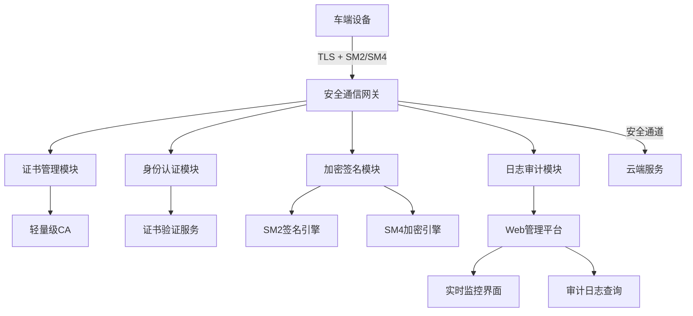
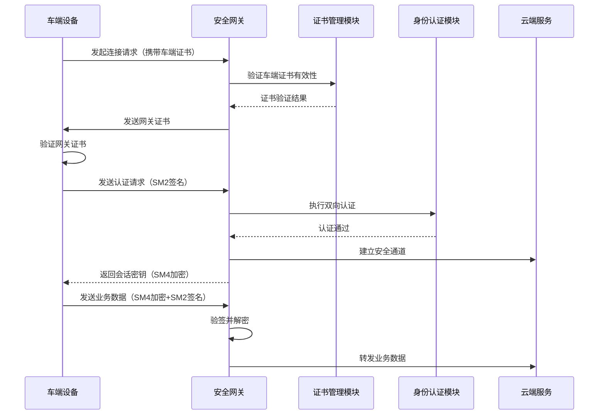
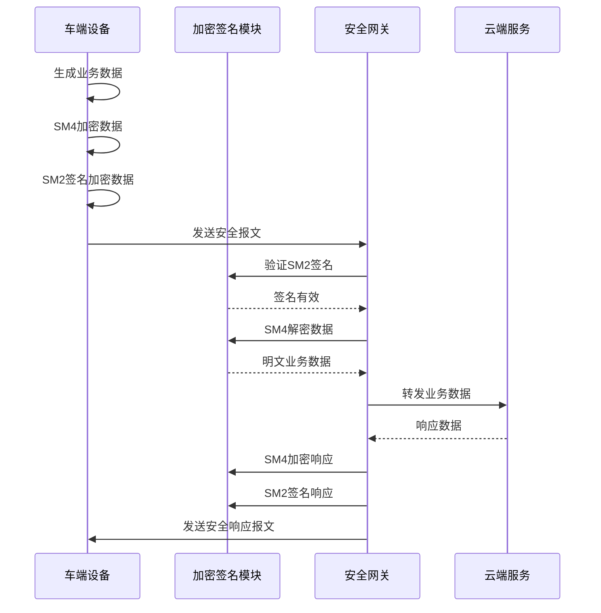
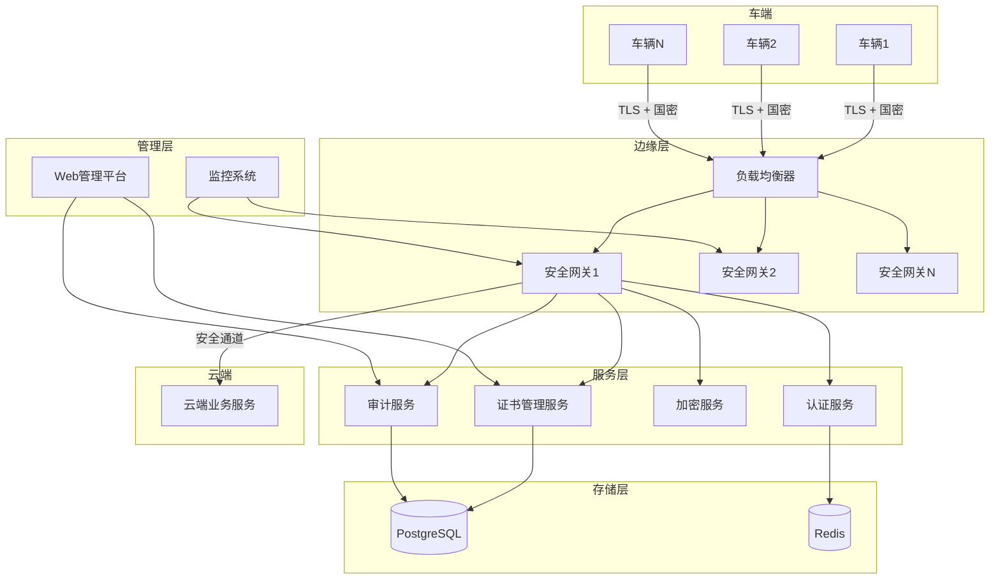

# 设计文档：车联网安全通信网关系统

## 概述

本系统是一个基于国密算法（SM2/SM4）的车联网安全通信网关，旨在保障车云通信的真实性、机密性与不可否认性。系统通过轻量级证书颁发机构（CA）建立信任根，实现车云双向身份认证，采用 SM4 对称加密保护业务数据，使用 SM2 数字签名确保数据完整性，并提供 Web 可视化管理平台实时监控安全通信过程。

系统核心功能包括：国密证书体系构建、车云双向身份认证、敏感数据加密与签名、可视化安全管理平台。该系统符合国家商用密码标准，有效防御身份伪造、中间人攻击及数据篡改等安全威胁。

## 系统架构



## 主要业务流程

### 车辆接入与认证流程




### 数据加密传输流程



## 组件与接口

### 组件 1：证书管理模块（Certificate Management Module）

**功能**：负责国密证书的颁发、存储、验证与撤销管理，建立系统信任根。

**接口**：
```pascal
INTERFACE CertificateManager
  issueCertificate(subject: SubjectInfo, publicKey: SM2PublicKey): Certificate
  verifyCertificate(cert: Certificate): ValidationResult
  revokeCertificate(serialNumber: String): Boolean
  getCertificateChain(cert: Certificate): CertificateChain
  checkCertificateExpiry(cert: Certificate): ExpiryStatus
END INTERFACE
```

**职责**：
- 为车端和云端签发符合国密标准的 SM2 数字证书
- 验证证书的有效性（签名、有效期、撤销状态）
- 管理证书撤销列表（CRL）
- 维护证书信任链


### 组件 2：身份认证模块（Authentication Module）

**功能**：实现车云双向身份认证，防御身份伪造和中间人攻击。

**接口**：
```pascal
INTERFACE AuthenticationModule
  authenticateVehicle(vehicleCert: Certificate, challenge: Bytes): AuthResult
  authenticateGateway(gatewayCert: Certificate): AuthResult
  generateChallenge(): Bytes
  verifyChallenge(response: SignedChallenge, publicKey: SM2PublicKey): Boolean
  establishSession(vehicleId: String, authToken: Token): SessionInfo
END INTERFACE
```

**职责**：
- 执行基于 SM2 证书的双向身份认证
- 生成并验证挑战-响应认证
- 建立安全会话并分配会话密钥
- 维护活跃会话状态

### 组件 3：加密签名模块（Encryption & Signature Module）

**功能**：提供 SM2/SM4 加密解密和数字签名验签服务。

**接口**：
```pascal
INTERFACE CryptoModule
  sm4Encrypt(plaintext: Bytes, key: SM4Key): Bytes
  sm4Decrypt(ciphertext: Bytes, key: SM4Key): Bytes
  sm2Sign(data: Bytes, privateKey: SM2PrivateKey): Signature
  sm2Verify(data: Bytes, signature: Signature, publicKey: SM2PublicKey): Boolean
  generateSM4Key(): SM4Key
  generateSM2KeyPair(): KeyPair
END INTERFACE
```

**职责**：
- 使用 SM4 算法加密和解密业务数据
- 使用 SM2 算法对数据进行签名和验签
- 生成和管理加密密钥
- 确保密钥的安全存储


### 组件 4：日志审计模块（Audit & Logging Module）

**功能**：记录所有安全事件和业务操作，支持审计追溯。

**接口**：
```pascal
INTERFACE AuditModule
  logAuthEvent(vehicleId: String, eventType: AuthEventType, result: Boolean): Void
  logDataTransfer(vehicleId: String, dataSize: Integer, encrypted: Boolean): Void
  logCertificateOperation(operation: CertOperation, certId: String): Void
  queryAuditLogs(filter: AuditFilter): AuditLogList
  exportAuditReport(startTime: Timestamp, endTime: Timestamp): Report
END INTERFACE
```

**职责**：
- 记录认证事件（成功/失败）
- 记录数据传输日志（加密状态、数据量）
- 记录证书操作（颁发、撤销）
- 提供日志查询和报表导出功能

### 组件 5：Web 管理平台（Web Management Platform）

**功能**：提供可视化界面，实时监控车辆状态和安全通信过程。

**接口**：
```pascal
INTERFACE WebManagementPlatform
  getOnlineVehicles(): VehicleList
  getVehicleStatus(vehicleId: String): VehicleStatus
  getRealtimeMetrics(): SecurityMetrics
  viewAuditLogs(filter: LogFilter): LogEntries
  manageCertificates(): CertificateManagementUI
  configureSecurityPolicy(policy: SecurityPolicy): Boolean
END INTERFACE
```

**职责**：
- 实时展示车辆在线状态
- 可视化展示加解密业务数据
- 提供认证日志查询界面
- 支持证书管理操作
- 配置安全策略


## 数据模型

### 模型 1：数字证书（Certificate）

```pascal
STRUCTURE Certificate
  version: Integer
  serialNumber: String
  issuer: DistinguishedName
  subject: DistinguishedName
  validFrom: Timestamp
  validTo: Timestamp
  publicKey: SM2PublicKey
  signature: Bytes
  signatureAlgorithm: String
  extensions: CertificateExtensions
END STRUCTURE
```

**验证规则**：
- serialNumber 必须唯一
- validFrom 必须早于 validTo
- 当前时间必须在 validFrom 和 validTo 之间
- signature 必须通过 CA 公钥验证
- signatureAlgorithm 必须为 "SM2"

### 模型 2：安全报文（SecureMessage）

```pascal
STRUCTURE SecureMessage
  header: MessageHeader
  encryptedPayload: Bytes
  signature: Bytes
  timestamp: Timestamp
  nonce: Bytes
END STRUCTURE

STRUCTURE MessageHeader
  version: Integer
  messageType: MessageType
  senderId: String
  receiverId: String
  sessionId: String
END STRUCTURE
```

**验证规则**：
- timestamp 不得超过当前时间 ±5 分钟（防重放攻击）
- nonce 必须唯一且长度为 16 字节
- signature 必须通过发送方公钥验证
- encryptedPayload 必须使用 SM4 加密


### 模型 3：会话信息（SessionInfo）

```pascal
STRUCTURE SessionInfo
  sessionId: String
  vehicleId: String
  sm4SessionKey: SM4Key
  establishedAt: Timestamp
  expiresAt: Timestamp
  status: SessionStatus
  lastActivityTime: Timestamp
END STRUCTURE

ENUMERATION SessionStatus
  ACTIVE
  EXPIRED
  REVOKED
END ENUMERATION
```

**验证规则**：
- sessionId 必须唯一且长度为 32 字节
- sm4SessionKey 必须为 128 位或 256 位
- expiresAt 必须晚于 establishedAt
- status 为 ACTIVE 时，当前时间必须在 expiresAt 之前
- lastActivityTime 必须在 establishedAt 和当前时间之间

### 模型 4：认证结果（AuthResult）

```pascal
STRUCTURE AuthResult
  VARIANT Success(token: AuthToken, sessionKey: SM4Key)
  VARIANT Failure(errorCode: ErrorCode, errorMessage: String)
END STRUCTURE

STRUCTURE AuthToken
  vehicleId: String
  issuedAt: Timestamp
  expiresAt: Timestamp
  permissions: PermissionSet
  signature: Bytes
END STRUCTURE

ENUMERATION ErrorCode
  INVALID_CERTIFICATE
  CERTIFICATE_EXPIRED
  CERTIFICATE_REVOKED
  SIGNATURE_VERIFICATION_FAILED
  CHALLENGE_RESPONSE_INVALID
  UNKNOWN_ERROR
END ENUMERATION
```

**验证规则**：
- Success 变体必须包含有效的 token 和 sessionKey
- Failure 变体必须包含有效的 errorCode
- AuthToken 的 signature 必须通过网关私钥签名
- expiresAt 必须晚于 issuedAt


### 模型 5：审计日志（AuditLog）

```pascal
STRUCTURE AuditLog
  logId: String
  timestamp: Timestamp
  eventType: EventType
  vehicleId: String
  operationResult: Boolean
  details: String
  ipAddress: String
END STRUCTURE

ENUMERATION EventType
  VEHICLE_CONNECT
  VEHICLE_DISCONNECT
  AUTHENTICATION_SUCCESS
  AUTHENTICATION_FAILURE
  DATA_ENCRYPTED
  DATA_DECRYPTED
  CERTIFICATE_ISSUED
  CERTIFICATE_REVOKED
  SIGNATURE_VERIFIED
  SIGNATURE_FAILED
END ENUMERATION
```

**验证规则**：
- logId 必须唯一
- timestamp 必须为有效时间戳
- vehicleId 必须符合车辆标识格式
- details 长度不超过 1024 字符

## 核心算法与形式化规范

### 算法 1：车云双向身份认证

```pascal
ALGORITHM mutualAuthentication(vehicleCert, gatewayCert, vehiclePrivateKey, gatewayPrivateKey)
INPUT: 
  vehicleCert: Certificate (车端证书)
  gatewayCert: Certificate (网关证书)
  vehiclePrivateKey: SM2PrivateKey (车端私钥)
  gatewayPrivateKey: SM2PrivateKey (网关私钥)
OUTPUT: 
  result: AuthResult (认证结果)

BEGIN
  // 前置条件验证
  ASSERT vehicleCert IS NOT NULL
  ASSERT gatewayCert IS NOT NULL
  ASSERT verifyCertificate(vehicleCert) = VALID
  ASSERT verifyCertificate(gatewayCert) = VALID
  
  // 步骤 1：网关验证车端证书
  vehicleCertValid ← verifyCertificate(vehicleCert)
  IF vehicleCertValid ≠ VALID THEN
    RETURN Failure(INVALID_CERTIFICATE, "车端证书验证失败")
  END IF
  
  // 步骤 2：车端验证网关证书
  gatewayCertValid ← verifyCertificate(gatewayCert)
  IF gatewayCertValid ≠ VALID THEN
    RETURN Failure(INVALID_CERTIFICATE, "网关证书验证失败")
  END IF
  
  // 步骤 3：网关生成挑战值
  challenge ← generateRandomBytes(32)
  
  // 步骤 4：车端使用私钥签名挑战值
  vehicleResponse ← sm2Sign(challenge, vehiclePrivateKey)
  
  // 步骤 5：网关验证车端签名
  vehicleSignatureValid ← sm2Verify(challenge, vehicleResponse, vehicleCert.publicKey)
  IF NOT vehicleSignatureValid THEN
    RETURN Failure(SIGNATURE_VERIFICATION_FAILED, "车端签名验证失败")
  END IF
  
  // 步骤 6：车端生成挑战值
  vehicleChallenge ← generateRandomBytes(32)
  
  // 步骤 7：网关使用私钥签名挑战值
  gatewayResponse ← sm2Sign(vehicleChallenge, gatewayPrivateKey)
  
  // 步骤 8：车端验证网关签名
  gatewaySignatureValid ← sm2Verify(vehicleChallenge, gatewayResponse, gatewayCert.publicKey)
  IF NOT gatewaySignatureValid THEN
    RETURN Failure(SIGNATURE_VERIFICATION_FAILED, "网关签名验证失败")
  END IF
  
  // 步骤 9：生成会话密钥
  sessionKey ← generateSM4Key()
  
  // 步骤 10：生成认证令牌
  token ← createAuthToken(vehicleCert.subject.vehicleId, sessionKey)
  
  // 后置条件验证
  ASSERT token IS NOT NULL
  ASSERT sessionKey.length = 16 OR sessionKey.length = 32
  
  RETURN Success(token, sessionKey)
END
```

**前置条件**：
- vehicleCert 和 gatewayCert 必须非空且格式正确
- 两个证书必须在有效期内且未被撤销
- vehiclePrivateKey 和 gatewayPrivateKey 必须与对应证书的公钥匹配

**后置条件**：
- 如果认证成功，返回 Success 包含有效的 token 和 sessionKey
- 如果认证失败，返回 Failure 包含具体错误码和错误信息
- 认证过程不会修改输入参数
- 生成的 sessionKey 长度为 16 或 32 字节

**循环不变式**：无循环


### 算法 2：安全数据传输

```pascal
ALGORITHM secureDataTransmission(plainData, sessionKey, senderPrivateKey, receiverPublicKey)
INPUT:
  plainData: Bytes (明文业务数据)
  sessionKey: SM4Key (会话密钥)
  senderPrivateKey: SM2PrivateKey (发送方私钥)
  receiverPublicKey: SM2PublicKey (接收方公钥)
OUTPUT:
  secureMessage: SecureMessage (安全报文)

BEGIN
  // 前置条件验证
  ASSERT plainData IS NOT NULL AND plainData.length > 0
  ASSERT sessionKey.length = 16 OR sessionKey.length = 32
  ASSERT senderPrivateKey IS NOT NULL
  
  // 步骤 1：生成消息头
  header ← createMessageHeader(SENDER_ID, RECEIVER_ID, SESSION_ID)
  
  // 步骤 2：生成随机数（防重放攻击）
  nonce ← generateRandomBytes(16)
  timestamp ← getCurrentTimestamp()
  
  // 步骤 3：使用 SM4 加密业务数据
  encryptedPayload ← sm4Encrypt(plainData, sessionKey)
  
  // 步骤 4：构造待签名数据
  dataToSign ← concatenate(header, encryptedPayload, timestamp, nonce)
  
  // 步骤 5：使用 SM2 签名
  signature ← sm2Sign(dataToSign, senderPrivateKey)
  
  // 步骤 6：构造安全报文
  secureMessage ← SecureMessage {
    header: header,
    encryptedPayload: encryptedPayload,
    signature: signature,
    timestamp: timestamp,
    nonce: nonce
  }
  
  // 后置条件验证
  ASSERT secureMessage.encryptedPayload IS NOT NULL
  ASSERT secureMessage.signature IS NOT NULL
  ASSERT secureMessage.nonce.length = 16
  
  RETURN secureMessage
END
```

**前置条件**：
- plainData 非空且长度大于 0
- sessionKey 长度为 16 字节（SM4-128）或 32 字节（SM4-256）
- senderPrivateKey 必须有效且与发送方证书匹配

**后置条件**：
- 返回的 secureMessage 包含加密的 payload
- signature 可通过发送方公钥验证
- nonce 长度为 16 字节且唯一
- timestamp 在合理时间范围内
- 原始 plainData 未被修改

**循环不变式**：无循环


### 算法 3：安全报文验证与解密

```pascal
ALGORITHM verifyAndDecryptMessage(secureMessage, sessionKey, senderPublicKey)
INPUT:
  secureMessage: SecureMessage (安全报文)
  sessionKey: SM4Key (会话密钥)
  senderPublicKey: SM2PublicKey (发送方公钥)
OUTPUT:
  result: VARIANT Success(plainData: Bytes) | Failure(error: String)

BEGIN
  // 前置条件验证
  ASSERT secureMessage IS NOT NULL
  ASSERT sessionKey IS NOT NULL
  ASSERT senderPublicKey IS NOT NULL
  
  // 步骤 1：验证时间戳（防重放攻击）
  currentTime ← getCurrentTimestamp()
  timeDiff ← abs(currentTime - secureMessage.timestamp)
  
  IF timeDiff > 300 THEN  // 超过 5 分钟
    RETURN Failure("时间戳验证失败：消息过期")
  END IF
  
  // 步骤 2：检查 nonce 是否已使用（防重放攻击）
  IF isNonceUsed(secureMessage.nonce) THEN
    RETURN Failure("Nonce 已使用：检测到重放攻击")
  END IF
  
  // 步骤 3：构造待验签数据
  dataToVerify ← concatenate(
    secureMessage.header,
    secureMessage.encryptedPayload,
    secureMessage.timestamp,
    secureMessage.nonce
  )
  
  // 步骤 4：验证 SM2 签名
  signatureValid ← sm2Verify(dataToVerify, secureMessage.signature, senderPublicKey)
  
  IF NOT signatureValid THEN
    RETURN Failure("签名验证失败：数据可能被篡改")
  END IF
  
  // 步骤 5：使用 SM4 解密数据
  plainData ← sm4Decrypt(secureMessage.encryptedPayload, sessionKey)
  
  IF plainData IS NULL THEN
    RETURN Failure("解密失败：会话密钥无效")
  END IF
  
  // 步骤 6：标记 nonce 已使用
  markNonceAsUsed(secureMessage.nonce)
  
  // 后置条件验证
  ASSERT plainData IS NOT NULL
  ASSERT plainData.length > 0
  
  RETURN Success(plainData)
END
```

**前置条件**：
- secureMessage 必须非空且格式正确
- sessionKey 必须与加密时使用的密钥相同
- senderPublicKey 必须与发送方证书的公钥匹配

**后置条件**：
- 如果验证成功，返回 Success 包含解密后的明文数据
- 如果验证失败，返回 Failure 包含具体错误信息
- 使用过的 nonce 被标记，防止重放攻击
- 原始 secureMessage 未被修改

**循环不变式**：无循环


### 算法 4：证书颁发

```pascal
ALGORITHM issueCertificate(subjectInfo, publicKey, caPrivateKey)
INPUT:
  subjectInfo: SubjectInfo (证书主体信息)
  publicKey: SM2PublicKey (申请者公钥)
  caPrivateKey: SM2PrivateKey (CA 私钥)
OUTPUT:
  certificate: Certificate (签发的证书)

BEGIN
  // 前置条件验证
  ASSERT subjectInfo IS NOT NULL
  ASSERT subjectInfo.vehicleId IS NOT EMPTY
  ASSERT publicKey IS NOT NULL
  ASSERT caPrivateKey IS NOT NULL
  
  // 步骤 1：生成唯一序列号
  serialNumber ← generateUniqueSerialNumber()
  
  // 步骤 2：设置证书有效期
  validFrom ← getCurrentTimestamp()
  validTo ← validFrom + (365 * 24 * 3600)  // 有效期 1 年
  
  // 步骤 3：构造证书主体
  certificate ← Certificate {
    version: 3,
    serialNumber: serialNumber,
    issuer: CA_DISTINGUISHED_NAME,
    subject: createDistinguishedName(subjectInfo),
    validFrom: validFrom,
    validTo: validTo,
    publicKey: publicKey,
    signatureAlgorithm: "SM2",
    extensions: createCertificateExtensions(subjectInfo)
  }
  
  // 步骤 4：构造待签名数据（TBS Certificate）
  tbsCertificate ← encodeTBSCertificate(certificate)
  
  // 步骤 5：使用 CA 私钥签名
  signature ← sm2Sign(tbsCertificate, caPrivateKey)
  
  // 步骤 6：将签名附加到证书
  certificate.signature ← signature
  
  // 步骤 7：存储证书到数据库
  storeCertificate(certificate)
  
  // 步骤 8：记录审计日志
  logCertificateOperation(CERTIFICATE_ISSUED, serialNumber)
  
  // 后置条件验证
  ASSERT certificate.signature IS NOT NULL
  ASSERT certificate.serialNumber IS UNIQUE
  ASSERT certificate.validFrom < certificate.validTo
  ASSERT sm2Verify(tbsCertificate, certificate.signature, CA_PUBLIC_KEY) = TRUE
  
  RETURN certificate
END
```

**前置条件**：
- subjectInfo 必须包含有效的车辆标识信息
- publicKey 必须是有效的 SM2 公钥
- caPrivateKey 必须是 CA 的有效私钥
- CA 证书必须在有效期内

**后置条件**：
- 返回的证书包含有效的签名
- 证书序列号在系统中唯一
- 证书有效期设置正确（validFrom < validTo）
- 证书签名可通过 CA 公钥验证
- 证书已存储到数据库
- 审计日志已记录

**循环不变式**：无循环


### 算法 5：证书验证

```pascal
ALGORITHM verifyCertificate(certificate, caPublicKey, crlList)
INPUT:
  certificate: Certificate (待验证证书)
  caPublicKey: SM2PublicKey (CA 公钥)
  crlList: CertificateRevocationList (证书撤销列表)
OUTPUT:
  result: ValidationResult (验证结果)

BEGIN
  // 前置条件验证
  ASSERT certificate IS NOT NULL
  ASSERT caPublicKey IS NOT NULL
  ASSERT crlList IS NOT NULL
  
  // 步骤 1：检查证书格式
  IF NOT isValidCertificateFormat(certificate) THEN
    RETURN ValidationResult(INVALID, "证书格式错误")
  END IF
  
  // 步骤 2：检查证书有效期
  currentTime ← getCurrentTimestamp()
  
  IF currentTime < certificate.validFrom THEN
    RETURN ValidationResult(INVALID, "证书尚未生效")
  END IF
  
  IF currentTime > certificate.validTo THEN
    RETURN ValidationResult(INVALID, "证书已过期")
  END IF
  
  // 步骤 3：检查证书是否被撤销
  FOR each revokedCert IN crlList DO
    IF revokedCert.serialNumber = certificate.serialNumber THEN
      RETURN ValidationResult(REVOKED, "证书已被撤销")
    END IF
  END FOR
  
  // 循环不变式：所有已检查的撤销证书序列号都不匹配
  
  // 步骤 4：验证证书签名
  tbsCertificate ← encodeTBSCertificate(certificate)
  signatureValid ← sm2Verify(tbsCertificate, certificate.signature, caPublicKey)
  
  IF NOT signatureValid THEN
    RETURN ValidationResult(INVALID, "证书签名验证失败")
  END IF
  
  // 步骤 5：验证证书链（如果需要）
  IF certificate.issuer ≠ CA_DISTINGUISHED_NAME THEN
    chainValid ← verifyCertificateChain(certificate, caPublicKey)
    IF NOT chainValid THEN
      RETURN ValidationResult(INVALID, "证书链验证失败")
    END IF
  END IF
  
  // 后置条件验证
  ASSERT result.status = VALID
  
  RETURN ValidationResult(VALID, "证书验证通过")
END
```

**前置条件**：
- certificate 必须非空且格式正确
- caPublicKey 必须是有效的 CA 公钥
- crlList 必须是最新的证书撤销列表

**后置条件**：
- 返回的 ValidationResult 包含明确的验证状态
- 如果验证失败，包含具体的失败原因
- 证书对象未被修改
- 验证过程无副作用

**循环不变式**：
- 在遍历 crlList 时，所有已检查的撤销证书序列号都不匹配当前证书


## 关键函数与形式化规范

### 函数 1：sm4Encrypt()

```pascal
FUNCTION sm4Encrypt(plaintext, key)
INPUT: 
  plaintext: Bytes (明文数据)
  key: SM4Key (128位或256位密钥)
OUTPUT: 
  ciphertext: Bytes (密文数据)
```

**前置条件**：
- plaintext 非空且长度大于 0
- key 长度为 16 字节（128位）或 32 字节（256位）
- key 必须是通过安全随机数生成器生成的

**后置条件**：
- 返回的 ciphertext 非空
- ciphertext 长度为 plaintext 长度向上取整到 16 字节的倍数
- 使用相同的 key 调用 sm4Decrypt(ciphertext, key) 可恢复原始 plaintext
- plaintext 参数未被修改

**循环不变式**：
- SM4 算法内部循环：每轮加密后中间状态保持 128 位长度

### 函数 2：sm4Decrypt()

```pascal
FUNCTION sm4Decrypt(ciphertext, key)
INPUT: 
  ciphertext: Bytes (密文数据)
  key: SM4Key (128位或256位密钥)
OUTPUT: 
  plaintext: Bytes (明文数据)
```

**前置条件**：
- ciphertext 非空且长度为 16 字节的倍数
- key 长度为 16 字节（128位）或 32 字节（256位）
- key 必须与加密时使用的密钥相同
- ciphertext 必须是通过 sm4Encrypt 生成的有效密文

**后置条件**：
- 如果 key 正确，返回原始明文数据
- 如果 key 错误，返回无效数据或抛出异常
- ciphertext 参数未被修改
- 解密操作是加密操作的逆运算

**循环不变式**：
- SM4 算法内部循环：每轮解密后中间状态保持 128 位长度


### 函数 3：sm2Sign()

```pascal
FUNCTION sm2Sign(data, privateKey)
INPUT: 
  data: Bytes (待签名数据)
  privateKey: SM2PrivateKey (SM2 私钥)
OUTPUT: 
  signature: Signature (数字签名)
```

**前置条件**：
- data 非空且长度大于 0
- privateKey 必须是有效的 SM2 私钥（256 位）
- privateKey 必须与对应的公钥配对

**后置条件**：
- 返回的 signature 长度为 64 字节（r 和 s 各 32 字节）
- signature 可通过对应的公钥验证
- 相同的 data 和 privateKey 每次生成的签名可能不同（因为包含随机数 k）
- data 和 privateKey 参数未被修改
- 签名满足 SM2 算法的数学性质

**循环不变式**：无循环（SM2 签名算法内部循环由底层密码库处理）

### 函数 4：sm2Verify()

```pascal
FUNCTION sm2Verify(data, signature, publicKey)
INPUT: 
  data: Bytes (原始数据)
  signature: Signature (数字签名)
  publicKey: SM2PublicKey (SM2 公钥)
OUTPUT: 
  isValid: Boolean (验证结果)
```

**前置条件**：
- data 非空且长度大于 0
- signature 长度为 64 字节
- publicKey 必须是有效的 SM2 公钥（压缩或非压缩格式）
- signature 必须是通过 SM2 算法生成的

**后置条件**：
- 如果 signature 是使用对应私钥对 data 签名的结果，返回 true
- 如果 signature 无效或 data 被篡改，返回 false
- 所有输入参数未被修改
- 验证操作无副作用

**循环不变式**：无循环（SM2 验签算法内部循环由底层密码库处理）


### 函数 5：generateSM4Key()

```pascal
FUNCTION generateSM4Key()
INPUT: 无
OUTPUT: 
  key: SM4Key (SM4 密钥)
```

**前置条件**：
- 系统必须有可用的密码学安全随机数生成器（CSRNG）
- 随机数生成器必须已正确初始化

**后置条件**：
- 返回的 key 长度为 16 字节（128 位）或 32 字节（256 位）
- key 具有足够的熵（至少 128 位安全强度）
- 每次调用生成的 key 都是唯一的（概率上）
- key 通过密码学安全随机数生成器生成

**循环不变式**：无循环

### 函数 6：generateSM2KeyPair()

```pascal
FUNCTION generateSM2KeyPair()
INPUT: 无
OUTPUT: 
  keyPair: KeyPair (SM2 密钥对)
```

**前置条件**：
- 系统必须有可用的密码学安全随机数生成器
- SM2 椭圆曲线参数已正确配置

**后置条件**：
- 返回的 keyPair 包含有效的 privateKey 和 publicKey
- privateKey 长度为 32 字节（256 位）
- publicKey 为椭圆曲线上的点（压缩格式 33 字节或非压缩格式 65 字节）
- publicKey 可从 privateKey 推导得出
- privateKey 具有足够的熵（256 位安全强度）
- 每次调用生成的密钥对都是唯一的（概率上）

**循环不变式**：无循环


### 函数 7：establishSession()

```pascal
FUNCTION establishSession(vehicleId, authToken)
INPUT: 
  vehicleId: String (车辆标识)
  authToken: AuthToken (认证令牌)
OUTPUT: 
  sessionInfo: SessionInfo (会话信息)
```

**前置条件**：
- vehicleId 非空且符合车辆标识格式
- authToken 必须有效且未过期
- authToken 的签名必须通过验证
- vehicleId 必须与 authToken 中的 vehicleId 匹配

**后置条件**：
- 返回的 sessionInfo 包含唯一的 sessionId
- sessionInfo.sm4SessionKey 已生成且长度为 16 或 32 字节
- sessionInfo.status 为 ACTIVE
- sessionInfo.expiresAt 晚于 establishedAt
- 会话信息已存储到会话管理器
- 会话建立事件已记录到审计日志

**循环不变式**：无循环

### 函数 8：verifyCertificate()

```pascal
FUNCTION verifyCertificate(certificate)
INPUT: 
  certificate: Certificate (待验证证书)
OUTPUT: 
  result: ValidationResult (验证结果)
```

**前置条件**：
- certificate 非空且格式正确
- CA 公钥可用
- 证书撤销列表（CRL）已加载且为最新

**后置条件**：
- 返回的 result 包含明确的验证状态（VALID、INVALID、REVOKED）
- 如果验证失败，result 包含具体的失败原因
- certificate 参数未被修改
- 验证过程无副作用
- 验证结果可缓存以提高性能

**循环不变式**：
- 在遍历 CRL 时，所有已检查的撤销证书都不匹配当前证书


## 示例用法

### 示例 1：车辆接入与认证

```pascal
SEQUENCE
  // 车端准备
  vehicleKeyPair ← generateSM2KeyPair()
  vehicleCert ← requestCertificateFromCA(VEHICLE_INFO, vehicleKeyPair.publicKey)
  
  // 网关准备
  gatewayKeyPair ← generateSM2KeyPair()
  gatewayCert ← requestCertificateFromCA(GATEWAY_INFO, gatewayKeyPair.publicKey)
  
  // 执行双向认证
  authResult ← mutualAuthentication(
    vehicleCert,
    gatewayCert,
    vehicleKeyPair.privateKey,
    gatewayKeyPair.privateKey
  )
  
  // 处理认证结果
  IF authResult IS Success THEN
    DISPLAY "认证成功"
    sessionInfo ← establishSession(VEHICLE_ID, authResult.token)
    STORE authResult.sessionKey IN secureStorage
    DISPLAY "会话已建立，会话ID: " + sessionInfo.sessionId
  ELSE
    DISPLAY "认证失败: " + authResult.errorMessage
    LOG_ERROR authResult.errorCode
  END IF
END SEQUENCE
```

### 示例 2：安全数据传输

```pascal
SEQUENCE
  // 车端发送数据
  businessData ← collectVehicleData()  // 收集车辆业务数据
  
  sessionKey ← getSessionKey(SESSION_ID)
  vehiclePrivateKey ← loadPrivateKey(VEHICLE_ID)
  gatewayPublicKey ← loadPublicKey(GATEWAY_ID)
  
  // 加密并签名数据
  secureMsg ← secureDataTransmission(
    businessData,
    sessionKey,
    vehiclePrivateKey,
    gatewayPublicKey
  )
  
  // 发送安全报文
  SEND secureMsg TO gateway
  
  // 网关接收并验证
  receivedMsg ← RECEIVE FROM vehicle
  vehiclePublicKey ← loadPublicKey(VEHICLE_ID)
  
  decryptResult ← verifyAndDecryptMessage(
    receivedMsg,
    sessionKey,
    vehiclePublicKey
  )
  
  IF decryptResult IS Success THEN
    DISPLAY "数据接收成功"
    PROCESS decryptResult.plainData
    LOG_AUDIT "数据传输成功", VEHICLE_ID, decryptResult.plainData.length
  ELSE
    DISPLAY "数据验证失败: " + decryptResult.error
    LOG_SECURITY_EVENT "数据验证失败", VEHICLE_ID, decryptResult.error
  END IF
END SEQUENCE
```


### 示例 3：证书颁发与验证

```pascal
SEQUENCE
  // CA 初始化
  caKeyPair ← generateSM2KeyPair()
  caPrivateKey ← caKeyPair.privateKey
  caPublicKey ← caKeyPair.publicKey
  
  // 车辆申请证书
  vehicleKeyPair ← generateSM2KeyPair()
  vehicleSubjectInfo ← SubjectInfo {
    vehicleId: "VIN123456789",
    organization: "某汽车制造商",
    country: "CN"
  }
  
  // CA 颁发证书
  vehicleCert ← issueCertificate(
    vehicleSubjectInfo,
    vehicleKeyPair.publicKey,
    caPrivateKey
  )
  
  DISPLAY "证书颁发成功，序列号: " + vehicleCert.serialNumber
  
  // 验证证书
  crlList ← loadCertificateRevocationList()
  validationResult ← verifyCertificate(vehicleCert, caPublicKey, crlList)
  
  IF validationResult.status = VALID THEN
    DISPLAY "证书验证通过"
  ELSE
    DISPLAY "证书验证失败: " + validationResult.message
  END IF
END SEQUENCE
```

### 示例 4：完整的车云通信流程

```pascal
SEQUENCE
  // 阶段 1：系统初始化
  DISPLAY "初始化安全通信网关系统..."
  
  caKeyPair ← generateSM2KeyPair()
  gatewayKeyPair ← generateSM2KeyPair()
  gatewayCert ← issueCertificate(GATEWAY_INFO, gatewayKeyPair.publicKey, caKeyPair.privateKey)
  
  DISPLAY "网关证书已颁发"
  
  // 阶段 2：车辆注册
  vehicleKeyPair ← generateSM2KeyPair()
  vehicleCert ← issueCertificate(VEHICLE_INFO, vehicleKeyPair.publicKey, caKeyPair.privateKey)
  
  DISPLAY "车辆证书已颁发"
  
  // 阶段 3：车辆接入认证
  authResult ← mutualAuthentication(
    vehicleCert,
    gatewayCert,
    vehicleKeyPair.privateKey,
    gatewayKeyPair.privateKey
  )
  
  IF authResult IS NOT Success THEN
    DISPLAY "认证失败，终止连接"
    EXIT
  END IF
  
  sessionInfo ← establishSession(VEHICLE_ID, authResult.token)
  DISPLAY "会话建立成功，会话ID: " + sessionInfo.sessionId
  
  // 阶段 4：安全数据传输
  FOR i FROM 1 TO 10 DO
    // 车端发送数据
    vehicleData ← generateVehicleData(i)
    secureMsg ← secureDataTransmission(
      vehicleData,
      sessionInfo.sm4SessionKey,
      vehicleKeyPair.privateKey,
      gatewayKeyPair.publicKey
    )
    
    SEND secureMsg TO gateway
    
    // 网关接收并处理
    decryptResult ← verifyAndDecryptMessage(
      secureMsg,
      sessionInfo.sm4SessionKey,
      vehicleKeyPair.publicKey
    )
    
    IF decryptResult IS Success THEN
      DISPLAY "第 " + i + " 条数据传输成功"
      FORWARD decryptResult.plainData TO cloudService
    ELSE
      DISPLAY "第 " + i + " 条数据传输失败: " + decryptResult.error
    END IF
  END FOR
  
  // 阶段 5：会话关闭
  DISPLAY "关闭会话..."
  closeSession(sessionInfo.sessionId)
  DISPLAY "通信流程完成"
END SEQUENCE
```


## 正确性属性

*属性是一种特征或行为，应该在系统的所有有效执行中保持为真——本质上是关于系统应该做什么的形式化陈述。属性作为人类可读规范和机器可验证正确性保证之间的桥梁。*

### 属性 1：认证完整性

*对于任意*有效的车端证书和网关证书，如果双向认证成功，则证书必须有效、私钥必须与证书公钥匹配、会话密钥必须有效、认证令牌必须有效。

**验证需求：需求 2.1, 2.2, 2.3, 2.6, 4.1, 4.5, 4.8, 4.9, 5.2**

### 属性 2：加密解密往返

*对于任意*明文数据和会话密钥，使用 SM4 加密后再解密应该恢复原始明文。

**验证需求：需求 6.1, 6.4**

### 属性 3：签名验证一致性

*对于任意*数据和 SM2 密钥对，使用私钥签名后必须能通过对应公钥验证。

**验证需求：需求 7.1, 7.3**
### 属性 4：数据篡改检测

*对于任意*数据和签名，如果数据被修改，则签名验证必须失败。

**验证需求：需求 7.4, 17.2**

### 属性 5：防重放攻击

*对于任意*安全报文，第一次验证成功后，nonce 被标记为已使用，再次使用相同报文验证必须失败。

**验证需求：需求 9.3, 9.4, 9.5**

### 属性 6：时间戳过期检测

*对于任意*安全报文，如果时间戳与当前时间差值超过 5 分钟，则验证必须失败。

**验证需求：需求 9.1, 9.2**

### 属性 7：证书过期拒绝

*对于任意*证书，如果当前时间晚于证书的 validTo，则验证必须返回"证书已过期"错误。

**验证需求：需求 2.3, 17.1**

### 属性 8：证书未生效拒绝

*对于任意*证书，如果当前时间早于证书的 validFrom，则验证必须返回"证书尚未生效"错误。

**验证需求：需求 2.2, 17.1**

### 属性 9：证书撤销检测

*对于任意*证书，如果证书序列号在 CRL 中，则验证必须返回"证书已被撤销"错误。

**验证需求：需求 2.4, 2.5, 3.1**

### 属性 10：证书签名验证

*对于任意*证书，如果证书签名无法通过 CA 公钥验证，则验证必须返回"证书签名验证失败"错误。

**验证需求：需求 2.6, 2.7**

### 属性 11：会话密钥唯一性

*对于任意*两个不同的会话，它们的会话密钥必须不同。

**验证需求：需求 5.1, 5.2, 10.6**

### 属性 12：证书序列号唯一性

*对于任意*多个证书颁发操作，所有生成的证书序列号必须唯一。

**验证需求：需求 1.1**

### 属性 13：证书有效期不变式

*对于任意*颁发的证书，validFrom 必须早于 validTo。

**验证需求：需求 1.4**

### 属性 14：SM4 密文长度

*对于任意*明文数据，SM4 加密后的密文长度必须是明文长度向上取整到 16 字节的倍数。

**验证需求：需求 6.3**

### 属性 15：SM2 签名长度

*对于任意*数据，SM2 签名后的签名长度必须为 64 字节。

**验证需求：需求 7.2**

### 属性 16：Nonce 唯一性

*对于任意*安全报文，生成的 nonce 必须是 16 字节且唯一。

**验证需求：需求 8.1**

### 属性 17：安全报文完整性

*对于任意*安全报文，必须包含 header、encryptedPayload、signature、timestamp 和 nonce 字段。

**验证需求：需求 8.6**

### 属性 18：会话过期拒绝

*对于任意*过期的会话，使用该会话密钥的操作必须被拒绝。

**验证需求：需求 17.3**

### 属性 19：解密失败处理

*对于任意*加密数据，如果使用错误的密钥解密，则必须返回 DECRYPTION_FAILED 错误。

**验证需求：需求 6.5, 17.5**

### 属性 20：审计日志唯一标识

*对于任意*审计日志记录，每条日志必须有唯一的日志标识符。

**验证需求：需求 11.5**

### 属性 21：证书颁发持久化

*对于任意*颁发的证书，颁发后必须能从数据库中查询到。

**验证需求：需求 1.5**

### 属性 22：会话持久化

*对于任意*创建的会话，创建后必须能从 Redis 中查询到。

**验证需求：需求 5.4**

### 属性 23：审计日志持久化

*对于任意*审计日志，记录后必须能从 PostgreSQL 中查询到。

**验证需求：需求 11.7**

### 属性 24：SM4 密钥长度

*对于任意*生成的 SM4 密钥，长度必须为 16 字节或 32 字节。

**验证需求：需求 10.2**

### 属性 25：SM2 私钥长度

*对于任意*生成的 SM2 私钥，长度必须为 32 字节。

**验证需求：需求 10.4**

### 属性 26：SM2 公钥有效性

*对于任意*生成的 SM2 密钥对，公钥必须是椭圆曲线上的有效点。

**验证需求：需求 10.5**


## 错误处理

### 错误场景 1：证书验证失败

**条件**：车端或网关提供的证书无效、过期或被撤销

**响应**：
- 立即终止认证流程
- 返回具体的错误码（INVALID_CERTIFICATE、CERTIFICATE_EXPIRED、CERTIFICATE_REVOKED）
- 记录安全事件到审计日志
- 拒绝建立连接

**恢复**：
- 车端需要重新申请有效证书
- 管理员需要检查证书撤销列表是否正确
- 系统自动清理失败的认证尝试记录

### 错误场景 2：签名验证失败

**条件**：接收到的数据签名无法通过发送方公钥验证

**响应**：
- 拒绝接受该数据
- 返回 SIGNATURE_VERIFICATION_FAILED 错误
- 记录安全警告到审计日志（可能的数据篡改）
- 增加该车辆的安全风险评分

**恢复**：
- 请求发送方重新发送数据
- 如果持续失败，暂时阻止该车辆的通信
- 管理员介入调查可能的安全威胁

### 错误场景 3：会话密钥过期

**条件**：当前会话超过有效期或被手动撤销

**响应**：
- 拒绝使用该会话密钥的所有操作
- 返回 SESSION_EXPIRED 错误
- 通知车端会话已失效
- 清理过期的会话信息

**恢复**：
- 车端重新发起认证流程
- 建立新的会话并获取新的会话密钥
- 系统自动清理过期会话

### 错误场景 4：重放攻击检测

**条件**：检测到相同的 nonce 被重复使用或时间戳异常

**响应**：
- 立即拒绝该消息
- 返回 REPLAY_ATTACK_DETECTED 错误
- 记录高优先级安全事件
- 触发安全告警通知管理员

**恢复**：
- 暂时阻止该车辆的通信（冷却期）
- 要求车端重新认证
- 管理员审查该车辆的通信历史


### 错误场景 5：加密解密失败

**条件**：使用错误的密钥解密数据或数据格式损坏

**响应**：
- 返回 DECRYPTION_FAILED 错误
- 记录解密失败事件
- 不泄露任何关于密钥或数据的信息（防止侧信道攻击）
- 丢弃无法解密的数据

**恢复**：
- 检查会话密钥是否同步
- 如果密钥不匹配，重新协商会话密钥
- 请求发送方重新发送数据

### 错误场景 6：CA 服务不可用

**条件**：证书颁发机构服务故障或网络不可达

**响应**：
- 返回 CA_SERVICE_UNAVAILABLE 错误
- 使用缓存的证书和 CRL（如果在有效期内）
- 记录服务故障事件
- 延迟非紧急的证书操作

**恢复**：
- 定期重试连接 CA 服务
- 一旦 CA 服务恢复，同步最新的 CRL
- 处理积压的证书颁发请求

### 错误场景 7：并发会话冲突

**条件**：同一车辆尝试建立多个并发会话

**响应**：
- 根据配置策略处理：
  - 拒绝新会话（保持现有会话）
  - 或终止旧会话（接受新会话）
- 返回 CONCURRENT_SESSION_CONFLICT 错误
- 记录会话冲突事件

**恢复**：
- 通知车端当前会话状态
- 车端根据业务需求选择保持或重建会话
- 清理冲突的会话信息

## 测试策略

### 单元测试方法

**测试范围**：
- 所有密码学函数（sm4Encrypt、sm4Decrypt、sm2Sign、sm2Verify）
- 证书管理函数（issueCertificate、verifyCertificate）
- 会话管理函数（establishSession、closeSession）
- 数据验证函数（validateInput、checkTimestamp）

**测试用例设计**：
1. 正常路径测试：验证函数在正常输入下的正确行为
2. 边界条件测试：测试空输入、最大长度输入、边界值
3. 异常路径测试：测试无效输入、错误密钥、过期证书
4. 性能测试：测试加密解密的性能指标

**覆盖率目标**：
- 代码覆盖率 ≥ 90%
- 分支覆盖率 ≥ 85%
- 关键安全函数覆盖率 = 100%


### 基于属性的测试方法

**测试库**：推荐使用 Hypothesis（Python）、fast-check（JavaScript/TypeScript）或 QuickCheck（Haskell）

**属性测试用例**：

1. **加密解密往返属性**：
   - 属性：对于任意明文和密钥，加密后再解密应恢复原始明文
   - 生成策略：随机生成不同长度的明文（1-10000 字节）和有效的 SM4 密钥
   - 验证：`sm4Decrypt(sm4Encrypt(plaintext, key), key) = plaintext`

2. **签名验证一致性属性**：
   - 属性：对于任意数据和密钥对，签名后必须能通过对应公钥验证
   - 生成策略：随机生成数据和 SM2 密钥对
   - 验证：`sm2Verify(data, sm2Sign(data, privateKey), publicKey) = true`

3. **证书有效期属性**：
   - 属性：颁发的证书必须满足 validFrom < validTo，且当前时间在有效期内时验证通过
   - 生成策略：随机生成证书主体信息和有效期
   - 验证：证书验证结果与时间戳的关系

4. **会话密钥唯一性属性**：
   - 属性：多次生成的会话密钥必须互不相同
   - 生成策略：生成 1000 个会话密钥
   - 验证：所有密钥两两不同

5. **重放攻击防御属性**：
   - 属性：相同的消息不能被验证两次
   - 生成策略：生成随机安全报文
   - 验证：第一次验证成功，第二次验证失败

**测试执行**：
- 每个属性测试运行至少 1000 次随机测试用例
- 使用收缩（shrinking）技术找到最小失败用例
- 记录所有失败的测试用例用于回归测试

### 集成测试方法

**测试场景**：

1. **端到端认证流程测试**：
   - 模拟车端和网关的完整认证流程
   - 验证证书交换、挑战-响应、会话建立
   - 测试认证失败的各种情况

2. **安全数据传输测试**：
   - 模拟车端发送加密数据到网关
   - 验证加密、签名、传输、验签、解密的完整流程
   - 测试数据篡改检测

3. **证书生命周期测试**：
   - 测试证书颁发、验证、更新、撤销的完整流程
   - 验证 CRL 的正确更新和使用
   - 测试证书过期处理

4. **并发会话测试**：
   - 模拟多个车辆同时接入
   - 验证会话隔离和并发安全
   - 测试系统在高负载下的稳定性

5. **故障恢复测试**：
   - 模拟 CA 服务故障、网络中断等异常情况
   - 验证系统的容错能力和恢复机制
   - 测试审计日志的完整性

**测试环境**：
- 使用 Docker 容器模拟车端、网关、CA、云端服务
- 使用网络模拟工具（如 tc、toxiproxy）模拟网络延迟和丢包
- 使用负载测试工具（如 JMeter、Locust）进行压力测试


## 性能考虑

### 性能需求

1. **认证性能**：
   - 单次双向认证延迟 < 500ms
   - 支持并发认证请求 ≥ 100 TPS（每秒事务数）
   - 证书验证缓存命中率 ≥ 90%

2. **加密解密性能**：
   - SM4 加密吞吐量 ≥ 100 MB/s
   - SM4 解密吞吐量 ≥ 100 MB/s
   - 单次加密操作延迟 < 10ms（对于 1KB 数据）

3. **签名验签性能**：
   - SM2 签名操作 ≥ 1000 次/秒
   - SM2 验签操作 ≥ 2000 次/秒
   - 批量验签优化：支持批量验证以提高吞吐量

4. **会话管理性能**：
   - 支持并发活跃会话数 ≥ 10,000
   - 会话查询延迟 < 5ms
   - 会话建立延迟 < 100ms

### 性能优化策略

1. **证书验证缓存**：
   - 缓存已验证的证书结果（TTL = 5 分钟）
   - 使用 LRU 缓存策略
   - 缓存大小：10,000 个证书

2. **密码学操作优化**：
   - 使用硬件加速（如 AES-NI、国密硬件加速卡）
   - 预生成密钥池以减少密钥生成延迟
   - 使用多线程并行处理批量加密操作

3. **会话管理优化**：
   - 使用内存数据库（如 Redis）存储活跃会话
   - 定期清理过期会话（每 5 分钟）
   - 使用会话 ID 索引加速查询

4. **网络传输优化**：
   - 使用连接池复用 TCP 连接
   - 启用 TCP Fast Open 减少握手延迟
   - 使用消息批处理减少网络往返次数

### 性能监控指标

- 认证成功率和平均延迟
- 加密解密吞吐量和延迟分布
- 签名验签操作的 P50、P95、P99 延迟
- 活跃会话数和会话建立速率
- CPU 和内存使用率
- 网络带宽使用情况


## 安全考虑

### 威胁模型

1. **身份伪造攻击**：
   - 威胁：攻击者伪造车辆或网关身份
   - 缓解措施：基于 SM2 证书的双向认证，验证证书链和签名

2. **中间人攻击（MITM）**：
   - 威胁：攻击者拦截并篡改通信数据
   - 缓解措施：TLS + 国密算法，端到端加密和签名验证

3. **重放攻击**：
   - 威胁：攻击者重放之前捕获的合法消息
   - 缓解措施：时间戳验证（±5 分钟）+ 唯一 nonce + nonce 黑名单

4. **数据篡改**：
   - 威胁：攻击者修改传输中的数据
   - 缓解措施：SM2 数字签名确保数据完整性

5. **密钥泄露**：
   - 威胁：私钥或会话密钥被窃取
   - 缓解措施：密钥安全存储（HSM/TPM）、定期密钥轮换、会话密钥短期有效

6. **拒绝服务攻击（DoS）**：
   - 威胁：大量恶意请求导致系统不可用
   - 缓解措施：速率限制、连接限制、异常流量检测

### 安全最佳实践

1. **密钥管理**：
   - CA 私钥存储在硬件安全模块（HSM）中
   - 车端私钥存储在可信执行环境（TEE）或安全芯片中
   - 会话密钥使用密码学安全随机数生成器（CSRNG）生成
   - 定期轮换会话密钥（每 24 小时）

2. **证书管理**：
   - 证书有效期不超过 1 年
   - 定期更新证书撤销列表（CRL），至少每天一次
   - 支持在线证书状态协议（OCSP）实时查询证书状态
   - 证书私钥长度至少 256 位

3. **审计与监控**：
   - 记录所有认证事件（成功和失败）
   - 记录所有证书操作（颁发、撤销）
   - 记录所有安全异常（签名失败、重放攻击）
   - 实时监控异常行为模式
   - 审计日志不可篡改，使用数字签名保护

4. **安全通信**：
   - 使用 TLS 1.3 + 国密套件建立安全通道
   - 禁用不安全的密码套件和协议版本
   - 启用完美前向保密（PFS）
   - 定期更新密码学库到最新版本

5. **访问控制**：
   - 实施最小权限原则
   - Web 管理平台使用多因素认证（MFA）
   - 敏感操作需要管理员审批
   - 定期审查访问权限

### 合规性

- 符合《中华人民共和国密码法》
- 符合 GM/T 0003-2012（SM2 椭圆曲线公钥密码算法）
- 符合 GM/T 0002-2012（SM4 分组密码算法）
- 符合 GB/T 25056-2010（信息安全技术证书认证系统密码协议）
- 符合车联网安全相关标准（如 GB/T 31024）


## 依赖项

### 密码学库

1. **GmSSL**（推荐）：
   - 用途：国密算法实现（SM2、SM3、SM4）
   - 版本：≥ 3.0
   - 许可证：Apache 2.0
   - 说明：开源的国密算法库，支持完整的国密标准

2. **OpenSSL + 国密引擎**：
   - 用途：TLS 通信 + 国密算法支持
   - 版本：OpenSSL ≥ 1.1.1，国密引擎 ≥ 1.0
   - 许可证：Apache 2.0
   - 说明：通过国密引擎扩展 OpenSSL 支持国密算法

### 证书管理

1. **CFCA 国密证书工具**：
   - 用途：证书颁发和管理
   - 说明：符合国密标准的证书管理工具

2. **自研轻量级 CA**：
   - 用途：简化的证书颁发机构实现
   - 功能：证书颁发、撤销、CRL 管理
   - 说明：针对车联网场景优化的轻量级实现

### 数据存储

1. **PostgreSQL**：
   - 用途：证书、审计日志持久化存储
   - 版本：≥ 12.0
   - 许可证：PostgreSQL License
   - 说明：支持 JSONB 类型存储证书扩展信息

2. **Redis**：
   - 用途：会话管理、证书验证缓存、nonce 黑名单
   - 版本：≥ 6.0
   - 许可证：BSD
   - 说明：高性能内存数据库，支持过期时间设置

### Web 框架

1. **后端框架**（可选）：
   - Python: Flask / FastAPI
   - Node.js: Express / NestJS
   - Java: Spring Boot
   - Go: Gin / Echo

2. **前端框架**（可选）：
   - React / Vue.js / Angular
   - 用途：Web 管理平台界面
   - 功能：实时监控、日志查询、证书管理

### 监控与日志

1. **Prometheus + Grafana**：
   - 用途：性能监控和可视化
   - 功能：实时指标收集、告警、仪表盘

2. **ELK Stack（Elasticsearch + Logstash + Kibana）**：
   - 用途：审计日志存储和分析
   - 功能：日志聚合、全文搜索、可视化分析

### 硬件依赖（可选）

1. **国密硬件加速卡**：
   - 用途：加速 SM2/SM4 运算
   - 说明：提高加密解密性能，降低 CPU 负载

2. **硬件安全模块（HSM）**：
   - 用途：CA 私钥安全存储
   - 说明：提供物理级别的密钥保护

3. **可信平台模块（TPM）**：
   - 用途：车端私钥安全存储
   - 说明：提供硬件级别的密钥隔离和保护

### 开发与测试工具

1. **单元测试框架**：
   - Python: pytest
   - JavaScript: Jest / Mocha
   - Java: JUnit
   - Go: testing package

2. **属性测试库**：
   - Python: Hypothesis
   - JavaScript: fast-check
   - Java: jqwik
   - Go: gopter

3. **负载测试工具**：
   - JMeter / Locust / k6
   - 用途：性能测试和压力测试

4. **网络模拟工具**：
   - tc (Linux Traffic Control)
   - toxiproxy
   - 用途：模拟网络延迟、丢包、抖动

## 部署架构

### 推荐部署拓扑



### 部署建议

1. **高可用性**：
   - 网关服务至少部署 2 个实例
   - 使用负载均衡器分发流量
   - 数据库使用主从复制或集群模式

2. **可扩展性**：
   - 网关服务支持水平扩展
   - 使用容器化部署（Docker + Kubernetes）
   - 根据负载自动伸缩

3. **安全隔离**：
   - 网关服务部署在 DMZ 区域
   - CA 服务部署在内网隔离区
   - 使用防火墙和网络隔离策略

4. **灾备恢复**：
   - 定期备份证书和审计日志
   - 跨地域部署实现异地容灾
   - 制定灾难恢复预案（RPO < 1小时，RTO < 4小时）

---

## 总结

本设计文档详细描述了基于国密算法（SM2/SM4）的车联网安全通信网关系统的技术架构、核心算法、数据模型、接口定义和安全策略。系统通过轻量级 CA 建立信任根，实现车云双向身份认证，采用 SM4 对称加密保护业务数据，使用 SM2 数字签名确保数据完整性，并提供 Web 可视化管理平台实时监控安全通信过程。

系统设计遵循国家商用密码标准，采用形式化规范定义核心算法的前置条件、后置条件和循环不变式，确保系统的正确性和安全性。通过完善的错误处理机制、全面的测试策略和严格的安全措施，系统能够有效防御身份伪造、中间人攻击、重放攻击和数据篡改等安全威胁，为车联网通信提供可靠的安全保障。
