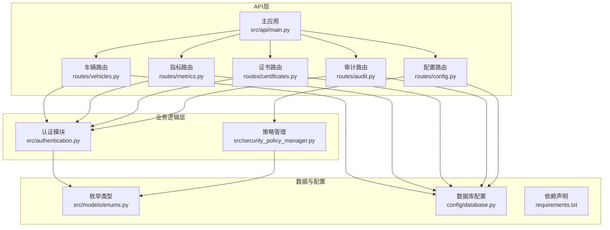
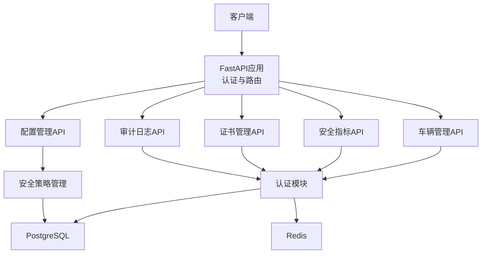
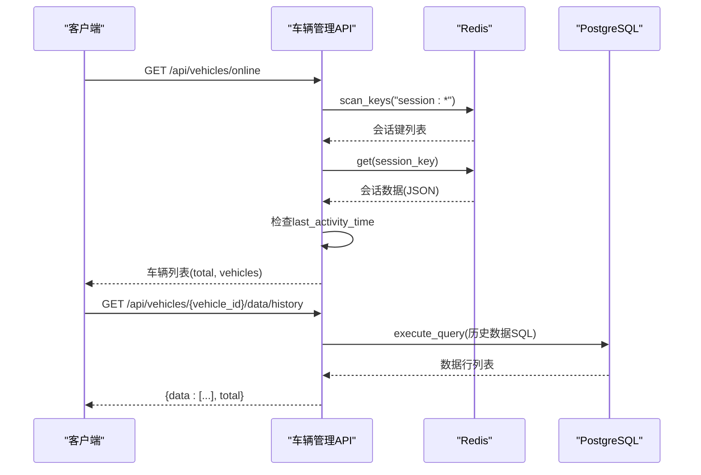
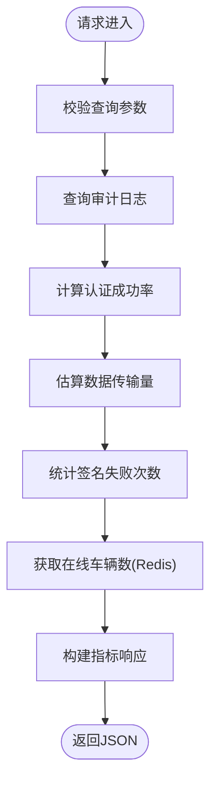
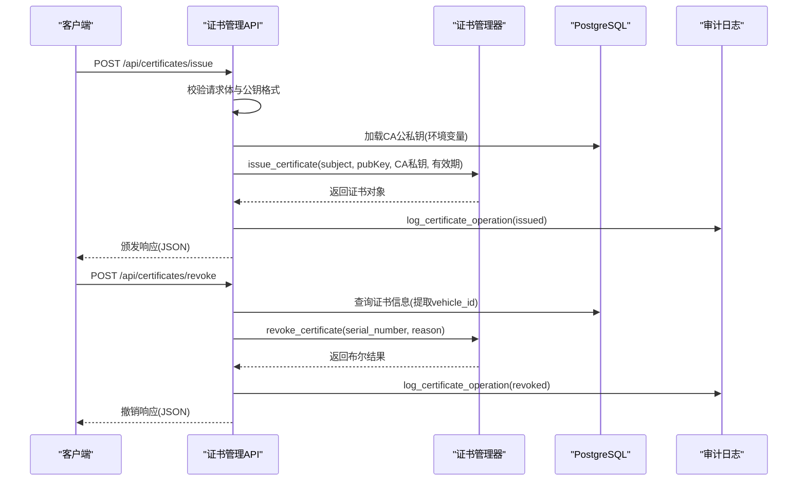
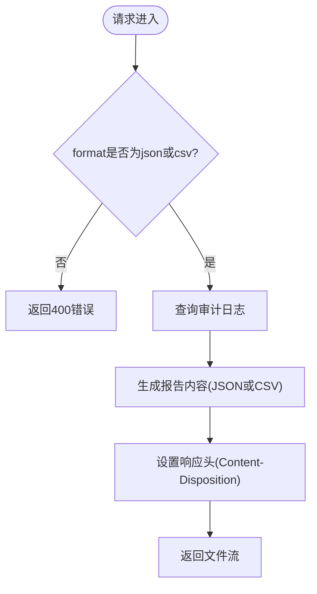
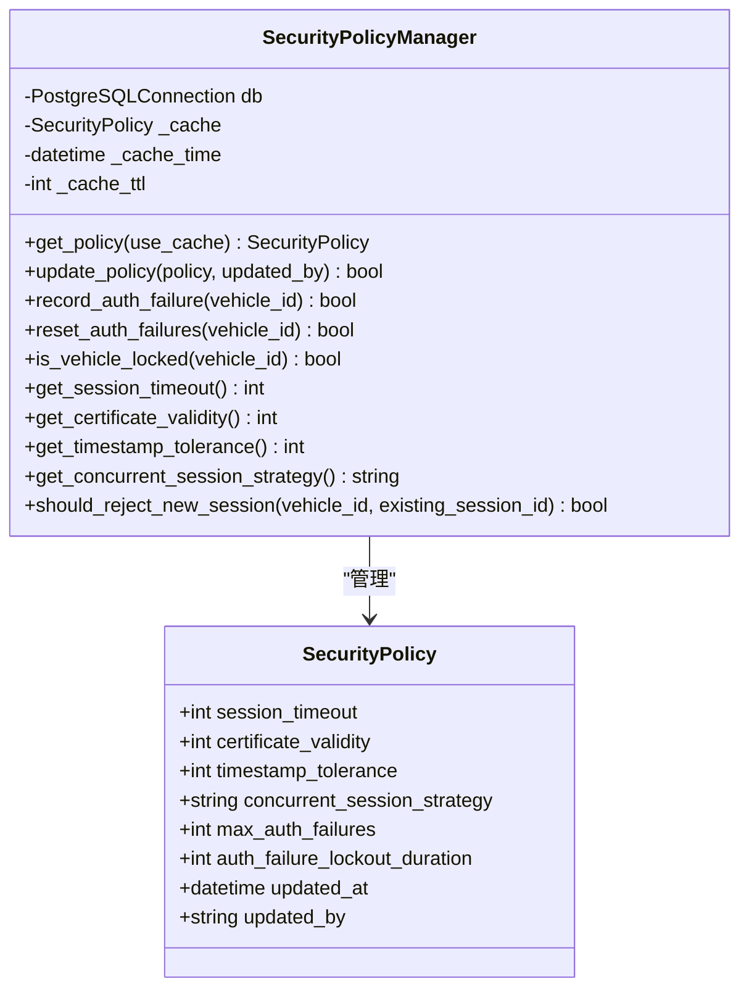
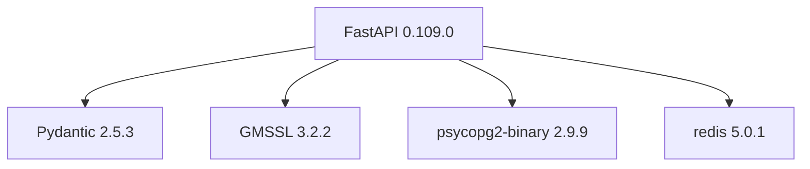

# API接口文档

<cite>
**本文档引用的文件**
- [src/api/main.py](file://src/api/main.py)
- [src/api/README.md](file://src/api/README.md)
- [docs/API.md](file://docs/API.md)
- [src/api/routes/vehicles.py](file://src/api/routes/vehicles.py)
- [src/api/routes/metrics.py](file://src/api/routes/metrics.py)
- [src/api/routes/certificates.py](file://src/api/routes/certificates.py)
- [src/api/routes/audit.py](file://src/api/routes/audit.py)
- [src/api/routes/config.py](file://src/api/routes/config.py)
- [src/authentication.py](file://src/authentication.py)
- [src/models/enums.py](file://src/models/enums.py)
- [src/security_policy_manager.py](file://src/security_policy_manager.py)
- [config/database.py](file://config/database.py)
- [requirements.txt](file://requirements.txt)
</cite>

## 目录
1. [简介](#简介)
2. [项目结构](#项目结构)
3. [核心组件](#核心组件)
4. [架构概览](#架构概览)
5. [详细组件分析](#详细组件分析)
6. [依赖关系分析](#依赖关系分析)
7. [性能考虑](#性能考虑)
8. [故障排除指南](#故障排除指南)
9. [结论](#结论)
10. [附录](#附录)

## 简介
本文件为车联网安全通信网关的完整API接口文档。系统基于FastAPI提供RESTful API，涵盖车辆状态监控、安全指标查询、证书管理、审计日志查询与导出、安全策略配置等功能。所有API端点均采用HTTP Bearer Token进行认证，支持实时与历史数据查询，具备完善的错误处理与审计能力。

## 项目结构
后端采用模块化设计，API入口集中于主应用，路由按功能域划分：
- 主应用与认证：src/api/main.py
- 路由模块：src/api/routes/
  - 车辆管理：vehicles.py
  - 安全指标：metrics.py
  - 证书管理：certificates.py
  - 审计日志：audit.py
  - 配置管理：config.py
- 核心业务逻辑：src/authentication.py、src/security_policy_manager.py
- 数据模型与枚举：src/models/enums.py
- 数据库配置：config/database.py
- 依赖声明：requirements.txt

**图表来源**
- [src/api/main.py:1-108](file://src/api/main.py#L1-L108)
- [src/api/routes/vehicles.py:1-447](file://src/api/routes/vehicles.py#L1-L447)
- [src/api/routes/metrics.py:1-237](file://src/api/routes/metrics.py#L1-L237)
- [src/api/routes/certificates.py:1-390](file://src/api/routes/certificates.py#L1-L390)
- [src/api/routes/audit.py:1-191](file://src/api/routes/audit.py#L1-L191)
- [src/api/routes/config.py:1-173](file://src/api/routes/config.py#L1-L173)
- [src/authentication.py:1-662](file://src/authentication.py#L1-L662)
- [src/security_policy_manager.py:1-322](file://src/security_policy_manager.py#L1-L322)
- [src/models/enums.py:1-56](file://src/models/enums.py#L1-L56)
- [config/database.py:1-50](file://config/database.py#L1-L50)
- [requirements.txt:1-25](file://requirements.txt#L1-L25)

**章节来源**
- [src/api/main.py:1-108](file://src/api/main.py#L1-L108)
- [src/api/README.md:1-112](file://src/api/README.md#L1-L112)

## 核心组件
- 认证与授权
  - HTTP Bearer Token认证：所有端点需携带Authorization: Bearer <token>头
  - 默认开发令牌：dev-token-12345；生产环境建议通过环境变量API_TOKEN配置
  - 认证中间件：CORS允许跨域访问，生产环境建议限制具体域名
- 速率限制
  - 认证端点：10请求/分钟/IP
  - 查询端点：100请求/分钟/IP
  - 写入端点：20请求/分钟/IP
  - 超限返回429 Too Many Requests
- API版本控制
  - 当前版本：v1.0.0
  - 未来版本通过URL路径区分（如/api/v1/...）
- 错误处理
  - 统一错误响应格式：{"detail": "错误描述"}
  - 标准HTTP状态码：200/201/400/401/403/404/500

**章节来源**
- [src/api/main.py:45-75](file://src/api/main.py#L45-L75)
- [docs/API.md:625-634](file://docs/API.md#L625-L634)
- [docs/API.md:642-649](file://docs/API.md#L642-L649)

## 架构概览
系统采用分层架构：API层负责路由与认证，业务逻辑层封装核心算法与策略，数据层通过PostgreSQL与Redis提供持久化与缓存支持。

**图表来源**
- [src/api/main.py:94-102](file://src/api/main.py#L94-L102)
- [src/authentication.py:1-662](file://src/authentication.py#L1-L662)
- [src/security_policy_manager.py:1-322](file://src/security_policy_manager.py#L1-L322)

## 详细组件分析

### 车辆管理API
提供在线车辆查询、车辆状态详情、车辆搜索以及车辆数据查询功能。

- 端点定义
  - GET /api/vehicles/online
    - 功能：获取当前在线车辆列表（最近5分钟活跃）
    - 认证：必需
    - 响应：包含total与vehicles数组
  - GET /api/vehicles/{vehicle_id}/status
    - 功能：获取特定车辆状态（在线/离线）
    - 认证：必需
    - 响应：包含vehicle_id、status、session_id等
  - GET /api/vehicles/search
    - 功能：按车辆标识搜索
    - 认证：必需
    - 查询参数：query（关键词）
    - 响应：匹配的车辆列表
  - GET /api/vehicles/{vehicle_id}/data/latest
    - 功能：获取车辆最新数据（GPS、运动、燃料、温度、电池、诊断）
    - 认证：必需
  - GET /api/vehicles/{vehicle_id}/data/history
    - 功能：获取车辆历史数据
    - 认证：必需
    - 查询参数：start_time、end_time、limit（默认100，1-1000）
  - GET /api/vehicles/{vehicle_id}/data/track
    - 功能：获取车辆GPS轨迹
    - 认证：必需
    - 查询参数：start_time、end_time、limit（默认500，1-2000）

- 数据流与处理逻辑
  - 在线状态判定：基于Redis会话键的last_activity_time与当前时间差
  - 车辆搜索：遍历Redis会话键，匹配vehicle_id
  - 历史数据与轨迹：查询PostgreSQL表vehicle_data，支持时间范围与限制

**图表来源**
- [src/api/routes/vehicles.py:38-99](file://src/api/routes/vehicles.py#L38-L99)
- [src/api/routes/vehicles.py:184-238](file://src/api/routes/vehicles.py#L184-L238)
- [src/api/routes/vehicles.py:319-385](file://src/api/routes/vehicles.py#L319-L385)

**章节来源**
- [src/api/routes/vehicles.py:1-447](file://src/api/routes/vehicles.py#L1-L447)
- [docs/API.md:46-125](file://docs/API.md#L46-L125)

### 安全指标API
提供实时安全指标与历史指标查询，用于监控认证成功率、数据传输量、签名失败次数等。

- 端点定义
  - GET /api/metrics/realtime
    - 功能：获取实时安全指标（在线车辆数、认证成功率、失败次数、数据传输量、签名失败次数、安全异常次数）
    - 认证：必需
  - GET /api/metrics/history
    - 功能：获取历史安全指标（按小时聚合）
    - 认证：必需
    - 查询参数：start_time、end_time（ISO 8601）

- 处理逻辑
  - 实时指标：统计最近5分钟的审计日志，计算成功率与异常数
  - 历史指标：按小时聚合，支持时间范围查询

**图表来源**
- [src/api/routes/metrics.py:39-148](file://src/api/routes/metrics.py#L39-L148)
- [src/api/routes/metrics.py:151-236](file://src/api/routes/metrics.py#L151-L236)

**章节来源**
- [src/api/routes/metrics.py:1-237](file://src/api/routes/metrics.py#L1-L237)
- [docs/API.md:129-182](file://docs/API.md#L129-L182)

### 证书管理API
提供证书查询、颁发、撤销与CRL查询功能，支持SM2数字证书的全生命周期管理。

- 端点定义
  - GET /api/certificates
    - 功能：获取证书列表（支持按状态过滤）
    - 认证：必需
    - 查询参数：status（valid/expired/revoked）、vehicle_id
  - POST /api/certificates/issue
    - 功能：颁发新证书
    - 认证：必需
    - 请求体：vehicle_id、organization、country、public_key（十六进制）
    - 响应：证书序列号、版本、签发者、主题、有效期、公钥、签名、扩展、消息
  - POST /api/certificates/revoke
    - 功能：撤销证书
    - 认证：必需
    - 请求体：serial_number、reason
    - 响应：success、message
  - GET /api/certificates/crl
    - 功能：获取证书撤销列表
    - 认证：必需
    - 响应：revoked_certificates列表与total、last_updated

- 处理逻辑
  - 颁发证书：解析客户端公钥，加载CA密钥，调用证书管理器颁发，记录审计日志
  - 撤销证书：更新CRL，记录审计日志
  - CRL查询：从数据库获取撤销列表

**图表来源**
- [src/api/routes/certificates.py:154-274](file://src/api/routes/certificates.py#L154-L274)
- [src/api/routes/certificates.py:277-359](file://src/api/routes/certificates.py#L277-L359)
- [src/api/routes/certificates.py:362-389](file://src/api/routes/certificates.py#L362-L389)

**章节来源**
- [src/api/routes/certificates.py:1-390](file://src/api/routes/certificates.py#L1-L390)
- [docs/API.md:186-320](file://docs/API.md#L186-L320)

### 审计日志API
提供审计日志查询与导出功能，支持多种过滤条件与格式导出。

- 端点定义
  - GET /api/audit/logs
    - 功能：查询审计日志
    - 认证：必需
    - 查询参数：start_time、end_time、vehicle_id、event_type、operation_result、limit（默认100）
    - 响应：logs数组与total、limit、offset
  - GET /api/audit/export
    - 功能：导出审计报告
    - 认证：必需
    - 查询参数：start_time、end_time、format（json或csv，默认json）
    - 响应：文件下载（Content-Disposition）

- 处理逻辑
  - 日志查询：支持事件类型枚举转换、结果过滤、记录数限制
  - 报告导出：根据format生成JSON或CSV内容，设置合适的媒体类型与文件名

**图表来源**
- [src/api/routes/audit.py:127-182](file://src/api/routes/audit.py#L127-L182)

**章节来源**
- [src/api/routes/audit.py:1-191](file://src/api/routes/audit.py#L1-L191)
- [docs/API.md:324-382](file://docs/API.md#L324-L382)

### 配置管理API
提供安全策略的查询与更新功能，支持会话超时、证书有效期、时间戳容差、并发会话策略等配置项。

- 端点定义
  - GET /api/config/security
    - 功能：获取当前安全策略
    - 认证：必需
    - 响应：policy对象与message
  - PUT /api/config/security
    - 功能：更新安全策略
    - 认证：必需
    - 请求体：policy对象（包含session_timeout、certificate_validity、timestamp_tolerance、concurrent_session_strategy、max_auth_failures、auth_failure_lockout_duration）
    - 响应：更新后的policy与message

- 处理逻辑
  - 策略加载：从数据库security_policy表加载最新配置，带缓存（60秒）
  - 策略更新：持久化到数据库，清空缓存
  - 参数校验：并发会话策略仅允许reject_new或terminate_old

**图表来源**
- [src/security_policy_manager.py:19-57](file://src/security_policy_manager.py#L19-L57)
- [src/security_policy_manager.py:59-321](file://src/security_policy_manager.py#L59-L321)

**章节来源**
- [src/api/routes/config.py:1-173](file://src/api/routes/config.py#L1-L173)
- [docs/API.md:385-439](file://docs/API.md#L385-L439)

## 依赖关系分析
- 框架与库
  - FastAPI 0.109.0：提供异步API与自动生成文档
  - Pydantic 2.5.3：数据验证与序列化
  - gmssl 3.2.2：国密算法支持（SM2/SM4）
  - psycopg2-binary 2.9.9：PostgreSQL驱动
  - redis 5.0.1：Redis客户端
- 数据库与缓存
  - PostgreSQL：存储证书、审计日志、安全策略、车辆数据
  - Redis：存储会话信息、会话密钥、在线状态
- 认证与安全
  - HTTP Bearer Token：API访问令牌
  - 会话管理：基于Redis的会话存储与清理
  - 安全策略：会话超时、并发会话策略、认证失败锁定

**图表来源**
- [requirements.txt:1-25](file://requirements.txt#L1-L25)

**章节来源**
- [requirements.txt:1-25](file://requirements.txt#L1-L25)
- [config/database.py:1-50](file://config/database.py#L1-L50)

## 性能考虑
- Redis会话缓存：会话信息存储在Redis，TTL自动过期，减少数据库压力
- 数据库查询优化：车辆数据查询支持时间范围与limit限制，避免全表扫描
- 指标聚合：历史指标按小时聚合，降低查询复杂度
- 速率限制：防止API滥用，保护系统资源
- CORS配置：开发环境允许所有来源，生产环境建议限制具体域名

## 故障排除指南
- 认证失败
  - 症状：401 Unauthorized
  - 原因：令牌缺失、无效或过期
  - 处理：检查Authorization头，确认API_TOKEN配置
- 数据库连接问题
  - 症状：500 Internal Server Error
  - 原因：PostgreSQL连接失败或查询异常
  - 处理：检查POSTGRES_*环境变量配置
- Redis连接问题
  - 症状：会话查询失败或在线车辆数异常
  - 原因：Redis连接不可用
  - 处理：检查REDIS_*环境变量配置
- 速率限制触发
  - 症状：429 Too Many Requests
  - 原因：超出每分钟请求限制
  - 处理：降低请求频率或升级配额
- 证书颁发失败
  - 症状：500 Internal Server Error
  - 原因：CA密钥未配置或公钥格式错误
  - 处理：检查CA_PRIVATE_KEY与CA_PUBLIC_KEY环境变量，确认公钥为64字节十六进制字符串

**章节来源**
- [src/api/main.py:45-75](file://src/api/main.py#L45-L75)
- [src/api/routes/certificates.py:175-274](file://src/api/routes/certificates.py#L175-L274)
- [docs/API.md:443-462](file://docs/API.md#L443-L462)

## 结论
本API文档全面覆盖了车联网安全通信网关的核心功能与使用规范。通过清晰的端点定义、认证授权机制、错误处理与性能优化策略，为开发者提供了稳定可靠的集成参考。建议在生产环境中严格配置环境变量、限制CORS来源、实施合理的速率限制与监控策略，确保系统的安全性与稳定性。

## 附录
- 快速开始
  - 安装依赖：pip install -r requirements.txt
  - 启动服务器：python examples/run_api_server.py 或 uvicorn src.api.main:app --reload
  - 访问文档：Swagger UI http://localhost:8000/docs，ReDoc http://localhost:8000/redoc
- 环境变量
  - API_TOKEN：API访问令牌
  - CA_PRIVATE_KEY/CA_PUBLIC_KEY：CA密钥（十六进制）
  - POSTGRES_*：PostgreSQL连接配置
  - REDIS_*：Redis连接配置
- 测试
  - pytest tests/test_api.py -v

**章节来源**
- [src/api/README.md:1-112](file://src/api/README.md#L1-L112)
- [docs/API.md:16-23](file://docs/API.md#L16-L23)