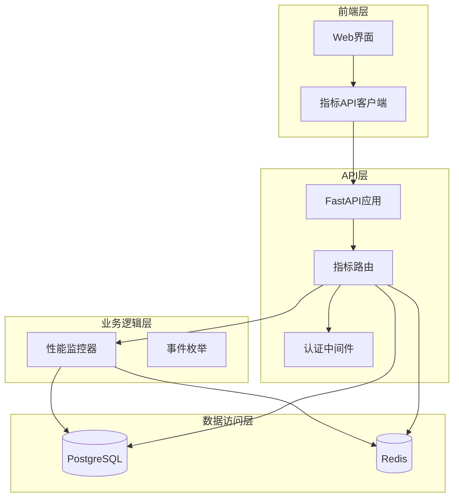
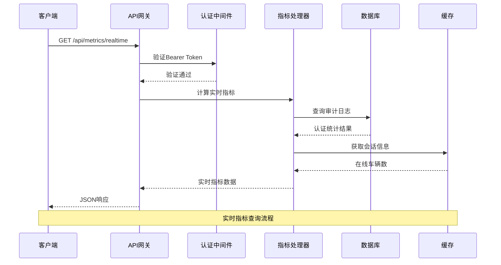
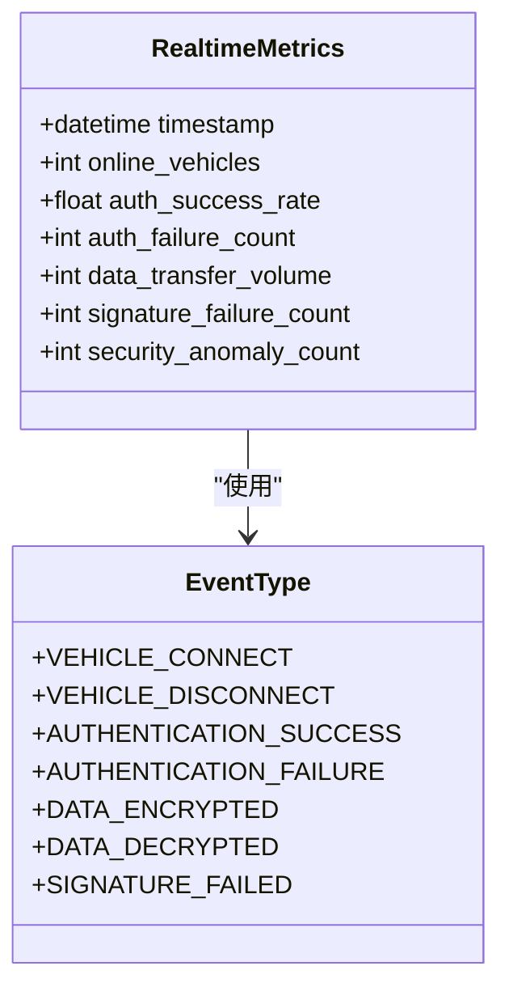
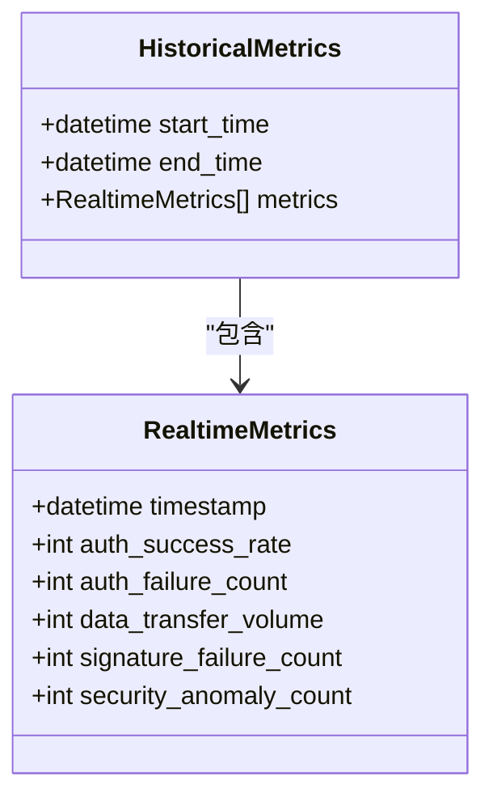
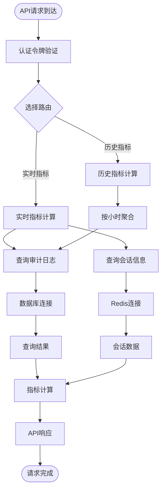
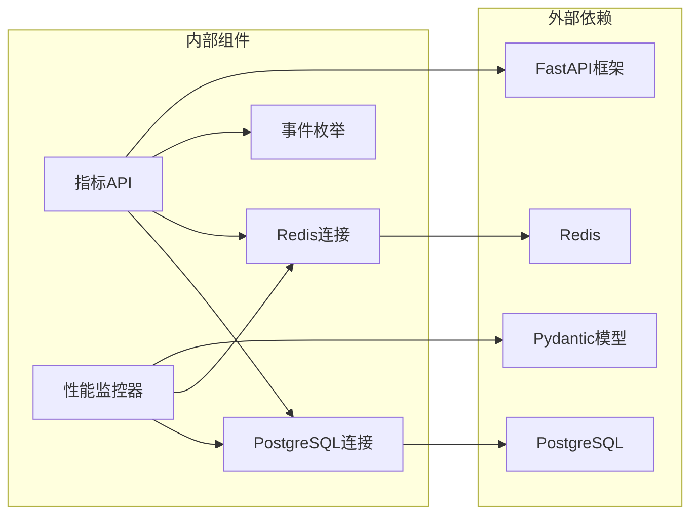

# 安全指标API

<cite>
**本文引用的文件**
- [metrics.py](file://src/api/routes/metrics.py)
- [performance_monitor.py](file://src/performance_monitor.py)
- [enums.py](file://src/models/enums.py)
- [postgres.py](file://src/db/postgres.py)
- [redis_client.py](file://src/db/redis_client.py)
- [main.py](file://src/api/main.py)
- [metrics.js](file://web/src/api/metrics.js)
- [MetricsDashboard.jsx](file://web/src/pages/MetricsDashboard.jsx)
- [schema.sql](file://db/schema.sql)
- [API.md](file://docs/API.md)
- [test_api.py](file://tests/test_api.py)
</cite>

## 目录
1. [简介](#简介)
2. [项目结构](#项目结构)
3. [核心组件](#核心组件)
4. [架构概览](#架构概览)
5. [详细组件分析](#详细组件分析)
6. [依赖关系分析](#依赖关系分析)
7. [性能考虑](#性能考虑)
8. [故障排除指南](#故障排除指南)
9. [结论](#结论)
10. [附录](#附录)

## 简介
本文档详细记录车联网安全通信网关的安全指标API，涵盖实时指标查询、历史趋势分析、性能统计等核心功能。该API基于FastAPI构建，提供RESTful接口用于监控认证成功率、证书有效性、网络流量统计等关键安全指标，并支持历史数据聚合分析。

## 项目结构
项目采用分层架构设计，主要包含以下层次：
- API层：提供RESTful接口和路由管理
- 业务逻辑层：实现安全指标计算和性能监控
- 数据访问层：处理数据库连接和查询
- 前端展示层：提供可视化仪表板



**图表来源**
- [main.py:19-34](file://src/api/main.py#L19-L34)
- [metrics.py:18-19](file://src/api/routes/metrics.py#L18-L19)
- [postgres.py:9-15](file://src/db/postgres.py#L9-L15)
- [redis_client.py:8-14](file://src/db/redis_client.py#L8-L14)

**章节来源**
- [main.py:19-34](file://src/api/main.py#L19-L34)
- [metrics.py:1-237](file://src/api/routes/metrics.py#L1-L237)

## 核心组件
安全指标API由多个核心组件构成，每个组件负责特定的功能领域：

### 实时指标计算组件
- **RealtimeMetrics模型**：定义实时指标的数据结构
- **认证成功率计算**：基于审计日志统计认证成功与失败次数
- **在线车辆统计**：通过Redis会话键扫描获取当前活跃车辆数
- **数据传输量估算**：基于审计日志中的数据加解密事件计算

### 历史指标分析组件
- **HistoricalMetrics模型**：支持按小时粒度的历史数据聚合
- **时间窗口聚合**：自动按1小时间隔聚合历史指标
- **批量数据查询**：支持跨时间段的历史数据检索

### 性能监控组件
- **PerformanceMonitor类**：提供全面的性能指标收集
- **多维度监控**：认证、加密解密、签名验签、会话管理
- **实时统计**：支持TPS、延迟、吞吐量等关键指标

**章节来源**
- [metrics.py:21-37](file://src/api/routes/metrics.py#L21-L37)
- [metrics.py:39-148](file://src/api/routes/metrics.py#L39-L148)
- [metrics.py:151-236](file://src/api/routes/metrics.py#L151-L236)
- [performance_monitor.py:14-52](file://src/performance_monitor.py#L14-L52)

## 架构概览
安全指标API采用微服务架构设计，通过清晰的职责分离确保系统的可维护性和扩展性。



**图表来源**
- [main.py:49-74](file://src/api/main.py#L49-L74)
- [metrics.py:39-148](file://src/api/routes/metrics.py#L39-L148)
- [postgres.py:32-37](file://src/db/postgres.py#L32-L37)
- [redis_client.py:51-71](file://src/db/redis_client.py#L51-L71)

## 详细组件分析

### 实时指标API
实时指标API提供当前时刻的安全状态快照，包括认证成功率、在线车辆数、数据传输量等关键指标。

#### 接口规范
- **HTTP方法**：GET
- **URL模式**：`/api/metrics/realtime`
- **认证要求**：Bearer Token
- **响应格式**：JSON对象

#### 请求参数
实时指标查询不需要任何请求参数，系统自动计算当前时间窗口内的指标。

#### 响应数据结构


**图表来源**
- [metrics.py:21-30](file://src/api/routes/metrics.py#L21-L30)
- [enums.py:35-47](file://src/models/enums.py#L35-L47)

#### 指标计算逻辑
1. **认证成功率**：认证成功次数 / (认证成功次数 + 认证失败次数) × 100%
2. **在线车辆数**：通过Redis键扫描获取活跃会话数量
3. **数据传输量**：基于审计日志中的数据加解密事件估算
4. **安全异常次数**：认证失败次数 + 签名失败次数

**章节来源**
- [metrics.py:39-148](file://src/api/routes/metrics.py#L39-L148)

### 历史指标API
历史指标API支持查询指定时间范围内的安全指标历史数据，按小时粒度进行数据聚合。

#### 接口规范
- **HTTP方法**：GET
- **URL模式**：`/api/metrics/history`
- **认证要求**：Bearer Token
- **响应格式**：JSON对象

#### 请求参数
- **start_time** (必需)：开始时间（ISO 8601格式）
- **end_time** (必需)：结束时间（ISO 8601格式）

#### 响应数据结构


**图表来源**
- [metrics.py:32-36](file://src/api/routes/metrics.py#L32-L36)
- [metrics.py:21-30](file://src/api/routes/metrics.py#L21-L30)

#### 数据聚合策略
系统按小时粒度对历史数据进行聚合：
- 认证成功/失败次数按小时统计
- 其他指标在历史查询中设为0以便于展示
- 自动处理时间窗口边界情况

**章节来源**
- [metrics.py:151-236](file://src/api/routes/metrics.py#L151-L236)

### 性能监控API
性能监控API提供全面的系统性能指标，包括认证延迟、吞吐量、会话管理等关键性能指标。

#### 性能指标分类
```mermaid
graph TB
subgraph "认证性能"
AuthCount[认证总次数]
AuthSuccess[认证成功次数]
AuthFailure[认证失败次数]
AuthLatency[认证延迟(ms)]
AuthTPS[每秒事务数]
end
subgraph "加密性能"
EncryptCount[加密次数]
EncryptThroughput[加密吞吐量(MB/s)]
DecryptCount[解密次数]
DecryptThroughput[解密吞吐量(MB/s)]
Encrypt1KBLatency[1KB加密延迟(ms)]
end
subgraph "签名性能"
SignCount[签名次数]
SignOpsSec[签名次数/秒]
VerifyCount[验签次数]
VerifyOpsSec[验签次数/秒]
end
subgraph "会话性能"
CurrentSessions[当前会话数]
MaxSessions[最大并发会话数]
EstablishTime[会话建立延迟(ms)]
QueryTime[会话查询延迟(ms)]
end
```

**图表来源**
- [performance_monitor.py:14-52](file://src/performance_monitor.py#L14-L52)

#### 性能要求验证
系统内置性能要求验证机制，确保各项指标满足预设标准：
- 认证延迟 < 500ms
- 认证 TPS ≥ 100
- SM4 加密吞吐量 ≥ 100 MB/s
- SM2 签名 ≥ 1000 次/秒
- 并发会话 ≥ 10,000
- 会话建立 < 100ms

**章节来源**
- [performance_monitor.py:375-421](file://src/performance_monitor.py#L375-L421)

## 依赖关系分析

### 数据流图


**图表来源**
- [metrics.py:55-148](file://src/api/routes/metrics.py#L55-L148)
- [postgres.py:16-37](file://src/db/postgres.py#L16-L37)
- [redis_client.py:15-71](file://src/db/redis_client.py#L15-L71)

### 组件依赖关系


**图表来源**
- [metrics.py:8-16](file://src/api/routes/metrics.py#L8-L16)
- [performance_monitor.py:6-11](file://src/performance_monitor.py#L6-L11)

**章节来源**
- [metrics.py:8-16](file://src/api/routes/metrics.py#L8-L16)
- [performance_monitor.py:6-11](file://src/performance_monitor.py#L6-L11)

## 性能考虑

### 数据库查询优化
- **索引使用**：审计日志表包含多个复合索引以优化查询性能
- **时间范围限制**：实时查询限制在5分钟时间窗口内
- **批量查询**：历史查询按小时粒度进行批量处理

### 缓存策略
- **Redis会话缓存**：使用Redis存储活跃会话信息，避免频繁数据库查询
- **会话键扫描**：通过SCAN命令高效获取会话键列表
- **连接池管理**：数据库连接采用连接池复用机制

### 性能基准
- **实时查询延迟**：< 100ms（理想情况下）
- **历史查询延迟**：< 500ms（按小时聚合）
- **并发处理能力**：支持高并发指标查询请求

**章节来源**
- [schema.sql:49-53](file://db/schema.sql#L49-L53)
- [metrics.py:58-59](file://src/api/routes/metrics.py#L58-L59)
- [redis_client.py:60-71](file://src/db/redis_client.py#L60-L71)

## 故障排除指南

### 常见错误及解决方案

#### 认证失败
**症状**：返回401未授权错误
**原因**：Bearer Token无效或过期
**解决方案**：
1. 检查API_TOKEN环境变量配置
2. 验证Token格式正确性
3. 确认Token权限范围

#### 数据库连接错误
**症状**：返回500服务器内部错误
**原因**：PostgreSQL连接失败
**解决方案**：
1. 检查数据库服务状态
2. 验证连接参数配置
3. 确认数据库权限设置

#### Redis连接错误
**症状**：在线车辆数查询失败
**原因**：Redis服务不可用
**解决方案**：
1. 检查Redis服务状态
2. 验证Redis连接配置
3. 确认Redis权限设置

#### 查询超时
**症状**：历史查询响应缓慢
**原因**：时间范围过大或数据库负载过高
**解决方案**：
1. 缩短查询时间范围
2. 优化数据库性能
3. 考虑添加数据库索引

**章节来源**
- [metrics.py:144-148](file://src/api/routes/metrics.py#L144-L148)
- [postgres.py:16-25](file://src/db/postgres.py#L16-L25)
- [redis_client.py:15-24](file://src/db/redis_client.py#L15-L24)

### 监控仪表板集成
系统提供完整的前端仪表板集成方案：

#### 实时数据刷新
- **刷新频率**：每5秒自动刷新一次
- **数据格式**：支持多种图表展示格式
- **错误处理**：自动重试机制

#### 图表配置
- **认证成功率趋势**：折线图展示历史趋势
- **异常事件统计**：柱状图显示异常类型分布
- **实时状态面板**：卡片式展示关键指标

**章节来源**
- [MetricsDashboard.jsx:53-58](file://web/src/pages/MetricsDashboard.jsx#L53-L58)
- [metrics.js:3-16](file://web/src/api/metrics.js#L3-L16)

## 结论
车联网安全通信网关的安全指标API提供了全面的安全监控和性能统计功能。通过实时指标查询、历史趋势分析、性能统计等核心功能，系统能够有效监控网络安全状态，及时发现潜在威胁。API设计采用模块化架构，具有良好的可扩展性和维护性，能够满足车联网场景下的复杂监控需求。

## 附录

### API端点完整列表
- **GET /api/metrics/realtime** - 获取实时安全指标
- **GET /api/metrics/history** - 获取历史安全指标

### 数据模型定义
- **RealtimeMetrics**：实时指标数据结构
- **HistoricalMetrics**：历史指标数据结构
- **EventType**：审计事件类型枚举

### 集成示例
系统提供完整的前端集成示例，包括React组件和API客户端封装，便于快速集成到现有监控系统中。

**章节来源**
- [API.md:129-183](file://docs/API.md#L129-L183)
- [enums.py:35-47](file://src/models/enums.py#L35-L47)