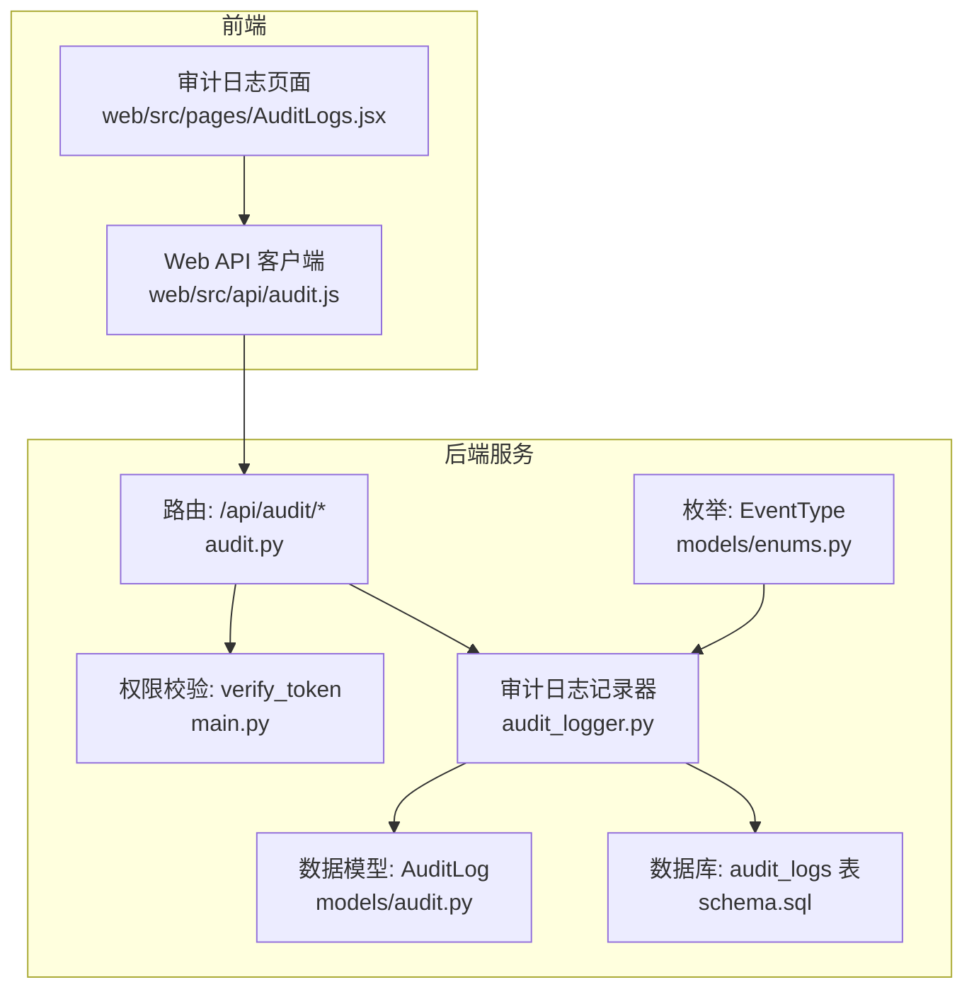
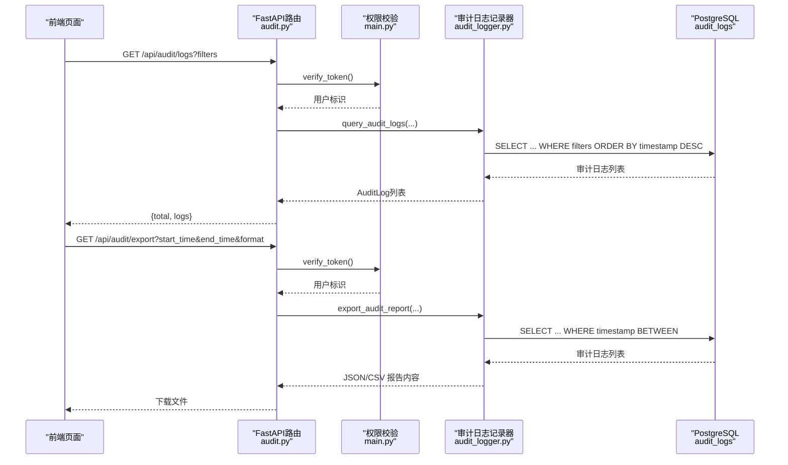
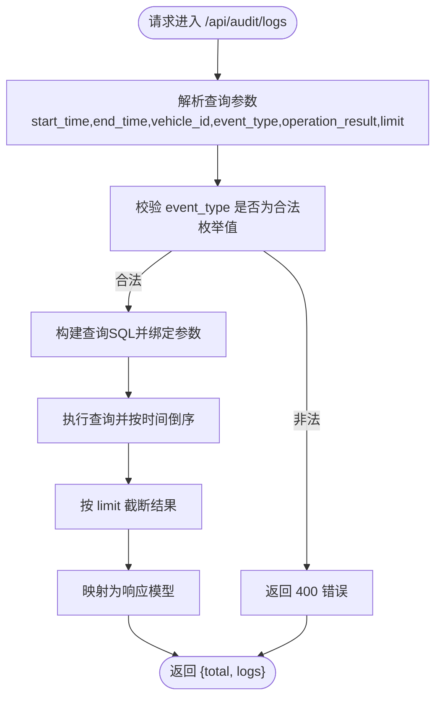
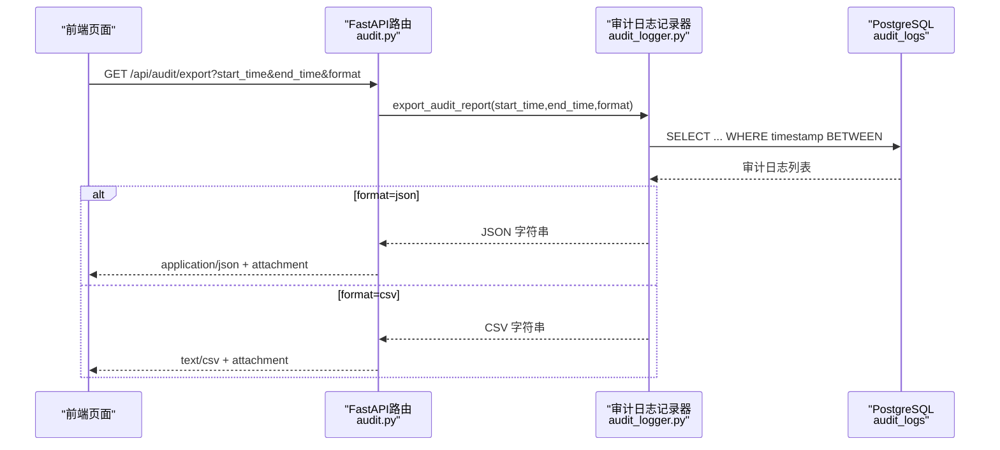
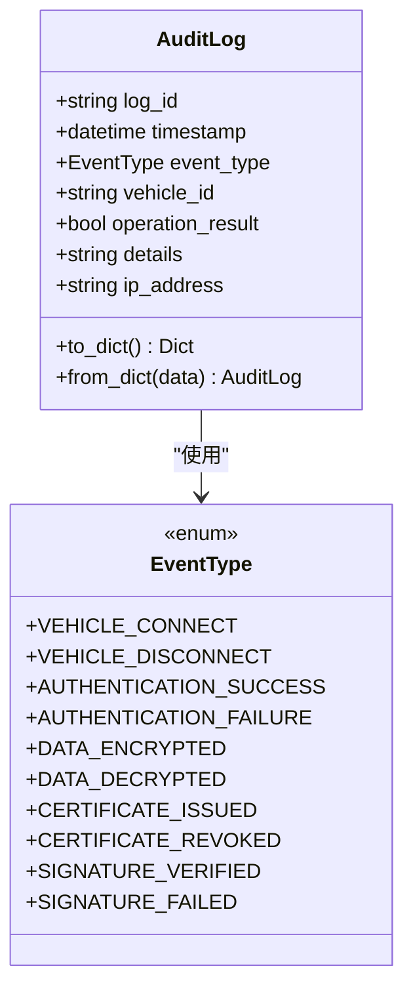
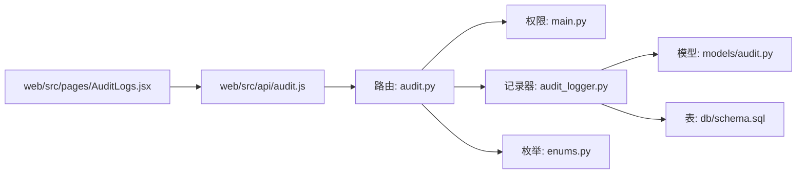

# 审计日志API

<cite>
**本文引用的文件**
- [audit.py](file://src/api/routes/audit.py)
- [audit.js](file://web/src/api/audit.js)
- [AuditLogs.jsx](file://web/src/pages/AuditLogs.jsx)
- [audit_logger.py](file://src/audit_logger.py)
- [audit.py](file://src/models/audit.py)
- [enums.py](file://src/models/enums.py)
- [schema.sql](file://db/schema.sql)
- [main.py](file://src/api/main.py)
- [test_audit_logs.py](file://examples/test_audit_logs.py)
- [export_audit_report_example.py](file://examples/export_audit_report_example.py)
- [AUDIT_LOG_FIX.md](file://docs/AUDIT_LOG_FIX.md)
- [API.md](file://docs/API.md)
</cite>

## 目录
1. [简介](#简介)
2. [项目结构](#项目结构)
3. [核心组件](#核心组件)
4. [架构总览](#架构总览)
5. [详细组件分析](#详细组件分析)
6. [依赖分析](#依赖分析)
7. [性能考量](#性能考量)
8. [故障排查指南](#故障排查指南)
9. [结论](#结论)
10. [附录](#附录)

## 简介
本文件为车联网安全通信网关的审计日志API提供完整接口文档，覆盖审计事件查询、过滤与导出能力。文档明确HTTP方法、URL模式、请求参数、响应格式与数据模型；解释事件类型分类、时间范围查询、事件详情过滤等能力；提供查询示例与最佳实践；说明审计数据存储格式、索引设计与访问权限控制；并补充CSV导出、Web前端集成与性能优化建议。

## 项目结构
审计日志相关能力由后端FastAPI路由、审计日志记录器、数据模型与数据库表共同构成，并通过Web前端页面进行展示与导出。

**图表来源**
- [audit.py:1-191](file://src/api/routes/audit.py#L1-L191)
- [audit_logger.py:1-480](file://src/audit_logger.py#L1-L480)
- [audit.py:1-56](file://src/models/audit.py#L1-L56)
- [enums.py:1-56](file://src/models/enums.py#L1-L56)
- [schema.sql:36-54](file://db/schema.sql#L36-L54)
- [main.py:49-74](file://src/api/main.py#L49-L74)
- [audit.js:1-21](file://web/src/api/audit.js#L1-L21)
- [AuditLogs.jsx:1-220](file://web/src/pages/AuditLogs.jsx#L1-L220)

**章节来源**
- [audit.py:1-191](file://src/api/routes/audit.py#L1-L191)
- [audit_logger.py:1-480](file://src/audit_logger.py#L1-L480)
- [audit.py:1-56](file://src/models/audit.py#L1-L56)
- [enums.py:35-47](file://src/models/enums.py#L35-L47)
- [schema.sql:36-54](file://db/schema.sql#L36-L54)
- [main.py:49-74](file://src/api/main.py#L49-L74)
- [audit.js:1-21](file://web/src/api/audit.js#L1-L21)
- [AuditLogs.jsx:1-220](file://web/src/pages/AuditLogs.jsx#L1-L220)

## 核心组件
- 审计日志查询路由：提供GET /api/audit/logs，支持时间范围、车辆ID、事件类型、操作结果过滤与返回数量限制。
- 审计报告导出路由：提供GET /api/audit/export，支持JSON/CSV导出。
- 审计日志记录器：封装日志生成、持久化、查询与导出逻辑，包含事件类型枚举与数据模型。
- 数据模型与枚举：定义审计日志字段与事件类型。
- 数据库表：audit_logs，包含索引以支撑高效查询。
- 权限控制：基于HTTP Bearer Token的令牌校验中间件。
- Web前端：提供过滤查询与导出按钮，调用后端API。

**章节来源**
- [audit.py:39-125](file://src/api/routes/audit.py#L39-L125)
- [audit.py:127-191](file://src/api/routes/audit.py#L127-L191)
- [audit_logger.py:26-336](file://src/audit_logger.py#L26-L336)
- [audit.py:9-56](file://src/models/audit.py#L9-L56)
- [enums.py:35-47](file://src/models/enums.py#L35-L47)
- [schema.sql:36-54](file://db/schema.sql#L36-L54)
- [main.py:49-74](file://src/api/main.py#L49-L74)
- [audit.js:3-20](file://web/src/api/audit.js#L3-L20)
- [AuditLogs.jsx:17-57](file://web/src/pages/AuditLogs.jsx#L17-L57)

## 架构总览
审计日志API采用“路由层-业务层-数据层”分层设计，路由负责参数解析与权限校验，业务层负责查询与导出，数据层负责PostgreSQL持久化与索引查询。

**图表来源**
- [audit.py:39-125](file://src/api/routes/audit.py#L39-L125)
- [audit.py:127-191](file://src/api/routes/audit.py#L127-L191)
- [audit_logger.py:243-336](file://src/audit_logger.py#L243-L336)
- [audit_logger.py:337-465](file://src/audit_logger.py#L337-L465)
- [main.py:49-74](file://src/api/main.py#L49-L74)

## 详细组件分析

### 审计日志查询接口
- HTTP方法：GET
- URL：/api/audit/logs
- 权限：Bearer Token校验
- 请求参数：
  - start_time: 可选，ISO 8601时间戳，查询下界
  - end_time: 可选，ISO 8601时间戳，查询上界
  - vehicle_id: 可选，车辆标识
  - event_type: 可选，事件类型字符串（需匹配枚举值）
  - operation_result: 可选，布尔值
  - limit: 可选，默认100，最大返回条数
- 响应：
  - total: 匹配条件的日志总数
  - logs: 审计日志条目数组，每个条目包含：
    - log_id: 唯一日志ID
    - timestamp: 事件时间
    - event_type: 事件类型（字符串）
    - vehicle_id: 车辆标识
    - operation_result: 操作结果（布尔）
    - details: 事件详情（最多1024字符）
    - ip_address: 客户端IP

**图表来源**
- [audit.py:39-125](file://src/api/routes/audit.py#L39-L125)
- [audit_logger.py:243-336](file://src/audit_logger.py#L243-L336)

**章节来源**
- [audit.py:39-125](file://src/api/routes/audit.py#L39-L125)
- [audit.py:22-31](file://src/models/audit.py#L22-L31)
- [enums.py:35-47](file://src/models/enums.py#L35-L47)

### 审计报告导出接口
- HTTP方法：GET
- URL：/api/audit/export
- 权限：Bearer Token校验
- 请求参数：
  - start_time: 必填，ISO 8601时间戳
  - end_time: 必填，ISO 8601时间戳
  - format: 可选，json 或 csv，默认json
- 响应：
  - JSON：application/json，内容为包含元数据与日志数组的结构化报告
  - CSV：text/csv，内容为CSV文本，包含表头与日志行
  - Content-Disposition：attachment; filename=audit_report_YYYYMMDD_YYYYMMDD.(json|csv)

**图表来源**
- [audit.py:127-191](file://src/api/routes/audit.py#L127-L191)
- [audit_logger.py:337-465](file://src/audit_logger.py#L337-L465)

**章节来源**
- [audit.py:127-191](file://src/api/routes/audit.py#L127-L191)
- [audit_logger.py:337-465](file://src/audit_logger.py#L337-L465)

### 审计事件类型与数据模型
- 事件类型（EventType）：
  - VEHICLE_CONNECT、VEHICLE_DISCONNECT
  - AUTHENTICATION_SUCCESS、AUTHENTICATION_FAILURE
  - DATA_ENCRYPTED、DATA_DECRYPTED
  - CERTIFICATE_ISSUED、CERTIFICATE_REVOKED
  - SIGNATURE_VERIFIED、SIGNATURE_FAILED
- 审计日志数据模型（AuditLog）：
  - 字段：log_id、timestamp、event_type、vehicle_id、operation_result、details、ip_address
  - 详情字段长度限制为1024字符
  - 提供序列化/反序列化方法

**图表来源**
- [audit.py:9-56](file://src/models/audit.py#L9-L56)
- [enums.py:35-47](file://src/models/enums.py#L35-L47)

**章节来源**
- [audit.py:9-56](file://src/models/audit.py#L9-L56)
- [enums.py:35-47](file://src/models/enums.py#L35-L47)

### 数据存储与索引
- 表：audit_logs
- 字段：log_id（唯一）、timestamp、event_type、vehicle_id、operation_result、details（<=1024字符）、ip_address、created_at
- 索引：log_id、timestamp、vehicle_id、event_type
- 用途：支撑按时间范围、车辆ID、事件类型与结果的高效过滤

**章节来源**
- [schema.sql:36-54](file://db/schema.sql#L36-L54)

### 权限控制与访问
- 令牌校验：HTTP Bearer Token，通过 verify_token 校验
- 环境变量：API_TOKEN（开发默认值为 dev-token-12345）
- Web前端：统一在请求头中携带 Authorization: Bearer {token}

**章节来源**
- [main.py:49-74](file://src/api/main.py#L49-L74)
- [audit.js:4-19](file://web/src/api/audit.js#L4-L19)
- [AuditLogs.jsx:17-36](file://web/src/pages/AuditLogs.jsx#L17-L36)

### Web前端集成
- 查询：queryAuditLogs(filters) -> /api/audit/logs
- 导出：exportAuditReport(startTime, endTime, format) -> /api/audit/export
- 页面支持：时间范围、车辆ID、事件类型、操作结果过滤，以及JSON/CSV导出按钮

**章节来源**
- [audit.js:3-20](file://web/src/api/audit.js#L3-L20)
- [AuditLogs.jsx:17-57](file://web/src/pages/AuditLogs.jsx#L17-L57)

## 依赖分析
- 路由依赖：
  - 权限校验：verify_token
  - 审计日志记录器：AuditLogger
  - 事件类型枚举：EventType
  - 数据库连接：PostgreSQLConnection
- 记录器依赖：
  - 数据模型：AuditLog
  - 数据库：audit_logs 表
- 前端依赖：
  - API客户端：/api/audit/* 与 /api/audit/export
  - 页面：过滤参数映射与导出下载

**图表来源**
- [audit.py:1-191](file://src/api/routes/audit.py#L1-L191)
- [main.py:49-74](file://src/api/main.py#L49-L74)
- [audit_logger.py:1-480](file://src/audit_logger.py#L1-L480)
- [audit.py:1-56](file://src/models/audit.py#L1-L56)
- [enums.py:1-56](file://src/models/enums.py#L1-L56)
- [schema.sql:36-54](file://db/schema.sql#L36-L54)
- [audit.js:1-21](file://web/src/api/audit.js#L1-L21)
- [AuditLogs.jsx:1-220](file://web/src/pages/AuditLogs.jsx#L1-L220)

**章节来源**
- [audit.py:1-191](file://src/api/routes/audit.py#L1-L191)
- [main.py:49-74](file://src/api/main.py#L49-L74)
- [audit_logger.py:1-480](file://src/audit_logger.py#L1-L480)
- [audit.py:1-56](file://src/models/audit.py#L1-L56)
- [enums.py:1-56](file://src/models/enums.py#L1-L56)
- [schema.sql:36-54](file://db/schema.sql#L36-L54)
- [audit.js:1-21](file://web/src/api/audit.js#L1-L21)
- [AuditLogs.jsx:1-220](file://web/src/pages/AuditLogs.jsx#L1-L220)

## 性能考量
- 查询性能
  - 利用索引：timestamp、vehicle_id、event_type、log_id
  - 排序：按时间倒序，便于前端展示最新日志
- 导出性能
  - 导出范围应尽量缩小，避免全表扫描
  - JSON导出包含元数据，CSV更利于大体量数据处理
- 限制与分页
  - 路由层提供limit限制返回条数
  - 建议前端实现分页（offset）以支持大数据量场景
- 异步与归档（建议）
  - 审计日志记录可异步化，避免阻塞主业务
  - 对历史日志进行归档或分区，减少热表压力

[本节为通用性能建议，无需特定文件引用]

## 故障排查指南
- 无日志数据
  - 检查数据库中是否存在审计日志：COUNT(*)与最近10条记录
  - 确认关键操作是否调用了审计日志记录（认证、证书、数据传输）
- 事件类型无效
  - event_type必须为枚举值之一，否则返回400
- 导出格式错误
  - format仅支持json或csv，否则抛出异常
- 权限错误
  - 确认Authorization头中Bearer Token与API_TOKEN一致
- 大数据量查询
  - 缩小时间范围、增加过滤条件、使用limit限制返回条数

**章节来源**
- [AUDIT_LOG_FIX.md:1-271](file://docs/AUDIT_LOG_FIX.md#L1-L271)
- [test_audit_logs.py:1-381](file://examples/test_audit_logs.py#L1-L381)
- [audit.py:74-84](file://src/api/routes/audit.py#L74-L84)
- [audit.py:150-154](file://src/api/routes/audit.py#L150-L154)
- [main.py:61-74](file://src/api/main.py#L61-L74)

## 结论
审计日志API提供了完善的查询与导出能力，支持多条件过滤与格式化导出，配合数据库索引与权限校验，能够满足车联网安全通信网关的审计需求。建议在生产环境中结合异步记录、归档与分页策略，持续优化查询与导出性能。

[本节为总结性内容，无需特定文件引用]

## 附录

### 接口清单与示例

- 查询审计日志
  - 方法：GET
  - URL：/api/audit/logs
  - 示例：查询最近24小时、认证相关的日志并限制返回100条
  - 参数：start_time、end_time、event_type、vehicle_id、operation_result、limit
  - 响应：{total, logs[]}

- 导出审计报告
  - 方法：GET
  - URL：/api/audit/export
  - 示例：导出最近7天的JSON报告
  - 参数：start_time、end_time、format(json|csv)
  - 响应：二进制文件（Content-Disposition）

**章节来源**
- [audit.py:39-125](file://src/api/routes/audit.py#L39-L125)
- [audit.py:127-191](file://src/api/routes/audit.py#L127-L191)
- [API.md:330-395](file://docs/API.md#L330-L395)

### 事件类型与字段说明
- 事件类型（EventType）：认证、数据传输、证书颁发/撤销、签名验证等
- 日志字段：log_id、timestamp、event_type、vehicle_id、operation_result、details、ip_address

**章节来源**
- [enums.py:35-47](file://src/models/enums.py#L35-L47)
- [audit.py:19-26](file://src/models/audit.py#L19-L26)

### 存储格式与保留策略
- 存储格式：PostgreSQL表audit_logs，字段与索引见schema.sql
- 保留策略：当前未见显式保留期限配置，建议结合业务制定归档/清理策略

**章节来源**
- [schema.sql:36-54](file://db/schema.sql#L36-L54)

### 查询与导出示例
- 使用示例脚本：examples/test_audit_logs.py 展示了查询与导出的完整流程
- 导出示例：examples/export_audit_report_example.py 展示了JSON/CSV导出

**章节来源**
- [test_audit_logs.py:23-230](file://examples/test_audit_logs.py#L23-L230)
- [export_audit_report_example.py:12-134](file://examples/export_audit_report_example.py#L12-L134)