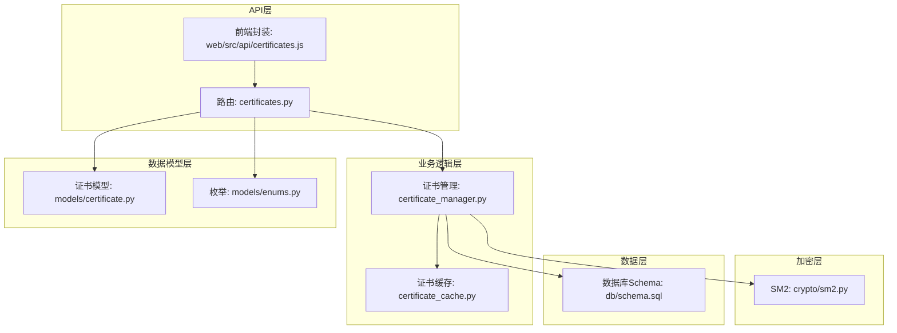
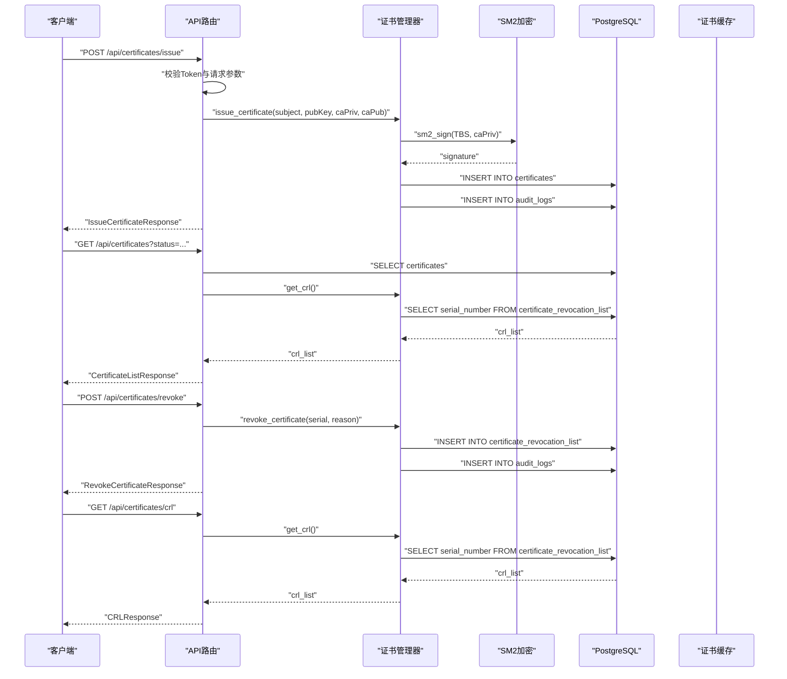
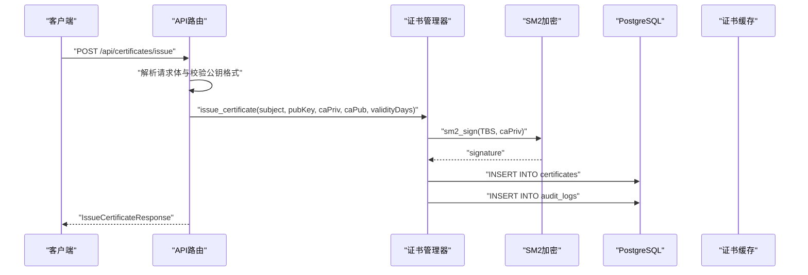
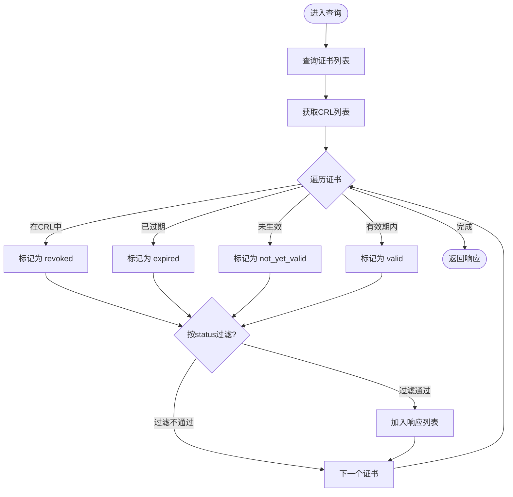
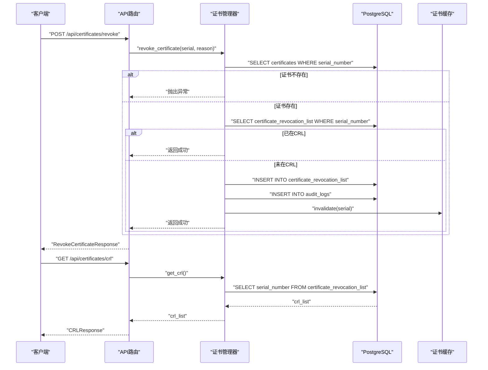
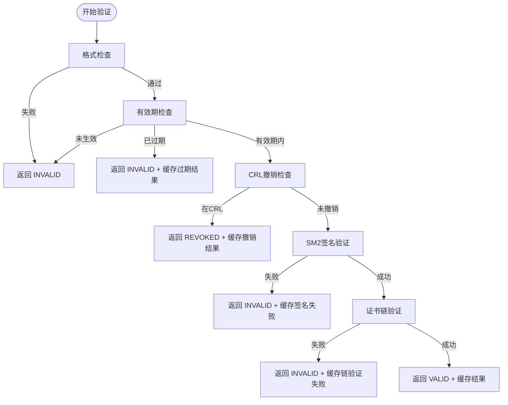
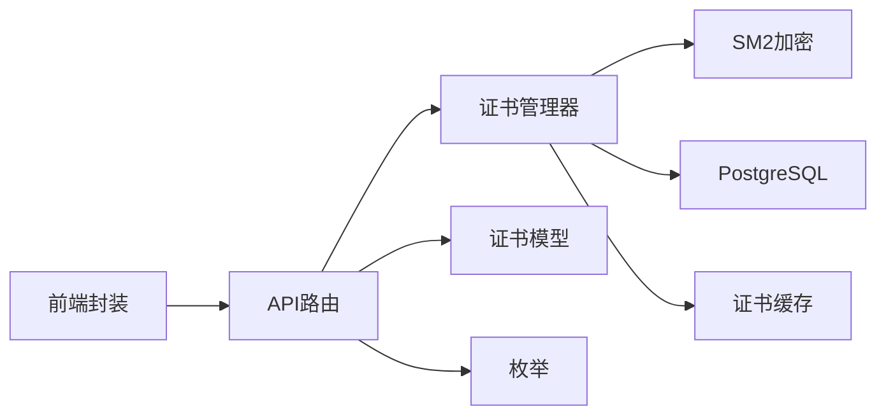

# 证书管理API

<cite>
**本文引用的文件**
- [src/api/routes/certificates.py](file://src/api/routes/certificates.py)
- [src/models/certificate.py](file://src/models/certificate.py)
- [src/certificate_manager.py](file://src/certificate_manager.py)
- [src/certificate_cache.py](file://src/certificate_cache.py)
- [src/crypto/sm2.py](file://src/crypto/sm2.py)
- [db/schema.sql](file://db/schema.sql)
- [src/models/enums.py](file://src/models/enums.py)
- [web/src/api/certificates.js](file://web/src/api/certificates.js)
- [docs/API.md](file://docs/API.md)
- [tests/test_certificate_manager.py](file://tests/test_certificate_manager.py)
- [tests/test_crl_management.py](file://tests/test_crl_management.py)
</cite>

## 目录
1. [简介](#简介)
2. [项目结构](#项目结构)
3. [核心组件](#核心组件)
4. [架构总览](#架构总览)
5. [详细组件分析](#详细组件分析)
6. [依赖关系分析](#依赖关系分析)
7. [性能考量](#性能考量)
8. [故障排查指南](#故障排查指南)
9. [结论](#结论)
10. [附录](#附录)

## 简介
本文件面向车联网安全通信网关的证书管理API，系统性梳理证书生命周期管理相关接口，包括证书申请、颁发、查询、撤销以及CRL撤销列表管理。文档详细说明HTTP方法、URL模式、请求参数与响应格式，并深入解释证书链验证机制、CRL撤销列表更新、证书状态查询等核心功能。同时提供完整的证书申请流程示例、证书过期处理与自动续期机制说明、证书导入导出与批量操作建议、错误处理策略，以及安全最佳实践与合规性要求。

## 项目结构
围绕证书管理API的关键文件组织如下：
- API路由层：定义REST端点、请求/响应模型与鉴权依赖
- 业务逻辑层：证书颁发、验证、撤销、CRL与证书链管理
- 数据模型层：证书、扩展、审计事件等数据结构
- 加密模块：SM2签名与验签
- 数据库Schema：证书、CRL、审计日志等表结构
- 前端JS封装：对API的调用封装
- 测试与文档：单元测试与API文档

图表来源
- [src/api/routes/certificates.py:1-390](file://src/api/routes/certificates.py#L1-L390)
- [src/certificate_manager.py:1-734](file://src/certificate_manager.py#L1-L734)
- [src/certificate_cache.py:1-156](file://src/certificate_cache.py#L1-L156)
- [src/models/certificate.py:1-108](file://src/models/certificate.py#L1-L108)
- [src/models/enums.py:1-56](file://src/models/enums.py#L1-L56)
- [src/crypto/sm2.py:1-265](file://src/crypto/sm2.py#L1-L265)
- [db/schema.sql:1-104](file://db/schema.sql#L1-L104)
- [web/src/api/certificates.js:1-31](file://web/src/api/certificates.js#L1-L31)

章节来源
- [src/api/routes/certificates.py:1-390](file://src/api/routes/certificates.py#L1-L390)
- [db/schema.sql:1-104](file://db/schema.sql#L1-L104)

## 核心组件
- 证书管理器：负责证书颁发、验证、撤销、CRL获取、证书链获取与过期检查
- 证书缓存：基于LRU的证书验证结果缓存，提升验证性能
- SM2加密模块：提供SM2签名与验签能力
- API路由：定义证书管理相关REST端点，绑定鉴权与业务逻辑
- 数据模型：证书、扩展、审计事件等数据结构
- 数据库Schema：证书表、CRL表、审计日志表及索引

章节来源
- [src/certificate_manager.py:1-734](file://src/certificate_manager.py#L1-L734)
- [src/certificate_cache.py:1-156](file://src/certificate_cache.py#L1-L156)
- [src/crypto/sm2.py:1-265](file://src/crypto/sm2.py#L1-L265)
- [src/models/certificate.py:1-108](file://src/models/certificate.py#L1-L108)
- [db/schema.sql:1-104](file://db/schema.sql#L1-L104)

## 架构总览
证书管理API采用分层架构：
- 表示层：FastAPI路由定义REST端点
- 业务层：证书管理器封装核心算法与流程
- 数据层：PostgreSQL存储证书、CRL与审计日志
- 缓存层：证书验证结果缓存
- 加密层：SM2签名与验签

图表来源
- [src/api/routes/certificates.py:81-390](file://src/api/routes/certificates.py#L81-L390)
- [src/certificate_manager.py:597-734](file://src/certificate_manager.py#L597-L734)
- [src/crypto/sm2.py:135-265](file://src/crypto/sm2.py#L135-L265)
- [db/schema.sql:4-34](file://db/schema.sql#L4-L34)

## 详细组件分析

### 1) 证书申请与颁发
- 端点：POST /api/certificates/issue
- 请求体字段：
  - vehicle_id：车辆标识（必填）
  - organization：组织（默认“Vehicle Manufacturer”）
  - country：国家/地区（默认“CN”）
  - public_key：十六进制格式的SM2公钥（必填）
- 响应体字段：
  - serial_number：证书序列号
  - version：证书版本
  - issuer：颁发者DN
  - subject：主体DN
  - valid_from / valid_to：有效期起止时间
  - public_key / signature：公钥与签名（十六进制）
  - signature_algorithm：签名算法（SM2）
  - extensions：扩展信息（keyUsage、extendedKeyUsage）
  - message：操作结果提示
- 审计日志：记录证书颁发事件
- 证书有效期：从颁发时刻起按策略配置的有效天数

图表来源
- [src/api/routes/certificates.py:154-275](file://src/api/routes/certificates.py#L154-L275)
- [src/certificate_manager.py:597-734](file://src/certificate_manager.py#L597-L734)
- [src/crypto/sm2.py:135-204](file://src/crypto/sm2.py#L135-L204)
- [db/schema.sql:4-18](file://db/schema.sql#L4-L18)

章节来源
- [src/api/routes/certificates.py:154-275](file://src/api/routes/certificates.py#L154-L275)
- [src/certificate_manager.py:597-734](file://src/certificate_manager.py#L597-L734)
- [src/models/certificate.py:54-108](file://src/models/certificate.py#L54-L108)
- [src/models/enums.py:35-46](file://src/models/enums.py#L35-L46)
- [db/schema.sql:4-18](file://db/schema.sql#L4-L18)

### 2) 证书查询与状态管理
- 端点：GET /api/certificates
- 查询参数：
  - status：证书状态过滤（valid/expired/revoked）
  - vehicle_id：车辆标识（可选）
- 响应体：
  - total：总数
  - certificates：证书列表，每项包含serial_number、subject、issuer、valid_from、valid_to、status
- 状态计算：
  - 若在CRL中：revoked
  - 若当前时间晚于有效结束：expired
  - 若当前时间早于有效开始：not_yet_valid
  - 否则：valid

图表来源
- [src/api/routes/certificates.py:81-146](file://src/api/routes/certificates.py#L81-L146)
- [src/certificate_manager.py:432-471](file://src/certificate_manager.py#L432-L471)

章节来源
- [src/api/routes/certificates.py:81-146](file://src/api/routes/certificates.py#L81-L146)
- [src/certificate_manager.py:432-471](file://src/certificate_manager.py#L432-L471)

### 3) 证书撤销与CRL管理
- 端点：POST /api/certificates/revoke
- 请求体：
  - serial_number：要撤销的证书序列号（必填）
  - reason：撤销原因（可选）
- 响应体：
  - success：布尔值
  - message：撤销结果提示
- 撤销流程：
  - 校验证书存在性
  - 若已在CRL中则幂等返回成功
  - 否则插入CRL并记录审计日志
  - 使缓存失效

- 端点：GET /api/certificates/crl
- 响应体：
  - total：撤销证书总数
  - revoked_certificates：撤销证书序列号列表

图表来源
- [src/api/routes/certificates.py:277-390](file://src/api/routes/certificates.py#L277-L390)
- [src/certificate_manager.py:334-471](file://src/certificate_manager.py#L334-L471)
- [db/schema.sql:24-34](file://db/schema.sql#L24-L34)

章节来源
- [src/api/routes/certificates.py:277-390](file://src/api/routes/certificates.py#L277-L390)
- [src/certificate_manager.py:334-471](file://src/certificate_manager.py#L334-L471)
- [db/schema.sql:24-34](file://db/schema.sql#L24-L34)

### 4) 证书验证与证书链
- 验证流程（Algorithm 5）：
  1) 格式检查（序列号、公钥、签名算法、有效期）
  2) 有效期检查（未生效/已过期）
  3) CRL撤销检查
  4) SM2签名验证
  5) 证书链验证（当前实现为单层直签）
- 证书链获取：当前实现返回单层证书链（直接由CA签发），多层链验证为扩展点
- 证书过期检查：返回状态、到期天数与消息

图表来源
- [src/certificate_manager.py:206-332](file://src/certificate_manager.py#L206-L332)
- [src/crypto/sm2.py:206-265](file://src/crypto/sm2.py#L206-L265)

章节来源
- [src/certificate_manager.py:206-332](file://src/certificate_manager.py#L206-L332)
- [src/crypto/sm2.py:206-265](file://src/crypto/sm2.py#L206-L265)

### 5) 证书缓存与性能
- 缓存策略：LRU，容量10000，TTL 300秒
- 缓存键：证书序列号
- 缓存命中：直接返回结果，避免重复验证
- 缓存失效：撤销操作后主动失效
- 性能收益：显著降低验证延迟，满足高并发场景

章节来源
- [src/certificate_cache.py:13-156](file://src/certificate_cache.py#L13-L156)
- [src/certificate_manager.py:257-331](file://src/certificate_manager.py#L257-L331)

### 6) 数据模型与数据库Schema
- 证书表：serial_number唯一、有效期约束、扩展字段JSONB
- CRL表：外键关联证书表
- 审计日志表：记录证书颁发/撤销事件
- 视图：有效证书视图（未撤销且在有效期内）

章节来源
- [db/schema.sql:4-62](file://db/schema.sql#L4-L62)
- [src/models/certificate.py:54-108](file://src/models/certificate.py#L54-L108)

### 7) 前端调用封装
- 提供对证书查询、申请、撤销、CRL查询的封装函数
- 统一通过HTTP Bearer Token鉴权

章节来源
- [web/src/api/certificates.js:1-31](file://web/src/api/certificates.js#L1-L31)
- [docs/API.md:9-14](file://docs/API.md#L9-L14)

## 依赖关系分析
- API路由依赖证书管理器与数据库连接
- 证书管理器依赖SM2加密模块、数据库与证书缓存
- 证书模型与枚举类型为业务逻辑提供数据契约
- 前端封装依赖API路由

图表来源
- [src/api/routes/certificates.py:1-390](file://src/api/routes/certificates.py#L1-L390)
- [src/certificate_manager.py:1-734](file://src/certificate_manager.py#L1-L734)
- [src/certificate_cache.py:1-156](file://src/certificate_cache.py#L1-L156)
- [src/models/certificate.py:1-108](file://src/models/certificate.py#L1-L108)
- [src/models/enums.py:1-56](file://src/models/enums.py#L1-L56)
- [src/crypto/sm2.py:1-265](file://src/crypto/sm2.py#L1-L265)
- [web/src/api/certificates.js:1-31](file://web/src/api/certificates.js#L1-L31)

章节来源
- [src/api/routes/certificates.py:1-390](file://src/api/routes/certificates.py#L1-L390)
- [src/certificate_manager.py:1-734](file://src/certificate_manager.py#L1-L734)
- [src/certificate_cache.py:1-156](file://src/certificate_cache.py#L1-L156)
- [src/models/certificate.py:1-108](file://src/models/certificate.py#L1-L108)
- [src/models/enums.py:1-56](file://src/models/enums.py#L1-L56)
- [src/crypto/sm2.py:1-265](file://src/crypto/sm2.py#L1-L265)
- [web/src/api/certificates.js:1-31](file://web/src/api/certificates.js#L1-L31)

## 性能考量
- 证书验证缓存：LRU + TTL，显著降低重复验证开销
- 数据库索引：证书表与CRL表关键字段建立索引，提升查询性能
- 批量操作：建议在业务侧合并请求，减少网络往返
- 并发控制：结合会话超时与并发策略，避免资源争用

[本节为通用指导，无需具体文件来源]

## 故障排查指南
- 鉴权失败：确认Authorization头中Bearer Token有效
- 参数错误：检查请求体字段类型与长度（如公钥长度64字节）
- 证书颁发失败：检查CA密钥配置、数据库连接与签名过程
- 证书撤销失败：确认证书存在、未重复撤销、CRL写入成功
- 验证失败：检查证书格式、有效期、CRL状态与签名有效性
- 缓存问题：必要时手动失效缓存或关闭缓存验证

章节来源
- [src/api/routes/certificates.py:147-275](file://src/api/routes/certificates.py#L147-L275)
- [src/certificate_manager.py:334-471](file://src/certificate_manager.py#L334-L471)
- [src/certificate_cache.py:94-156](file://src/certificate_cache.py#L94-L156)
- [tests/test_certificate_manager.py:177-233](file://tests/test_certificate_manager.py#L177-L233)
- [tests/test_crl_management.py:25-71](file://tests/test_crl_management.py#L25-L71)

## 结论
本证书管理API围绕SM2数字证书提供完整的生命周期管理能力，涵盖申请、颁发、查询、撤销与CRL管理，并通过缓存与索引优化性能。验证流程严格遵循算法规范，支持证书链验证扩展与多层链场景。建议在生产环境中结合会话策略、并发控制与CRL定期更新机制，确保系统的安全性与稳定性。

[本节为总结性内容，无需具体文件来源]

## 附录

### A. 接口清单与示例
- 获取证书列表：GET /api/certificates?status=valid
- 颁发证书：POST /api/certificates/issue
- 撤销证书：POST /api/certificates/revoke
- 获取CRL：GET /api/certificates/crl

章节来源
- [docs/API.md:186-321](file://docs/API.md#L186-L321)
- [src/api/routes/certificates.py:81-390](file://src/api/routes/certificates.py#L81-L390)

### B. 证书申请流程示例
- 客户端准备SM2公钥（64字节十六进制）
- 调用颁发接口，传入vehicle_id、organization、country、public_key
- 服务器使用CA私钥签名，返回证书与签名
- 客户端保存证书，定期检查CRL与有效期

章节来源
- [src/api/routes/certificates.py:154-275](file://src/api/routes/certificates.py#L154-L275)
- [src/certificate_manager.py:597-734](file://src/certificate_manager.py#L597-L734)

### C. 证书过期处理与自动续期
- 过期检查：返回状态与剩余天数
- 建议：在到期前30天内触发续期流程
- 自动续期：结合策略配置与定时任务，实现自动化续期与通知

章节来源
- [src/certificate_manager.py:520-594](file://src/certificate_manager.py#L520-L594)
- [db/schema.sql:65-81](file://db/schema.sql#L65-L81)

### D. 证书导入导出与批量操作
- 导入：通过颁发接口批量提交公钥与主体信息
- 导出：结合审计日志与报表工具导出证书与CRL信息
- 批量：建议在业务侧聚合请求，减少API调用次数

章节来源
- [src/api/routes/certificates.py:154-390](file://src/api/routes/certificates.py#L154-L390)
- [docs/API.md:365-382](file://docs/API.md#L365-L382)

### E. 安全最佳实践与合规性
- 强制使用SM2算法与国密标准
- 严格的参数校验与输入验证
- 审计日志记录所有证书操作
- 证书缓存仅缓存验证结果，不缓存敏感数据
- 定期更新CRL并分发至客户端
- 遵循最小权限原则与访问控制

章节来源
- [src/crypto/sm2.py:1-265](file://src/crypto/sm2.py#L1-L265)
- [src/models/enums.py:6-18](file://src/models/enums.py#L6-L18)
- [db/schema.sql:36-47](file://db/schema.sql#L36-L47)