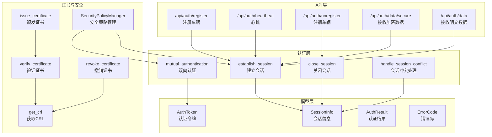
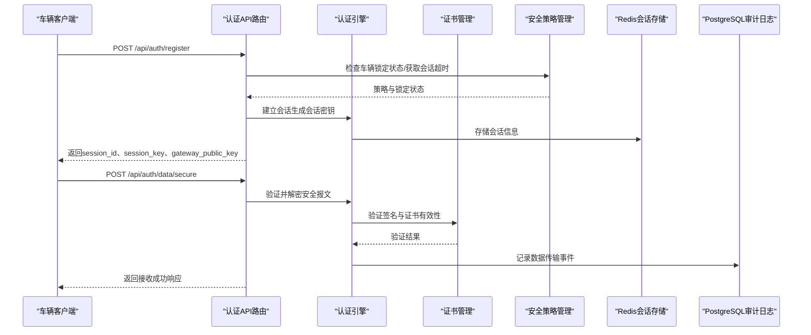
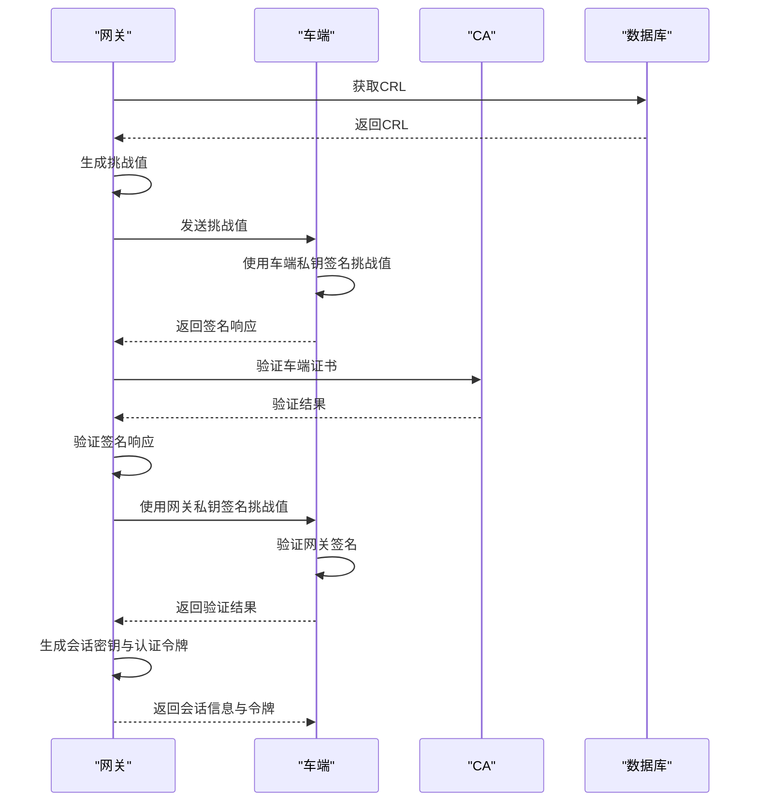
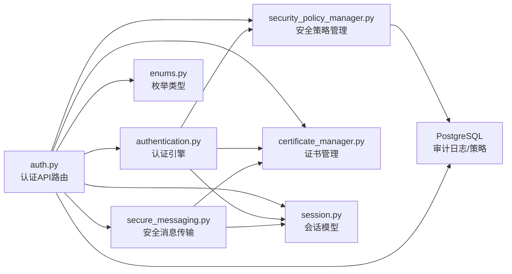

# 身份认证API

<cite>
**本文引用的文件**
- [auth.py](file://src/api/routes/auth.py)
- [authentication.py](file://src/authentication.py)
- [session.py](file://src/models/session.py)
- [enums.py](file://src/models/enums.py)
- [certificate_manager.py](file://src/certificate_manager.py)
- [secure_messaging.py](file://src/secure_messaging.py)
- [security_policy_manager.py](file://src/security_policy_manager.py)
- [vehicle_client.py](file://client/vehicle_client.py)
- [API.md](file://docs/API.md)
- [test_authentication.py](file://tests/test_authentication.py)
- [test_auth_failure_lockout.py](file://test_auth_failure_lockout.py)
</cite>

## 目录
1. [简介](#简介)
2. [项目结构](#项目结构)
3. [核心组件](#核心组件)
4. [架构总览](#架构总览)
5. [详细组件分析](#详细组件分析)
6. [依赖关系分析](#依赖关系分析)
7. [性能考量](#性能考量)
8. [故障排查指南](#故障排查指南)
9. [结论](#结论)
10. [附录](#附录)

## 简介
本文件为车联网安全通信网关的身份认证API提供全面的接口文档，涵盖车辆注册、登录、会话管理、认证令牌获取、双向认证机制、会话超时与并发会话处理、认证失败锁定策略与安全考虑，以及客户端集成示例与最佳实践。文档基于代码库的实际实现，结合API路由、认证模块、会话模型、证书管理与安全策略管理器等核心组件，给出清晰的接口规范与流程图示。

## 项目结构
本项目采用分层架构：
- API层：提供RESTful接口，负责请求解析、鉴权与响应封装
- 认证层：实现双向身份认证、会话建立与管理、安全策略应用
- 模型层：定义会话、令牌、消息、枚举等数据结构
- 证书与安全：提供证书颁发、验证、撤销与CRL管理
- 客户端：提供车辆端模拟器，演示从证书申请到安全数据传输的完整流程

图表来源
- [auth.py:70-685](file://src/api/routes/auth.py#L70-L685)
- [authentication.py:196-364](file://src/authentication.py#L196-L364)
- [session.py:9-104](file://src/models/session.py#L9-L104)
- [enums.py:6-56](file://src/models/enums.py#L6-L56)
- [certificate_manager.py:597-734](file://src/certificate_manager.py#L597-L734)
- [security_policy_manager.py:59-322](file://src/security_policy_manager.py#L59-L322)

章节来源
- [auth.py:1-685](file://src/api/routes/auth.py#L1-L685)
- [authentication.py:1-662](file://src/authentication.py#L1-L662)
- [session.py:1-104](file://src/models/session.py#L1-L104)
- [enums.py:1-56](file://src/models/enums.py#L1-L56)
- [certificate_manager.py:1-734](file://src/certificate_manager.py#L1-L734)
- [security_policy_manager.py:1-322](file://src/security_policy_manager.py#L1-L322)

## 核心组件
- 身份认证API路由：提供注册、心跳、注销、接收加密/明文数据等端点
- 双向认证引擎：实现车端与网关的证书验证与挑战签名验证
- 会话管理：建立、维护、关闭会话，支持会话冲突处理与过期清理
- 安全策略管理：会话超时、并发策略、认证失败锁定与恢复
- 证书管理：证书颁发、验证、撤销与CRL维护
- 安全消息传输：SM4加密与SM2签名的完整流程

章节来源
- [auth.py:70-685](file://src/api/routes/auth.py#L70-L685)
- [authentication.py:90-364](file://src/authentication.py#L90-L364)
- [session.py:9-104](file://src/models/session.py#L9-L104)
- [enums.py:6-56](file://src/models/enums.py#L6-L56)
- [certificate_manager.py:206-332](file://src/certificate_manager.py#L206-L332)
- [security_policy_manager.py:19-322](file://src/security_policy_manager.py#L19-L322)

## 架构总览
下图展示从客户端发起请求到网关完成双向认证与会话建立的整体流程。

图表来源
- [auth.py:70-230](file://src/api/routes/auth.py#L70-L230)
- [authentication.py:366-481](file://src/authentication.py#L366-L481)
- [secure_messaging.py:144-249](file://src/secure_messaging.py#L144-L249)
- [certificate_manager.py:206-332](file://src/certificate_manager.py#L206-L332)
- [security_policy_manager.py:169-231](file://src/security_policy_manager.py#L169-L231)

## 详细组件分析

### 认证API端点规范

#### 注册车辆
- 方法与URL：POST /api/auth/register
- 请求参数（JSON）：
  - vehicle_id: 车辆标识（字符串）
  - certificate_serial: 证书序列号（可选，字符串）
  - public_key: 车辆SM2公钥（hex字符串，可选）
- 成功响应（JSON）：
  - success: 布尔值
  - session_id: 会话ID（字符串）
  - session_key: 会话SM4密钥（hex字符串）
  - gateway_public_key: 网关SM2公钥（hex字符串）
  - message: 描述信息（字符串）

- 失败响应：
  - 403：车辆被锁定
  - 500：内部错误（包含错误详情）

- 审计日志：
  - 成功：记录认证成功事件
  - 失败：记录认证失败事件（含锁定状态）

章节来源
- [auth.py:70-230](file://src/api/routes/auth.py#L70-L230)
- [security_policy_manager.py:169-231](file://src/security_policy_manager.py#L169-L231)

#### 心跳
- 方法与URL：POST /api/auth/heartbeat
- 请求参数（查询参数）：
  - vehicle_id: 车辆标识（字符串）
  - session_id: 会话ID（字符串）
- 成功响应（JSON）：
  - success: 布尔值
  - message: 描述信息（字符串）
  - last_activity: 最后活动时间（ISO 8601字符串）

- 失败响应：
  - 404：会话不存在或已过期
  - 500：内部错误

章节来源
- [auth.py:232-287](file://src/api/routes/auth.py#L232-L287)

#### 注销车辆
- 方法与URL：POST /api/auth/unregister
- 请求参数（查询参数）：
  - vehicle_id: 车辆标识（字符串）
  - session_id: 会话ID（字符串）
- 成功响应（JSON）：
  - success: 布尔值
  - message: 描述信息（字符串）

- 失败响应：
  - 500：内部错误

章节来源
- [auth.py:289-330](file://src/api/routes/auth.py#L289-L330)

#### 接收加密车辆数据
- 方法与URL：POST /api/auth/data/secure
- 请求参数：
  - 查询参数：vehicle_id、session_id
  - 请求体：JSON对象（加密安全报文）
    - header: 报文头（包含版本、消息类型、发送方、接收方、会话ID）
    - encrypted_payload: 加密载荷（hex字符串）
    - signature: 数字签名（hex字符串）
    - timestamp: 时间戳（ISO 8601字符串）
    - nonce: 随机数（hex字符串）
- 成功响应（JSON）：
  - success: 布尔值
  - message: 描述信息（字符串）
  - vehicle_id: 车辆标识（字符串）
  - timestamp: 数据时间戳（字符串）
  - encryption: 加密算法（字符串）
  - signature: 验签状态（字符串）

- 失败响应：
  - 400：安全报文格式错误/数据验证失败
  - 404：会话不存在或已过期
  - 500：内部错误

- 审计日志：
  - 成功：记录数据传输事件（含数据大小）
  - 失败：记录数据传输失败事件

章节来源
- [auth.py:332-540](file://src/api/routes/auth.py#L332-L540)
- [secure_messaging.py:144-249](file://src/secure_messaging.py#L144-L249)

#### 接收明文车辆数据
- 方法与URL：POST /api/auth/data
- 请求参数：
  - 查询参数：vehicle_id、session_id
  - 请求体：JSON对象（原始车辆数据）
- 成功响应（JSON）：
  - success: 布尔值
  - message: 描述信息（字符串）
  - vehicle_id: 车辆标识（字符串）
  - timestamp: 数据时间戳（字符串）

- 失败响应：
  - 404：会话不存在或已过期
  - 500：内部错误

- 审计日志：
  - 成功：记录数据传输事件（含数据大小）
  - 失败：记录数据传输失败事件

章节来源
- [auth.py:542-685](file://src/api/routes/auth.py#L542-L685)

### 双向认证机制
双向认证流程包括车端与网关的证书验证、挑战签名与验证、会话密钥生成与令牌签发。

图表来源
- [authentication.py:196-364](file://src/authentication.py#L196-L364)
- [certificate_manager.py:206-332](file://src/certificate_manager.py#L206-L332)

章节来源
- [authentication.py:90-364](file://src/authentication.py#L90-L364)
- [certificate_manager.py:206-332](file://src/certificate_manager.py#L206-L332)

### 会话管理与超时
- 会话建立：生成会话ID与SM4会话密钥，写入Redis并维护车辆到会话映射
- 会话超时：从安全策略管理器获取超时时间（秒），设置Redis TTL
- 会话关闭：删除会话键与车辆映射键
- 会话冲突：支持“拒绝新会话”或“终止旧会话”两种策略
- 过期清理：Redis TTL自动清理过期键；提供主动清理接口

章节来源
- [authentication.py:366-552](file://src/authentication.py#L366-L552)
- [security_policy_manager.py:282-310](file://src/security_policy_manager.py#L282-L310)

### 认证失败锁定策略
- 记录认证失败：数据库表auth_failure_records维护失败次数、最后失败时间、锁定截止时间
- 锁定阈值与持续时间：由安全策略管理器配置
- 锁定期间：拒绝新会话建立
- 锁定恢复：到达锁定截止时间后自动解锁

章节来源
- [security_policy_manager.py:169-281](file://src/security_policy_manager.py#L169-L281)
- [test_auth_failure_lockout.py:1-193](file://test_auth_failure_lockout.py#L1-L193)

### 安全考虑
- 证书验证：使用SM2签名验证证书链与CRL
- 防重放：nonce与时间戳容差控制
- 会话密钥：SM4对称加密，支持128/256位
- 审计日志：记录认证与数据传输事件，便于追踪与合规
- 并发策略：支持拒绝新会话或终止旧会话

章节来源
- [secure_messaging.py:144-249](file://src/secure_messaging.py#L144-L249)
- [certificate_manager.py:206-332](file://src/certificate_manager.py#L206-L332)
- [enums.py:6-56](file://src/models/enums.py#L6-L56)

### 客户端集成示例与最佳实践
- 客户端行为：生成SM2密钥对、申请证书、注册为在线车辆、发送加密数据、注销
- 最佳实践：
  - 使用HTTPS与强证书校验
  - 定期发送心跳保持会话活跃
  - 严格管理会话密钥与令牌
  - 监控认证失败与锁定状态
  - 使用安全存储保护私钥与会话密钥

章节来源
- [vehicle_client.py:1-809](file://client/vehicle_client.py#L1-L809)

## 依赖关系分析

图表来源
- [auth.py:1-685](file://src/api/routes/auth.py#L1-L685)
- [authentication.py:1-662](file://src/authentication.py#L1-L662)
- [secure_messaging.py:1-249](file://src/secure_messaging.py#L1-L249)
- [certificate_manager.py:1-734](file://src/certificate_manager.py#L1-L734)
- [security_policy_manager.py:1-322](file://src/security_policy_manager.py#L1-L322)
- [session.py:1-104](file://src/models/session.py#L1-L104)
- [enums.py:1-56](file://src/models/enums.py#L1-L56)

章节来源
- [auth.py:1-685](file://src/api/routes/auth.py#L1-L685)
- [authentication.py:1-662](file://src/authentication.py#L1-L662)
- [secure_messaging.py:1-249](file://src/secure_messaging.py#L1-L249)
- [certificate_manager.py:1-734](file://src/certificate_manager.py#L1-L734)
- [security_policy_manager.py:1-322](file://src/security_policy_manager.py#L1-L322)
- [session.py:1-104](file://src/models/session.py#L1-L104)
- [enums.py:1-56](file://src/models/enums.py#L1-L56)

## 性能考量
- Redis会话存储：高吞吐、低延迟，适合高频会话查询与更新
- 证书验证缓存：LRU缓存提升验证性能，减少数据库压力
- CRL与策略缓存：安全策略定期缓存，降低数据库查询频率
- 防重放与时间戳：合理的容差设置避免频繁的时钟漂移导致的失败

[本节为通用指导，无需特定文件来源]

## 故障排查指南
- 认证失败锁定
  - 现象：注册返回403，提示车辆被锁定
  - 排查：检查auth_failure_records表中的锁定截止时间
  - 处理：等待锁定到期或调整安全策略
- 会话不存在或已过期
  - 现象：心跳/数据接收返回404
  - 排查：确认session_id是否正确，检查Redis中会话键是否存在
  - 处理：重新注册建立新会话
- 数据验证失败
  - 现象：接收加密数据返回400
  - 排查：检查签名、nonce、时间戳与会话密钥
  - 处理：修正客户端加密/签名流程
- 审计日志异常
  - 现象：数据传输失败但审计日志未记录
  - 排查：确认PostgreSQL连接与权限
  - 处理：修复数据库连接或降级处理

章节来源
- [security_policy_manager.py:169-281](file://src/security_policy_manager.py#L169-L281)
- [auth.py:232-287](file://src/api/routes/auth.py#L232-L287)
- [secure_messaging.py:144-249](file://src/secure_messaging.py#L144-L249)

## 结论
本文档基于代码库实现了车联网安全通信网关的身份认证API规范，覆盖了注册、心跳、注销、加密数据接收等核心能力，明确了双向认证机制、会话管理策略、认证失败锁定与安全考虑，并提供了客户端集成示例与最佳实践。建议在生产环境中结合安全策略管理器配置、证书生命周期管理与审计日志监控，确保系统的安全性与稳定性。

[本节为总结，无需特定文件来源]

## 附录

### 请求与响应示例

- 成功注册
  - 请求：POST /api/auth/register
  - 响应：包含session_id、session_key、gateway_public_key与成功消息
- 认证失败锁定
  - 请求：POST /api/auth/register（在锁定期内）
  - 响应：403，提示车辆被锁定
- 成功接收加密数据
  - 请求：POST /api/auth/data/secure（携带加密报文）
  - 响应：success为true，包含数据接收确认与签名验证状态
- 会话不存在
  - 请求：POST /api/auth/heartbeat（使用无效session_id）
  - 响应：404，提示会话不存在或已过期

章节来源
- [auth.py:70-230](file://src/api/routes/auth.py#L70-L230)
- [auth.py:232-287](file://src/api/routes/auth.py#L232-L287)
- [auth.py:332-540](file://src/api/routes/auth.py#L332-L540)
- [test_authentication.py:1-520](file://tests/test_authentication.py#L1-L520)