# 车辆管理API

<cite>
**本文档引用的文件**
- [vehicles.py](file://src/api/routes/vehicles.py)
- [auth.py](file://src/api/routes/auth.py)
- [main.py](file://src/api/main.py)
- [vehicles.js](file://web/src/api/vehicles.js)
- [security_gateway.py](file://src/security_gateway.py)
- [secure_messaging.py](file://src/secure_messaging.py)
- [authentication.py](file://src/authentication.py)
- [message.py](file://src/models/message.py)
- [sm2.py](file://src/crypto/sm2.py)
- [sm4.py](file://src/crypto/sm4.py)
- [postgres.py](file://src/db/postgres.py)
- [redis_client.py](file://src/db/redis_client.py)
- [schema.sql](file://db/schema.sql)
- [API.md](file://docs/API.md)
- [ENCRYPTED_TRANSMISSION_GUIDE.md](file://ENCRYPTED_TRANSMISSION_GUIDE.md)
- [test_vehicle_data_flow.py](file://examples/test_vehicle_data_flow.py)
</cite>

## 目录
1. [简介](#简介)
2. [项目结构](#项目结构)
3. [核心组件](#核心组件)
4. [架构概览](#架构概览)
5. [详细组件分析](#详细组件分析)
6. [依赖关系分析](#依赖关系分析)
7. [性能考虑](#性能考虑)
8. [故障排除指南](#故障排除指南)
9. [结论](#结论)
10. [附录](#附录)

## 简介

车联网安全通信网关提供了一套完整的车辆管理API，支持车辆状态监控、数据传输、连接管理等核心功能。该系统基于国密算法（SM2、SM4）实现了端到端的安全通信，确保车辆数据在传输过程中的机密性和完整性。

系统采用FastAPI框架构建RESTful API接口，集成了Redis缓存、PostgreSQL数据库和Kubernetes容器化部署。主要功能包括：

- **车辆状态监控**：实时在线状态查询、车辆详情查询、车辆搜索
- **数据传输管理**：明文和加密数据传输、历史数据查询、GPS轨迹追踪
- **连接管理**：会话建立、心跳维持、会话清理
- **安全通信**：基于国密算法的加密传输、数字签名验证、防重放攻击

## 项目结构

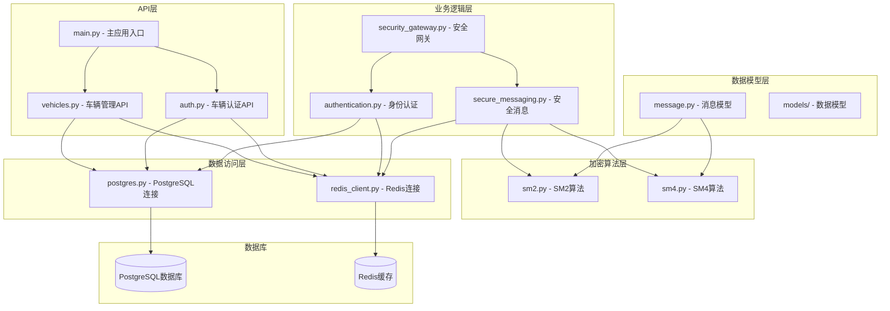

**图表来源**
- [main.py:1-108](file://src/api/main.py#L1-L108)
- [vehicles.py:1-447](file://src/api/routes/vehicles.py#L1-L447)
- [auth.py:1-685](file://src/api/routes/auth.py#L1-L685)

**章节来源**
- [main.py:1-108](file://src/api/main.py#L1-L108)
- [vehicles.py:1-447](file://src/api/routes/vehicles.py#L1-L447)
- [auth.py:1-685](file://src/api/routes/auth.py#L1-L685)

## 核心组件

### API路由器组件

系统采用模块化的API设计，每个功能模块都有独立的路由器：

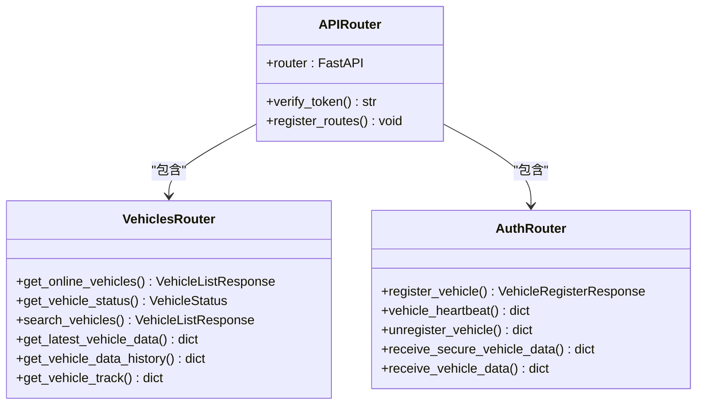

**图表来源**
- [vehicles.py:19-238](file://src/api/routes/vehicles.py#L19-L238)
- [auth.py:20-330](file://src/api/routes/auth.py#L20-L330)

### 数据模型组件

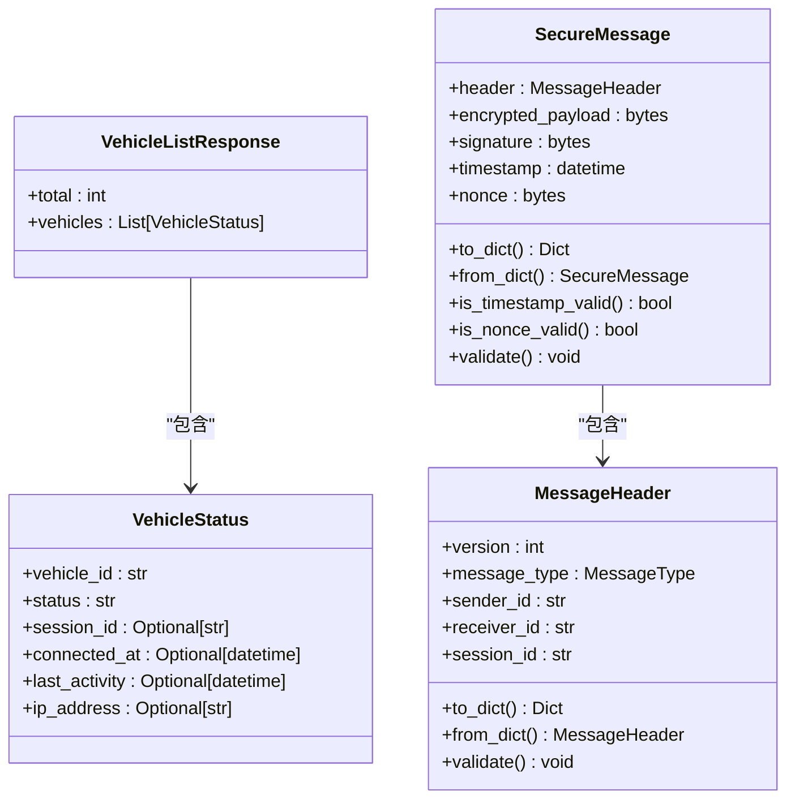

**图表来源**
- [vehicles.py:22-36](file://src/api/routes/vehicles.py#L22-L36)
- [message.py:9-200](file://src/models/message.py#L9-L200)

**章节来源**
- [vehicles.py:22-36](file://src/api/routes/vehicles.py#L22-L36)
- [message.py:9-200](file://src/models/message.py#L9-L200)

## 架构概览

系统采用分层架构设计，确保关注点分离和模块化：

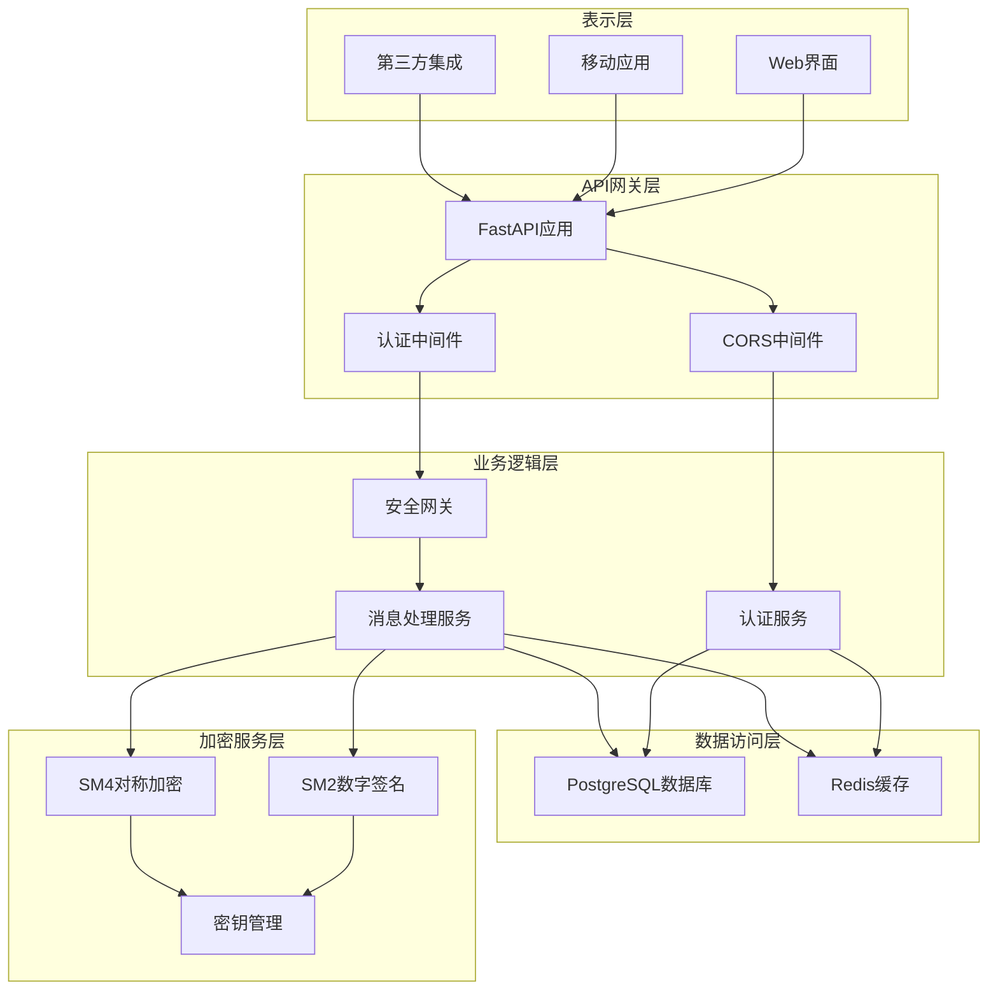

**图表来源**
- [main.py:13-108](file://src/api/main.py#L13-L108)
- [security_gateway.py:37-800](file://src/security_gateway.py#L37-L800)

### 安全通信流程

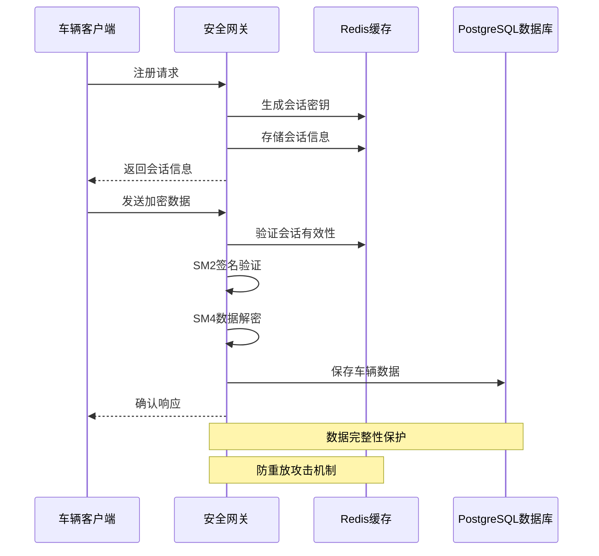

**图表来源**
- [auth.py:332-540](file://src/api/routes/auth.py#L332-L540)
- [secure_messaging.py:144-249](file://src/secure_messaging.py#L144-L249)

**章节来源**
- [main.py:13-108](file://src/api/main.py#L13-L108)
- [security_gateway.py:37-800](file://src/security_gateway.py#L37-L800)

## 详细组件分析

### 车辆状态管理API

#### 在线车辆查询

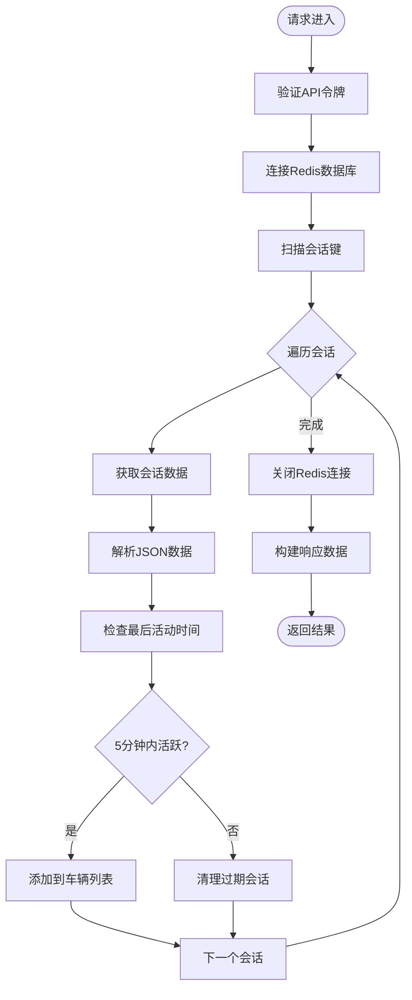

**图表来源**
- [vehicles.py:38-99](file://src/api/routes/vehicles.py#L38-L99)

#### 车辆状态查询

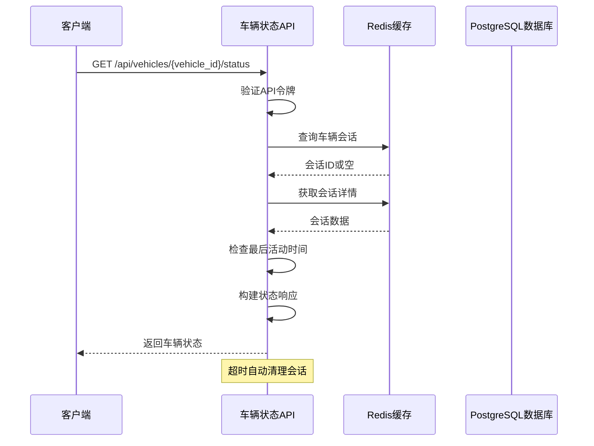

**图表来源**
- [vehicles.py:102-182](file://src/api/routes/vehicles.py#L102-L182)

**章节来源**
- [vehicles.py:38-182](file://src/api/routes/vehicles.py#L38-L182)

### 数据传输管理API

#### 加密数据传输

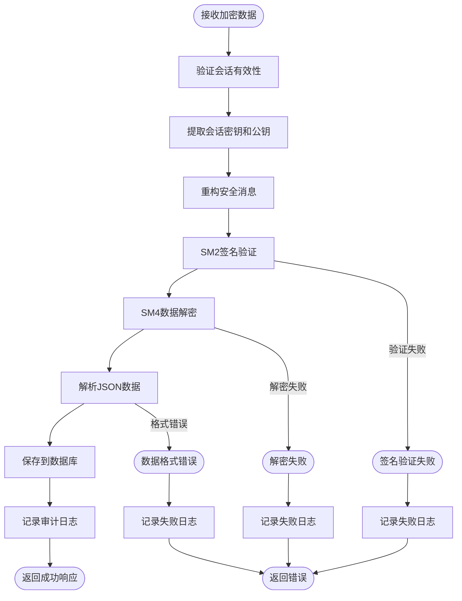

**图表来源**
- [auth.py:332-540](file://src/api/routes/auth.py#L332-L540)
- [secure_messaging.py:144-249](file://src/secure_messaging.py#L144-L249)

#### 历史数据查询

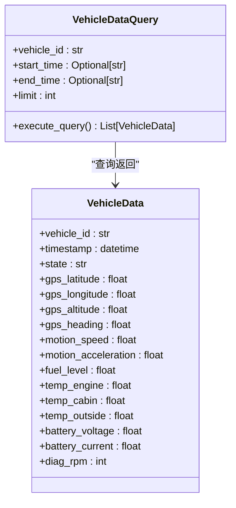

**图表来源**
- [vehicles.py:319-386](file://src/api/routes/vehicles.py#L319-L386)

**章节来源**
- [auth.py:332-540](file://src/api/routes/auth.py#L332-L540)
- [vehicles.py:319-386](file://src/api/routes/vehicles.py#L319-L386)

### 连接管理API

#### 会话生命周期管理

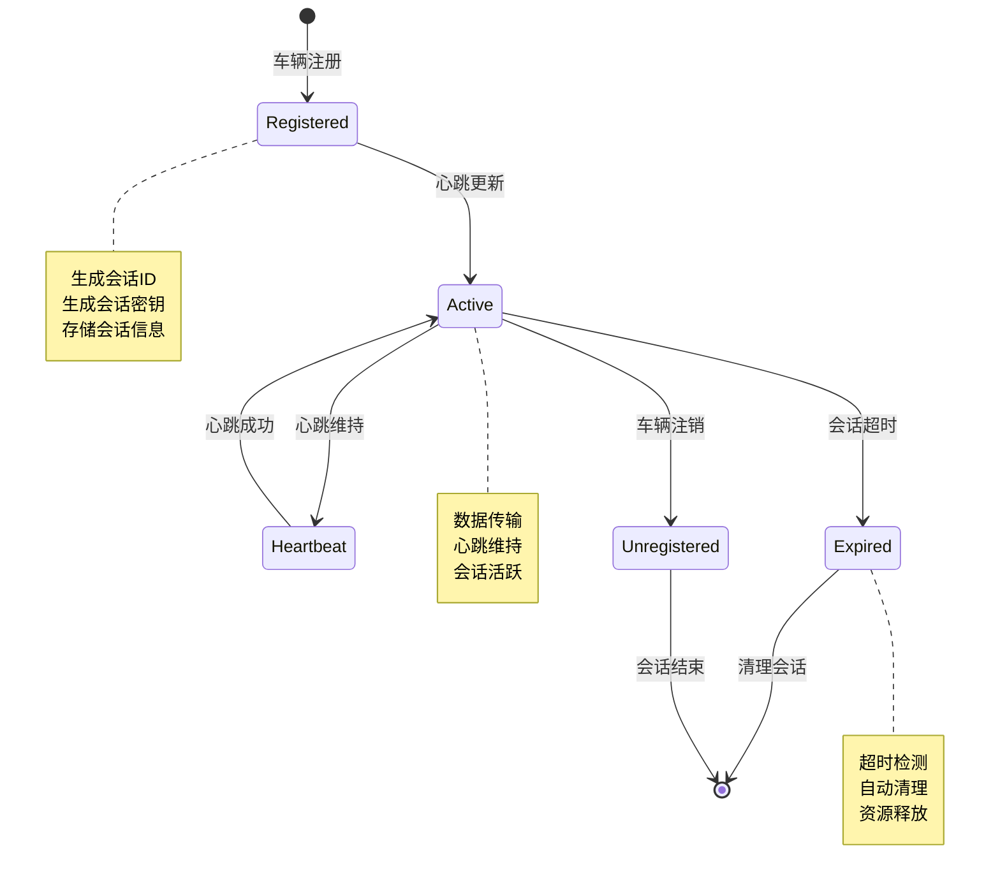

**图表来源**
- [auth.py:70-330](file://src/api/routes/auth.py#L70-L330)

**章节来源**
- [auth.py:70-330](file://src/api/routes/auth.py#L70-L330)

## 依赖关系分析

### 外部依赖关系

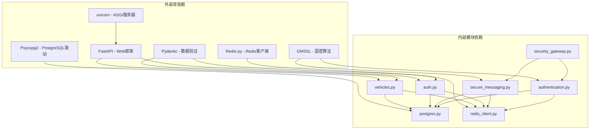

**图表来源**
- [main.py:13-108](file://src/api/main.py#L13-L108)
- [vehicles.py:8-17](file://src/api/routes/vehicles.py#L8-L17)
- [auth.py:6-18](file://src/api/routes/auth.py#L6-L18)

### 内部模块耦合

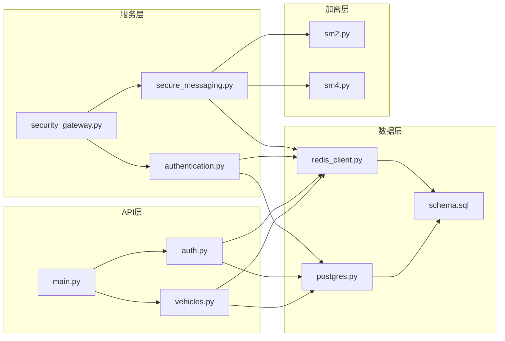

**图表来源**
- [security_gateway.py:36-128](file://src/security_gateway.py#L36-L128)
- [authentication.py:13-21](file://src/authentication.py#L13-L21)

**章节来源**
- [main.py:13-108](file://src/api/main.py#L13-L108)
- [security_gateway.py:36-128](file://src/security_gateway.py#L36-L128)

## 性能考虑

### 缓存策略

系统采用Redis作为缓存层，实现高性能的数据访问：

- **会话缓存**：车辆会话信息存储在Redis中，支持快速查找和更新
- **键空间优化**：使用命名空间组织键，避免命名冲突
- **TTL管理**：自动过期机制确保缓存数据及时清理
- **批量操作**：支持SCAN命令进行高效键扫描

### 数据库优化

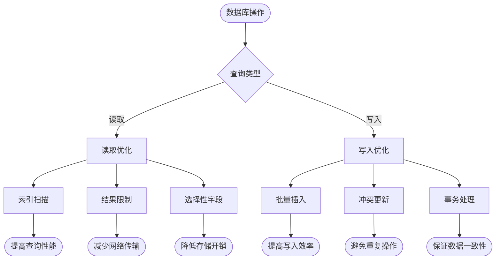

**图表来源**
- [postgres.py:32-45](file://src/db/postgres.py#L32-L45)
- [redis_client.py:51-71](file://src/db/redis_client.py#L51-L71)

### 加密性能优化

- **算法选择**：SM2用于数字签名，SM4用于数据加密，符合国密标准
- **密钥管理**：会话密钥随机生成，定期轮换，提高安全性
- **批处理支持**：支持批量数据处理，减少加密开销
- **内存管理**：及时清理敏感数据，防止内存泄漏

## 故障排除指南

### 常见错误类型

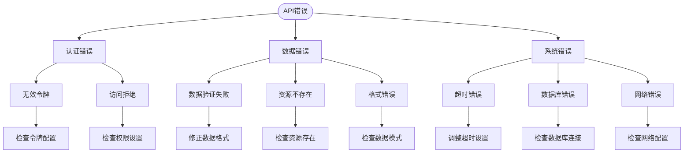

**图表来源**
- [vehicles.py:95-181](file://src/api/routes/vehicles.py#L95-L181)
- [auth.py:200-330](file://src/api/routes/auth.py#L200-L330)

### 调试工具和方法

#### API测试工具

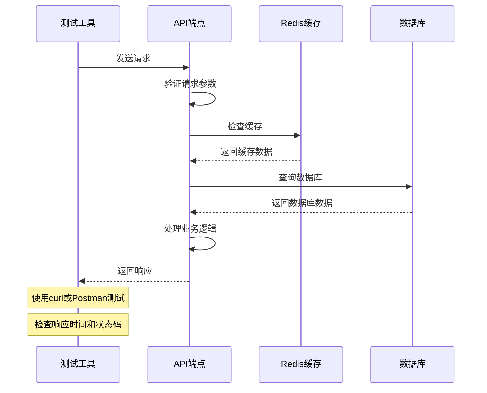

**图表来源**
- [test_vehicle_data_flow.py:178-245](file://examples/test_vehicle_data_flow.py#L178-L245)

#### 日志分析

系统提供了全面的日志记录机制，包括：

- **审计日志**：记录所有安全相关事件
- **操作日志**：记录API调用和数据变更
- **性能日志**：记录系统性能指标
- **错误日志**：记录异常和错误信息

**章节来源**
- [vehicles.py:95-181](file://src/api/routes/vehicles.py#L95-L181)
- [auth.py:200-330](file://src/api/routes/auth.py#L200-L330)
- [test_vehicle_data_flow.py:178-245](file://examples/test_vehicle_data_flow.py#L178-L245)

## 结论

车联网安全通信网关提供了一个完整、安全、高效的车辆管理解决方案。系统采用模块化设计，支持灵活的功能扩展和维护。通过集成国密算法和多种安全机制，确保了车辆数据在传输和存储过程中的安全性。

主要优势包括：

- **安全性**：基于SM2/SM4的端到端加密，防重放攻击，数字签名验证
- **可靠性**：会话管理、心跳机制、自动清理，确保系统稳定运行
- **可扩展性**：模块化架构，支持功能扩展和性能优化
- **易用性**：RESTful API设计，提供完整的前端集成支持

建议在生产环境中进一步加强安全配置，包括HTTPS加密、访问控制、监控告警等方面的部署。

## 附录

### API端点完整列表

#### 车辆管理API

| 方法 | 路径 | 描述 | 认证 |
|------|------|------|------|
| GET | `/api/vehicles/online` | 获取在线车辆列表 | 是 |
| GET | `/api/vehicles/{vehicle_id}/status` | 获取车辆状态 | 是 |
| GET | `/api/vehicles/search` | 搜索车辆 | 是 |
| GET | `/api/vehicles/{vehicle_id}/data/latest` | 获取最新数据 | 是 |
| GET | `/api/vehicles/{vehicle_id}/data/history` | 获取历史数据 | 是 |
| GET | `/api/vehicles/{vehicle_id}/data/track` | 获取GPS轨迹 | 是 |

#### 车辆认证API

| 方法 | 路径 | 描述 | 认证 |
|------|------|------|------|
| POST | `/api/auth/register` | 车辆注册 | 是 |
| POST | `/api/auth/heartbeat` | 心跳维持 | 是 |
| POST | `/api/auth/unregister` | 车辆注销 | 是 |
| POST | `/api/auth/data/secure` | 接收加密数据 | 是 |
| POST | `/api/auth/data` | 接收明文数据 | 是 |

### 数据验证规则

#### 车辆状态模型验证

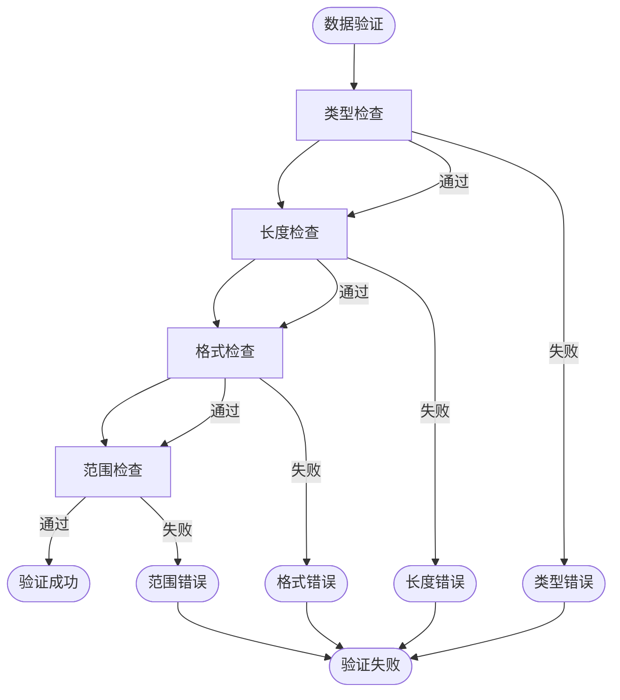

**图表来源**
- [message.py:57-186](file://src/models/message.py#L57-L186)

### 安全配置建议

#### 加密传输配置

- **会话密钥**：使用SM4算法，128位密钥长度
- **数字签名**：使用SM2算法，64字节签名长度
- **Nonce机制**：16字节唯一随机数，防重放攻击
- **时间戳验证**：±5分钟容差范围
- **密钥轮换**：24小时自动轮换周期

#### 访问控制配置

- **API令牌**：Bearer Token认证机制
- **权限管理**：基于角色的访问控制
- **速率限制**：防止API滥用和DDoS攻击
- **审计日志**：完整记录所有操作行为

**章节来源**
- [ENCRYPTED_TRANSMISSION_GUIDE.md:1-264](file://ENCRYPTED_TRANSMISSION_GUIDE.md#L1-L264)
- [API.md:625-654](file://docs/API.md#L625-L654)