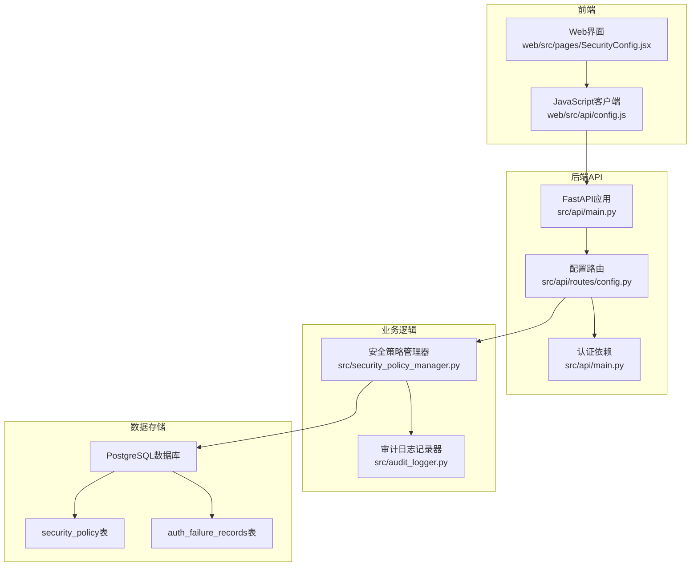
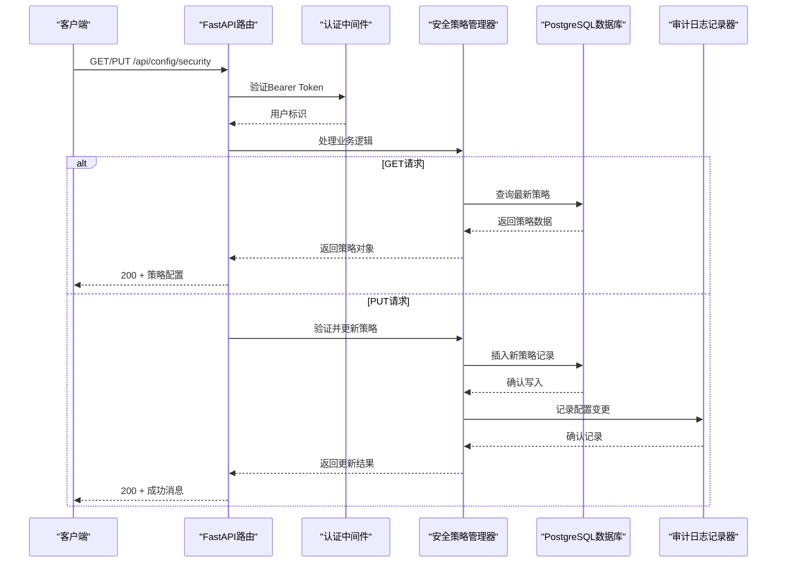
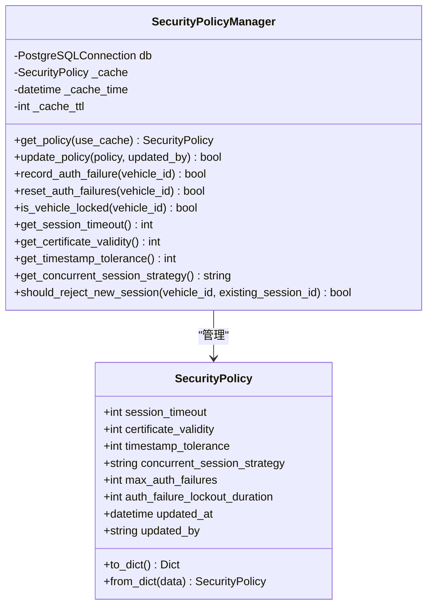
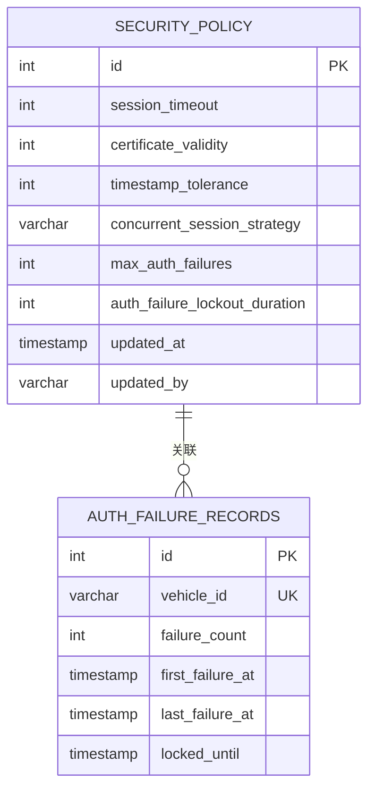
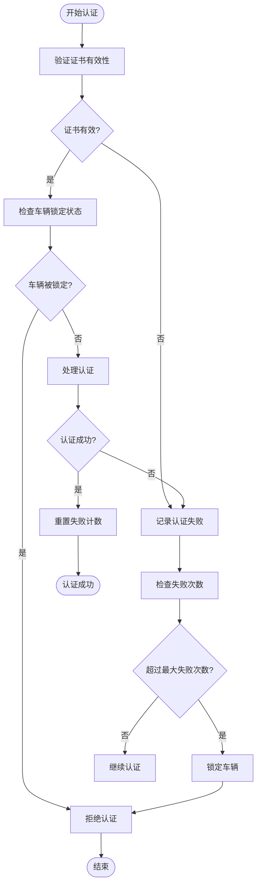
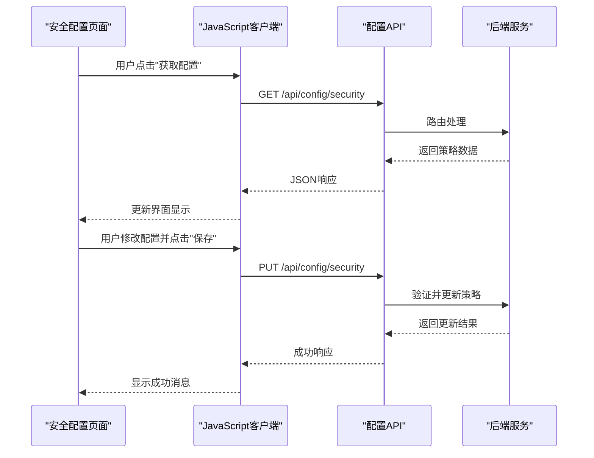
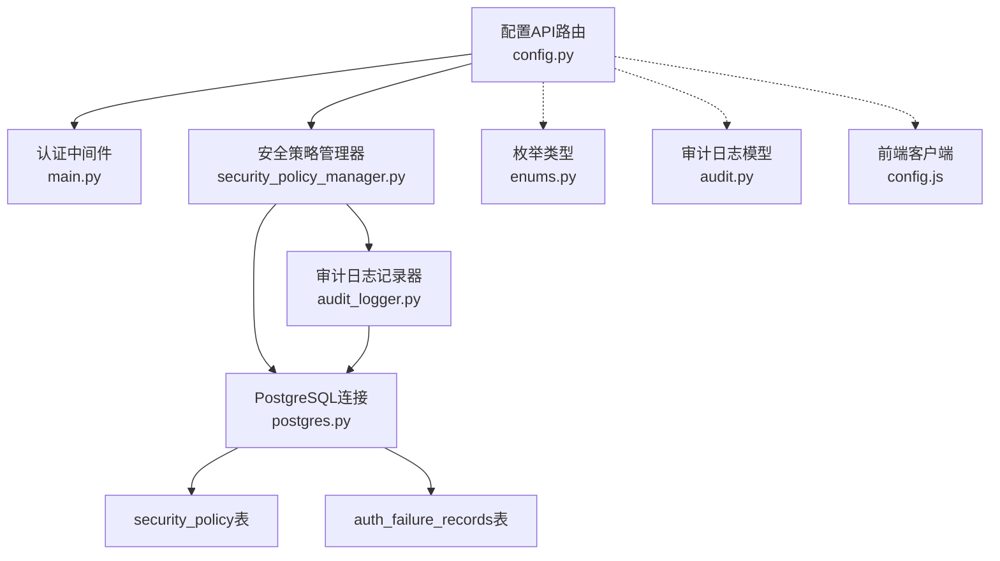

# 配置管理API

<cite>
**本文引用的文件**
- [config.py](file://src/api/routes/config.py)
- [security_policy_manager.py](file://src/security_policy_manager.py)
- [enums.py](file://src/models/enums.py)
- [audit.py](file://src/models/audit.py)
- [config.js](file://web/src/api/config.js)
- [003_security_policy_table.sql](file://db/migrations/003_security_policy_table.sql)
- [schema.sql](file://db/schema.sql)
- [main.py](file://src/api/main.py)
- [API.md](file://docs/API.md)
- [test_security_config_api.sh](file://test_security_config_api.sh)
- [audit_logger.py](file://src/audit_logger.py)
- [authentication.py](file://src/authentication.py)
</cite>

## 目录
1. [简介](#简介)
2. [项目结构](#项目结构)
3. [核心组件](#核心组件)
4. [架构概览](#架构概览)
5. [详细组件分析](#详细组件分析)
6. [依赖分析](#依赖分析)
7. [性能考虑](#性能考虑)
8. [故障排除指南](#故障排除指南)
9. [结论](#结论)
10. [附录](#附录)

## 简介
本文档为车联网安全通信网关的配置管理API提供完整的接口规范，涵盖安全策略配置、系统参数设置、功能开关控制等关键能力。文档详细说明了HTTP方法、URL模式、请求参数和响应格式，解释了安全策略的动态配置机制、参数验证规则和生效策略。同时提供了配置示例、版本管理与回滚机制、变更审计、批量配置更新、模板管理以及配置导入导出功能的最佳实践和安全加固建议。

## 项目结构
配置管理API位于后端服务的API路由层，采用FastAPI框架构建，结合PostgreSQL数据库进行配置持久化。前端通过JavaScript客户端调用这些API端点。



**图表来源**
- [main.py:13-34](file://src/api/main.py#L13-L34)
- [config.py:8-17](file://src/api/routes/config.py#L8-L17)
- [security_policy_manager.py:59-72](file://src/security_policy_manager.py#L59-L72)

**章节来源**
- [main.py:1-108](file://src/api/main.py#L1-L108)
- [config.py:1-173](file://src/api/routes/config.py#L1-L173)

## 核心组件
配置管理API的核心组件包括：
- **安全策略配置端点**：提供安全策略的查询和更新功能
- **安全策略管理器**：负责策略的持久化存储和应用
- **认证中间件**：确保API访问的安全性
- **数据库模型**：定义安全策略和认证失败记录的数据结构
- **审计日志集成**：记录配置变更的历史

**章节来源**
- [config.py:20-62](file://src/api/routes/config.py#L20-L62)
- [security_policy_manager.py:19-57](file://src/security_policy_manager.py#L19-L57)
- [main.py:49-74](file://src/api/main.py#L49-L74)

## 架构概览
配置管理API采用分层架构设计，确保职责分离和代码可维护性。



**图表来源**
- [config.py:64-173](file://src/api/routes/config.py#L64-L173)
- [security_policy_manager.py:73-168](file://src/security_policy_manager.py#L73-L168)
- [audit_logger.py:58-135](file://src/audit_logger.py#L58-L135)

## 详细组件分析

### 安全策略配置端点

#### GET /api/config/security
获取当前安全策略配置。

**请求参数**
- 认证：Bearer Token（必需）
- Content-Type：application/json

**响应格式**
```json
{
  "policy": {
    "session_timeout": 86400,
    "certificate_validity": 365,
    "timestamp_tolerance": 300,
    "concurrent_session_strategy": "reject_new",
    "max_auth_failures": 5,
    "auth_failure_lockout_duration": 300
  },
  "message": "成功获取安全策略"
}
```

**状态码**
- 200：成功获取配置
- 401：未授权
- 500：服务器内部错误

#### PUT /api/config/security
更新安全策略配置。

**请求体参数**
- session_timeout：会话超时时间（秒），范围300-604800，默认86400
- certificate_validity：证书有效期（天），范围30-1825，默认365
- timestamp_tolerance：时间戳容差（秒），范围60-600，默认300
- concurrent_session_strategy：并发会话处理策略，"reject_new"或"terminate_old"
- max_auth_failures：最大认证失败次数（3-10），默认5
- auth_failure_lockout_duration：认证失败锁定时长（秒），范围60-3600，默认300

**响应格式**
```json
{
  "policy": {
    "session_timeout": 7200,
    "certificate_validity": 180,
    "timestamp_tolerance": 600,
    "concurrent_session_strategy": "terminate_old",
    "max_auth_failures": 3,
    "auth_failure_lockout_duration": 600
  },
  "message": "安全策略更新成功并已持久化，立即生效"
}
```

**状态码**
- 200：成功更新配置
- 400：参数验证失败
- 401：未授权
- 500：服务器内部错误

**章节来源**
- [config.py:64-173](file://src/api/routes/config.py#L64-L173)

### 安全策略管理器

安全策略管理器负责策略的持久化存储和应用，包含以下核心功能：



**图表来源**
- [security_policy_manager.py:19-57](file://src/security_policy_manager.py#L19-L57)
- [security_policy_manager.py:59-322](file://src/security_policy_manager.py#L59-L322)

**章节来源**
- [security_policy_manager.py:19-322](file://src/security_policy_manager.py#L19-L322)

### 数据库架构

安全策略配置采用版本化的数据库表设计，支持历史记录追踪和回滚功能。



**图表来源**
- [003_security_policy_table.sql:4-53](file://db/migrations/003_security_policy_table.sql#L4-L53)
- [schema.sql:64-99](file://db/schema.sql#L64-L99)

**章节来源**
- [003_security_policy_table.sql:1-62](file://db/migrations/003_security_policy_table.sql#L1-L62)
- [schema.sql:64-104](file://db/schema.sql#L64-L104)

### 认证失败锁定机制

系统实现了智能的认证失败锁定机制，防止暴力破解攻击：



**图表来源**
- [security_policy_manager.py:169-231](file://src/security_policy_manager.py#L169-L231)

**章节来源**
- [security_policy_manager.py:169-231](file://src/security_policy_manager.py#L169-L231)

### 前端集成

前端通过JavaScript客户端调用配置管理API：



**图表来源**
- [config.js:3-11](file://web/src/api/config.js#L3-L11)
- [config.py:64-173](file://src/api/routes/config.py#L64-L173)

**章节来源**
- [config.js:1-12](file://web/src/api/config.js#L1-L12)

## 依赖分析

配置管理API的依赖关系清晰明确，遵循单一职责原则：



**图表来源**
- [config.py:8-17](file://src/api/routes/config.py#L8-L17)
- [security_policy_manager.py:16-17](file://src/security_policy_manager.py#L16-L17)
- [main.py:49-74](file://src/api/main.py#L49-L74)

**章节来源**
- [config.py:8-17](file://src/api/routes/config.py#L8-L17)
- [security_policy_manager.py:16-17](file://src/security_policy_manager.py#L16-L17)
- [main.py:49-74](file://src/api/main.py#L49-L74)

## 性能考虑
配置管理API在设计时充分考虑了性能优化：

- **缓存机制**：安全策略管理器内置60秒缓存，减少数据库查询压力
- **批量操作**：支持一次性更新多个配置参数，减少网络往返
- **索引优化**：数据库表建立适当的索引，加速查询性能
- **连接池**：使用PostgreSQL连接池管理数据库连接
- **异步处理**：审计日志记录采用异步方式，不影响主业务流程

## 故障排除指南

### 常见问题及解决方案

**问题1：认证失败**
- 检查API令牌是否正确设置
- 确认环境变量API_TOKEN配置正确
- 验证Bearer Token格式

**问题2：配置更新失败**
- 检查请求参数是否在允许范围内
- 确认数据库连接正常
- 查看服务器日志获取详细错误信息

**问题3：缓存问题**
- 等待60秒缓存自动刷新
- 手动重启服务清除缓存
- 检查缓存配置参数

**问题4：数据库连接问题**
- 验证PostgreSQL服务状态
- 检查连接参数配置
- 确认数据库权限设置

**章节来源**
- [main.py:61-74](file://src/api/main.py#L61-L74)
- [security_policy_manager.py:83-85](file://src/security_policy_manager.py#L83-L85)

## 结论
车联网安全通信网关的配置管理API提供了完整的安全策略配置能力，具有以下特点：

- **安全性**：严格的参数验证和认证机制
- **可靠性**：完善的错误处理和回滚机制
- **可维护性**：清晰的代码结构和文档
- **可扩展性**：支持版本管理和审计追踪
- **易用性**：简洁的API设计和丰富的示例

该API为车联网系统的安全配置提供了坚实的技术基础，支持动态调整安全策略以适应不同的安全需求和威胁环境。

## 附录

### 配置参数说明

| 参数名称 | 类型 | 默认值 | 最小值 | 最大值 | 描述 |
|---------|------|--------|--------|--------|------|
| session_timeout | int | 86400 | 300 | 604800 | 会话超时时间（秒） |
| certificate_validity | int | 365 | 30 | 1825 | 证书有效期（天） |
| timestamp_tolerance | int | 300 | 60 | 600 | 时间戳容差（秒） |
| max_auth_failures | int | 5 | 3 | 10 | 最大认证失败次数 |
| auth_failure_lockout_duration | int | 300 | 60 | 3600 | 认证失败锁定时长（秒） |

### 安全加固建议

1. **强化认证机制**
   - 使用更强的API令牌管理
   - 实施多因素认证
   - 定期轮换API密钥

2. **增强参数验证**
   - 实施更严格的输入验证
   - 添加参数白名单机制
   - 实现参数默认值校验

3. **优化审计功能**
   - 增加配置变更的详细审计
   - 实现配置差异对比
   - 添加配置变更通知机制

4. **提升系统稳定性**
   - 实现配置备份和恢复
   - 添加配置版本控制
   - 建立配置变更审批流程