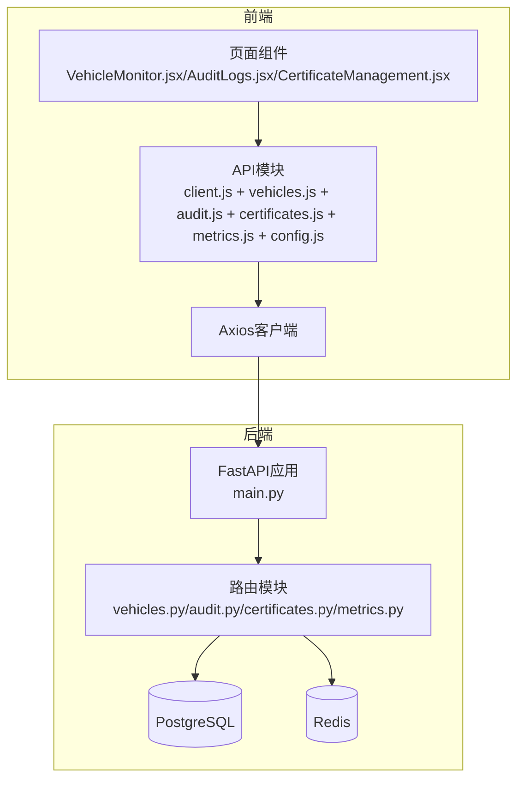
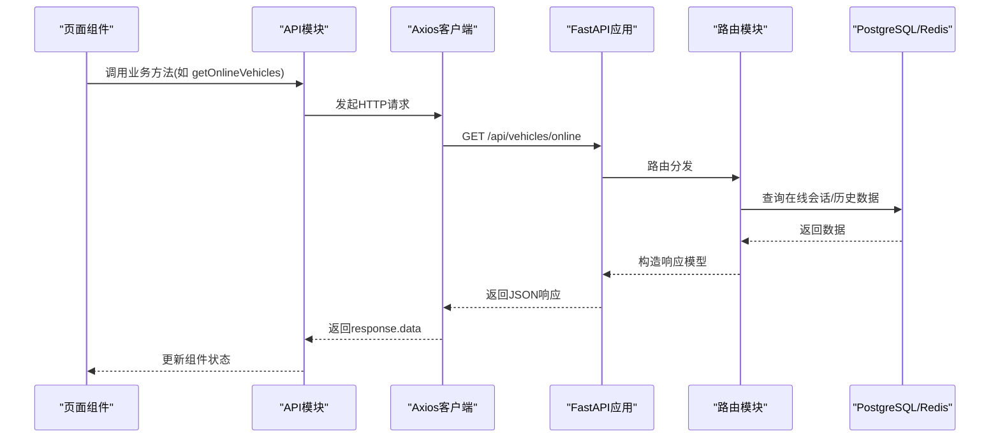
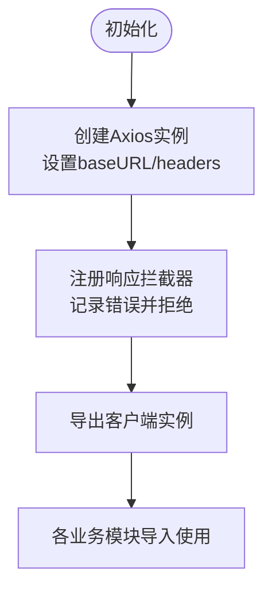
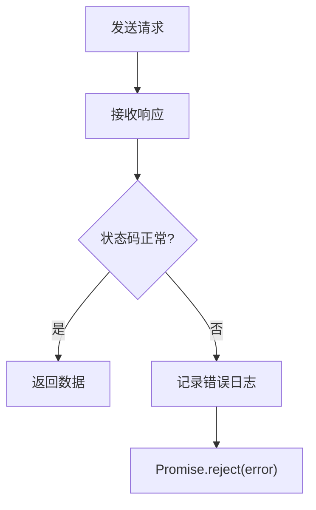
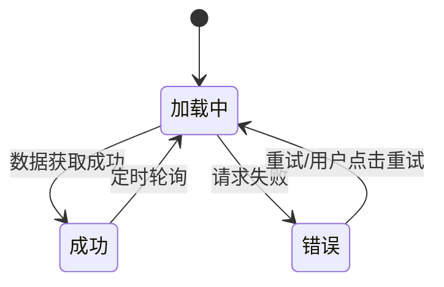
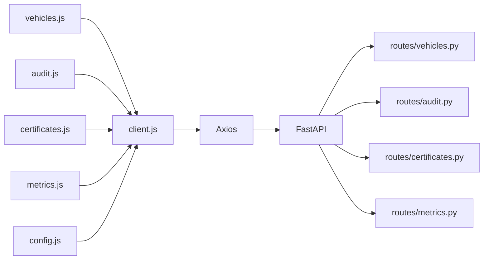

# API集成与数据管理

<cite>
**本文档引用的文件**
- [web/src/api/client.js](file://web/src/api/client.js)
- [web/src/api/vehicles.js](file://web/src/api/vehicles.js)
- [web/src/api/audit.js](file://web/src/api/audit.js)
- [web/src/api/certificates.js](file://web/src/api/certificates.js)
- [web/src/api/metrics.js](file://web/src/api/metrics.js)
- [web/src/api/config.js](file://web/src/api/config.js)
- [web/src/App.jsx](file://web/src/App.jsx)
- [web/src/pages/VehicleMonitor.jsx](file://web/src/pages/VehicleMonitor.jsx)
- [web/src/pages/AuditLogs.jsx](file://web/src/pages/AuditLogs.jsx)
- [web/src/pages/CertificateManagement.jsx](file://web/src/pages/CertificateManagement.jsx)
- [src/api/main.py](file://src/api/main.py)
- [src/api/routes/vehicles.py](file://src/api/routes/vehicles.py)
- [src/api/routes/audit.py](file://src/api/routes/audit.py)
- [src/api/routes/certificates.py](file://src/api/routes/certificates.py)
- [src/api/routes/metrics.py](file://src/api/routes/metrics.py)
</cite>

## 目录
1. [简介](#简介)
2. [项目结构](#项目结构)
3. [核心组件](#核心组件)
4. [架构概览](#架构概览)
5. [详细组件分析](#详细组件分析)
6. [依赖关系分析](#依赖关系分析)
7. [性能考虑](#性能考虑)
8. [故障排除指南](#故障排除指南)
9. [结论](#结论)
10. [附录](#附录)

## 简介
本文件面向前端开发者，系统性阐述车联网安全通信网关项目的API集成与数据管理方案。内容涵盖统一API客户端设计、请求封装、HTTP拦截器与响应处理、错误处理与重试策略、数据缓存与状态同步、认证令牌管理与自动刷新、API版本管理与向后兼容、数据验证与类型安全，以及最佳实践与扩展指导。

## 项目结构
前端采用React + Vite构建，API层基于FastAPI提供REST接口。整体采用分层架构：页面组件负责UI与交互，API模块封装Axios客户端与业务接口，后端路由模块提供各领域API，并通过PostgreSQL与Redis进行数据持久化与会话管理。

**图表来源**
- [web/src/App.jsx:10-38](file://web/src/App.jsx#L10-L38)
- [web/src/api/client.js:1-25](file://web/src/api/client.js#L1-L25)
- [src/api/main.py:19-102](file://src/api/main.py#L19-L102)
- [src/api/routes/vehicles.py:1-19](file://src/api/routes/vehicles.py#L1-L19)
- [src/api/routes/audit.py:1-19](file://src/api/routes/audit.py#L1-L19)
- [src/api/routes/certificates.py:1-21](file://src/api/routes/certificates.py#L1-L21)
- [src/api/routes/metrics.py:1-18](file://src/api/routes/metrics.py#L1-L18)

**章节来源**
- [web/src/App.jsx:1-42](file://web/src/App.jsx#L1-L42)
- [web/src/api/client.js:1-25](file://web/src/api/client.js#L1-L25)
- [src/api/main.py:19-102](file://src/api/main.py#L19-L102)

## 核心组件
- 统一API客户端：集中配置baseURL、默认头部、拦截器，确保一致的请求行为与错误处理。
- 业务API模块：按领域拆分（车辆、审计、证书、指标、配置），每个模块导出独立的异步函数，便于复用与测试。
- 页面组件：负责状态管理、定时轮询、错误展示与用户交互，调用对应API模块完成数据获取与更新。

关键特性
- 请求封装：统一使用Axios实例，避免重复配置。
- 错误处理：在响应拦截器中集中记录错误并透传Promise拒绝。
- 数据格式：后端返回标准化JSON结构，前端解析为可用数据对象。
- 认证：通过Authorization头携带Bearer令牌，后端验证环境变量中的API密钥。

**章节来源**
- [web/src/api/client.js:1-25](file://web/src/api/client.js#L1-L25)
- [web/src/api/vehicles.js:1-38](file://web/src/api/vehicles.js#L1-L38)
- [web/src/api/audit.js:1-21](file://web/src/api/audit.js#L1-L21)
- [web/src/api/certificates.js:1-31](file://web/src/api/certificates.js#L1-L31)
- [web/src/api/metrics.js:1-17](file://web/src/api/metrics.js#L1-L17)
- [web/src/api/config.js:1-12](file://web/src/api/config.js#L1-L12)

## 架构概览
前端通过Axios客户端发起HTTP请求，后端FastAPI应用注册多路由模块，分别处理车辆、审计、证书、指标等业务域。认证中间件统一校验Bearer令牌；数据访问通过PostgreSQL与Redis完成。

**图表来源**
- [web/src/pages/VehicleMonitor.jsx:14-25](file://web/src/pages/VehicleMonitor.jsx#L14-L25)
- [web/src/api/vehicles.js:3-6](file://web/src/api/vehicles.js#L3-L6)
- [web/src/api/client.js:8-14](file://web/src/api/client.js#L8-L14)
- [src/api/main.py:94-102](file://src/api/main.py#L94-L102)
- [src/api/routes/vehicles.py:38-94](file://src/api/routes/vehicles.py#L38-L94)

## 详细组件分析

### 统一API客户端设计
- 基础配置：baseURL根据环境变量动态决定；默认Content-Type为application/json；Authorization头包含固定令牌。
- 拦截器：仅记录错误并透传，保持错误处理一致性。
- 导出：默认导出axios实例，供各业务模块导入使用。

**图表来源**
- [web/src/api/client.js:8-24](file://web/src/api/client.js#L8-L24)

**章节来源**
- [web/src/api/client.js:1-25](file://web/src/api/client.js#L1-L25)

### HTTP请求拦截器与响应处理机制
- 请求拦截：当前未启用请求拦截器，建议在需要时扩展（如统一参数注入、请求签名）。
- 响应拦截：集中捕获错误并打印日志，随后通过Promise.reject上抛，便于页面组件统一处理。
- 错误传播：错误对象包含后端状态码、消息等上下文，利于调试与用户提示。

**图表来源**
- [web/src/api/client.js:16-22](file://web/src/api/client.js#L16-L22)

**章节来源**
- [web/src/api/client.js:16-22](file://web/src/api/client.js#L16-L22)

### 错误处理与重试策略
- 当前实现：页面组件在try/catch中捕获错误，设置错误状态并显示。
- 建议增强：
  - 在API层增加指数退避重试（如网络瞬时错误）。
  - 对401/403进行令牌刷新或跳转登录。
  - 对5xx错误进行有限重试并上报监控。
  - 使用防抖/去抖避免频繁重试导致雪崩。

**章节来源**
- [web/src/pages/VehicleMonitor.jsx:14-25](file://web/src/pages/VehicleMonitor.jsx#L14-L25)
- [web/src/pages/AuditLogs.jsx:17-36](file://web/src/pages/AuditLogs.jsx#L17-L36)
- [web/src/pages/CertificateManagement.jsx:19-30](file://web/src/pages/CertificateManagement.jsx#L19-L30)

### 数据缓存与状态同步机制
- 前端缓存：页面组件使用useState与useEffect维护本地状态，通过setInterval定时轮询实现近实时更新。
- 后端缓存：Redis存储会话与在线状态，PostgreSQL存储历史数据与审计日志。
- 同步策略：
  - 车辆监控：每5秒刷新在线车辆列表与选中车辆的最新数据与历史数据。
  - 审计日志：查询时按过滤条件构造params，导出时以blob形式下载。
  - 证书管理：按状态过滤证书列表，支持颁发与撤销操作。

**图表来源**
- [web/src/pages/VehicleMonitor.jsx:69-82](file://web/src/pages/VehicleMonitor.jsx#L69-L82)
- [web/src/pages/AuditLogs.jsx:59-61](file://web/src/pages/AuditLogs.jsx#L59-L61)
- [web/src/pages/CertificateManagement.jsx:41-43](file://web/src/pages/CertificateManagement.jsx#L41-L43)

**章节来源**
- [web/src/pages/VehicleMonitor.jsx:14-82](file://web/src/pages/VehicleMonitor.jsx#L14-L82)
- [web/src/pages/AuditLogs.jsx:17-61](file://web/src/pages/AuditLogs.jsx#L17-L61)
- [web/src/pages/CertificateManagement.jsx:19-43](file://web/src/pages/CertificateManagement.jsx#L19-L43)

### 认证令牌管理与自动刷新
- 令牌配置：前端Axios默认Authorization头携带固定令牌；后端通过环境变量API_TOKEN进行校验。
- 刷新策略：当前未实现自动刷新逻辑，建议：
  - 在响应拦截器中监听401错误，触发令牌刷新流程。
  - 刷新成功后重试原请求，失败则引导用户重新登录。
  - 使用HttpOnly Cookie或安全存储保存令牌，避免明文暴露。

**章节来源**
- [web/src/api/client.js:5-13](file://web/src/api/client.js#L5-L13)
- [src/api/main.py:49-74](file://src/api/main.py#L49-L74)

### API版本管理与向后兼容
- 版本声明：后端FastAPI应用显式声明版本号，便于客户端识别。
- 兼容策略：
  - 路由前缀区分版本（如/api/v1/...），新增功能在新版本路由中实现。
  - 保持现有字段命名与语义稳定，新增字段采用可选方式。
  - 提供迁移脚本与兼容层，逐步淘汰旧版本接口。

**章节来源**
- [src/api/main.py:20-34](file://src/api/main.py#L20-L34)

### 数据验证与类型安全
- 后端Pydantic模型：定义请求与响应的数据结构，自动进行类型验证与序列化。
- 前端类型安全：建议引入TypeScript或JSDoc注释规范，结合构建时检查提升类型安全性。
- 响应一致性：后端统一返回标准结构（如包含total、data等），前端按约定解析。

**章节来源**
- [src/api/routes/vehicles.py:22-36](file://src/api/routes/vehicles.py#L22-L36)
- [src/api/routes/audit.py:22-37](file://src/api/routes/audit.py#L22-L37)
- [src/api/routes/certificates.py:24-79](file://src/api/routes/certificates.py#L24-L79)
- [src/api/routes/metrics.py:21-37](file://src/api/routes/metrics.py#L21-L37)

## 依赖关系分析
- 前端模块间耦合：页面组件依赖API模块，API模块依赖Axios客户端，保持低耦合高内聚。
- 后端模块间依赖：路由模块依赖数据库连接与工具类，统一通过依赖注入或工厂模式创建连接。
- 外部依赖：Axios、FastAPI、PostgreSQL、Redis。

**图表来源**
- [web/src/api/vehicles.js](file://web/src/api/vehicles.js#L1)
- [web/src/api/audit.js](file://web/src/api/audit.js#L1)
- [web/src/api/certificates.js](file://web/src/api/certificates.js#L1)
- [web/src/api/metrics.js](file://web/src/api/metrics.js#L1)
- [web/src/api/config.js](file://web/src/api/config.js#L1)
- [web/src/api/client.js](file://web/src/api/client.js#L1)
- [src/api/main.py:94-102](file://src/api/main.py#L94-L102)

**章节来源**
- [web/src/api/vehicles.js:1-38](file://web/src/api/vehicles.js#L1-L38)
- [web/src/api/audit.js:1-21](file://web/src/api/audit.js#L1-L21)
- [web/src/api/certificates.js:1-31](file://web/src/api/certificates.js#L1-L31)
- [web/src/api/metrics.js:1-17](file://web/src/api/metrics.js#L1-L17)
- [web/src/api/config.js:1-12](file://web/src/api/config.js#L1-L12)
- [web/src/api/client.js:1-25](file://web/src/api/client.js#L1-L25)
- [src/api/main.py:94-102](file://src/api/main.py#L94-L102)

## 性能考虑
- 请求合并：对同一页面的多个数据请求使用Promise.all并发执行，减少等待时间。
- 轮询频率：根据业务需求调整轮询间隔，避免过度请求造成资源浪费。
- 缓存策略：利用浏览器缓存与服务端缓存（Redis）降低数据库压力。
- 分页与限流：后端接口支持limit参数，前端合理设置分页大小，避免一次性加载过多数据。
- 错误重试：在网络不稳定场景下，采用指数退避与最大重试次数控制，防止雪崩效应。

**章节来源**
- [web/src/pages/VehicleMonitor.jsx:49-52](file://web/src/pages/VehicleMonitor.jsx#L49-L52)
- [src/api/routes/vehicles.py:324-325](file://src/api/routes/vehicles.py#L324-L325)
- [src/api/routes/audit.py:46-47](file://src/api/routes/audit.py#L46-L47)

## 故障排除指南
- 认证失败：检查环境变量API_TOKEN配置与前端Authorization头是否一致。
- 网络错误：确认baseURL配置正确，Nginx代理是否正常转发请求。
- 数据为空：核对Redis会话状态与PostgreSQL历史数据是否存在，必要时清理过期会话。
- 导出失败：确认导出接口参数（时间范围、格式）合法，后端响应头设置正确。
- 类型错误：后端Pydantic模型字段缺失或类型不符时，需调整请求或后端模型。

**章节来源**
- [web/src/api/client.js:5-6](file://web/src/api/client.js#L5-L6)
- [src/api/main.py:61-74](file://src/api/main.py#L61-L74)
- [src/api/routes/audit.py:127-191](file://src/api/routes/audit.py#L127-L191)

## 结论
本项目通过统一的API客户端与清晰的模块划分，实现了前后端分离的高效协作。建议在现有基础上增强错误重试、令牌刷新、类型安全与版本演进策略，进一步提升系统的稳定性与可维护性。

## 附录
- 最佳实践清单
  - 使用Axios拦截器统一处理认证与错误。
  - 对高频接口采用并发请求与合理的轮询策略。
  - 严格遵循后端Pydantic模型，确保数据一致性。
  - 为每个路由模块编写单元测试与集成测试。
  - 文档化API变更，提供迁移指南与兼容性说明。