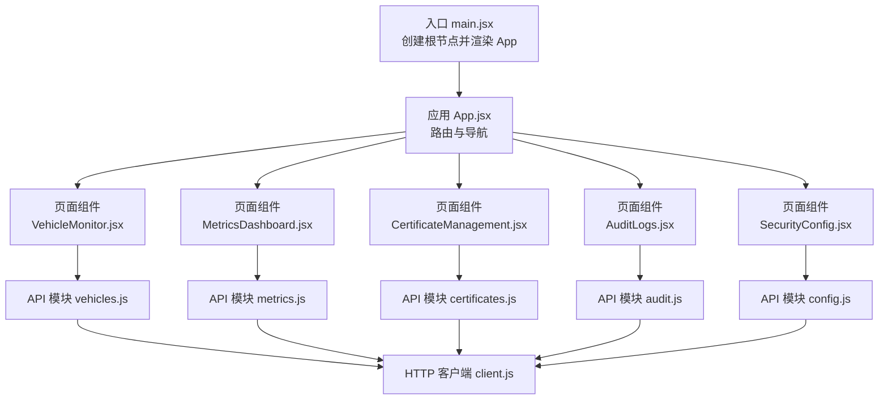
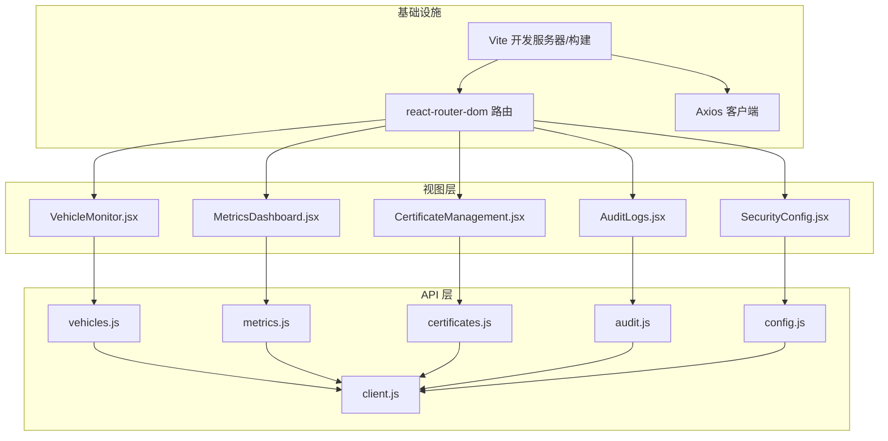
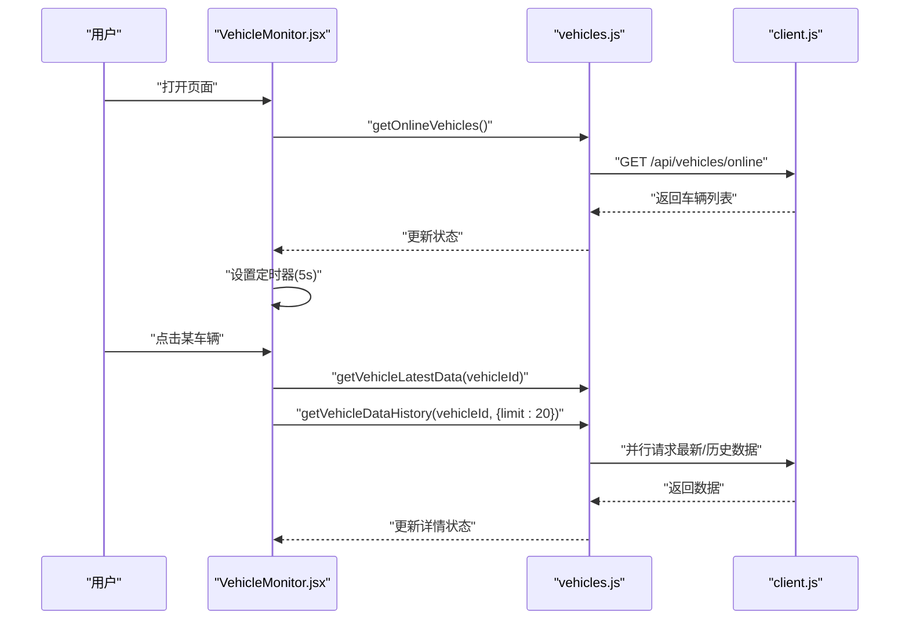
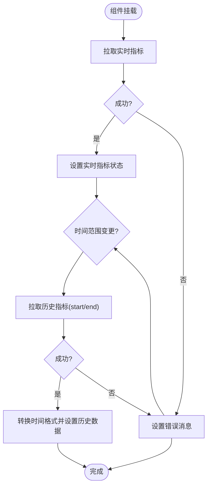
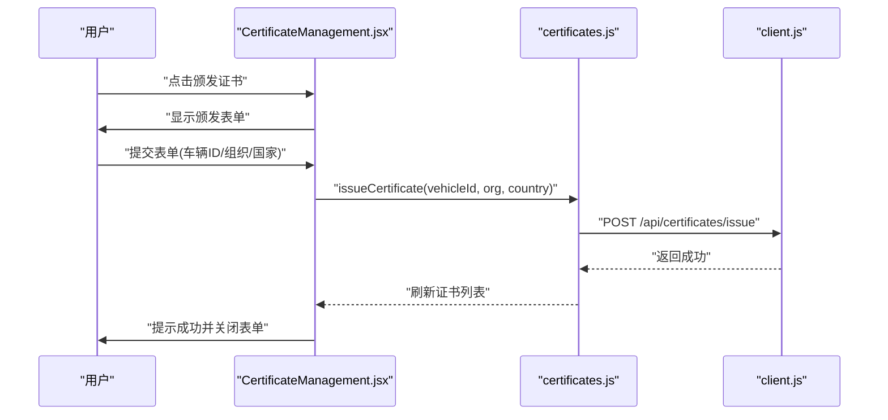
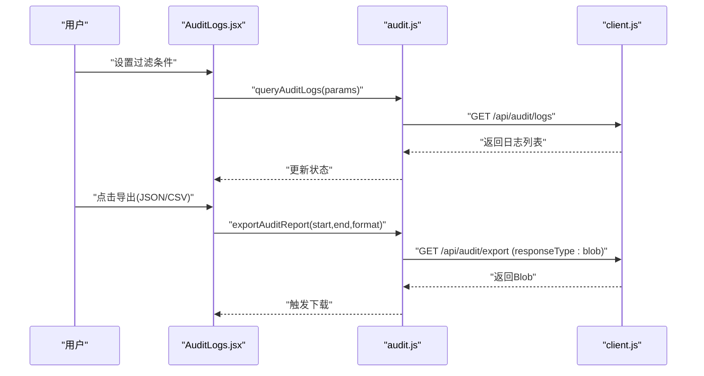
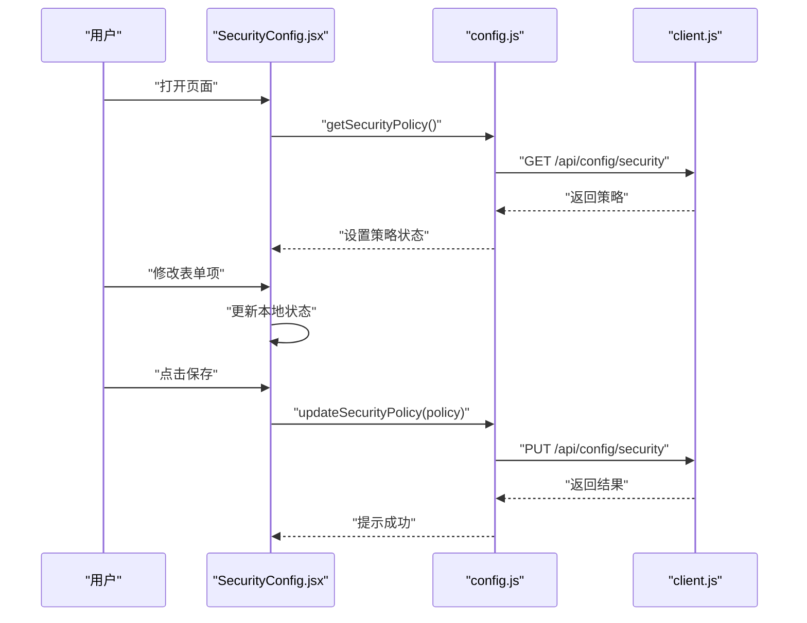
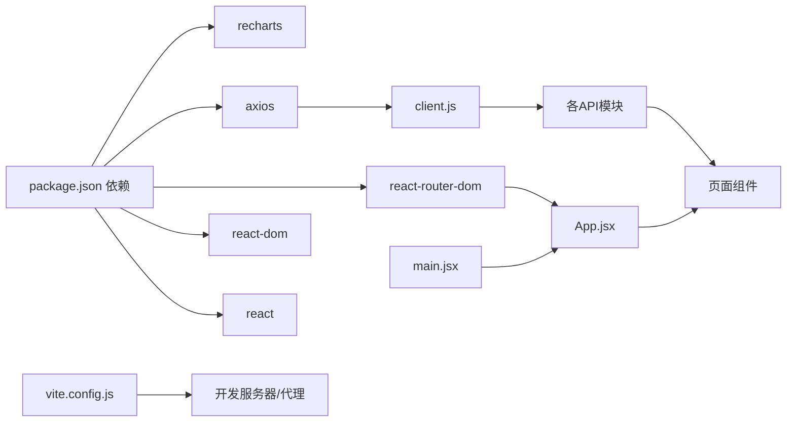

# 前端界面

<cite>
**本文引用的文件**
- [web/src/main.jsx](file://web/src/main.jsx)
- [web/src/App.jsx](file://web/src/App.jsx)
- [web/src/index.css](file://web/src/index.css)
- [web/package.json](file://web/package.json)
- [web/vite.config.js](file://web/vite.config.js)
- [web/src/api/client.js](file://web/src/api/client.js)
- [web/src/api/vehicles.js](file://web/src/api/vehicles.js)
- [web/src/api/metrics.js](file://web/src/api/metrics.js)
- [web/src/api/certificates.js](file://web/src/api/certificates.js)
- [web/src/api/audit.js](file://web/src/api/audit.js)
- [web/src/api/config.js](file://web/src/api/config.js)
- [web/src/pages/VehicleMonitor.jsx](file://web/src/pages/VehicleMonitor.jsx)
- [web/src/pages/MetricsDashboard.jsx](file://web/src/pages/MetricsDashboard.jsx)
- [web/src/pages/CertificateManagement.jsx](file://web/src/pages/CertificateManagement.jsx)
- [web/src/pages/AuditLogs.jsx](file://web/src/pages/AuditLogs.jsx)
- [web/src/pages/SecurityConfig.jsx](file://web/src/pages/SecurityConfig.jsx)
</cite>

## 目录
1. [简介](#简介)
2. [项目结构](#项目结构)
3. [核心组件](#核心组件)
4. [架构总览](#架构总览)
5. [详细组件分析](#详细组件分析)
6. [依赖分析](#依赖分析)
7. [性能考虑](#性能考虑)
8. [故障排查指南](#故障排查指南)
9. [结论](#结论)
10. [附录](#附录)

## 简介
本文件面向车联网安全通信网关的React前端界面，系统性阐述前端应用的架构设计与组件组织，覆盖车辆监控、安全指标、证书管理、审计日志、安全配置等页面的功能与实现；解释状态管理与数据流模式；说明API集成方式与错误处理机制；给出响应式设计与用户体验优化建议；总结组件复用与代码组织最佳实践；并提供界面定制与主题配置指南，帮助前端开发者高效开发与维护。

## 项目结构
前端采用Vite构建，基于React 18与react-router-dom进行路由管理，Axios封装统一HTTP客户端，页面按功能域分层组织在src/pages目录下，样式集中在src/index.css中，入口位于src/main.jsx与src/App.jsx。

图示来源
- [web/src/main.jsx:1-11](file://web/src/main.jsx#L1-L11)
- [web/src/App.jsx:1-42](file://web/src/App.jsx#L1-L42)
- [web/src/api/vehicles.js:1-38](file://web/src/api/vehicles.js#L1-L38)
- [web/src/api/metrics.js:1-17](file://web/src/api/metrics.js#L1-L17)
- [web/src/api/certificates.js:1-31](file://web/src/api/certificates.js#L1-L31)
- [web/src/api/audit.js:1-21](file://web/src/api/audit.js#L1-L21)
- [web/src/api/config.js:1-12](file://web/src/api/config.js#L1-L12)
- [web/src/api/client.js:1-25](file://web/src/api/client.js#L1-L25)

章节来源
- [web/src/main.jsx:1-11](file://web/src/main.jsx#L1-L11)
- [web/src/App.jsx:1-42](file://web/src/App.jsx#L1-L42)
- [web/src/index.css:1-149](file://web/src/index.css#L1-L149)
- [web/package.json:1-23](file://web/package.json#L1-L23)
- [web/vite.config.js:1-16](file://web/vite.config.js#L1-L16)

## 核心组件
- 应用入口与路由
  - 入口文件负责挂载React根节点并渲染顶层App组件。
  - App组件使用BrowserRouter包裹，定义导航菜单与路由映射，分别指向车辆监控、安全指标、证书管理、审计日志、安全配置五个页面。
- 页面组件
  - VehicleMonitor：车辆实时状态与历史数据展示，支持搜索、自动刷新、详情展开。
  - MetricsDashboard：安全指标实时卡片与历史趋势折线图。
  - CertificateManagement：证书列表、状态筛选、颁发与撤销、CRL查看。
  - AuditLogs：日志查询、过滤、导出（JSON/CSV）。
  - SecurityConfig：安全策略配置编辑与保存。
- API模块
  - 统一通过Axios实例client.js发起请求，集中处理基础URL与鉴权头。
  - 各业务API模块封装具体接口方法，如车辆、指标、证书、审计、配置。
- 样式与主题
  - index.css提供通用布局、卡片、按钮、表格、状态徽标、表单与加载/错误提示等基础样式，支持响应式与可定制化。

章节来源
- [web/src/main.jsx:1-11](file://web/src/main.jsx#L1-L11)
- [web/src/App.jsx:1-42](file://web/src/App.jsx#L1-L42)
- [web/src/pages/VehicleMonitor.jsx:1-373](file://web/src/pages/VehicleMonitor.jsx#L1-L373)
- [web/src/pages/MetricsDashboard.jsx:1-162](file://web/src/pages/MetricsDashboard.jsx#L1-L162)
- [web/src/pages/CertificateManagement.jsx:1-236](file://web/src/pages/CertificateManagement.jsx#L1-L236)
- [web/src/pages/AuditLogs.jsx:1-220](file://web/src/pages/AuditLogs.jsx#L1-L220)
- [web/src/pages/SecurityConfig.jsx:1-207](file://web/src/pages/SecurityConfig.jsx#L1-L207)
- [web/src/api/client.js:1-25](file://web/src/api/client.js#L1-L25)
- [web/src/api/vehicles.js:1-38](file://web/src/api/vehicles.js#L1-L38)
- [web/src/api/metrics.js:1-17](file://web/src/api/metrics.js#L1-L17)
- [web/src/api/certificates.js:1-31](file://web/src/api/certificates.js#L1-L31)
- [web/src/api/audit.js:1-21](file://web/src/api/audit.js#L1-L21)
- [web/src/api/config.js:1-12](file://web/src/api/config.js#L1-L12)
- [web/src/index.css:1-149](file://web/src/index.css#L1-L149)

## 架构总览
前端采用“页面组件 + API模块 + HTTP客户端”的分层架构，页面组件负责UI与交互，API模块封装后端接口调用，HTTP客户端集中处理基础配置与拦截器。路由由react-router-dom管理，页面间通过Link跳转。

图示来源
- [web/src/App.jsx:1-42](file://web/src/App.jsx#L1-L42)
- [web/src/pages/VehicleMonitor.jsx:1-373](file://web/src/pages/VehicleMonitor.jsx#L1-L373)
- [web/src/pages/MetricsDashboard.jsx:1-162](file://web/src/pages/MetricsDashboard.jsx#L1-L162)
- [web/src/pages/CertificateManagement.jsx:1-236](file://web/src/pages/CertificateManagement.jsx#L1-L236)
- [web/src/pages/AuditLogs.jsx:1-220](file://web/src/pages/AuditLogs.jsx#L1-L220)
- [web/src/pages/SecurityConfig.jsx:1-207](file://web/src/pages/SecurityConfig.jsx#L1-L207)
- [web/src/api/vehicles.js:1-38](file://web/src/api/vehicles.js#L1-L38)
- [web/src/api/metrics.js:1-17](file://web/src/api/metrics.js#L1-L17)
- [web/src/api/certificates.js:1-31](file://web/src/api/certificates.js#L1-L31)
- [web/src/api/audit.js:1-21](file://web/src/api/audit.js#L1-L21)
- [web/src/api/config.js:1-12](file://web/src/api/config.js#L1-L12)
- [web/src/api/client.js:1-25](file://web/src/api/client.js#L1-L25)
- [web/vite.config.js:1-16](file://web/vite.config.js#L1-L16)

## 详细组件分析

### 车辆监控页面（VehicleMonitor）
- 功能要点
  - 在线车辆列表：定时轮询刷新，支持关键词搜索；点击进入详情。
  - 车辆详情：实时数据卡片（状态、速度、温度、油量等）、GPS信息、运动数据、温度与电池、诊断数据、最近历史数据表格。
  - 自动刷新：全局每5秒刷新一次在线列表；选中车辆时每5秒刷新其最新数据与历史数据。
- 状态管理与数据流
  - 使用useState管理车辆列表、选中车辆、实时数据、历史数据、加载与错误状态；useEffect设置定时任务。
  - 异步加载采用Promise.all并行请求最新数据与历史数据，提升交互流畅度。
- 错误处理
  - 每个异步流程均捕获异常并设置错误消息；加载态与空态友好提示。
- 用户体验
  - 选中项高亮、悬停效果；详情关闭按钮；表格横向滚动适配小屏。
- 性能优化
  - 仅在必要时启动定时器；并行请求减少等待时间；格式化函数避免重复计算。

图示来源
- [web/src/pages/VehicleMonitor.jsx:14-82](file://web/src/pages/VehicleMonitor.jsx#L14-L82)
- [web/src/api/vehicles.js:3-30](file://web/src/api/vehicles.js#L3-L30)
- [web/src/api/client.js:1-25](file://web/src/api/client.js#L1-L25)

章节来源
- [web/src/pages/VehicleMonitor.jsx:1-373](file://web/src/pages/VehicleMonitor.jsx#L1-L373)
- [web/src/api/vehicles.js:1-38](file://web/src/api/vehicles.js#L1-L38)

### 安全指标仪表盘（MetricsDashboard）
- 功能要点
  - 实时指标卡片：在线车辆数、认证成功率、认证失败次数、数据传输量、签名失败次数、安全异常次数。
  - 历史趋势图：基于recharts的折线图，支持时间范围切换（1h/6h/24h/7d）。
- 状态管理与数据流
  - 使用useState管理实时指标、历史数据、加载状态与错误；useEffect在挂载与时间范围变化时拉取数据。
  - 历史数据转换：将时间戳转换为本地时间字符串，便于图表显示。
- 错误处理
  - 请求失败统一设置错误消息；加载态友好提示。
- 用户体验
  - 响应式容器自适应宽度；下拉选择时间范围；颜色区分不同指标系列。

图示来源
- [web/src/pages/MetricsDashboard.jsx:12-58](file://web/src/pages/MetricsDashboard.jsx#L12-L58)
- [web/src/api/metrics.js:3-16](file://web/src/api/metrics.js#L3-L16)

章节来源
- [web/src/pages/MetricsDashboard.jsx:1-162](file://web/src/pages/MetricsDashboard.jsx#L1-L162)
- [web/src/api/metrics.js:1-17](file://web/src/api/metrics.js#L1-L17)

### 证书管理页面（CertificateManagement）
- 功能要点
  - 证书列表：支持状态筛选（有效/已过期/已撤销），显示序列号、主体、颁发者、生效/过期时间、状态与操作按钮。
  - 颁发证书：弹出表单收集车辆标识、组织、国家，提交后刷新列表。
  - 撤销证书：确认后调用撤销接口，成功后刷新列表。
  - 查看CRL：拉取并展示撤销证书序列号列表。
- 状态管理与数据流
  - 使用useState管理证书列表、CRL、加载状态、错误、筛选条件与颁发表单。
  - 提交表单后清空表单并重新加载证书列表。
- 错误处理
  - 每个异步操作均设置错误消息；撤销前二次确认。
- 用户体验
  - 状态徽标颜色区分；表单折叠/展开；CRL列表滚动查看。

图示来源
- [web/src/pages/CertificateManagement.jsx:45-70](file://web/src/pages/CertificateManagement.jsx#L45-L70)
- [web/src/api/certificates.js:10-25](file://web/src/api/certificates.js#L10-L25)
- [web/src/api/client.js:1-25](file://web/src/api/client.js#L1-L25)

章节来源
- [web/src/pages/CertificateManagement.jsx:1-236](file://web/src/pages/CertificateManagement.jsx#L1-L236)
- [web/src/api/certificates.js:1-31](file://web/src/api/certificates.js#L1-L31)

### 审计日志页面（AuditLogs）
- 功能要点
  - 查询过滤：时间范围、车辆标识、事件类型、操作结果。
  - 日志列表：时间、事件类型、车辆标识、结果、详细信息、IP地址。
  - 导出报告：支持JSON与CSV两种格式，生成Blob并触发下载。
- 状态管理与数据流
  - 使用useState管理过滤参数与日志列表；useEffect在挂载时加载默认数据。
  - 导出流程：校验时间范围，调用导出接口，浏览器下载文件。
- 错误处理
  - 查询与导出失败统一设置错误消息。
- 用户体验
  - 表格横向滚动；事件类型中文映射；结果徽标颜色区分。

图示来源
- [web/src/pages/AuditLogs.jsx:17-61](file://web/src/pages/AuditLogs.jsx#L17-L61)
- [web/src/api/audit.js:3-20](file://web/src/api/audit.js#L3-L20)
- [web/src/api/client.js:1-25](file://web/src/api/client.js#L1-L25)

章节来源
- [web/src/pages/AuditLogs.jsx:1-220](file://web/src/pages/AuditLogs.jsx#L1-L220)
- [web/src/api/audit.js:1-21](file://web/src/api/audit.js#L1-L21)

### 安全配置页面（SecurityConfig）
- 功能要点
  - 加载安全策略：包含会话超时、证书有效期、时间戳容差、并发会话策略、最大认证失败次数、认证失败锁定时长。
  - 编辑与保存：表单字段双向绑定，提交后调用更新接口并提示结果。
- 状态管理与数据流
  - 使用useState管理策略对象、加载状态、错误与保存状态；useEffect在挂载时加载策略。
  - 表单控件限制数值范围与单位换算（如秒到分钟/小时）。
- 错误处理
  - 请求失败设置错误消息；保存过程禁用提交按钮。
- 用户体验
  - 字段旁提供范围说明与当前值换算提示；重置按钮恢复初始状态。

图示来源
- [web/src/pages/SecurityConfig.jsx:10-40](file://web/src/pages/SecurityConfig.jsx#L10-L40)
- [web/src/api/config.js:3-11](file://web/src/api/config.js#L3-L11)
- [web/src/api/client.js:1-25](file://web/src/api/client.js#L1-L25)

章节来源
- [web/src/pages/SecurityConfig.jsx:1-207](file://web/src/pages/SecurityConfig.jsx#L1-L207)
- [web/src/api/config.js:1-12](file://web/src/api/config.js#L1-L12)

## 依赖分析
- 前端依赖
  - React与DOM：页面渲染与生命周期管理。
  - react-router-dom：路由与导航。
  - axios：HTTP客户端，统一拦截器与基础配置。
  - recharts：折线图可视化。
- 构建与开发
  - Vite插件与开发服务器，配置反向代理至后端服务端口。
- 依赖关系
  - 页面组件依赖对应API模块；API模块依赖HTTP客户端；App组件依赖所有页面组件；main.jsx依赖App组件。

图示来源
- [web/package.json:1-23](file://web/package.json#L1-L23)
- [web/vite.config.js:1-16](file://web/vite.config.js#L1-L16)
- [web/src/api/client.js:1-25](file://web/src/api/client.js#L1-L25)
- [web/src/App.jsx:1-42](file://web/src/App.jsx#L1-L42)
- [web/src/main.jsx:1-11](file://web/src/main.jsx#L1-L11)

章节来源
- [web/package.json:1-23](file://web/package.json#L1-L23)
- [web/vite.config.js:1-16](file://web/vite.config.js#L1-L16)

## 性能考虑
- 数据拉取策略
  - 对于高频更新的数据（在线车辆、实时指标、车辆最新数据），采用定时器轮询；合理设置轮询间隔以平衡实时性与性能。
  - 对于非关键路径数据（历史数据、CRL、审计导出），按需请求，避免不必要的网络开销。
- 并行请求
  - 在车辆详情页对最新数据与历史数据使用并行请求，缩短首屏等待时间。
- 图表与表格
  - 折线图使用ResponsiveContainer自适应；表格启用横向滚动，避免布局抖动。
- 样式与主题
  - 通过CSS类名与变量化颜色实现主题一致性；卡片阴影与圆角提升视觉层次。
- 构建优化
  - 使用Vite快速冷启动与热更新；生产构建自动Tree-shaking与压缩。

## 故障排查指南
- 网络与代理
  - 开发环境通过Vite代理将/api前缀转发至后端服务；若无法访问，请检查代理配置与后端服务是否运行。
- 授权与令牌
  - HTTP客户端默认注入Authorization头；如遇鉴权问题，请确认令牌配置与后端期望一致。
- 错误提示
  - 页面组件在请求失败时显示错误消息；可在控制台查看Axios拦截器输出的错误详情。
- 常见问题定位
  - 审计导出：确保已设置开始与结束时间；检查后端导出接口返回的Blob内容类型。
  - 证书撤销：确认序列号正确且状态为有效；撤销后需刷新列表。
  - 实时数据：检查定时器是否正常运行与后端数据推送。

章节来源
- [web/vite.config.js:8-14](file://web/vite.config.js#L8-L14)
- [web/src/api/client.js:16-22](file://web/src/api/client.js#L16-L22)
- [web/src/pages/AuditLogs.jsx:38-57](file://web/src/pages/AuditLogs.jsx#L38-L57)
- [web/src/pages/CertificateManagement.jsx:59-70](file://web/src/pages/CertificateManagement.jsx#L59-L70)

## 结论
该前端界面以清晰的分层架构与模块化组织实现了车联网安全通信网关的核心管理功能。通过统一的HTTP客户端与路由管理，页面组件聚焦于业务逻辑与用户体验；状态管理与数据流模式保证了交互的流畅与稳定；响应式设计与主题样式提升了可用性与可维护性。建议在后续迭代中进一步完善单元测试、错误边界与国际化支持，持续优化性能与可扩展性。

## 附录

### API集成与错误处理机制
- HTTP客户端
  - 基础URL与令牌通过环境变量注入；统一设置Content-Type与Authorization头；响应拦截器打印错误并透传。
- 页面到API
  - 每个页面通过对应的API模块调用后端接口；统一的错误处理与加载状态管理。
- 错误处理
  - 捕获异常并设置错误消息；在UI上以统一的错误样式展示；必要时提供重试或回退方案。

章节来源
- [web/src/api/client.js:1-25](file://web/src/api/client.js#L1-L25)
- [web/src/api/vehicles.js:1-38](file://web/src/api/vehicles.js#L1-L38)
- [web/src/api/metrics.js:1-17](file://web/src/api/metrics.js#L1-L17)
- [web/src/api/certificates.js:1-31](file://web/src/api/certificates.js#L1-L31)
- [web/src/api/audit.js:1-21](file://web/src/api/audit.js#L1-L21)
- [web/src/api/config.js:1-12](file://web/src/api/config.js#L1-L12)

### 响应式设计与用户体验优化
- 布局与网格
  - 使用CSS Grid与ResponsiveContainer实现自适应布局；卡片与表格在小屏设备上保持可读性。
- 交互反馈
  - 加载态、错误态、成功提示与按钮禁用状态统一风格；悬停与选中状态增强可感知性。
- 可访问性
  - 表单标签与输入框语义明确；表格列宽与滚动适配键盘与屏幕阅读器。

章节来源
- [web/src/index.css:16-149](file://web/src/index.css#L16-L149)
- [web/src/pages/VehicleMonitor.jsx:96-369](file://web/src/pages/VehicleMonitor.jsx#L96-L369)
- [web/src/pages/MetricsDashboard.jsx:68-158](file://web/src/pages/MetricsDashboard.jsx#L68-L158)

### 组件复用与代码组织最佳实践
- 页面组件
  - 将UI与逻辑分离，每个页面独立管理自身状态；共享逻辑抽取为自定义Hook（如定时器逻辑可抽象）。
- API模块
  - 每个领域一个模块，职责单一；统一错误处理与参数传递。
- 样式
  - 通过公共类名与变量化颜色实现主题一致性；避免内联样式的滥用。
- 路由
  - 通过App.jsx集中管理导航与路由，新增页面只需在App与API层扩展。

章节来源
- [web/src/App.jsx:10-39](file://web/src/App.jsx#L10-L39)
- [web/src/pages/VehicleMonitor.jsx:1-373](file://web/src/pages/VehicleMonitor.jsx#L1-L373)
- [web/src/pages/MetricsDashboard.jsx:1-162](file://web/src/pages/MetricsDashboard.jsx#L1-L162)
- [web/src/pages/CertificateManagement.jsx:1-236](file://web/src/pages/CertificateManagement.jsx#L1-L236)
- [web/src/pages/AuditLogs.jsx:1-220](file://web/src/pages/AuditLogs.jsx#L1-L220)
- [web/src/pages/SecurityConfig.jsx:1-207](file://web/src/pages/SecurityConfig.jsx#L1-L207)

### 界面定制与主题配置指南
- 主题色板
  - 通过CSS变量或覆盖类名颜色实现主题定制；推荐统一主色、强调色与状态色。
- 字体与排版
  - 保持标题层级与字号一致性；在移动端适当缩小字号与行高。
- 卡片与间距
  - 使用统一的卡片圆角与阴影；网格间距与容器最大宽度适配不同分辨率。
- 动效与过渡
  - 按钮悬停与状态切换使用平滑过渡，避免闪烁与卡顿。

章节来源
- [web/src/index.css:16-149](file://web/src/index.css#L16-L149)