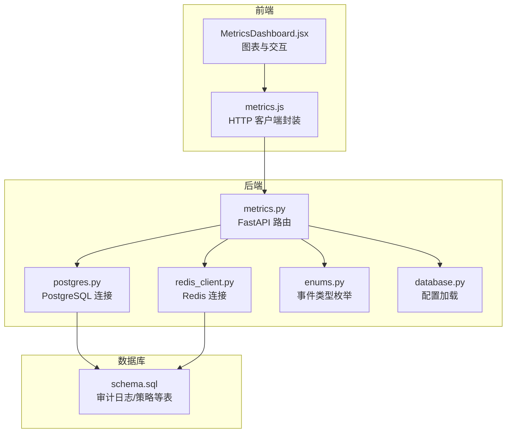
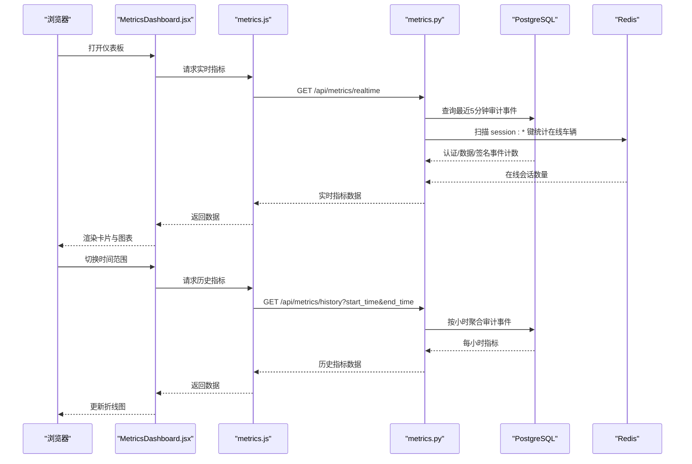
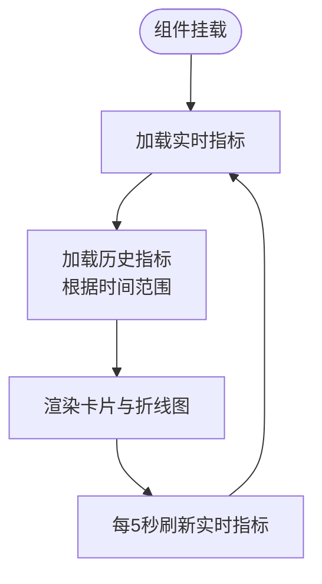
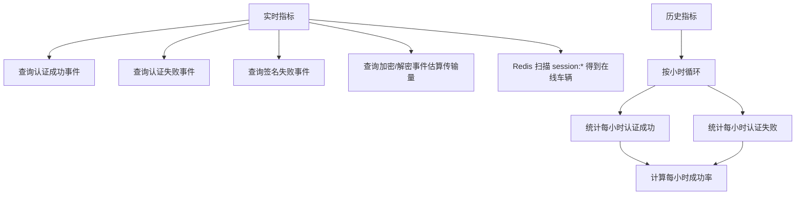
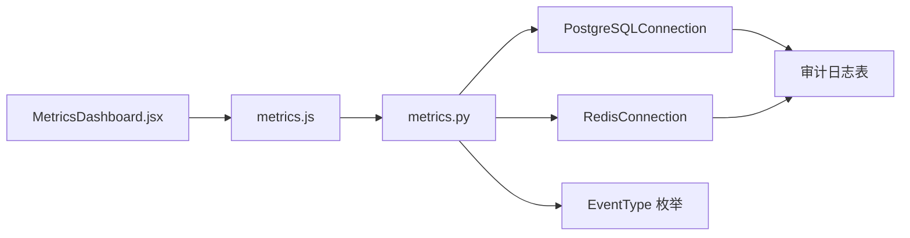

# 安全指标仪表板

<cite>
**本文引用的文件**
- [MetricsDashboard.jsx](file://web/src/pages/MetricsDashboard.jsx)
- [metrics.js](file://web/src/api/metrics.js)
- [metrics.py](file://src/api/routes/metrics.py)
- [postgres.py](file://src/db/postgres.py)
- [redis_client.py](file://src/db/redis_client.py)
- [enums.py](file://src/models/enums.py)
- [database.py](file://config/database.py)
- [schema.sql](file://db/schema.sql)
- [audit_logger.py](file://src/audit_logger.py)
- [App.jsx](file://web/src/App.jsx)
- [security_policy_manager.py](file://src/security_policy_manager.py)
- [performance_monitor.py](file://src/performance_monitor.py)
</cite>

## 目录
1. [简介](#简介)
2. [项目结构](#项目结构)
3. [核心组件](#核心组件)
4. [架构总览](#架构总览)
5. [详细组件分析](#详细组件分析)
6. [依赖关系分析](#依赖关系分析)
7. [性能考量](#性能考量)
8. [故障排查指南](#故障排查指南)
9. [结论](#结论)
10. [附录](#附录)

## 简介
本文件面向安全指标仪表板页面，系统性阐述其设计与实现，覆盖以下方面：
- 可视化界面布局与交互
- 实时指标数据获取与更新机制
- 指标分类与聚合计算逻辑
- 图表展示与钻取能力
- 阈值告警与异常检测思路
- 指标数据缓存与性能优化策略
- 仪表板定制与扩展指导

## 项目结构
前端采用 React + Recharts，后端基于 FastAPI，数据访问通过 PostgreSQL 与 Redis，审计事件统一写入审计日志表。

**图表来源**
- [MetricsDashboard.jsx:1-162](file://web/src/pages/MetricsDashboard.jsx#L1-L162)
- [metrics.js:1-17](file://web/src/api/metrics.js#L1-L17)
- [metrics.py:1-237](file://src/api/routes/metrics.py#L1-L237)
- [postgres.py:1-53](file://src/db/postgres.py#L1-L53)
- [redis_client.py:1-79](file://src/db/redis_client.py#L1-L79)
- [enums.py:1-56](file://src/models/enums.py#L1-L56)
- [database.py:1-50](file://config/database.py#L1-L50)
- [schema.sql:1-104](file://db/schema.sql#L1-L104)

**章节来源**
- [MetricsDashboard.jsx:1-162](file://web/src/pages/MetricsDashboard.jsx#L1-L162)
- [metrics.js:1-17](file://web/src/api/metrics.js#L1-L17)
- [metrics.py:1-237](file://src/api/routes/metrics.py#L1-L237)
- [postgres.py:1-53](file://src/db/postgres.py#L1-L53)
- [redis_client.py:1-79](file://src/db/redis_client.py#L1-L79)
- [enums.py:1-56](file://src/models/enums.py#L1-L56)
- [database.py:1-50](file://config/database.py#L1-L50)
- [schema.sql:1-104](file://db/schema.sql#L1-L104)

## 核心组件
- 前端仪表板页面：负责渲染实时卡片与历史折线图，定时轮询后端接口，并支持时间范围切换。
- 前端 API 客户端：封装 /api/metrics/realtime 与 /api/metrics/history 的请求。
- 后端路由：提供实时与历史指标查询，内部聚合审计日志与 Redis 会话信息。
- 数据访问层：PostgreSQL 连接器与 Redis 连接器。
- 事件模型：审计事件类型枚举，支撑指标聚合。
- 数据库架构：审计日志表、安全策略表、认证失败记录表等。

**章节来源**
- [MetricsDashboard.jsx:1-162](file://web/src/pages/MetricsDashboard.jsx#L1-L162)
- [metrics.js:1-17](file://web/src/api/metrics.js#L1-L17)
- [metrics.py:1-237](file://src/api/routes/metrics.py#L1-L237)
- [postgres.py:1-53](file://src/db/postgres.py#L1-L53)
- [redis_client.py:1-79](file://src/db/redis_client.py#L1-L79)
- [enums.py:1-56](file://src/models/enums.py#L1-L56)
- [schema.sql:1-104](file://db/schema.sql#L1-L104)

## 架构总览
仪表板的数据流自下而上：前端通过 HTTP 客户端调用后端 API；后端路由从 PostgreSQL 读取审计事件，从 Redis 读取在线会话，计算指标并返回；前端接收数据后渲染卡片与折线图。

**图表来源**
- [MetricsDashboard.jsx:12-58](file://web/src/pages/MetricsDashboard.jsx#L12-L58)
- [metrics.js:3-16](file://web/src/api/metrics.js#L3-L16)
- [metrics.py:39-148](file://src/api/routes/metrics.py#L39-L148)
- [postgres.py:32-45](file://src/db/postgres.py#L32-L45)
- [redis_client.py:51-71](file://src/db/redis_client.py#L51-L71)

**章节来源**
- [MetricsDashboard.jsx:12-58](file://web/src/pages/MetricsDashboard.jsx#L12-L58)
- [metrics.js:3-16](file://web/src/api/metrics.js#L3-L16)
- [metrics.py:39-148](file://src/api/routes/metrics.py#L39-L148)
- [postgres.py:32-45](file://src/db/postgres.py#L32-L45)
- [redis_client.py:51-71](file://src/db/redis_client.py#L51-L71)

## 详细组件分析

### 前端仪表板页面（MetricsDashboard.jsx）
- 实时卡片：展示在线车辆、认证成功率、认证失败次数、数据传输量、签名失败次数、安全异常次数。
- 历史图表：按时间范围（1h/6h/24h/7d）绘制认证成功率、认证失败、安全异常三条折线。
- 轮询机制：每 5 秒刷新一次实时指标。
- 数据格式化：字节到人类可读单位的转换。
- 交互控制：时间范围选择器，触发重新拉取历史数据。

**图表来源**
- [MetricsDashboard.jsx:53-58](file://web/src/pages/MetricsDashboard.jsx#L53-L58)
- [MetricsDashboard.jsx:12-41](file://web/src/pages/MetricsDashboard.jsx#L12-L41)

**章节来源**
- [MetricsDashboard.jsx:1-162](file://web/src/pages/MetricsDashboard.jsx#L1-L162)

### 前端 API 客户端（metrics.js）
- getRealtimeMetrics：GET /api/metrics/realtime
- getHistoricalMetrics：GET /api/metrics/history，携带 start_time 与 end_time 查询参数

**章节来源**
- [metrics.js:1-17](file://web/src/api/metrics.js#L1-L17)

### 后端指标路由（metrics.py）
- 实时指标：
  - 计算最近 5 分钟内认证成功/失败次数，得出成功率
  - 依据审计日志事件类型统计数据传输量（简化实现：按事件条数估算 1KB/条）
  - 统计签名失败次数
  - 安全异常次数 = 认证失败 + 签名失败
  - 在线车辆数来自 Redis 键扫描 session:*
- 历史指标：
  - 按小时聚合，遍历时间窗口，统计每小时的认证成功/失败次数，计算成功率
  - 其他指标在历史聚合中设为 0（简化实现）

**图表来源**
- [metrics.py:55-148](file://src/api/routes/metrics.py#L55-L148)
- [metrics.py:170-236](file://src/api/routes/metrics.py#L170-L236)

**章节来源**
- [metrics.py:39-148](file://src/api/routes/metrics.py#L39-L148)
- [metrics.py:151-236](file://src/api/routes/metrics.py#L151-L236)

### 数据访问层（PostgreSQL 与 Redis）
- PostgreSQLConnection：连接、查询、更新、上下文管理
- RedisConnection：连接、get/set/delete/exists、scan_keys 扫描

**章节来源**
- [postgres.py:1-53](file://src/db/postgres.py#L1-L53)
- [redis_client.py:1-79](file://src/db/redis_client.py#L1-L79)

### 事件类型与审计日志
- EventType 枚举：包含认证成功/失败、数据加密/解密、证书颁发/撤销、签名验证/失败等
- 审计日志表：包含 log_id、timestamp、event_type、vehicle_id、operation_result、details、ip_address 等字段
- 审计日志记录器：支持记录认证、数据传输、证书操作事件，并持久化到数据库

**章节来源**
- [enums.py:35-46](file://src/models/enums.py#L35-L46)
- [schema.sql:36-54](file://db/schema.sql#L36-L54)
- [audit_logger.py:26-336](file://src/audit_logger.py#L26-L336)

### 路由注册与导航
- App.jsx 中注册 /metrics 路由，指向 MetricsDashboard 页面

**章节来源**
- [App.jsx:1-42](file://web/src/App.jsx#L1-L42)

## 依赖关系分析
- 前端依赖：Recharts（折线图）、React（组件与生命周期）
- 后端依赖：FastAPI（路由）、psycopg2（PostgreSQL）、redis（Redis）、Pydantic（数据模型）
- 数据库依赖：审计日志表、安全策略表、认证失败记录表

**图表来源**
- [MetricsDashboard.jsx:1-3](file://web/src/pages/MetricsDashboard.jsx#L1-L3)
- [metrics.js:1-17](file://web/src/api/metrics.js#L1-L17)
- [metrics.py:8-16](file://src/api/routes/metrics.py#L8-L16)
- [postgres.py:3-6](file://src/db/postgres.py#L3-L6)
- [redis_client.py:3-5](file://src/db/redis_client.py#L3-L5)
- [enums.py:35-46](file://src/models/enums.py#L35-L46)
- [schema.sql:36-54](file://db/schema.sql#L36-L54)

**章节来源**
- [MetricsDashboard.jsx:1-3](file://web/src/pages/MetricsDashboard.jsx#L1-L3)
- [metrics.js:1-17](file://web/src/api/metrics.js#L1-L17)
- [metrics.py:8-16](file://src/api/routes/metrics.py#L8-L16)
- [postgres.py:3-6](file://src/db/postgres.py#L3-L6)
- [redis_client.py:3-5](file://src/db/redis_client.py#L3-L5)
- [enums.py:35-46](file://src/models/enums.py#L35-L46)
- [schema.sql:36-54](file://db/schema.sql#L36-L54)

## 性能考量
- 实时轮询间隔：前端每 5 秒请求一次实时指标，平衡刷新频率与网络负载。
- 历史聚合粒度：后端按小时聚合，减少历史数据点数量，提升图表渲染性能。
- 数据库索引：审计日志表对 timestamp、event_type、vehicle_id 等字段建立索引，有利于聚合查询。
- Redis 扫描：在线车辆统计使用 scan_keys，注意大数据量下的扫描性能，建议配合限流或缓存。
- 缓存策略：后端未对实时指标做缓存，若需进一步优化可在路由层增加短期缓存（例如 1-2 秒），避免重复计算。
- 前端渲染：Recharts 在大量数据时可能影响性能，建议限制历史时间范围或分页加载。

[本节为通用性能建议，无需特定文件引用]

## 故障排查指南
- 实时指标为空或报错
  - 检查后端 PostgreSQL 连接配置与数据库可用性
  - 检查 Redis 连接配置与在线会话键是否存在
  - 查看审计日志表是否有数据写入
- 历史图表无数据
  - 确认时间范围参数 start_time/end_time 是否正确传递
  - 检查审计日志表中对应时间段的事件是否存在
- 前端报错显示
  - 检查 metrics.js 的请求路径与后端路由是否一致
  - 检查网络代理与跨域配置

**章节来源**
- [metrics.js:3-16](file://web/src/api/metrics.js#L3-L16)
- [metrics.py:144-148](file://src/api/routes/metrics.py#L144-L148)
- [postgres.py:16-31](file://src/db/postgres.py#L16-L31)
- [redis_client.py:15-29](file://src/db/redis_client.py#L15-L29)
- [schema.sql:36-54](file://db/schema.sql#L36-L54)

## 结论
安全指标仪表板通过前后端协作，实现了对认证、数据传输、签名与安全异常等关键指标的可视化监控。后端基于审计日志与 Redis 会话进行聚合计算，前端提供实时刷新与历史钻取能力。为进一步提升稳定性与性能，建议引入短期缓存、优化 Redis 扫描策略、增强异常检测与阈值告警机制，并持续完善指标体系与扩展点。

[本节为总结性内容，无需特定文件引用]

## 附录

### 指标分类与聚合逻辑
- 实时指标（最近 5 分钟）
  - 认证成功率：认证成功/（认证成功+认证失败）
  - 认证失败次数：认证失败事件计数
  - 数据传输量：按事件条数估算（简化实现）
  - 签名失败次数：签名失败事件计数
  - 安全异常次数：认证失败 + 签名失败
  - 在线车辆数：Redis 键扫描 session:*
- 历史指标（按小时聚合）
  - 认证成功率：每小时认证成功/（成功+失败）
  - 其他指标在历史聚合中设为 0（简化实现）

**章节来源**
- [metrics.py:55-148](file://src/api/routes/metrics.py#L55-L148)
- [metrics.py:170-236](file://src/api/routes/metrics.py#L170-L236)

### 图表交互与钻取
- 时间范围选择器：支持 1h/6h/24h/7d，切换后重新拉取历史数据
- 折线图：展示认证成功率、认证失败、安全异常三条曲线
- 卡片：展示实时关键指标，便于快速概览

**章节来源**
- [MetricsDashboard.jsx:121-156](file://web/src/pages/MetricsDashboard.jsx#L121-L156)

### 阈值告警与异常检测
- 现状：后端未实现阈值告警与异常检测逻辑
- 建议：
  - 在后端新增阈值配置表，结合安全策略管理器进行阈值维护
  - 在实时指标计算后增加异常检测（如成功率骤降、失败次数激增、异常事件比例异常）
  - 前端增加告警示例（颜色变化、提示气泡、报警列表）
  - 可复用安全策略中的最大失败次数、锁定时长等参数

**章节来源**
- [security_policy_manager.py:19-56](file://src/security_policy_manager.py#L19-L56)
- [security_policy_manager.py:169-230](file://src/security_policy_manager.py#L169-L230)

### 指标数据缓存与性能优化
- 后端短期缓存：对实时指标在路由层增加 1-2 秒缓存，降低数据库与 Redis 压力
- Redis 扫描优化：限制扫描批次与键数量，或使用更精确的键命名规则
- 前端缓存：对历史数据在组件内缓存，避免重复请求
- 数据库索引：确保审计日志表的常用查询字段具备索引
- 前端渲染优化：限制历史数据点数量，使用虚拟滚动或分页加载

**章节来源**
- [postgres.py:32-45](file://src/db/postgres.py#L32-L45)
- [redis_client.py:51-71](file://src/db/redis_client.py#L51-L71)
- [schema.sql:49-53](file://db/schema.sql#L49-L53)

### 仪表板定制与扩展指导
- 新增指标：在后端 metrics.py 中扩展聚合逻辑，前端 MetricsDashboard.jsx 中添加卡片与图表
- 自定义时间范围：在前端增加时间范围选项，调整后端聚合粒度
- 告警集成：在后端新增告警规则与阈值，前端展示告警示例
- 性能监控：可复用 performance_monitor.py 的指标体系，扩展到仪表板展示
- 安全策略联动：通过 security_policy_manager.py 的策略配置，动态调整阈值与行为

**章节来源**
- [metrics.py:39-236](file://src/api/routes/metrics.py#L39-L236)
- [MetricsDashboard.jsx:121-156](file://web/src/pages/MetricsDashboard.jsx#L121-L156)
- [performance_monitor.py:14-52](file://src/performance_monitor.py#L14-L52)
- [security_policy_manager.py:73-125](file://src/security_policy_manager.py#L73-L125)