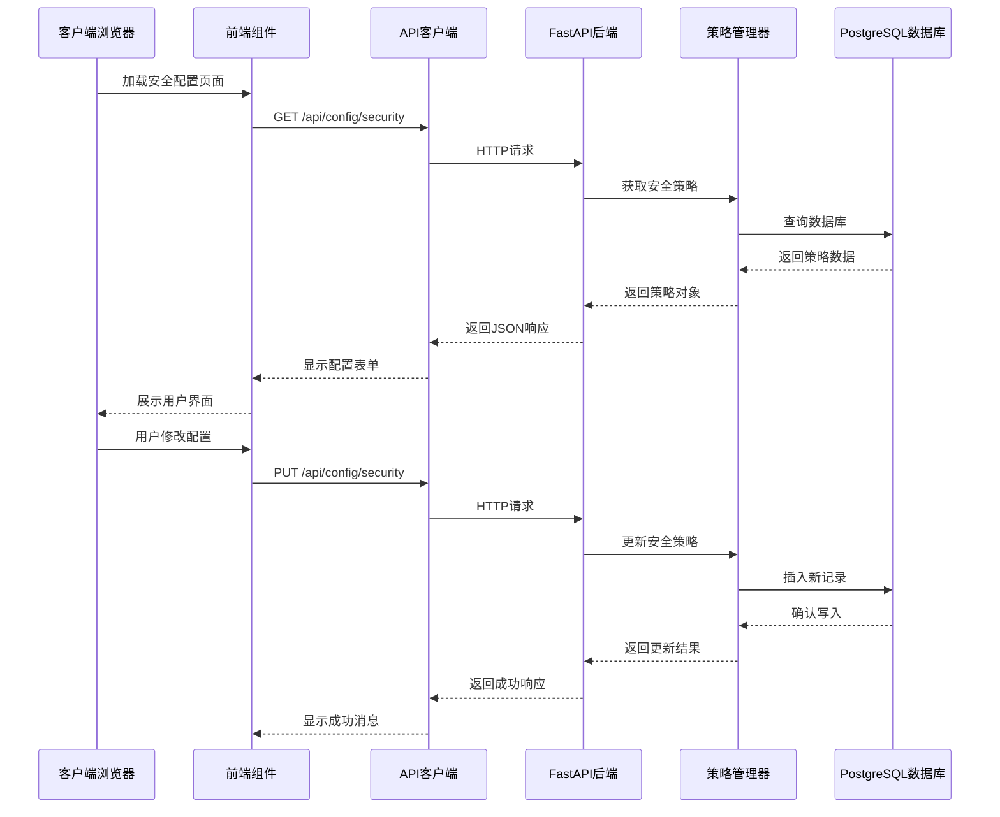
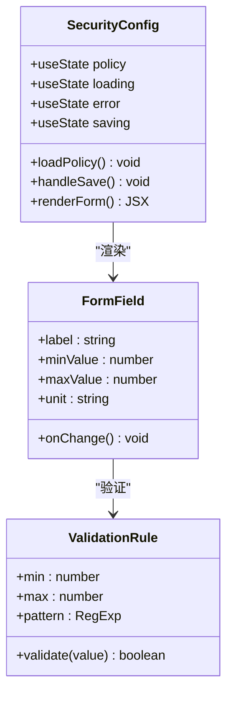
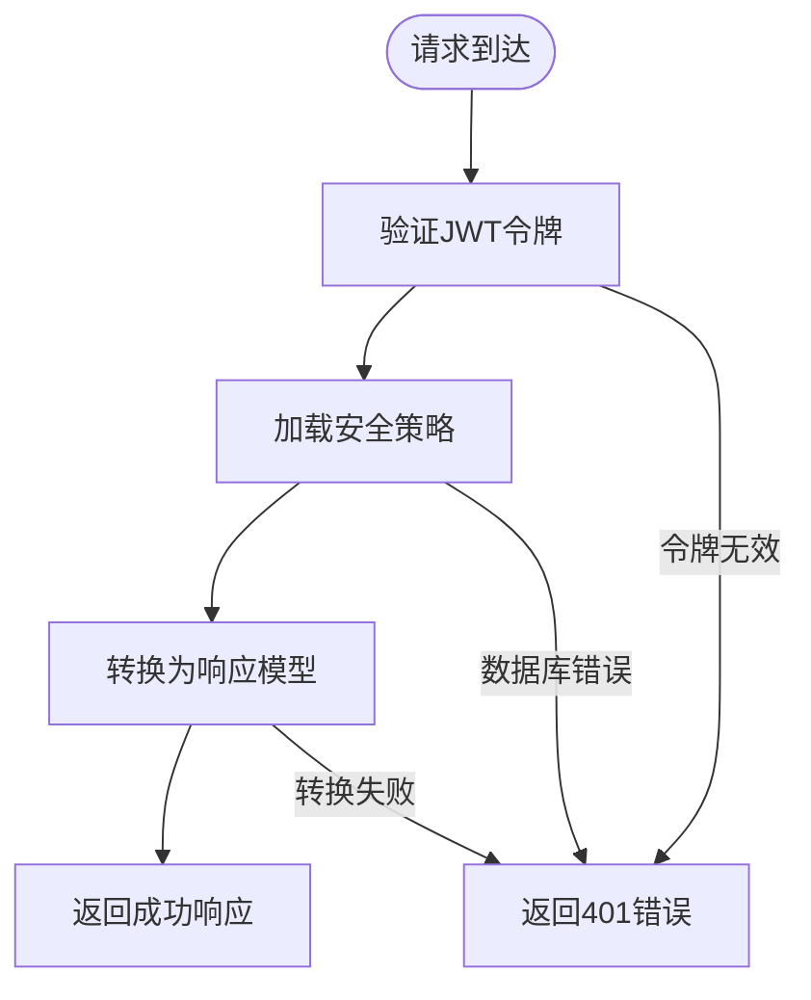
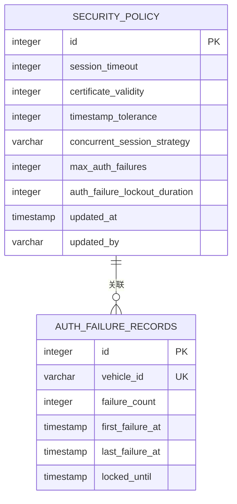
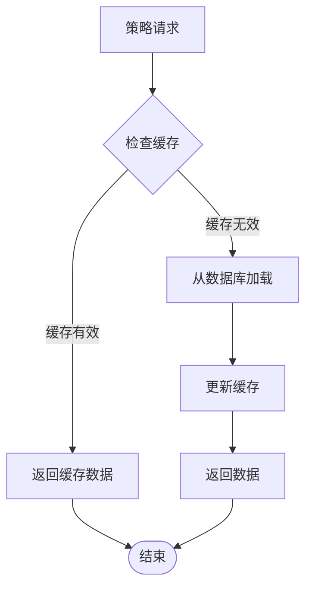
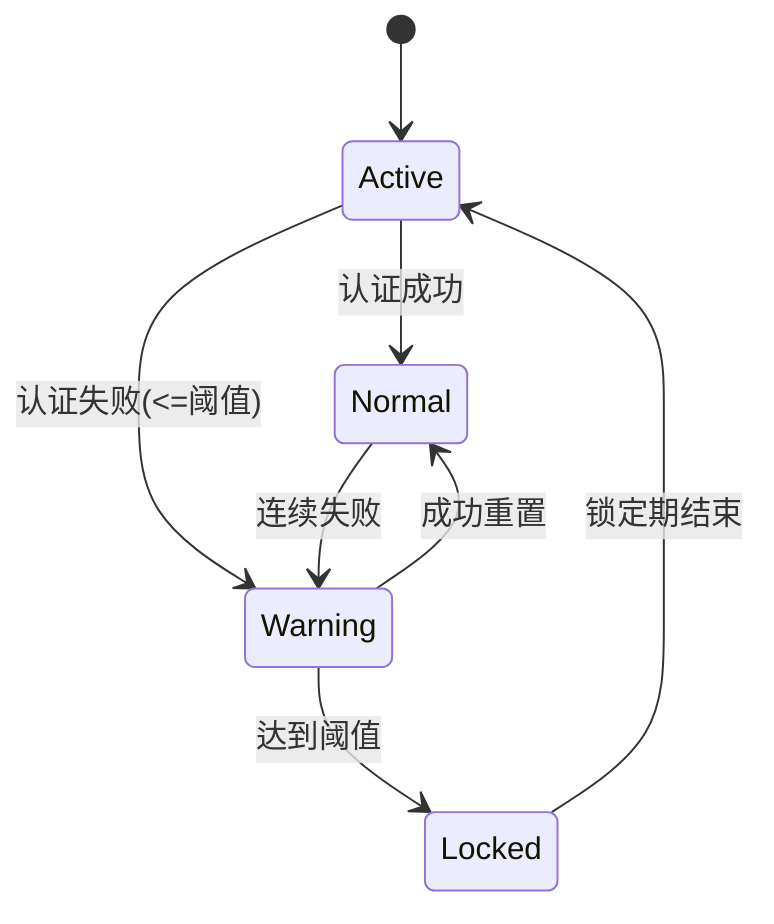
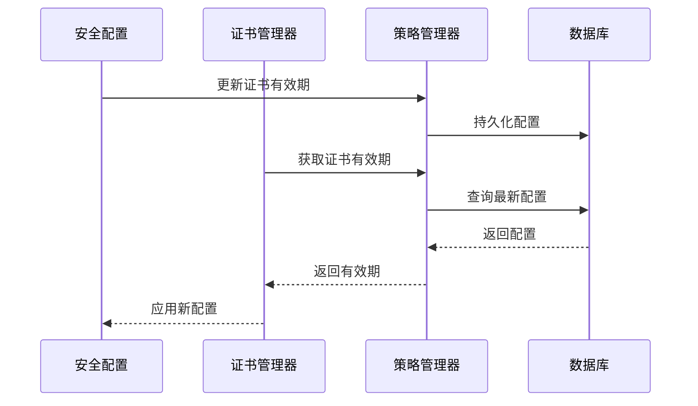
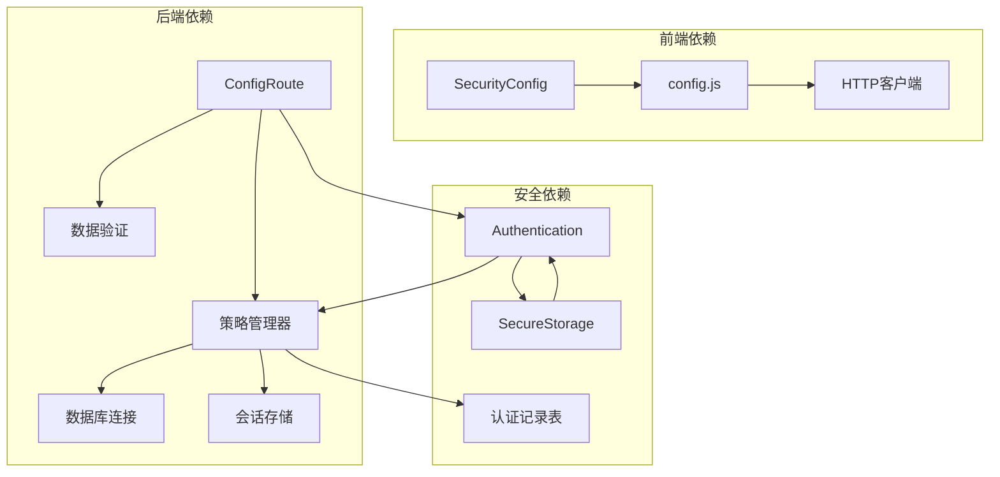
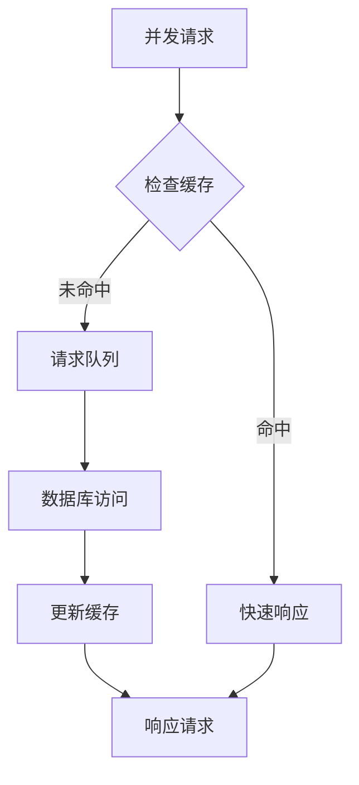
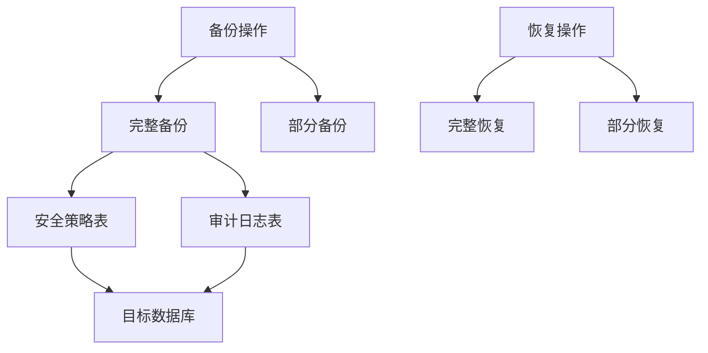

# 安全配置页面

<cite>
**本文档引用的文件**
- [SecurityConfig.jsx](file://web/src/pages/SecurityConfig.jsx)
- [config.js](file://web/src/api/config.js)
- [config.py](file://src/api/routes/config.py)
- [security_policy_manager.py](file://src/security_policy_manager.py)
- [003_security_policy_table.sql](file://db/migrations/003_security_policy_table.sql)
- [authentication.py](file://src/authentication.py)
- [secure_key_storage.py](file://src/secure_key_storage.py)
- [session.py](file://src/models/session.py)
- [certificate.py](file://src/models/certificate.py)
- [audit_logger.py](file://src/audit_logger.py)
- [SECURITY_CONFIG_FIX_README.md](file://SECURITY_CONFIG_FIX_README.md)
- [DEPLOYMENT_WITH_FIXES.md](file://DEPLOYMENT_WITH_FIXES.md)
</cite>

## 目录
1. [简介](#简介)
2. [项目结构](#项目结构)
3. [核心组件](#核心组件)
4. [架构概览](#架构概览)
5. [详细组件分析](#详细组件分析)
6. [依赖关系分析](#依赖关系分析)
7. [性能考虑](#性能考虑)
8. [故障排除指南](#故障排除指南)
9. [结论](#结论)
10. [附录](#附录)

## 简介

安全配置页面是车辆物联网安全网关系统中的关键管理界面，负责提供安全策略的可视化配置和管理功能。该页面实现了完整的安全参数设置、验证和应用流程，支持会话管理、证书控制、认证保护等核心安全功能。

系统采用前后端分离架构，前端使用React构建用户界面，后端基于FastAPI提供RESTful API服务，数据库采用PostgreSQL存储安全配置和审计日志。

## 项目结构

安全配置页面位于Web前端应用中，主要由以下层次组成：

```mermaid
graph TB
subgraph "前端层"
UI[SecurityConfig.jsx<br/>React组件]
API[config.js<br/>API客户端]
end
subgraph "后端层"
Router[config.py<br/>FastAPI路由]
Manager[security_policy_manager.py<br/>策略管理器]
end
subgraph "数据层"
DB[(PostgreSQL)<br/>security_policy表]
AuthDB[(auth_failure_records)<br/>认证失败记录]
end
subgraph "安全层"
Auth[authentication.py<br/>认证模块]
Crypto[secure_key_storage.py<br/>密钥存储]
end
UI --> API
API --> Router
Router --> Manager
Manager --> DB
Manager --> AuthDB
Auth --> Manager
Crypto --> Auth
```

**图表来源**
- [SecurityConfig.jsx:1-207](file://web/src/pages/SecurityConfig.jsx#L1-L207)
- [config.js:1-12](file://web/src/api/config.js#L1-L12)
- [config.py:1-173](file://src/api/routes/config.py#L1-L173)
- [security_policy_manager.py:1-322](file://src/security_policy_manager.py#L1-L322)

**章节来源**
- [SecurityConfig.jsx:1-207](file://web/src/pages/SecurityConfig.jsx#L1-L207)
- [config.js:1-12](file://web/src/api/config.js#L1-L12)
- [config.py:1-173](file://src/api/routes/config.py#L1-L173)

## 核心组件

### 前端安全配置组件

安全配置页面是一个React函数组件，提供了完整的配置界面和交互功能：

- **状态管理**：使用React Hooks管理配置状态、加载状态、错误状态和保存状态
- **数据绑定**：支持双向数据绑定，实时显示和更新配置参数
- **表单验证**：内置HTML5表单验证和用户友好的错误提示
- **响应式设计**：适配不同屏幕尺寸的设备

### 后端API接口

后端提供了RESTful API接口，支持安全策略的查询和更新：

- **GET /api/config/security**：获取当前安全策略配置
- **PUT /api/config/security**：更新安全策略配置
- **参数验证**：使用Pydantic进行严格的参数验证
- **权限控制**：基于JWT令牌的身份验证

### 策略管理器

安全策略管理器负责策略的持久化和应用：

- **数据库持久化**：将配置存储到PostgreSQL数据库
- **缓存机制**：实现60秒TTL的缓存策略
- **认证失败管理**：跟踪和管理认证失败记录
- **会话冲突处理**：支持并发会话的策略控制

**章节来源**
- [SecurityConfig.jsx:4-40](file://web/src/pages/SecurityConfig.jsx#L4-L40)
- [config.py:64-173](file://src/api/routes/config.py#L64-L173)
- [security_policy_manager.py:59-168](file://src/security_policy_manager.py#L59-L168)

## 架构概览

系统采用分层架构设计，确保安全配置功能的完整性和可靠性：



**图表来源**
- [SecurityConfig.jsx:10-40](file://web/src/pages/SecurityConfig.jsx#L10-L40)
- [config.js:3-11](file://web/src/api/config.js#L3-L11)
- [config.py:64-173](file://src/api/routes/config.py#L64-L173)

## 详细组件分析

### 安全配置页面组件

#### 组件结构分析



**图表来源**
- [SecurityConfig.jsx:4-207](file://web/src/pages/SecurityConfig.jsx#L4-L207)

组件实现了以下核心功能：

1. **配置加载**：通过异步API调用获取当前安全策略
2. **表单渲染**：动态生成包含所有配置参数的表单
3. **实时验证**：前端表单验证确保数据完整性
4. **状态管理**：管理加载、保存、错误等状态

#### 配置参数详解

系统支持以下安全配置参数：

| 参数名称 | 默认值 | 范围 | 说明 |
|---------|--------|------|------|
| 会话超时时间 | 86400秒 | 300-604800秒 | 车辆会话的有效期 |
| 证书有效期 | 365天 | 30-1825天 | 新颁发证书的有效期限 |
| 时间戳容差 | 300秒 | 60-600秒 | 允许的时间戳偏差范围 |
| 并发会话策略 | reject_new | reject_new/terminate_old | 并发会话处理方式 |
| 最大认证失败次数 | 5次 | 3-10次 | 触发锁定前的最大失败次数 |
| 认证失败锁定时长 | 300秒 | 60-3600秒 | 认证失败后的锁定时间 |

**章节来源**
- [SecurityConfig.jsx:60-187](file://web/src/pages/SecurityConfig.jsx#L60-L187)

### API接口设计

#### 后端路由实现



**图表来源**
- [config.py:64-106](file://src/api/routes/config.py#L64-L106)

API接口实现了以下功能：

1. **身份验证**：所有操作都需要有效的JWT令牌
2. **参数验证**：使用Pydantic模型进行严格的数据验证
3. **错误处理**：统一的异常处理和错误响应格式
4. **响应标准化**：统一的响应数据结构

#### 数据模型定义



**图表来源**
- [003_security_policy_table.sql:4-62](file://db/migrations/003_security_policy_table.sql#L4-L62)

**章节来源**
- [config.py:20-62](file://src/api/routes/config.py#L20-L62)
- [003_security_policy_table.sql:1-62](file://db/migrations/003_security_policy_table.sql#L1-L62)

### 策略管理器实现

#### 缓存机制设计



**图表来源**
- [security_policy_manager.py:73-126](file://src/security_policy_manager.py#L73-L126)

策略管理器实现了以下核心功能：

1. **缓存策略**：60秒TTL的智能缓存机制
2. **数据库操作**：提供CRUD操作接口
3. **认证失败管理**：跟踪和管理认证失败记录
4. **会话冲突处理**：支持不同的并发会话策略

#### 认证失败锁定机制



**图表来源**
- [security_policy_manager.py:169-231](file://src/security_policy_manager.py#L169-L231)

**章节来源**
- [security_policy_manager.py:59-322](file://src/security_policy_manager.py#L59-L322)

### 安全集成点

#### 会话管理集成

安全配置直接影响会话管理功能：

- **会话超时**：影响会话的生命周期管理
- **并发策略**：决定新会话建立时的冲突处理
- **认证失败**：影响会话建立的成功率

#### 证书管理集成



**图表来源**
- [authentication.py:366-481](file://src/authentication.py#L366-L481)
- [security_policy_manager.py:286-288](file://src/security_policy_manager.py#L286-L288)

**章节来源**
- [authentication.py:366-481](file://src/authentication.py#L366-L481)
- [session.py:37-70](file://src/models/session.py#L37-L70)

## 依赖关系分析

系统各组件之间的依赖关系如下：



**图表来源**
- [SecurityConfig.jsx:1-3](file://web/src/pages/SecurityConfig.jsx#L1-L3)
- [config.py:8-15](file://src/api/routes/config.py#L8-L15)
- [authentication.py:1-21](file://src/authentication.py#L1-L21)

**章节来源**
- [config.py:8-15](file://src/api/routes/config.py#L8-L15)
- [authentication.py:1-21](file://src/authentication.py#L1-L21)

## 性能考虑

### 缓存策略

系统实现了多层次的缓存机制：

1. **策略缓存**：60秒TTL的内存缓存
2. **数据库连接池**：复用数据库连接减少开销
3. **前端状态缓存**：避免重复的API调用

### 并发处理



**图表来源**
- [security_policy_manager.py:82-125](file://src/security_policy_manager.py#L82-L125)

### 性能优化建议

1. **前端优化**：使用React.memo优化组件渲染
2. **后端优化**：实现数据库连接池和查询优化
3. **网络优化**：启用HTTP缓存和压缩
4. **监控指标**：添加性能监控和日志记录

## 故障排除指南

### 常见问题及解决方案

#### 配置更新失败

**症状**：更新配置后系统仍使用旧配置

**可能原因**：
1. 数据库连接失败
2. 缓存未正确更新
3. 权限不足

**解决步骤**：
1. 检查数据库连接状态
2. 重启服务清除缓存
3. 验证用户权限

#### 认证失败锁定问题

**症状**：多次认证失败后仍可以认证

**解决步骤**：
1. 检查认证失败记录表
2. 验证安全策略配置
3. 查看服务日志

#### 前端页面加载失败

**症状**：安全配置页面无法加载

**解决步骤**：
1. 检查API服务状态
2. 验证网络连接
3. 查看浏览器控制台

**章节来源**
- [SECURITY_CONFIG_FIX_README.md:239-294](file://SECURITY_CONFIG_FIX_README.md#L239-L294)

### 部署和运维

#### 数据库备份和恢复



**图表来源**
- [DEPLOYMENT_WITH_FIXES.md:340-364](file://DEPLOYMENT_WITH_FIXES.md#L340-L364)

**章节来源**
- [DEPLOYMENT_WITH_FIXES.md:340-364](file://DEPLOYMENT_WITH_FIXES.md#L340-L364)

## 结论

安全配置页面为车辆物联网安全网关提供了完整的安全管理功能。通过前后端分离的设计，系统实现了：

1. **完整的配置管理**：支持所有安全参数的配置和验证
2. **可靠的持久化**：基于PostgreSQL的配置存储
3. **智能的缓存机制**：提升系统性能和响应速度
4. **完善的错误处理**：确保系统的稳定性和可靠性
5. **安全的集成设计**：与认证、会话、证书等功能深度集成

该系统为开发者提供了清晰的扩展接口，可以根据具体需求添加新的安全配置选项和验证规则。

## 附录

### API参考

#### 获取安全策略
- **方法**：GET
- **路径**：/api/config/security
- **认证**：需要JWT令牌
- **响应**：包含当前安全策略的JSON对象

#### 更新安全策略
- **方法**：PUT
- **路径**：/api/config/security
- **认证**：需要JWT令牌
- **请求体**：安全策略配置对象
- **响应**：更新结果和消息

### 配置最佳实践

#### 生产环境配置
- 会话超时：3600-7200秒（1-2小时）
- 证书有效期：365天（1年）
- 最大认证失败次数：5次
- 锁定时长：300-600秒（5-10分钟）

#### 测试环境配置
- 会话超时：300-600秒（5-10分钟）
- 证书有效期：30-90天
- 最大认证失败次数：3次
- 锁定时长：60秒（1分钟）

### 扩展开发指南

#### 添加新的配置参数

1. **数据库表结构**：在security_policy表中添加新字段
2. **数据模型**：更新SecurityPolicy和SecurityPolicy模型
3. **API接口**：修改config.py中的路由和验证逻辑
4. **前端界面**：在SecurityConfig.jsx中添加新的表单字段
5. **业务逻辑**：在策略管理器中实现新参数的应用逻辑

#### 自定义验证规则

1. **参数范围**：在Pydantic模型中添加约束
2. **业务规则**：在API路由中添加额外的验证逻辑
3. **前端验证**：在React组件中添加表单验证
4. **错误处理**：提供清晰的错误消息