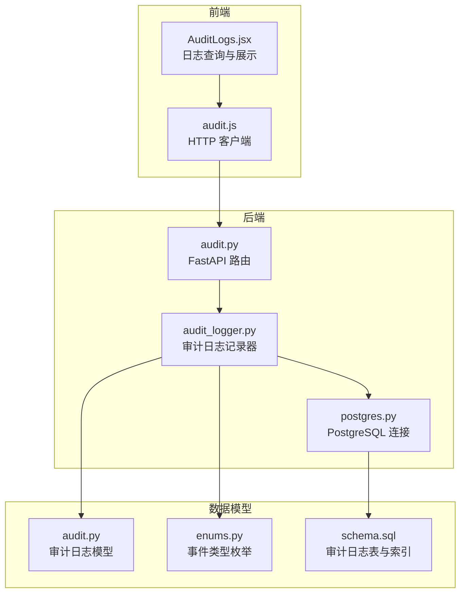
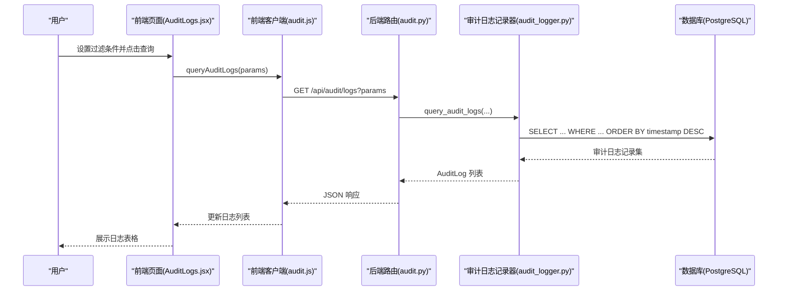
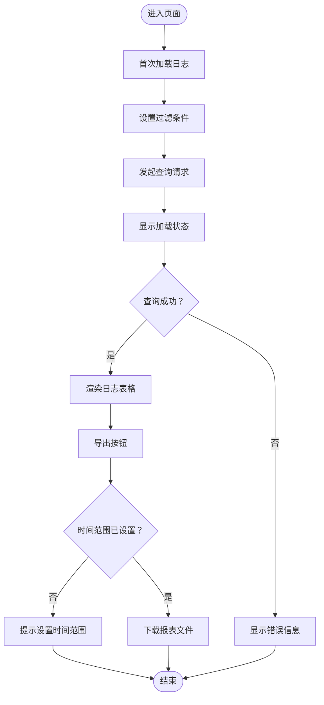
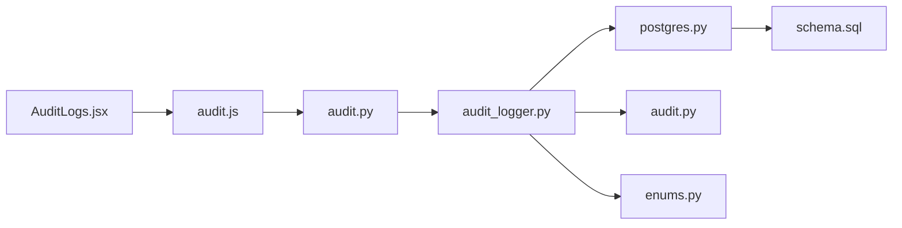

# 审计日志页面

<cite>
**本文引用的文件**
- [AuditLogs.jsx](file://web/src/pages/AuditLogs.jsx)
- [audit.js](file://web/src/api/audit.js)
- [audit.py](file://src/api/routes/audit.py)
- [audit_logger.py](file://src/audit_logger.py)
- [audit.py](file://src/models/audit.py)
- [enums.py](file://src/models/enums.py)
- [postgres.py](file://src/db/postgres.py)
- [schema.sql](file://db/schema.sql)
- [AUDIT_LOG_FIX.md](file://docs/AUDIT_LOG_FIX.md)
- [test_audit_logs.py](file://examples/test_audit_logs.py)
- [export_audit_report_example.py](file://examples/export_audit_report_example.py)
- [generate_audit_test_data.py](file://generate_audit_test_data.py)
- [App.jsx](file://web/src/App.jsx)
</cite>

## 目录
1. [简介](#简介)
2. [项目结构](#项目结构)
3. [核心组件](#核心组件)
4. [架构总览](#架构总览)
5. [详细组件分析](#详细组件分析)
6. [依赖关系分析](#依赖关系分析)
7. [性能考量](#性能考量)
8. [故障排查指南](#故障排查指南)
9. [结论](#结论)
10. [附录](#附录)

## 简介
本文件面向审计日志页面的功能设计与实现，覆盖日志查询与展示、过滤与搜索、详情展示与导出、日志分类与优先级显示、时间范围选择与排序机制、统计分析与报表生成、性能优化与大数据量处理方案，以及开发者定制与扩展指导。目标是帮助开发者与运维人员全面理解审计日志子系统的架构与使用方式。

## 项目结构
审计日志页面由前端 React 组件、前端 API 客户端、后端 FastAPI 路由、审计日志记录器与数据库层共同组成。前端负责用户交互与展示，后端提供查询与导出接口，审计日志记录器负责事件记录、查询与导出，数据库层提供持久化存储与索引支持。

图表来源
- [AuditLogs.jsx:1-220](file://web/src/pages/AuditLogs.jsx#L1-L220)
- [audit.js:1-21](file://web/src/api/audit.js#L1-L21)
- [audit.py:1-191](file://src/api/routes/audit.py#L1-L191)
- [audit_logger.py:1-480](file://src/audit_logger.py#L1-L480)
- [postgres.py:1-53](file://src/db/postgres.py#L1-L53)
- [audit.py:1-56](file://src/models/audit.py#L1-L56)
- [enums.py:1-56](file://src/models/enums.py#L1-L56)
- [schema.sql:36-54](file://db/schema.sql#L36-L54)

章节来源
- [AuditLogs.jsx:1-220](file://web/src/pages/AuditLogs.jsx#L1-L220)
- [audit.py:1-191](file://src/api/routes/audit.py#L1-L191)
- [audit_logger.py:1-480](file://src/audit_logger.py#L1-L480)
- [postgres.py:1-53](file://src/db/postgres.py#L1-L53)
- [audit.py:1-56](file://src/models/audit.py#L1-L56)
- [enums.py:1-56](file://src/models/enums.py#L1-L56)
- [schema.sql:36-54](file://db/schema.sql#L36-L54)

## 核心组件
- 前端页面组件：负责渲染过滤表单、加载日志、展示表格、导出报表。
- 前端 API 客户端：封装查询与导出请求，统一参数传递与响应处理。
- 后端路由：提供审计日志查询与导出接口，参数校验与响应模型。
- 审计日志记录器：负责生成日志 ID、截断详情、持久化、查询与导出。
- 数据模型与枚举：定义审计日志结构与事件类型。
- 数据库层：提供连接、查询、更新能力与审计日志表及索引。

章节来源
- [AuditLogs.jsx:1-220](file://web/src/pages/AuditLogs.jsx#L1-L220)
- [audit.js:1-21](file://web/src/api/audit.js#L1-L21)
- [audit.py:1-191](file://src/api/routes/audit.py#L1-L191)
- [audit_logger.py:1-480](file://src/audit_logger.py#L1-L480)
- [audit.py:1-56](file://src/models/audit.py#L1-L56)
- [enums.py:35-47](file://src/models/enums.py#L35-L47)
- [postgres.py:1-53](file://src/db/postgres.py#L1-L53)

## 架构总览
审计日志页面采用前后端分离架构：
- 前端通过 HTTP 客户端调用后端接口，支持查询与导出。
- 后端路由解析参数，调用审计日志记录器进行数据库查询与导出。
- 审计日志记录器封装数据库操作，保证事件类型枚举一致性与数据完整性。
- 数据库层提供审计日志表与多字段索引，支撑高效查询。

图表来源
- [AuditLogs.jsx:17-36](file://web/src/pages/AuditLogs.jsx#L17-L36)
- [audit.js:3-8](file://web/src/api/audit.js#L3-L8)
- [audit.py:39-125](file://src/api/routes/audit.py#L39-L125)
- [audit_logger.py:243-336](file://src/audit_logger.py#L243-L336)
- [postgres.py:32-45](file://src/db/postgres.py#L32-L45)

## 详细组件分析

### 前端页面组件（AuditLogs.jsx）
- 状态管理：维护日志列表、加载状态、错误状态与过滤条件。
- 过滤表单：支持时间范围、车辆标识、事件类型、操作结果筛选。
- 查询逻辑：将过滤参数拼装为查询字符串，调用前端 API 客户端发起请求。
- 导出功能：校验时间范围后触发导出，下载 JSON/CSV 文件。
- 展示逻辑：格式化时间、事件类型文本映射、结果状态徽章、表格布局与空态处理。

图表来源
- [AuditLogs.jsx:17-57](file://web/src/pages/AuditLogs.jsx#L17-L57)
- [AuditLogs.jsx:83-216](file://web/src/pages/AuditLogs.jsx#L83-L216)

章节来源
- [AuditLogs.jsx:1-220](file://web/src/pages/AuditLogs.jsx#L1-L220)

### 前端 API 客户端（audit.js）
- queryAuditLogs：GET /api/audit/logs，传入过滤参数，返回响应数据。
- exportAuditReport：GET /api/audit/export，传入起止时间与格式，返回二进制 Blob。

章节来源
- [audit.js:1-21](file://web/src/api/audit.js#L1-L21)

### 后端路由（audit.py）
- 查询接口：支持 start_time、end_time、vehicle_id、event_type、operation_result、limit 等参数；返回总条数与日志列表。
- 导出接口：支持 JSON/CSV 两种格式，返回文件流并设置合适的 Content-Type 与下载头。
- 参数校验：事件类型转换为枚举，非法值返回 400；异常捕获统一返回 500。

章节来源
- [audit.py:39-125](file://src/api/routes/audit.py#L39-L125)
- [audit.py:127-191](file://src/api/routes/audit.py#L127-L191)

### 审计日志记录器（audit_logger.py）
- 事件记录：认证事件、数据传输事件、证书操作事件，自动生成 UUID、截断详情、持久化到数据库。
- 查询实现：动态拼接 WHERE 条件，支持时间范围、车辆标识、事件类型、操作结果；按时间倒序排序。
- 导出实现：支持 JSON/CSV 两种格式，生成元数据与日志明细。
- 错误处理：持久化与查询过程中的异常被吞并，避免影响主业务流程。

章节来源
- [audit_logger.py:26-480](file://src/audit_logger.py#L26-L480)

### 数据模型与枚举（audit.py、enums.py）
- 审计日志模型：包含 log_id、timestamp、event_type、vehicle_id、operation_result、details、ip_address。
- 事件类型枚举：涵盖认证、数据加解密、证书颁发/撤销等事件类型。
- 数据库约束：details 长度限制、多字段索引优化查询。

章节来源
- [audit.py:9-56](file://src/models/audit.py#L9-L56)
- [enums.py:35-47](file://src/models/enums.py#L35-L47)
- [schema.sql:36-54](file://db/schema.sql#L36-L54)

### 数据库层（postgres.py、schema.sql）
- 连接管理：提供连接、查询、更新方法，支持上下文管理。
- 表结构：审计日志表包含主键、唯一日志 ID、时间戳、事件类型、车辆标识、结果、详情与 IP 地址。
- 索引：log_id、timestamp、vehicle_id、event_type 等索引提升查询效率。

章节来源
- [postgres.py:9-53](file://src/db/postgres.py#L9-L53)
- [schema.sql:36-54](file://db/schema.sql#L36-L54)

### 页面导航集成（App.jsx）
- 路由集成：在导航栏中提供“审计日志”入口，指向 /audit 路由。

章节来源
- [App.jsx:1-42](file://web/src/App.jsx#L1-L42)

## 依赖关系分析
- 前端组件依赖前端 API 客户端，后者依赖后端路由。
- 后端路由依赖审计日志记录器，后者依赖数据库连接与数据模型。
- 数据库层依赖表结构与索引定义。

图表来源
- [AuditLogs.jsx:1-2](file://web/src/pages/AuditLogs.jsx#L1-L2)
- [audit.js:1-21](file://web/src/api/audit.js#L1-L21)
- [audit.py:1-191](file://src/api/routes/audit.py#L1-L191)
- [audit_logger.py:1-480](file://src/audit_logger.py#L1-L480)
- [postgres.py:1-53](file://src/db/postgres.py#L1-L53)
- [audit.py:1-56](file://src/models/audit.py#L1-L56)
- [enums.py:1-56](file://src/models/enums.py#L1-L56)
- [schema.sql:36-54](file://db/schema.sql#L36-L54)

## 性能考量
- 查询性能
  - 索引优化：审计日志表对 log_id、timestamp、vehicle_id、event_type 建有索引，有利于时间范围、车辆与事件类型的过滤查询。
  - 排序与限制：按时间倒序排序，配合 limit 控制返回条数，避免一次性返回大量数据。
- 导出性能
  - 导出接口一次性查询指定时间范围内的全部日志，适合离线分析；对于超大范围建议分批导出或使用数据库侧分页。
- 前端性能
  - 大列表渲染：建议在前端引入虚拟滚动或分页展示，减少 DOM 渲染压力。
  - 请求去抖：在高频输入过滤条件时，可加入防抖逻辑，避免频繁请求。
- 异步记录
  - 当前审计日志记录为同步持久化，建议在高并发场景下引入异步队列（如 Redis Stream 或消息中间件），降低对主业务的影响。

章节来源
- [schema.sql:49-54](file://db/schema.sql#L49-L54)
- [audit.py:46-96](file://src/api/routes/audit.py#L46-L96)
- [audit_logger.py:243-336](file://src/audit_logger.py#L243-L336)

## 故障排查指南
- Web 端无数据
  - 确认后端 API 可访问且返回 200；检查前端网络面板与控制台错误。
  - 检查数据库中是否存在审计日志记录，可通过 SQL 查询确认。
- 事件类型无效
  - 后端会将事件类型转换为枚举，非法值会返回 400；请核对事件类型字符串是否正确。
- 导出失败
  - 确认格式参数为 json 或 csv；检查后端异常日志与数据库连接状态。
- 数据量过大
  - 建议缩小时间范围或增加过滤条件；必要时分批导出。
- 审计日志未记录
  - 确认关键业务流程已调用审计日志记录器；参考修复文档中的调用点与测试脚本。

章节来源
- [AUDIT_LOG_FIX.md:1-271](file://docs/AUDIT_LOG_FIX.md#L1-L271)
- [test_audit_logs.py:1-381](file://examples/test_audit_logs.py#L1-L381)

## 结论
审计日志页面提供了完整的查询、过滤、展示与导出能力，结合数据库索引与后端参数校验，能够满足日常审计与合规需求。针对大数据量与高并发场景，建议引入异步记录、分页与虚拟滚动等优化手段，并持续完善日志分析与告警机制。

## 附录

### 日志过滤与搜索功能
- 支持的过滤条件：开始时间、结束时间、车辆标识、事件类型、操作结果。
- 查询参数：前端将过滤条件拼装为查询字符串传递给后端。
- 后端处理：动态拼接 WHERE 条件并按时间倒序排序，限制返回条数。

章节来源
- [AuditLogs.jsx:9-36](file://web/src/pages/AuditLogs.jsx#L9-L36)
- [audit.py:39-125](file://src/api/routes/audit.py#L39-L125)

### 日志详情展示与导出
- 详情展示：表格列包含时间、事件类型、车辆标识、操作结果、详细信息、IP 地址。
- 导出功能：支持 JSON/CSV 两种格式，前端触发下载，后端设置响应头与媒体类型。

章节来源
- [AuditLogs.jsx:172-211](file://web/src/pages/AuditLogs.jsx#L172-L211)
- [audit.js:10-20](file://web/src/api/audit.js#L10-L20)
- [audit.py:127-191](file://src/api/routes/audit.py#L127-L191)

### 日志分类与优先级显示
- 事件类型：认证成功/失败、数据加密/解密、证书颁发/撤销等。
- 结果状态：成功/失败徽章样式区分，便于快速识别。

章节来源
- [AuditLogs.jsx:67-81](file://web/src/pages/AuditLogs.jsx#L67-L81)
- [AuditLogs.jsx:197-201](file://web/src/pages/AuditLogs.jsx#L197-L201)
- [enums.py:35-47](file://src/models/enums.py#L35-L47)

### 日志时间范围选择与排序机制
- 时间范围：前端提供日期时间选择器，后端按时间倒序排序。
- 排序：timestamp DESC，确保最新日志优先展示。

章节来源
- [AuditLogs.jsx:94-112](file://web/src/pages/AuditLogs.jsx#L94-L112)
- [audit.py:302-303](file://src/api/routes/audit.py#L302-L303)
- [audit_logger.py:302-303](file://src/audit_logger.py#L302-L303)

### 统计分析与报表生成
- 报表导出：支持 JSON/CSV 两种格式，包含元数据与日志明细。
- 使用示例：提供导出示例脚本，演示如何生成与保存报表。

章节来源
- [audit.py:127-191](file://src/api/routes/audit.py#L127-L191)
- [export_audit_report_example.py:1-143](file://examples/export_audit_report_example.py#L1-L143)

### 性能优化与大数据量处理方案
- 前端：虚拟滚动、分页、防抖。
- 后端：索引优化、limit 限制、分批导出。
- 异步：引入消息队列异步记录，降低主流程影响。

章节来源
- [schema.sql:49-54](file://db/schema.sql#L49-L54)
- [audit.py:46-96](file://src/api/routes/audit.py#L46-L96)
- [AUDIT_LOG_FIX.md:243-252](file://docs/AUDIT_LOG_FIX.md#L243-L252)

### 开发者定制与扩展指导
- 新增事件类型：在枚举中添加新类型，前端下拉框与后端路由需同步更新。
- 新增过滤条件：在前端表单与后端路由中扩展参数与查询逻辑。
- 自定义导出格式：在导出实现中添加新格式分支。
- 审计日志记录点：在关键业务流程中调用审计日志记录器，确保覆盖重要操作。

章节来源
- [enums.py:35-47](file://src/models/enums.py#L35-L47)
- [audit.py:39-125](file://src/api/routes/audit.py#L39-L125)
- [AUDIT_LOG_FIX.md:12-88](file://docs/AUDIT_LOG_FIX.md#L12-L88)