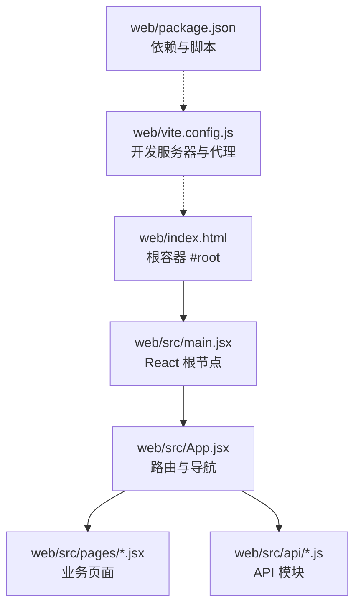
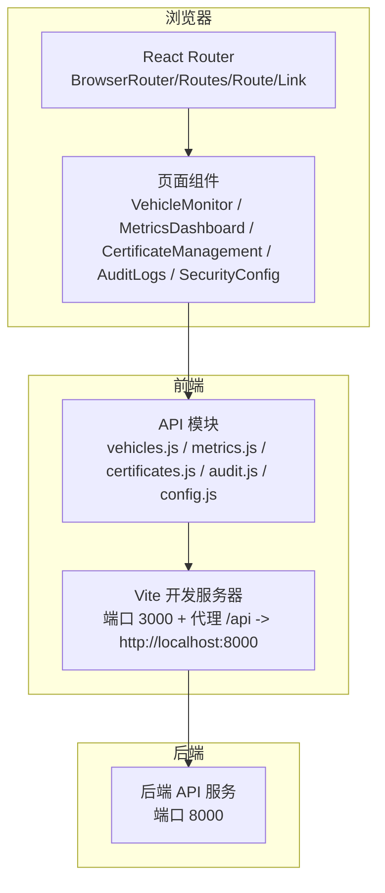
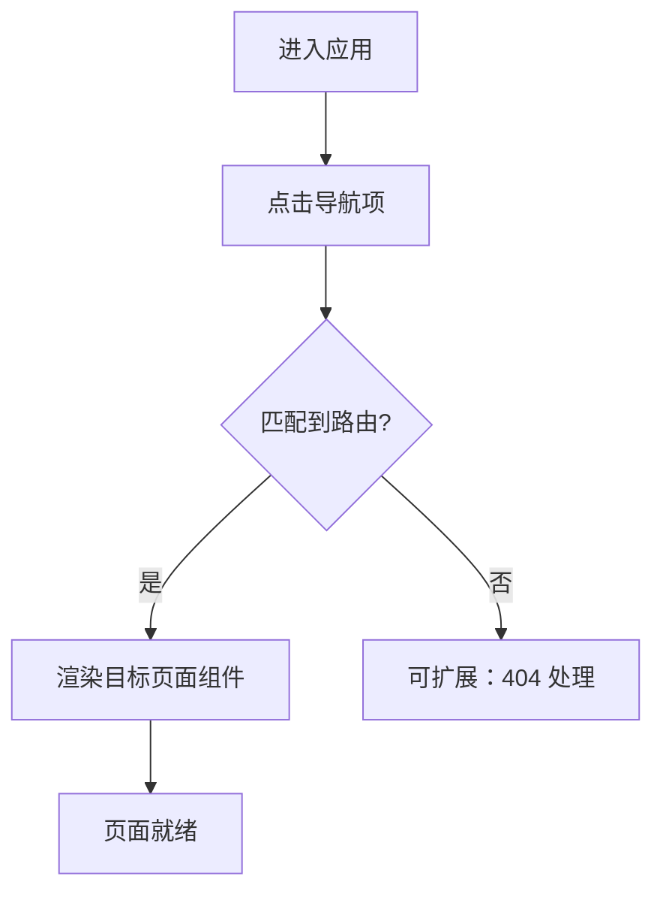
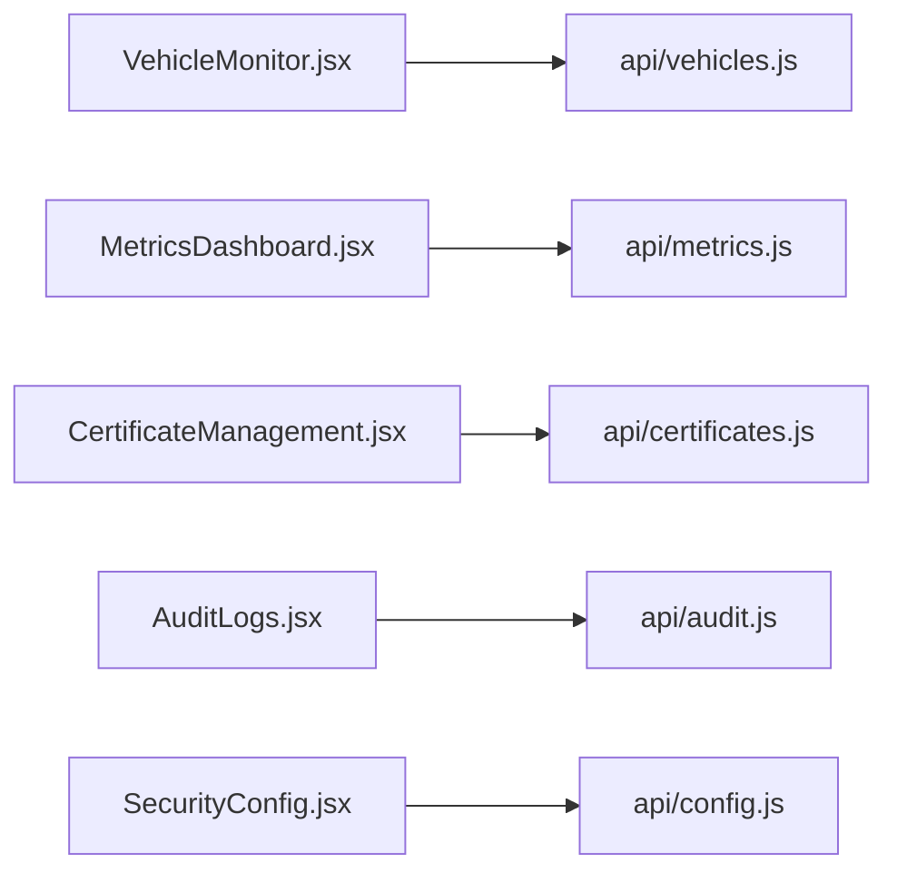
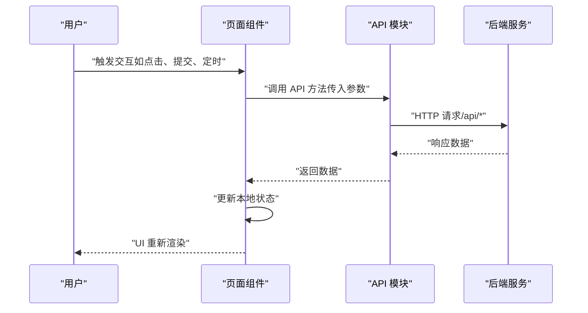
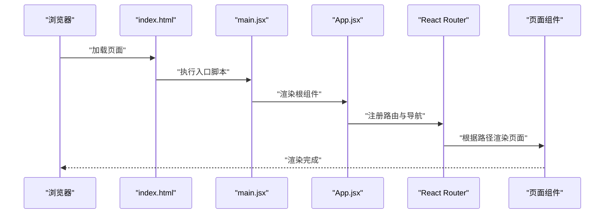
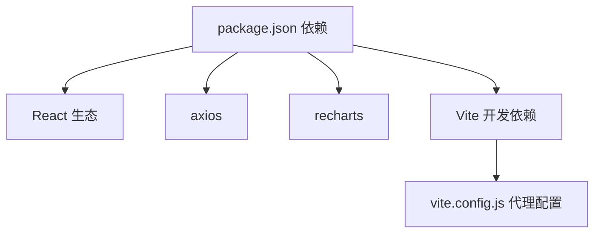

# 应用架构设计

<cite>
**本文引用的文件**
- [web/src/main.jsx](file://web/src/main.jsx)
- [web/index.html](file://web/index.html)
- [web/vite.config.js](file://web/vite.config.js)
- [web/package.json](file://web/package.json)
- [web/src/App.jsx](file://web/src/App.jsx)
- [web/src/App.css](file://web/src/App.css)
- [web/src/index.css](file://web/src/index.css)
- [web/src/pages/VehicleMonitor.jsx](file://web/src/pages/VehicleMonitor.jsx)
- [web/src/pages/MetricsDashboard.jsx](file://web/src/pages/MetricsDashboard.jsx)
- [web/src/pages/CertificateManagement.jsx](file://web/src/pages/CertificateManagement.jsx)
- [web/src/pages/AuditLogs.jsx](file://web/src/pages/AuditLogs.jsx)
- [web/src/pages/SecurityConfig.jsx](file://web/src/pages/SecurityConfig.jsx)
- [web/src/api/vehicles.js](file://web/src/api/vehicles.js)
- [web/src/api/metrics.js](file://web/src/api/metrics.js)
- [web/src/api/certificates.js](file://web/src/api/certificates.js)
- [web/src/api/audit.js](file://web/src/api/audit.js)
- [web/src/api/config.js](file://web/src/api/config.js)
</cite>

## 目录
1. [简介](#简介)
2. [项目结构](#项目结构)
3. [核心组件](#核心组件)
4. [架构总览](#架构总览)
5. [详细组件分析](#详细组件分析)
6. [依赖分析](#依赖分析)
7. [性能考虑](#性能考虑)
8. [故障排查指南](#故障排查指南)
9. [结论](#结论)
10. [附录](#附录)

## 简介
本文件面向车联网安全通信网关的前端团队，系统性阐述基于 React 的 Web 管理平台架构与实现细节。内容覆盖路由与导航、组件层次与模块化、状态管理与数据流、样式系统与主题、启动流程与入口配置、代码分割与性能优化、组件复用与扩展最佳实践等，帮助开发者快速理解并高效迭代。

## 项目结构
前端采用 Vite + React 技术栈，采用按页面分层的模块化组织方式，核心入口通过 HTML 中的 script 引入，运行时由 Vite 提供开发服务器与代理能力。

**图示来源**
- [web/index.html:1-13](file://web/index.html#L1-L13)
- [web/src/main.jsx:1-11](file://web/src/main.jsx#L1-L11)
- [web/src/App.jsx:1-42](file://web/src/App.jsx#L1-L42)
- [web/vite.config.js:1-16](file://web/vite.config.js#L1-L16)
- [web/package.json:1-23](file://web/package.json#L1-L23)

**章节来源**
- [web/index.html:1-13](file://web/index.html#L1-L13)
- [web/src/main.jsx:1-11](file://web/src/main.jsx#L1-L11)
- [web/src/App.jsx:1-42](file://web/src/App.jsx#L1-L42)
- [web/vite.config.js:1-16](file://web/vite.config.js#L1-L16)
- [web/package.json:1-23](file://web/package.json#L1-L23)

## 核心组件
- 应用入口与渲染
  - 入口文件负责挂载 React 根节点，并启用严格模式以提升开发期质量。
  - HTML 仅提供根容器，运行时通过 ES 模块加载入口脚本。
- 路由与导航
  - 使用 React Router v6 的路由声明式配置，支持嵌套路由与链接跳转。
  - 导航菜单提供统一的页面入口，便于用户在各功能页间切换。
- 页面组件
  - 每个页面组件封装独立的数据获取、状态管理与视图渲染逻辑，遵循单一职责原则。
  - 组件内部使用本地状态驱动 UI 更新，避免引入全局状态库以降低复杂度。
- API 层
  - 每个页面对应一组 API 模块，集中封装与后端交互的请求方法，便于复用与测试。

**章节来源**
- [web/src/main.jsx:1-11](file://web/src/main.jsx#L1-L11)
- [web/index.html:1-13](file://web/index.html#L1-L13)
- [web/src/App.jsx:1-42](file://web/src/App.jsx#L1-L42)
- [web/src/pages/VehicleMonitor.jsx:1-373](file://web/src/pages/VehicleMonitor.jsx#L1-L373)
- [web/src/pages/MetricsDashboard.jsx:1-162](file://web/src/pages/MetricsDashboard.jsx#L1-L162)
- [web/src/pages/CertificateManagement.jsx:1-236](file://web/src/pages/CertificateManagement.jsx#L1-L236)
- [web/src/pages/AuditLogs.jsx:1-220](file://web/src/pages/AuditLogs.jsx#L1-L220)
- [web/src/pages/SecurityConfig.jsx:1-207](file://web/src/pages/SecurityConfig.jsx#L1-L207)

## 架构总览
前端采用“页面组件 + API 模块”的分层架构，页面组件负责 UI 与交互，API 模块负责网络请求，路由负责页面切换。开发服务器通过 Vite 提供代理，将 /api 请求转发至后端服务。

**图示来源**
- [web/src/App.jsx:1-42](file://web/src/App.jsx#L1-L42)
- [web/src/pages/VehicleMonitor.jsx:1-373](file://web/src/pages/VehicleMonitor.jsx#L1-L373)
- [web/src/pages/MetricsDashboard.jsx:1-162](file://web/src/pages/MetricsDashboard.jsx#L1-L162)
- [web/src/pages/CertificateManagement.jsx:1-236](file://web/src/pages/CertificateManagement.jsx#L1-L236)
- [web/src/pages/AuditLogs.jsx:1-220](file://web/src/pages/AuditLogs.jsx#L1-L220)
- [web/src/pages/SecurityConfig.jsx:1-207](file://web/src/pages/SecurityConfig.jsx#L1-L207)
- [web/src/api/vehicles.js](file://web/src/api/vehicles.js)
- [web/src/api/metrics.js](file://web/src/api/metrics.js)
- [web/src/api/certificates.js](file://web/src/api/certificates.js)
- [web/src/api/audit.js](file://web/src/api/audit.js)
- [web/src/api/config.js](file://web/src/api/config.js)
- [web/vite.config.js:1-16](file://web/vite.config.js#L1-L16)

## 详细组件分析

### 路由与导航
- 路由定义
  - 使用 BrowserRouter 包裹应用，Routes 下声明多条静态路径，分别映射到不同页面组件。
  - 路由路径与导航菜单项一一对应，保证用户入口一致。
- 导航设计
  - 顶部导航栏提供统一入口，点击后通过 Link 触发路由切换。
  - 导航项涵盖车辆监控、安全指标、证书管理、审计日志、安全配置五大功能域。

**图示来源**
- [web/src/App.jsx:18-34](file://web/src/App.jsx#L18-L34)

**章节来源**
- [web/src/App.jsx:1-42](file://web/src/App.jsx#L1-L42)

### 页面组件层次与模块化
- 页面组件划分
  - VehicleMonitor：车辆在线状态、实时数据与历史数据展示，支持搜索与自动刷新。
  - MetricsDashboard：安全指标实时卡片与历史趋势图表，支持时间范围选择。
  - CertificateManagement：证书列表、状态过滤、颁发与撤销操作，支持 CRL 查看。
  - AuditLogs：审计日志查询、筛选与导出，支持 JSON/CSV。
  - SecurityConfig：安全策略配置表单，支持保存与重置。
- 模块化组织
  - 每个页面组件自包含状态、副作用与渲染逻辑，API 调用集中在对应 api/* 模块。
  - 页面与 API 之间通过函数调用解耦，便于单元测试与替换实现。

**图示来源**
- [web/src/pages/VehicleMonitor.jsx:1-373](file://web/src/pages/VehicleMonitor.jsx#L1-L373)
- [web/src/pages/MetricsDashboard.jsx:1-162](file://web/src/pages/MetricsDashboard.jsx#L1-L162)
- [web/src/pages/CertificateManagement.jsx:1-236](file://web/src/pages/CertificateManagement.jsx#L1-L236)
- [web/src/pages/AuditLogs.jsx:1-220](file://web/src/pages/AuditLogs.jsx#L1-L220)
- [web/src/pages/SecurityConfig.jsx:1-207](file://web/src/pages/SecurityConfig.jsx#L1-L207)
- [web/src/api/vehicles.js](file://web/src/api/vehicles.js)
- [web/src/api/metrics.js](file://web/src/api/metrics.js)
- [web/src/api/certificates.js](file://web/src/api/certificates.js)
- [web/src/api/audit.js](file://web/src/api/audit.js)
- [web/src/api/config.js](file://web/src/api/config.js)

**章节来源**
- [web/src/pages/VehicleMonitor.jsx:1-373](file://web/src/pages/VehicleMonitor.jsx#L1-L373)
- [web/src/pages/MetricsDashboard.jsx:1-162](file://web/src/pages/MetricsDashboard.jsx#L1-L162)
- [web/src/pages/CertificateManagement.jsx:1-236](file://web/src/pages/CertificateManagement.jsx#L1-L236)
- [web/src/pages/AuditLogs.jsx:1-220](file://web/src/pages/AuditLogs.jsx#L1-L220)
- [web/src/pages/SecurityConfig.jsx:1-207](file://web/src/pages/SecurityConfig.jsx#L1-L207)

### 状态管理模式与数据流向
- 状态管理策略
  - 页面组件使用 React 本地状态（useState/useEffect）管理 UI 与业务状态，避免引入全局状态库。
  - API 调用通过异步函数封装，返回 Promise，页面组件在 useEffect 中发起请求并在回调中更新状态。
- 数据流向
  - 输入：用户交互（点击、表单提交、定时器）。
  - 处理：页面组件内部状态更新、API 请求调度。
  - 输出：UI 重新渲染、图表更新、表格刷新。

**图示来源**
- [web/src/pages/VehicleMonitor.jsx:14-82](file://web/src/pages/VehicleMonitor.jsx#L14-L82)
- [web/src/pages/MetricsDashboard.jsx:12-58](file://web/src/pages/MetricsDashboard.jsx#L12-L58)
- [web/src/pages/CertificateManagement.jsx:19-70](file://web/src/pages/CertificateManagement.jsx#L19-L70)
- [web/src/pages/AuditLogs.jsx:17-61](file://web/src/pages/AuditLogs.jsx#L17-L61)
- [web/src/pages/SecurityConfig.jsx:10-40](file://web/src/pages/SecurityConfig.jsx#L10-L40)
- [web/src/api/vehicles.js](file://web/src/api/vehicles.js)
- [web/src/api/metrics.js](file://web/src/api/metrics.js)
- [web/src/api/certificates.js](file://web/src/api/certificates.js)
- [web/src/api/audit.js](file://web/src/api/audit.js)
- [web/src/api/config.js](file://web/src/api/config.js)

**章节来源**
- [web/src/pages/VehicleMonitor.jsx:1-373](file://web/src/pages/VehicleMonitor.jsx#L1-L373)
- [web/src/pages/MetricsDashboard.jsx:1-162](file://web/src/pages/MetricsDashboard.jsx#L1-L162)
- [web/src/pages/CertificateManagement.jsx:1-236](file://web/src/pages/CertificateManagement.jsx#L1-L236)
- [web/src/pages/AuditLogs.jsx:1-220](file://web/src/pages/AuditLogs.jsx#L1-L220)
- [web/src/pages/SecurityConfig.jsx:1-207](file://web/src/pages/SecurityConfig.jsx#L1-L207)

### CSS 样式系统与主题配置
- 样式组织
  - 全局样式通过 index.css 注入，页面级样式通过 App.css 与页面内联样式共同构成。
  - 组件内部广泛使用内联样式对象，配合类名（如 card、btn、table、status-badge）实现布局与视觉层级。
- 主题与一致性
  - 通过类名约定（如 status-*、btn、btn-primary）统一按钮与状态徽标风格。
  - 表格与卡片采用网格布局与响应式容器，确保在不同屏幕尺寸下具备良好可读性。

**章节来源**
- [web/src/App.jsx:14-18](file://web/src/App.jsx#L14-L18)
- [web/src/App.jsx:27-36](file://web/src/App.jsx#L27-L36)
- [web/src/index.css](file://web/src/index.css)
- [web/src/App.css](file://web/src/App.css)

### 应用启动流程与入口点配置
- 启动流程
  - HTML 提供根容器 div#root。
  - main.jsx 创建根节点并渲染 App 组件，开启严格模式。
  - App 组件注册路由与导航，页面组件在路由匹配后渲染。
- 入口配置
  - package.json 定义开发、构建与预览脚本。
  - vite.config.js 配置开发服务器端口与 /api 代理，将前端请求转发至后端。

**图示来源**
- [web/index.html:8-10](file://web/index.html#L8-L10)
- [web/src/main.jsx:6-10](file://web/src/main.jsx#L6-L10)
- [web/src/App.jsx:10-39](file://web/src/App.jsx#L10-L39)

**章节来源**
- [web/index.html:1-13](file://web/index.html#L1-L13)
- [web/src/main.jsx:1-11](file://web/src/main.jsx#L1-L11)
- [web/src/App.jsx:1-42](file://web/src/App.jsx#L1-L42)
- [web/vite.config.js:1-16](file://web/vite.config.js#L1-L16)
- [web/package.json:6-10](file://web/package.json#L6-L10)

### 代码分割与性能优化策略
- 代码分割
  - 页面组件按路由拆分，React Router 在路由切换时按需加载对应组件，减少初始包体积。
- 性能优化
  - 列表渲染：使用 key（如 vehicle_id）提升重排效率；对长列表采用虚拟滚动或分页（当前实现为滚动容器）。
  - 图表渲染：Recharts 仅在数据更新时重绘，避免不必要的计算。
  - 自动刷新：定时器在组件卸载时清理，防止内存泄漏与重复订阅。
  - 网络请求：并发请求合并（如车辆详情同时获取最新与历史数据），减少往返延迟。
  - 开发体验：Vite 提供热更新与快速打包，生产构建由 Vite 完成。

**章节来源**
- [web/src/pages/VehicleMonitor.jsx:69-82](file://web/src/pages/VehicleMonitor.jsx#L69-L82)
- [web/src/pages/MetricsDashboard.jsx:53-58](file://web/src/pages/MetricsDashboard.jsx#L53-L58)
- [web/src/pages/CertificateManagement.jsx:41-43](file://web/src/pages/CertificateManagement.jsx#L41-L43)
- [web/src/pages/AuditLogs.jsx:59-61](file://web/src/pages/AuditLogs.jsx#L59-L61)
- [web/src/pages/SecurityConfig.jsx:38-40](file://web/src/pages/SecurityConfig.jsx#L38-L40)
- [web/package.json:7-9](file://web/package.json#L7-L9)
- [web/vite.config.js:5-14](file://web/vite.config.js#L5-L14)

### 组件复用与扩展最佳实践
- 复用策略
  - 将通用 UI 结构抽象为可复用的区块（如卡片、表格、表单组），在多个页面中组合使用。
  - 将通用交互行为（如加载态、错误提示、分页）抽取为 Hook 或工具函数，减少重复代码。
- 扩展建议
  - 新增页面时，遵循“页面组件 + API 模块”结构，保持关注点分离。
  - 对于跨页面共享的状态，可在页面间通过 props 传递或抽离为上下文（Context），避免全局状态库带来的复杂性。
  - 为每个页面提供默认导出的组件与对应的 API 模块，便于测试与替换实现。

**章节来源**
- [web/src/pages/VehicleMonitor.jsx:94-369](file://web/src/pages/VehicleMonitor.jsx#L94-L369)
- [web/src/pages/MetricsDashboard.jsx:68-158](file://web/src/pages/MetricsDashboard.jsx#L68-L158)
- [web/src/pages/CertificateManagement.jsx:86-232](file://web/src/pages/CertificateManagement.jsx#L86-L232)
- [web/src/pages/AuditLogs.jsx:83-216](file://web/src/pages/AuditLogs.jsx#L83-L216)
- [web/src/pages/SecurityConfig.jsx:52-203](file://web/src/pages/SecurityConfig.jsx#L52-L203)

## 依赖分析
- 前端依赖
  - React 生态：react、react-dom、react-router-dom。
  - 网络请求：axios。
  - 图表可视化：recharts。
- 开发依赖
  - 构建与开发：@vitejs/plugin-react、vite。
- 代理与运行
  - Vite 代理将 /api 请求转发至后端服务，开发环境与生产环境通过构建脚本区分。

**图示来源**
- [web/package.json:11-21](file://web/package.json#L11-L21)
- [web/vite.config.js:8-13](file://web/vite.config.js#L8-L13)

**章节来源**
- [web/package.json:1-23](file://web/package.json#L1-L23)
- [web/vite.config.js:1-16](file://web/vite.config.js#L1-L16)

## 性能考虑
- 资源加载
  - 采用按需加载与懒加载策略，减少首屏资源压力。
- 渲染优化
  - 列表渲染使用稳定 key；对大数据集采用分页或虚拟滚动。
  - 图表组件仅在数据变化时重绘，避免频繁计算。
- 网络优化
  - 合并并发请求，减少 RTT；合理设置定时刷新间隔，平衡实时性与性能。
- 构建优化
  - 生产构建由 Vite 完成，利用现代打包特性提升加载速度。

[本节为通用性能建议，不直接分析具体文件]

## 故障排查指南
- 路由与导航
  - 若点击导航无反应，检查路由路径与 Link 的 to 是否一致，确认 App.jsx 中 Routes 配置是否正确。
- 数据加载
  - 页面长时间处于加载态，检查对应 API 模块的请求是否抛错，确认后端接口可用性与代理配置。
- 图表渲染
  - 图表不显示或空白，检查数据格式与字段映射，确认 Recharts 依赖版本兼容性。
- 证书与审计
  - 证书列表为空或撤销列表异常，确认后端证书与 CRL 接口返回格式，检查状态过滤逻辑。
- 安全配置
  - 配置保存失败，检查表单字段范围与后端校验规则，确认请求体格式。

**章节来源**
- [web/src/App.jsx:18-34](file://web/src/App.jsx#L18-L34)
- [web/src/pages/VehicleMonitor.jsx:14-25](file://web/src/pages/VehicleMonitor.jsx#L14-L25)
- [web/src/pages/MetricsDashboard.jsx:12-41](file://web/src/pages/MetricsDashboard.jsx#L12-L41)
- [web/src/pages/CertificateManagement.jsx:19-39](file://web/src/pages/CertificateManagement.jsx#L19-L39)
- [web/src/pages/AuditLogs.jsx:17-36](file://web/src/pages/AuditLogs.jsx#L17-L36)
- [web/src/pages/SecurityConfig.jsx:23-36](file://web/src/pages/SecurityConfig.jsx#L23-L36)

## 结论
本架构以 React Router 为核心，结合 Vite 的开发与构建能力，形成清晰的页面组件与 API 模块分层。通过本地状态管理与合理的数据流设计，实现了高内聚、低耦合的前端应用。建议在后续迭代中持续优化数据加载策略、增强错误处理与可访问性，并在必要时引入轻量级状态管理方案以支撑更复杂的业务场景。

## 附录
- API 模块概览
  - 车辆相关：vehicles.js 提供在线车辆、搜索、最新数据与历史数据接口。
  - 指标相关：metrics.js 提供实时指标与历史指标接口。
  - 证书相关：certificates.js 提供证书列表、颁发、撤销与 CRL 接口。
  - 审计相关：audit.js 提供日志查询与报表导出接口。
  - 配置相关：config.js 提供安全策略查询与更新接口。

**章节来源**
- [web/src/api/vehicles.js](file://web/src/api/vehicles.js)
- [web/src/api/metrics.js](file://web/src/api/metrics.js)
- [web/src/api/certificates.js](file://web/src/api/certificates.js)
- [web/src/api/audit.js](file://web/src/api/audit.js)
- [web/src/api/config.js](file://web/src/api/config.js)