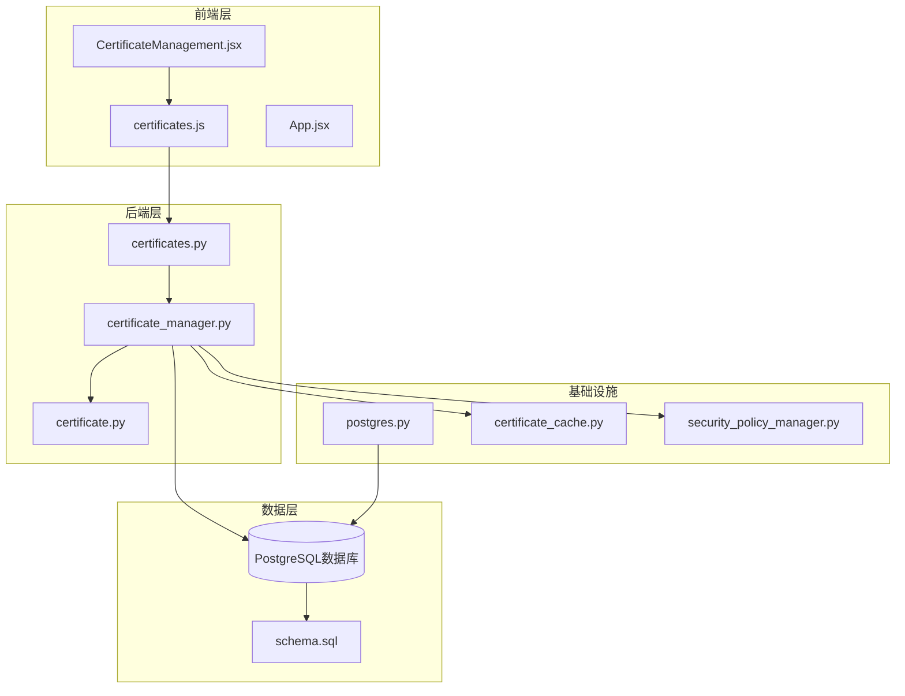
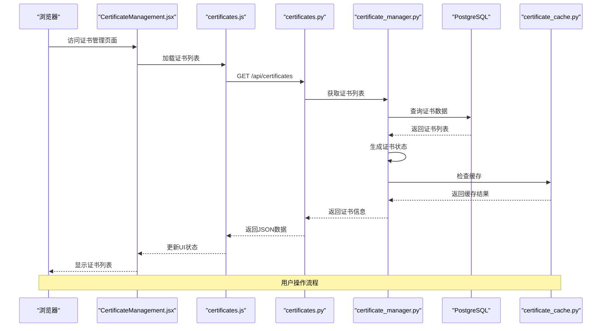
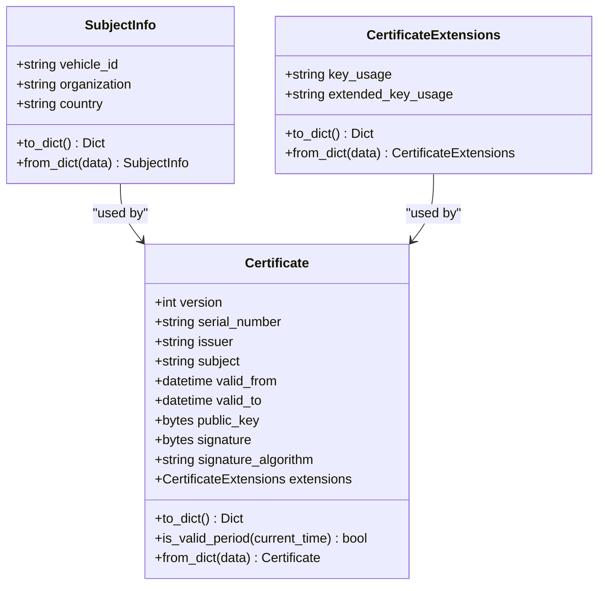
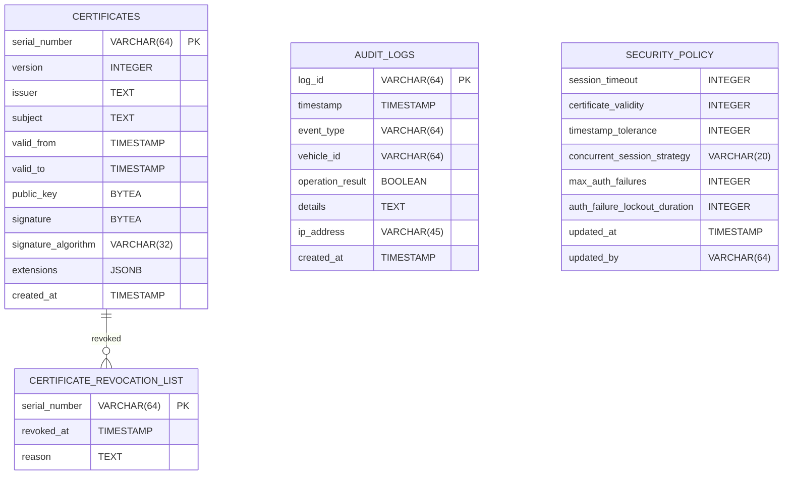
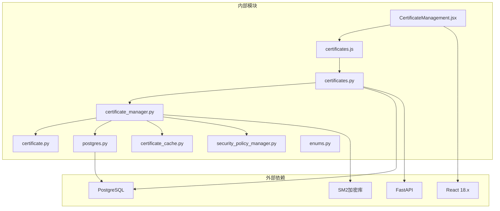

# 证书管理页面

<cite>
**本文档引用的文件**
- [CertificateManagement.jsx](file://web/src/pages/CertificateManagement.jsx)
- [certificates.js](file://web/src/api/certificates.js)
- [certificates.py](file://src/api/routes/certificates.py)
- [certificate_manager.py](file://src/certificate_manager.py)
- [certificate.py](file://src/models/certificate.py)
- [postgres.py](file://src/db/postgres.py)
- [schema.sql](file://db/schema.sql)
- [security_policy_manager.py](file://src/security_policy_manager.py)
- [certificate_cache.py](file://src/certificate_cache.py)
- [enums.py](file://src/models/enums.py)
- [App.jsx](file://web/src/App.jsx)
- [test_certificate_manager.py](file://tests/test_certificate_manager.py)
</cite>

## 目录
1. [简介](#简介)
2. [项目结构](#项目结构)
3. [核心组件](#核心组件)
4. [架构概览](#架构概览)
5. [详细组件分析](#详细组件分析)
6. [依赖关系分析](#依赖关系分析)
7. [性能考虑](#性能考虑)
8. [故障排除指南](#故障排除指南)
9. [结论](#结论)
10. [附录](#附录)

## 简介

证书管理页面是车联网安全通信网关系统的重要组成部分，负责管理车辆数字证书的全生命周期。该页面提供了直观的用户界面，支持证书的申请、颁发、撤销、状态显示和验证等功能。系统采用SM2椭圆曲线密码算法，确保车辆与网关之间的安全通信。

## 项目结构

证书管理功能分布在前端React应用和后端Python服务中，采用分层架构设计：



**图表来源**
- [CertificateManagement.jsx:1-236](file://web/src/pages/CertificateManagement.jsx#L1-L236)
- [certificates.js:1-31](file://web/src/api/certificates.js#L1-L31)
- [certificates.py:1-390](file://src/api/routes/certificates.py#L1-L390)
- [certificate_manager.py:1-734](file://src/certificate_manager.py#L1-L734)

**章节来源**
- [CertificateManagement.jsx:1-236](file://web/src/pages/CertificateManagement.jsx#L1-L236)
- [certificates.js:1-31](file://web/src/api/certificates.js#L1-L31)
- [certificates.py:1-390](file://src/api/routes/certificates.py#L1-L390)

## 核心组件

### 前端组件

**CertificateManagement.jsx** 是主要的UI组件，实现了完整的证书管理界面：

- **证书列表展示**：显示所有已颁发证书的详细信息
- **状态过滤**：支持按有效、过期、撤销状态筛选
- **证书颁发**：提供表单用于申请新证书
- **证书撤销**：允许管理员撤销已颁发的证书
- **CRL查看**：显示证书撤销列表

### 后端API

**certificates.py** 提供RESTful API接口：

- `GET /api/certificates`：获取证书列表（支持状态过滤）
- `POST /api/certificates/issue`：颁发新证书
- `POST /api/certificates/revoke`：撤销证书
- `GET /api/certificates/crl`：获取CRL列表

### 业务逻辑

**certificate_manager.py** 实现核心业务逻辑：

- 证书颁发算法（Algorithm 4）
- 证书验证算法（Algorithm 5）
- 证书撤销管理
- 证书缓存机制
- 审计日志记录

**章节来源**
- [CertificateManagement.jsx:4-236](file://web/src/pages/CertificateManagement.jsx#L4-L236)
- [certificates.py:81-390](file://src/api/routes/certificates.py#L81-L390)
- [certificate_manager.py:597-734](file://src/certificate_manager.py#L597-L734)

## 架构概览

证书管理系统采用分层架构，确保职责分离和可维护性：



**图表来源**
- [CertificateManagement.jsx:19-43](file://web/src/pages/CertificateManagement.jsx#L19-L43)
- [certificates.js:3-8](file://web/src/api/certificates.js#L3-L8)
- [certificates.py:81-146](file://src/api/routes/certificates.py#L81-L146)
- [certificate_manager.py:206-332](file://src/certificate_manager.py#L206-L332)

## 详细组件分析

### 前端界面组件

#### CertificateManagement 组件

该组件实现了完整的证书管理界面，包含以下功能模块：

**状态管理**
- `certificates`: 存储证书列表数据
- `crl`: 存储撤销证书列表
- `loading`: 加载状态指示
- `error`: 错误信息存储
- `showIssueForm`: 发放证书表单显示状态
- `showCRL`: CRL显示状态
- `statusFilter`: 状态过滤器

**核心功能实现**

1. **证书列表加载**
```javascript
const loadCertificates = async () => {
    try {
        setLoading(true);
        setError(null);
        const data = await getCertificates(statusFilter || null);
        setCertificates(data.certificates);
    } catch (err) {
        setError(err.message);
    } finally {
        setLoading(false);
    }
};
```

2. **证书颁发流程**
```javascript
const handleIssueCertificate = async (e) => {
    e.preventDefault();
    try {
        setError(null);
        await issueCertificate(issueForm.vehicleId, issueForm.organization, issueForm.country);
        alert('证书颁发成功');
        setShowIssueForm(false);
        setIssueForm({ vehicleId: '', organization: '车辆制造商', country: 'CN' });
        loadCertificates();
    } catch (err) {
        setError(err.message);
    }
};
```

3. **证书撤销功能**
```javascript
const handleRevokeCertificate = async (serialNumber) => {
    if (!confirm('确定要撤销此证书吗？')) return;
    
    try {
        setError(null);
        await revokeCertificate(serialNumber, '管理员撤销');
        alert('证书撤销成功');
        loadCertificates();
    } catch (err) {
        setError(err.message);
    }
};
```

**章节来源**
- [CertificateManagement.jsx:19-70](file://web/src/pages/CertificateManagement.jsx#L19-L70)
- [CertificateManagement.jsx:104-138](file://web/src/pages/CertificateManagement.jsx#L104-L138)
- [CertificateManagement.jsx:141-159](file://web/src/pages/CertificateManagement.jsx#L141-L159)

### 后端API组件

#### 证书管理路由

**GET /api/certificates** - 获取证书列表

该端点支持状态过滤，返回所有已颁发证书的信息：

```python
@router.get("", response_model=CertificateListResponse)
async def get_certificates(
    status: Optional[str] = Query(None, description="证书状态过滤（valid/expired/revoked）"),
    user: str = Depends(verify_token)
):
    # 查询所有证书
    query = """
        SELECT serial_number, subject, issuer, valid_from, valid_to
        FROM certificates
        ORDER BY valid_from DESC
    """
    result = db_conn.execute_query(query, ())
    
    # 获取 CRL
    crl_list = get_crl(db_conn)
    
    certificates = []
    current_time = datetime.now()
    
    for row in result:
        # 确定证书状态
        if row['serial_number'] in crl_list:
            cert_status = "revoked"
        elif current_time > row['valid_to']:
            cert_status = "expired"
        elif current_time < row['valid_from']:
            cert_status = "not_yet_valid"
        else:
            cert_status = "valid"
        
        # 应用状态过滤
        if status and cert_status != status:
            continue
        
        cert_info = CertificateInfo(
            serial_number=row['serial_number'],
            subject=row['subject'],
            issuer=row['issuer'],
            valid_from=row['valid_from'],
            valid_to=row['valid_to'],
            status=cert_status
        )
        certificates.append(cert_info)
    
    return CertificateListResponse(
        total=len(certificates),
        certificates=certificates
    )
```

**POST /api/certificates/issue** - 颁发新证书

该端点实现完整的证书颁发流程：

```python
@router.post("/issue", response_model=IssueCertificateResponse)
async def issue_new_certificate(
    request: IssueCertificateRequest,
    http_request: Request,
    user: str = Depends(verify_token)
):
    # 解析客户端提供的公钥
    try:
        public_key = bytes.fromhex(request.public_key)
        if len(public_key) != 64:
            raise HTTPException(
                status_code=400,
                detail=f"公钥长度必须为 64 字节，当前为 {len(public_key)}"
            )
    except ValueError:
        raise HTTPException(
            status_code=400,
            detail="公钥格式错误，必须是十六进制字符串"
        )
    
    # 创建证书主体信息
    subject_info = SubjectInfo(
        vehicle_id=request.vehicle_id,
        organization=request.organization,
        country=request.country
    )
    
    # 获取证书有效期配置
    db_conn = PostgreSQLConnection(PostgreSQLConfig.from_env())
    from src.security_policy_manager import SecurityPolicyManager
    policy_manager = SecurityPolicyManager(db_conn)
    certificate_validity_days = policy_manager.get_certificate_validity()
    
    # 颁发证书
    certificate = issue_certificate(
        subject_info,
        public_key,
        ca_private_key,
        ca_public_key,
        db_conn,
        validity_days=certificate_validity_days
    )
    
    return IssueCertificateResponse(
        serial_number=certificate.serial_number,
        version=certificate.version,
        issuer=certificate.issuer,
        subject=certificate.subject,
        valid_from=certificate.valid_from.isoformat(),
        valid_to=certificate.valid_to.isoformat(),
        public_key=certificate.public_key.hex(),
        signature=certificate.signature.hex(),
        signature_algorithm=certificate.signature_algorithm,
        extensions=certificate.extensions.to_dict() if certificate.extensions else {},
        message=f"证书颁发成功，序列号: {certificate.serial_number}"
    )
```

**POST /api/certificates/revoke** - 撤销证书

该端点处理证书撤销请求：

```python
@router.post("/revoke", response_model=RevokeCertificateResponse)
async def revoke_existing_certificate(
    request: RevokeCertificateRequest,
    http_request: Request,
    user: str = Depends(verify_token)
):
    # 查询证书信息以获取车辆ID
    query = "SELECT subject FROM certificates WHERE serial_number = %s"
    result = db_conn.execute_query(query, (request.serial_number,))
    vehicle_id = "unknown"
    if result:
        # 从 subject 中提取车辆ID
        subject = result[0]['subject']
        if 'CN=' in subject:
            vehicle_id = subject.split('CN=')[1].split(',')[0].strip()
    
    success = revoke_certificate(
        request.serial_number,
        request.reason,
        db_conn
    )
    
    return RevokeCertificateResponse(
        success=success,
        message=f"证书 {request.serial_number} 已成功撤销"
    )
```

**章节来源**
- [certificates.py:81-146](file://src/api/routes/certificates.py#L81-L146)
- [certificates.py:154-275](file://src/api/routes/certificates.py#L154-L275)
- [certificates.py:277-359](file://src/api/routes/certificates.py#L277-L359)

### 业务逻辑组件

#### 证书管理器

**certificate_manager.py** 实现了核心的证书管理功能：

**证书颁发算法（Algorithm 4）**

```python
def issue_certificate(
    subject_info: SubjectInfo,
    public_key: bytes,
    ca_private_key: bytes,
    ca_public_key: bytes,
    db_conn: Optional[PostgreSQLConnection] = None,
    use_secure_storage: bool = True,
    validity_days: int = 365
) -> Certificate:
    # 步骤 1：生成唯一序列号
    serial_number = generate_unique_serial_number()
    
    # 步骤 2：设置证书有效期
    valid_from = datetime.utcnow()
    valid_to = valid_from + timedelta(days=validity_days)
    
    # 步骤 3：构造证书主体
    certificate = Certificate(
        version=3,
        serial_number=serial_number,
        issuer=CA_DISTINGUISHED_NAME,
        subject=create_distinguished_name(subject_info),
        valid_from=valid_from,
        valid_to=valid_to,
        public_key=public_key,
        signature=b'',  # 签名稍后填充
        signature_algorithm="SM2",
        extensions=create_certificate_extensions(subject_info)
    )
    
    # 步骤 4：构造待签名数据（TBS Certificate）
    tbs_certificate = encode_tbs_certificate(certificate)
    
    # 步骤 5：使用 CA 私钥签名
    signature = sm2_sign(tbs_certificate, ca_private_key)
    
    # 步骤 6：将签名附加到证书
    certificate.signature = signature
    
    # 步骤 7：存储证书到数据库
    store_certificate(certificate, db_conn)
    
    # 步骤 8：记录审计日志
    log_certificate_operation(EventType.CERTIFICATE_ISSUED, serial_number, db_conn)
    
    return certificate
```

**证书验证算法（Algorithm 5）**

```python
def verify_certificate(
    certificate: Certificate,
    ca_public_key: bytes,
    crl_list: list,
    db_conn: Optional[PostgreSQLConnection] = None,
    use_cache: bool = True
) -> tuple[ValidationResult, str]:
    # 前置条件验证
    if certificate is None:
        raise ValueError("certificate 不能为 None")
    
    if ca_public_key is None:
        raise ValueError("ca_public_key 不能为 None")
    
    if len(ca_public_key) != 64:
        raise ValueError(f"ca_public_key 长度必须为 64 字节，当前为 {len(ca_public_key)}")
    
    if crl_list is None:
        raise ValueError("crl_list 不能为 None")
    
    # 尝试从缓存获取验证结果
    if use_cache:
        cache = get_certificate_cache()
        cached_result = cache.get(certificate.serial_number)
        if cached_result is not None:
            return cached_result
    
    # 步骤 1：检查证书格式
    if not is_valid_certificate_format(certificate):
        result = (ValidationResult.INVALID, "证书格式错误")
        return result
    
    # 步骤 2：检查证书有效期
    current_time = datetime.utcnow()
    
    if current_time < certificate.valid_from:
        result = (ValidationResult.INVALID, "证书尚未生效")
        return result
    
    if current_time > certificate.valid_to:
        result = (ValidationResult.INVALID, "证书已过期")
        return result
    
    # 步骤 3：检查证书是否被撤销
    for revoked_serial in crl_list:
        if revoked_serial == certificate.serial_number:
            result = (ValidationResult.REVOKED, "证书已被撤销")
            return result
    
    # 步骤 4：验证证书签名
    tbs_certificate = encode_tbs_certificate(certificate)
    signature_valid = sm2_verify(tbs_certificate, certificate.signature, ca_public_key)
    
    if not signature_valid:
        result = (ValidationResult.INVALID, "证书签名验证失败")
        return result
    
    # 步骤 5：验证证书链
    if certificate.issuer != CA_DISTINGUISHED_NAME:
        result = (ValidationResult.INVALID, "证书链验证失败")
        return result
    
    # 验证通过
    result = (ValidationResult.VALID, "证书验证通过")
    
    return result
```

**章节来源**
- [certificate_manager.py:597-734](file://src/certificate_manager.py#L597-L734)
- [certificate_manager.py:206-332](file://src/certificate_manager.py#L206-L332)

### 数据模型组件

#### 证书数据模型

**certificate.py** 定义了证书相关的数据结构：



**图表来源**
- [certificate.py:8-108](file://src/models/certificate.py#L8-L108)

**章节来源**
- [certificate.py:8-108](file://src/models/certificate.py#L8-L108)

### 数据库架构

#### 数据库模式

**schema.sql** 定义了证书管理系统的数据库结构：



**图表来源**
- [schema.sql:3-104](file://db/schema.sql#L3-L104)

**章节来源**
- [schema.sql:3-104](file://db/schema.sql#L3-L104)

## 依赖关系分析

证书管理系统的依赖关系清晰，遵循单一职责原则：



**图表来源**
- [CertificateManagement.jsx:1-236](file://web/src/pages/CertificateManagement.jsx#L1-L236)
- [certificates.py:1-390](file://src/api/routes/certificates.py#L1-L390)
- [certificate_manager.py:1-734](file://src/certificate_manager.py#L1-L734)

**章节来源**
- [CertificateManagement.jsx:1-236](file://web/src/pages/CertificateManagement.jsx#L1-L236)
- [certificates.py:1-390](file://src/api/routes/certificates.py#L1-L390)

## 性能考虑

### 缓存机制

系统实现了多层次的缓存策略来提升性能：

1. **证书验证缓存**：使用LRU缓存存储验证结果，缓存大小10,000，TTL 5分钟
2. **安全策略缓存**：安全策略每60秒缓存一次
3. **数据库连接池**：复用数据库连接减少开销

### 数据库优化

1. **索引优化**：为证书序列号、有效期、审计日志等关键字段建立索引
2. **查询优化**：使用视图 `valid_certificates` 优化有效证书查询
3. **批量操作**：支持批量证书撤销和状态更新

### 前端优化

1. **懒加载**：CRL内容按需加载
2. **状态管理**：使用React hooks优化状态更新
3. **防抖处理**：搜索和过滤操作使用防抖机制

**章节来源**
- [certificate_cache.py:13-156](file://src/certificate_cache.py#L13-L156)
- [security_policy_manager.py:73-126](file://src/security_policy_manager.py#L73-L126)
- [schema.sql:20-53](file://db/schema.sql#L20-L53)

## 故障排除指南

### 常见问题及解决方案

**证书颁发失败**
- 检查CA密钥配置是否正确
- 验证公钥格式是否为64字节十六进制
- 确认数据库连接正常

**证书验证失败**
- 检查证书是否在有效期内
- 验证证书是否已被撤销
- 确认CA公钥正确性

**CRL加载错误**
- 检查数据库中CRL表结构
- 验证撤销证书序列号格式

### 调试工具

系统提供了完善的审计日志功能，可用于问题诊断：

```python
# 审计日志记录示例
audit_logger.log_certificate_operation(
    operation="issued",
    cert_id=certificate.serial_number,
    vehicle_id=request.vehicle_id,
    ip_address=client_ip,
    details=f"为车辆 {request.vehicle_id} 颁发证书，序列号: {certificate.serial_number}"
)
```

**章节来源**
- [certificates.py:227-236](file://src/api/routes/certificates.py#L227-L236)
- [certificates.py:317-325](file://src/api/routes/certificates.py#L317-L325)

## 结论

证书管理页面提供了完整的证书生命周期管理功能，具有以下特点：

1. **安全性**：采用SM2椭圆曲线密码算法，确保通信安全
2. **完整性**：支持证书申请、颁发、撤销、验证的完整流程
3. **可维护性**：清晰的分层架构和模块化设计
4. **可扩展性**：支持自定义扩展和第三方集成
5. **可观测性**：完善的审计日志和监控机制

该系统为车联网环境下的设备身份认证和安全通信提供了坚实的技术基础。

## 附录

### 开发者扩展指南

**新增证书类型**
1. 在 `SubjectInfo` 中添加新的主体字段
2. 更新 `create_distinguished_name` 函数
3. 修改前端表单和API请求模型

**自定义验证规则**
1. 在 `is_valid_certificate_format` 中添加验证逻辑
2. 更新 `verify_certificate` 函数的验证步骤
3. 添加相应的错误处理

**集成新的存储后端**
1. 实现新的存储接口
2. 更新数据库连接管理
3. 修改数据迁移脚本

**章节来源**
- [certificate_manager.py:171-204](file://src/certificate_manager.py#L171-L204)
- [certificate_manager.py:212-332](file://src/certificate_manager.py#L212-L332)