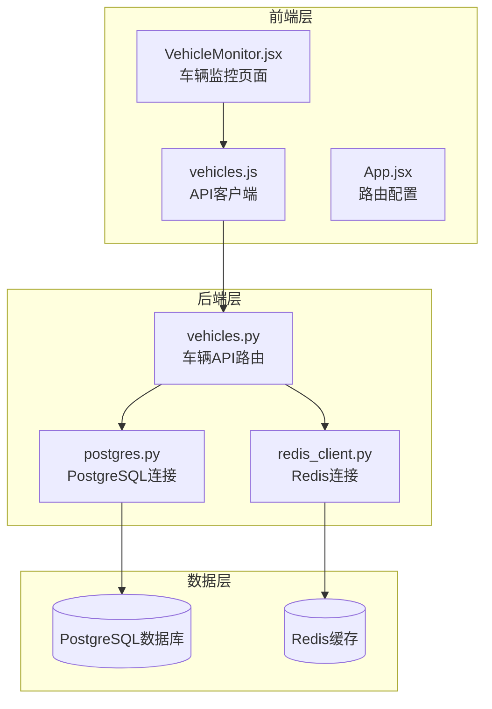
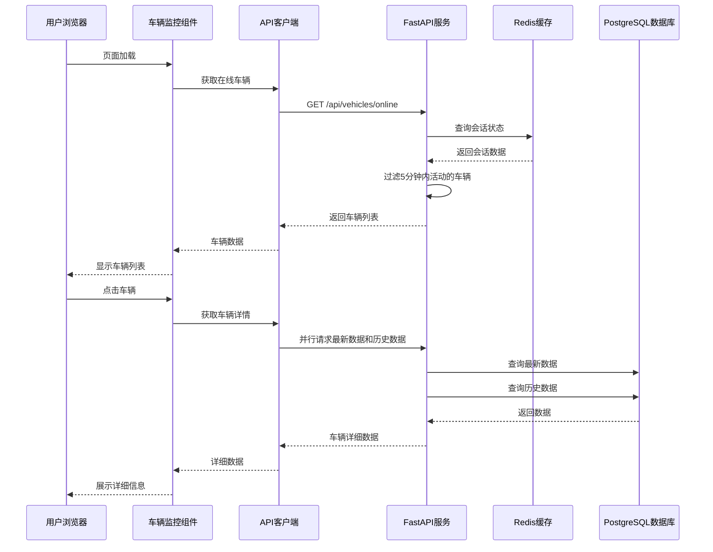
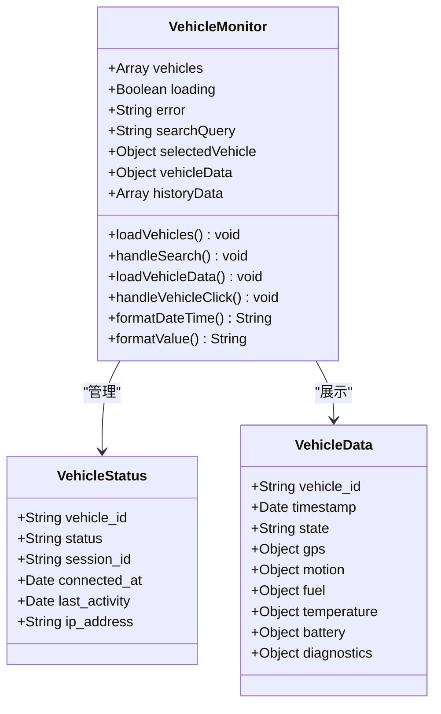
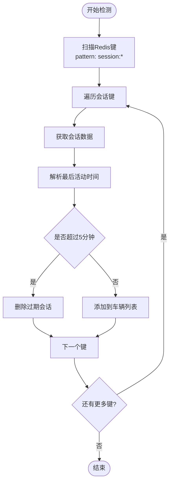
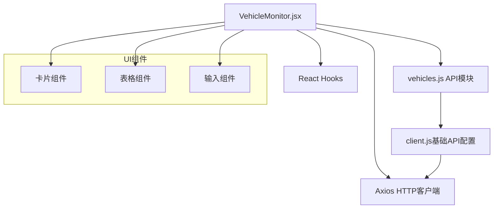
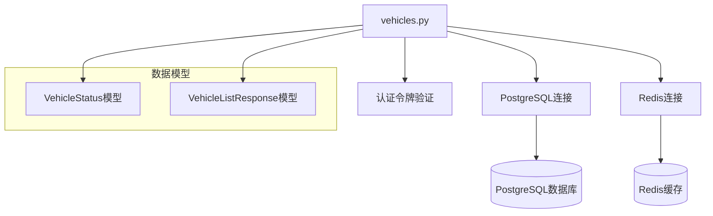

# 车辆监控页面

<cite>
**本文档引用的文件**
- [VehicleMonitor.jsx](file://web/src/pages/VehicleMonitor.jsx)
- [vehicles.js](file://web/src/api/vehicles.js)
- [client.js](file://web/src/api/client.js)
- [vehicles.py](file://src/api/routes/vehicles.py)
- [postgres.py](file://src/db/postgres.py)
- [redis_client.py](file://src/db/redis_client.py)
- [002_vehicle_data_table.sql](file://db/migrations/002_vehicle_data_table.sql)
- [App.jsx](file://web/src/App.jsx)
- [enums.py](file://src/models/enums.py)
- [VEHICLE_DATA_IMPLEMENTATION_COMPLETE.md](file://docs/VEHICLE_DATA_IMPLEMENTATION_COMPLETE.md)
- [VEHICLE_DATA_FEATURE.md](file://docs/VEHICLE_DATA_FEATURE.md)
- [API.md](file://docs/API.md)
</cite>

## 目录
1. [简介](#简介)
2. [项目结构](#项目结构)
3. [核心组件](#核心组件)
4. [架构概览](#架构概览)
5. [详细组件分析](#详细组件分析)
6. [依赖关系分析](#依赖关系分析)
7. [性能考虑](#性能考虑)
8. [故障排除指南](#故障排除指南)
9. [结论](#结论)
10. [附录](#附录)

## 简介

车辆监控页面是车联网安全通信网关系统的核心界面，负责实时展示和管理车辆状态监控。该页面提供了完整的车辆状态可视化、实时数据展示、连接状态管理以及历史数据查询功能。系统采用前后端分离架构，前端使用React构建用户界面，后端基于FastAPI提供RESTful API服务，数据存储采用PostgreSQL和Redis相结合的方式。

## 项目结构

车辆监控页面位于Web前端应用的页面目录中，与后端API服务形成清晰的分层架构：

**图表来源**
- [VehicleMonitor.jsx:1-373](file://web/src/pages/VehicleMonitor.jsx#L1-L373)
- [vehicles.js:1-38](file://web/src/api/vehicles.js#L1-L38)
- [vehicles.py:1-447](file://src/api/routes/vehicles.py#L1-L447)

**章节来源**
- [VehicleMonitor.jsx:1-373](file://web/src/pages/VehicleMonitor.jsx#L1-L373)
- [App.jsx:1-42](file://web/src/App.jsx#L1-L42)

## 核心组件

### 车辆监控主组件

VehicleMonitor组件是整个监控页面的核心，负责管理车辆列表、实时数据展示和用户交互。该组件实现了完整的状态管理机制，包括车辆状态跟踪、数据加载控制和错误处理。

### API客户端模块

vehicles.js模块封装了所有与后端API的通信逻辑，提供了统一的接口来获取在线车辆、搜索车辆、获取最新数据和历史数据。该模块使用Axios作为HTTP客户端，并集成了请求拦截器和错误处理机制。

### 数据模型定义

系统定义了标准的车辆状态模型，包括车辆标识、连接状态、会话信息和IP地址等关键属性。这些模型确保了前后端数据交换的一致性和完整性。

**章节来源**
- [VehicleMonitor.jsx:4-82](file://web/src/pages/VehicleMonitor.jsx#L4-L82)
- [vehicles.js:1-38](file://web/src/api/vehicles.js#L1-L38)
- [vehicles.py:22-36](file://src/api/routes/vehicles.py#L22-L36)

## 架构概览

车辆监控系统采用现代Web架构设计，实现了高效的实时数据展示和状态管理：

**图表来源**
- [VehicleMonitor.jsx:69-82](file://web/src/pages/VehicleMonitor.jsx#L69-L82)
- [vehicles.js:3-30](file://web/src/api/vehicles.js#L3-L30)
- [vehicles.py:38-99](file://src/api/routes/vehicles.py#L38-L99)

## 详细组件分析

### 实时车辆数据展示组件

#### 车辆列表管理

车辆列表组件实现了完整的车辆状态展示功能，包括在线状态指示、最后活动时间和交互反馈。组件使用网格布局实现响应式设计，支持不同屏幕尺寸的适配。

**图表来源**
- [VehicleMonitor.jsx:4-92](file://web/src/pages/VehicleMonitor.jsx#L4-L92)
- [vehicles.py:22-306](file://src/api/routes/vehicles.py#L22-L306)

#### 实时数据刷新机制

系统实现了智能的数据刷新策略，通过定时器实现5秒间隔的自动刷新。对于选中的车辆，系统会启动专门的刷新任务，确保详细数据的实时性。

#### 数据格式化工具

组件提供了统一的数据格式化函数，负责将原始数据转换为用户友好的显示格式，包括日期时间格式化和数值单位转换。

**章节来源**
- [VehicleMonitor.jsx:94-370](file://web/src/pages/VehicleMonitor.jsx#L94-L370)

### 车辆连接状态管理

#### 在线状态检测

系统通过Redis缓存实现车辆连接状态的实时检测。每个活跃的车辆会维护一个会话键，包含最后活动时间、连接建立时间和IP地址等信息。

**图表来源**
- [vehicles.py:49-87](file://src/api/routes/vehicles.py#L49-L87)
- [redis_client.py:51-71](file://src/db/redis_client.py#L51-L71)

#### 状态更新机制

车辆状态更新采用"最后活动时间"机制，当车辆在Redis中最后一次更新时间超过5分钟时，系统将其标记为离线状态。这种设计既保证了状态的准确性，又避免了频繁的数据库查询。

**章节来源**
- [vehicles.py:38-181](file://src/api/routes/vehicles.py#L38-L181)
- [redis_client.py:15-29](file://src/db/redis_client.py#L15-L29)

### 车辆数据图表和可视化组件

#### 实时数据卡片

系统提供了多个数据卡片来展示关键的车辆运行参数，包括状态、速度、发动机温度、油量等。每个卡片都采用了颜色编码和字体大小的差异化设计，便于快速识别重要信息。

#### GPS位置可视化

GPS数据通过经纬度坐标进行位置展示，包括海拔高度、方向角度和卫星数量等辅助信息。系统支持点击车辆查看详细GPS信息的功能。

#### 历史数据表格

历史数据以表格形式展示最近20条记录，包含时间戳、状态、速度、温度、油量和转速等关键指标。表格支持水平滚动，便于查看大量历史数据。

**章节来源**
- [VehicleMonitor.jsx:194-358](file://web/src/pages/VehicleMonitor.jsx#L194-L358)

### 搜索过滤和排序功能

#### 车辆搜索实现

搜索功能基于车辆标识符进行模糊匹配，支持大小写不敏感的搜索。系统会扫描所有活跃会话，提取匹配的车辆信息并返回给前端。

#### 数据排序机制

历史数据按照时间戳降序排列，最新的数据总是显示在最前面。这种排序方式符合用户的预期，便于追踪车辆状态的变化趋势。

**章节来源**
- [vehicles.js:13-18](file://web/src/api/vehicles.js#L13-L18)
- [vehicles.py:184-238](file://src/api/routes/vehicles.py#L184-L238)

### 车辆状态变更通知和告警机制

#### 状态变更检测

系统通过比较当前状态和上一次状态来检测车辆状态变更。虽然当前版本主要依赖定时刷新，但架构设计支持未来的WebSocket实时推送功能。

#### 告警功能规划

根据项目文档，系统计划实现多种告警功能，包括温度过高、油量过低、异常速度等条件触发的告警机制。这些告警将通过WebSocket实时推送到客户端。

**章节来源**
- [VEHICLE_DATA_IMPLEMENTATION_COMPLETE.md:273-280](file://docs/VEHICLE_DATA_IMPLEMENTATION_COMPLETE.md#L273-L280)

## 依赖关系分析

### 前端依赖关系

**图表来源**
- [VehicleMonitor.jsx:1-3](file://web/src/pages/VehicleMonitor.jsx#L1-L3)
- [client.js:1-25](file://web/src/api/client.js#L1-L25)

### 后端依赖关系

后端服务依赖于多种数据库和缓存技术，形成了高效的数据存储和检索体系：

**图表来源**
- [vehicles.py:8-17](file://src/api/routes/vehicles.py#L8-L17)
- [postgres.py:9-53](file://src/db/postgres.py#L9-L53)
- [redis_client.py:8-79](file://src/db/redis_client.py#L8-L79)

**章节来源**
- [VehicleMonitor.jsx:1-3](file://web/src/pages/VehicleMonitor.jsx#L1-L3)
- [vehicles.py:14-17](file://src/api/routes/vehicles.py#L14-L17)

## 性能考虑

### 数据库性能优化

系统通过多种方式优化数据库性能：

1. **索引优化**：为vehicle_id、timestamp和received_at字段创建复合索引，提高查询效率
2. **视图优化**：使用latest_vehicle_data视图减少复杂查询的计算开销
3. **数据清理**：自动清理7天前的历史数据，控制数据库增长

### 缓存策略

Redis缓存系统提供了高性能的会话状态管理：

- **会话存储**：所有活跃会话信息存储在Redis中，支持快速查找
- **超时管理**：自动检测和清理超时的会话，释放内存资源
- **批量操作**：使用SCAN命令进行键扫描，避免阻塞Redis服务器

### 前端性能优化

前端组件实现了多项性能优化措施：

- **并发请求**：使用Promise.all并行获取最新数据和历史数据
- **状态缓存**：避免重复的API调用，提高用户体验
- **懒加载**：只在需要时加载详细数据，减少初始加载时间

**章节来源**
- [002_vehicle_data_table.sql:53-102](file://db/migrations/002_vehicle_data_table.sql#L53-L102)
- [vehicles.py:254-316](file://src/api/routes/vehicles.py#L254-L316)

## 故障排除指南

### 常见问题诊断

#### 数据加载失败

当出现数据加载失败时，系统会显示错误信息并停止刷新。常见原因包括网络连接问题、API服务不可用或数据库连接异常。

#### 车辆状态显示异常

如果车辆状态显示不正确，可能的原因包括：
- Redis连接失败导致会话状态无法获取
- 时间同步问题导致最后活动时间计算错误
- 数据库查询超时

#### 前端渲染问题

前端组件可能出现的渲染问题：
- 格式化函数处理空值时的异常
- 并发请求导致的数据竞争
- 内存泄漏导致的性能下降

**章节来源**
- [VehicleMonitor.jsx:20-44](file://web/src/pages/VehicleMonitor.jsx#L20-L44)
- [vehicles.js:16-18](file://web/src/api/vehicles.js#L16-L18)

### 调试建议

1. **检查网络连接**：确认前端能够正常访问后端API
2. **验证数据库连接**：确保PostgreSQL和Redis服务正常运行
3. **监控API响应**：使用浏览器开发者工具检查API调用结果
4. **查看日志输出**：检查后端服务的日志输出以定位问题

## 结论

车辆监控页面是一个功能完整、架构清晰的实时监控系统。它成功地整合了前端React组件、后端FastAPI服务和数据库存储技术，为车联网环境提供了可靠的车辆状态监控解决方案。

系统的主要优势包括：
- 实时数据展示和状态管理
- 高效的搜索和过滤功能
- 完善的错误处理和性能优化
- 可扩展的架构设计

未来的发展方向包括WebSocket实时推送、地图集成、数据可视化和告警功能等增强特性。

## 附录

### API接口规范

系统提供了完整的RESTful API接口，支持车辆状态查询、数据获取和历史记录查询等功能。

### 数据模型说明

系统定义了标准的数据模型，确保前后端数据交换的一致性和完整性。

### 部署和配置

系统支持Docker容器化部署，提供了完整的部署文档和配置指南。