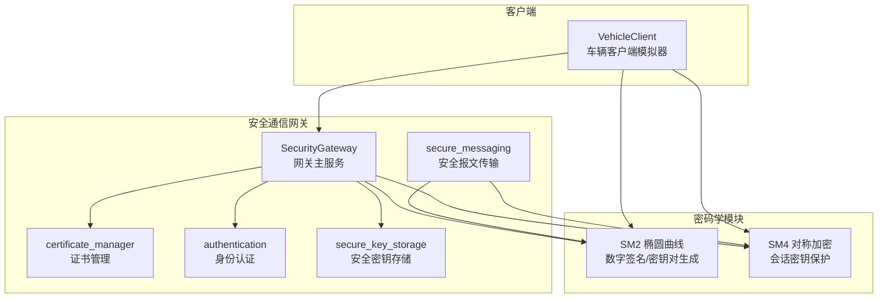
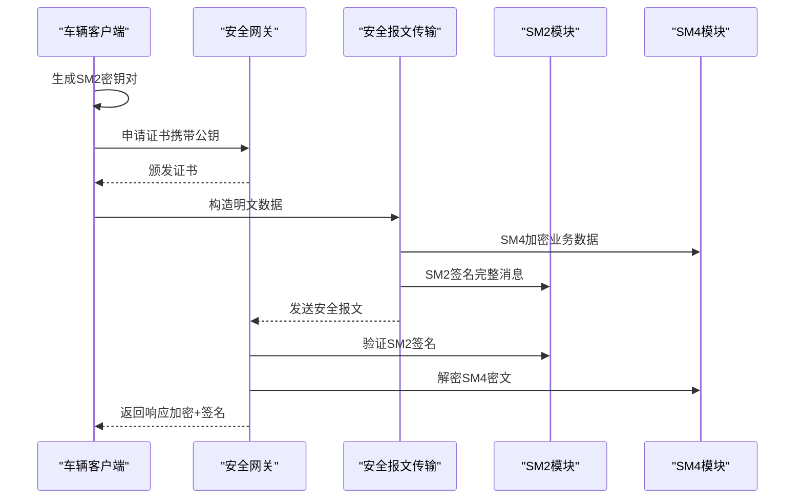
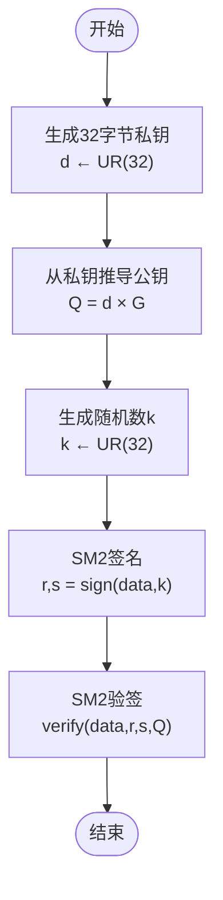
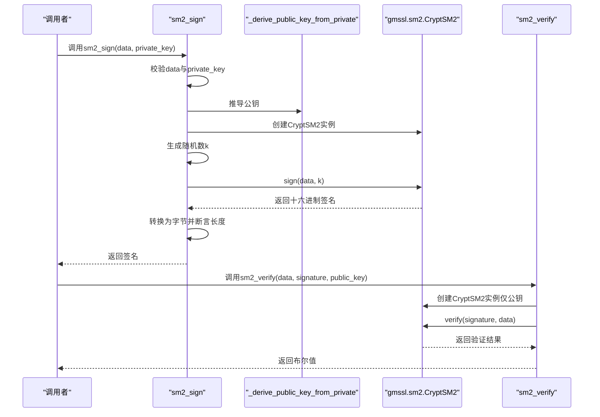
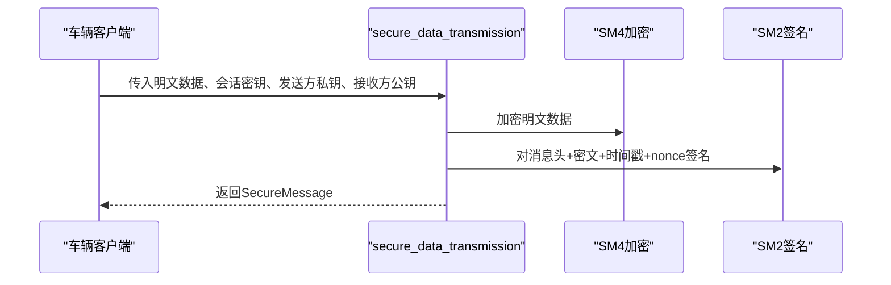
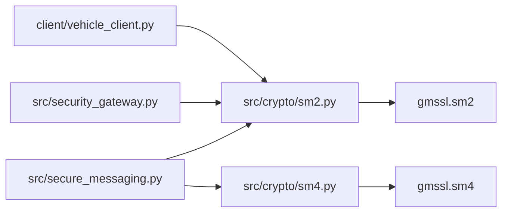

# SM2椭圆曲线公钥算法

<cite>
**本文引用的文件**
- [sm2.py](file://src/crypto/sm2.py)
- [test_sm2.py](file://tests/test_sm2.py)
- [sm4.py](file://src/crypto/sm4.py)
- [secure_messaging.py](file://src/secure_messaging.py)
- [security_gateway.py](file://src/security_gateway.py)
- [vehicle_client.py](file://client/vehicle_client.py)
- [performance_monitoring_demo.py](file://examples/performance_monitoring_demo.py)
- [requirements.md](file://.kiro/specs/vehicle-iot-security-gateway/requirements.md)
</cite>

## 目录
1. [引言](#引言)
2. [项目结构](#项目结构)
3. [核心组件](#核心组件)
4. [架构概览](#架构概览)
5. [详细组件分析](#详细组件分析)
6. [依赖分析](#依赖分析)
7. [性能考虑](#性能考虑)
8. [故障排除指南](#故障排除指南)
9. [结论](#结论)
10. [附录](#附录)

## 引言
本文件为SM2椭圆曲线公钥算法的深入技术文档，面向密码学研究人员与安全工程师。内容涵盖SM2的数学原理、密钥对生成流程、数字签名的生成与验证过程，以及在车联网安全通信场景中的应用与优势。文档还提供了性能分析、优化建议、使用示例与最佳实践，帮助读者在实际项目中正确、高效地部署SM2算法。

## 项目结构
该项目围绕“车联网安全通信网关”构建，SM2作为核心密码学组件之一，与SM4对称加密、证书管理、会话管理等模块协同工作，形成完整的车云安全通信链路。

图表来源
- [sm2.py:1-265](file://src/crypto/sm2.py#L1-L265)
- [sm4.py:1-189](file://src/crypto/sm4.py#L1-L189)
- [secure_messaging.py:1-200](file://src/secure_messaging.py#L1-L200)
- [security_gateway.py:1-800](file://src/security_gateway.py#L1-L800)
- [vehicle_client.py:1-200](file://client/vehicle_client.py#L1-L200)

章节来源
- [sm2.py:1-265](file://src/crypto/sm2.py#L1-L265)
- [sm4.py:1-189](file://src/crypto/sm4.py#L1-L189)
- [secure_messaging.py:1-200](file://src/secure_messaging.py#L1-L200)
- [security_gateway.py:1-800](file://src/security_gateway.py#L1-L800)
- [vehicle_client.py:1-200](file://client/vehicle_client.py#L1-L200)

## 核心组件
- SM2数字签名与密钥对生成：提供SM2签名、验签与密钥对生成能力，遵循GM/T 0003-2012标准。
- SM4对称加密：提供SM4加密解密与会话密钥生成，用于业务数据的机密性保护。
- 安全报文传输：整合SM4加密与SM2签名，实现端到端的机密性、完整性与不可否认性。
- 安全网关：集成证书管理、双向认证、会话管理与审计日志，支撑车联网安全通信。
- 车辆客户端：模拟车辆终端，展示密钥对生成、证书申请、安全数据传输与会话管理。

章节来源
- [sm2.py:93-132](file://src/crypto/sm2.py#L93-L132)
- [sm4.py:11-46](file://src/crypto/sm4.py#L11-L46)
- [secure_messaging.py:17-141](file://src/secure_messaging.py#L17-L141)
- [security_gateway.py:37-128](file://src/security_gateway.py#L37-L128)
- [vehicle_client.py:105-116](file://client/vehicle_client.py#L105-L116)

## 架构概览
SM2在整体架构中的位置如下：

图表来源
- [vehicle_client.py:105-116](file://client/vehicle_client.py#L105-L116)
- [secure_messaging.py:17-141](file://src/secure_messaging.py#L17-L141)
- [security_gateway.py:543-601](file://src/security_gateway.py#L543-L601)

章节来源
- [requirements.md:1-111](file://.kiro/specs/vehicle-iot-security-gateway/requirements.md#L1-L111)
- [secure_messaging.py:17-141](file://src/secure_messaging.py#L17-L141)
- [security_gateway.py:543-601](file://src/security_gateway.py#L543-L601)

## 详细组件分析

### SM2椭圆曲线数学原理与实现
SM2基于椭圆曲线密码学，使用国密标准曲线参数，支持密钥对生成、数字签名与验签。实现要点：
- 椭圆曲线参数：来自GM/T 0003-2012标准，包含素数域参数(p, a, b)、基点G(gx, gy)与阶n。
- 点运算：实现点加法(point_add)与点乘法(point_multiply)，用于从私钥推导公钥。
- 密钥对生成：使用os.urandom生成32字节私钥，再通过椭圆曲线点乘运算推导公钥。
- 签名与验签：基于gmssl库的SM2实现，签名包含随机数k，保证非确定性；验签使用发送方公钥验证签名。

图表来源
- [sm2.py:11-90](file://src/crypto/sm2.py#L11-L90)
- [sm2.py:135-204](file://src/crypto/sm2.py#L135-L204)
- [sm2.py:206-265](file://src/crypto/sm2.py#L206-L265)

章节来源
- [sm2.py:11-90](file://src/crypto/sm2.py#L11-L90)
- [sm2.py:93-132](file://src/crypto/sm2.py#L93-L132)
- [sm2.py:135-204](file://src/crypto/sm2.py#L135-L204)
- [sm2.py:206-265](file://src/crypto/sm2.py#L206-L265)

### 密钥对生成流程
- 输入：无（使用系统CSRNG）
- 输出：(私钥32字节, 公钥64字节)
- 关键步骤：生成随机私钥→转换为十六进制→调用椭圆曲线点乘→拼接公钥坐标→返回字节串
- 后置条件：私钥长度32字节、公钥长度64字节、可从私钥推导公钥

章节来源
- [sm2.py:93-132](file://src/crypto/sm2.py#L93-L132)

### SM2数字签名与验签
- 签名流程：前置条件校验→生成随机数k→调用gmssl.sign→断言签名长度→返回签名
- 验签流程：前置条件校验→调用gmssl.verify→返回布尔结果
- 异常处理：对输入参数错误抛出ValueError；对签名/验签失败抛出RuntimeError或返回False

图表来源
- [sm2.py:135-204](file://src/crypto/sm2.py#L135-L204)
- [sm2.py:206-265](file://src/crypto/sm2.py#L206-L265)

章节来源
- [sm2.py:135-204](file://src/crypto/sm2.py#L135-L204)
- [sm2.py:206-265](file://src/crypto/sm2.py#L206-L265)

### 在安全报文传输中的应用
- 安全报文传输：SM4加密业务数据→构造待签名数据→SM2签名→封装为SecureMessage
- 验证与解密：时间戳与nonce校验→SM2验签→SM4解密→标记nonce使用

图表来源
- [secure_messaging.py:17-141](file://src/secure_messaging.py#L17-L141)

章节来源
- [secure_messaging.py:17-141](file://src/secure_messaging.py#L17-L141)

### 在车联网安全通信中的应用
- 车辆侧：生成SM2密钥对→申请证书→与网关双向认证→会话建立→SM4加密+SM2签名发送数据
- 网关侧：验证证书→双向认证→SM2验签→SM4解密→业务处理→SM4加密+SM2签名响应
- 安全优势：真实性（证书与SM2签名）、机密性（SM4对称加密）、完整性（SM2签名）、不可否认性（SM2签名）、抗重放（nonce与时间戳）

章节来源
- [requirements.md:1-111](file://.kiro/specs/vehicle-iot-security-gateway/requirements.md#L1-L111)
- [vehicle_client.py:105-116](file://client/vehicle_client.py#L105-L116)
- [security_gateway.py:289-438](file://src/security_gateway.py#L289-L438)

## 依赖分析
- 内部依赖
  - SM2模块依赖gmssl库进行底层SM2运算
  - 安全报文传输模块同时依赖SM2与SM4模块
  - 安全网关在证书颁发、认证与会话管理中使用SM2公钥进行验证
- 外部依赖
  - gmssl：提供SM2/SM4底层实现
  - Python标准库：os.urandom用于CS RNG

图表来源
- [sm2.py](file://src/crypto/sm2.py#L8)
- [sm4.py](file://src/crypto/sm4.py#L8)
- [secure_messaging.py:11-12](file://src/secure_messaging.py#L11-L12)
- [security_gateway.py:8-34](file://src/security_gateway.py#L8-L34)
- [vehicle_client.py](file://client/vehicle_client.py#L24)

章节来源
- [sm2.py](file://src/crypto/sm2.py#L8)
- [sm4.py](file://src/crypto/sm4.py#L8)
- [secure_messaging.py:11-12](file://src/secure_messaging.py#L11-L12)
- [security_gateway.py:8-34](file://src/security_gateway.py#L8-L34)
- [vehicle_client.py](file://client/vehicle_client.py#L24)

## 性能考虑
- 签名与验签性能：通过性能监控演示展示了SM2签名/验签的吞吐量与延迟指标，建议在高并发场景下：
  - 使用批量处理与连接池
  - 合理设置会话超时与清理策略
  - 对频繁调用的接口进行缓存与限流
- 加密解密性能：SM4为对称加密，性能远高于SM2；建议：
  - 业务数据使用SM4加密，控制密文长度为16字节倍数
  - 会话密钥按需轮换，避免长期使用同一密钥
- 椭圆曲线运算：点加与点乘为CPU密集型，建议：
  - 在硬件支持的环境下部署（如具备AES-NI、SM4/SM2硬件加速）
  - 对热点路径进行异步化与并发化

章节来源
- [performance_monitoring_demo.py:124-162](file://examples/performance_monitoring_demo.py#L124-L162)
- [sm4.py:49-108](file://src/crypto/sm4.py#L49-L108)

## 故障排除指南
- 签名/验签失败
  - 检查输入参数：data非空、private_key/public_key长度正确
  - 确认使用正确的公钥进行验签
  - 若gmssl异常，捕获并记录错误信息
- 密钥长度错误
  - SM2私钥必须32字节，公钥必须64字节
  - SM4密钥必须16或32字节
- 验证失败
  - 签名被篡改或数据被修改
  - 时间戳过期或nonce重复使用
- 单元测试参考
  - 密钥对唯一性、签名长度、验签正确性、参数校验等均有覆盖

章节来源
- [test_sm2.py:10-258](file://tests/test_sm2.py#L10-L258)
- [sm2.py:165-203](file://src/crypto/sm2.py#L165-L203)
- [sm2.py:236-264](file://src/crypto/sm2.py#L236-L264)

## 结论
SM2椭圆曲线公钥算法在本项目中承担着身份认证、数据完整性与不可否认性的关键职责。通过与SM4对称加密、证书管理与会话管理的协同，实现了车云通信的端到端安全。建议在生产环境中结合硬件加速、性能监控与安全轮换策略，持续优化系统性能与安全性。

## 附录

### 使用示例与最佳实践
- 密钥对生成
  - 调用接口：generate_sm2_keypair()
  - 输出：(私钥32字节, 公钥64字节)
  - 建议：私钥妥善存储，公钥公开分发
- 签名与验签
  - 签名：sm2_sign(data, private_key)
  - 验签：sm2_verify(data, signature, public_key)
  - 建议：签名数据包含时间戳与nonce，防止重放
- 安全报文传输
  - 顺序：SM4加密→SM2签名→封装为SecureMessage
  - 建议：会话密钥按需轮换，严格校验时间戳与nonce

章节来源
- [sm2.py:93-132](file://src/crypto/sm2.py#L93-L132)
- [sm2.py:135-204](file://src/crypto/sm2.py#L135-L204)
- [sm2.py:206-265](file://src/crypto/sm2.py#L206-L265)
- [secure_messaging.py:17-141](file://src/secure_messaging.py#L17-L141)