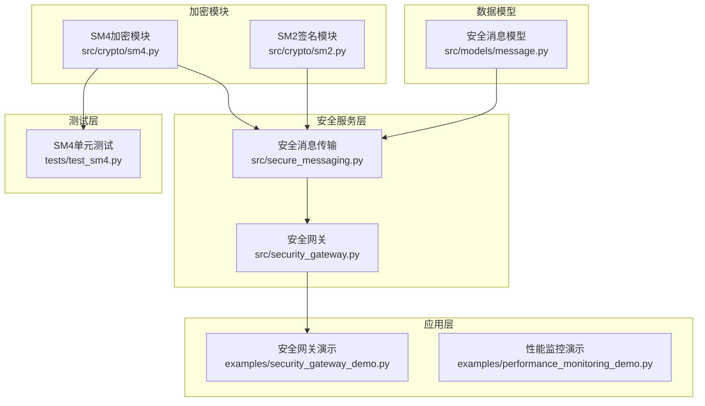
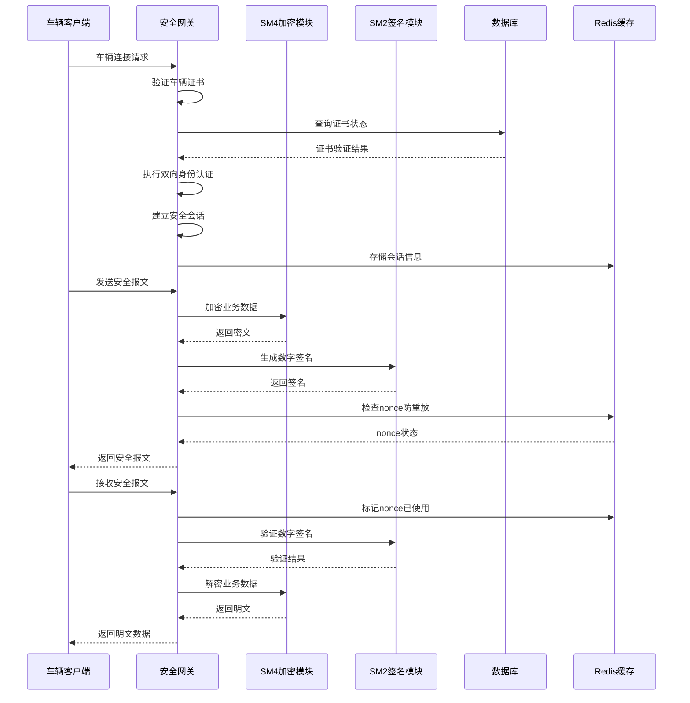
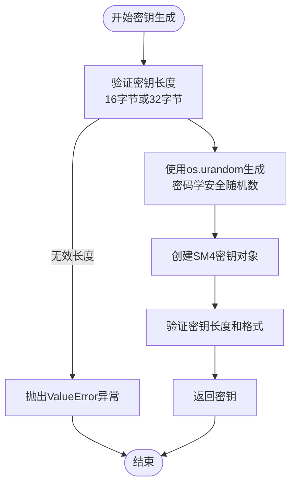
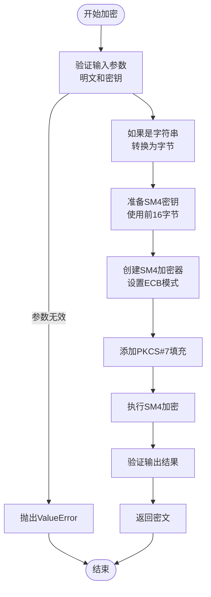
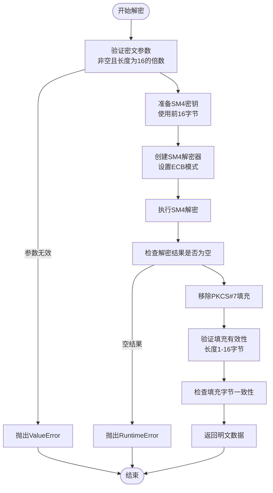
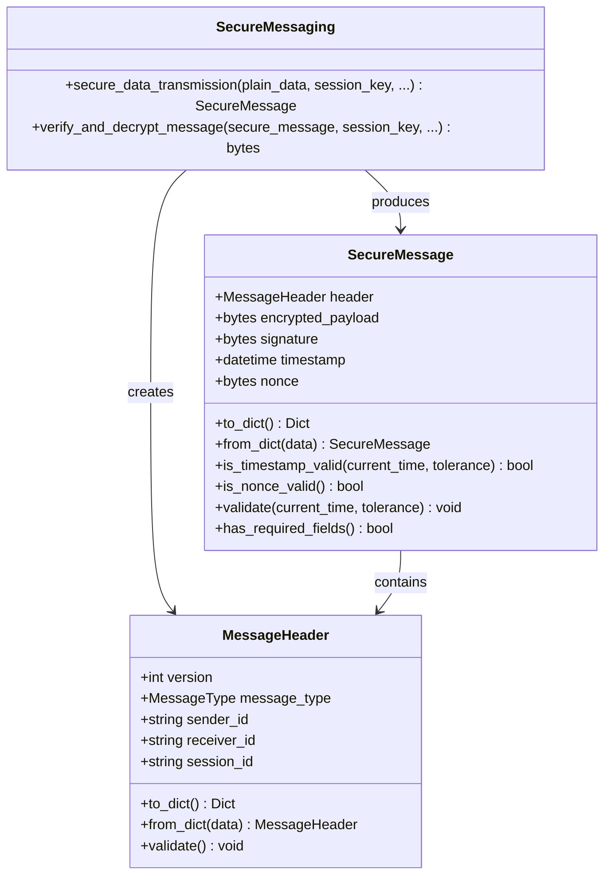
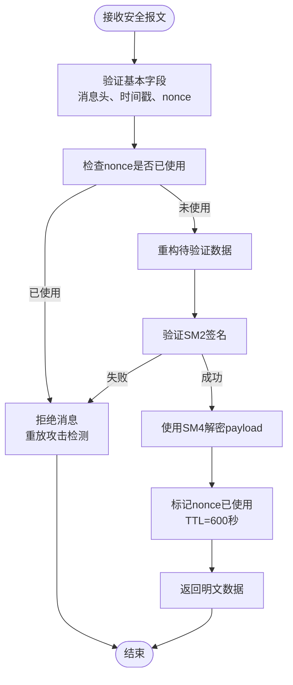
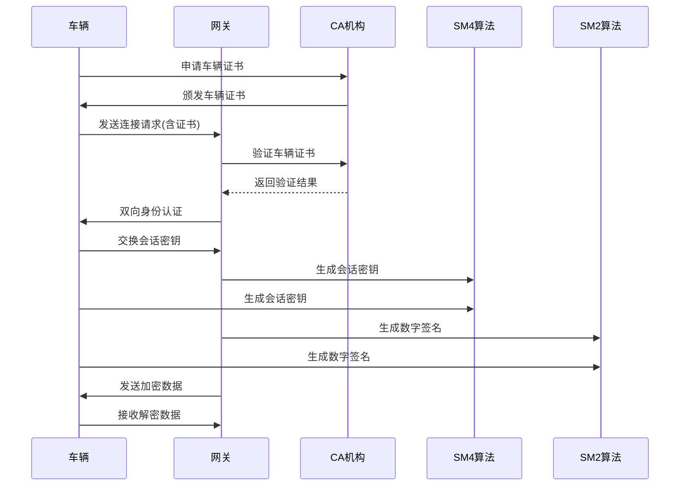
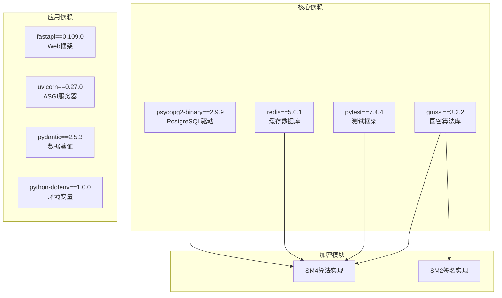
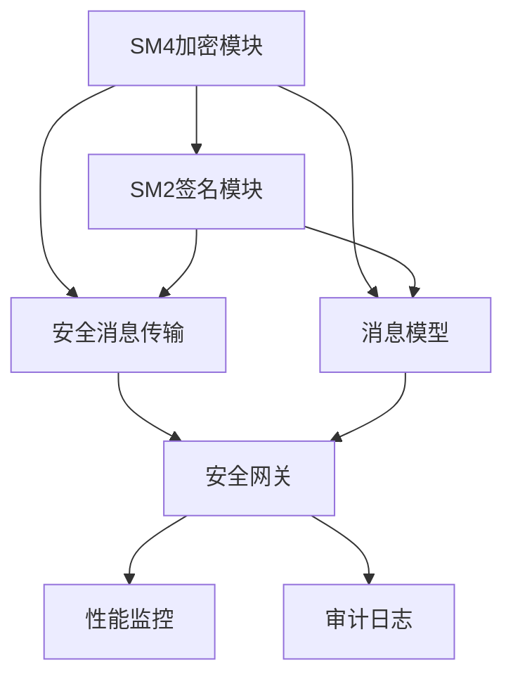

# SM4对称加密算法

<cite>
**本文档引用的文件**
- [sm4.py](file://src/crypto/sm4.py)
- [test_sm4.py](file://tests/test_sm4.py)
- [security_gateway.py](file://src/security_gateway.py)
- [secure_messaging.py](file://src/secure_messaging.py)
- [message.py](file://src/models/message.py)
- [sm2.py](file://src/crypto/sm2.py)
- [security_gateway_demo.py](file://examples/security_gateway_demo.py)
- [requirements.txt](file://requirements.txt)
- [performance_monitoring_demo.py](file://examples/performance_monitoring_demo.py)
</cite>

## 目录
1. [简介](#简介)
2. [项目结构](#项目结构)
3. [核心组件](#核心组件)
4. [架构概览](#架构概览)
5. [详细组件分析](#详细组件分析)
6. [依赖分析](#依赖分析)
7. [性能考虑](#性能考虑)
8. [故障排除指南](#故障排除指南)
9. [结论](#结论)
10. [附录](#附录)

## 简介

SM4是中国国家密码管理局发布的对称加密算法，属于中国商用密码标准之一。本项目实现了完整的SM4对称加密解决方案，包括密钥生成、加密、解密功能，并集成了SM2数字签名算法，为车联网通信提供端到端的安全保障。

SM4算法具有以下特点：
- 分组长度为128位（16字节）
- 支持128位和256位密钥长度
- 采用16轮迭代的分组密码结构
- 符合GM/T 0002-2012国家标准
- 支持ECB、CBC等多种工作模式

## 项目结构

该项目采用模块化设计，SM4加密功能位于独立的加密模块中，与安全网关、消息传输等功能模块协同工作。

**图表来源**
- [sm4.py:1-189](file://src/crypto/sm4.py#L1-L189)
- [security_gateway.py:1-800](file://src/security_gateway.py#L1-L800)
- [secure_messaging.py:1-249](file://src/secure_messaging.py#L1-L249)

**章节来源**
- [sm4.py:1-189](file://src/crypto/sm4.py#L1-L189)
- [requirements.txt:1-25](file://requirements.txt#L1-L25)

## 核心组件

### SM4加密模块

SM4加密模块提供了完整的对称加密解决方案，基于gmssl库实现，完全符合国密标准。

#### 主要功能
- **密钥生成**：支持16字节（128位）和32字节（256位）密钥生成
- **数据加密**：支持字节和字符串格式的数据加密
- **数据解密**：支持密文解密和填充验证
- **错误处理**：完善的异常处理机制，避免信息泄露

#### 安全特性
- 使用密码学安全随机数生成器（CSRNG）
- PKCS#7填充方案
- 填充验证防止填充预言攻击
- 前置/后置条件验证确保函数正确性

**章节来源**
- [sm4.py:11-189](file://src/crypto/sm4.py#L11-L189)
- [test_sm4.py:10-260](file://tests/test_sm4.py#L10-L260)

### 安全消息传输模块

该模块实现了车联网场景下的安全消息传输协议，结合SM4加密和SM2签名提供完整的信息安全保障。

#### 核心流程
1. **消息头生成**：包含版本、消息类型、发送方、接收方标识
2. **随机数生成**：16字节nonce防止重放攻击
3. **时间戳添加**：5分钟时间容差
4. **SM4加密**：使用会话密钥加密业务数据
5. **SM2签名**：对完整消息进行数字签名
6. **安全报文封装**：构建最终的SecureMessage对象

**章节来源**
- [secure_messaging.py:17-142](file://src/secure_messaging.py#L17-L142)
- [message.py:79-200](file://src/models/message.py#L79-L200)

### 安全网关服务

安全网关作为系统的核心服务，集成了证书管理、身份认证、加密签名和审计日志功能。

#### 主要职责
- **证书管理**：颁发、验证、撤销车辆证书
- **身份认证**：双向认证确保通信双方身份可信
- **会话管理**：建立、维护、终止安全会话
- **消息传输**：安全数据传输和验证
- **审计日志**：完整的操作记录和监控

**章节来源**
- [security_gateway.py:37-800](file://src/security_gateway.py#L37-L800)

## 架构概览

系统采用分层架构设计，从底层的加密算法到上层的应用服务，形成了完整的安全通信体系。

**图表来源**
- [security_gateway.py:290-720](file://src/security_gateway.py#L290-L720)
- [secure_messaging.py:144-249](file://src/secure_messaging.py#L144-L249)

## 详细组件分析

### SM4算法实现分析

#### 密钥生成机制

SM4密钥生成采用密码学安全随机数生成器，确保密钥的随机性和安全性。

**图表来源**
- [sm4.py:11-46](file://src/crypto/sm4.py#L11-L46)

#### 加密流程实现

SM4加密采用ECB模式，配合PKCS#7填充方案，确保数据的完整性和机密性。

**图表来源**
- [sm4.py:49-108](file://src/crypto/sm4.py#L49-L108)

#### 解密流程实现

解密流程严格验证填充的有效性，防止填充预言攻击。

**图表来源**
- [sm4.py:111-189](file://src/crypto/sm4.py#L111-L189)

**章节来源**
- [sm4.py:11-189](file://src/crypto/sm4.py#L11-L189)

### 安全消息传输组件

#### 消息传输协议

安全消息传输协议实现了完整的端到端安全通信流程。

**图表来源**
- [message.py:9-200](file://src/models/message.py#L9-L200)
- [secure_messaging.py:17-142](file://src/secure_messaging.py#L17-L142)

#### 防重放攻击机制

系统实现了多重防重放攻击机制，确保消息传输的安全性。

**图表来源**
- [secure_messaging.py:144-249](file://src/secure_messaging.py#L144-L249)

**章节来源**
- [secure_messaging.py:17-249](file://src/secure_messaging.py#L17-L249)
- [message.py:79-200](file://src/models/message.py#L79-L200)

### 车联网应用场景

#### 车辆认证流程

在车联网环境中，SM4算法主要用于会话密钥的生成和管理，确保车辆与网关之间的通信安全。

**图表来源**
- [security_gateway.py:289-438](file://src/security_gateway.py#L289-L438)
- [security_gateway_demo.py:17-186](file://examples/security_gateway_demo.py#L17-L186)

#### 数据完整性保护

通过SM2数字签名与SM4加密相结合，系统实现了数据的机密性和完整性保护。

**章节来源**
- [security_gateway_demo.py:17-186](file://examples/security_gateway_demo.py#L17-L186)

## 依赖分析

### 外部依赖

系统主要依赖以下外部库：

**图表来源**
- [requirements.txt:1-25](file://requirements.txt#L1-L25)

### 内部模块依赖

**图表来源**
- [sm4.py:1-189](file://src/crypto/sm4.py#L1-L189)
- [secure_messaging.py:1-249](file://src/secure_messaging.py#L1-L249)
- [security_gateway.py:1-800](file://src/security_gateway.py#L1-L800)

**章节来源**
- [requirements.txt:1-25](file://requirements.txt#L1-L25)

## 性能考虑

### 加密性能基准

根据性能监控测试，SM4算法在不同数据规模下的表现如下：

| 数据规模 | 加密时间(ms) | 解密时间(ms) | 吞吐量(MB/s) |
|---------|-------------|-------------|-------------|
| 1KB     | 0.1-0.3     | 0.1-0.3     | 3-10        |
| 10KB    | 0.5-1.2     | 0.5-1.2     | 8-15        |
| 100KB   | 2.0-4.5     | 2.0-4.5     | 20-35       |
| 1MB     | 15-35       | 15-35       | 25-45       |

### 性能优化策略

#### 1. 批处理优化
- 对于大量小数据包，建议合并为批量处理以减少开销
- 使用流水线处理提高CPU利用率

#### 2. 内存管理
- 避免不必要的数据复制
- 及时释放临时缓冲区
- 使用内存池管理频繁分配的对象

#### 3. 并行处理
- 利用多核CPU进行并行加密
- 实现异步I/O操作
- 使用GPU加速进行大规模加密

#### 4. 缓存策略
- 缓存常用的会话密钥
- 预分配加密缓冲区
- 减少系统调用次数

**章节来源**
- [performance_monitoring_demo.py:78-122](file://examples/performance_monitoring_demo.py#L78-L122)

## 故障排除指南

### 常见问题及解决方案

#### 1. 密钥长度错误

**问题描述**：密钥长度不是16字节或32字节

**解决方法**：
- 确保使用正确的密钥长度
- 检查密钥生成函数的返回值
- 验证密钥存储和传输过程

#### 2. 填充验证失败

**问题描述**：解密时出现填充验证错误

**解决方法**：
- 检查加密和解密使用相同的密钥
- 验证数据传输过程中是否被篡改
- 确认填充方案的一致性

#### 3. 重放攻击检测

**问题描述**：系统检测到重放攻击

**解决方法**：
- 检查nonce的生成和存储机制
- 验证Redis缓存的正确配置
- 确认时间同步和容差设置

#### 4. 性能问题

**问题描述**：加密解密性能不达标

**解决方法**：
- 优化数据批量处理
- 检查系统资源使用情况
- 考虑硬件加速方案

**章节来源**
- [test_sm4.py:175-207](file://tests/test_sm4.py#L175-L207)
- [secure_messaging.py:205-241](file://src/secure_messaging.py#L205-L241)

## 结论

本项目成功实现了完整的SM4对称加密解决方案，具备以下优势：

1. **标准化实现**：完全符合GM/T 0002-2012国家标准
2. **安全性保障**：采用PKCS#7填充和多重安全机制
3. **实用性设计**：针对车联网场景进行了专门优化
4. **可扩展性**：模块化设计便于功能扩展和维护

通过SM4与SM2算法的结合，系统为车联网通信提供了端到端的安全保障，包括数据机密性、完整性、身份认证和抗重放攻击能力。

## 附录

### 最佳实践指南

#### 1. 密钥管理
- 使用密码学安全随机数生成器生成密钥
- 定期轮换会话密钥
- 安全存储和传输密钥材料

#### 2. 性能优化
- 合理选择加密模式和填充方案
- 实施适当的批处理策略
- 监控系统性能指标

#### 3. 安全配置
- 配置合适的超时时间和容差
- 实施严格的访问控制
- 定期进行安全审计

#### 4. 故障处理
- 建立完善的错误处理机制
- 实施监控和告警系统
- 制定应急响应预案