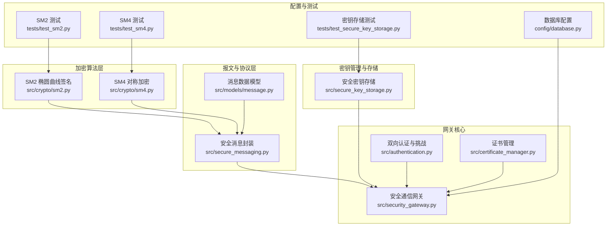
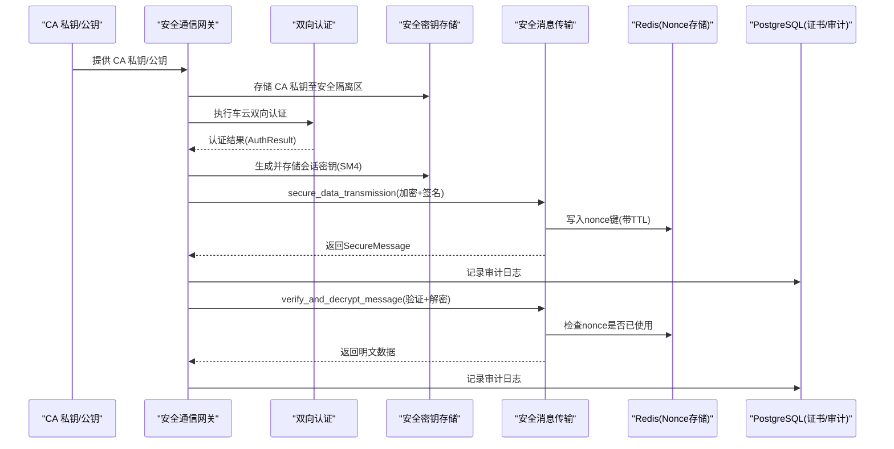
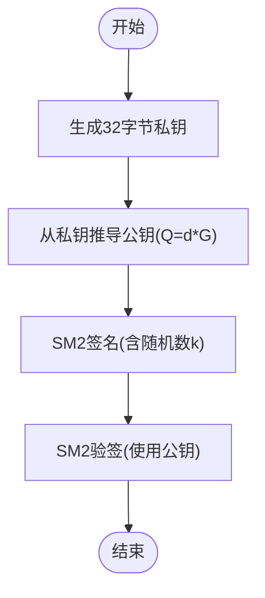
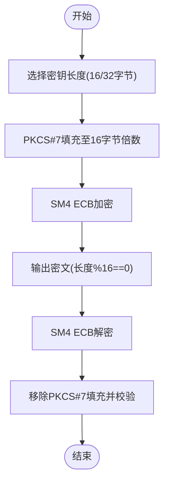
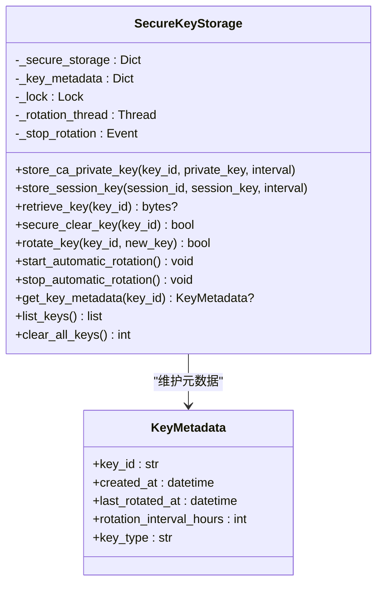
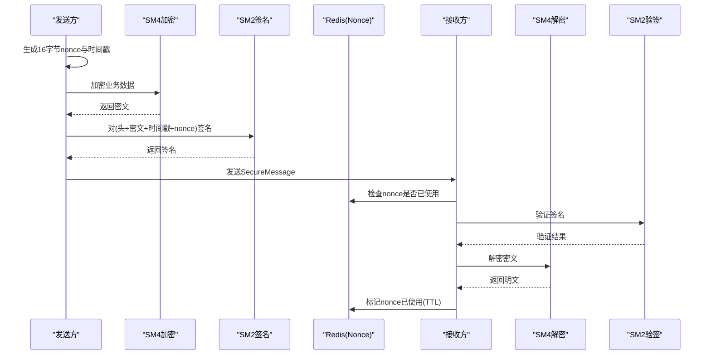
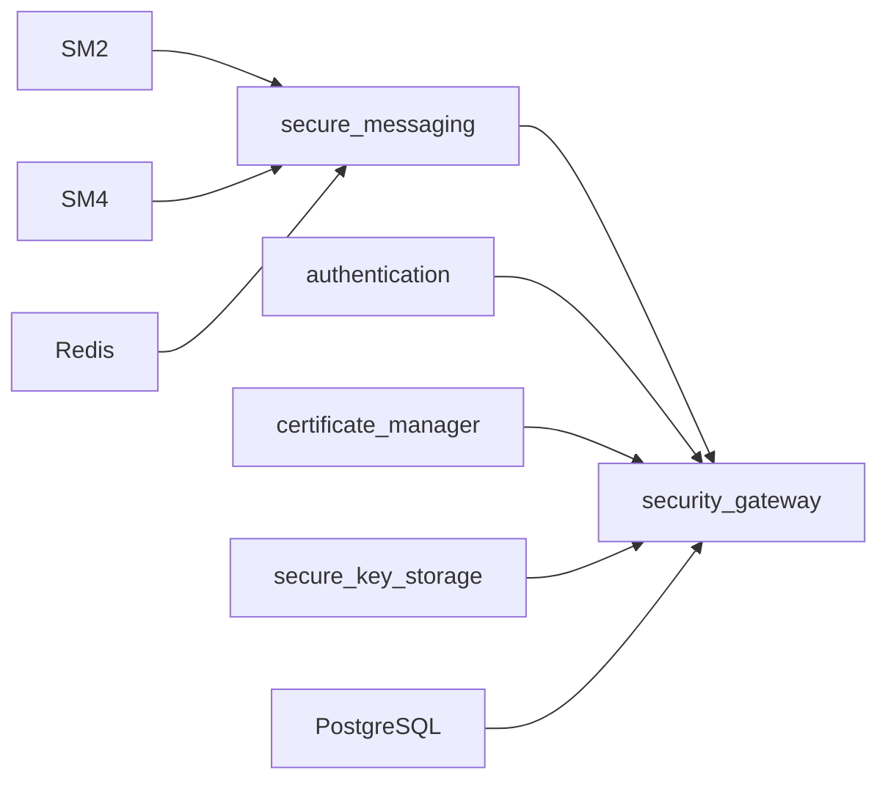

# 安全与加密

<cite>
**本文引用的文件**
- [sm2.py](file://src/crypto/sm2.py)
- [sm4.py](file://src/crypto/sm4.py)
- [secure_key_storage.py](file://src/secure_key_storage.py)
- [secure_messaging.py](file://src/secure_messaging.py)
- [security_gateway.py](file://src/security_gateway.py)
- [message.py](file://src/models/message.py)
- [enums.py](file://src/models/enums.py)
- [authentication.py](file://src/authentication.py)
- [certificate_manager.py](file://src/certificate_manager.py)
- [database.py](file://config/database.py)
- [test_sm2.py](file://tests/test_sm2.py)
- [test_sm4.py](file://tests/test_sm4.py)
- [test_secure_key_storage.py](file://tests/test_secure_key_storage.py)
</cite>

## 目录
1. [简介](#简介)
2. [项目结构](#项目结构)
3. [核心组件](#核心组件)
4. [架构总览](#架构总览)
5. [详细组件分析](#详细组件分析)
6. [依赖关系分析](#依赖关系分析)
7. [性能考量](#性能考量)
8. [故障排查指南](#故障排查指南)
9. [结论](#结论)
10. [附录](#附录)

## 简介
本文件面向车联网安全通信网关的加密安全系统，聚焦于国密算法 SM2/SM4 在系统中的应用与实现细节，涵盖：
- SM2 椭圆曲线公钥算法的密钥生成、数字签名与验签流程
- SM4 对称加密算法的数据加密与解密流程
- 安全密钥存储机制与密钥管理策略
- 安全消息格式与加密传输协议
- 防重放攻击机制与时间戳验证
- 安全威胁分析与防护措施
- 性能考虑与优化建议

## 项目结构
围绕加密与安全的关键模块如下：
- 加密算法层：SM2/SM4 实现
- 报文与协议层：安全消息封装、签名与验签、加密与解密
- 密钥管理与存储：安全密钥存储、密钥轮换、自动轮换线程
- 网关核心：证书管理、双向认证、会话管理、审计日志
- 数据模型与枚举：消息头、消息体、事件类型等
- 配置与测试：数据库配置、单元测试覆盖

图表来源
- [sm2.py:1-265](file://src/crypto/sm2.py#L1-L265)
- [sm4.py:1-189](file://src/crypto/sm4.py#L1-L189)
- [secure_messaging.py:1-249](file://src/secure_messaging.py#L1-L249)
- [message.py:1-200](file://src/models/message.py#L1-L200)
- [secure_key_storage.py:1-380](file://src/secure_key_storage.py#L1-L380)
- [security_gateway.py:1-800](file://src/security_gateway.py#L1-L800)
- [authentication.py:1-200](file://src/authentication.py#L1-L200)
- [certificate_manager.py:1-200](file://src/certificate_manager.py#L1-L200)
- [database.py:1-50](file://config/database.py#L1-L50)
- [test_sm2.py:1-258](file://tests/test_sm2.py#L1-L258)
- [test_sm4.py:1-260](file://tests/test_sm4.py#L1-L260)
- [test_secure_key_storage.py:1-313](file://tests/test_secure_key_storage.py#L1-L313)

章节来源
- [sm2.py:1-265](file://src/crypto/sm2.py#L1-L265)
- [sm4.py:1-189](file://src/crypto/sm4.py#L1-L189)
- [secure_messaging.py:1-249](file://src/secure_messaging.py#L1-L249)
- [message.py:1-200](file://src/models/message.py#L1-L200)
- [secure_key_storage.py:1-380](file://src/secure_key_storage.py#L1-L380)
- [security_gateway.py:1-800](file://src/security_gateway.py#L1-L800)
- [authentication.py:1-200](file://src/authentication.py#L1-L200)
- [certificate_manager.py:1-200](file://src/certificate_manager.py#L1-L200)
- [database.py:1-50](file://config/database.py#L1-L50)
- [test_sm2.py:1-258](file://tests/test_sm2.py#L1-L258)
- [test_sm4.py:1-260](file://tests/test_sm4.py#L1-L260)
- [test_secure_key_storage.py:1-313](file://tests/test_secure_key_storage.py#L1-L313)

## 核心组件
- SM2 数字签名与验签：提供密钥对生成、签名与验签能力，符合 GM/T 0003-2012 标准
- SM4 对称加密：提供密钥生成、ECB 模式下的加密与解密，支持 128/256 位密钥长度
- 安全密钥存储：模拟 HSM 的密钥存储与轮换，支持 CA 私钥与会话密钥的生命周期管理
- 安全消息传输：封装消息头、时间戳、随机 nonce、SM4 加密载荷与 SM2 签名
- 网关核心：集成证书管理、双向认证、会话管理、审计日志与密钥存储
- 数据模型与枚举：消息头、安全消息、事件类型等

章节来源
- [sm2.py:93-132](file://src/crypto/sm2.py#L93-L132)
- [sm4.py:11-46](file://src/crypto/sm4.py#L11-L46)
- [secure_key_storage.py:27-380](file://src/secure_key_storage.py#L27-L380)
- [secure_messaging.py:17-142](file://src/secure_messaging.py#L17-L142)
- [security_gateway.py:37-800](file://src/security_gateway.py#L37-L800)
- [message.py:9-200](file://src/models/message.py#L9-L200)
- [enums.py:1-56](file://src/models/enums.py#L1-L56)

## 架构总览
下图展示从密钥生成到消息传输与验证的整体流程，以及关键组件之间的交互关系。

图表来源
- [security_gateway.py:129-721](file://src/security_gateway.py#L129-L721)
- [authentication.py:196-200](file://src/authentication.py#L196-L200)
- [secure_key_storage.py:46-314](file://src/secure_key_storage.py#L46-L314)
- [secure_messaging.py:17-249](file://src/secure_messaging.py#L17-L249)
- [database.py:8-50](file://config/database.py#L8-L50)

## 详细组件分析

### SM2 椭圆曲线公钥算法
- 密钥生成：使用密码学安全随机数生成 32 字节私钥，并通过椭圆曲线点乘从私钥推导公钥（64 字节）
- 数字签名：基于 SM2 签名算法，使用随机数 k 生成 64 字节签名；签名长度固定为 r 和 s 各 32 字节
- 验签：使用发送方公钥验证签名，若数据被篡改或签名无效则返回 False

图表来源
- [sm2.py:93-132](file://src/crypto/sm2.py#L93-L132)
- [sm2.py:135-204](file://src/crypto/sm2.py#L135-L204)
- [sm2.py:206-265](file://src/crypto/sm2.py#L206-L265)

章节来源
- [sm2.py:11-90](file://src/crypto/sm2.py#L11-L90)
- [sm2.py:93-132](file://src/crypto/sm2.py#L93-L132)
- [sm2.py:135-204](file://src/crypto/sm2.py#L135-L204)
- [sm2.py:206-265](file://src/crypto/sm2.py#L206-L265)
- [test_sm2.py:10-45](file://tests/test_sm2.py#L10-L45)
- [test_sm2.py:47-96](file://tests/test_sm2.py#L47-L96)
- [test_sm2.py:110-187](file://tests/test_sm2.py#L110-L187)
- [test_sm2.py:189-258](file://tests/test_sm2.py#L189-L258)

### SM4 对称加密算法
- 密钥生成：支持 16 字节（128 位）与 32 字节（256 位）密钥长度；32 字节密钥仅使用前 16 字节参与加密
- 加密：ECB 模式，PKCS#7 填充至 16 字节倍数，输出长度为明文长度的最小 16 倍数
- 解密：去除 PKCS#7 填充，校验填充合法性，异常统一转换为 RuntimeError 以避免信息泄露

图表来源
- [sm4.py:11-46](file://src/crypto/sm4.py#L11-L46)
- [sm4.py:49-109](file://src/crypto/sm4.py#L49-L109)
- [sm4.py:111-189](file://src/crypto/sm4.py#L111-L189)

章节来源
- [sm4.py:11-46](file://src/crypto/sm4.py#L11-L46)
- [sm4.py:49-109](file://src/crypto/sm4.py#L49-L109)
- [sm4.py:111-189](file://src/crypto/sm4.py#L111-L189)
- [test_sm4.py:10-43](file://tests/test_sm4.py#L10-L43)
- [test_sm4.py:45-132](file://tests/test_sm4.py#L45-L132)
- [test_sm4.py:134-207](file://tests/test_sm4.py#L134-L207)
- [test_sm4.py:209-260](file://tests/test_sm4.py#L209-L260)

### 安全密钥存储与密钥管理策略
- 存储类型：CA 私钥与会话密钥分别存储；模拟 HSM 的安全隔离区
- 生命周期：支持密钥检索、安全清除、轮换；自动轮换线程按配置周期执行
- 安全性：密钥轮换过程中进行安全覆盖与旧密钥清除；密钥元数据记录创建与轮换时间
- 单例与线程：全局单例实例，自动轮换线程可启动/停止，线程安全通过锁保护

图表来源
- [secure_key_storage.py:27-380](file://src/secure_key_storage.py#L27-L380)

章节来源
- [secure_key_storage.py:27-380](file://src/secure_key_storage.py#L27-L380)
- [test_secure_key_storage.py:9-245](file://tests/test_secure_key_storage.py#L9-L245)

### 安全消息格式与加密传输协议
- 消息结构：包含消息头（版本、类型、发送方/接收方/会话标识）、加密载荷（SM4）、签名（SM2）、时间戳、随机 nonce
- 传输流程：生成随机 nonce 与时间戳，SM4 加密业务数据，构造待签名数据（头+载荷+时间戳+nonce），SM2 签名，返回安全消息
- 验证流程：验证消息头、nonce 长度、时间戳范围（默认±5 分钟），检查 Redis 中 nonce 是否已使用，SM2 验签，SM4 解密，标记 nonce 已使用

图表来源
- [secure_messaging.py:17-142](file://src/secure_messaging.py#L17-L142)
- [secure_messaging.py:144-249](file://src/secure_messaging.py#L144-L249)
- [message.py:79-200](file://src/models/message.py#L79-L200)

章节来源
- [secure_messaging.py:17-142](file://src/secure_messaging.py#L17-L142)
- [secure_messaging.py:144-249](file://src/secure_messaging.py#L144-L249)
- [message.py:79-200](file://src/models/message.py#L79-L200)
- [enums.py:49-56](file://src/models/enums.py#L49-L56)

### 防重放攻击机制与时间戳验证
- 随机 nonce：每条消息生成 16 字节随机 nonce，防止重放
- Redis 标记：nonce 写入 Redis 并设置 TTL（默认 600 秒），覆盖 ±5 分钟时间戳容差
- 时间戳校验：消息时间戳与当前时间差不超过容差（默认 300 秒）

章节来源
- [secure_messaging.py:101-103](file://src/secure_messaging.py#L101-L103)
- [secure_messaging.py:205-212](file://src/secure_messaging.py#L205-L212)
- [secure_messaging.py:238-241](file://src/secure_messaging.py#L238-L241)
- [message.py:131-142](file://src/models/message.py#L131-L142)

### 安全威胁分析与防护措施
- 重放攻击：通过 nonce 与 TTL 机制有效防护；Redis 中已使用标记阻止重复消费
- 伪造签名：SM2 验签失败即拒绝，确保消息完整性与来源可信
- 会话密钥泄露：密钥存储于安全隔离区，会话结束后安全清除；密钥轮换降低长期暴露风险
- 证书失效：证书验证包含有效期与撤销列表检查；CA 服务不可用时可使用缓存策略
- 信息泄露：解密异常统一转换为 RuntimeError，避免泄露密钥信息

章节来源
- [secure_messaging.py:210-211](file://src/secure_messaging.py#L210-L211)
- [secure_messaging.py:231-232](file://src/secure_messaging.py#L231-L232)
- [secure_key_storage.py:153-174](file://src/secure_key_storage.py#L153-L174)
- [certificate_manager.py:171-200](file://src/certificate_manager.py#L171-L200)

### 性能考量与优化建议
- SM2 签名/验签：椭圆曲线运算开销较大，建议批量处理与异步化；签名包含随机数 k，非确定性签名可提升安全性但需注意性能
- SM4 ECB：简单高效，适合大量小块数据；注意填充与对齐开销
- 自动轮换：后台线程按小时检查轮换，避免阻塞主线程；轮换过程进行安全覆盖
- Redis 交互：nonce TTL 与存在性检查为 O(1)，适合高并发场景
- 数据库：证书与审计日志写入采用批量/异步方式，减少阻塞

[本节为通用性能讨论，无需特定文件引用]

## 依赖关系分析
- 组件耦合：安全消息传输依赖 SM2/SM4 与 Redis；网关核心依赖认证、证书管理、密钥存储与数据库
- 外部依赖：gmssl 库用于 SM2/SM4 实现；Redis 用于 nonce 标记；PostgreSQL 用于证书与审计日志
- 潜在循环依赖：当前模块间通过接口与数据类传递，未见循环导入

图表来源
- [secure_messaging.py:9-14](file://src/secure_messaging.py#L9-L14)
- [security_gateway.py:8-34](file://src/security_gateway.py#L8-L34)
- [database.py:8-50](file://config/database.py#L8-L50)

章节来源
- [secure_messaging.py:1-249](file://src/secure_messaging.py#L1-L249)
- [security_gateway.py:1-800](file://src/security_gateway.py#L1-L800)
- [database.py:1-50](file://config/database.py#L1-L50)

## 故障排查指南
- SM2 签名/验签失败
  - 检查私钥/公钥长度是否为 32/64 字节
  - 确认签名数据与公钥匹配，避免篡改
- SM4 加密/解密异常
  - 确认密钥长度为 16 或 32 字节；32 字节密钥仅使用前 16 字节
  - 检查密文长度是否为 16 的倍数；确认填充正确
- 密钥存储问题
  - 确认密钥类型与长度约束；检查自动轮换线程状态
  - 清理密钥后确认元数据同步删除
- 防重放与时间戳
  - 检查 Redis 中 nonce 是否已存在；核对时间戳是否超出容差
- 审计与日志
  - 认证失败、签名失败、重放攻击等事件均记录审计日志，便于追踪

章节来源
- [test_sm2.py:60-78](file://tests/test_sm2.py#L60-L78)
- [test_sm4.py:87-91](file://tests/test_sm4.py#L87-L91)
- [test_secure_key_storage.py:45-49](file://tests/test_secure_key_storage.py#L45-L49)
- [secure_messaging.py:205-211](file://src/secure_messaging.py#L205-L211)
- [message.py:131-142](file://src/models/message.py#L131-L142)

## 结论
该系统以 SM2/SM4 为核心，结合安全密钥存储、防重放机制与严格的审计日志，构建了面向车联网的端到端安全通信方案。通过自动密钥轮换与 HSM 模拟存储，显著降低了密钥泄露风险；通过 Redis 标记 nonce 与时间戳容差，有效抵御重放攻击。测试覆盖全面，验证了算法正确性与关键流程的鲁棒性。

[本节为总结性内容，无需特定文件引用]

## 附录
- 验证需求映射：各模块注释中标注了对应的验证需求编号，便于合规性审计
- 单元测试：覆盖密钥生成、加解密、签名验签、密钥存储与轮换等关键路径

[本节为补充说明，无需特定文件引用]