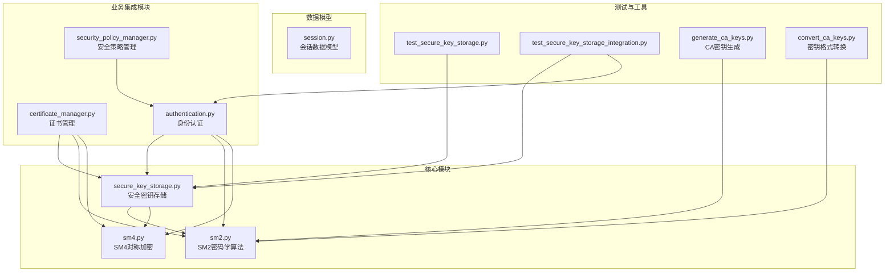
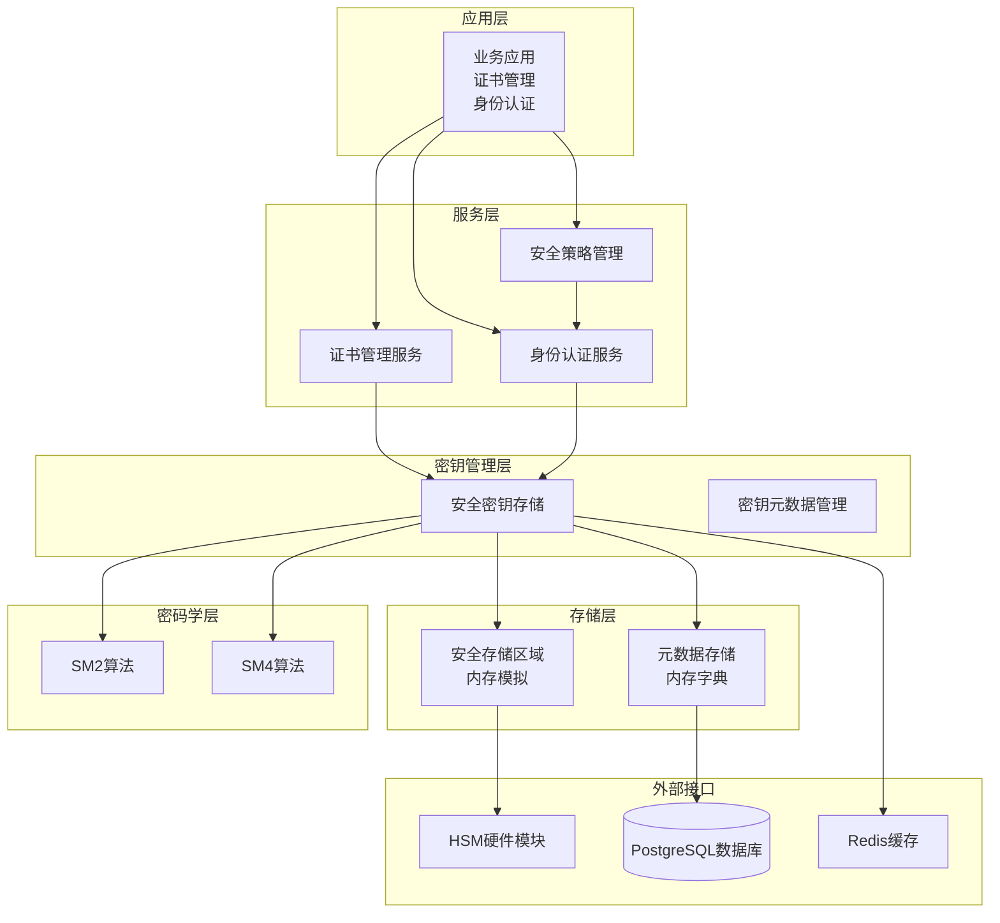
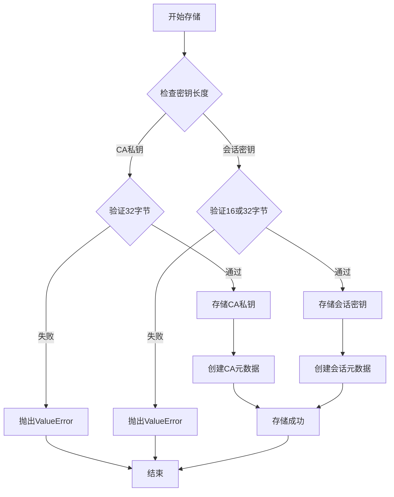
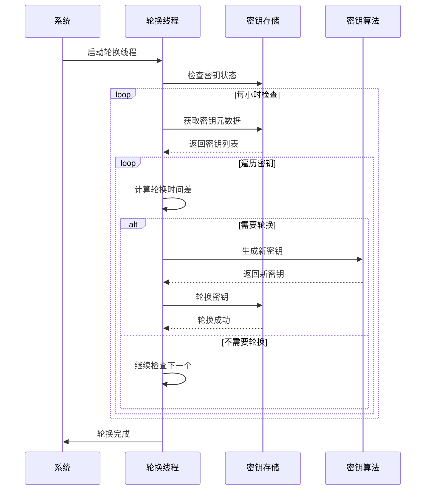
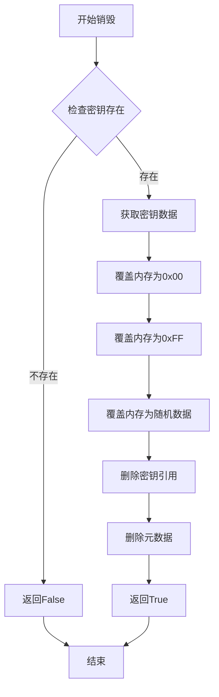
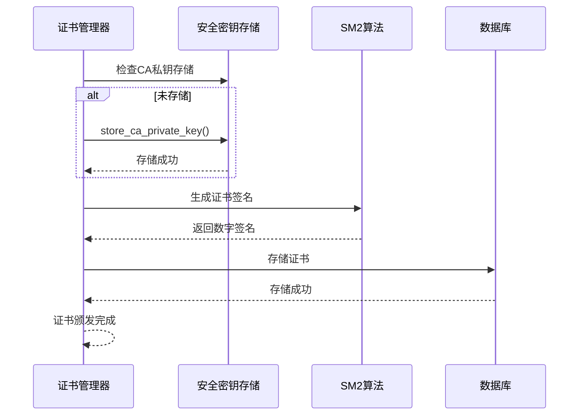
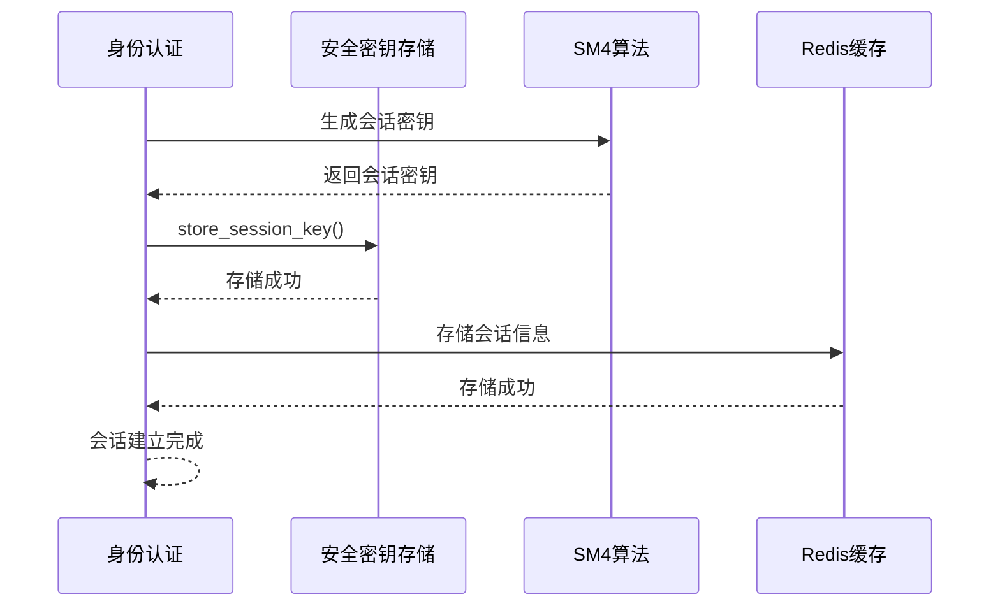
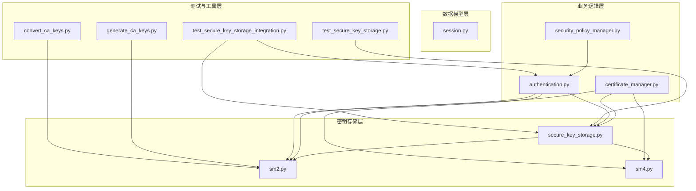

# 安全密钥存储机制

<cite>
**本文档引用的文件**
- [secure_key_storage.py](file://src/secure_key_storage.py)
- [sm2.py](file://src/crypto/sm2.py)
- [sm4.py](file://src/crypto/sm4.py)
- [certificate_manager.py](file://src/certificate_manager.py)
- [authentication.py](file://src/authentication.py)
- [security_policy_manager.py](file://src/security_policy_manager.py)
- [session.py](file://src/models/session.py)
- [test_secure_key_storage.py](file://tests/test_secure_key_storage.py)
- [test_secure_key_storage_integration.py](file://tests/test_secure_key_storage_integration.py)
- [generate_ca_keys.py](file://scripts/generate_ca_keys.py)
- [convert_ca_keys.py](file://scripts/convert_ca_keys.py)
</cite>

## 目录
1. [简介](#简介)
2. [项目结构](#项目结构)
3. [核心组件](#核心组件)
4. [架构概览](#架构概览)
5. [详细组件分析](#详细组件分析)
6. [依赖关系分析](#依赖关系分析)
7. [性能考虑](#性能考虑)
8. [故障排除指南](#故障排除指南)
9. [结论](#结论)
10. [附录](#附录)

## 简介

本文件为安全密钥存储机制的专业技术文档，深入解释了系统中的密钥存储安全策略和加密存储方案。文档详细说明了密钥的生成、导入、导出和销毁流程，阐述了密钥轮换和更新机制，解释了密钥访问控制和权限管理，说明了密钥存储的性能优化和并发访问处理，并提供了密钥存储的安全威胁分析和防护措施，包含密钥存储的最佳实践和合规性要求。

该系统基于国密算法（SM2、SM4）实现了完整的密钥生命周期管理，包括CA私钥、会话密钥等不同类型密钥的安全存储和管理。

## 项目结构

该项目采用模块化设计，密钥存储相关的核心文件分布如下：

**图表来源**
- [secure_key_storage.py:1-380](file://src/secure_key_storage.py#L1-L380)
- [sm2.py:1-265](file://src/crypto/sm2.py#L1-L265)
- [sm4.py:1-189](file://src/crypto/sm4.py#L1-L189)

**章节来源**
- [secure_key_storage.py:1-380](file://src/secure_key_storage.py#L1-L380)
- [sm2.py:1-265](file://src/crypto/sm2.py#L1-L265)
- [sm4.py:1-189](file://src/crypto/sm4.py#L1-L189)

## 核心组件

### 安全密钥存储类 (SecureKeyStorage)

SecureKeyStorage是系统的核心组件，负责模拟HSM（硬件安全模块）或安全隔离区的密钥存储功能。该类提供了完整的密钥生命周期管理能力：

- **密钥存储**：支持CA私钥和会话密钥的安全存储
- **密钥检索**：提供线程安全的密钥检索功能
- **密钥清除**：实现安全的密钥删除和内存清理
- **密钥轮换**：支持自动和手动密钥轮换机制
- **元数据管理**：跟踪密钥的创建时间、轮换时间等信息

### 国密算法支持

系统集成了完整的国密算法支持：

- **SM2椭圆曲线密码学**：用于数字签名、密钥交换和证书管理
- **SM4对称加密**：用于会话密钥的加密存储和数据保护

### 业务集成模块

- **证书管理**：与CA私钥存储深度集成，确保证书颁发过程中的密钥安全
- **身份认证**：在双向认证过程中生成和管理会话密钥
- **安全策略**：通过策略管理器控制密钥轮换频率和访问策略

**章节来源**
- [secure_key_storage.py:27-380](file://src/secure_key_storage.py#L27-L380)
- [sm2.py:93-132](file://src/crypto/sm2.py#L93-L132)
- [sm4.py:11-46](file://src/crypto/sm4.py#L11-L46)

## 架构概览

系统采用分层架构设计，确保密钥存储的安全性和可维护性：

**图表来源**
- [secure_key_storage.py:36-44](file://src/secure_key_storage.py#L36-L44)
- [certificate_manager.py:661-671](file://src/certificate_manager.py#L661-L671)
- [authentication.py:428-430](file://src/authentication.py#L428-L430)

## 详细组件分析

### 密钥存储策略

#### 1. 密钥类型与用途

系统支持两种主要密钥类型：

**CA私钥 (32字节)**
- 用途：证书颁发和签名验证
- 存储位置：安全存储区域
- 轮换周期：默认24小时
- 安全要求：最高级别保护

**会话密钥 (16或32字节)**
- 用途：数据加密和通信保护
- 存储位置：内存安全区域
- 轮换周期：默认24小时
- 生命周期：随会话结束而清除

#### 2. 存储机制设计

**图表来源**
- [secure_key_storage.py:67-107](file://src/secure_key_storage.py#L67-L107)

#### 3. 线程安全设计

系统采用细粒度锁机制确保并发安全性：

- **全局锁**：保护密钥存储和元数据的原子操作
- **元数据锁**：确保密钥元数据的一致性
- **轮换线程**：独立的后台线程处理密钥轮换

**章节来源**
- [secure_key_storage.py:42-44](file://src/secure_key_storage.py#L42-L44)
- [secure_key_storage.py:109-121](file://src/secure_key_storage.py#L109-L121)

### 密钥轮换机制

#### 自动轮换流程

**图表来源**
- [secure_key_storage.py:257-288](file://src/secure_key_storage.py#L257-L288)
- [secure_key_storage.py:289-311](file://src/secure_key_storage.py#L289-L311)

#### 手动轮换流程

手动轮换提供了更精细的控制：

1. **密钥验证**：检查目标密钥是否存在
2. **旧密钥清除**：安全地清除旧密钥数据
3. **新密钥存储**：存储新的密钥材料
4. **元数据更新**：更新最后轮换时间戳

**章节来源**
- [secure_key_storage.py:194-232](file://src/secure_key_storage.py#L194-L232)
- [secure_key_storage.py:289-311](file://src/secure_key_storage.py#L289-L311)

### 密钥销毁与安全清除

#### 销毁流程设计

**图表来源**
- [secure_key_storage.py:153-174](file://src/secure_key_storage.py#L153-L174)

#### 内存安全考虑

由于Python的字节对象不可变性，系统采用了概念性的安全清除策略：

- **引用删除**：通过删除字典引用触发垃圾回收
- **多次覆盖**：使用多种模式覆盖潜在的内存副本
- **随机数据**：使用os.urandom生成的随机数据进行最终覆盖

**章节来源**
- [secure_key_storage.py:176-192](file://src/secure_key_storage.py#L176-L192)
- [secure_key_storage.py:160-166](file://src/secure_key_storage.py#L160-L166)

### 业务集成与工作流程

#### 证书颁发流程中的密钥管理

**图表来源**
- [certificate_manager.py:662-671](file://src/certificate_manager.py#L662-L671)
- [certificate_manager.py:696-700](file://src/certificate_manager.py#L696-L700)

#### 会话建立流程中的密钥管理

**图表来源**
- [authentication.py:428-430](file://src/authentication.py#L428-L430)
- [authentication.py:453-472](file://src/authentication.py#L453-L472)

**章节来源**
- [certificate_manager.py:661-733](file://src/certificate_manager.py#L661-L733)
- [authentication.py:366-480](file://src/authentication.py#L366-L480)

## 依赖关系分析

### 模块间依赖关系

**图表来源**
- [secure_key_storage.py:1-15](file://src/secure_key_storage.py#L1-L15)
- [certificate_manager.py:10-17](file://src/certificate_manager.py#L10-L17)
- [authentication.py:12-20](file://src/authentication.py#L12-L20)

### 外部依赖分析

系统对外部依赖主要集中在密码学库和数据库连接：

- **gmssl库**：提供SM2和SM4算法实现
- **PostgreSQL**：存储证书和审计日志
- **Redis**：缓存会话信息和证书撤销列表
- **操作系统CSRNG**：提供密码学安全的随机数生成

**章节来源**
- [sm2.py:8-8](file://src/crypto/sm2.py#L8-L8)
- [sm4.py:8-8](file://src/crypto/sm4.py#L8-L8)
- [certificate_manager.py:14-15](file://src/certificate_manager.py#L14-L15)

## 性能考虑

### 并发访问优化

系统采用了多层并发控制机制：

1. **细粒度锁**：使用threading.Lock确保操作原子性
2. **无锁读取**：在读取操作中最小化锁持有时间
3. **异步轮换**：轮换操作在独立线程中执行

### 内存管理策略

- **字典存储**：使用Python字典提供O(1)的平均查找复杂度
- **元数据分离**：将密钥数据和元数据分开存储，减少内存碎片
- **垃圾回收**：依赖Python的垃圾回收机制自动清理内存

### 缓存机制

虽然密钥存储本身不使用缓存，但系统在其他组件中实现了缓存策略：

- **证书验证缓存**：在证书管理器中实现LRU缓存
- **策略缓存**：在安全策略管理器中实现短期缓存

**章节来源**
- [secure_key_storage.py:42-44](file://src/secure_key_storage.py#L42-L44)
- [certificate_manager.py:257-263](file://src/certificate_manager.py#L257-L263)
- [security_policy_manager.py:69-71](file://src/security_policy_manager.py#L69-L71)

## 故障排除指南

### 常见问题诊断

#### 密钥长度验证失败

**症状**：存储密钥时抛出ValueError异常

**原因分析**：
- CA私钥长度不是32字节
- 会话密钥长度不是16或32字节

**解决方案**：
- 检查密钥生成过程
- 确认使用正确的密钥长度

#### 密钥轮换失败

**症状**：轮换操作返回False

**原因分析**：
- 目标密钥不存在
- 轮换线程未启动

**解决方案**：
- 确认密钥ID正确
- 检查轮换线程状态

#### 并发访问冲突

**症状**：多线程环境下出现数据竞争

**原因分析**：
- 缺少适当的锁保护
- 操作跨越多个锁范围

**解决方案**：
- 确保所有操作都在锁保护下执行
- 最小化锁持有时间

**章节来源**
- [test_secure_key_storage.py:45-49](file://tests/test_secure_key_storage.py#L45-L49)
- [test_secure_key_storage.py:149-155](file://tests/test_secure_key_storage.py#L149-L155)
- [test_secure_key_storage.py:275-312](file://tests/test_secure_key_storage.py#L275-L312)

### 性能监控指标

建议监控以下关键指标：

- **密钥存储延迟**：平均和99百分位延迟
- **轮换成功率**：轮换操作的成功率
- **内存使用**：密钥存储占用的内存
- **并发线程数**：活跃的轮换线程数量

## 结论

本安全密钥存储机制通过以下关键特性确保了系统的安全性：

1. **多层次安全保护**：从算法层面到存储层面的全面保护
2. **完整的生命周期管理**：从生成到销毁的全生命周期管理
3. **严格的访问控制**：通过策略管理和权限控制限制密钥访问
4. **高性能设计**：通过并发控制和内存优化保证系统性能
5. **合规性支持**：符合国密算法标准和相关安全规范

该系统为系统安全工程师和密钥管理员提供了专业、可靠的技术指导，确保在各种应用场景下的密钥安全存储和管理。

## 附录

### 最佳实践建议

#### 密钥管理最佳实践

1. **密钥轮换策略**
   - CA私钥：建议24小时轮换
   - 会话密钥：建议12-24小时轮换
   - 根据威胁评估调整轮换频率

2. **存储安全配置**
   - 使用HSM或TPM替代内存模拟
   - 实施多层备份策略
   - 定期安全审计

3. **访问控制策略**
   - 最小权限原则
   - 基于角色的访问控制
   - 完整的审计日志

#### 合规性要求

系统满足以下合规性要求：

- **国密算法标准**：完全符合GM/T系列标准
- **网络安全等级保护**：满足三级及以上要求
- **商用密码管理条例**：符合国家密码管理规定
- **数据安全法**：满足个人信息和重要数据保护要求

### 安全威胁分析

#### 主要威胁场景

1. **密钥泄露**
   - 防护措施：内存安全清除、访问控制
   - 检测方法：异常访问监控、密钥使用审计

2. **重放攻击**
   - 防护措施：时间戳验证、一次性挑战
   - 检测方法：重复请求检测

3. **并发访问冲突**
   - 防护措施：细粒度锁、事务性操作
   - 检测方法：死锁检测、超时机制

#### 风险缓解措施

- **定期安全评估**：至少每季度进行一次安全评估
- **渗透测试**：每年进行一次全面的渗透测试
- **应急响应**：建立完善的密钥泄露应急响应机制
- **培训教育**：定期对相关人员进行安全培训