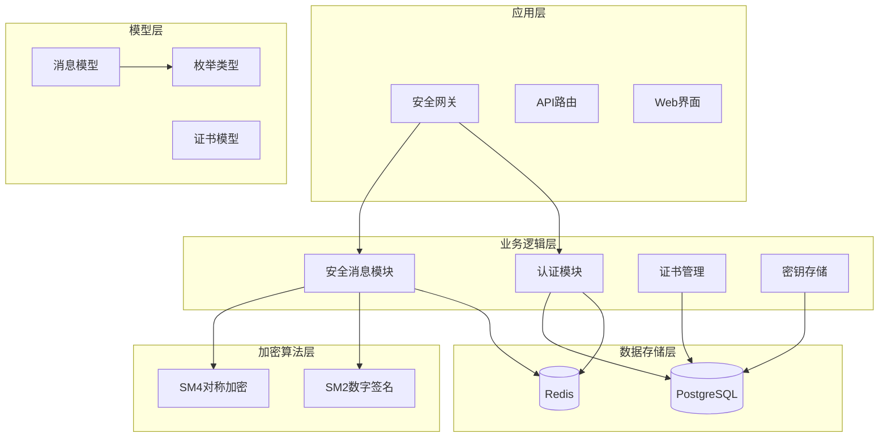
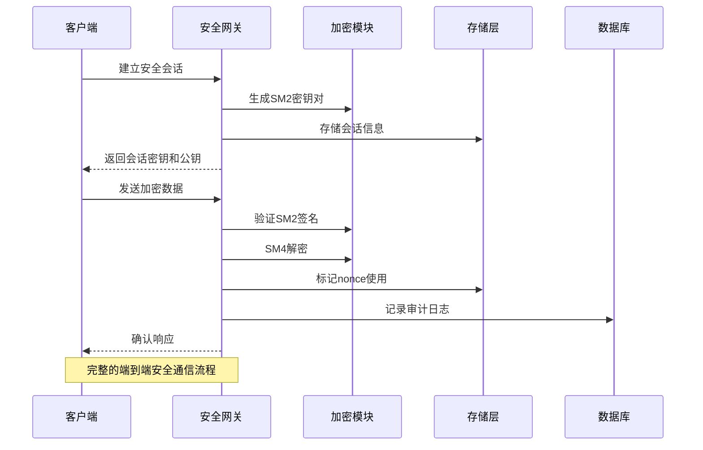
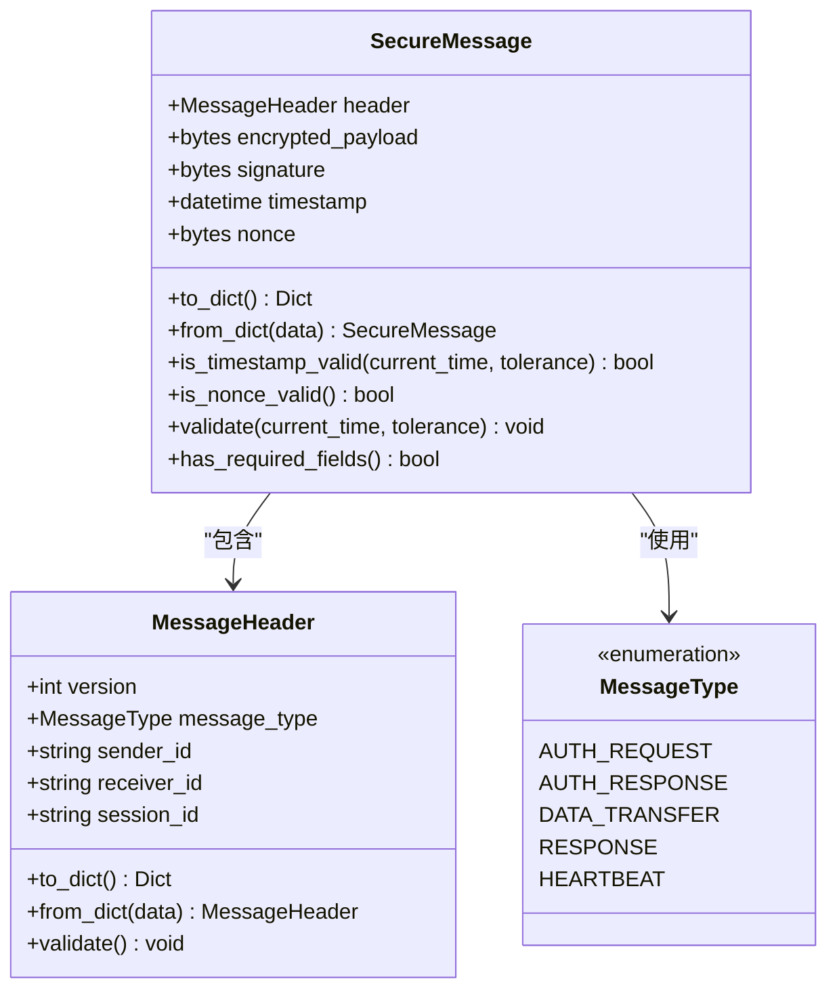
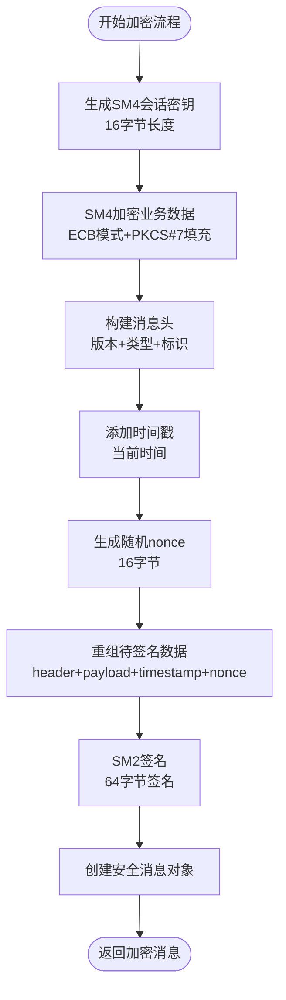
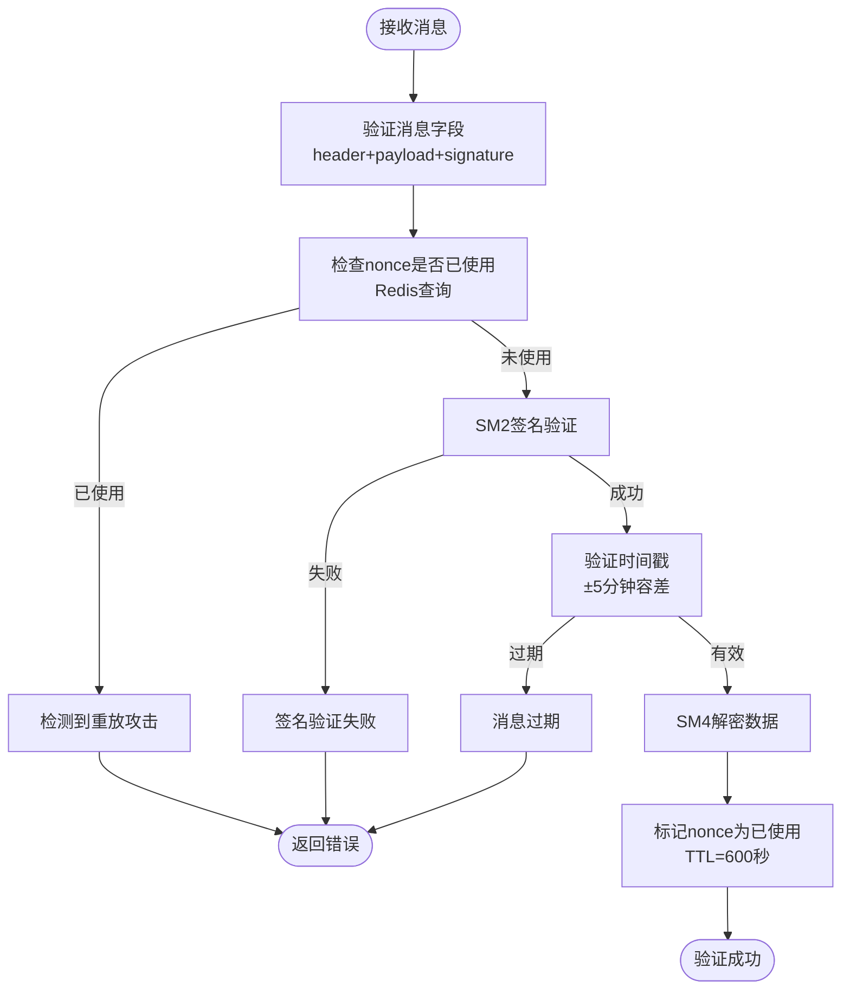
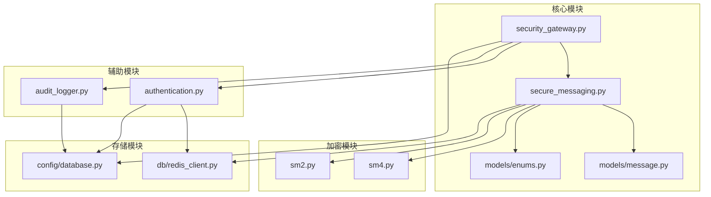

# 安全消息传输系统

<cite>
**本文档引用的文件**
- [secure_messaging.py](file://src/secure_messaging.py)
- [message.py](file://src/models/message.py)
- [security_gateway.py](file://src/security_gateway.py)
- [sm2.py](file://src/crypto/sm2.py)
- [sm4.py](file://src/crypto/sm4.py)
- [enums.py](file://src/models/enums.py)
- [redis_client.py](file://src/db/redis_client.py)
- [audit_logger.py](file://src/audit_logger.py)
- [database.py](file://config/database.py)
- [authentication.py](file://src/authentication.py)
- [security_gateway_demo.py](file://examples/security_gateway_demo.py)
- [ENCRYPTED_TRANSMISSION_GUIDE.md](file://ENCRYPTED_TRANSMISSION_GUIDE.md)
- [test_secure_messaging.py](file://tests/test_secure_messaging.py)
</cite>

## 目录
1. [简介](#简介)
2. [项目结构](#项目结构)
3. [核心组件](#核心组件)
4. [架构概览](#架构概览)
5. [详细组件分析](#详细组件分析)
6. [依赖关系分析](#依赖关系分析)
7. [性能考虑](#性能考虑)
8. [故障排除指南](#故障排除指南)
9. [结论](#结论)
10. [附录](#附录)

## 简介

安全消息传输系统是一个基于中国国家密码标准的车联网安全通信解决方案。该系统实现了端到端加密的数据传输，采用SM4对称加密和SM2数字签名算法，提供了完整的安全消息格式设计、加密签名机制、防重放攻击策略和会话管理功能。

系统主要面向网络通信工程师和系统集成商，提供详细的技术参考和实施指导。通过标准化的消息格式和严格的验证流程，确保车联网环境中的数据传输安全可靠。

## 项目结构

该项目采用模块化设计，按照功能层次组织代码结构：

**图表来源**
- [security_gateway.py:37-800](file://src/security_gateway.py#L37-L800)
- [secure_messaging.py:1-249](file://src/secure_messaging.py#L1-L249)
- [authentication.py:1-662](file://src/authentication.py#L1-L662)

**章节来源**
- [security_gateway.py:1-800](file://src/security_gateway.py#L1-L800)
- [secure_messaging.py:1-249](file://src/secure_messaging.py#L1-L249)
- [authentication.py:1-662](file://src/authentication.py#L1-L662)

## 核心组件

### 安全消息传输模块

安全消息传输模块是系统的核心组件，负责实现完整的端到端加密通信流程。该模块提供了两个主要功能：

1. **安全数据传输**：将明文数据加密并签名，生成安全消息对象
2. **验证与解密**：验证消息的完整性和真实性，解密并返回明文数据

### 加密算法实现

系统采用双层加密策略：
- **SM4对称加密**：用于业务数据的加密和解密
- **SM2数字签名**：用于数据完整性和来源验证

### 会话管理

系统实现了完整的会话生命周期管理，包括会话建立、维护、清理等功能，确保通信的连续性和安全性。

**章节来源**
- [secure_messaging.py:17-142](file://src/secure_messaging.py#L17-L142)
- [sm4.py:49-108](file://src/crypto/sm4.py#L49-L108)
- [sm2.py:135-203](file://src/crypto/sm2.py#L135-L203)

## 架构概览

系统采用分层架构设计，各层职责明确，耦合度低：

**图表来源**
- [security_gateway.py:543-646](file://src/security_gateway.py#L543-L646)
- [secure_messaging.py:144-248](file://src/secure_messaging.py#L144-L248)

**章节来源**
- [security_gateway.py:1-800](file://src/security_gateway.py#L1-L800)
- [ENCRYPTED_TRANSMISSION_GUIDE.md:1-264](file://ENCRYPTED_TRANSMISSION_GUIDE.md#L1-L264)

## 详细组件分析

### 安全消息格式设计

系统定义了标准化的安全消息格式，确保消息的完整性和可验证性：

#### 消息头结构

消息头包含通信双方的身份信息和会话标识：
- `version`: 消息版本号
- `message_type`: 消息类型枚举
- `sender_id`: 发送方标识
- `receiver_id`: 接收方标识
- `session_id`: 会话标识

#### 安全载荷结构

安全载荷包含加密后的业务数据和验证信息：
- `encrypted_payload`: SM4加密后的数据
- `signature`: SM2数字签名
- `timestamp`: 消息时间戳
- `nonce`: 随机数（16字节）

**图表来源**
- [message.py:9-200](file://src/models/message.py#L9-L200)
- [enums.py:49-56](file://src/models/enums.py#L49-L56)

**章节来源**
- [message.py:1-200](file://src/models/message.py#L1-L200)
- [enums.py:1-56](file://src/models/enums.py#L1-L56)

### 加密与签名实现

#### SM4对称加密

SM4算法提供高性能的对称加密能力：
- 支持128位和256位密钥长度
- 使用ECB模式进行数据加密
- 实现PKCS#7填充机制
- 支持安全的密钥生成

#### SM2数字签名

SM2算法确保数据的完整性和不可否认性：
- 256位安全强度的椭圆曲线算法
- 64字节的数字签名长度
- 支持密钥对的自动生成
- 实现完整的签名验证流程

**图表来源**
- [secure_messaging.py:17-142](file://src/secure_messaging.py#L17-L142)
- [sm4.py:49-108](file://src/crypto/sm4.py#L49-L108)
- [sm2.py:135-203](file://src/crypto/sm2.py#L135-L203)

**章节来源**
- [sm4.py:1-189](file://src/crypto/sm4.py#L1-L189)
- [sm2.py:1-265](file://src/crypto/sm2.py#L1-L265)
- [secure_messaging.py:17-142](file://src/secure_messaging.py#L17-L142)

### 防重放攻击机制

系统实现了多层防重放攻击机制：

#### Nonce机制

每个消息包含16字节的随机数nonce，确保消息的唯一性：
- 由操作系统安全随机数生成器生成
- 在Redis中标记为已使用状态
- 设置600秒的TTL（10分钟）过期时间

#### 时间戳验证

消息包含精确的时间戳，防止重放攻击：
- 默认时间容差为±300秒（5分钟）
- 网关侧验证消息时间戳的有效性
- 支持自定义时间容差参数

**图表来源**
- [secure_messaging.py:144-248](file://src/secure_messaging.py#L144-L248)
- [redis_client.py:46-49](file://src/db/redis_client.py#L46-L49)

**章节来源**
- [secure_messaging.py:144-248](file://src/secure_messaging.py#L144-L248)
- [redis_client.py:1-79](file://src/db/redis_client.py#L1-L79)

### 会话管理

系统实现了完整的会话生命周期管理：

#### 会话建立

会话建立过程包括：
- 生成唯一的会话ID（32字节十六进制字符串）
- 生成SM4会话密钥（16字节）
- 设置会话过期时间（默认24小时）
- 存储会话信息到Redis

#### 会话维护

会话维护功能：
- 自动清理过期会话
- 会话冲突检测和处理
- 会话状态监控
- 会话密钥的安全存储

#### 会话清理

会话清理策略：
- Redis的TTL机制自动清理过期键
- 主动扫描和清理功能
- 支持批量会话管理
- 审计日志记录

**章节来源**
- [authentication.py:366-481](file://src/authentication.py#L366-L481)
- [authentication.py:554-596](file://src/authentication.py#L554-L596)

### 审计日志系统

系统实现了全面的审计日志功能：

#### 日志类型

支持多种审计事件类型：
- 认证事件：成功/失败记录
- 数据传输事件：加密/解密记录
- 证书操作事件：颁发/撤销记录
- 签名验证事件：验证结果记录

#### 日志存储

审计日志存储策略：
- PostgreSQL持久化存储
- UUID唯一标识符生成
- 详细信息长度限制（1024字符）
- 支持日志查询和导出

#### 日志查询

日志查询功能：
- 按时间范围过滤
- 按车辆标识过滤
- 按事件类型过滤
- 按操作结果过滤
- 支持JSON和CSV格式导出

**章节来源**
- [audit_logger.py:1-480](file://src/audit_logger.py#L1-L480)

## 依赖关系分析

系统采用模块化设计，各组件之间的依赖关系清晰：

**图表来源**
- [secure_messaging.py:1-249](file://src/secure_messaging.py#L1-L249)
- [security_gateway.py:1-800](file://src/security_gateway.py#L1-L800)
- [authentication.py:1-662](file://src/authentication.py#L1-L662)

**章节来源**
- [secure_messaging.py:1-249](file://src/secure_messaging.py#L1-L249)
- [security_gateway.py:1-800](file://src/security_gateway.py#L1-L800)
- [authentication.py:1-662](file://src/authentication.py#L1-L662)

## 性能考虑

### 加密性能

系统在保证安全性的前提下，优化了加密性能：

#### 加密开销

- **SM4加密**：每条消息约5-10毫秒
- **SM2签名**：每条消息约10-15毫秒
- **总延迟增加**：约15-25毫秒
- **CPU使用率**：约5-10%增加

#### 内存使用

- 每条消息额外占用约1KB内存
- Redis中nonce存储约100字节/条
- 会话信息存储约500字节/会话

### 缓存策略

系统采用了多级缓存策略：
- Redis缓存nonce状态
- 会话信息缓存
- 证书状态缓存
- 审计日志批量写入

### 并发处理

系统支持高并发场景：
- Redis连接池管理
- 异步消息处理
- 会话并发控制
- 资源池化管理

## 故障排除指南

### 常见问题及解决方案

#### 签名验证失败

**症状**：消息接收端返回"签名验证失败"错误

**可能原因**：
- 发送方公钥不匹配
- 签名数据顺序不一致
- 密钥材料损坏

**解决方案**：
1. 验证发送方公钥的正确性
2. 检查签名数据的拼接顺序
3. 重新生成密钥对并更新公钥

#### 重放攻击检测

**症状**：系统检测到"Nonce已使用"错误

**可能原因**：
- 客户端重复发送相同消息
- Redis中nonce状态异常
- 系统时间不同步

**解决方案**：
1. 确保每次发送使用新的nonce
2. 检查Redis连接和状态
3. 同步系统时间

#### 解密失败

**症状**：消息解密过程中出现异常

**可能原因**：
- 会话密钥不匹配
- 数据传输过程中损坏
- 密钥轮换导致的不兼容

**解决方案**：
1. 重新建立会话获取新密钥
2. 检查网络传输的完整性
3. 确认密钥轮换策略

#### 会话过期

**症状**：会话建立后很快失效

**可能原因**：
- 会话超时时间设置过短
- 系统时间不同步
- 会话清理机制触发

**解决方案**：
1. 调整会话超时配置
2. 同步系统时间
3. 检查会话清理策略

### 监控和诊断

#### 关键指标监控

建议监控以下关键指标：
- 消息处理吞吐量
- 加密/解密成功率
- 签名验证失败率
- Nonce使用异常率
- 会话建立成功率

#### 日志分析

通过审计日志分析系统运行状况：
- 认证失败事件统计
- 签名验证异常模式
- 性能瓶颈识别
- 安全事件追踪

**章节来源**
- [ENCRYPTED_TRANSMISSION_GUIDE.md:192-264](file://ENCRYPTED_TRANSMISSION_GUIDE.md#L192-L264)
- [audit_logger.py:243-336](file://src/audit_logger.py#L243-L336)

## 结论

安全消息传输系统通过采用中国国家密码标准，为车联网环境提供了完整的端到端安全通信解决方案。系统的主要优势包括：

### 技术优势

1. **强安全保障**：基于SM4和SM2算法，提供256位安全强度
2. **完整验证**：实现数据完整性、真实性、机密性保护
3. **防重放机制**：多层防重放攻击策略
4. **会话管理**：完善的会话生命周期管理
5. **审计功能**：全面的审计日志记录

### 实施优势

1. **模块化设计**：清晰的组件分离，便于维护和扩展
2. **性能优化**：合理的加密策略和缓存机制
3. **故障处理**：完善的错误处理和恢复机制
4. **监控诊断**：全面的监控和日志分析功能

### 应用价值

该系统为网络通信工程师和系统集成商提供了：
- 标准化的安全消息格式
- 完整的加密签名实现
- 详细的部署和运维指导
- 全面的故障排除方案

通过遵循本文档的技术规范和最佳实践，可以确保系统的安全性和可靠性，为车联网应用提供坚实的技术基础。

## 附录

### API规范

#### 消息格式规范

安全消息采用JSON格式传输，包含以下字段：

| 字段名 | 类型 | 必填 | 描述 |
|--------|------|------|------|
| header | object | 是 | 消息头信息 |
| encrypted_payload | string | 是 | SM4加密后的数据（十六进制） |
| signature | string | 是 | SM2数字签名（十六进制） |
| timestamp | string | 是 | ISO8601格式时间戳 |
| nonce | string | 是 | 16字节随机数（十六进制） |

#### 消息头字段

| 字段名 | 类型 | 必填 | 描述 |
|--------|------|------|------|
| version | integer | 是 | 消息版本号 |
| message_type | string | 是 | 消息类型枚举 |
| sender_id | string | 是 | 发送方标识 |
| receiver_id | string | 是 | 接收方标识 |
| session_id | string | 是 | 会话标识 |

### 部署指南

#### 环境要求

- Python 3.8+
- PostgreSQL 12+
- Redis 6.0+
- OpenSSL 1.1+

#### 配置参数

| 参数名 | 类型 | 默认值 | 描述 |
|--------|------|--------|------|
| POSTGRES_HOST | string | localhost | PostgreSQL主机地址 |
| POSTGRES_PORT | integer | 5432 | PostgreSQL端口号 |
| REDIS_HOST | string | localhost | Redis主机地址 |
| REDIS_PORT | integer | 6379 | Redis端口号 |
| SESSION_TIMEOUT | integer | 86400 | 会话超时时间（秒） |

### 测试验证

系统提供了完整的测试套件，包括：
- 单元测试：覆盖核心功能的单元测试
- 集成测试：验证组件间的协作
- 性能测试：评估系统性能指标
- 安全测试：验证安全机制的有效性

**章节来源**
- [ENCRYPTED_TRANSMISSION_GUIDE.md:62-119](file://ENCRYPTED_TRANSMISSION_GUIDE.md#L62-L119)
- [test_secure_messaging.py:1-183](file://tests/test_secure_messaging.py#L1-L183)