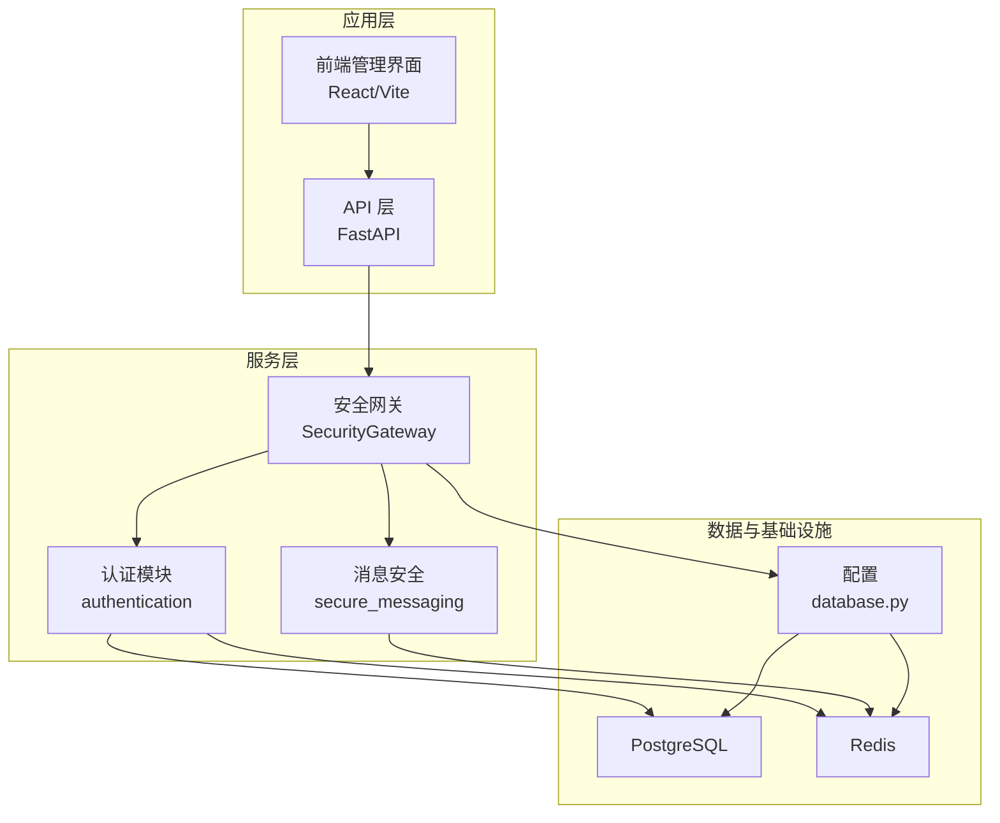
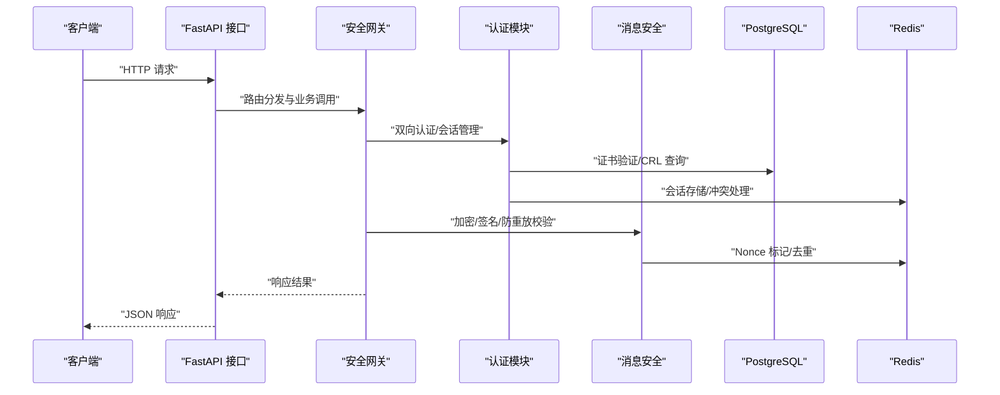
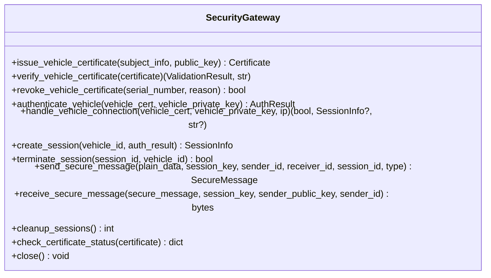
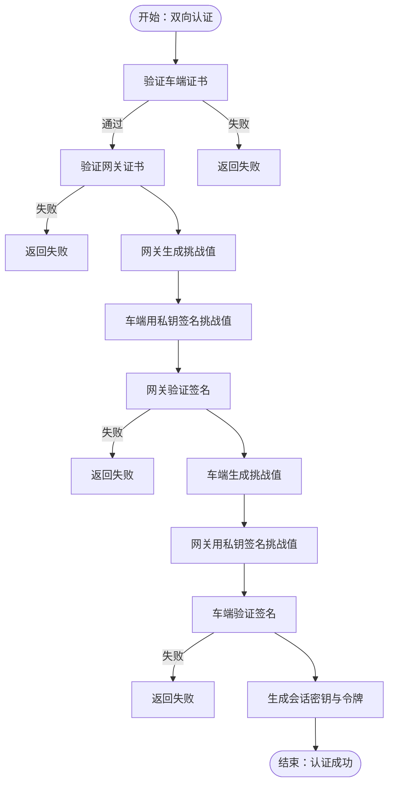
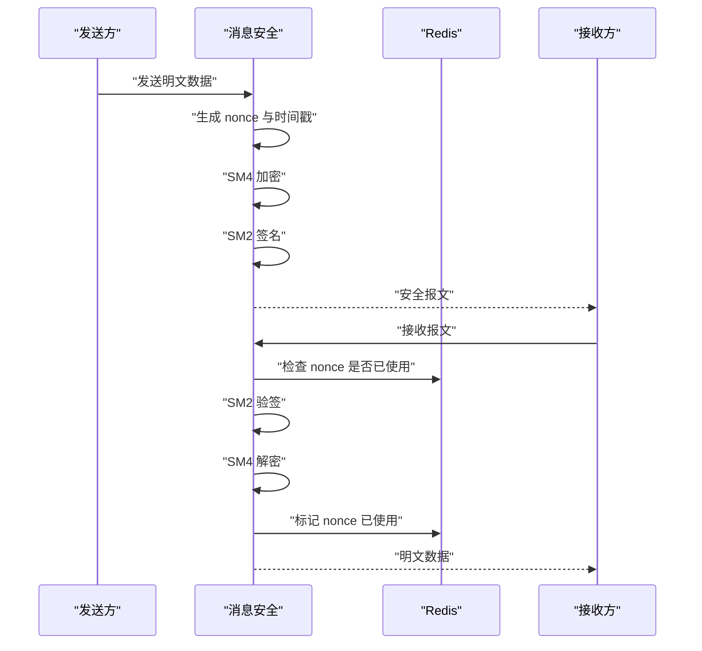
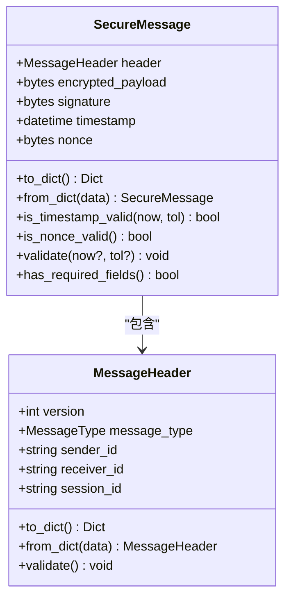
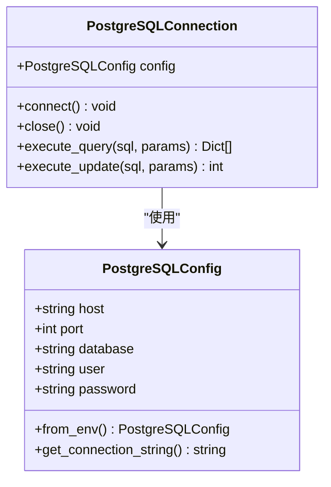
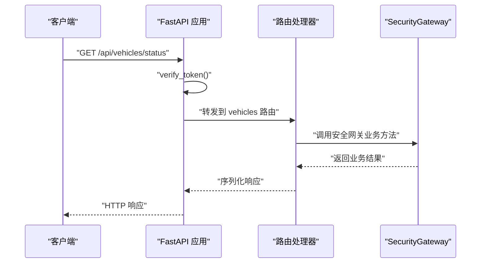
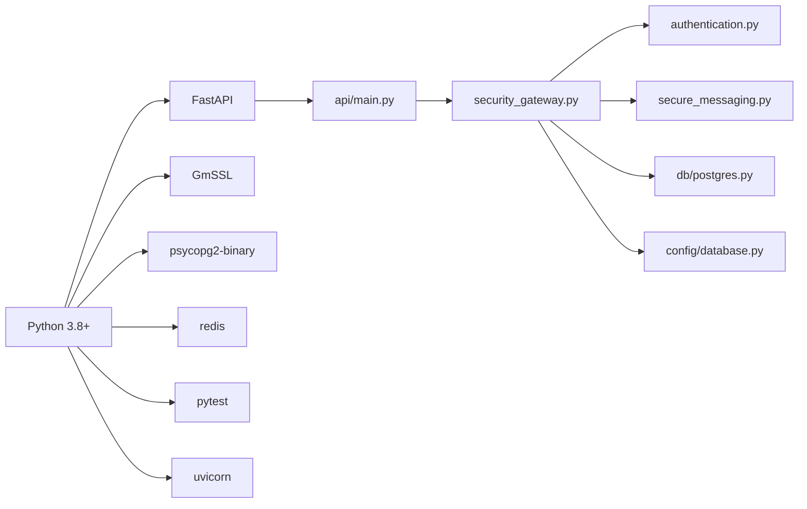

# 开发指南

<cite>
**本文引用的文件**
- [README.md](file://README.md)
- [requirements.txt](file://requirements.txt)
- [setup.py](file://setup.py)
- [Dockerfile](file://Dockerfile)
- [src/security_gateway.py](file://src/security_gateway.py)
- [src/authentication.py](file://src/authentication.py)
- [src/secure_messaging.py](file://src/secure_messaging.py)
- [src/models/message.py](file://src/models/message.py)
- [src/db/postgres.py](file://src/db/postgres.py)
- [config/database.py](file://config/database.py)
- [src/api/main.py](file://src/api/main.py)
- [tests/conftest.py](file://tests/conftest.py)
- [tests/test_authentication.py](file://tests/test_authentication.py)
- [docs/DEPLOYMENT.md](file://docs/DEPLOYMENT.md)
</cite>

## 目录
1. [简介](#简介)
2. [项目结构](#项目结构)
3. [核心组件](#核心组件)
4. [架构总览](#架构总览)
5. [详细组件分析](#详细组件分析)
6. [依赖分析](#依赖分析)
7. [性能考虑](#性能考虑)
8. [故障排查指南](#故障排查指南)
9. [结论](#结论)
10. [附录](#附录)

## 简介
本指南面向车联网安全通信网关项目的开发者，提供从环境搭建、开发流程、代码规范、调试与问题定位、功能变更流程、代码评审与质量检查，到性能优化与安全编码的最佳实践。项目采用国密算法（SM2/SM4），提供证书管理、双向身份认证、端到端加密、审计日志与会话管理等能力。

## 项目结构
项目采用分层与按功能域组织的结构：
- config：数据库配置（PostgreSQL/Redis）
- src：核心源代码
  - api：FastAPI 后端接口
  - db：数据库连接封装（PostgreSQL/Redis）
  - models：数据模型（证书、会话、消息、枚举）
  - crypto：SM2/SM4 加密算法封装
  - 安全服务模块：证书管理、认证、消息安全、密钥存储、审计日志、策略管理等
- tests：单元与集成测试
- db：数据库迁移与初始化脚本
- deployment/kubernetes：Kubernetes 部署清单
- docs：部署与运维文档
- web：前端管理界面（Vite + React）

图表来源
- [src/api/main.py:1-108](file://src/api/main.py#L1-L108)
- [src/security_gateway.py:1-800](file://src/security_gateway.py#L1-L800)
- [src/authentication.py:1-662](file://src/authentication.py#L1-L662)
- [src/secure_messaging.py:1-249](file://src/secure_messaging.py#L1-L249)
- [src/db/postgres.py:1-53](file://src/db/postgres.py#L1-L53)
- [config/database.py:1-50](file://config/database.py#L1-L50)

章节来源
- [README.md:1-148](file://README.md#L1-L148)
- [docs/DEPLOYMENT.md:1-200](file://docs/DEPLOYMENT.md#L1-L200)

## 核心组件
- 安全网关（SecurityGateway）：聚合证书管理、认证、会话、消息安全与审计日志，提供统一的对外服务接口。
- 认证模块（authentication）：实现挑战-响应、双向认证、会话建立与清理。
- 消息安全（secure_messaging）：实现 SM4 加密、SM2 签名、时间戳与 nonce 防重放校验。
- 数据模型（models/message）：定义消息头、安全报文结构及校验规则。
- 数据库访问（db/postgres）：封装 PostgreSQL 连接与事务。
- 配置（config/database）：从环境变量加载数据库与 Redis 配置。
- API（api/main）：FastAPI 应用，注册路由并提供健康检查与基础认证。

章节来源
- [src/security_gateway.py:1-800](file://src/security_gateway.py#L1-L800)
- [src/authentication.py:1-662](file://src/authentication.py#L1-L662)
- [src/secure_messaging.py:1-249](file://src/secure_messaging.py#L1-L249)
- [src/models/message.py:1-200](file://src/models/message.py#L1-L200)
- [src/db/postgres.py:1-53](file://src/db/postgres.py#L1-L53)
- [config/database.py:1-50](file://config/database.py#L1-L50)
- [src/api/main.py:1-108](file://src/api/main.py#L1-L108)

## 架构总览
下图展示从 API 到安全网关、认证与消息安全的整体交互流程，以及与数据库和缓存的依赖关系。

图表来源
- [src/api/main.py:1-108](file://src/api/main.py#L1-L108)
- [src/security_gateway.py:1-800](file://src/security_gateway.py#L1-L800)
- [src/authentication.py:1-662](file://src/authentication.py#L1-L662)
- [src/secure_messaging.py:1-249](file://src/secure_messaging.py#L1-L249)
- [src/db/postgres.py:1-53](file://src/db/postgres.py#L1-L53)
- [config/database.py:1-50](file://config/database.py#L1-L50)

## 详细组件分析

### 安全网关（SecurityGateway）
- 职责：证书颁发/验证/撤销；双向认证；会话建立/关闭/清理；安全消息发送/接收；审计日志记录。
- 关键流程：
  - 车辆接入：证书验证 → 双向认证 → 建立会话 → 审计记录
  - 消息收发：发送侧加密+签名；接收侧时间戳+Nonce 防重放+签名验证+解密
- 安全要点：密钥存储于安全隔离区（可选），会话密钥轮换与安全清除，审计日志覆盖认证、数据传输、证书操作等事件。

图表来源
- [src/security_gateway.py:1-800](file://src/security_gateway.py#L1-L800)

章节来源
- [src/security_gateway.py:1-800](file://src/security_gateway.py#L1-L800)

### 认证模块（authentication）
- 功能：挑战值生成与验证、车端/网关证书验证、双向认证、会话建立/关闭/冲突处理、过期会话清理。
- 关键算法：SM2 签名/验签、SM4 会话密钥生成。
- 并发与一致性：通过 Redis 维护“车辆→会话”映射，支持冲突策略（拒绝新会话/终止旧会话）。

图表来源
- [src/authentication.py:1-662](file://src/authentication.py#L1-L662)

章节来源
- [src/authentication.py:1-662](file://src/authentication.py#L1-L662)

### 消息安全（secure_messaging）
- 发送流程：生成 nonce 与时间戳 → SM4 加密 → SM2 签名 → 构造安全报文。
- 接收流程：校验时间戳与 nonce → SM2 验签 → SM4 解密 → 标记 nonce 已使用。
- 防重放：nonce 唯一性与 Redis TTL 控制；时间戳容差默认 5 分钟。

图表来源
- [src/secure_messaging.py:1-249](file://src/secure_messaging.py#L1-L249)
- [src/models/message.py:1-200](file://src/models/message.py#L1-L200)

章节来源
- [src/secure_messaging.py:1-249](file://src/secure_messaging.py#L1-L249)
- [src/models/message.py:1-200](file://src/models/message.py#L1-L200)

### 数据模型（message）
- MessageHeader：版本、消息类型、发送方/接收方、会话 ID。
- SecureMessage：加密载荷、签名、时间戳、nonce，并提供校验方法（时间戳范围、nonce 长度、签名非空、载荷非空）。

图表来源
- [src/models/message.py:1-200](file://src/models/message.py#L1-L200)

章节来源
- [src/models/message.py:1-200](file://src/models/message.py#L1-L200)

### 数据库与配置
- PostgreSQLConnection：封装连接、查询与更新，支持上下文管理。
- PostgreSQLConfig/RedisConfig：从环境变量加载配置，提供连接串与默认值。

图表来源
- [config/database.py:1-50](file://config/database.py#L1-L50)
- [src/db/postgres.py:1-53](file://src/db/postgres.py#L1-L53)

章节来源
- [config/database.py:1-50](file://config/database.py#L1-L50)
- [src/db/postgres.py:1-53](file://src/db/postgres.py#L1-L53)

### API 层（FastAPI）
- 提供根路径与健康检查，注册车辆、指标、证书、审计、配置、认证等路由。
- HTTP Bearer 认证：从环境变量读取 API Token 进行简单校验（建议在生产使用更安全的鉴权方案）。

图表来源
- [src/api/main.py:1-108](file://src/api/main.py#L1-L108)

章节来源
- [src/api/main.py:1-108](file://src/api/main.py#L1-L108)

## 依赖分析
- 运行时依赖：Python 3.8+、GmSSL（SM2/SM4）、PostgreSQL、Redis、FastAPI、Pydantic、Uvicorn、pytest、hypothesis、requests、cryptography、python-dotenv。
- 构建镜像：基于 Python slim，非 root 用户运行，暴露 8000 端口，健康检查通过 /health。

图表来源
- [requirements.txt:1-25](file://requirements.txt#L1-L25)
- [setup.py:1-34](file://setup.py#L1-L34)
- [Dockerfile:1-35](file://Dockerfile#L1-L35)

章节来源
- [requirements.txt:1-25](file://requirements.txt#L1-L25)
- [setup.py:1-34](file://setup.py#L1-L34)
- [Dockerfile:1-35](file://Dockerfile#L1-L35)

## 性能考虑
- 会话与缓存
  - 会话密钥与会话信息分别存储于安全存储与 Redis，避免明文密钥驻留内存。
  - Redis TTL 自动清理过期键，结合主动清理函数减少脏数据。
- 消息处理
  - SM4 对称加密适合大块数据，SM2 数字签名用于完整性与抗抵赖。
  - 防重放：nonce 唯一性与短 TTL（默认 5 分钟容差）平衡性能与安全性。
- 数据库
  - 使用 RealDictCursor 获取结构化结果，批量更新提交事务，降低网络往返。
- API
  - 健康检查与轻量级认证，避免在热路径引入复杂鉴权开销。

章节来源
- [src/security_gateway.py:1-800](file://src/security_gateway.py#L1-L800)
- [src/authentication.py:1-662](file://src/authentication.py#L1-L662)
- [src/secure_messaging.py:1-249](file://src/secure_messaging.py#L1-L249)
- [src/db/postgres.py:1-53](file://src/db/postgres.py#L1-L53)

## 故障排查指南
- 环境与依赖
  - 确认 Python 版本、依赖安装、PostgreSQL/Redis 可达性。
  - Docker 部署：使用健康检查端点与日志查看服务状态。
- 认证与会话
  - 若出现“证书验证失败/认证失败”，检查 CRL 获取、证书有效期与签名链。
  - 会话冲突：确认策略（拒绝新会话/终止旧会话）与 Redis 中映射键。
- 消息收发
  - “签名验证失败/重放攻击/消息过期/解密失败”：核对时间戳容差、nonce 是否重复、会话密钥是否正确。
- 测试与 Mock
  - 测试中通过 MockRedisConnection 替换真实 Redis，确保测试隔离与可重复性。

章节来源
- [docs/DEPLOYMENT.md:1-200](file://docs/DEPLOYMENT.md#L1-L200)
- [tests/conftest.py:1-95](file://tests/conftest.py#L1-L95)
- [src/security_gateway.py:1-800](file://src/security_gateway.py#L1-L800)
- [src/secure_messaging.py:1-249](file://src/secure_messaging.py#L1-L249)

## 结论
本指南提供了从环境搭建到开发、测试、部署与运维的全流程参考。建议在开发中严格遵循安全与性能最佳实践，配合完善的审计日志与测试体系，保障车联网场景下的端到端安全与稳定运行。

## 附录

### 开发环境搭建与配置
- 依赖安装：创建虚拟环境并安装 requirements.txt。
- 环境变量：复制 .env.example 并按需配置数据库、Redis、CA 私钥路径等。
- 数据库初始化：创建数据库并执行 schema 脚本。
- Redis：本地或容器运行，确保可达性。
- Docker：构建镜像并运行，健康检查端点 /health。

章节来源
- [README.md:32-75](file://README.md#L32-L75)
- [docs/DEPLOYMENT.md:1-200](file://docs/DEPLOYMENT.md#L1-L200)
- [Dockerfile:1-35](file://Dockerfile#L1-L35)

### 代码规范与最佳实践
- 命名约定
  - 类名：PascalCase；方法/变量：snake_case；常量：UPPER_CASE。
  - 文件名：小写加下划线，模块化拆分。
- 注释与文档
  - 函数/方法：前置条件、后置条件、异常与返回值说明。
  - 类与模块：职责说明与依赖关系。
- 架构原则
  - 单一职责：认证、消息、会话、审计分离。
  - 依赖倒置：通过接口与配置注入数据库/缓存连接。
  - 安全优先：密钥不落地、会话密钥轮换与安全清除。
- 测试策略
  - 单元测试：覆盖关键分支与边界条件。
  - 集成测试：Mock Redis/PostgreSQL，验证端到端流程。
  - 示例：参考测试套件与 conftest 的 Mock 设计。

章节来源
- [tests/conftest.py:1-95](file://tests/conftest.py#L1-L95)
- [tests/test_authentication.py:1-200](file://tests/test_authentication.py#L1-L200)

### 开发流程与版本控制
- 分支策略：主干保护，功能在 feature/* 分支开发，合并前进行代码评审。
- 提交规范：简要标题 + 详细说明 + 影响范围（模块/测试）。
- 变更日志：按功能模块记录变更摘要与验证需求编号。

### 新功能开发与修改流程
- 需求分析：明确验证需求编号与安全影响。
- 设计评审：绘制流程图/时序图，确定模块边界与接口契约。
- 实现：先实现单元测试，再实现功能，最后补充集成测试。
- 审计与日志：确保关键事件均有审计记录。
- 文档同步：更新 API 文档与部署说明。

### 代码评审与质量检查
- 覆盖率：关键路径与异常分支覆盖率不低于阈值。
- 安全检查：密钥处理、时间戳与 nonce、CRL 获取、会话生命周期。
- 性能检查：数据库查询、Redis 操作、消息吞吐与延迟。

### 性能优化与安全编码
- 性能
  - 使用 SM4 批量加密，合理设置 Redis TTL。
  - 数据库批处理与连接池复用。
- 安全
  - 会话密钥与 CA 私钥存储于安全隔离区，避免明文驻留内存。
  - 防重放：时间戳容差与 nonce 唯一性。
  - 审计日志：覆盖认证、数据传输、证书操作与异常事件。