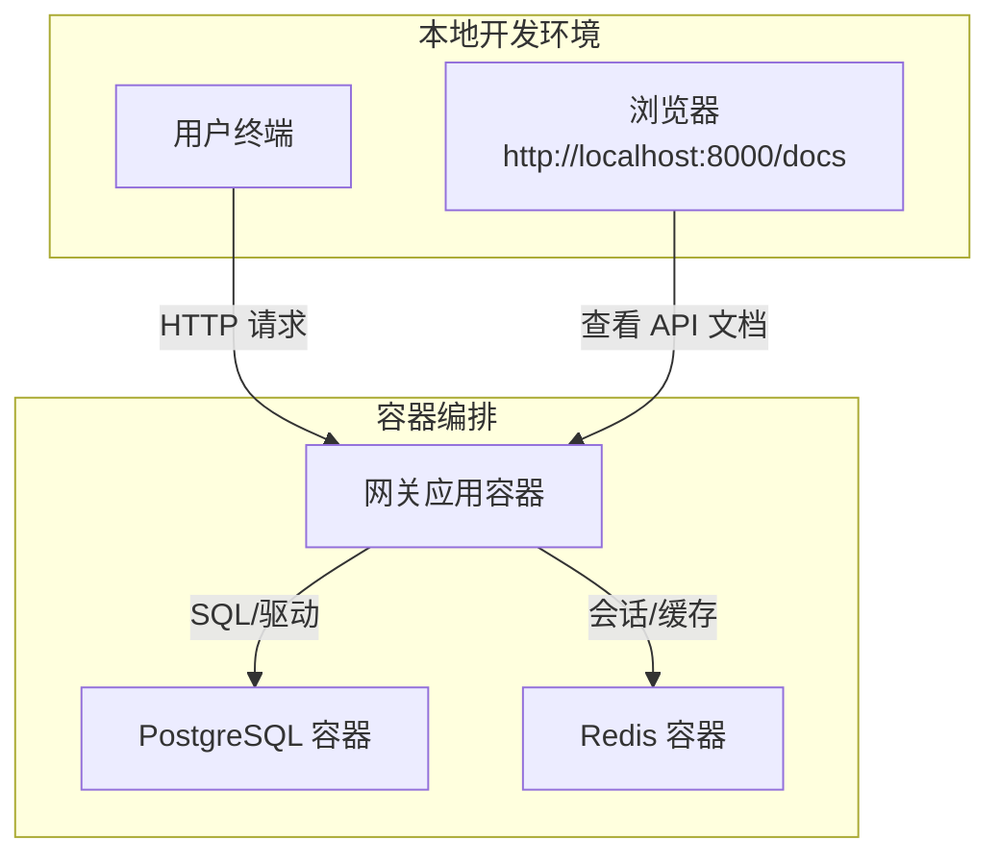
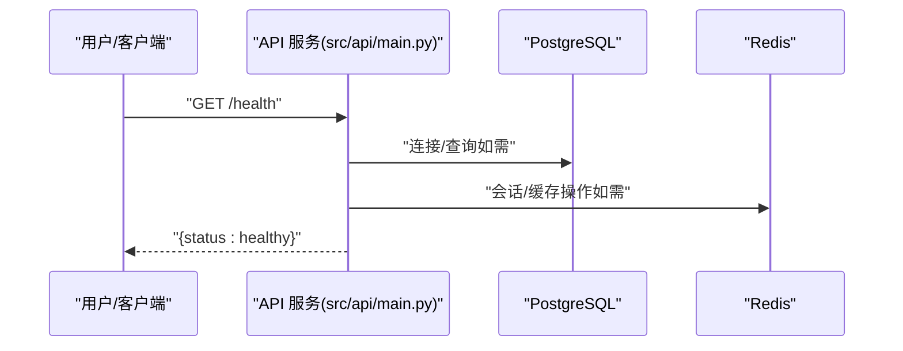
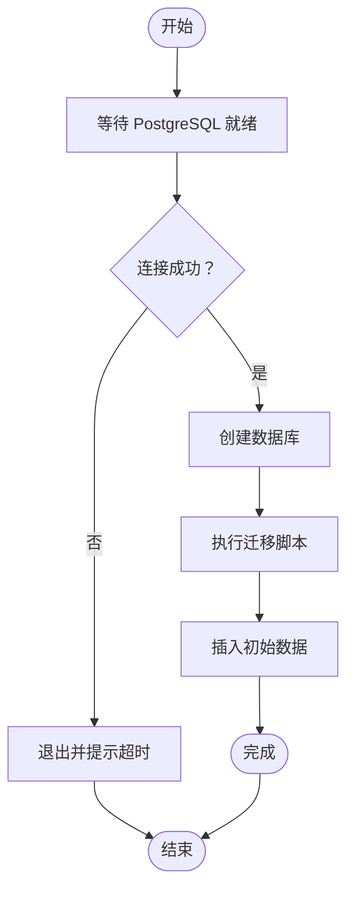
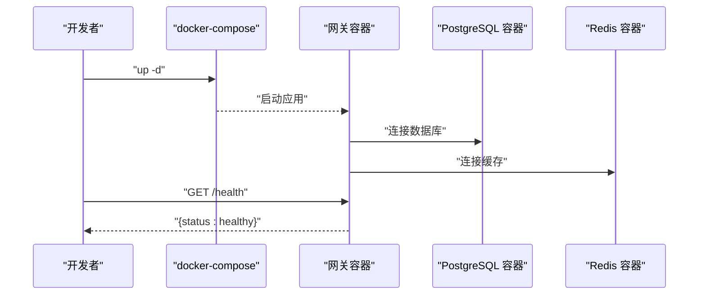
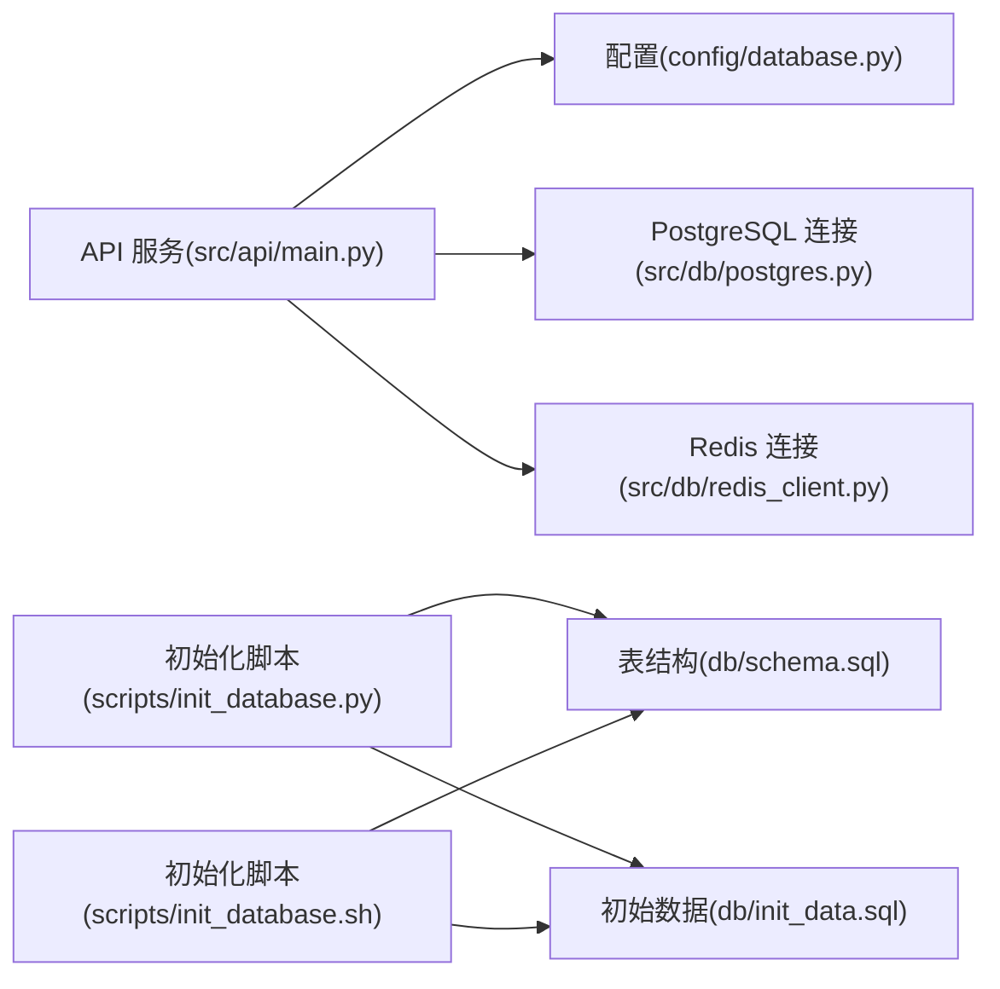

# 快速开始

<cite>
**本文引用的文件**
- [README.md](file://README.md)
- [requirements.txt](file://requirements.txt)
- [.env.example](file://.env.example)
- [config/database.py](file://config/database.py)
- [src/db/postgres.py](file://src/db/postgres.py)
- [src/db/redis_client.py](file://src/db/redis_client.py)
- [db/schema.sql](file://db/schema.sql)
- [db/init_data.sql](file://db/init_data.sql)
- [scripts/init_database.py](file://scripts/init_database.py)
- [scripts/init_database.sh](file://scripts/init_database.sh)
- [src/api/main.py](file://src/api/main.py)
- [Dockerfile](file://Dockerfile)
- [docker-compose.yml](file://docker-compose.yml)
- [docs/INSTALLATION.md](file://docs/INSTALLATION.md)
- [docs/TROUBLESHOOTING.md](file://docs/TROUBLESHOOTING.md)
- [db/redis_config.conf](file://db/redis_config.conf)
</cite>

## 目录
1. [简介](#简介)
2. [项目结构](#项目结构)
3. [核心组件](#核心组件)
4. [架构总览](#架构总览)
5. [详细组件分析](#详细组件分析)
6. [依赖关系分析](#依赖关系分析)
7. [性能注意事项](#性能注意事项)
8. [故障排除指南](#故障排除指南)
9. [结论](#结论)
10. [附录](#附录)

## 简介
本指南面向首次部署车联网安全通信网关系统的用户，目标是在最短时间内完成环境准备、依赖安装、数据库与缓存初始化、系统启动与验证，并提供常见问题的排错建议。系统采用国密算法（SM2/SM4），提供证书管理、身份认证、加密签名与审计日志能力。

## 项目结构
- 后端服务：基于 FastAPI 提供 REST API，容器化部署，暴露 8000 端口。
- 数据层：PostgreSQL 存储证书与审计日志；Redis 用于会话与缓存。
- 配置：通过 .env 环境变量注入数据库、Redis、安全策略等参数。
- 初始化：提供 Python 与 Bash 两套数据库初始化脚本，自动执行迁移与初始数据。

图表来源
- [docker-compose.yml:1-95](file://docker-compose.yml#L1-L95)
- [Dockerfile:1-35](file://Dockerfile#L1-L35)
- [src/api/main.py:1-108](file://src/api/main.py#L1-L108)

章节来源
- [README.md:1-148](file://README.md#L1-L148)
- [docker-compose.yml:1-95](file://docker-compose.yml#L1-L95)
- [Dockerfile:1-35](file://Dockerfile#L1-L35)

## 核心组件
- 环境与依赖
  - Python 3.8+，依赖通过 requirements.txt 管理。
  - 国密算法库、数据库驱动、Web 框架、Redis 客户端、dotenv 等。
- 配置加载
  - PostgreSQLConfig/RedisConfig 从环境变量读取配置。
- 数据库连接
  - 使用 psycopg2 连接 PostgreSQL，封装查询与更新。
- Redis 连接
  - 使用 redis-py 连接 Redis，提供键值操作与扫描。
- API 服务
  - FastAPI 应用，健康检查端点，路由注册，CORS 支持。
- 初始化脚本
  - Python 脚本与 Bash 脚本两种方式，等待数据库就绪、创建库、执行迁移与初始数据。

章节来源
- [requirements.txt:1-25](file://requirements.txt#L1-L25)
- [config/database.py:1-50](file://config/database.py#L1-L50)
- [src/db/postgres.py:1-53](file://src/db/postgres.py#L1-L53)
- [src/db/redis_client.py:1-79](file://src/db/redis_client.py#L1-L79)
- [src/api/main.py:1-108](file://src/api/main.py#L1-L108)
- [scripts/init_database.py:1-151](file://scripts/init_database.py#L1-L151)
- [scripts/init_database.sh:1-45](file://scripts/init_database.sh#L1-L45)

## 架构总览
下图展示从客户端到 API、再到数据库与缓存的整体交互路径。

图表来源
- [src/api/main.py:87-90](file://src/api/main.py#L87-L90)
- [src/db/postgres.py:16-45](file://src/db/postgres.py#L16-L45)
- [src/db/redis_client.py:15-49](file://src/db/redis_client.py#L15-L49)

## 详细组件分析

### 环境准备与依赖安装
- 步骤概览
  - 创建并激活 Python 虚拟环境。
  - 安装 requirements.txt 中的依赖。
- 关键要点
  - 依赖包括国密算法库、PostgreSQL 驱动、Redis 客户端、FastAPI、Uvicorn、Pydantic、dotenv 等。
- 预期输出
  - 无报错，pip 安装完成。

章节来源
- [README.md:34-48](file://README.md#L34-L48)
- [requirements.txt:1-25](file://requirements.txt#L1-L25)

### 环境变量配置
- 复制示例文件并编辑
  - 复制 .env.example 为 .env，按需修改数据库、Redis、安全参数与 CA 密钥路径。
- 关键变量
  - 数据库：POSTGRES_HOST、POSTGRES_PORT、POSTGRES_DB、POSTGRES_USER、POSTGRES_PASSWORD。
  - Redis：REDIS_HOST、REDIS_PORT、REDIS_DB、REDIS_PASSWORD。
  - 安全参数：SESSION_TIMEOUT_SECONDS、TIMESTAMP_TOLERANCE_SECONDS、CERTIFICATE_VALIDITY_DAYS。
  - CA：CA_PRIVATE_KEY_PATH。
- 验证
  - 确认 .env 文件存在且字段齐全。

章节来源
- [README.md:50-58](file://README.md#L50-L58)
- [.env.example:1-22](file://.env.example#L1-L22)
- [config/database.py:17-50](file://config/database.py#L17-L50)

### 数据库初始化（PostgreSQL）
- 两种方式任选其一
  - Python 脚本：等待数据库就绪、创建库、执行迁移、插入初始数据。
  - Bash 脚本：等待数据库就绪、创建库、顺序执行迁移与初始数据。
- 迁移与表结构
  - schema.sql 定义证书、CRL、审计日志、安全策略、认证失败记录等表及索引。
  - 初始数据包含示例 CA 证书与默认安全策略。
- 预期输出
  - 成功创建数据库与表结构，插入初始数据。

图表来源
- [scripts/init_database.py:14-95](file://scripts/init_database.py#L14-L95)
- [scripts/init_database.sh:19-44](file://scripts/init_database.sh#L19-L44)
- [db/schema.sql:1-104](file://db/schema.sql#L1-L104)
- [db/init_data.sql:1-61](file://db/init_data.sql#L1-L61)

章节来源
- [docs/INSTALLATION.md:108-119](file://docs/INSTALLATION.md#L108-L119)
- [scripts/init_database.py:119-148](file://scripts/init_database.py#L119-L148)
- [scripts/init_database.sh:1-45](file://scripts/init_database.sh#L1-L45)
- [db/schema.sql:1-104](file://db/schema.sql#L1-L104)
- [db/init_data.sql:1-61](file://db/init_data.sql#L1-L61)

### Redis 服务启动与配置
- Docker 启动
  - 使用 docker-compose 启动 Redis 容器，默认开启 requirepass。
- 本地启动（可选）
  - 可参考 db/redis_config.conf 进行本地安装与配置。
- 验证
  - 使用 redis-cli 连接并执行 ping 确认连通性。

章节来源
- [docker-compose.yml:25-41](file://docker-compose.yml#L25-L41)
- [db/redis_config.conf:1-44](file://db/redis_config.conf#L1-L44)
- [docs/INSTALLATION.md:91-107](file://docs/INSTALLATION.md#L91-L107)

### 系统启动与验证
- 方式一：Docker Compose（推荐）
  - docker-compose up -d 启动所有服务，容器间通过内部网络通信。
  - 端口映射：API 8000，PostgreSQL 5432，Redis 6379。
- 方式二：本地启动
  - 在虚拟环境中运行 Uvicorn 启动 API 应用。
- 验证
  - curl http://localhost:8000/health 返回健康状态。
  - 浏览器访问 http://localhost:8000/docs 查看接口文档。
  - 运行 pytest tests/ 进行功能测试。

图表来源
- [docker-compose.yml:42-86](file://docker-compose.yml#L42-L86)
- [src/api/main.py:87-90](file://src/api/main.py#L87-L90)
- [Dockerfile:33-35](file://Dockerfile#L33-L35)

章节来源
- [docs/INSTALLATION.md:17-56](file://docs/INSTALLATION.md#L17-L56)
- [docs/INSTALLATION.md:141-145](file://docs/INSTALLATION.md#L141-L145)
- [src/api/main.py:87-90](file://src/api/main.py#L87-L90)

## 依赖关系分析
- 组件耦合
  - API 服务依赖数据库与 Redis 配置类，通过连接管理器进行访问。
  - 初始化脚本直接依赖环境变量与 SQL 脚本。
- 外部依赖
  - PostgreSQL、Redis、GmSSL、FastAPI、Uvicorn、dotenv 等。

图表来源
- [src/api/main.py:1-108](file://src/api/main.py#L1-L108)
- [config/database.py:1-50](file://config/database.py#L1-L50)
- [src/db/postgres.py:1-53](file://src/db/postgres.py#L1-L53)
- [src/db/redis_client.py:1-79](file://src/db/redis_client.py#L1-L79)
- [scripts/init_database.py:1-151](file://scripts/init_database.py#L1-L151)
- [scripts/init_database.sh:1-45](file://scripts/init_database.sh#L1-L45)
- [db/schema.sql:1-104](file://db/schema.sql#L1-L104)
- [db/init_data.sql:1-61](file://db/init_data.sql#L1-L61)

章节来源
- [config/database.py:1-50](file://config/database.py#L1-L50)
- [src/db/postgres.py:1-53](file://src/db/postgres.py#L1-L53)
- [src/db/redis_client.py:1-79](file://src/db/redis_client.py#L1-L79)
- [scripts/init_database.py:1-151](file://scripts/init_database.py#L1-L151)
- [scripts/init_database.sh:1-45](file://scripts/init_database.sh#L1-L45)

## 性能注意事项
- 数据库与缓存
  - 为审计日志与证书表建立索引，避免全表扫描。
  - 合理设置 Redis maxmemory 与驱逐策略，避免内存压力。
- API 与会话
  - 控制会话超时与时间戳容差，平衡安全性与性能。
  - 启用证书缓存并设置合理 TTL，减少重复验证开销。
- 资源与扩展
  - 监控 CPU/内存/IO，必要时增加实例副本或升级硬件。

## 故障排除指南
- 数据库连接失败
  - 检查 PostgreSQL 服务状态、端口开放、网络与防火墙、用户权限。
  - 使用 psql 手动连接验证。
- Redis 连接失败
  - 检查 Redis 服务状态、密码、配置文件 requirepass。
  - 使用 redis-cli ping 验证。
- 认证失败/签名验证失败
  - 核查证书有效性、撤销状态、CA 公钥匹配与签名算法。
- 重放攻击检测
  - 检查 nonce 追踪、系统时间同步与时间戳容差。
- 会话过期
  - 检查会话超时配置、Redis 内存与持久化。
- API 无响应
  - 检查服务状态、端口监听、资源限制与错误日志。
- 性能下降
  - 监控系统资源、数据库活动与 Redis 延迟，优化查询与缓存策略。

章节来源
- [docs/TROUBLESHOOTING.md:1-399](file://docs/TROUBLESHOOTING.md#L1-L399)

## 结论
按照本指南完成环境准备、依赖安装、数据库与 Redis 初始化、系统启动与验证，即可在本地或容器环境中快速运行车联网安全通信网关系统。遇到问题时，可依据故障排除指南逐步定位并解决。

## 附录
- 常用命令摘要
  - 安装依赖：pip install -r requirements.txt
  - 初始化数据库（Python）：python scripts/init_database.py
  - 初始化数据库（Bash）：./scripts/init_database.sh
  - 启动服务（Docker）：docker-compose up -d
  - 健康检查：curl http://localhost:8000/health
  - 运行测试：pytest tests/ -v
- 预期输出
  - 健康检查返回 {"status":"healthy"}。
  - API 文档页面可正常访问。