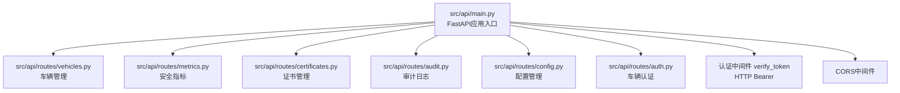
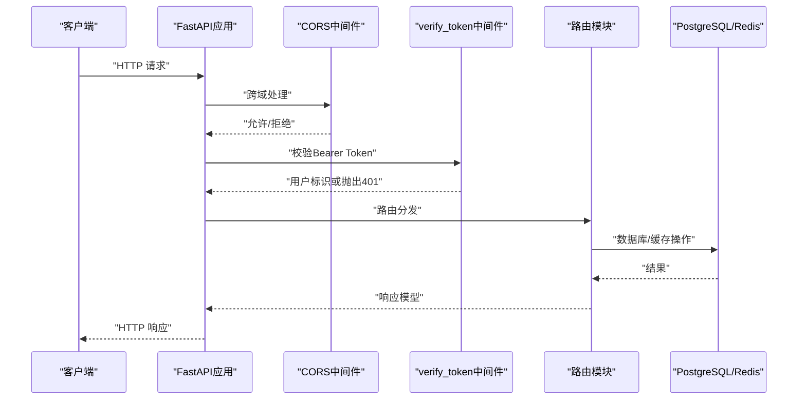
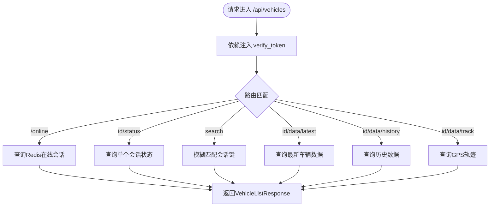
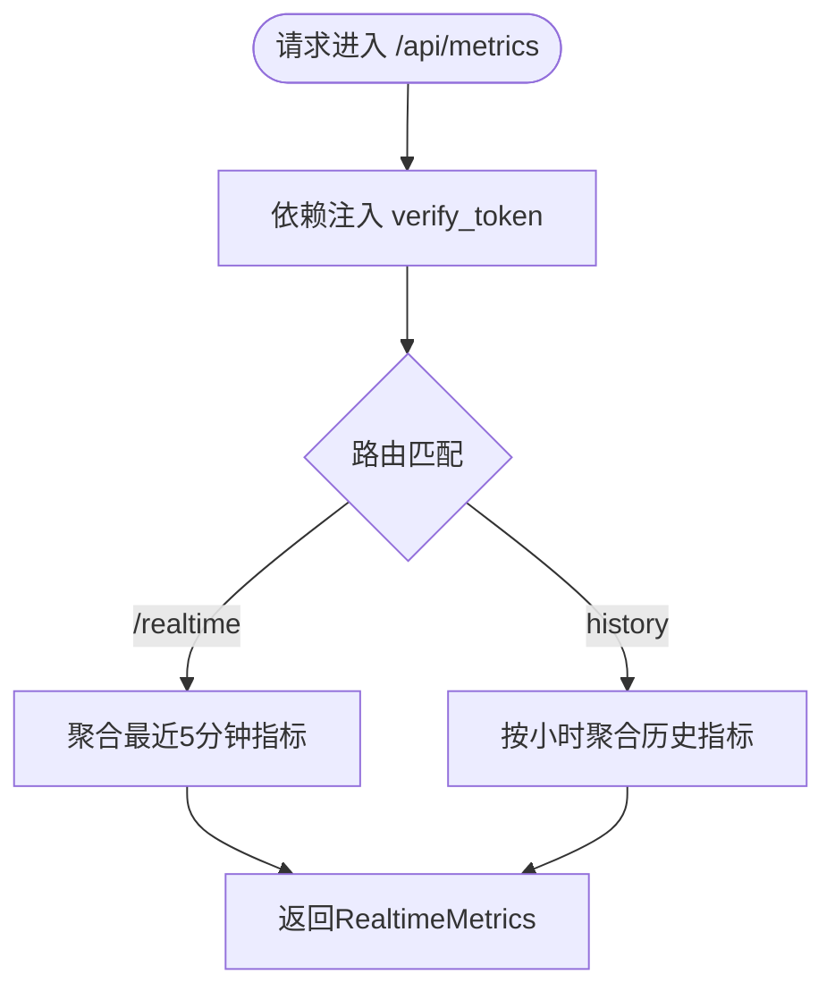
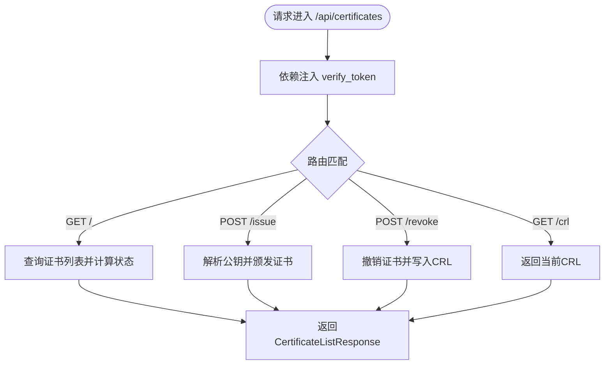
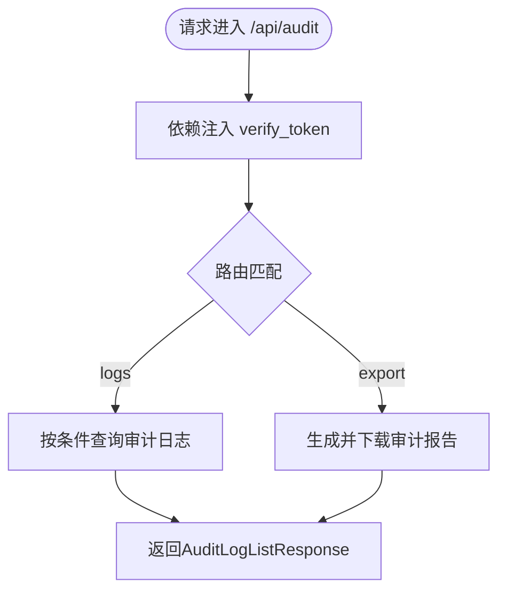
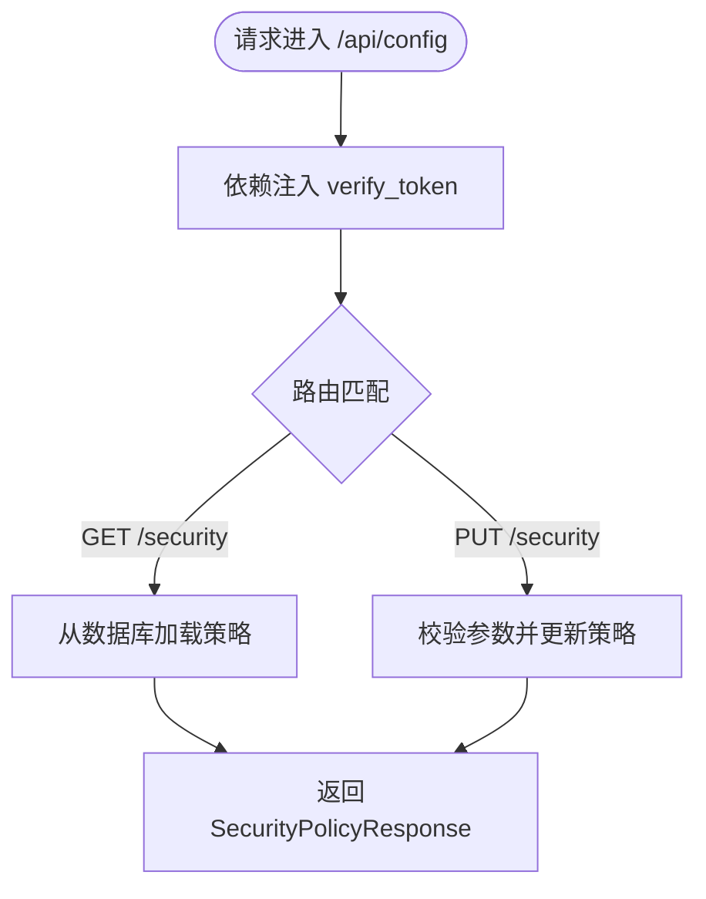
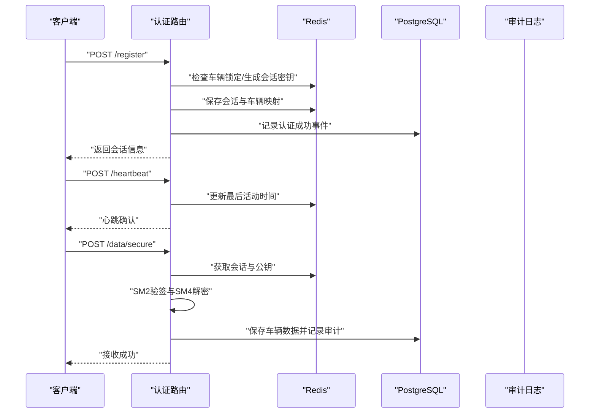
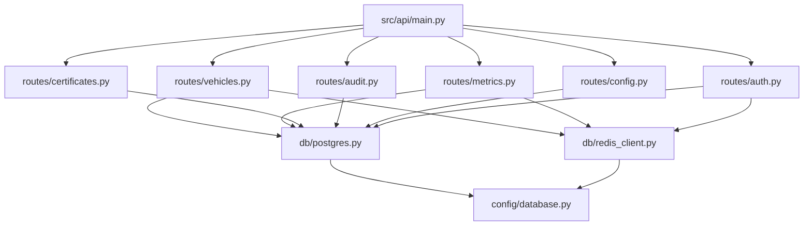
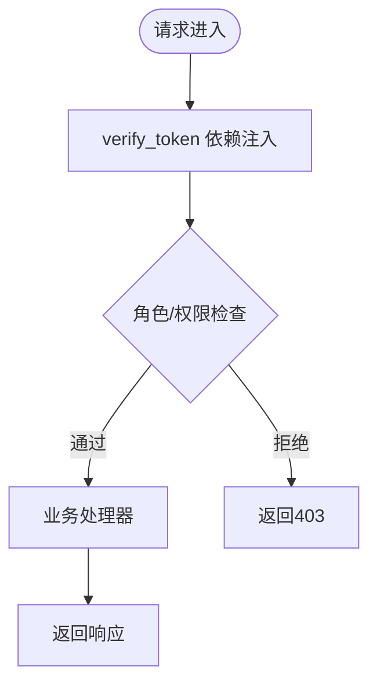

# API接口扩展

<cite>
**本文引用的文件**
- [src/api/main.py](file://src/api/main.py)
- [src/api/README.md](file://src/api/README.md)
- [src/api/routes/__init__.py](file://src/api/routes/__init__.py)
- [src/api/routes/vehicles.py](file://src/api/routes/vehicles.py)
- [src/api/routes/metrics.py](file://src/api/routes/metrics.py)
- [src/api/routes/certificates.py](file://src/api/routes/certificates.py)
- [src/api/routes/audit.py](file://src/api/routes/audit.py)
- [src/api/routes/config.py](file://src/api/routes/config.py)
- [src/api/routes/auth.py](file://src/api/routes/auth.py)
- [src/authentication.py](file://src/authentication.py)
- [src/models/session.py](file://src/models/session.py)
- [src/db/postgres.py](file://src/db/postgres.py)
- [src/db/redis_client.py](file://src/db/redis_client.py)
- [config/database.py](file://config/database.py)
- [examples/run_api_server.py](file://examples/run_api_server.py)
</cite>

## 目录
1. [简介](#简介)
2. [项目结构](#项目结构)
3. [核心组件](#核心组件)
4. [架构总览](#架构总览)
5. [详细组件分析](#详细组件分析)
6. [依赖关系分析](#依赖关系分析)
7. [性能考虑](#性能考虑)
8. [故障排除指南](#故障排除指南)
9. [结论](#结论)
10. [附录](#附录)

## 简介
本文件面向车联网安全通信网关的API接口扩展开发，系统性阐述基于FastAPI的路由扩展机制、新接口开发流程、认证中间件与权限控制扩展、请求处理与响应格式标准、错误处理与异常捕获、API版本管理与向后兼容策略，并提供完整的代码示例与集成指南。目标是帮助开发者在不破坏现有架构的前提下，快速、安全地扩展API能力。

## 项目结构
后端采用FastAPI应用入口集中注册各业务路由模块，统一进行CORS与HTTP Bearer认证中间件配置，路由模块按功能域划分，便于扩展与维护。

**图表来源**
- [src/api/main.py:94-102](file://src/api/main.py#L94-L102)
- [src/api/main.py:37-43](file://src/api/main.py#L37-L43)
- [src/api/main.py:49-74](file://src/api/main.py#L49-L74)

**章节来源**
- [src/api/main.py:13-34](file://src/api/main.py#L13-L34)
- [src/api/main.py:94-102](file://src/api/main.py#L94-L102)
- [src/api/README.md:93-112](file://src/api/README.md#L93-L112)

## 核心组件
- FastAPI应用与中间件
  - 应用初始化、标题、版本、文档端点、联系人与许可证信息。
  - CORS中间件配置，允许跨域访问。
  - HTTP Bearer认证中间件与全局依赖注入的令牌校验函数。
- 路由注册
  - 在应用中导入各路由模块并通过include_router统一注册，设置前缀与标签，便于OpenAPI文档分组展示。
- 数据访问层
  - PostgreSQLConnection与RedisConnection封装数据库连接、查询与事务操作，提供上下文管理与资源释放。
- 配置管理
  - PostgreSQLConfig与RedisConfig从环境变量读取数据库与缓存配置，支持from_env工厂方法与连接串生成。
- 示例启动
  - examples/run_api_server.py提供本地开发启动方式与环境变量说明。

**章节来源**
- [src/api/main.py:13-34](file://src/api/main.py#L13-L34)
- [src/api/main.py:37-43](file://src/api/main.py#L37-L43)
- [src/api/main.py:49-74](file://src/api/main.py#L49-L74)
- [src/api/main.py:94-102](file://src/api/main.py#L94-L102)
- [src/db/postgres.py:9-53](file://src/db/postgres.py#L9-L53)
- [src/db/redis_client.py:8-79](file://src/db/redis_client.py#L8-L79)
- [config/database.py:8-50](file://config/database.py#L8-L50)
- [examples/run_api_server.py:25-73](file://examples/run_api_server.py#L25-L73)

## 架构总览
下图展示了API扩展的典型调用链：客户端请求进入FastAPI应用，经过CORS与HTTP Bearer认证中间件，再由路由模块处理业务逻辑，最终通过数据访问层与外部服务交互。

**图表来源**
- [src/api/main.py:37-43](file://src/api/main.py#L37-L43)
- [src/api/main.py:49-74](file://src/api/main.py#L49-L74)
- [src/api/main.py:94-102](file://src/api/main.py#L94-L102)

## 详细组件分析

### 车辆管理API（/api/vehicles）
- 功能要点
  - 在线车辆列表查询、特定车辆状态查询、车辆搜索。
  - 最新数据、历史数据与GPS轨迹查询。
  - 统一依赖verify_token进行认证。
- 数据模型
  - VehicleStatus与VehicleListResponse用于响应结构化输出。
- 错误处理
  - 捕获异常并抛出HTTPException，保证错误信息一致。
- 性能特性
  - Redis键扫描与过期会话清理；PostgreSQL查询带参数绑定，避免SQL注入。

**图表来源**
- [src/api/routes/vehicles.py:38-238](file://src/api/routes/vehicles.py#L38-L238)
- [src/api/routes/vehicles.py:241-447](file://src/api/routes/vehicles.py#L241-L447)

**章节来源**
- [src/api/routes/vehicles.py:22-36](file://src/api/routes/vehicles.py#L22-L36)
- [src/api/routes/vehicles.py:38-238](file://src/api/routes/vehicles.py#L38-L238)
- [src/api/routes/vehicles.py:241-447](file://src/api/routes/vehicles.py#L241-L447)

### 安全指标API（/api/metrics）
- 功能要点
  - 实时安全指标聚合（在线车辆数、认证成功率、失败次数、数据传输量、签名失败次数、安全异常次数）。
  - 历史指标按小时聚合。
- 数据模型
  - RealtimeMetrics与HistoricalMetrics定义响应结构。
- 错误处理
  - 异常捕获并返回统一HTTP 500错误。

**图表来源**
- [src/api/routes/metrics.py:39-148](file://src/api/routes/metrics.py#L39-L148)
- [src/api/routes/metrics.py:151-237](file://src/api/routes/metrics.py#L151-L237)

**章节来源**
- [src/api/routes/metrics.py:21-37](file://src/api/routes/metrics.py#L21-L37)
- [src/api/routes/metrics.py:39-148](file://src/api/routes/metrics.py#L39-L148)
- [src/api/routes/metrics.py:151-237](file://src/api/routes/metrics.py#L151-L237)

### 证书管理API（/api/certificates）
- 功能要点
  - 证书列表查询（支持状态过滤）、颁发新证书、撤销证书、获取CRL。
- 数据模型
  - CertificateInfo、CertificateListResponse、IssueCertificateRequest/Response、RevokeCertificateRequest/Response、CRLResponse。
- 错误处理
  - 输入参数校验与异常捕获，审计日志记录成功/失败事件。

**图表来源**
- [src/api/routes/certificates.py:81-151](file://src/api/routes/certificates.py#L81-L151)
- [src/api/routes/certificates.py:154-274](file://src/api/routes/certificates.py#L154-L274)
- [src/api/routes/certificates.py:277-359](file://src/api/routes/certificates.py#L277-L359)
- [src/api/routes/certificates.py:362-389](file://src/api/routes/certificates.py#L362-L389)

**章节来源**
- [src/api/routes/certificates.py:24-79](file://src/api/routes/certificates.py#L24-L79)
- [src/api/routes/certificates.py:81-151](file://src/api/routes/certificates.py#L81-L151)
- [src/api/routes/certificates.py:154-274](file://src/api/routes/certificates.py#L154-L274)
- [src/api/routes/certificates.py:277-359](file://src/api/routes/certificates.py#L277-L359)
- [src/api/routes/certificates.py:362-389](file://src/api/routes/certificates.py#L362-L389)

### 审计日志API（/api/audit）
- 功能要点
  - 审计日志查询（支持时间范围、车辆ID、事件类型、结果过滤）。
  - 审计报告导出（JSON/CVS）。
- 数据模型
  - AuditLogEntry与AuditLogListResponse。
- 错误处理
  - 事件类型枚举转换与异常捕获。

**图表来源**
- [src/api/routes/audit.py:39-124](file://src/api/routes/audit.py#L39-L124)
- [src/api/routes/audit.py:127-190](file://src/api/routes/audit.py#L127-L190)

**章节来源**
- [src/api/routes/audit.py:22-37](file://src/api/routes/audit.py#L22-L37)
- [src/api/routes/audit.py:39-124](file://src/api/routes/audit.py#L39-L124)
- [src/api/routes/audit.py:127-190](file://src/api/routes/audit.py#L127-L190)

### 配置管理API（/api/config）
- 功能要点
  - 获取与更新安全策略（会话超时、证书有效期、时间戳容差、并发会话策略、最大认证失败次数、锁定时长）。
- 数据模型
  - SecurityPolicy与SecurityPolicyResponse。
- 错误处理
  - 参数范围校验与异常捕获。

**图表来源**
- [src/api/routes/config.py:64-105](file://src/api/routes/config.py#L64-L105)
- [src/api/routes/config.py:108-172](file://src/api/routes/config.py#L108-L172)

**章节来源**
- [src/api/routes/config.py:20-62](file://src/api/routes/config.py#L20-L62)
- [src/api/routes/config.py:64-105](file://src/api/routes/config.py#L64-L105)
- [src/api/routes/config.py:108-172](file://src/api/routes/config.py#L108-L172)

### 车辆认证API（/api/auth）
- 功能要点
  - 车辆注册（生成会话ID与SM4会话密钥，维护会话与车辆映射，记录审计日志）。
  - 心跳更新（刷新会话与映射过期时间）。
  - 注销（删除会话与映射）。
  - 接收加密/明文车辆数据（SM2验签与SM4解密，保存至数据库并记录审计日志）。
- 数据模型
  - VehicleRegisterRequest/Response与会话相关模型。
- 错误处理
  - 会话有效性检查、异常捕获与审计日志记录。

**图表来源**
- [src/api/routes/auth.py:70-230](file://src/api/routes/auth.py#L70-L230)
- [src/api/routes/auth.py:232-286](file://src/api/routes/auth.py#L232-L286)
- [src/api/routes/auth.py:289-329](file://src/api/routes/auth.py#L289-L329)
- [src/api/routes/auth.py:332-540](file://src/api/routes/auth.py#L332-L540)
- [src/api/routes/auth.py:542-685](file://src/api/routes/auth.py#L542-L685)

**章节来源**
- [src/api/routes/auth.py:23-52](file://src/api/routes/auth.py#L23-L52)
- [src/api/routes/auth.py:70-230](file://src/api/routes/auth.py#L70-L230)
- [src/api/routes/auth.py:232-286](file://src/api/routes/auth.py#L232-L286)
- [src/api/routes/auth.py:289-329](file://src/api/routes/auth.py#L289-L329)
- [src/api/routes/auth.py:332-540](file://src/api/routes/auth.py#L332-L540)
- [src/api/routes/auth.py:542-685](file://src/api/routes/auth.py#L542-L685)

### 认证中间件与权限控制扩展
- 全局认证
  - verify_token依赖注入用于保护所有受保护路由，返回用户标识用于审计与追踪。
- 权限控制建议
  - 在verify_token基础上扩展角色/权限集合，结合路由装饰器或自定义依赖实现细粒度权限控制。
  - 对敏感操作（如证书颁发/撤销、配置更新）增加二次校验或管理员角色限定。

**章节来源**
- [src/api/main.py:49-74](file://src/api/main.py#L49-L74)
- [src/api/routes/auth.py:74-74](file://src/api/routes/auth.py#L74-L74)
- [src/api/routes/certificates.py:158-158](file://src/api/routes/certificates.py#L158-L158)
- [src/api/routes/config.py:111-111](file://src/api/routes/config.py#L111-L111)

### 错误处理与异常捕获
- 统一异常
  - 所有路由在捕获异常后抛出HTTPException，确保错误响应格式一致。
- 审计日志
  - 认证与数据传输失败均记录审计事件，便于追踪与取证。
- 建议
  - 定义统一的异常处理器（FastAPI ExceptionHandler）以集中处理业务异常与HTTP异常，输出标准化错误响应。

**章节来源**
- [src/api/routes/vehicles.py:95-99](file://src/api/routes/vehicles.py#L95-L99)
- [src/api/routes/metrics.py:144-148](file://src/api/routes/metrics.py#L144-L148)
- [src/api/routes/certificates.py:253-274](file://src/api/routes/certificates.py#L253-L274)
- [src/api/routes/audit.py:118-124](file://src/api/routes/audit.py#L118-L124)
- [src/api/routes/config.py:101-105](file://src/api/routes/config.py#L101-L105)
- [src/api/routes/auth.py:200-229](file://src/api/routes/auth.py#L200-L229)

### API版本管理与向后兼容
- 版本策略
  - 应用层面通过版本号与OpenAPI文档区分版本；新增端点建议使用新版本前缀或独立子域。
- 向后兼容
  - 保持现有端点响应字段不变，新增字段以可选形式提供；对变更进行明确的版本说明与迁移指引。
- 建议
  - 为每个主要版本维护独立的路由前缀与文档端点，逐步淘汰旧版本。

**章节来源**
- [src/api/main.py:20-34](file://src/api/main.py#L20-L34)
- [src/api/README.md:25-29](file://src/api/README.md#L25-L29)

## 依赖关系分析
- 组件耦合
  - 路由模块依赖verify_token进行认证，依赖PostgreSQL/Redis连接进行数据访问。
  - 数据访问层通过配置类从环境变量读取连接参数，降低硬编码耦合。
- 外部依赖
  - FastAPI、psycopg2、redis、pydantic等。
- 循环依赖
  - 通过模块导入顺序与延迟初始化避免循环依赖。

**图表来源**
- [src/api/main.py:94-102](file://src/api/main.py#L94-L102)
- [src/api/routes/vehicles.py:14-17](file://src/api/routes/vehicles.py#L14-L17)
- [src/api/routes/metrics.py:13-16](file://src/api/routes/metrics.py#L13-L16)
- [src/api/routes/certificates.py:13-19](file://src/api/routes/certificates.py#L13-L19)
- [src/api/routes/audit.py:13-17](file://src/api/routes/audit.py#L13-L17)
- [src/api/routes/config.py:12-15](file://src/api/routes/config.py#L12-L15)
- [src/api/routes/auth.py:13-18](file://src/api/routes/auth.py#L13-L18)
- [src/db/postgres.py:9-53](file://src/db/postgres.py#L9-L53)
- [src/db/redis_client.py:8-79](file://src/db/redis_client.py#L8-L79)
- [config/database.py:8-50](file://config/database.py#L8-L50)

**章节来源**
- [src/api/main.py:94-102](file://src/api/main.py#L94-L102)
- [src/db/postgres.py:9-53](file://src/db/postgres.py#L9-L53)
- [src/db/redis_client.py:8-79](file://src/db/redis_client.py#L8-L79)
- [config/database.py:8-50](file://config/database.py#L8-L50)

## 性能考虑
- 缓存与会话
  - 使用Redis存储会话与公钥，设置合理TTL；定期清理过期会话。
- 数据库访问
  - 使用参数化查询与连接池；批量操作使用事务减少往返。
- 响应模型
  - 使用Pydantic模型自动序列化，减少手动构造开销。
- 并发与锁
  - 并发会话策略（拒绝新会话或终止旧会话）需结合业务场景选择。

[本节为通用指导，无需列出章节来源]

## 故障排除指南
- 认证失败
  - 检查Bearer Token是否正确传递与匹配；查看verify_token实现与环境变量配置。
- 数据库连接
  - 确认PostgreSQLConfig与环境变量；检查连接字符串与网络可达性。
- Redis连接
  - 确认RedisConfig与环境变量；检查键空间与TTL设置。
- 审计日志
  - 确认审计日志表结构与写入逻辑；检查异常捕获分支是否记录审计事件。

**章节来源**
- [src/api/main.py:49-74](file://src/api/main.py#L49-L74)
- [config/database.py:17-30](file://config/database.py#L17-L30)
- [config/database.py:41-49](file://config/database.py#L41-L49)
- [src/api/routes/auth.py:200-229](file://src/api/routes/auth.py#L200-L229)

## 结论
本文档提供了车联网安全通信网关API扩展开发的系统化指南，涵盖FastAPI路由扩展机制、认证与权限控制、请求处理与响应格式、错误处理与异常捕获、版本管理与向后兼容策略。按照本文档的流程与最佳实践，可在不破坏现有架构的前提下高效扩展API能力。

## 附录

### 新增API端点开发流程
- 创建路由模块
  - 在src/api/routes下新建模块文件，定义APIRouter实例与路由函数。
- 定义数据模型
  - 使用Pydantic BaseModel定义请求与响应模型，确保类型安全与文档生成。
- 实现业务逻辑
  - 通过Depends注入verify_token进行认证；使用PostgreSQL/Redis连接访问数据。
- 注册路由
  - 在src/api/main.py中导入模块并通过include_router注册，设置前缀与标签。
- 编写测试
  - 在tests目录下编写单元测试与集成测试，覆盖正常与异常场景。
- 文档与发布
  - 更新API文档与README，遵循版本管理策略。

**章节来源**
- [src/api/routes/__init__.py:1-2](file://src/api/routes/__init__.py#L1-L2)
- [src/api/main.py:94-102](file://src/api/main.py#L94-L102)
- [src/api/README.md:30-86](file://src/api/README.md#L30-L86)

### 认证中间件扩展示例（概念性）

[本图为概念性示意，无需图表来源]