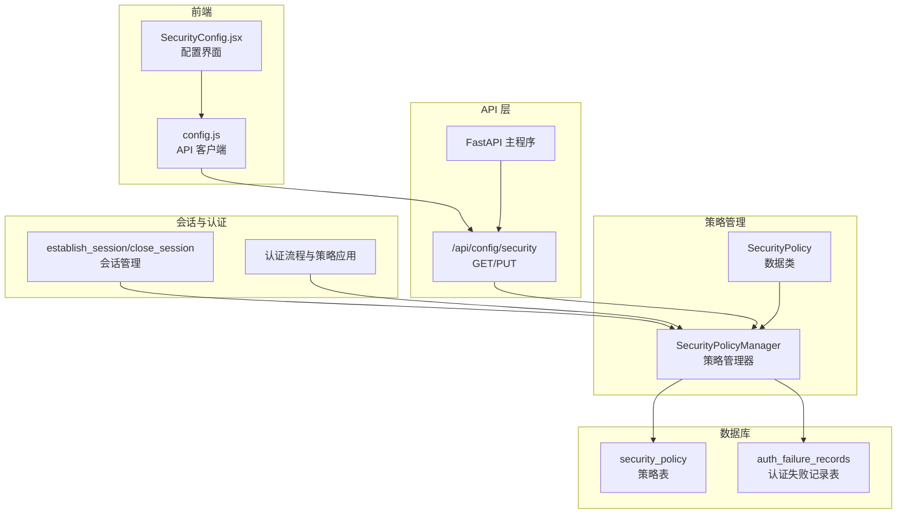
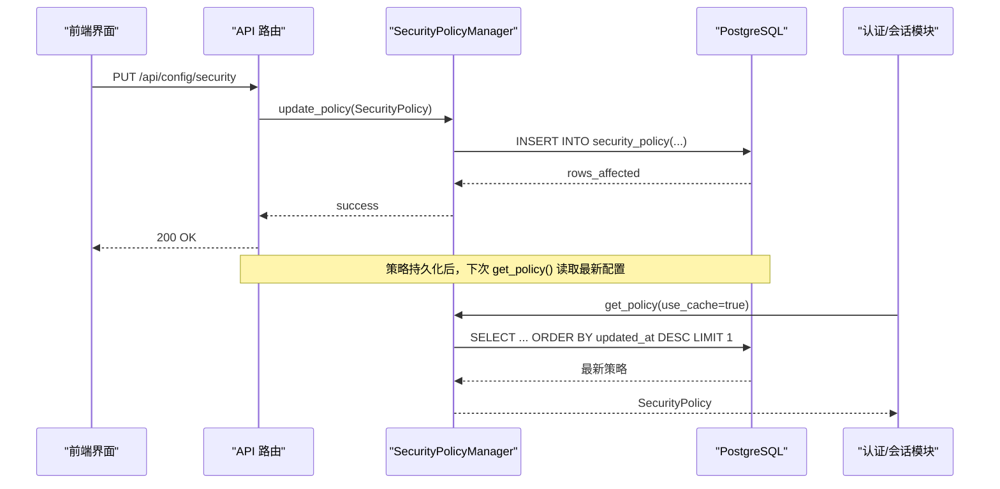
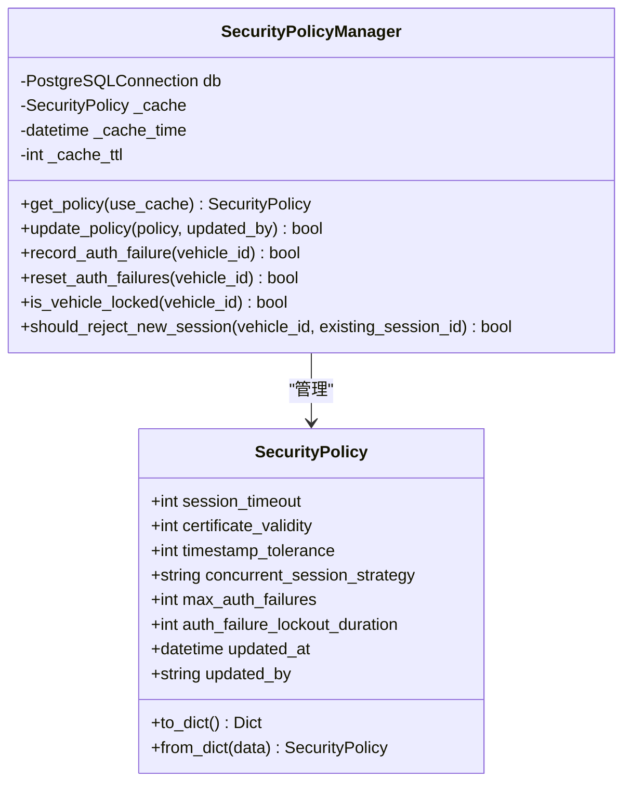
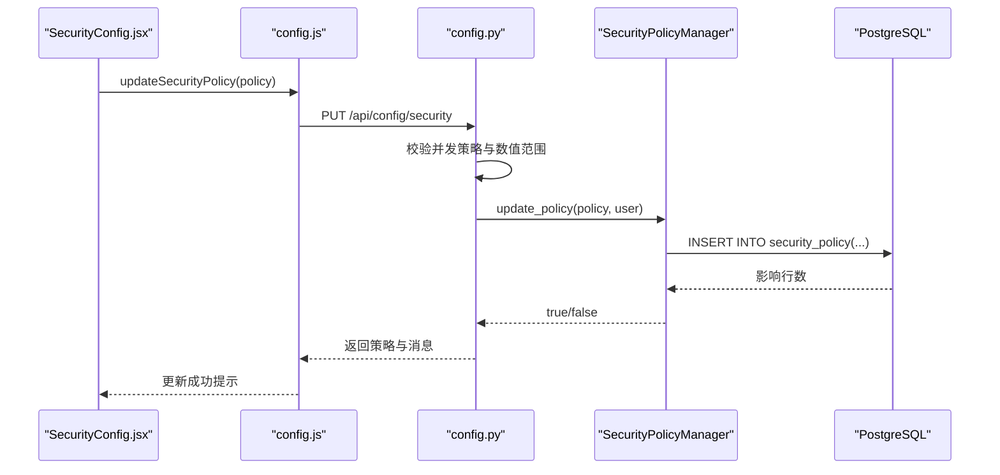
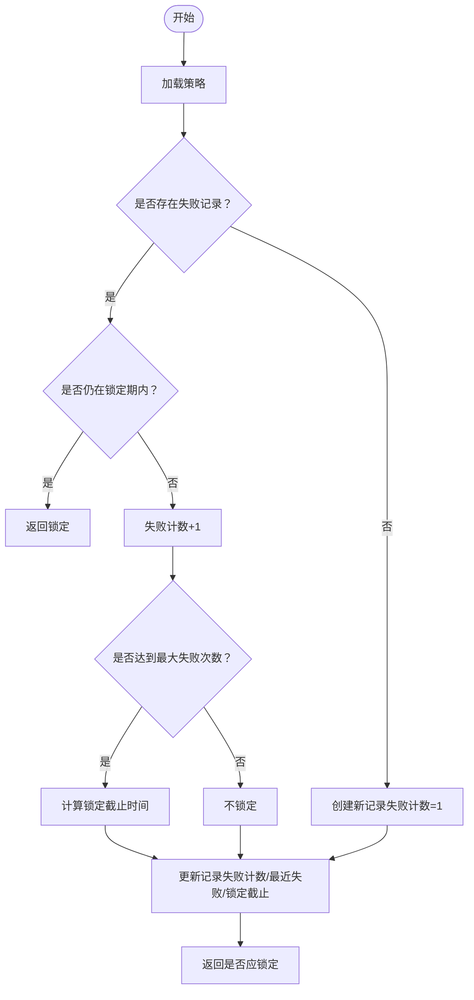
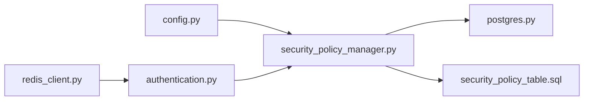

# 安全策略扩展

<cite>
**本文引用的文件**
- [security_policy_manager.py](file://src/security_policy_manager.py)
- [schema.sql](file://db/schema.sql)
- [003_security_policy_table.sql](file://db/migrations/003_security_policy_table.sql)
- [config.py](file://src/api/routes/config.py)
- [main.py](file://src/api/main.py)
- [authentication.py](file://src/authentication.py)
- [session.py](file://src/models/session.py)
- [postgres.py](file://src/db/postgres.py)
- [redis_client.py](file://src/db/redis_client.py)
- [test_api.py](file://tests/test_api.py)
- [init_data.sql](file://db/init_data.sql)
- [config.js](file://web/src/api/config.js)
- [SecurityConfig.jsx](file://web/src/pages/SecurityConfig.jsx)
- [test_auth_failure_lockout.py](file://test_auth_failure_lockout.py)
- [message.py](file://src/models/message.py)
</cite>

## 目录
1. [简介](#简介)
2. [项目结构](#项目结构)
3. [核心组件](#核心组件)
4. [架构总览](#架构总览)
5. [详细组件分析](#详细组件分析)
6. [依赖分析](#依赖分析)
7. [性能考量](#性能考量)
8. [故障排查指南](#故障排查指南)
9. [结论](#结论)
10. [附录](#附录)

## 简介
本文件面向车联网安全通信网关的安全策略扩展开发，聚焦于 SecurityPolicyManager 的扩展机制与自定义策略实现方法，系统阐述安全策略的数据结构设计、配置参数含义、新增字段与验证规则的添加方式，以及策略缓存与数据库持久化实现细节。同时给出认证失败锁定、会话管理、时间戳容差等策略的具体扩展示例，说明策略版本管理与向后兼容性考虑，并提供完整的开发指南与最佳实践。

## 项目结构
安全策略相关的核心文件分布如下：
- 策略管理与数据模型：src/security_policy_manager.py
- 数据库架构与约束：db/schema.sql、db/migrations/003_security_policy_table.sql、db/init_data.sql
- API 路由与前端交互：src/api/routes/config.py、web/src/api/config.js、web/src/pages/SecurityConfig.jsx
- 会话与认证集成：src/authentication.py、src/models/session.py
- 数据访问层：src/db/postgres.py、src/db/redis_client.py
- 测试与示例：tests/test_api.py、test_auth_failure_lockout.py

**图表来源**
- [security_policy_manager.py:19-56](file://src/security_policy_manager.py#L19-L56)
- [security_policy_manager.py:59-322](file://src/security_policy_manager.py#L59-L322)
- [schema.sql:64-104](file://db/schema.sql#L64-L104)
- [config.py:20-173](file://src/api/routes/config.py#L20-L173)
- [authentication.py:366-662](file://src/authentication.py#L366-L662)
- [config.js:1-11](file://web/src/api/config.js#L1-L11)
- [SecurityConfig.jsx:85-118](file://web/src/pages/SecurityConfig.jsx#L85-L118)

**章节来源**
- [security_policy_manager.py:1-322](file://src/security_policy_manager.py#L1-L322)
- [schema.sql:1-104](file://db/schema.sql#L1-L104)
- [config.py:1-173](file://src/api/routes/config.py#L1-L173)

## 核心组件
- SecurityPolicy 数据类：封装策略字段及序列化/反序列化方法，提供默认值与字典转换。
- SecurityPolicyManager：负责策略加载、缓存、持久化、认证失败记录与锁定、并发会话策略判定。
- API 路由：提供 GET/PUT /api/config/security，校验并发策略与数值范围，桥接管理器与数据库。
- 数据库表：security_policy（策略配置与约束）、auth_failure_records（认证失败锁定记录）。
- 会话与认证：在会话建立/关闭、认证流程中应用策略（会话超时、并发策略、锁定检查）。

**章节来源**
- [security_policy_manager.py:19-56](file://src/security_policy_manager.py#L19-L56)
- [security_policy_manager.py:59-322](file://src/security_policy_manager.py#L59-L322)
- [config.py:20-173](file://src/api/routes/config.py#L20-L173)
- [schema.sql:64-104](file://db/schema.sql#L64-L104)

## 架构总览
下图展示了安全策略从数据库加载、缓存、API 更新、到认证与会话流程的应用路径。

**图表来源**
- [config.py:108-173](file://src/api/routes/config.py#L108-L173)
- [security_policy_manager.py:127-167](file://src/security_policy_manager.py#L127-L167)
- [security_policy_manager.py:73-126](file://src/security_policy_manager.py#L73-L126)

## 详细组件分析

### SecurityPolicy 数据结构与配置参数
- 字段与含义
  - session_timeout：会话超时（秒），默认 86400；约束范围 300–604800。
  - certificate_validity：证书有效期（天），默认 365；约束范围 30–1825。
  - timestamp_tolerance：时间戳容差（秒），默认 300；约束范围 60–600。
  - concurrent_session_strategy：并发会话策略，默认 "reject_new"；可选 "terminate_old"。
  - max_auth_failures：最大认证失败次数（超过触发锁定），默认 5；约束范围 3–10。
  - auth_failure_lockout_duration：认证失败锁定时长（秒），默认 300；约束范围 60–3600。
  - updated_at/updated_by：策略更新时间与更新者，用于审计与溯源。
- 序列化/反序列化：to_dict()/from_dict()，便于 API 传输与数据库持久化。

**章节来源**
- [security_policy_manager.py:19-56](file://src/security_policy_manager.py#L19-L56)
- [schema.sql:64-81](file://db/schema.sql#L64-L81)
- [003_security_policy_table.sql:4-20](file://db/migrations/003_security_policy_table.sql#L4-L20)
- [init_data.sql:41-58](file://db/init_data.sql#L41-L58)

### SecurityPolicyManager 扩展机制
- 缓存策略：内存缓存 + TTL（默认 60 秒），避免频繁数据库访问；更新策略时主动清空缓存。
- 数据库交互：查询使用 ORDER BY updated_at DESC LIMIT 1 获取最新策略；更新采用 INSERT 方式保留历史。
- 认证失败锁定：记录失败次数、首次/最近失败时间、锁定截止时间；支持查询锁定状态与重置。
- 并发会话策略：根据策略决定拒绝新会话或终止旧会话；与会话模块配合实现冲突处理。

**图表来源**
- [security_policy_manager.py:19-56](file://src/security_policy_manager.py#L19-L56)
- [security_policy_manager.py:59-322](file://src/security_policy_manager.py#L59-L322)

**章节来源**
- [security_policy_manager.py:59-322](file://src/security_policy_manager.py#L59-L322)

### API 路由与前端集成
- GET /api/config/security：从数据库加载最新策略，返回给前端。
- PUT /api/config/security：接收前端配置，进行并发策略与数值范围校验，调用管理器持久化。
- 前端页面 SecurityConfig.jsx 与 config.js 提供配置表单与调用接口。

**图表来源**
- [config.py:108-173](file://src/api/routes/config.py#L108-L173)
- [config.js:8-11](file://web/src/api/config.js#L8-L11)
- [SecurityConfig.jsx:85-118](file://web/src/pages/SecurityConfig.jsx#L85-L118)

**章节来源**
- [config.py:64-173](file://src/api/routes/config.py#L64-L173)
- [config.js:1-11](file://web/src/api/config.js#L1-L11)
- [SecurityConfig.jsx:85-118](file://web/src/pages/SecurityConfig.jsx#L85-L118)
- [test_api.py:82-100](file://tests/test_api.py#L82-L100)

### 认证失败锁定与会话管理集成
- 锁定逻辑：记录失败次数与最近失败时间；若失败次数达到阈值则计算锁定截止时间；查询时若未到期则判定为锁定。
- 重置逻辑：认证成功时删除失败记录，解除锁定。
- 会话冲突：根据策略选择拒绝新会话或终止旧会话；与 establish_session/close_session 协同。

**图表来源**
- [security_policy_manager.py:169-230](file://src/security_policy_manager.py#L169-L230)

**章节来源**
- [security_policy_manager.py:169-230](file://src/security_policy_manager.py#L169-L230)
- [authentication.py:366-662](file://src/authentication.py#L366-L662)

### 时间戳容差与消息验证
- 策略字段 timestamp_tolerance 默认 300 秒，用于消息时间戳验证的容差范围。
- 消息模型 SecureMessage 的 validate() 方法结合当前时间与容差进行校验，确保时间戳在合理范围内。

**章节来源**
- [security_policy_manager.py:282-292](file://src/security_policy_manager.py#L282-L292)
- [message.py:153-188](file://src/models/message.py#L153-L188)

### 策略版本管理与向后兼容
- 版本策略：通过 ORDER BY updated_at DESC LIMIT 1 获取最新策略，实现“版本即时间戳”的自然排序。
- 向后兼容：数据库约束与默认值确保新增字段具备合理默认值；API 层对并发策略进行白名单校验。
- 历史追踪：每次更新写入一条新记录，保留 updated_at/updated_by，便于审计与回溯。

**章节来源**
- [security_policy_manager.py:88-114](file://src/security_policy_manager.py#L88-L114)
- [schema.sql:64-81](file://db/schema.sql#L64-L81)
- [003_security_policy_table.sql:4-20](file://db/migrations/003_security_policy_table.sql#L4-L20)
- [config.py:126-131](file://src/api/routes/config.py#L126-L131)

## 依赖分析
- 组件耦合
  - SecurityPolicyManager 依赖 PostgreSQLConnection 进行数据库操作，依赖 SecurityPolicy 数据模型。
  - API 路由依赖 SecurityPolicyManager 与 PostgreSQLConfig/PostgreSQLConnection。
  - 认证/会话模块依赖 SecurityPolicyManager 获取策略并应用到会话生命周期。
- 外部依赖
  - PostgreSQL：存储策略与失败记录。
  - Redis：会话存储与映射（与策略协同工作）。

**图表来源**
- [config.py:13-15](file://src/api/routes/config.py#L13-L15)
- [security_policy_manager.py:16-68](file://src/security_policy_manager.py#L16-L68)
- [postgres.py:9-53](file://src/db/postgres.py#L9-L53)
- [redis_client.py:8-79](file://src/db/redis_client.py#L8-L79)

**章节来源**
- [config.py:13-15](file://src/api/routes/config.py#L13-L15)
- [security_policy_manager.py:16-68](file://src/security_policy_manager.py#L16-L68)
- [postgres.py:9-53](file://src/db/postgres.py#L9-L53)
- [redis_client.py:8-79](file://src/db/redis_client.py#L8-L79)

## 性能考量
- 缓存命中：默认 60 秒 TTL，降低数据库压力；更新策略时主动失效缓存。
- 数据库约束：策略表与失败记录表均建立索引，提升查询效率。
- API 与会话：策略读取为轻量级操作，对认证/会话性能影响有限；建议在高并发场景下结合缓存与连接池优化。

[本节为通用性能讨论，无需特定文件引用]

## 故障排查指南
- 策略更新失败
  - 检查 API 返回状态码与异常信息；确认并发策略值为 "reject_new" 或 "terminate_old"。
  - 核对数据库约束是否满足范围要求。
- 认证失败锁定异常
  - 使用测试脚本模拟失败记录，检查 auth_failure_records 表数据与锁定截止时间。
  - 确认策略中的 max_auth_failures 与 auth_failure_lockout_duration 设置。
- 会话冲突处理
  - 检查 Redis 中 vehicle:<id>:session 映射与 session:<id> 内容；确认策略为 "reject_new" 或 "terminate_old"。

**章节来源**
- [config.py:108-173](file://src/api/routes/config.py#L108-L173)
- [security_policy_manager.py:169-230](file://src/security_policy_manager.py#L169-L230)
- [test_auth_failure_lockout.py:119-152](file://test_auth_failure_lockout.py#L119-L152)

## 结论
SecurityPolicyManager 提供了清晰的策略扩展点：通过数据类字段扩展、数据库约束与 API 校验、缓存与持久化机制，以及与认证/会话模块的紧密集成，实现了灵活且可审计的安全策略管理。遵循本文的扩展与最佳实践，可在不破坏向后兼容性的前提下，平滑引入新的策略字段与验证规则。

[本节为总结性内容，无需特定文件引用]

## 附录

### 自定义策略字段与验证规则添加步骤
- 数据库层
  - 在 security_policy 表中添加新字段，并添加相应 CHECK 约束与默认值。
  - 更新迁移脚本与初始化数据，确保存量实例具备默认值。
- 策略模型层
  - 在 SecurityPolicy 数据类中添加字段与默认值；完善 to_dict()/from_dict()。
- API 层
  - 在 Pydantic 模型中添加字段与范围校验；在 PUT 路由中进行策略校验。
- 管理器层
  - 在 SecurityPolicyManager.get_policy()/update_policy() 中读取/写入新字段。
- 集成层
  - 在认证/会话模块中调用新策略参数，确保逻辑正确性。
- 测试与前端
  - 编写单元/集成测试覆盖新字段；更新前端表单与校验提示。

**章节来源**
- [schema.sql:64-81](file://db/schema.sql#L64-L81)
- [003_security_policy_table.sql:4-20](file://db/migrations/003_security_policy_table.sql#L4-L20)
- [init_data.sql:41-58](file://db/init_data.sql#L41-L58)
- [security_policy_manager.py:19-56](file://src/security_policy_manager.py#L19-L56)
- [config.py:20-55](file://src/api/routes/config.py#L20-L55)

### 扩展示例：新增“最大并发会话数”策略
- 数据库
  - 新增 max_concurrent_sessions 字段与 CHECK 约束。
- 模型
  - 在 SecurityPolicy 中添加字段与默认值。
- API
  - 在 Pydantic 模型中添加字段与范围校验。
- 管理器
  - 在 get_policy() 中读取新字段；在 should_reject_new_session() 中结合现有策略与新字段共同决策。
- 集成
  - 在会话建立流程中检查并发上限，必要时拒绝或终止旧会话。
- 测试
  - 编写测试覆盖新增逻辑与边界条件。

**章节来源**
- [security_policy_manager.py:298-309](file://src/security_policy_manager.py#L298-L309)
- [authentication.py:599-662](file://src/authentication.py#L599-L662)