# 扩展与定制

<cite>
**本文档引用的文件**
- [security_gateway.py](file://src/security_gateway.py)
- [authentication.py](file://src/authentication.py)
- [certificate_manager.py](file://src/certificate_manager.py)
- [secure_messaging.py](file://src/secure_messaging.py)
- [security_policy_manager.py](file://src/security_policy_manager.py)
- [audit_logger.py](file://src/audit_logger.py)
- [secure_key_storage.py](file://src/secure_key_storage.py)
- [certificate_cache.py](file://src/certificate_cache.py)
- [main.py](file://src/api/main.py)
- [config.py](file://src/api/routes/config.py)
- [vehicles.py](file://src/api/routes/vehicles.py)
- [sm2.py](file://src/crypto/sm2.py)
- [sm4.py](file://src/crypto/sm4.py)
- [postgres.py](file://src/db/postgres.py)
- [redis_client.py](file://src/db/redis_client.py)
- [database.py](file://config/database.py)
- [enums.py](file://src/models/enums.py)
</cite>

## 目录
1. [简介](#简介)
2. [项目结构](#项目结构)
3. [核心组件](#核心组件)
4. [架构总览](#架构总览)
5. [详细组件分析](#详细组件分析)
6. [依赖分析](#依赖分析)
7. [性能考虑](#性能考虑)
8. [故障排查指南](#故障排查指南)
9. [结论](#结论)
10. [附录](#附录)

## 简介
本文件面向车联网安全通信网关的扩展与定制开发者，系统阐述插件架构与扩展点设计、自定义安全策略与认证机制开发、第三方系统集成方法与接口规范、API扩展与功能定制指导原则、配置管理与动态更新实现方式、安全策略定制与证书颁发机构扩展示例、以及性能扩展与高可用部署建议。目标是帮助系统集成商与定制开发者在不破坏核心安全机制的前提下，灵活扩展能力并稳定落地。

## 项目结构
系统采用分层与模块化组织，核心分为：
- 安全核心层：网关主控、认证、证书管理、消息安全、密钥存储、审计日志
- 加密算法层：SM2/SM4 国密算法实现
- 数据访问层：PostgreSQL 与 Redis 连接封装
- API 层：FastAPI 路由与认证
- 配置层：数据库连接配置

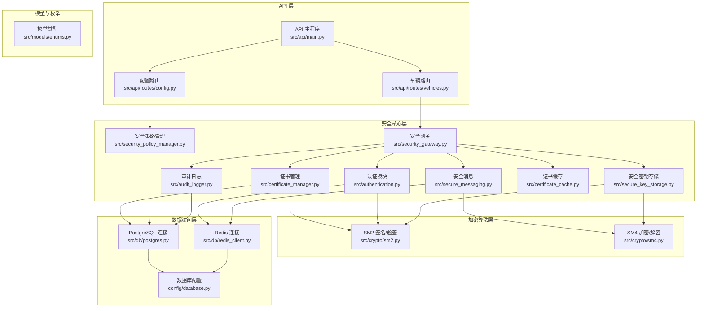

**图表来源**
- [main.py:1-108](file://src/api/main.py#L1-L108)
- [vehicles.py:1-447](file://src/api/routes/vehicles.py#L1-L447)
- [config.py:1-173](file://src/api/routes/config.py#L1-L173)
- [security_gateway.py:1-800](file://src/security_gateway.py#L1-L800)
- [authentication.py:1-662](file://src/authentication.py#L1-L662)
- [certificate_manager.py:1-734](file://src/certificate_manager.py#L1-L734)
- [secure_messaging.py:1-249](file://src/secure_messaging.py#L1-L249)
- [security_policy_manager.py:1-322](file://src/security_policy_manager.py#L1-L322)
- [audit_logger.py:1-480](file://src/audit_logger.py#L1-L480)
- [secure_key_storage.py:1-380](file://src/secure_key_storage.py#L1-L380)
- [certificate_cache.py:1-156](file://src/certificate_cache.py#L1-L156)
- [sm2.py:1-265](file://src/crypto/sm2.py#L1-L265)
- [sm4.py:1-189](file://src/crypto/sm4.py#L1-L189)
- [postgres.py:1-53](file://src/db/postgres.py#L1-L53)
- [redis_client.py:1-79](file://src/db/redis_client.py#L1-L79)
- [database.py:1-50](file://config/database.py#L1-L50)
- [enums.py:1-56](file://src/models/enums.py#L1-L56)

**章节来源**
- [main.py:1-108](file://src/api/main.py#L1-L108)
- [database.py:1-50](file://config/database.py#L1-L50)

## 核心组件
- 安全网关主控：统一编排证书颁发/验证、双向认证、会话管理、安全消息收发、审计日志与密钥轮换
- 认证模块：实现挑战-响应、车云双向认证、会话建立与清理、并发会话冲突处理
- 证书管理：颁发、验证、撤销、CRL 管理、证书链与过期检查、审计日志
- 安全消息：SM4 加密、SM2 签名、时间戳与 nonce 防重放、解密与校验
- 安全策略管理：策略模型、缓存、持久化、认证失败锁定与并发策略
- 审计日志：事件记录、查询、导出报告
- 安全密钥存储：模拟 HSM 的密钥存储、轮换、安全清除
- 证书缓存：LRU 缓存提升验证性能
- API 路由：车辆状态、安全策略配置等管理接口

**章节来源**
- [security_gateway.py:37-800](file://src/security_gateway.py#L37-L800)
- [authentication.py:90-662](file://src/authentication.py#L90-L662)
- [certificate_manager.py:206-734](file://src/certificate_manager.py#L206-L734)
- [secure_messaging.py:17-249](file://src/secure_messaging.py#L17-L249)
- [security_policy_manager.py:19-322](file://src/security_policy_manager.py#L19-L322)
- [audit_logger.py:26-480](file://src/audit_logger.py#L26-L480)
- [secure_key_storage.py:27-380](file://src/secure_key_storage.py#L27-L380)
- [certificate_cache.py:13-156](file://src/certificate_cache.py#L13-L156)
- [config.py:20-173](file://src/api/routes/config.py#L20-L173)
- [vehicles.py:22-447](file://src/api/routes/vehicles.py#L22-L447)

## 架构总览
系统采用“核心服务 + 插件化扩展”的架构：
- 核心服务：安全网关主控，负责编排与调度
- 扩展点：策略、认证、消息、证书、密钥、缓存、审计、API 路由
- 数据通道：PostgreSQL（证书、策略、审计）、Redis（会话、缓存）
- 加密算法：SM2/SM4 国密算法

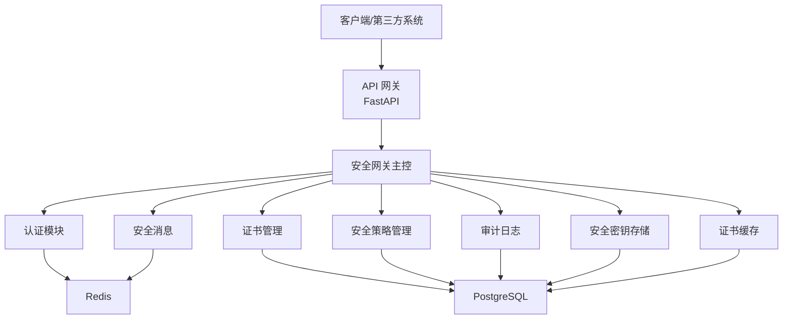

**图表来源**
- [security_gateway.py:37-800](file://src/security_gateway.py#L37-L800)
- [authentication.py:196-662](file://src/authentication.py#L196-L662)
- [certificate_manager.py:206-734](file://src/certificate_manager.py#L206-L734)
- [secure_messaging.py:17-249](file://src/secure_messaging.py#L17-L249)
- [security_policy_manager.py:59-322](file://src/security_policy_manager.py#L59-L322)
- [audit_logger.py:26-480](file://src/audit_logger.py#L26-L480)
- [secure_key_storage.py:27-380](file://src/secure_key_storage.py#L27-L380)
- [certificate_cache.py:13-156](file://src/certificate_cache.py#L13-L156)
- [postgres.py:9-53](file://src/db/postgres.py#L9-L53)
- [redis_client.py:8-79](file://src/db/redis_client.py#L8-L79)

## 详细组件分析

### 安全网关主控（扩展点与控制流）
- 扩展点
  - 证书颁发/验证：可注入自定义 CA 与证书链策略
  - 认证流程：可替换挑战-响应与令牌签发策略
  - 会话管理：可调整并发策略与会话密钥轮换
  - 消息安全：可替换加密算法或消息格式
  - 审计日志：可扩展事件类型与导出格式
- 控制流
  - 车辆接入：证书验证 → 双向认证 → 会话建立 → 审计记录
  - 数据传输：消息签名/加密 → 验证/解密 → 防重放 → 审计记录

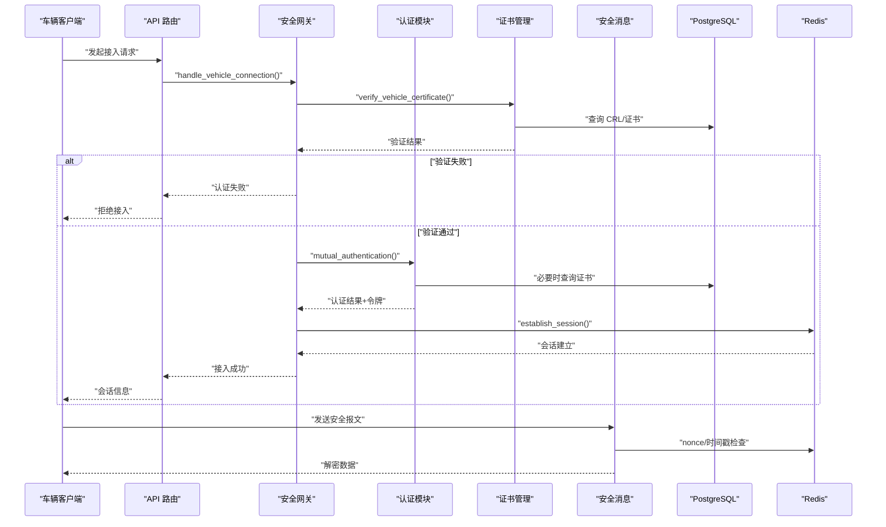

**图表来源**
- [security_gateway.py:353-438](file://src/security_gateway.py#L353-L438)
- [authentication.py:196-364](file://src/authentication.py#L196-L364)
- [certificate_manager.py:206-331](file://src/certificate_manager.py#L206-L331)
- [secure_messaging.py:144-249](file://src/secure_messaging.py#L144-L249)
- [postgres.py:32-45](file://src/db/postgres.py#L32-L45)
- [redis_client.py:51-71](file://src/db/redis_client.py#L51-L71)

**章节来源**
- [security_gateway.py:129-438](file://src/security_gateway.py#L129-L438)
- [authentication.py:196-364](file://src/authentication.py#L196-L364)
- [certificate_manager.py:206-331](file://src/certificate_manager.py#L206-L331)
- [secure_messaging.py:144-249](file://src/secure_messaging.py#L144-L249)

### 认证与会话（扩展点与并发策略）
- 扩展点
  - 挑战-响应算法可替换
  - 令牌结构与权限模型可定制
  - 并发会话策略：拒绝新会话或终止旧会话
  - 认证失败锁定与重试策略
- 并发与冲突
  - 通过 Redis 维护 vehicle→session 映射
  - 支持策略级冲突处理

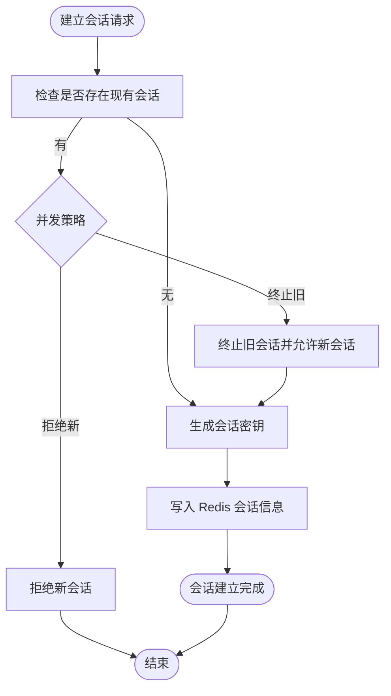

**图表来源**
- [authentication.py:599-662](file://src/authentication.py#L599-L662)
- [redis_client.py:51-71](file://src/db/redis_client.py#L51-L71)

**章节来源**
- [authentication.py:366-662](file://src/authentication.py#L366-L662)
- [security_policy_manager.py:298-310](file://src/security_policy_manager.py#L298-L310)

### 证书管理（扩展点与 CRL/链）
- 扩展点
  - 证书颁发：可定制主题、扩展、有效期
  - 证书验证：可扩展证书链、撤销检查、缓存策略
  - CRL 管理：可替换数据库查询与缓存失效
- 性能
  - LRU 缓存默认 10000 条，TTL 5 分钟

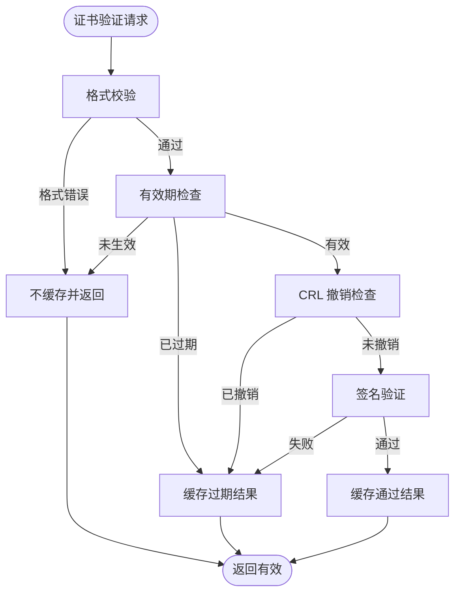

**图表来源**
- [certificate_manager.py:206-331](file://src/certificate_manager.py#L206-L331)
- [certificate_cache.py:35-93](file://src/certificate_cache.py#L35-L93)

**章节来源**
- [certificate_manager.py:206-471](file://src/certificate_manager.py#L206-L471)
- [certificate_cache.py:13-156](file://src/certificate_cache.py#L13-L156)

### 安全消息（SM4/SM2 扩展点）
- 扩展点
  - 加密算法：可替换为其他对称算法
  - 签名算法：可替换为其他非对称算法
  - 消息头与负载格式：可定制消息类型与字段
- 防重放
  - nonce 唯一性检查，TTL 600 秒

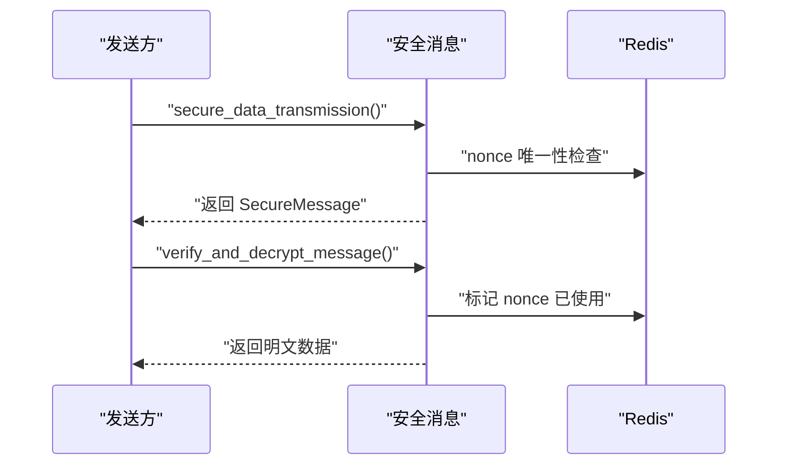

**图表来源**
- [secure_messaging.py:17-249](file://src/secure_messaging.py#L17-L249)
- [redis_client.py:51-71](file://src/db/redis_client.py#L51-L71)

**章节来源**
- [secure_messaging.py:17-249](file://src/secure_messaging.py#L17-L249)

### 安全策略管理（动态配置与缓存）
- 扩展点
  - 策略字段：会话超时、证书有效期、时间戳容差、并发策略、认证失败锁定
  - 缓存：默认 TTL 60 秒，降低数据库压力
  - 认证失败记录：支持锁定与重置
- 接口
  - GET /api/config/security：获取策略
  - PUT /api/config/security：更新策略并持久化

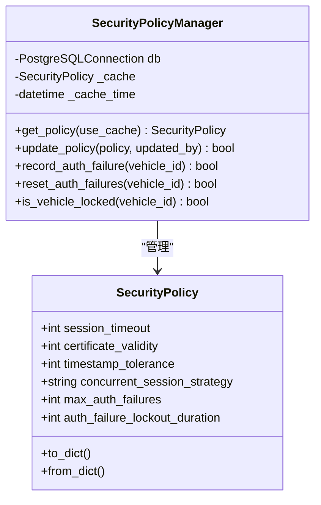

**图表来源**
- [security_policy_manager.py:19-322](file://src/security_policy_manager.py#L19-L322)
- [config.py:20-173](file://src/api/routes/config.py#L20-L173)

**章节来源**
- [security_policy_manager.py:59-322](file://src/security_policy_manager.py#L59-L322)
- [config.py:64-173](file://src/api/routes/config.py#L64-L173)

### 审计日志（事件类型与导出）
- 事件类型
  - 认证事件、数据传输、证书操作、签名验证
- 功能
  - 事件记录、查询、JSON/CSV 导出

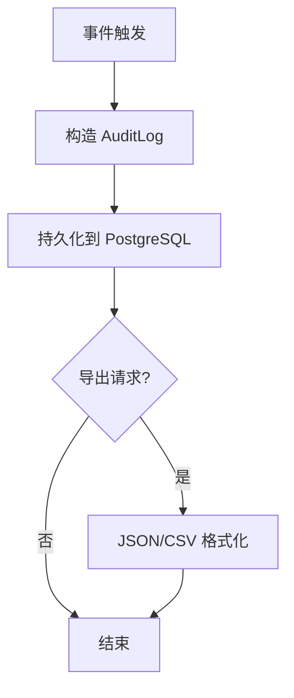

**图表来源**
- [audit_logger.py:8-480](file://src/audit_logger.py#L8-L480)
- [enums.py:35-47](file://src/models/enums.py#L35-L47)

**章节来源**
- [audit_logger.py:26-480](file://src/audit_logger.py#L26-L480)
- [enums.py:1-56](file://src/models/enums.py#L1-L56)

### 安全密钥存储（HSM 模拟与轮换）
- 能力
  - CA 私钥与会话密钥安全存储
  - 自动轮换与安全清除
  - 元数据追踪与线程安全
- 建议
  - 生产环境替换为真实 HSM 或 TPM

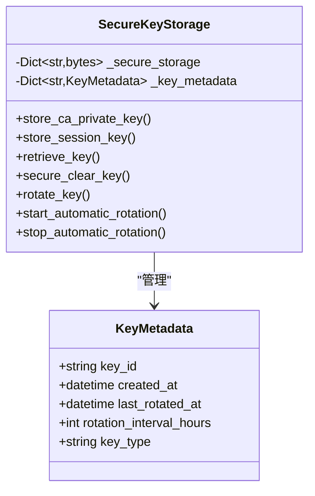

**图表来源**
- [secure_key_storage.py:27-380](file://src/secure_key_storage.py#L27-L380)

**章节来源**
- [secure_key_storage.py:27-380](file://src/secure_key_storage.py#L27-L380)

### API 扩展与第三方集成
- API 认证
  - HTTP Bearer Token（简化实现，生产建议 JWT）
- 路由扩展
  - 车辆状态监控、安全指标、证书管理、审计日志、配置管理
- 第三方集成
  - 通过 API 路由对接外部系统
  - 使用统一的认证令牌与错误码

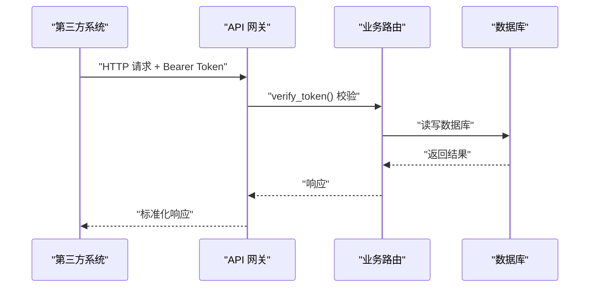

**图表来源**
- [main.py:49-74](file://src/api/main.py#L49-L74)
- [vehicles.py:38-238](file://src/api/routes/vehicles.py#L38-L238)
- [config.py:64-173](file://src/api/routes/config.py#L64-L173)

**章节来源**
- [main.py:1-108](file://src/api/main.py#L1-L108)
- [vehicles.py:1-447](file://src/api/routes/vehicles.py#L1-L447)
- [config.py:1-173](file://src/api/routes/config.py#L1-L173)

## 依赖分析
- 组件耦合
  - 安全网关主控聚合认证、证书、消息、策略、审计、密钥、缓存
  - API 路由依赖策略管理与数据库连接
- 外部依赖
  - PostgreSQL：证书、策略、审计、车辆数据
  - Redis：会话、缓存、nonce 标记
  - 国密算法：SM2/SM4

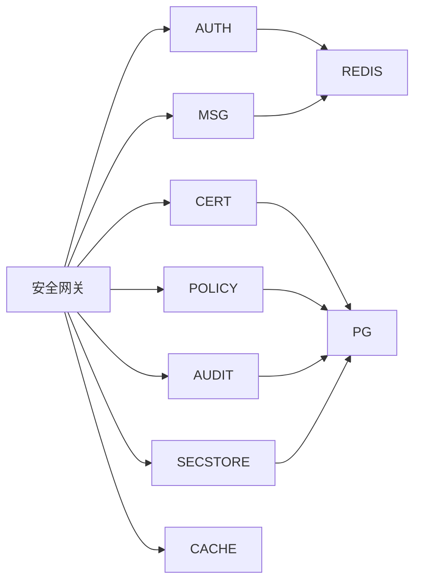

**图表来源**
- [security_gateway.py:1-128](file://src/security_gateway.py#L1-L128)
- [postgres.py:9-53](file://src/db/postgres.py#L9-L53)
- [redis_client.py:8-79](file://src/db/redis_client.py#L8-L79)

**章节来源**
- [security_gateway.py:1-128](file://src/security_gateway.py#L1-L128)
- [postgres.py:1-53](file://src/db/postgres.py#L1-L53)
- [redis_client.py:1-79](file://src/db/redis_client.py#L1-L79)

## 性能考虑
- 证书验证缓存：默认 LRU 10000，TTL 5 分钟，显著降低数据库压力
- 策略缓存：默认 TTL 60 秒，减少频繁查询
- 会话清理：Redis TTL 自动清理过期键，减少主动扫描
- 加密算法：SM4/SM2 符合国密标准，兼顾性能与安全
- 建议
  - 高并发场景下增加 Redis 哨兵/集群与数据库连接池
  - 对热点查询建立合适索引（如证书序列号、会话键）

[本节为通用性能建议，无需特定文件引用]

## 故障排查指南
- 认证失败
  - 检查证书有效期与撤销状态
  - 核对时间戳容差与重放攻击防护
  - 查看审计日志事件类型（签名失败、重放攻击、时间戳过期）
- 会话异常
  - 检查并发策略与冲突处理
  - 确认 Redis 会话键与映射关系
- 密钥问题
  - 确认密钥轮换与安全清除流程
  - 生产环境使用 HSM 替代模拟存储
- API 认证
  - 校验 Bearer Token 与环境变量配置

**章节来源**
- [audit_logger.py:90-241](file://src/audit_logger.py#L90-L241)
- [enums.py:6-18](file://src/models/enums.py#L6-L18)
- [authentication.py:599-662](file://src/authentication.py#L599-L662)
- [secure_key_storage.py:139-174](file://src/secure_key_storage.py#L139-L174)

## 结论
本系统通过清晰的扩展点与模块化设计，在保证车联网通信安全的前提下，提供了灵活的定制空间。开发者可在认证、策略、消息、证书、密钥与审计等方面进行扩展，同时依托 API 路由与数据库连接实现第三方系统集成。建议在生产环境中强化密钥存储（HSM）、完善认证令牌机制（JWT）、优化数据库与缓存策略，以满足高并发与高可用需求。

[本节为总结性内容，无需特定文件引用]

## 附录

### API 扩展与功能定制指导原则
- 遵循现有路由命名与响应结构
- 使用统一的认证中间件与错误码
- 对新增接口进行审计日志记录
- 保持与数据库 schema 的兼容性

**章节来源**
- [main.py:13-108](file://src/api/main.py#L13-L108)
- [enums.py:6-18](file://src/models/enums.py#L6-L18)

### 配置管理与动态更新
- 通过 /api/config/security 动态更新安全策略
- 策略变更立即生效，数据库持久化
- 建议配合审计日志追踪策略变更

**章节来源**
- [config.py:64-173](file://src/api/routes/config.py#L64-L173)
- [security_policy_manager.py:127-167](file://src/security_policy_manager.py#L127-L167)

### 安全策略定制与证书颁发机构扩展示例
- 自定义证书主题与扩展
- 扩展证书链验证逻辑
- 自定义 CRL 管理与缓存失效策略

**章节来源**
- [certificate_manager.py:50-63](file://src/certificate_manager.py#L50-L63)
- [certificate_manager.py:473-518](file://src/certificate_manager.py#L473-L518)
- [certificate_manager.py:413-416](file://src/certificate_manager.py#L413-L416)

### 性能扩展与高可用部署建议
- Redis 集群与哨兵，数据库连接池
- 证书缓存与策略缓存参数调优
- API 限流与熔断，分布式部署

[本节为通用建议，无需特定文件引用]