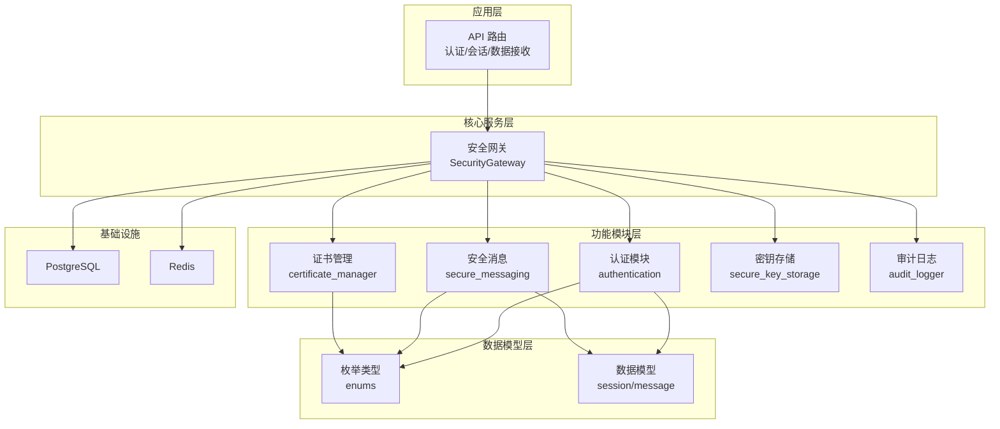
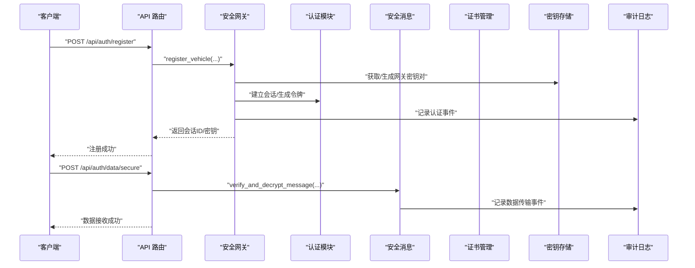
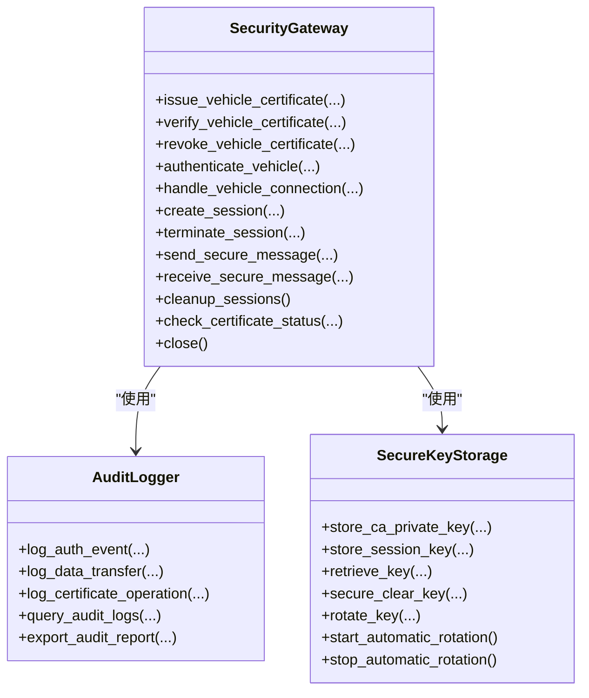
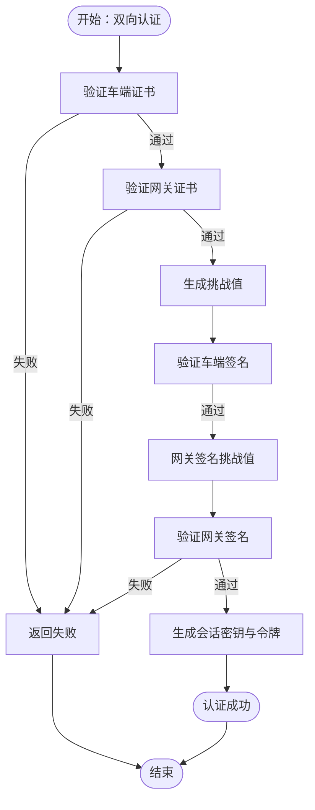
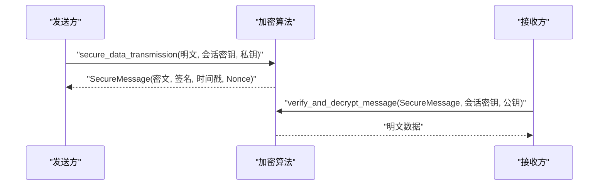
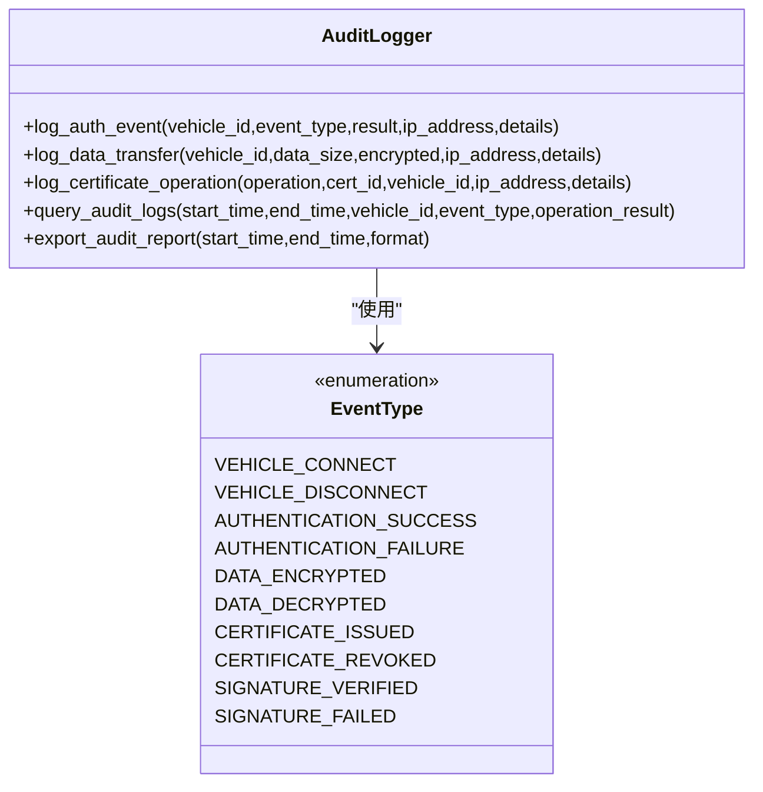
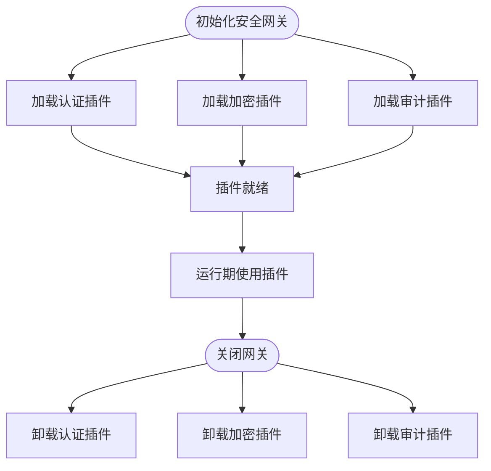
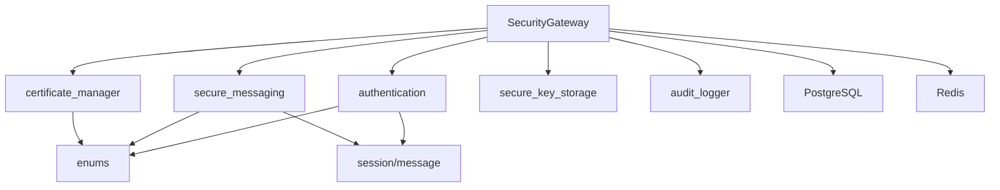

# 插件开发框架

<cite>
**本文档引用的文件**
- [security_gateway.py](file://src/security_gateway.py)
- [authentication.py](file://src/authentication.py)
- [audit_logger.py](file://src/audit_logger.py)
- [secure_messaging.py](file://src/secure_messaging.py)
- [secure_key_storage.py](file://src/secure_key_storage.py)
- [certificate_manager.py](file://src/certificate_manager.py)
- [enums.py](file://src/models/enums.py)
- [session.py](file://src/models/session.py)
- [message.py](file://src/models/message.py)
- [main.py](file://src/api/main.py)
- [auth.py](file://src/api/routes/auth.py)
- [security_gateway_demo.py](file://examples/security_gateway_demo.py)
- [test_authentication.py](file://tests/test_authentication.py)
- [test_audit_logger.py](file://tests/test_audit_logger.py)
</cite>

## 目录
1. [引言](#引言)
2. [项目结构](#项目结构)
3. [核心组件](#核心组件)
4. [架构总览](#架构总览)
5. [详细组件分析](#详细组件分析)
6. [依赖分析](#依赖分析)
7. [性能考虑](#性能考虑)
8. [故障排除指南](#故障排除指南)
9. [结论](#结论)
10. [附录](#附录)

## 引言
本文件面向车联网安全通信网关的插件开发者，系统阐述插件开发框架的设计理念、扩展点识别、接口规范与生命周期管理机制。文档重点覆盖以下目标：
- 识别系统中的插件扩展点（认证、加密算法、审计）
- 规范插件接口与生命周期管理
- 提供插件注册、加载与卸载的实现方法
- 说明插件配置管理与依赖注入的开发指南
- 描述插件间通信机制与数据共享方案
- 提供开发模板与测试方法

## 项目结构
项目采用分层与功能域结合的组织方式：
- 核心服务层：安全网关主类负责编排证书管理、身份认证、加密传输与审计日志
- 功能模块层：认证、加密、密钥存储、证书管理、消息处理、审计日志
- 数据模型层：枚举、会话、消息等数据结构
- API 层：FastAPI 路由与认证令牌校验
- 示例与测试：演示脚本与单元测试

图表来源
- [security_gateway.py:37-800](file://src/security_gateway.py#L37-L800)
- [authentication.py:1-662](file://src/authentication.py#L1-L662)
- [secure_messaging.py:1-249](file://src/secure_messaging.py#L1-L249)
- [certificate_manager.py:1-734](file://src/certificate_manager.py#L1-L734)
- [secure_key_storage.py:1-380](file://src/secure_key_storage.py#L1-L380)
- [audit_logger.py:1-480](file://src/audit_logger.py#L1-L480)
- [enums.py:1-56](file://src/models/enums.py#L1-L56)
- [session.py:1-104](file://src/models/session.py#L1-L104)
- [message.py:1-200](file://src/models/message.py#L1-L200)
- [main.py:1-108](file://src/api/main.py#L1-L108)
- [auth.py:1-685](file://src/api/routes/auth.py#L1-L685)

章节来源
- [security_gateway.py:37-800](file://src/security_gateway.py#L37-L800)
- [main.py:1-108](file://src/api/main.py#L1-L108)
- [auth.py:1-685](file://src/api/routes/auth.py#L1-L685)

## 核心组件
- 安全网关（SecurityGateway）：聚合证书管理、认证、会话、消息与审计能力，提供统一的对外接口
- 认证模块（authentication）：实现挑战-响应、双向认证、会话建立与清理
- 安全消息（secure_messaging）：实现加密传输与验证流程
- 证书管理（certificate_manager）：颁发、验证、撤销证书与 CRL 管理
- 审计日志（audit_logger）：统一记录认证、数据传输与证书操作事件
- 密钥存储（secure_key_storage）：模拟 HSM 的密钥安全存储、轮换与清理
- 数据模型（enums/session/message）：定义事件类型、会话状态、消息结构等

章节来源
- [security_gateway.py:37-800](file://src/security_gateway.py#L37-L800)
- [authentication.py:1-662](file://src/authentication.py#L1-L662)
- [secure_messaging.py:1-249](file://src/secure_messaging.py#L1-L249)
- [certificate_manager.py:1-734](file://src/certificate_manager.py#L1-L734)
- [audit_logger.py:1-480](file://src/audit_logger.py#L1-L480)
- [secure_key_storage.py:1-380](file://src/secure_key_storage.py#L1-L380)
- [enums.py:1-56](file://src/models/enums.py#L1-L56)
- [session.py:1-104](file://src/models/session.py#L1-L104)
- [message.py:1-200](file://src/models/message.py#L1-L200)

## 架构总览
下图展示插件扩展点与核心交互：

图表来源
- [auth.py:70-230](file://src/api/routes/auth.py#L70-L230)
- [security_gateway.py:353-438](file://src/security_gateway.py#L353-L438)
- [authentication.py:366-480](file://src/authentication.py#L366-L480)
- [secure_messaging.py:144-249](file://src/secure_messaging.py#L144-L249)
- [audit_logger.py:90-183](file://src/audit_logger.py#L90-L183)

## 详细组件分析

### 安全网关（SecurityGateway）扩展点
- 认证扩展点：双向认证、会话建立与清理
- 证书扩展点：证书颁发、验证、撤销与 CRL 管理
- 加密扩展点：安全消息发送与接收（SM2/SM4）
- 审计扩展点：统一审计日志记录
- 密钥扩展点：安全密钥存储、轮换与清理

图表来源
- [security_gateway.py:37-800](file://src/security_gateway.py#L37-L800)
- [audit_logger.py:26-480](file://src/audit_logger.py#L26-L480)
- [secure_key_storage.py:27-380](file://src/secure_key_storage.py#L27-L380)

章节来源
- [security_gateway.py:37-800](file://src/security_gateway.py#L37-L800)

### 认证插件开发指南
- 扩展点：双向认证、挑战响应、会话建立与冲突处理
- 接口规范：
  - 挑战生成与验证：generate_challenge()、verify_challenge()
  - 车端/网关认证：authenticate_vehicle()、authenticate_gateway()
  - 双向认证：mutual_authentication()
  - 会话管理：establish_session()、close_session()、handle_session_conflict()
- 生命周期管理：
  - 初始化：生成密钥对、颁发证书
  - 运行期：挑战-响应、会话建立、冲突处理
  - 关闭：会话关闭、密钥清理
- 依赖注入：通过参数传入数据库连接、Redis 连接、CA 公钥、CRL 列表等

图表来源
- [authentication.py:196-364](file://src/authentication.py#L196-L364)

章节来源
- [authentication.py:23-364](file://src/authentication.py#L23-L364)
- [session.py:72-104](file://src/models/session.py#L72-L104)

### 加密算法插件开发指南
- 扩展点：SM2/SM4 算法封装、消息头与报文结构
- 接口规范：
  - 加密传输：secure_data_transmission()
  - 验证解密：verify_and_decrypt_message()
  - 数据模型：MessageHeader、SecureMessage
- 生命周期管理：
  - 初始化：生成随机 nonce、时间戳
  - 运行期：SM4 加密、SM2 签名、Nonce 校验
  - 关闭：清理临时状态
- 依赖注入：通过参数传入会话密钥、发送方公钥、Redis 配置

图表来源
- [secure_messaging.py:17-142](file://src/secure_messaging.py#L17-L142)
- [secure_messaging.py:144-249](file://src/secure_messaging.py#L144-L249)
- [message.py:9-200](file://src/models/message.py#L9-L200)

章节来源
- [secure_messaging.py:17-249](file://src/secure_messaging.py#L17-L249)
- [message.py:9-200](file://src/models/message.py#L9-L200)

### 审计插件开发指南
- 扩展点：认证事件、数据传输事件、证书操作事件
- 接口规范：
  - 认证事件：log_auth_event()
  - 数据传输：log_data_transfer()
  - 证书操作：log_certificate_operation()
  - 查询与导出：query_audit_logs()、export_audit_report()
- 生命周期管理：
  - 初始化：创建数据库连接
  - 运行期：事件记录、持久化
  - 关闭：资源清理
- 依赖注入：通过构造函数注入数据库连接

图表来源
- [audit_logger.py:26-480](file://src/audit_logger.py#L26-L480)
- [enums.py:35-47](file://src/models/enums.py#L35-L47)

章节来源
- [audit_logger.py:26-480](file://src/audit_logger.py#L26-L480)
- [enums.py:35-47](file://src/models/enums.py#L35-L47)

### 插件注册、加载与卸载
- 注册：在安全网关初始化时注入插件实例（例如认证插件、加密插件、审计插件）
- 加载：通过依赖注入将数据库连接、Redis 连接、配置对象传递给插件
- 卸载：在网关关闭时调用插件的清理方法，释放资源

图表来源
- [security_gateway.py:46-128](file://src/security_gateway.py#L46-L128)
- [audit_logger.py:29-36](file://src/audit_logger.py#L29-L36)
- [authentication.py:366-480](file://src/authentication.py#L366-L480)
- [secure_messaging.py:17-142](file://src/secure_messaging.py#L17-L142)

章节来源
- [security_gateway.py:46-128](file://src/security_gateway.py#L46-L128)

### 插件配置管理与依赖注入
- 配置管理：通过环境变量与配置类（PostgreSQLConfig、RedisConfig）管理数据库与缓存连接
- 依赖注入：
  - 数据库连接：PostgreSQLConnection
  - 缓存连接：RedisConnection
  - 审计日志：AuditLogger
  - 密钥存储：SecureKeyStorage 单例
- 示例：API 路由中通过依赖注入获取用户身份与数据库连接

章节来源
- [auth.py:49-75](file://src/api/routes/auth.py#L49-L75)
- [auth.py:94-103](file://src/api/routes/auth.py#L94-L103)
- [main.py:13-47](file://src/api/main.py#L13-L47)

### 插件间通信机制与数据共享
- 通信机制：
  - API 路由层：FastAPI 路由处理请求，调用安全网关
  - 网关编排层：安全网关协调各模块协作
  - 数据共享：通过 Redis 存储会话信息、Nonce 校验；通过 PostgreSQL 存储审计日志与证书数据
- 数据共享：
  - 会话映射：vehicle:{id}:session -> session:{id}
  - Nonce 校验：nonce:{hex} -> used（TTL）

章节来源
- [auth.py:130-175](file://src/api/routes/auth.py#L130-L175)
- [authentication.py:421-480](file://src/authentication.py#L421-L480)
- [secure_messaging.py:205-241](file://src/secure_messaging.py#L205-L241)

## 依赖分析
- 模块耦合：
  - SecurityGateway 依赖认证、消息、证书、密钥存储、审计模块
  - 认证模块依赖枚举与会话模型
  - 安全消息依赖消息模型与 Redis 配置
  - 审计日志依赖 PostgreSQL 配置
- 外部依赖：
  - PostgreSQL：证书与审计日志存储
  - Redis：会话与 Nonce 缓存

图表来源
- [security_gateway.py:8-34](file://src/security_gateway.py#L8-L34)
- [authentication.py:11-21](file://src/authentication.py#L11-L21)
- [secure_messaging.py:9-15](file://src/secure_messaging.py#L9-L15)
- [certificate_manager.py:10-17](file://src/certificate_manager.py#L10-L17)
- [enums.py:1-56](file://src/models/enums.py#L1-L56)
- [session.py:1-7](file://src/models/session.py#L1-L7)
- [message.py:1-7](file://src/models/message.py#L1-L7)

章节来源
- [security_gateway.py:8-34](file://src/security_gateway.py#L8-L34)

## 性能考虑
- 缓存策略：证书验证使用 LRU 缓存（容量 10,000，TTL 5 分钟）
- 非对称加密：SM2 用于签名与密钥交换，SM4 用于数据加密
- 会话管理：Redis TTL 自动清理过期会话，减少主动扫描开销
- 审计日志：异步持久化，失败不阻塞主流程

章节来源
- [certificate_manager.py:257-331](file://src/certificate_manager.py#L257-L331)
- [authentication.py:554-597](file://src/authentication.py#L554-L597)
- [audit_logger.py:82-88](file://src/audit_logger.py#L82-L88)

## 故障排除指南
- 认证失败：
  - 检查证书有效性、撤销状态与签名
  - 核对时间戳与 Nonce 校验
- 数据传输失败：
  - 验证会话密钥与发送方公钥
  - 检查 Redis 中 Nonce 是否已使用
- 审计日志异常：
  - 数据库连接异常时记录失败但不中断主流程
- 会话冲突：
  - 支持“拒绝新会话”或“终止旧会话”策略

章节来源
- [authentication.py:599-662](file://src/authentication.py#L599-L662)
- [secure_messaging.py:144-249](file://src/secure_messaging.py#L144-L249)
- [audit_logger.py:82-88](file://src/audit_logger.py#L82-L88)

## 结论
本插件开发框架围绕安全网关的核心能力提供了清晰的扩展点与接口规范。通过依赖注入与模块化设计，开发者可以独立开发认证、加密与审计插件，并在运行期与核心服务协同工作。建议在开发过程中遵循接口规范、生命周期管理与配置注入的最佳实践，确保插件的可维护性与安全性。

## 附录

### 插件开发模板（认证插件）
- 输入参数：证书、私钥、公钥、数据库连接、Redis 连接
- 输出：认证结果（成功/失败）、会话密钥、令牌
- 生命周期：初始化 -> 认证 -> 会话建立 -> 关闭
- 依赖注入：通过构造函数或工厂方法注入依赖

章节来源
- [authentication.py:196-364](file://src/authentication.py#L196-L364)
- [session.py:72-104](file://src/models/session.py#L72-L104)

### 插件开发模板（加密插件）
- 输入参数：明文数据、会话密钥、发送方私钥、接收方公钥
- 输出：安全报文（密文、签名、时间戳、Nonce）
- 生命周期：初始化 -> 加密 -> 签名 -> 返回
- 依赖注入：通过参数传入会话密钥与 Redis 配置

章节来源
- [secure_messaging.py:17-142](file://src/secure_messaging.py#L17-L142)
- [message.py:79-200](file://src/models/message.py#L79-L200)

### 插件开发模板（审计插件）
- 输入参数：事件类型、车辆 ID、结果、详情、IP 地址
- 输出：日志 ID
- 生命周期：初始化 -> 记录 -> 持久化 -> 关闭
- 依赖注入：通过构造函数注入数据库连接

章节来源
- [audit_logger.py:26-183](file://src/audit_logger.py#L26-L183)

### 测试方法
- 单元测试：使用 pytest 与 Mock 验证函数行为
- 集成测试：通过演示脚本验证端到端流程
- 关键测试点：
  - 认证流程：挑战生成、签名验证、会话建立
  - 审计日志：事件记录、查询与导出
  - 安全消息：加密、签名、验证与解密

章节来源
- [test_authentication.py:1-520](file://tests/test_authentication.py#L1-L520)
- [test_audit_logger.py:1-800](file://tests/test_audit_logger.py#L1-L800)
- [security_gateway_demo.py:1-186](file://examples/security_gateway_demo.py#L1-L186)