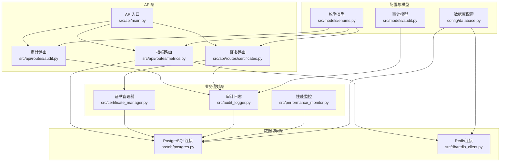
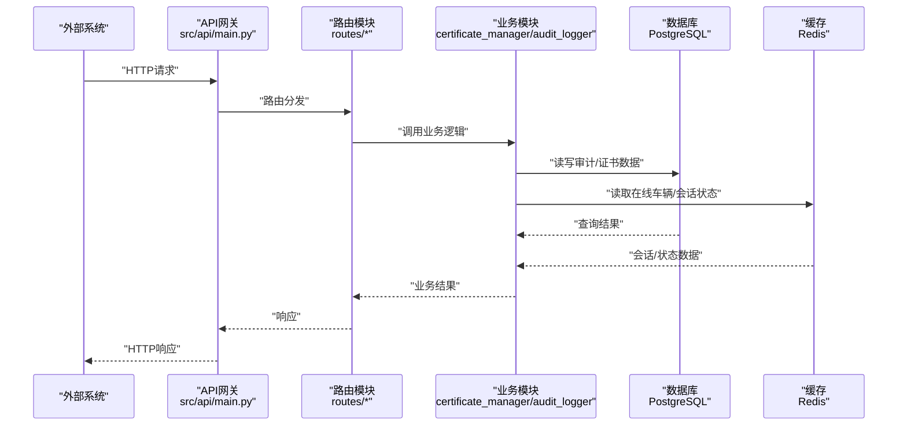
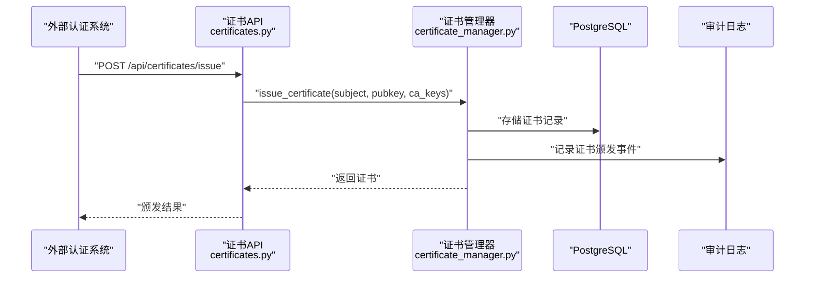
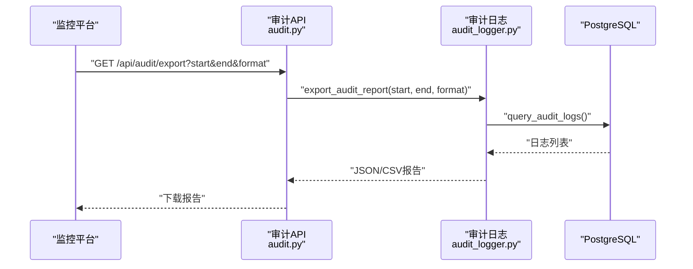
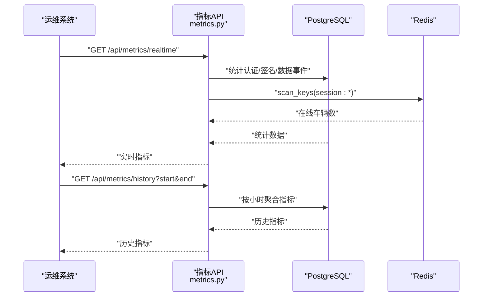
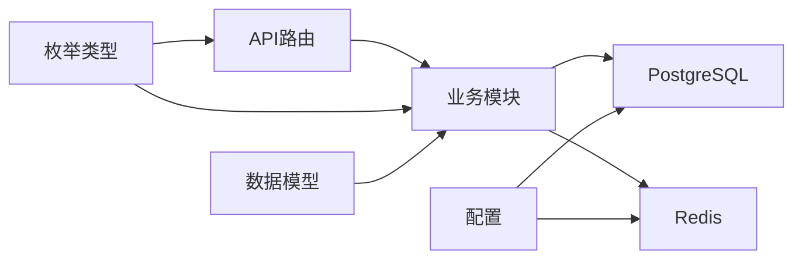

# 第三方系统集成

<cite>
**本文档引用的文件**
- [src/certificate_manager.py](file://src/certificate_manager.py)
- [src/audit_logger.py](file://src/audit_logger.py)
- [src/performance_monitor.py](file://src/performance_monitor.py)
- [src/api/main.py](file://src/api/main.py)
- [src/api/routes/audit.py](file://src/api/routes/audit.py)
- [src/api/routes/metrics.py](file://src/api/routes/metrics.py)
- [src/api/routes/certificates.py](file://src/api/routes/certificates.py)
- [src/db/postgres.py](file://src/db/postgres.py)
- [src/db/redis_client.py](file://src/db/redis_client.py)
- [src/models/audit.py](file://src/models/audit.py)
- [src/models/enums.py](file://src/models/enums.py)
- [config/database.py](file://config/database.py)
- [examples/export_audit_report_example.py](file://examples/export_audit_report_example.py)
- [examples/performance_monitoring_demo.py](file://examples/performance_monitoring_demo.py)
</cite>

## 目录
1. [简介](#简介)
2. [项目结构](#项目结构)
3. [核心组件](#核心组件)
4. [架构总览](#架构总览)
5. [详细组件分析](#详细组件分析)
6. [依赖关系分析](#依赖关系分析)
7. [性能考量](#性能考量)
8. [故障排查指南](#故障排查指南)
9. [结论](#结论)
10. [附录](#附录)

## 简介
本文件面向第三方系统集成商，提供车联网安全通信网关与外部认证系统、监控平台、告警系统、数据库以及性能监控系统的集成指南。重点涵盖：
- 证书管理器与外部CA系统的对接机制
- 审计日志输出到外部系统的实现方案
- 性能监控数据导出与集成配置
- Webhook集成、消息队列接入与API适配器开发
- 集成过程中的安全考虑与数据一致性保障

## 项目结构
系统采用模块化设计，核心能力由证书管理、审计日志、性能监控、API路由与数据库访问等模块组成，并通过FastAPI提供REST接口。

**图表来源**
- [src/api/main.py:1-108](file://src/api/main.py#L1-L108)
- [src/api/routes/audit.py:1-191](file://src/api/routes/audit.py#L1-L191)
- [src/api/routes/metrics.py:1-237](file://src/api/routes/metrics.py#L1-L237)
- [src/api/routes/certificates.py:1-390](file://src/api/routes/certificates.py#L1-L390)
- [src/certificate_manager.py:1-734](file://src/certificate_manager.py#L1-L734)
- [src/audit_logger.py:1-480](file://src/audit_logger.py#L1-L480)
- [src/performance_monitor.py:1-613](file://src/performance_monitor.py#L1-L613)
- [src/db/postgres.py:1-53](file://src/db/postgres.py#L1-L53)
- [src/db/redis_client.py:1-79](file://src/db/redis_client.py#L1-L79)
- [config/database.py:1-50](file://config/database.py#L1-L50)
- [src/models/enums.py:1-56](file://src/models/enums.py#L1-L56)
- [src/models/audit.py:1-56](file://src/models/audit.py#L1-L56)

**章节来源**
- [src/api/main.py:1-108](file://src/api/main.py#L1-L108)
- [config/database.py:1-50](file://config/database.py#L1-L50)

## 核心组件
- 证书管理器：负责证书颁发、撤销、CRL维护与验证，支持与外部CA交互。
- 审计日志：统一记录认证、数据传输、证书操作等事件，支持查询与导出。
- 性能监控：采集认证、加解密、签名验签、会话管理等指标，提供实时与历史视图。
- API路由：提供REST接口，封装业务逻辑并进行鉴权校验。
- 数据访问：PostgreSQL用于持久化审计与证书数据；Redis用于会话状态与在线车辆统计。

**章节来源**
- [src/certificate_manager.py:597-734](file://src/certificate_manager.py#L597-L734)
- [src/audit_logger.py:26-480](file://src/audit_logger.py#L26-L480)
- [src/performance_monitor.py:54-422](file://src/performance_monitor.py#L54-L422)
- [src/api/routes/audit.py:39-191](file://src/api/routes/audit.py#L39-L191)
- [src/api/routes/metrics.py:39-237](file://src/api/routes/metrics.py#L39-L237)
- [src/api/routes/certificates.py:81-390](file://src/api/routes/certificates.py#L81-L390)
- [src/db/postgres.py:9-53](file://src/db/postgres.py#L9-L53)
- [src/db/redis_client.py:8-79](file://src/db/redis_client.py#L8-L79)

## 架构总览
下图展示第三方系统集成的关键交互路径：外部系统通过API访问网关，网关调用证书管理器与审计日志模块，并通过数据库与缓存进行数据持久化与查询。

**图表来源**
- [src/api/main.py:19-108](file://src/api/main.py#L19-L108)
- [src/api/routes/audit.py:39-191](file://src/api/routes/audit.py#L39-L191)
- [src/api/routes/metrics.py:39-237](file://src/api/routes/metrics.py#L39-L237)
- [src/api/routes/certificates.py:81-390](file://src/api/routes/certificates.py#L81-L390)
- [src/certificate_manager.py:597-734](file://src/certificate_manager.py#L597-L734)
- [src/audit_logger.py:26-480](file://src/audit_logger.py#L26-L480)
- [src/db/postgres.py:9-53](file://src/db/postgres.py#L9-L53)
- [src/db/redis_client.py:8-79](file://src/db/redis_client.py#L8-L79)

## 详细组件分析

### 证书管理器与外部CA对接
- 颁发流程：接收车辆公钥与主体信息，使用CA私钥签名生成证书，持久化至数据库并记录审计日志。
- 撤销流程：将证书序列号加入CRL，记录撤销事件并失效相关缓存。
- 验证流程：格式校验、有效期检查、CRL核验、签名验证，支持缓存加速与证书链扩展点。
- 与外部CA对接建议：
  - 通过环境变量注入CA密钥（生产环境建议使用安全密钥管理服务）。
  - 将证书颁发与撤销接口暴露为受控API，配合鉴权与审计。
  - 定期同步CRL至缓存或共享存储，确保验证侧一致性。

**图表来源**
- [src/api/routes/certificates.py:154-275](file://src/api/routes/certificates.py#L154-L275)
- [src/certificate_manager.py:597-734](file://src/certificate_manager.py#L597-L734)
- [src/audit_logger.py:185-242](file://src/audit_logger.py#L185-L242)

**章节来源**
- [src/certificate_manager.py:206-332](file://src/certificate_manager.py#L206-L332)
- [src/certificate_manager.py:334-471](file://src/certificate_manager.py#L334-L471)
- [src/api/routes/certificates.py:154-390](file://src/api/routes/certificates.py#L154-L390)

### 审计日志输出到外部系统
- 内置能力：统一事件模型、持久化到PostgreSQL、支持按条件查询与JSON/CSV导出。
- 外部系统集成方案：
  - API导出：通过“审计日志导出”接口定时拉取指定时间范围报告。
  - 文件导出：使用示例脚本演示导出为JSON/CSV并落盘，便于后续转发至SIEM或日志平台。
  - 实时推送：可在审计日志模块基础上增加消息队列发布或Webhook回调（需扩展实现）。

**图表来源**
- [src/api/routes/audit.py:127-191](file://src/api/routes/audit.py#L127-L191)
- [src/audit_logger.py:337-466](file://src/audit_logger.py#L337-L466)
- [examples/export_audit_report_example.py:12-143](file://examples/export_audit_report_example.py#L12-L143)

**章节来源**
- [src/audit_logger.py:26-480](file://src/audit_logger.py#L26-L480)
- [src/api/routes/audit.py:39-191](file://src/api/routes/audit.py#L39-L191)
- [examples/export_audit_report_example.py:60-131](file://examples/export_audit_report_example.py#L60-L131)

### 性能监控数据导出与集成
- 指标采集：认证延迟与TPS、加解密吞吐量与延迟、签名验签速率、会话并发与延迟。
- 实时与历史：提供实时指标与按小时聚合的历史指标查询。
- 集成建议：
  - 通过“安全指标”API定期抓取实时与历史数据，对接Prometheus/Grafana或其他监控平台。
  - 将性能摘要与单项指标映射到目标平台的指标体系，设置阈值告警。

**图表来源**
- [src/api/routes/metrics.py:39-237](file://src/api/routes/metrics.py#L39-L237)
- [src/db/postgres.py:32-45](file://src/db/postgres.py#L32-L45)
- [src/db/redis_client.py:51-71](file://src/db/redis_client.py#L51-L71)

**章节来源**
- [src/performance_monitor.py:54-422](file://src/performance_monitor.py#L54-L422)
- [src/api/routes/metrics.py:39-237](file://src/api/routes/metrics.py#L39-L237)
- [examples/performance_monitoring_demo.py:36-250](file://examples/performance_monitoring_demo.py#L36-L250)

### Webhook集成、消息队列接入与API适配器开发
- Webhook集成：
  - 在审计日志模块中新增Webhook发布器，监听关键事件（如认证失败、证书撤销），异步发送至外部平台。
  - 注意幂等性与重试策略，避免重复告警。
- 消息队列接入：
  - 在证书颁发/撤销与审计事件发生时，向消息队列（如Kafka/RabbitMQ）投递事件，供下游系统消费。
  - 保证消息有序与可靠投递，结合ACK确认与死信队列处理异常。
- API适配器开发：
  - 参考现有路由设计，新增适配器路由，封装外部系统协议与网关内部模型的转换。
  - 严格鉴权与审计，确保所有外部调用可追溯。

[本节为概念性指导，不直接分析具体源文件]

### 安全考虑与数据一致性
- 认证与授权：
  - API使用Bearer Token鉴权，生产环境建议替换为JWT并启用HTTPS。
- 数据保护：
  - CA密钥通过环境变量注入，建议迁移到密钥管理服务（如Vault/KMS）。
  - 审计日志与证书数据均持久化至PostgreSQL，需开启备份与权限控制。
- 一致性保障：
  - 证书颁发/撤销与审计日志在同一事务中写入数据库，保证原子性。
  - CRL变更后失效缓存，确保验证侧一致性。

**章节来源**
- [src/api/main.py:49-74](file://src/api/main.py#L49-L74)
- [src/api/routes/certificates.py:197-225](file://src/api/routes/certificates.py#L197-L225)
- [src/certificate_manager.py:334-430](file://src/certificate_manager.py#L334-L430)

## 依赖关系分析
- 组件耦合：
  - API路由依赖业务模块与配置；业务模块依赖数据库与缓存；审计日志与证书管理共同依赖PostgreSQL。
- 外部依赖：
  - PostgreSQL用于持久化；Redis用于会话状态；FastAPI提供REST接口。
- 循环依赖：
  - 代码结构清晰，未发现循环导入。

**图表来源**
- [src/api/main.py:94-102](file://src/api/main.py#L94-L102)
- [src/models/enums.py:1-56](file://src/models/enums.py#L1-L56)
- [config/database.py:1-50](file://config/database.py#L1-L50)

**章节来源**
- [src/db/postgres.py:9-53](file://src/db/postgres.py#L9-L53)
- [src/db/redis_client.py:8-79](file://src/db/redis_client.py#L8-L79)
- [src/models/audit.py:9-56](file://src/models/audit.py#L9-L56)

## 性能考量
- 指标要求：
  - 认证平均延迟<500ms、TPS≥100；加解密吞吐量≥100MB/s、1KB加密延迟<10ms；签名≥1000次/秒、验签≥2000次/秒；并发会话≥10,000、查询延迟<5ms、建立延迟<100ms。
- 监控方式：
  - 使用装饰器与上下文管理器自动采集关键路径性能，支持实时与历史指标查询。
- 优化建议：
  - 合理设置数据库连接池与Redis超时；对频繁查询使用缓存；对批量操作采用分页与限流。

**章节来源**
- [src/performance_monitor.py:14-422](file://src/performance_monitor.py#L14-L422)
- [src/api/routes/metrics.py:39-237](file://src/api/routes/metrics.py#L39-L237)
- [examples/performance_monitoring_demo.py:108-206](file://examples/performance_monitoring_demo.py#L108-L206)

## 故障排查指南
- 审计日志查询失败：
  - 检查PostgreSQL连接配置与网络连通性；确认事件类型枚举值合法。
- 性能指标异常：
  - 核对数据库与Redis连接状态；检查监控装饰器是否正确包裹关键函数。
- 证书颁发/撤销失败：
  - 确认CA密钥环境变量配置；检查数据库连接与事务提交；查看审计日志中的失败详情。

**章节来源**
- [src/api/routes/audit.py:118-125](file://src/api/routes/audit.py#L118-L125)
- [src/api/routes/metrics.py:144-148](file://src/api/routes/metrics.py#L144-L148)
- [src/api/routes/certificates.py:253-275](file://src/api/routes/certificates.py#L253-L275)

## 结论
本文档提供了与外部系统集成的完整路径：通过受控API与内置导出能力，实现与认证系统、监控平台、告警系统及数据库的无缝对接；同时给出性能监控与安全合规的实践建议。集成商可据此快速落地，确保数据一致性与可追溯性。

## 附录
- 配置项参考：
  - PostgreSQL：主机、端口、数据库名、用户名、密码
  - Redis：主机、端口、数据库编号、密码
  - API Token：用于API鉴权
- 建议流程：
  - 评估外部系统需求，确定数据流向与触发条件
  - 选择合适的集成方式（API拉取、Webhook、消息队列）
  - 实施鉴权与审计，确保可追溯
  - 部署监控与告警，持续优化性能

**章节来源**
- [config/database.py:8-50](file://config/database.py#L8-L50)
- [src/api/main.py:49-74](file://src/api/main.py#L49-L74)