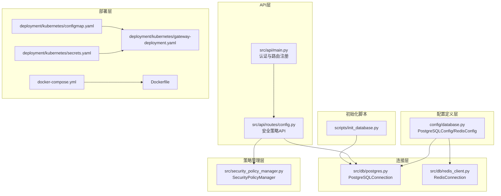
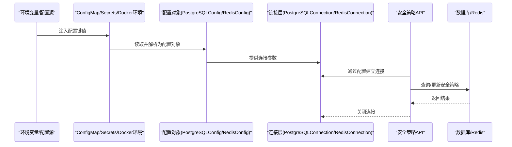
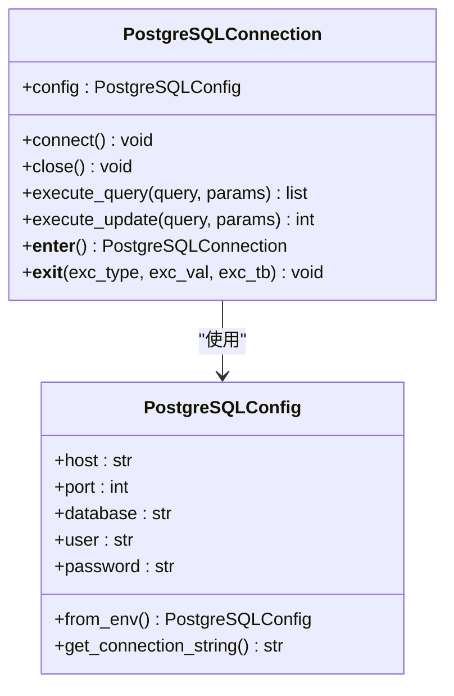
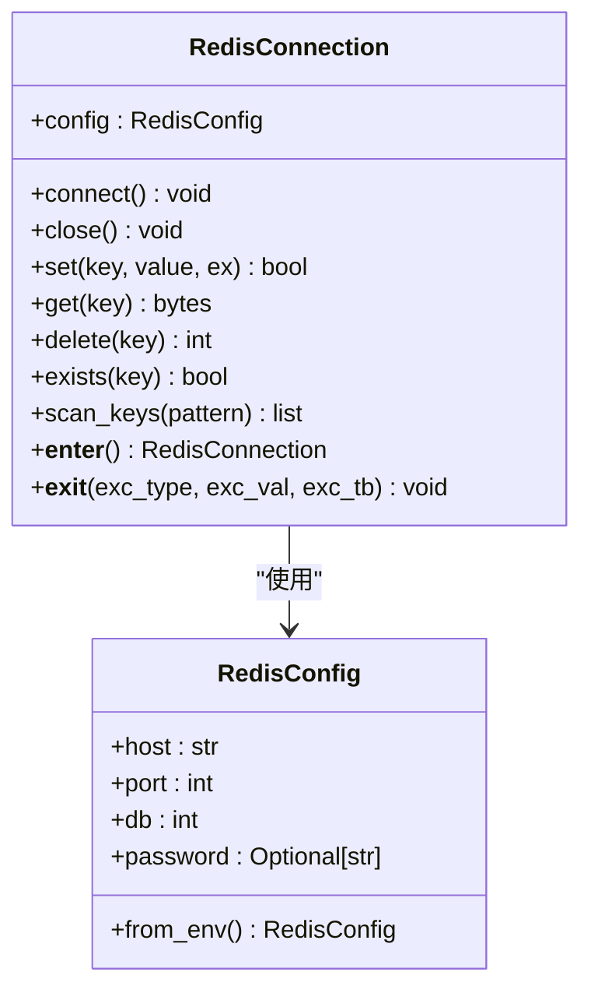
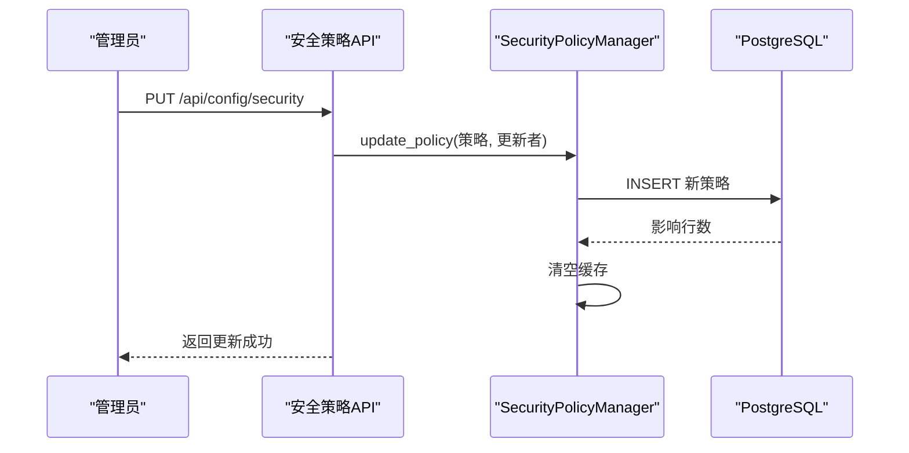
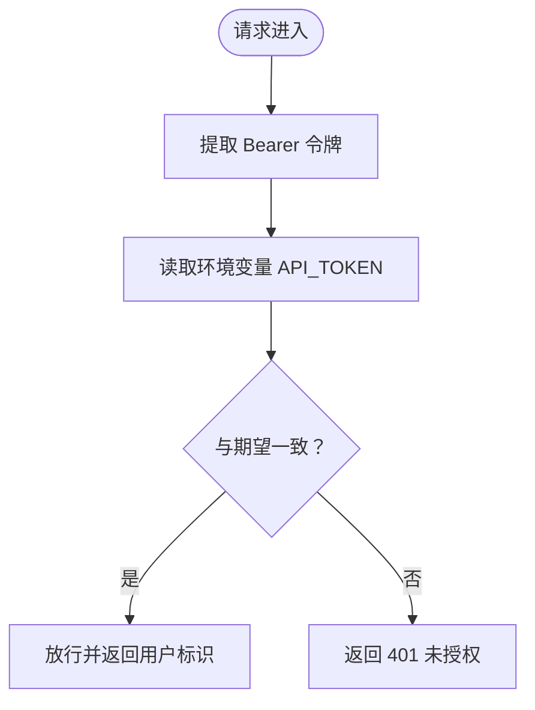
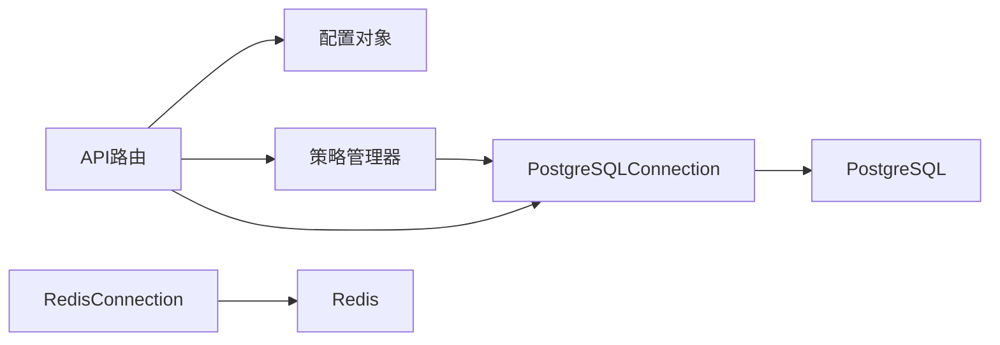

# 配置管理与定制

<cite>
**本文引用的文件**
- [config/database.py](file://config/database.py)
- [src/db/postgres.py](file://src/db/postgres.py)
- [src/db/redis_client.py](file://src/db/redis_client.py)
- [src/api/routes/config.py](file://src/api/routes/config.py)
- [src/security_policy_manager.py](file://src/security_policy_manager.py)
- [src/api/main.py](file://src/api/main.py)
- [db/redis_config.conf](file://db/redis_config.conf)
- [deployment/kubernetes/gateway-deployment.yaml](file://deployment/kubernetes/gateway-deployment.yaml)
- [deployment/kubernetes/secrets.yaml](file://deployment/kubernetes/secrets.yaml)
- [deployment/kubernetes/configmap.yaml](file://deployment/kubernetes/configmap.yaml)
- [Dockerfile](file://Dockerfile)
- [docker-compose.yml](file://docker-compose.yml)
- [scripts/init_database.py](file://scripts/init_database.py)
</cite>

## 目录
1. [简介](#简介)
2. [项目结构](#项目结构)
3. [核心组件](#核心组件)
4. [架构总览](#架构总览)
5. [详细组件分析](#详细组件分析)
6. [依赖分析](#依赖分析)
7. [性能考量](#性能考量)
8. [故障排查指南](#故障排查指南)
9. [结论](#结论)
10. [附录](#附录)

## 简介
本文件面向系统管理员与开发者，提供车联网安全通信网关的配置管理与定制化开发指南。内容涵盖：
- 配置文件结构与环境变量管理
- 数据库连接与Redis缓存配置
- 安全参数定制方法
- 运行时配置更新与热重载机制
- 不同部署环境的配置模板与最佳实践
- 配置验证、回滚与版本管理策略
- 配置安全性与敏感信息保护方法

## 项目结构
本项目采用“按职责分层”的组织方式，配置相关能力主要分布在以下位置：
- 配置定义层：config/database.py 提供数据库与Redis配置的数据类与环境变量加载方法
- 连接层：src/db/postgres.py 与 src/db/redis_client.py 提供连接管理与基础操作
- API层：src/api/routes/config.py 提供安全策略的查询与更新接口
- 策略管理层：src/security_policy_manager.py 提供策略的持久化、缓存与应用
- 部署层：Kubernetes ConfigMap/Secrets 与 docker-compose.yml 提供环境变量注入
- 初始化脚本：scripts/init_database.py 提供数据库初始化流程

**图表来源**
- [config/database.py:1-50](file://config/database.py#L1-L50)
- [src/db/postgres.py:1-53](file://src/db/postgres.py#L1-L53)
- [src/db/redis_client.py:1-79](file://src/db/redis_client.py#L1-L79)
- [src/api/routes/config.py:1-173](file://src/api/routes/config.py#L1-L173)
- [src/security_policy_manager.py:1-322](file://src/security_policy_manager.py#L1-L322)
- [src/api/main.py:1-108](file://src/api/main.py#L1-L108)
- [deployment/kubernetes/configmap.yaml:1-17](file://deployment/kubernetes/configmap.yaml#L1-L17)
- [deployment/kubernetes/secrets.yaml:1-20](file://deployment/kubernetes/secrets.yaml#L1-L20)
- [deployment/kubernetes/gateway-deployment.yaml:1-132](file://deployment/kubernetes/gateway-deployment.yaml#L1-L132)
- [docker-compose.yml:1-95](file://docker-compose.yml#L1-L95)
- [Dockerfile:1-35](file://Dockerfile#L1-L35)
- [scripts/init_database.py:1-151](file://scripts/init_database.py#L1-L151)

**章节来源**
- [config/database.py:1-50](file://config/database.py#L1-L50)
- [src/db/postgres.py:1-53](file://src/db/postgres.py#L1-L53)
- [src/db/redis_client.py:1-79](file://src/db/redis_client.py#L1-L79)
- [src/api/routes/config.py:1-173](file://src/api/routes/config.py#L1-L173)
- [src/security_policy_manager.py:1-322](file://src/security_policy_manager.py#L1-L322)
- [src/api/main.py:1-108](file://src/api/main.py#L1-L108)
- [deployment/kubernetes/configmap.yaml:1-17](file://deployment/kubernetes/configmap.yaml#L1-L17)
- [deployment/kubernetes/secrets.yaml:1-20](file://deployment/kubernetes/secrets.yaml#L1-L20)
- [deployment/kubernetes/gateway-deployment.yaml:1-132](file://deployment/kubernetes/gateway-deployment.yaml#L1-L132)
- [docker-compose.yml:1-95](file://docker-compose.yml#L1-L95)
- [Dockerfile:1-35](file://Dockerfile#L1-L35)
- [scripts/init_database.py:1-151](file://scripts/init_database.py#L1-L151)

## 核心组件
本节聚焦配置相关的四大核心组件及其职责与交互。

- 配置数据类与环境变量加载
  - PostgreSQLConfig：封装主机、端口、数据库名、用户名、密码，并提供从环境变量加载的方法与连接串生成
  - RedisConfig：封装主机、端口、数据库编号、密码，并提供从环境变量加载的方法
- 连接管理器
  - PostgreSQLConnection：负责连接建立、查询执行、更新执行与上下文管理
  - RedisConnection：负责连接建立、键值操作、键扫描与上下文管理
- 安全策略API与管理器
  - 安全策略API：提供查询与更新安全策略的REST接口，参数校验与持久化
  - SecurityPolicyManager：负责策略的数据库读写、缓存、认证失败记录与锁定逻辑
- 部署与环境注入
  - Kubernetes：通过ConfigMap与Secrets注入环境变量；Deployment声明健康检查与资源限制
  - Docker Compose：通过环境变量与卷挂载注入配置与密钥；服务间依赖与健康检查

**章节来源**
- [config/database.py:8-50](file://config/database.py#L8-L50)
- [src/db/postgres.py:9-53](file://src/db/postgres.py#L9-L53)
- [src/db/redis_client.py:8-79](file://src/db/redis_client.py#L8-L79)
- [src/api/routes/config.py:20-173](file://src/api/routes/config.py#L20-L173)
- [src/security_policy_manager.py:59-322](file://src/security_policy_manager.py#L59-L322)
- [deployment/kubernetes/gateway-deployment.yaml:21-93](file://deployment/kubernetes/gateway-deployment.yaml#L21-L93)
- [deployment/kubernetes/configmap.yaml:6-17](file://deployment/kubernetes/configmap.yaml#L6-L17)
- [deployment/kubernetes/secrets.yaml:7-20](file://deployment/kubernetes/secrets.yaml#L7-L20)
- [docker-compose.yml:48-86](file://docker-compose.yml#L48-L86)

## 架构总览
下图展示配置在系统中的流转：从环境变量注入到配置对象，再到连接层与API层的应用。

**图表来源**
- [deployment/kubernetes/gateway-deployment.yaml:21-93](file://deployment/kubernetes/gateway-deployment.yaml#L21-L93)
- [deployment/kubernetes/configmap.yaml:6-17](file://deployment/kubernetes/configmap.yaml#L6-L17)
- [deployment/kubernetes/secrets.yaml:7-20](file://deployment/kubernetes/secrets.yaml#L7-L20)
- [docker-compose.yml:48-86](file://docker-compose.yml#L48-L86)
- [config/database.py:17-50](file://config/database.py#L17-L50)
- [src/db/postgres.py:16-53](file://src/db/postgres.py#L16-L53)
- [src/db/redis_client.py:15-79](file://src/db/redis_client.py#L15-L79)
- [src/api/routes/config.py:78-164](file://src/api/routes/config.py#L78-L164)

## 详细组件分析

### 数据库配置与连接
- 配置来源
  - PostgreSQLConfig.from_env：从环境变量加载主机、端口、数据库名、用户名、密码
  - 连接串生成：get_connection_string用于统一构造连接串
- 连接管理
  - PostgreSQLConnection.connect/close：按需建立连接，支持上下文管理
  - 执行查询与更新：execute_query/execute_update封装游标与事务提交
- 最佳实践
  - 在容器编排中通过ConfigMap/Secrets注入敏感信息
  - 使用只读用户进行日常访问，必要时使用更高权限账户执行迁移

**图表来源**
- [config/database.py:8-31](file://config/database.py#L8-L31)
- [src/db/postgres.py:9-53](file://src/db/postgres.py#L9-L53)

**章节来源**
- [config/database.py:8-31](file://config/database.py#L8-L31)
- [src/db/postgres.py:9-53](file://src/db/postgres.py#L9-L53)
- [scripts/init_database.py:119-151](file://scripts/init_database.py#L119-L151)

### Redis缓存配置与连接
- 配置来源
  - RedisConfig.from_env：从环境变量加载主机、端口、数据库编号、密码
  - Redis服务端配置：db/redis_config.conf 提供持久化、内存、慢查询等建议
- 连接管理
  - RedisConnection.connect/close：按需建立连接，支持上下文管理
  - 键值操作：set/get/delete/exists与scan_keys扫描
- 最佳实践
  - 生产环境务必设置密码并限制网络访问
  - 合理设置maxmemory与淘汰策略以避免内存溢出

**图表来源**
- [config/database.py:34-50](file://config/database.py#L34-L50)
- [src/db/redis_client.py:8-79](file://src/db/redis_client.py#L8-L79)
- [db/redis_config.conf:1-44](file://db/redis_config.conf#L1-L44)

**章节来源**
- [config/database.py:34-50](file://config/database.py#L34-L50)
- [src/db/redis_client.py:8-79](file://src/db/redis_client.py#L8-L79)
- [db/redis_config.conf:1-44](file://db/redis_config.conf#L1-L44)

### 安全策略配置API与热重载
- API能力
  - GET /api/config/security：从数据库加载当前策略并返回
  - PUT /api/config/security：接收参数校验后持久化到数据库，立即生效
- 策略管理
  - SecurityPolicyManager.get_policy/use_cache：带TTL的缓存策略读取
  - SecurityPolicyManager.update_policy：写入最新策略并清空缓存
- 热重载机制
  - 更新后立即清除本地缓存，后续请求将重新从数据库加载
  - 无需重启即可应用新策略

**图表来源**
- [src/api/routes/config.py:108-173](file://src/api/routes/config.py#L108-L173)
- [src/security_policy_manager.py:127-168](file://src/security_policy_manager.py#L127-L168)

**章节来源**
- [src/api/routes/config.py:64-173](file://src/api/routes/config.py#L64-L173)
- [src/security_policy_manager.py:73-168](file://src/security_policy_manager.py#L73-L168)

### 认证与令牌管理
- 令牌验证
  - src/api/main.py 中 verify_token 从环境变量读取API_TOKEN进行比对
  - 生产环境建议替换为更安全的令牌机制（如JWT）
- 环境注入
  - Kubernetes Secrets与ConfigMap注入API_TOKEN
  - Docker Compose通过环境变量注入

**图表来源**
- [src/api/main.py:49-75](file://src/api/main.py#L49-L75)
- [deployment/kubernetes/secrets.yaml:18-19](file://deployment/kubernetes/secrets.yaml#L18-L19)
- [docker-compose.yml:62-68](file://docker-compose.yml#L62-L68)

**章节来源**
- [src/api/main.py:49-75](file://src/api/main.py#L49-L75)
- [deployment/kubernetes/secrets.yaml:18-19](file://deployment/kubernetes/secrets.yaml#L18-L19)
- [docker-compose.yml:62-68](file://docker-compose.yml#L62-L68)

## 依赖分析
- 组件耦合
  - API层依赖配置对象与连接层，策略管理器依赖数据库连接
  - 连接层仅依赖配置对象，低耦合便于测试与替换
- 外部依赖
  - PostgreSQL与Redis服务通过环境变量与编排配置注入
  - 初始化脚本依赖psycopg2与迁移SQL文件

**图表来源**
- [src/api/routes/config.py:14-15](file://src/api/routes/config.py#L14-L15)
- [src/security_policy_manager.py:16](file://src/security_policy_manager.py#L16)
- [src/db/postgres.py:6](file://src/db/postgres.py#L6)
- [src/db/redis_client.py:5](file://src/db/redis_client.py#L5)

**章节来源**
- [src/api/routes/config.py:14-15](file://src/api/routes/config.py#L14-L15)
- [src/security_policy_manager.py:16](file://src/security_policy_manager.py#L16)
- [src/db/postgres.py:6](file://src/db/postgres.py#L6)
- [src/db/redis_client.py:5](file://src/db/redis_client.py#L5)

## 性能考量
- 缓存策略
  - SecurityPolicyManager对策略读取设置60秒TTL，降低数据库压力
- 连接复用
  - 连接层按需建立连接并在上下文退出时关闭，避免连接泄漏
- Redis优化
  - 建议根据业务量调整maxmemory与淘汰策略，启用慢查询日志定位瓶颈

[本节为通用指导，无需特定文件引用]

## 故障排查指南
- 数据库连接失败
  - 检查环境变量与ConfigMap/Secrets注入是否正确
  - 使用初始化脚本确认数据库创建与迁移执行
- Redis连接失败
  - 确认密码、端口与网络连通性
  - 参考redis_config.conf调整内存与持久化策略
- API认证失败
  - 确认API_TOKEN是否与环境变量一致
  - 生产环境建议替换为更安全的令牌机制
- 策略更新未生效
  - 确认PUT请求成功且数据库写入正常
  - 等待或强制刷新缓存（下次读取自动生效）

**章节来源**
- [scripts/init_database.py:119-151](file://scripts/init_database.py#L119-L151)
- [db/redis_config.conf:1-44](file://db/redis_config.conf#L1-L44)
- [src/api/main.py:61-74](file://src/api/main.py#L61-L74)
- [src/security_policy_manager.py:82-125](file://src/security_policy_manager.py#L82-L125)

## 结论
本项目通过清晰的配置分层、严格的环境变量注入与完善的连接管理，实现了数据库与Redis的灵活配置与快速部署。安全策略的持久化与缓存机制支持运行时更新与热重载，满足生产环境的动态运维需求。建议在生产环境中进一步强化令牌机制与密钥管理，确保配置与数据安全。

[本节为总结，无需特定文件引用]

## 附录

### 环境变量清单与用途
- 数据库相关
  - POSTGRES_HOST/POSTGRES_PORT/POSTGRES_DB/POSTGRES_USER/POSTGRES_PASSWORD
- Redis相关
  - REDIS_HOST/REDIS_PORT/REDIS_DB/REDIS_PASSWORD
- 安全与性能
  - SESSION_TIMEOUT/TIMESTAMP_TOLERANCE/CACHE_SIZE/CACHE_TTL
- 证书与令牌
  - CA_PRIVATE_KEY/CA_PUBLIC_KEY/API_TOKEN
- 其他
  - API_PORT（容器暴露端口）

**章节来源**
- [config/database.py:17-50](file://config/database.py#L17-L50)
- [deployment/kubernetes/configmap.yaml:6-17](file://deployment/kubernetes/configmap.yaml#L6-L17)
- [deployment/kubernetes/secrets.yaml:7-20](file://deployment/kubernetes/secrets.yaml#L7-L20)
- [docker-compose.yml:48-86](file://docker-compose.yml#L48-L86)

### 部署环境模板与最佳实践
- Kubernetes
  - 使用ConfigMap注入非敏感配置，Secrets注入敏感配置
  - Deployment声明健康检查与资源限制，确保稳定性
- Docker Compose
  - 通过环境变量与卷挂载注入密钥与日志目录
  - 使用健康检查与服务依赖保证启动顺序

**章节来源**
- [deployment/kubernetes/gateway-deployment.yaml:21-132](file://deployment/kubernetes/gateway-deployment.yaml#L21-L132)
- [deployment/kubernetes/configmap.yaml:6-17](file://deployment/kubernetes/configmap.yaml#L6-L17)
- [deployment/kubernetes/secrets.yaml:7-20](file://deployment/kubernetes/secrets.yaml#L7-L20)
- [docker-compose.yml:48-95](file://docker-compose.yml#L48-L95)
- [Dockerfile:22-35](file://Dockerfile#L22-L35)

### 配置验证、回滚与版本管理策略
- 配置验证
  - API层对策略参数进行范围校验与策略枚举校验
  - 连接层在连接失败时抛出异常，便于上层捕获
- 回滚策略
  - 策略表按时间倒序存储，可通过历史记录恢复到上一版本
  - 建议在更新前备份策略表
- 版本管理
  - 迁移脚本按序号递增，确保数据库结构演进有序
  - 建议配合Git管理迁移脚本与配置模板

**章节来源**
- [src/api/routes/config.py:126-134](file://src/api/routes/config.py#L126-L134)
- [src/security_policy_manager.py:88-95](file://src/security_policy_manager.py#L88-L95)
- [scripts/init_database.py:80-95](file://scripts/init_database.py#L80-L95)

### 配置安全性与敏感信息保护
- 密钥与令牌
  - 使用Secrets管理数据库密码、Redis密码、CA密钥与API_TOKEN
  - 生产环境禁止将密钥硬编码在镜像或配置文件中
- 网络与访问控制
  - Redis开启requirepass并限制bind地址
  - PostgreSQL与Redis仅对网关Pod开放端口
- 最小权限原则
  - 应用使用只读或受限权限的数据库用户进行日常访问
  - 初始化脚本使用高权限账户执行DDL

**章节来源**
- [deployment/kubernetes/secrets.yaml:7-20](file://deployment/kubernetes/secrets.yaml#L7-L20)
- [db/redis_config.conf:9-11](file://db/redis_config.conf#L9-L11)
- [scripts/init_database.py:119-151](file://scripts/init_database.py#L119-L151)