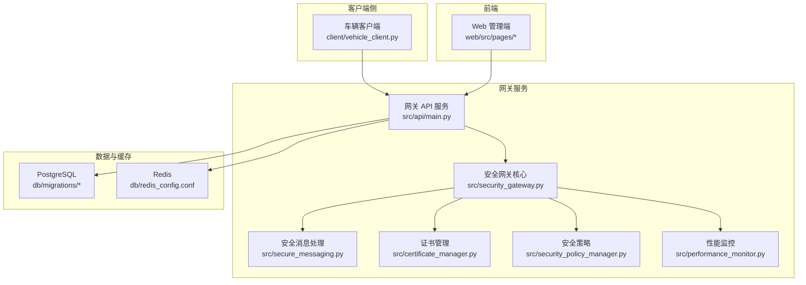
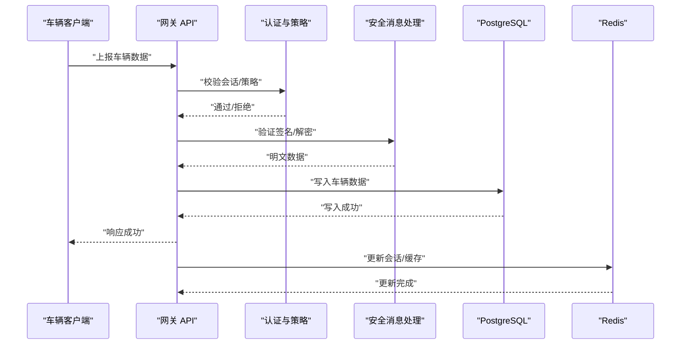
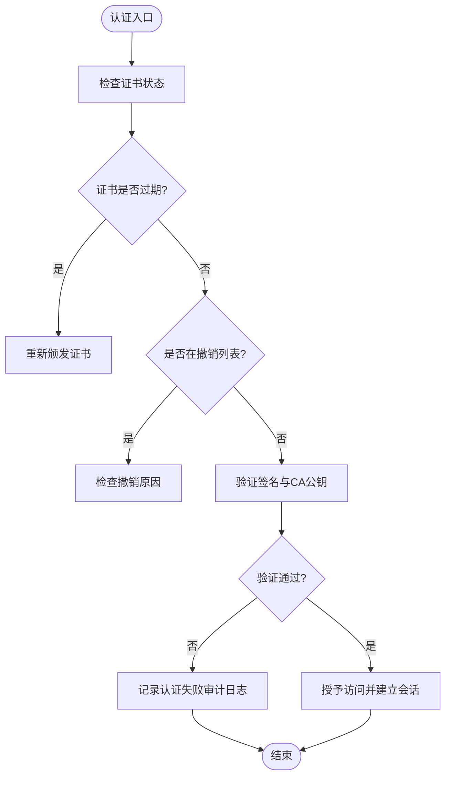
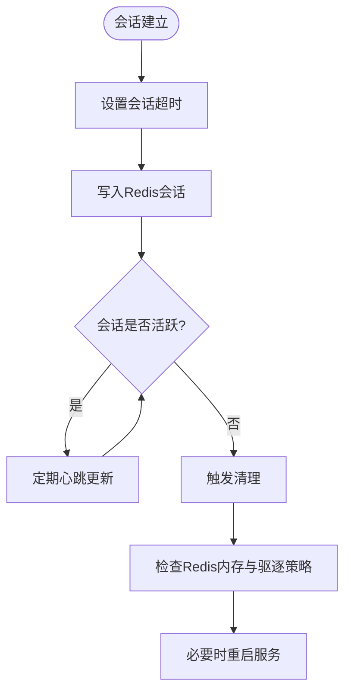
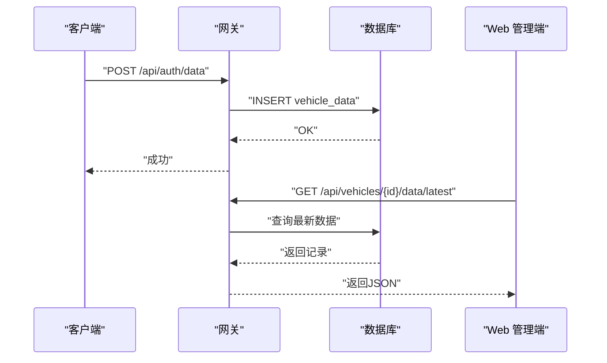
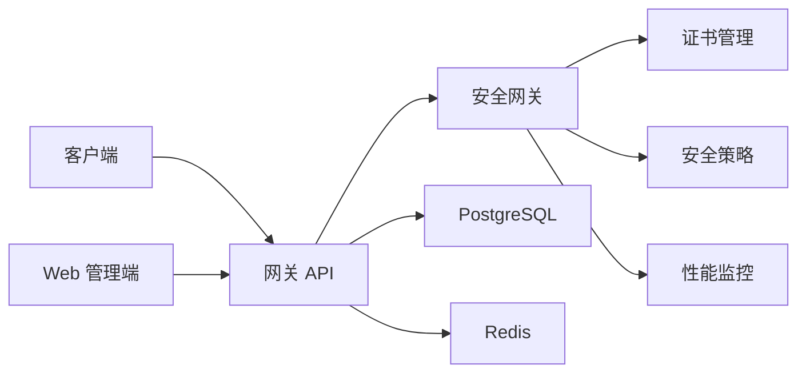

# 故障排除

<cite>
**本文引用的文件**
- [故障排查指南](file://docs/TROUBLESHOOTING.md)
- [问题诊断报告](file://diagnose_issues.md)
- [审计日志功能修复指南](file://audit_log_fix_readme.md)
- [车辆数据功能部署指南](file://vehicle_data_deployment.md)
- [Web 端看不到数据诊断](file://web端看不到数据诊断.md)
- [性能监控演示](file://examples/performance_monitoring_demo.py)
- [性能监控模块](file://src/performance_monitor.py)
- [快速测试脚本](file://scripts/test_gateway.sh)
- [数据库初始化脚本](file://scripts/init_database.sh)
</cite>

## 目录
1. [简介](#简介)
2. [项目结构](#项目结构)
3. [核心组件](#核心组件)
4. [架构总览](#架构总览)
5. [详细组件分析](#详细组件分析)
6. [依赖分析](#依赖分析)
7. [性能考虑](#性能考虑)
8. [故障排除指南](#故障排除指南)
9. [结论](#结论)
10. [附录](#附录)

## 简介
本指南面向车联网安全通信网关的运维与开发人员，提供系统化的故障排除方法与最佳实践。内容覆盖安装与部署问题、配置错误、连接失败、认证与签名验证失败、重放攻击检测、会话与缓存问题、性能下降与内存泄漏、API 服务无响应、日志分析与错误定位、网络与安全问题排查、紧急处置与监控告警解读等。文档同时提供可视化流程图与工具使用说明，帮助快速定位并解决问题。

## 项目结构
项目采用前后端分离与容器化部署架构，核心由以下部分组成：
- 后端网关服务：提供认证、数据接收、证书管理、审计日志、指标查询等 API
- 客户端：模拟车辆向网关上报数据
- 数据库：PostgreSQL 存储业务数据与审计日志，Redis 缓存与会话
- Web 管理端：展示车辆数据、审计日志与指标仪表盘
- Kubernetes 部署：通过 ConfigMap、Deployment、Service 等资源编排服务

**图表来源**
- [车辆数据功能部署指南](file://vehicle_data_deployment.md)
- [性能监控模块](file://src/performance_monitor.py)

**章节来源**
- [车辆数据功能部署指南](file://vehicle_data_deployment.md)
- [Web 端看不到数据诊断](file://web端看不到数据诊断.md)

## 核心组件
- 安全网关与消息处理：负责认证、签名验证、加密解密、重放攻击检测与会话管理
- 证书与策略：证书颁发、撤销、缓存与策略配置（会话超时、时间戳容差、失败锁定等）
- 数据与缓存：PostgreSQL 存储车辆数据与审计日志；Redis 用于会话与缓存
- Web 管理端：提供车辆监控、审计日志查询与指标仪表盘
- 性能监控：内置性能指标采集与要求满足度评估

**章节来源**
- [性能监控模块](file://src/performance_monitor.py)
- [性能监控演示](file://examples/performance_monitoring_demo.py)

## 架构总览
下图展示了从客户端到网关、数据库与缓存的整体交互流程，以及关键的安全与监控节点。

**图表来源**
- [车辆数据功能部署指南](file://vehicle_data_deployment.md)
- [性能监控模块](file://src/performance_monitor.py)

## 详细组件分析

### 认证与证书组件
- 认证失败：检查证书有效性、撤销状态、CA 公钥匹配与签名验证
- 证书缓存：缓存 TTL、缓存命中率与失效通知
- 证书撤销列表：CRL 查询与审计日志记录

**图表来源**
- [故障排查指南](file://docs/TROUBLESHOOTING.md)

**章节来源**
- [故障排查指南](file://docs/TROUBLESHOOTING.md)

### 会话与缓存组件
- 会话过期：检查超时配置、Redis 内存与持久化
- 缓存问题：缓存 TTL、缓存清理与命中率

**图表来源**
- [故障排查指南](file://docs/TROUBLESHOOTING.md)

**章节来源**
- [故障排查指南](file://docs/TROUBLESHOOTING.md)

### 数据流与 Web 展示组件
- 客户端上报：检查网关健康、网络连通与 API 端点
- 数据库写入：确认表结构、索引与视图
- Web 展示：检查前端 API 调用、数据结构一致性与时区

**图表来源**
- [车辆数据功能部署指南](file://vehicle_data_deployment.md)
- [Web 端看不到数据诊断](file://web端看不到数据诊断.md)

**章节来源**
- [车辆数据功能部署指南](file://vehicle_data_deployment.md)
- [Web 端看不到数据诊断](file://web端看不到数据诊断.md)

## 依赖分析
- 组件耦合：API 服务依赖安全网关、证书管理与数据库/缓存；Web 管理端依赖 API；客户端依赖网关
- 外部依赖：PostgreSQL、Redis、Kubernetes 资源
- 可能的循环依赖：当前结构为单向依赖，未发现循环

**图表来源**
- [性能监控模块](file://src/performance_monitor.py)
- [车辆数据功能部署指南](file://vehicle_data_deployment.md)

**章节来源**
- [性能监控模块](file://src/performance_monitor.py)
- [车辆数据功能部署指南](file://vehicle_data_deployment.md)

## 性能考虑
- 性能监控指标：认证延迟与 TPS、加密/解密吞吐量与 1KB 延迟、签名/验签速率、会话并发与查询/建立延迟
- 要求满足度：系统内置性能要求评估，便于快速判断是否达标
- 优化建议：增加资源、优化数据库查询、启用证书验证缓存、水平扩展、清理过期数据

**章节来源**
- [性能监控模块](file://src/performance_monitor.py)
- [性能监控演示](file://examples/performance_monitoring_demo.py)

## 故障排除指南

### 一、安装与部署问题
- PostgreSQL 未就绪或连接失败
  - 排查步骤：检查服务状态、端口开放、环境变量、日志
  - 解决方案：确保服务运行、配置正确、防火墙放行、用户权限正确
- Redis 连接失败
  - 排查步骤：检查服务状态、密码、日志、requirepass 配置
  - 解决方案：启动服务、核对密码、修正配置
- 数据库初始化失败
  - 排查步骤：等待数据库可用、检查迁移脚本与初始化数据
  - 解决方案：重试初始化脚本、确认迁移顺序

**章节来源**
- [故障排查指南](file://docs/TROUBLESHOOTING.md)
- [数据库初始化脚本](file://scripts/init_database.sh)

### 二、配置错误
- 环境变量缺失或错误
  - 排查步骤：检查 .env 中的数据库、Redis、会话超时等配置
  - 解决方案：补齐或修正配置项
- 安全配置未持久化
  - 排查步骤：确认配置是否写入数据库、是否在运行时生效
  - 解决方案：持久化到表、在会话/证书/时间戳校验中应用

**章节来源**
- [问题诊断报告](file://diagnose_issues.md)
- [故障排查指南](file://docs/TROUBLESHOOTING.md)

### 三、连接失败
- 网络连通性问题
  - 排查步骤：使用 ping/nc 检查主机间连通、端口监听状态
  - 解决方案：修复网络策略、NAT/防火墙规则
- API 服务无响应
  - 排查步骤：检查服务状态、进程状态、端口监听、资源限制
  - 解决方案：重启服务、调整资源限制、排查死锁或阻塞

**章节来源**
- [故障排查指南](file://docs/TROUBLESHOOTING.md)

### 四、认证与签名验证失败
- 证书问题：过期、撤销、签名验证失败、CA 公钥不匹配
  - 排查步骤：查询证书信息、CRL 检查、审计日志、CA 密钥文件
  - 解决方案：重新颁发、检查撤销原因、验证 CA 密钥与证书格式
- 签名验证失败
  - 排查步骤：查看失败日志、检查车辆证书公钥、确认算法为 SM2
  - 解决方案：检查数据完整性、公钥正确性、中间人攻击防护

**章节来源**
- [故障排查指南](file://docs/TROUBLESHOOTING.md)

### 五、重放攻击检测
- 现象：提示 nonce 已使用
  - 排查步骤：查看审计日志、检查 Redis 中的 nonce、核对系统时间
  - 解决方案：阻止攻击、检查追踪逻辑、同步时间（NTP）、校准时间戳容差

**章节来源**
- [故障排查指南](file://docs/TROUBLESHOOTING.md)

### 六、会话与缓存问题
- 会话过期
  - 排查步骤：检查会话超时配置、Redis 会话键、内存使用、清理日志
  - 解决方案：重新认证、调整超时、优化 Redis 内存与持久化
- 证书缓存问题
  - 排查步骤：检查缓存 TTL、清空缓存、查看缓存命中率
  - 解决方案：手动清空、调整 TTL、实现失效通知

**章节来源**
- [故障排查指南](file://docs/TROUBLESHOOTING.md)

### 七、性能问题
- 现象：认证延迟超限、API 响应慢、数据库查询超时
  - 排查步骤：检查系统资源、数据库活动、Redis 延迟、应用日志、网络延迟
  - 解决方案：扩容、优化查询、启用缓存、水平扩展、清理数据

**章节来源**
- [故障排查指南](file://docs/TROUBLESHOOTING.md)

### 八、内存泄漏
- 现象：内存持续增长、服务崩溃或被 OOM 终止
  - 排查步骤：监控容器内存、检查 Python 进程、Redis 内存、会话数量
  - 解决方案：检查会话清理、Redis maxmemory 与驱逐策略、数据库连接、重启释放内存

**章节来源**
- [故障排查指南](file://docs/TROUBLESHOOTING.md)

### 九、数据流与 Web 展示问题
- 客户端显示“数据发送失败”
  - 排查步骤：检查网关服务与日志、测试健康检查、确认网络连通
- Web 界面不显示数据
  - 排查步骤：检查浏览器控制台、网关日志、数据库数据、查询 API
- 数据库中无数据
  - 排查步骤：确认表结构、索引与视图、检查写入逻辑与时间戳时区

**章节来源**
- [车辆数据功能部署指南](file://vehicle_data_deployment.md)
- [Web 端看不到数据诊断](file://web端看不到数据诊断.md)

### 十、日志分析与错误定位
- 关键错误关键字：INVALID_CERTIFICATE、SIGNATURE_VERIFICATION_FAILED、SESSION_EXPIRED、REPLAY_ATTACK_DETECTED、DECRYPTION_FAILED、CA_SERVICE_UNAVAILABLE
- 日志聚合：统计错误类型、按日期统计认证失败次数
- 建议：启用详细日志、使用 PostgreSQL 查询日志、直接测试数据库连接

**章节来源**
- [故障排查指南](file://docs/TROUBLESHOOTING.md)
- [Web 端看不到数据诊断](file://web端看不到数据诊断.md)

### 十一、网络与安全问题排查
- 网络：检查端口监听、连通性、NAT/防火墙
- 安全：证书链、CRL、时间同步、中间人攻击防护
- 建议：使用 NTP 同步时间、定期轮换密钥、启用审计日志

**章节来源**
- [故障排查指南](file://docs/TROUBLESHOOTING.md)

### 十二、紧急处置方案
- 快速恢复：重启服务、回滚镜像、恢复备份
- 降级策略：禁用非关键功能、启用只读模式、切换备用节点
- 通知流程：收集日志与配置、复现步骤、环境信息，提交支持

**章节来源**
- [故障排查指南](file://docs/TROUBLESHOOTING.md)

### 十三、监控指标与告警解读
- 认证：延迟、TPS、成功率
- 加密/解密：吞吐量、1KB 延迟
- 签名/验签：速率
- 会话：并发、查询/建立延迟
- 告警：基于阈值与趋势的自动化告警

**章节来源**
- [性能监控模块](file://src/performance_monitor.py)
- [性能监控演示](file://examples/performance_monitoring_demo.py)

### 十四、工具与脚本使用
- 快速测试：健康检查、单次/连续数据传输测试
- 数据库初始化：等待数据库可用、执行迁移与初始化数据
- Web 诊断：自动诊断脚本、浏览器开发者工具、API 测试

**章节来源**
- [快速测试脚本](file://scripts/test_gateway.sh)
- [数据库初始化脚本](file://scripts/init_database.sh)
- [Web 端看不到数据诊断](file://web端看不到数据诊断.md)

## 结论
本指南提供了从安装部署到日常运维的全流程故障排除方法。通过规范的日志分析、系统化的诊断步骤与性能监控工具，能够快速定位并解决认证、连接、数据流、性能与安全等方面的问题。建议在生产环境中启用审计日志、性能监控与告警，并定期进行演练与优化。

## 附录
- 术语表：认证、会话、重放攻击、CRL、SM2/SM4、Redis、PostgreSQL
- 参考文档：安装与部署、API 文档、Kubernetes 部署说明