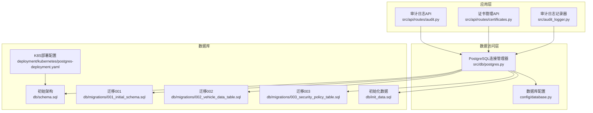
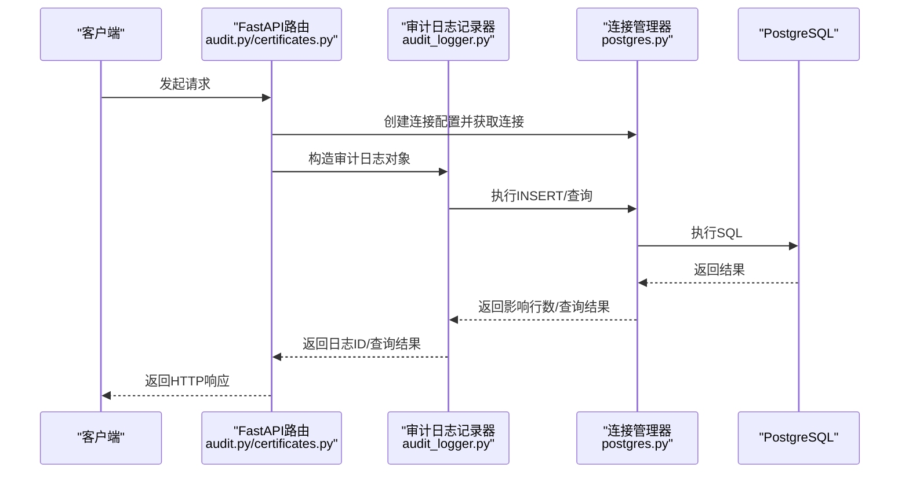
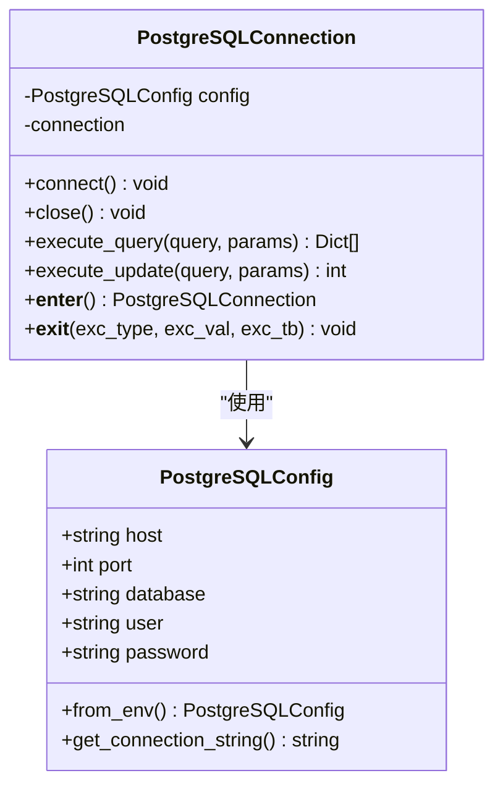
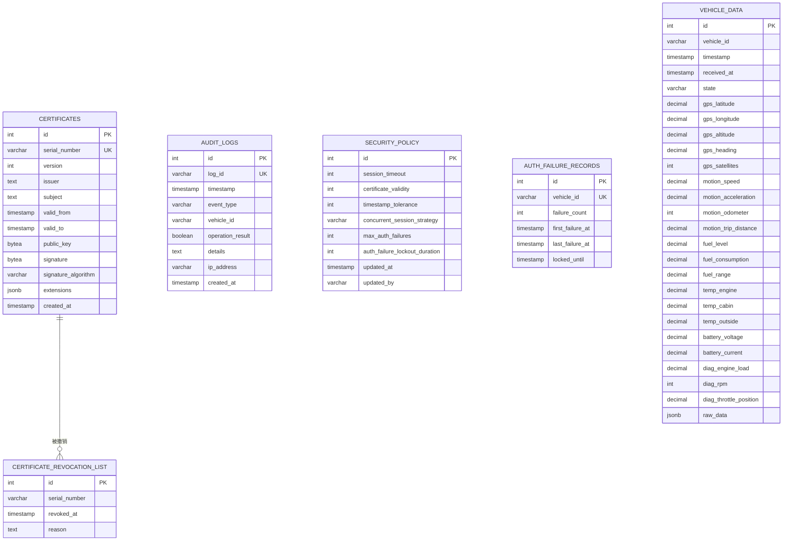
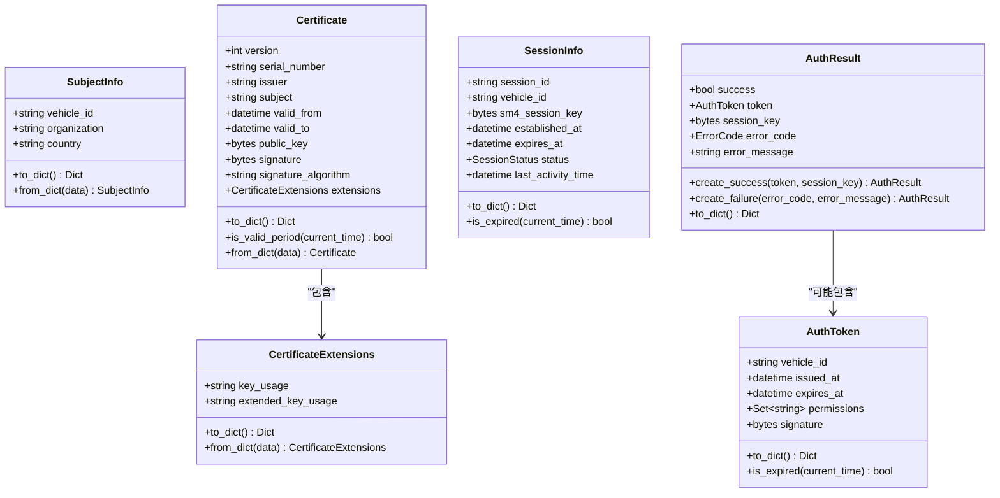
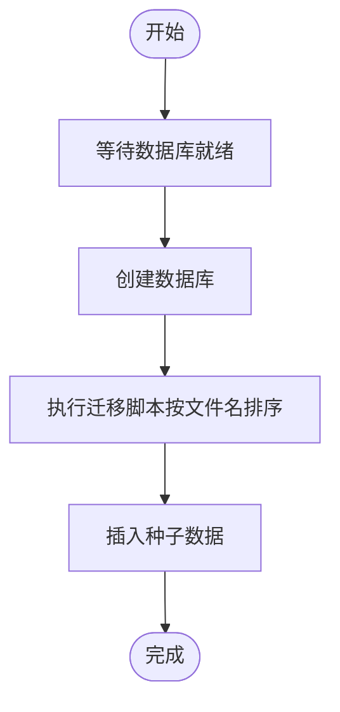
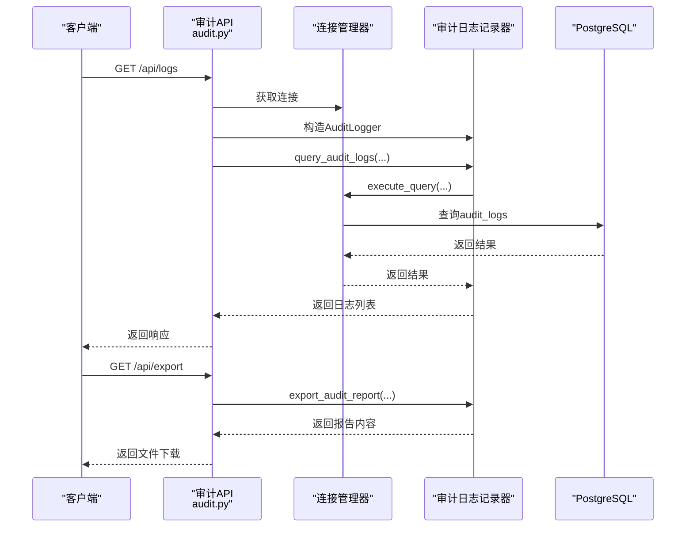
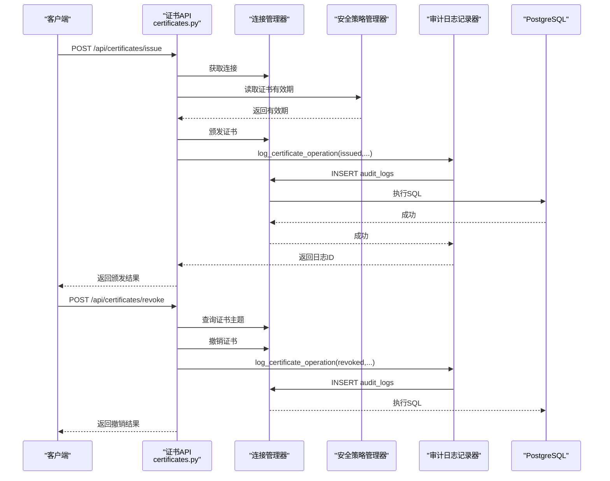
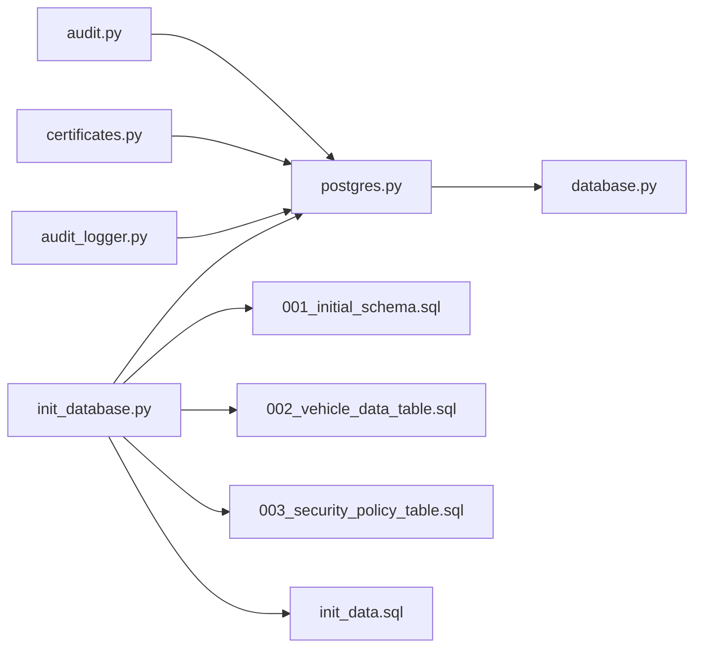

# PostgreSQL数据库

<cite>
**本文引用的文件**
- [config/database.py](file://config/database.py)
- [src/db/postgres.py](file://src/db/postgres.py)
- [db/schema.sql](file://db/schema.sql)
- [db/init_data.sql](file://db/init_data.sql)
- [scripts/init_database.py](file://scripts/init_database.py)
- [db/migrations/001_initial_schema.sql](file://db/migrations/001_initial_schema.sql)
- [db/migrations/002_vehicle_data_table.sql](file://db/migrations/002_vehicle_data_table.sql)
- [db/migrations/003_security_policy_table.sql](file://db/migrations/003_security_policy_table.sql)
- [src/models/certificate.py](file://src/models/certificate.py)
- [src/models/session.py](file://src/models/session.py)
- [src/api/routes/audit.py](file://src/api/routes/audit.py)
- [src/api/routes/certificates.py](file://src/api/routes/certificates.py)
- [src/audit_logger.py](file://src/audit_logger.py)
- [deployment/kubernetes/postgres-deployment.yaml](file://deployment/kubernetes/postgres-deployment.yaml)
- [docs/OPERATIONS.md](file://docs/OPERATIONS.md)
</cite>

## 目录
1. [简介](#简介)
2. [项目结构](#项目结构)
3. [核心组件](#核心组件)
4. [架构总览](#架构总览)
5. [详细组件分析](#详细组件分析)
6. [依赖分析](#依赖分析)
7. [性能考虑](#性能考虑)
8. [故障排查指南](#故障排查指南)
9. [结论](#结论)
10. [附录](#附录)

## 简介
本文件面向PostgreSQL数据库系统，围绕连接管理器、事务处理、异常处理、数据库架构设计、迁移策略与版本管理、数据模型设计、查询优化与索引设计、数据初始化与种子数据、配置参数与性能调优、以及数据库管理员的备份恢复与监控操作进行系统化说明。文档同时结合代码库中的Python连接层、SQL迁移脚本、API路由与审计日志模块，给出可操作的技术细节与最佳实践。

## 项目结构
该仓库采用“后端应用 + 数据库脚本 + 运维文档”的组织方式：
- config：数据库连接配置类，提供从环境变量加载配置与连接串生成能力
- src/db：PostgreSQL连接管理器，封装连接、查询、更新与上下文管理
- db：数据库架构与迁移脚本、初始化数据
- scripts：数据库初始化脚本，负责等待数据库就绪、创建数据库、执行迁移与插入种子数据
- src/api/routes：审计日志与证书管理API路由，展示如何通过连接管理器访问数据库
- src/audit_logger：审计日志记录器，统一持久化审计事件
- deployment/kubernetes：Kubernetes中PostgreSQL部署与探活配置
- docs：运维手册，涵盖日常运维、备份恢复、监控与容量规划

**图表来源**
- [config/database.py:1-50](file://config/database.py#L1-L50)
- [src/db/postgres.py:1-53](file://src/db/postgres.py#L1-L53)
- [db/schema.sql:1-104](file://db/schema.sql#L1-L104)
- [db/migrations/001_initial_schema.sql:1-69](file://db/migrations/001_initial_schema.sql#L1-L69)
- [db/migrations/002_vehicle_data_table.sql:1-111](file://db/migrations/002_vehicle_data_table.sql#L1-L111)
- [db/migrations/003_security_policy_table.sql:1-62](file://db/migrations/003_security_policy_table.sql#L1-L62)
- [db/init_data.sql:1-61](file://db/init_data.sql#L1-L61)
- [deployment/kubernetes/postgres-deployment.yaml:1-77](file://deployment/kubernetes/postgres-deployment.yaml#L1-L77)

**章节来源**
- [config/database.py:1-50](file://config/database.py#L1-L50)
- [src/db/postgres.py:1-53](file://src/db/postgres.py#L1-L53)
- [db/schema.sql:1-104](file://db/schema.sql#L1-L104)
- [db/migrations/001_initial_schema.sql:1-69](file://db/migrations/001_initial_schema.sql#L1-L69)
- [db/migrations/002_vehicle_data_table.sql:1-111](file://db/migrations/002_vehicle_data_table.sql#L1-L111)
- [db/migrations/003_security_policy_table.sql:1-62](file://db/migrations/003_security_policy_table.sql#L1-L62)
- [db/init_data.sql:1-61](file://db/init_data.sql#L1-L61)
- [deployment/kubernetes/postgres-deployment.yaml:1-77](file://deployment/kubernetes/postgres-deployment.yaml#L1-L77)

## 核心组件
- 数据库配置类：提供从环境变量加载PostgreSQL配置的能力，并生成连接串
- 连接管理器：封装连接建立、关闭、查询与更新、上下文管理；使用psycopg2与RealDictCursor返回字典结果
- 迁移与初始化：通过脚本等待数据库就绪、创建数据库、顺序执行迁移脚本、插入种子数据
- 审计日志：统一生成日志ID、截断详细信息长度、持久化到audit_logs表，并提供查询与导出
- API路由：审计日志查询与导出、证书颁发/撤销/CRL查询，均通过连接管理器访问数据库

**章节来源**
- [config/database.py:8-31](file://config/database.py#L8-L31)
- [src/db/postgres.py:9-53](file://src/db/postgres.py#L9-L53)
- [scripts/init_database.py:14-151](file://scripts/init_database.py#L14-L151)
- [src/audit_logger.py:26-480](file://src/audit_logger.py#L26-L480)
- [src/api/routes/audit.py:39-191](file://src/api/routes/audit.py#L39-L191)
- [src/api/routes/certificates.py:81-390](file://src/api/routes/certificates.py#L81-L390)

## 架构总览
系统采用“API层 → 审计日志记录器 → 数据库连接管理器 → PostgreSQL”的分层架构。API路由负责请求解析与鉴权，审计日志记录器负责事件持久化，连接管理器负责数据库交互，迁移脚本与初始化脚本负责数据库Schema与种子数据的建立。

**图表来源**
- [src/api/routes/audit.py:70-125](file://src/api/routes/audit.py#L70-L125)
- [src/api/routes/certificates.py:154-275](file://src/api/routes/certificates.py#L154-L275)
- [src/audit_logger.py:58-89](file://src/audit_logger.py#L58-L89)
- [src/db/postgres.py:32-45](file://src/db/postgres.py#L32-L45)

## 详细组件分析

### 连接管理器与事务处理
- 连接生命周期：连接管理器在进入上下文时建立连接，在退出时关闭连接；execute_query使用RealDictCursor返回字典结果，execute_update显式commit并返回受影响行数
- 事务特性：单次execute_update为原子操作；批量迁移由脚本顺序执行，最终commit
- 错误处理：连接管理器未在内部捕获异常，异常向上抛出，由上层API路由或审计日志记录器处理

**图表来源**
- [config/database.py:8-31](file://config/database.py#L8-L31)
- [src/db/postgres.py:9-53](file://src/db/postgres.py#L9-L53)

**章节来源**
- [src/db/postgres.py:16-53](file://src/db/postgres.py#L16-L53)
- [config/database.py:17-31](file://config/database.py#L17-L31)

### 数据库架构设计
- 证书表：包含序列号唯一、有效期校验、签名算法、扩展字段等；提供序列号与有效期索引
- 证书撤销列表：基于证书序列号外键关联，提供撤销时间与原因
- 审计日志表：包含日志唯一ID、事件类型、车辆ID、操作结果、详细信息（最大长度限制）、IP地址等；提供多字段索引
- 视图：有效证书视图，基于证书与CRL的左连接，过滤未撤销且在有效期内的证书
- 安全策略配置表：会话超时、证书有效期、时间戳容差、并发会话策略、认证失败次数阈值与锁定时长等；提供约束与索引
- 认证失败记录表：按车辆ID唯一，记录失败次数与锁定截止时间
- 车辆数据表：存储实时传感器数据，包含GPS、运动、燃油、温度、电池、诊断等字段；提供多索引与清理函数
- 视图与函数：最新车辆数据视图与旧数据清理函数

**图表来源**
- [db/schema.sql:3-104](file://db/schema.sql#L3-L104)
- [db/migrations/001_initial_schema.sql:7-68](file://db/migrations/001_initial_schema.sql#L7-L68)
- [db/migrations/002_vehicle_data_table.sql:4-111](file://db/migrations/002_vehicle_data_table.sql#L4-L111)
- [db/migrations/003_security_policy_table.sql:4-62](file://db/migrations/003_security_policy_table.sql#L4-L62)

**章节来源**
- [db/schema.sql:3-104](file://db/schema.sql#L3-L104)
- [db/migrations/001_initial_schema.sql:7-68](file://db/migrations/001_initial_schema.sql#L7-L68)
- [db/migrations/002_vehicle_data_table.sql:4-111](file://db/migrations/002_vehicle_data_table.sql#L4-L111)
- [db/migrations/003_security_policy_table.sql:4-62](file://db/migrations/003_security_policy_table.sql#L4-L62)

### 数据模型设计
- 证书模型：包含版本、序列号、签发者、主题、有效期、公钥、签名、签名算法、扩展等字段；提供序列化/反序列化与有效期判断
- 会话模型：包含会话ID、车辆ID、SM4会话密钥、建立时间、过期时间、状态、最后活动时间；提供过期判断与序列化
- 认证结果：成功/失败变体，携带令牌、会话密钥或错误码与消息

**图表来源**
- [src/models/certificate.py:8-108](file://src/models/certificate.py#L8-L108)
- [src/models/session.py:9-104](file://src/models/session.py#L9-L104)

**章节来源**
- [src/models/certificate.py:8-108](file://src/models/certificate.py#L8-L108)
- [src/models/session.py:9-104](file://src/models/session.py#L9-L104)

### 查询优化与索引设计原则
- 证书相关：serial_number唯一索引、(valid_from, valid_to)复合索引，支持快速查找与有效期过滤
- 审计日志：log_id、timestamp、vehicle_id、event_type等多字段索引，满足常见过滤与排序场景
- 安全策略：updated_at倒序索引，便于查询最新策略
- 认证失败记录：vehicle_id与locked_until索引，支持快速锁定状态查询
- 车辆数据：vehicle_id、timestamp、received_at及组合索引，配合latest_vehicle_data视图与cleanup函数，支撑高频写入与高效查询
- 设计原则：根据WHERE/ORDER BY/HAVING使用模式建立索引；避免过度索引导致写入性能下降；定期评估索引使用率

**章节来源**
- [db/schema.sql:20-53](file://db/schema.sql#L20-L53)
- [db/migrations/002_vehicle_data_table.sql:53-88](file://db/migrations/002_vehicle_data_table.sql#L53-L88)
- [db/migrations/003_security_policy_table.sql:22-57](file://db/migrations/003_security_policy_table.sql#L22-L57)

### 数据初始化脚本与种子数据管理
- 初始化脚本：等待数据库就绪、创建数据库、顺序执行迁移脚本、插入种子数据
- 种子数据：示例CA证书（开发测试用途）、默认安全策略配置；注意生产环境需替换真实CA与策略
- 迁移策略：按文件名顺序执行，确保Schema演进的确定性

**图表来源**
- [scripts/init_database.py:14-151](file://scripts/init_database.py#L14-L151)

**章节来源**
- [scripts/init_database.py:14-151](file://scripts/init_database.py#L14-L151)
- [db/init_data.sql:8-58](file://db/init_data.sql#L8-L58)

### 审计日志API与异常处理
- 审计日志查询：支持按时间范围、车辆ID、事件类型、操作结果过滤，限制返回条数
- 审计报告导出：支持JSON与CSV格式，生成报告元数据与日志列表
- 异常处理：API路由捕获HTTP异常与通用异常，返回500错误；审计日志记录器持久化失败不抛出异常，避免影响主流程

**图表来源**
- [src/api/routes/audit.py:70-125](file://src/api/routes/audit.py#L70-L125)
- [src/audit_logger.py:243-371](file://src/audit_logger.py#L243-L371)
- [src/db/postgres.py:32-45](file://src/db/postgres.py#L32-L45)

**章节来源**
- [src/api/routes/audit.py:39-191](file://src/api/routes/audit.py#L39-L191)
- [src/audit_logger.py:243-371](file://src/audit_logger.py#L243-L371)

### 证书管理API与审计联动
- 证书颁发：解析公钥、加载CA密钥、读取安全策略有效期、颁发证书并记录审计事件
- 证书撤销：查询证书主题提取车辆ID、撤销证书并记录审计事件
- CRL查询：直接查询撤销列表
- 异常处理：颁发/撤销失败时记录失败审计事件，避免影响主流程

**图表来源**
- [src/api/routes/certificates.py:154-275](file://src/api/routes/certificates.py#L154-L275)
- [src/api/routes/certificates.py:277-359](file://src/api/routes/certificates.py#L277-L359)
- [src/audit_logger.py:185-241](file://src/audit_logger.py#L185-L241)
- [src/db/postgres.py:32-45](file://src/db/postgres.py#L32-L45)

**章节来源**
- [src/api/routes/certificates.py:154-390](file://src/api/routes/certificates.py#L154-L390)
- [src/audit_logger.py:185-241](file://src/audit_logger.py#L185-L241)

## 依赖分析
- 组件耦合：API路由依赖连接管理器；审计日志记录器依赖连接管理器；连接管理器依赖数据库配置
- 外部依赖：psycopg2用于PostgreSQL连接；FastAPI用于API路由；pydantic用于请求/响应模型
- 迁移与初始化：脚本独立运行，不依赖应用启动流程，保证数据库Schema与种子数据的可控初始化

**图表来源**
- [src/api/routes/audit.py:13-17](file://src/api/routes/audit.py#L13-L17)
- [src/api/routes/certificates.py:13-19](file://src/api/routes/certificates.py#L13-L19)
- [src/audit_logger.py:22-24](file://src/audit_logger.py#L22-L24)
- [src/db/postgres.py:6](file://src/db/postgres.py#L6)
- [scripts/init_database.py:7-12](file://scripts/init_database.py#L7-L12)

**章节来源**
- [src/api/routes/audit.py:13-17](file://src/api/routes/audit.py#L13-L17)
- [src/api/routes/certificates.py:13-19](file://src/api/routes/certificates.py#L13-L19)
- [src/audit_logger.py:22-24](file://src/audit_logger.py#L22-L24)
- [src/db/postgres.py:6](file://src/db/postgres.py#L6)
- [scripts/init_database.py:7-12](file://scripts/init_database.py#L7-L12)

## 性能考虑
- 连接管理：建议在应用层引入连接池（如psycopg2.pool），减少频繁连接/断开开销
- 查询优化：遵循现有索引设计，避免全表扫描；对高频过滤字段（如vehicle_id、timestamp、event_type）保持索引有效性
- 写入优化：批量写入审计日志与车辆数据时，合并事务提交；合理设置pg_stat_statements与慢查询日志
- 存储与归档：定期归档旧审计日志；对车辆数据设置清理函数，控制表规模增长
- 监控与容量：参考运维手册中的容量估算与监控命令，持续评估数据库与Redis负载

[本节为通用指导，无需列出具体文件来源]

## 故障排查指南
- 连接问题：确认环境变量与连接串正确；检查Kubernetes部署中的探活配置；使用psql/pg_isready验证连接
- 迁移失败：核对迁移脚本顺序与语法；查看数据库权限与Schema一致性
- 审计日志异常：确认审计日志记录器的持久化逻辑与异常捕获；检查details长度限制与事件类型枚举
- 性能瓶颈：使用pg_stat_statements与索引使用统计分析慢查询；评估索引数量与覆盖度
- 备份恢复：按运维手册执行备份脚本与恢复流程；验证RTO/RPO目标

**章节来源**
- [deployment/kubernetes/postgres-deployment.yaml:42-57](file://deployment/kubernetes/postgres-deployment.yaml#L42-L57)
- [docs/OPERATIONS.md:239-392](file://docs/OPERATIONS.md#L239-L392)

## 结论
本系统通过清晰的分层架构与完善的数据库脚本，实现了证书、会话、审计日志与车辆数据的核心数据模型。连接管理器提供了简洁的数据库访问接口，审计日志记录器保障了合规性与可追溯性。配合迁移脚本与初始化流程，系统具备良好的可维护性与可扩展性。建议在生产环境中引入连接池、完善监控与告警，并定期评估索引与容量规划。

[本节为总结性内容，无需列出具体文件来源]

## 附录

### 数据库配置参数与性能调优要点
- 连接参数：host/port/database/user/password；建议通过环境变量注入
- 连接池：在应用层引入连接池，设置最小/最大连接数、空闲超时与查询超时
- 索引策略：基于WHERE/ORDER BY使用模式建立索引；定期分析表统计信息
- 统计与慢查询：启用pg_stat_statements与慢查询日志，定期分析热点SQL
- 归档与清理：对审计日志与车辆数据制定归档与清理策略，控制表规模

[本节为通用指导，无需列出具体文件来源]

### 运维操作手册摘要
- 服务管理：Docker Compose与Kubernetes环境下的启停、重启、扩缩容与日志查看
- 健康检查：API健康状态、数据库连接、Redis连接检查
- 证书管理：颁发、撤销、CRL查询与过期检查
- 会话管理：活跃会话查看、清理与强制关闭
- 审计日志：查询、导出与归档
- 性能监控：实时指标、数据库与Redis性能监控
- 备份策略：自动备份脚本与定时任务配置
- 升级与回滚：应用升级与数据库迁移、回滚策略
- 容量规划：数据库与Redis容量估算
- 灾难恢复：恢复流程与RTO/RPO目标

**章节来源**
- [docs/OPERATIONS.md:1-392](file://docs/OPERATIONS.md#L1-L392)