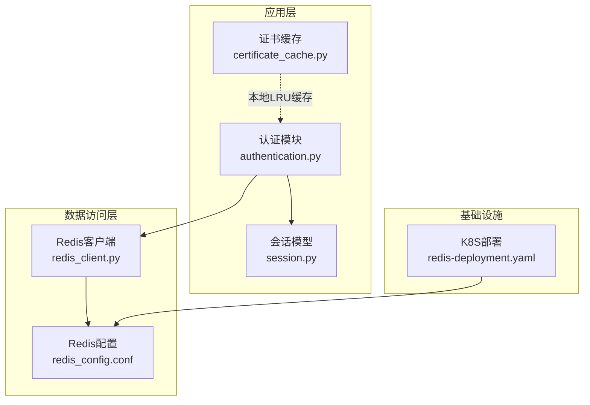
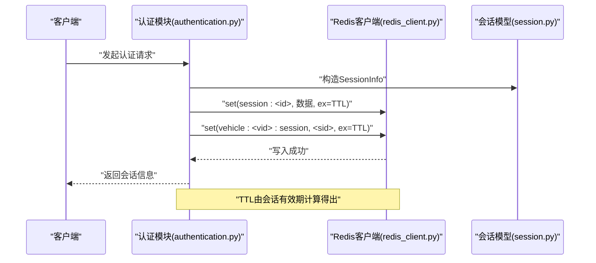
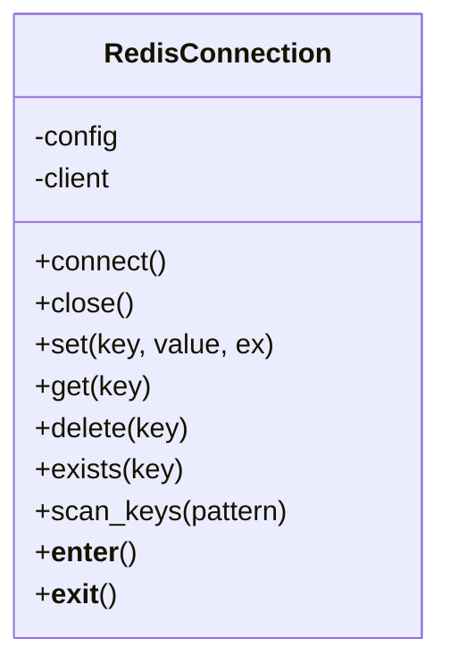
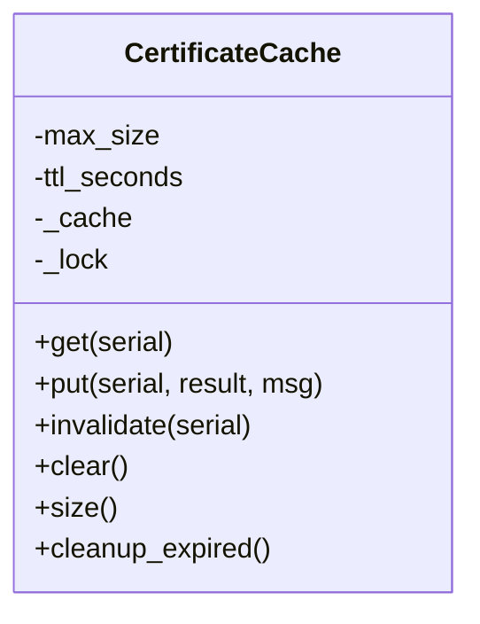
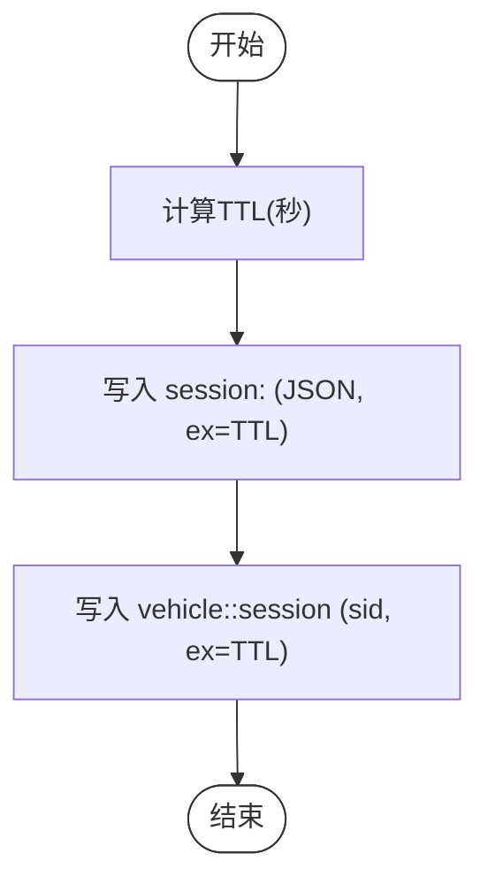
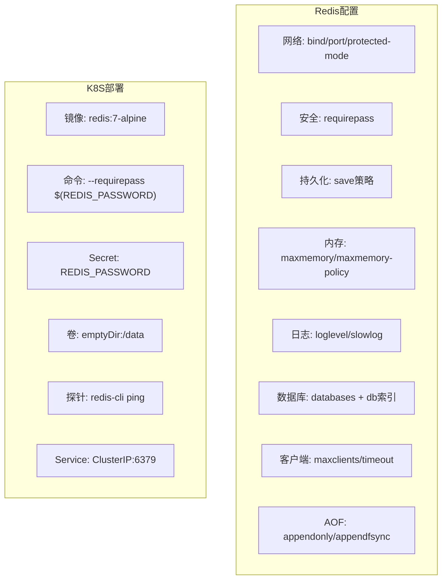
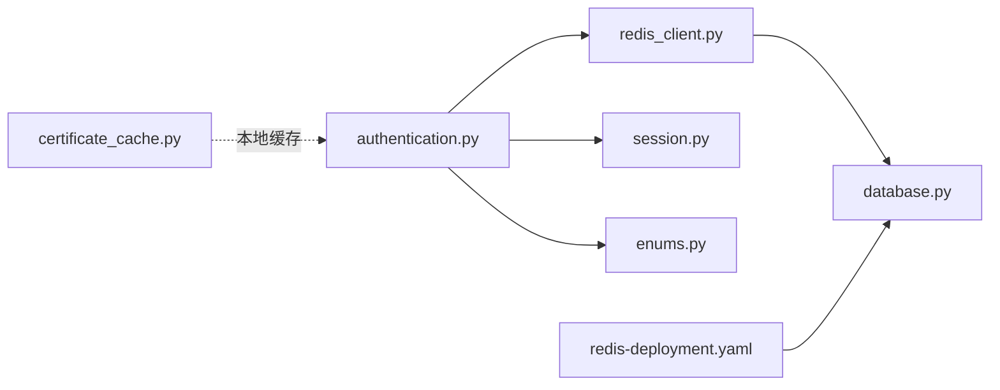

# Redis缓存系统

<cite>
**本文档引用的文件**
- [redis_client.py](file://src/db/redis_client.py)
- [certificate_cache.py](file://src/certificate_cache.py)
- [redis_config.conf](file://db/redis_config.conf)
- [redis-deployment.yaml](file://deployment/kubernetes/redis-deployment.yaml)
- [session.py](file://src/models/session.py)
- [enums.py](file://src/models/enums.py)
- [authentication.py](file://src/authentication.py)
- [database.py](file://config/database.py)
- [test_certificate_cache.py](file://tests/test_certificate_cache.py)
- [test_authentication.py](file://tests/test_authentication.py)
</cite>

## 目录
1. [简介](#简介)
2. [项目结构](#项目结构)
3. [核心组件](#核心组件)
4. [架构总览](#架构总览)
5. [详细组件分析](#详细组件分析)
6. [依赖关系分析](#依赖关系分析)
7. [性能考虑](#性能考虑)
8. [故障排除指南](#故障排除指南)
9. [结论](#结论)
10. [附录](#附录)

## 简介
本文件面向运维工程师与开发人员，系统化阐述本项目的Redis缓存体系，涵盖连接客户端实现、键空间设计、缓存策略与TTL管理、内存淘汰策略、性能优化、一致性与并发控制、配置调优与监控、以及部署与排障实践。内容基于仓库中现有的Redis客户端、证书缓存、会话模型、Kubernetes部署与配置等实现进行总结与扩展。

## 项目结构
Redis相关能力主要分布在以下模块：
- 连接与基础操作：src/db/redis_client.py
- 本地证书缓存（LRU + TTL）：src/certificate_cache.py
- Redis配置模板：db/redis_config.conf
- Kubernetes部署清单：deployment/kubernetes/redis-deployment.yaml
- 会话数据模型与认证流程：src/models/session.py、src/authentication.py
- 配置加载：config/database.py
- 单元测试：tests/test_certificate_cache.py、tests/test_authentication.py

图表来源
- [redis_client.py:1-79](file://src/db/redis_client.py#L1-L79)
- [certificate_cache.py:1-156](file://src/certificate_cache.py#L1-L156)
- [redis_config.conf:1-44](file://db/redis_config.conf#L1-L44)
- [redis-deployment.yaml:1-64](file://deployment/kubernetes/redis-deployment.yaml#L1-L64)
- [session.py:1-104](file://src/models/session.py#L1-L104)
- [authentication.py:1-200](file://src/authentication.py#L1-L200)

章节来源
- [redis_client.py:1-79](file://src/db/redis_client.py#L1-L79)
- [certificate_cache.py:1-156](file://src/certificate_cache.py#L1-L156)
- [redis_config.conf:1-44](file://db/redis_config.conf#L1-L44)
- [redis-deployment.yaml:1-64](file://deployment/kubernetes/redis-deployment.yaml#L1-L64)
- [session.py:1-104](file://src/models/session.py#L1-L104)
- [authentication.py:1-200](file://src/authentication.py#L1-L200)

## 核心组件
- Redis连接客户端：提供连接建立、基本读写、键扫描与上下文管理，支持按秒设置TTL。
- 本地证书缓存：基于线程安全的LRU队列与TTL，用于加速证书验证结果复用。
- 会话信息存储：通过认证流程将会话数据写入Redis并设置TTL，同时维护车辆到会话的映射键。
- Redis配置与部署：提供生产级配置模板与Kubernetes部署清单，含密码、持久化、内存策略、慢查询日志与探活健康检查。

章节来源
- [redis_client.py:15-79](file://src/db/redis_client.py#L15-L79)
- [certificate_cache.py:13-156](file://src/certificate_cache.py#L13-L156)
- [authentication.py:458-499](file://src/authentication.py#L458-L499)
- [redis_config.conf:12-43](file://db/redis_config.conf#L12-L43)
- [redis-deployment.yaml:16-50](file://deployment/kubernetes/redis-deployment.yaml#L16-L50)

## 架构总览
下图展示认证流程中Redis的使用路径与数据流向：

图表来源
- [authentication.py:458-499](file://src/authentication.py#L458-L499)
- [redis_client.py:31-44](file://src/db/redis_client.py#L31-L44)
- [session.py:37-70](file://src/models/session.py#L37-L70)

## 详细组件分析

### Redis连接客户端
- 连接管理：惰性连接，首次使用时建立连接；支持上下文管理自动关闭。
- 基础操作：set/get/delete/exists/scan_keys，scan_keys采用游标分批扫描，避免阻塞。
- TTL设置：set支持ex参数按秒设置过期时间。
- 字节处理：decode_responses=False，保持二进制数据完整性，适合加密密钥等场景。

图表来源
- [redis_client.py:8-79](file://src/db/redis_client.py#L8-L79)

章节来源
- [redis_client.py:15-79](file://src/db/redis_client.py#L15-L79)

### 本地证书缓存（LRU + TTL）
- 结构：使用有序字典实现LRU，配合时间戳实现TTL。
- 并发：通过线程锁保证多线程安全。
- 策略：容量满时淘汰最久未使用项；定期清理过期项。
- 接口：get/put/invalidate/clear/size/cleanup_expired。

图表来源
- [certificate_cache.py:13-156](file://src/certificate_cache.py#L13-L156)

章节来源
- [certificate_cache.py:13-156](file://src/certificate_cache.py#L13-L156)
- [test_certificate_cache.py:45-284](file://tests/test_certificate_cache.py#L45-L284)

### 会话信息存储与TTL
- 键命名：session:<id> 存储会话JSON；vehicle:<vid>:session 映射车辆与会话ID。
- TTL计算：基于会话建立到过期的时间差，确保会话生命周期与Redis一致。
- 写入流程：先写会话键，再写车辆映射键，均带TTL。
- 关闭流程：读取会话信息后删除两个键，确保原子性与一致性。

图表来源
- [authentication.py:458-499](file://src/authentication.py#L458-L499)
- [session.py:37-70](file://src/models/session.py#L37-L70)

章节来源
- [authentication.py:458-499](file://src/authentication.py#L458-L499)
- [session.py:37-70](file://src/models/session.py#L37-L70)

### Redis配置与部署
- 生产配置要点：绑定地址、密码保护、持久化策略、最大内存与淘汰策略、慢查询阈值、最大客户端数与超时。
- 数据库划分：通过databases与db索引区分会话、缓存、Nonce追踪等用途。
- Kubernetes部署：容器镜像、命令行参数注入密码、emptyDir卷挂载、存活/就绪探针、ClusterIP服务暴露。

图表来源
- [redis_config.conf:4-43](file://db/redis_config.conf#L4-L43)
- [redis-deployment.yaml:16-63](file://deployment/kubernetes/redis-deployment.yaml#L16-L63)

章节来源
- [redis_config.conf:12-43](file://db/redis_config.conf#L12-L43)
- [redis-deployment.yaml:16-63](file://deployment/kubernetes/redis-deployment.yaml#L16-L63)

## 依赖关系分析
- 认证模块依赖Redis客户端进行会话数据的读写与清理。
- 会话模型提供数据结构与校验，确保写入Redis的数据格式正确。
- 证书缓存作为本地加速层，减少重复验证开销，与Redis会话缓存互补。
- 配置模块提供Redis连接参数的环境变量加载。

图表来源
- [authentication.py:16-18](file://src/authentication.py#L16-L18)
- [redis_client.py:5](file://src/db/redis_client.py#L5)
- [database.py:34-49](file://config/database.py#L34-L49)
- [redis-deployment.yaml:25-30](file://deployment/kubernetes/redis-deployment.yaml#L25-L30)

章节来源
- [authentication.py:16-18](file://src/authentication.py#L16-L18)
- [redis_client.py:5](file://src/db/redis_client.py#L5)
- [database.py:34-49](file://config/database.py#L34-L49)
- [redis-deployment.yaml:25-30](file://deployment/kubernetes/redis-deployment.yaml#L25-L30)

## 性能考虑
- 键命名规范
  - 会话键：session:<id>，清晰表达业务域与实体ID。
  - 车辆映射键：vehicle:<vid>:session，便于按车辆快速定位会话。
- 批量与扫描
  - scan_keys采用游标分批扫描，避免阻塞；建议在高负载场景下限制count并结合业务模式使用。
- 管道与流水线
  - 当前实现未使用pipeline；对于高频写入场景（如批量会话建立），可在Redis客户端封装pipeline以降低RTT。
- TTL与内存
  - 会话写入时统一设置TTL，利用Redis自动过期特性；结合maxmemory-policy allkeys-lru实现内存压力下的LRU淘汰。
- 并发与一致性
  - 会话写入与关闭涉及两个键，建议在应用层保证事务性（如使用Lua脚本或Redis事务）以避免竞态。
- 本地缓存
  - 证书缓存采用LRU+TTL，显著降低重复验证成本；建议定期cleanup_expired以释放内存。

章节来源
- [authentication.py:458-499](file://src/authentication.py#L458-L499)
- [redis_client.py:51-71](file://src/db/redis_client.py#L51-L71)
- [certificate_cache.py:120-139](file://src/certificate_cache.py#L120-L139)
- [redis_config.conf:17-19](file://db/redis_config.conf#L17-L19)

## 故障排除指南
- 连接问题
  - 确认Redis密码、主机与端口配置正确；检查K8S Secret是否注入成功。
  - 查看Redis日志与慢查询日志，定位慢操作与异常。
- 键扫描与阻塞
  - 若scan_keys导致性能抖动，调整count或在低峰期执行；避免使用KEYS。
- 会话清理
  - Redis具备自动过期清理；若需主动清理，可在应用层定期扫描并删除过期键。
- 并发冲突
  - 处理同一车辆并发会话冲突时，确认策略（拒绝新会话或终止旧会话）与实现逻辑一致。
- 单元测试参考
  - 通过测试用例验证缓存行为（TTL、LRU、清理）、会话写入/关闭、冲突处理等。

章节来源
- [redis_config.conf:21-34](file://db/redis_config.conf#L21-L34)
- [redis-deployment.yaml:34-47](file://deployment/kubernetes/redis-deployment.yaml#L34-L47)
- [authentication.py:554-597](file://src/authentication.py#L554-L597)
- [test_authentication.py:409-448](file://tests/test_authentication.py#L409-L448)
- [test_certificate_cache.py:45-284](file://tests/test_certificate_cache.py#L45-L284)

## 结论
本Redis缓存系统通过“应用侧TTL + Redis自动过期 + LRU淘汰”的组合，在会话管理与证书验证加速方面实现了高效与稳定。建议在生产中结合pipeline、事务与更细粒度的监控指标进一步优化性能与可靠性，并持续关注Kubernetes资源与Redis配置的平衡。

## 附录

### Redis配置参数调优要点
- 持久化：合理设置save策略，兼顾数据安全与写放大。
- 内存：maxmemory与maxmemory-policy需结合业务特征选择（allkeys-lru适合缓存场景）。
- 客户端：maxclients与timeout需与应用并发与网络稳定性匹配。
- 日志：slowlog-log-slower-than与slowlog-max-len用于定位热点命令。

章节来源
- [redis_config.conf:12-38](file://db/redis_config.conf#L12-L38)

### 监控指标建议
- 连接层：连接数、超时次数、拒绝连接数。
- 命令层：慢查询计数与耗时分布、键扫描频率。
- 内存层：used_memory、mem_fragmentation_ratio、evicted_keys。
- 业务层：会话建立/查询延迟、缓存命中率（本地证书缓存）。

章节来源
- [redis_config.conf:32-34](file://db/redis_config.conf#L32-L34)
- [certificate_cache.py:111-118](file://src/certificate_cache.py#L111-L118)

### 运维部署最佳实践
- 使用Kubernetes Secret管理密码，避免硬编码。
- 为Redis配置emptyDir或持久化卷，结合备份策略。
- 设置健康检查与资源限制，保障稳定性。
- 通过Service暴露Redis，配合命名空间隔离。

章节来源
- [redis-deployment.yaml:25-30](file://deployment/kubernetes/redis-deployment.yaml#L25-L30)
- [redis-deployment.yaml:48-50](file://deployment/kubernetes/redis-deployment.yaml#L48-L50)