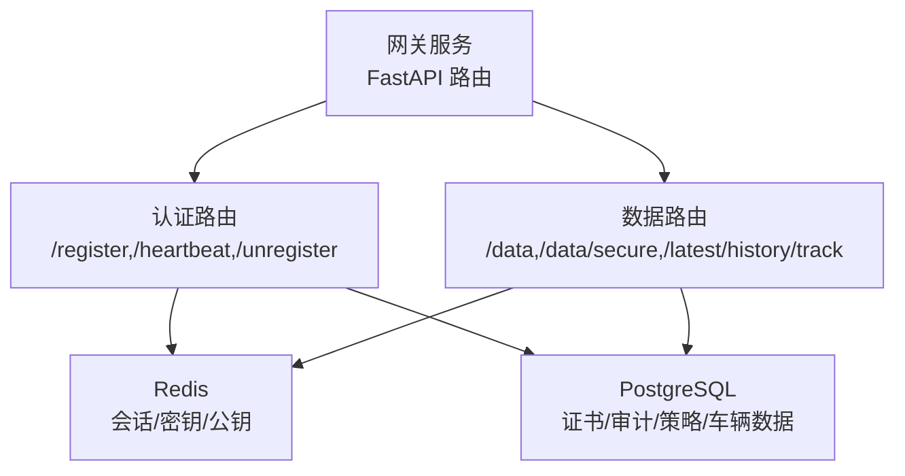
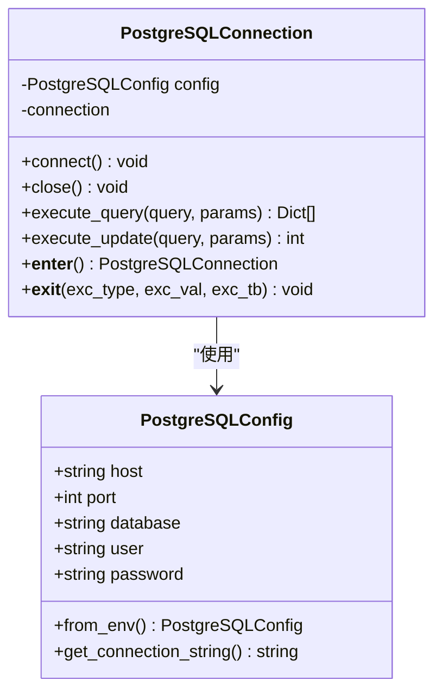
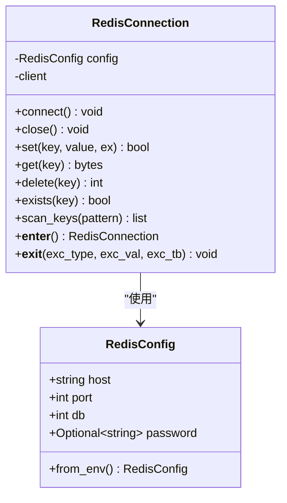
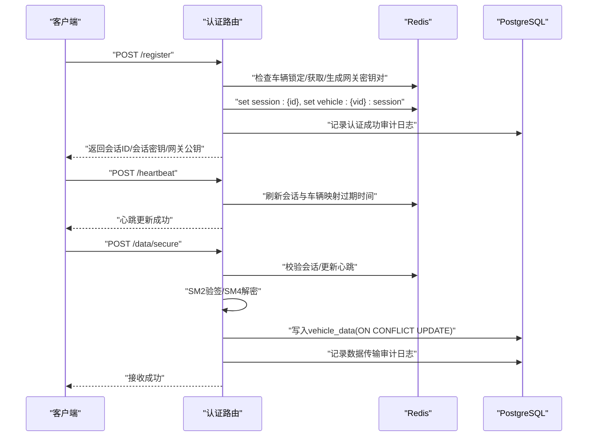
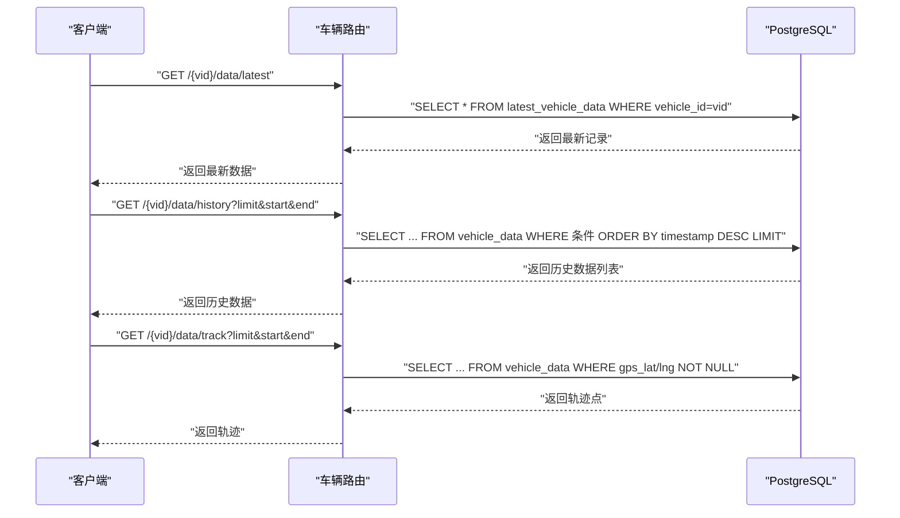
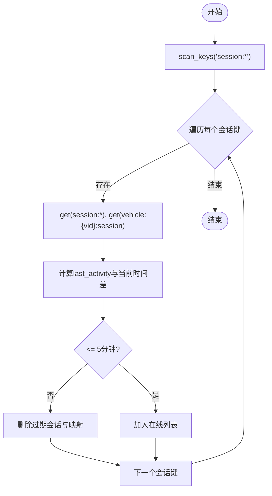
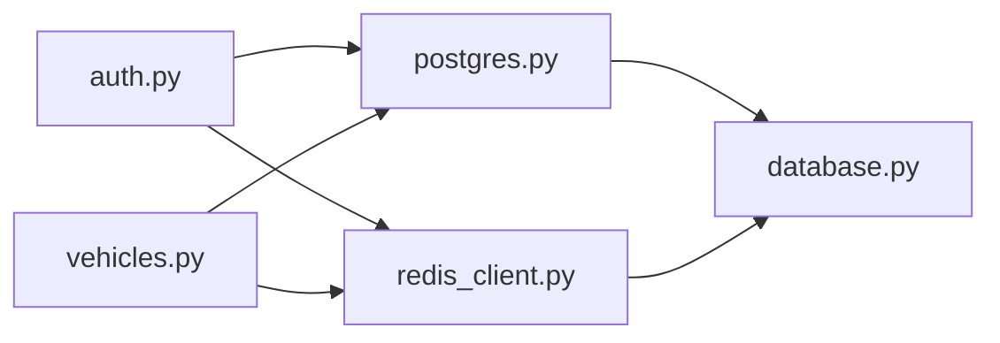

# 数据库与缓存

<cite>
**本文引用的文件**
- [config/database.py](file://config/database.py)
- [src/db/postgres.py](file://src/db/postgres.py)
- [src/db/redis_client.py](file://src/db/redis_client.py)
- [db/schema.sql](file://db/schema.sql)
- [db/init_data.sql](file://db/init_data.sql)
- [db/migrations/001_initial_schema.sql](file://db/migrations/001_initial_schema.sql)
- [db/migrations/002_vehicle_data_table.sql](file://db/migrations/002_vehicle_data_table.sql)
- [db/migrations/003_security_policy_table.sql](file://db/migrations/003_security_policy_table.sql)
- [db/redis_config.conf](file://db/redis_config.conf)
- [scripts/init_database.py](file://scripts/init_database.py)
- [src/api/routes/auth.py](file://src/api/routes/auth.py)
- [src/api/routes/vehicles.py](file://src/api/routes/vehicles.py)
- [src/models/session.py](file://src/models/session.py)
- [src/models/certificate.py](file://src/models/certificate.py)
- [src/models/audit.py](file://src/models/audit.py)
</cite>

## 目录
1. [简介](#简介)
2. [项目结构](#项目结构)
3. [核心组件](#核心组件)
4. [架构总览](#架构总览)
5. [详细组件分析](#详细组件分析)
6. [依赖关系分析](#依赖关系分析)
7. [性能考量](#性能考量)
8. [故障排除指南](#故障排除指南)
9. [结论](#结论)
10. [附录](#附录)

## 简介
本文件面向数据库管理员与运维工程师，系统性梳理车联网安全通信网关的数据库与缓存体系，覆盖以下主题：
- PostgreSQL 数据库配置与使用：连接管理、事务处理、查询优化与一致性保障
- Redis 缓存配置与应用：会话存储、缓存策略与性能优化
- 数据库迁移策略与版本管理
- 并发控制与数据一致性
- 索引设计与查询性能调优
- 数据备份与恢复策略
- 连接配置与故障排除

## 项目结构
本项目采用“按职责分层”的组织方式，数据库与缓存相关代码主要分布在如下位置：
- 配置层：统一读取环境变量并构造连接配置
- 数据访问层：封装 PostgreSQL 与 Redis 的连接与常用操作
- 架构与迁移：SQL 架构定义、索引与视图、迁移脚本
- 应用层：API 路由中对数据库与缓存的具体使用
- 初始化工具：自动化数据库初始化与迁移

```mermaid
graph TB
subgraph "配置层"
CFG["config/database.py<br/>PostgreSQLConfig/RedisConfig"]
end
subgraph "数据访问层"
PG["src/db/postgres.py<br/>PostgreSQLConnection"]
RDS["src/db/redis_client.py<br/>RedisConnection"]
end
subgraph "架构与迁移"
SCHEMA["db/schema.sql<br/>初始架构/索引/视图"]
MIG1["db/migrations/001_initial_schema.sql"]
MIG2["db/migrations/002_vehicle_data_table.sql"]
MIG3["db/migrations/003_security_policy_table.sql"]
INITDATA["db/init_data.sql<br/>默认策略/示例证书"]
REDISCONF["db/redis_config.conf<br/>Redis 配置"]
end
subgraph "应用层"
AUTH["src/api/routes/auth.py<br/>注册/心跳/数据接收"]
VEH["src/api/routes/vehicles.py<br/>在线车辆/历史数据/轨迹"]
end
subgraph "初始化工具"
INITDB["scripts/init_database.py<br/>等待PG/创建库/执行迁移/插入初始化数据"]
end
CFG --> PG
CFG --> RDS
PG <- --> AUTH
RDS <- --> AUTH
PG <- --> VEH
SCHEMA --> MIG1
SCHEMA --> MIG2
SCHEMA --> MIG3
INITDATA --> INITDB
REDISCONF --> RDS
INITDB --> PG
```

图表来源
- [config/database.py:1-50](file://config/database.py#L1-L50)
- [src/db/postgres.py:1-53](file://src/db/postgres.py#L1-L53)
- [src/db/redis_client.py:1-79](file://src/db/redis_client.py#L1-L79)
- [db/schema.sql:1-104](file://db/schema.sql#L1-L104)
- [db/migrations/001_initial_schema.sql:1-69](file://db/migrations/001_initial_schema.sql#L1-L69)
- [db/migrations/002_vehicle_data_table.sql:1-111](file://db/migrations/002_vehicle_data_table.sql#L1-L111)
- [db/migrations/003_security_policy_table.sql:1-62](file://db/migrations/003_security_policy_table.sql#L1-L62)
- [db/init_data.sql:1-61](file://db/init_data.sql#L1-L61)
- [db/redis_config.conf:1-44](file://db/redis_config.conf#L1-L44)
- [scripts/init_database.py:1-151](file://scripts/init_database.py#L1-L151)
- [src/api/routes/auth.py:1-685](file://src/api/routes/auth.py#L1-L685)
- [src/api/routes/vehicles.py:1-447](file://src/api/routes/vehicles.py#L1-L447)

章节来源
- [config/database.py:1-50](file://config/database.py#L1-L50)
- [src/db/postgres.py:1-53](file://src/db/postgres.py#L1-L53)
- [src/db/redis_client.py:1-79](file://src/db/redis_client.py#L1-L79)
- [db/schema.sql:1-104](file://db/schema.sql#L1-L104)
- [db/migrations/001_initial_schema.sql:1-69](file://db/migrations/001_initial_schema.sql#L1-L69)
- [db/migrations/002_vehicle_data_table.sql:1-111](file://db/migrations/002_vehicle_data_table.sql#L1-L111)
- [db/migrations/003_security_policy_table.sql:1-62](file://db/migrations/003_security_policy_table.sql#L1-L62)
- [db/init_data.sql:1-61](file://db/init_data.sql#L1-L61)
- [db/redis_config.conf:1-44](file://db/redis_config.conf#L1-L44)
- [scripts/init_database.py:1-151](file://scripts/init_database.py#L1-L151)
- [src/api/routes/auth.py:1-685](file://src/api/routes/auth.py#L1-L685)
- [src/api/routes/vehicles.py:1-447](file://src/api/routes/vehicles.py#L1-L447)

## 核心组件
- PostgreSQL 配置与连接管理
  - 通过环境变量加载连接参数，支持连接字符串生成
  - 提供连接生命周期管理与上下文使用
- Redis 配置与连接管理
  - 支持密码认证、数据库选择与字节响应保持
  - 提供键值存取、存在性检查、扫描与上下文使用
- 数据库架构与迁移
  - 初始架构：证书、CRL、审计日志、视图
  - 车辆数据表：传感器字段、索引与清理函数
  - 安全策略表：会话超时、认证失败锁定等
- 应用集成
  - 认证与会话：Redis 存储会话，审计日志写入 PostgreSQL
  - 车辆数据：写入 PostgreSQL，查询使用视图与索引
- 初始化脚本
  - 自动等待 PostgreSQL 就绪、创建数据库、执行迁移、插入初始化数据

章节来源
- [config/database.py:8-50](file://config/database.py#L8-L50)
- [src/db/postgres.py:9-53](file://src/db/postgres.py#L9-L53)
- [src/db/redis_client.py:8-79](file://src/db/redis_client.py#L8-L79)
- [db/schema.sql:1-104](file://db/schema.sql#L1-L104)
- [db/migrations/001_initial_schema.sql:1-69](file://db/migrations/001_initial_schema.sql#L1-L69)
- [db/migrations/002_vehicle_data_table.sql:1-111](file://db/migrations/002_vehicle_data_table.sql#L1-L111)
- [db/migrations/003_security_policy_table.sql:1-62](file://db/migrations/003_security_policy_table.sql#L1-L62)
- [db/init_data.sql:1-61](file://db/init_data.sql#L1-L61)
- [scripts/init_database.py:14-151](file://scripts/init_database.py#L14-L151)

## 架构总览
下图展示应用如何通过 PostgreSQL 与 Redis 实现会话管理、数据存储与审计日志记录。



图表来源
- [src/api/routes/auth.py:70-330](file://src/api/routes/auth.py#L70-L330)
- [src/api/routes/vehicles.py:241-447](file://src/api/routes/vehicles.py#L241-L447)
- [src/db/postgres.py:9-53](file://src/db/postgres.py#L9-L53)
- [src/db/redis_client.py:8-79](file://src/db/redis_client.py#L8-L79)

## 详细组件分析

### PostgreSQL 组件分析
- 连接管理
  - 单实例连接复用，按需建立；支持上下文管理自动关闭
  - 查询返回字典列表，便于上层模型序列化
- 事务与更新
  - 更新操作显式提交，确保原子性
- 使用场景
  - 审计日志写入、车辆数据写入与查询、安全策略读取与更新



图表来源
- [config/database.py:8-31](file://config/database.py#L8-L31)
- [src/db/postgres.py:9-53](file://src/db/postgres.py#L9-L53)

章节来源
- [config/database.py:8-31](file://config/database.py#L8-L31)
- [src/db/postgres.py:9-53](file://src/db/postgres.py#L9-L53)

### Redis 组件分析
- 连接管理
  - 单实例连接复用，按需建立；支持上下文管理自动关闭
  - decode_responses=False 以保持加密数据的字节类型
- 常用操作
  - set/get/delete/exists/scan_keys
  - 会话键命名规范：session:{session_id}、vehicle:{vehicle_id}:session
- 使用场景
  - 会话存储与心跳刷新、车辆公钥缓存、网关密钥对缓存



图表来源
- [config/database.py:33-50](file://config/database.py#L33-L50)
- [src/db/redis_client.py:8-79](file://src/db/redis_client.py#L8-L79)

章节来源
- [config/database.py:33-50](file://config/database.py#L33-L50)
- [src/db/redis_client.py:8-79](file://src/db/redis_client.py#L8-L79)

### 数据库架构与迁移
- 初始架构（001）
  - 证书表与 CRL 表、审计日志表、有效证书视图
  - 关键索引：证书序列号、有效期范围、审计日志多字段索引
- 车辆数据表（002）
  - 丰富传感器字段、唯一约束 vehicle_id+timestamp
  - 索引：vehicle_id、timestamp、received_at、复合索引
  - 视图 latest_vehicle_data、清理函数 cleanup_old_vehicle_data
- 安全策略表（003）
  - 会话超时、证书有效期、时间戳容差、并发策略、认证失败阈值与锁定时长
  - 认证失败记录表与索引
- 初始化数据
  - 示例 CA 证书（开发测试）、默认安全策略

```mermaid
erDiagram
CERTIFICATES {
serial_number PK
valid_from
valid_to
}
CERTIFICATE_REVOCATION_LIST {
serial_number FK
}
AUDIT_LOGS {
log_id PK
timestamp
vehicle_id
event_type
}
SECURITY_POLICY {
id PK
session_timeout
certificate_validity
timestamp_tolerance
concurrent_session_strategy
max_auth_failures
auth_failure_lockout_duration
}
AUTH_FAILURE_RECORDS {
vehicle_id PK
failure_count
locked_until
}
VEHICLE_DATA {
id PK
vehicle_id
timestamp
received_at
}
CERTIFICATES ||--o{ CERTIFICATE_REVOCATION_LIST : "关联"
VEHICLE_DATA }o--|| AUDIT_LOGS : "间接关联(通过业务)"
```

图表来源
- [db/schema.sql:3-104](file://db/schema.sql#L3-L104)
- [db/migrations/001_initial_schema.sql:7-69](file://db/migrations/001_initial_schema.sql#L7-L69)
- [db/migrations/002_vehicle_data_table.sql:4-111](file://db/migrations/002_vehicle_data_table.sql#L4-L111)
- [db/migrations/003_security_policy_table.sql:4-62](file://db/migrations/003_security_policy_table.sql#L4-L62)

章节来源
- [db/schema.sql:1-104](file://db/schema.sql#L1-L104)
- [db/migrations/001_initial_schema.sql:1-69](file://db/migrations/001_initial_schema.sql#L1-L69)
- [db/migrations/002_vehicle_data_table.sql:1-111](file://db/migrations/002_vehicle_data_table.sql#L1-L111)
- [db/migrations/003_security_policy_table.sql:1-62](file://db/migrations/003_security_policy_table.sql#L1-L62)
- [db/init_data.sql:1-61](file://db/init_data.sql#L1-L61)

### 认证与会话流程（API 层）
- 注册流程
  - 生成会话 ID 与 SM4 会话密钥
  - 生成或获取网关 SM2 密钥对并缓存
  - 保存会话与车辆映射到 Redis，设置过期时间
  - 成功/失败均记录审计日志
- 心跳流程
  - 刷新会话与车辆映射的过期时间
- 数据接收流程
  - 验证会话有效性，更新心跳
  - 解密与验签后写入车辆数据表
  - 记录数据传输审计事件



图表来源
- [src/api/routes/auth.py:70-230](file://src/api/routes/auth.py#L70-L230)
- [src/api/routes/auth.py:232-287](file://src/api/routes/auth.py#L232-L287)
- [src/api/routes/auth.py:332-540](file://src/api/routes/auth.py#L332-L540)

章节来源
- [src/api/routes/auth.py:70-230](file://src/api/routes/auth.py#L70-L230)
- [src/api/routes/auth.py:232-287](file://src/api/routes/auth.py#L232-L287)
- [src/api/routes/auth.py:332-540](file://src/api/routes/auth.py#L332-L540)

### 车辆数据查询流程（API 层）
- 最新数据：使用 latest_vehicle_data 视图
- 历史数据：按 vehicle_id 与时间范围查询
- 轨迹数据：筛选 GPS 字段非空并排序



图表来源
- [src/api/routes/vehicles.py:241-317](file://src/api/routes/vehicles.py#L241-L317)
- [src/api/routes/vehicles.py:319-386](file://src/api/routes/vehicles.py#L319-L386)
- [src/api/routes/vehicles.py:388-447](file://src/api/routes/vehicles.py#L388-L447)

章节来源
- [src/api/routes/vehicles.py:241-317](file://src/api/routes/vehicles.py#L241-L317)
- [src/api/routes/vehicles.py:319-386](file://src/api/routes/vehicles.py#L319-L386)
- [src/api/routes/vehicles.py:388-447](file://src/api/routes/vehicles.py#L388-L447)

### 复杂逻辑：车辆在线状态与扫描
- 在线车辆扫描：遍历 session:* 键，检查 last_activity_time 是否在 5 分钟内
- 车辆搜索：遍历 session:* 键，匹配 vehicle_id
- 过期会话清理：自动删除超时的会话与映射



图表来源
- [src/api/routes/vehicles.py:38-99](file://src/api/routes/vehicles.py#L38-L99)
- [src/api/routes/vehicles.py:184-239](file://src/api/routes/vehicles.py#L184-L239)

章节来源
- [src/api/routes/vehicles.py:38-99](file://src/api/routes/vehicles.py#L38-L99)
- [src/api/routes/vehicles.py:184-239](file://src/api/routes/vehicles.py#L184-L239)

## 依赖关系分析
- 组件耦合
  - API 路由同时依赖 PostgreSQL 与 Redis，耦合度较高但职责清晰
  - 数据访问层对配置层低耦合，便于替换实现
- 外部依赖
  - PostgreSQL：psycopg2、JSONB、视图、函数
  - Redis：python-redis、SCAN、过期策略
- 潜在循环依赖
  - 未发现直接循环依赖；若后续引入共享模块需避免双向导入



图表来源
- [src/api/routes/auth.py:13-18](file://src/api/routes/auth.py#L13-L18)
- [src/api/routes/vehicles.py:14-17](file://src/api/routes/vehicles.py#L14-L17)
- [src/db/postgres.py:6](file://src/db/postgres.py#L6)
- [src/db/redis_client.py:5](file://src/db/redis_client.py#L5)
- [config/database.py:6](file://config/database.py#L6)

章节来源
- [src/api/routes/auth.py:13-18](file://src/api/routes/auth.py#L13-L18)
- [src/api/routes/vehicles.py:14-17](file://src/api/routes/vehicles.py#L14-L17)
- [src/db/postgres.py:6](file://src/db/postgres.py#L6)
- [src/db/redis_client.py:5](file://src/db/redis_client.py#L5)
- [config/database.py:6](file://config/database.py#L6)

## 性能考量
- PostgreSQL
  - 索引设计
    - 证书：serial_number、(valid_from, valid_to)
    - 审计日志：log_id、timestamp、vehicle_id、event_type
    - 车辆数据：vehicle_id、timestamp DESC、received_at DESC、(vehicle_id, timestamp DESC)
  - 查询优化
    - 使用视图 latest_vehicle_data 减少复杂聚合
    - 历史查询使用 LIMIT 控制结果集规模
    - ON CONFLICT UPDATE 避免重复写入开销
  - 事务与并发
    - 更新显式提交，保证原子性
    - 使用唯一约束 vehicle_id+timestamp 防止重复
- Redis
  - 会话键过期时间与心跳刷新，避免内存膨胀
  - SCAN 分批扫描，count 控制每次扫描数量
  - maxmemory 策略 allkeys-lru 控制淘汰
- 初始化与迁移
  - init_database.py 顺序执行：等待 PG 就绪 → 创建库 → 迁移 → 插入初始化数据，减少运行时异常

章节来源
- [db/schema.sql:20-53](file://db/schema.sql#L20-L53)
- [db/migrations/002_vehicle_data_table.sql:53-57](file://db/migrations/002_vehicle_data_table.sql#L53-L57)
- [src/db/postgres.py:32-45](file://src/db/postgres.py#L32-L45)
- [src/api/routes/vehicles.py:319-386](file://src/api/routes/vehicles.py#L319-L386)
- [src/db/redis_client.py:51-71](file://src/db/redis_client.py#L51-L71)
- [db/redis_config.conf:17-26](file://db/redis_config.conf#L17-L26)
- [scripts/init_database.py:14-95](file://scripts/init_database.py#L14-L95)

## 故障排除指南
- PostgreSQL 连接失败
  - 确认环境变量 POSTGRES_HOST/PORT/DB/USER/PASSWORD 正确
  - 使用 init_database.py 等待 PG 就绪再执行迁移
- Redis 连接失败
  - 确认 REDIS_HOST/PORT/DB/PASSWORD 正确
  - 检查 Redis 配置文件中的 bind/port/requirepass 设置
- 会话过期或无法找到
  - 检查 /heartbeat 是否定期刷新过期时间
  - 确认 vehicle:{vid}:session 映射存在
- 数据写入异常
  - 检查 vehicle_data 唯一约束与时间戳
  - 确认 ON CONFLICT UPDATE 逻辑是否满足预期
- 审计日志缺失
  - 确认审计日志记录在成功/失败分支均有调用
  - 检查 PostgreSQL 连接与权限

章节来源
- [config/database.py:17-30](file://config/database.py#L17-L30)
- [config/database.py:41-50](file://config/database.py#L41-L50)
- [scripts/init_database.py:14-34](file://scripts/init_database.py#L14-L34)
- [src/api/routes/auth.py:105-126](file://src/api/routes/auth.py#L105-L126)
- [src/api/routes/auth.py:232-287](file://src/api/routes/auth.py#L232-L287)
- [src/api/routes/vehicles.py:319-386](file://src/api/routes/vehicles.py#L319-L386)

## 结论
本项目在数据库与缓存层面实现了清晰的职责分离与良好的扩展性：
- PostgreSQL 通过视图、索引与迁移脚本保障数据一致性与查询效率
- Redis 通过会话与密钥缓存提升认证与数据接收性能
- 初始化脚本与配置抽象简化了部署与运维
建议在生产环境中进一步完善连接池、慢查询分析与备份策略，持续优化索引与查询计划。

## 附录
- 环境变量与配置要点
  - PostgreSQL：POSTGRES_HOST/PORT/DB/USER/PASSWORD
  - Redis：REDIS_HOST/PORT/DB/PASSWORD
- Redis 数据库划分建议
  - 会话数据库：0
  - 缓存数据库：1
  - Nonce 追踪数据库：2
- 备份与恢复建议
  - PostgreSQL：使用逻辑备份工具定期导出，结合 WAL 归档实现增量备份
  - Redis：启用 RDB/AOF 持久化，定期快照与 fsync 配置
- 版本管理与迁移
  - 迁移脚本按序执行，新增迁移时遵循“只增不改”原则，必要时添加数据转换步骤

章节来源
- [config/database.py:17-30](file://config/database.py#L17-L30)
- [config/database.py:41-50](file://config/database.py#L41-L50)
- [db/redis_config.conf:28-31](file://db/redis_config.conf#L28-L31)
- [scripts/init_database.py:67-95](file://scripts/init_database.py#L67-L95)