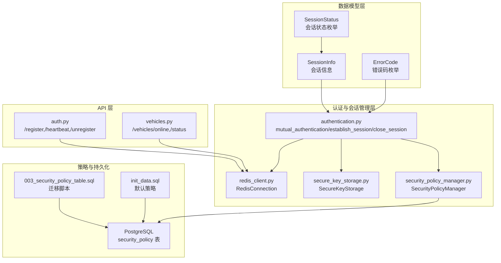
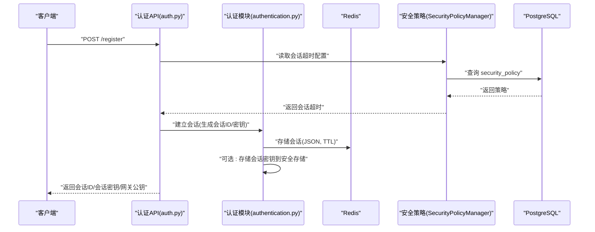
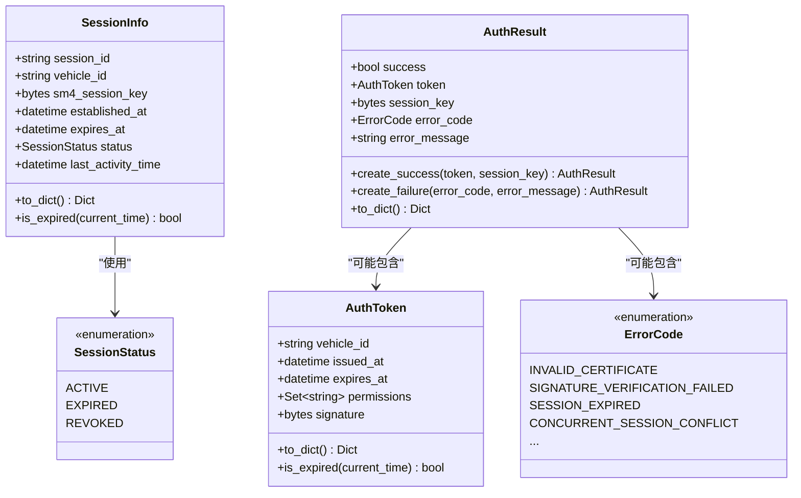
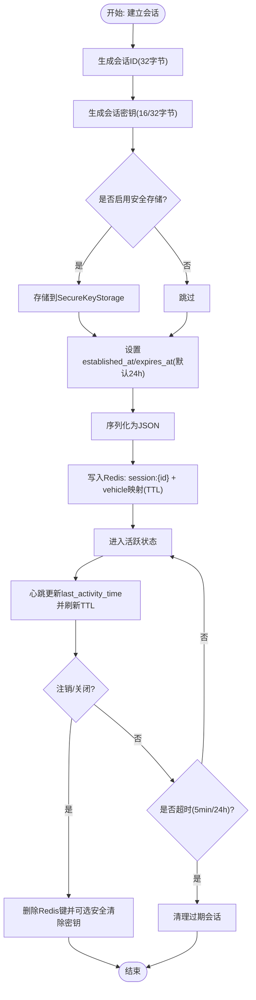
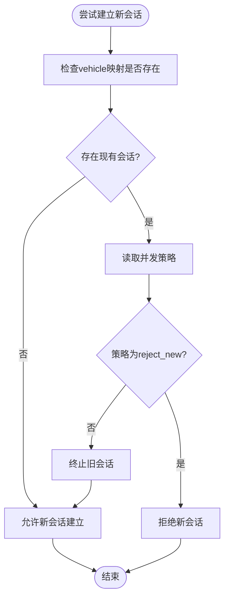
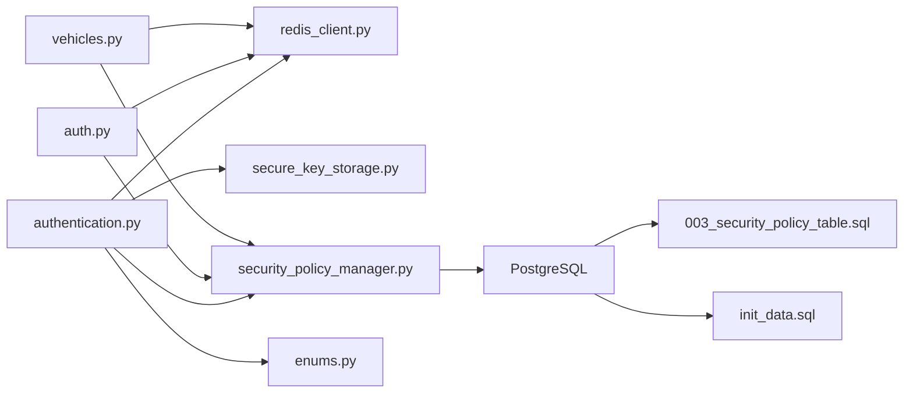

# 会话数据模型

<cite>
**本文档引用的文件**
- [session.py](file://src/models/session.py)
- [authentication.py](file://src/authentication.py)
- [redis_client.py](file://src/db/redis_client.py)
- [enums.py](file://src/models/enums.py)
- [secure_key_storage.py](file://src/secure_key_storage.py)
- [auth.py](file://src/api/routes/auth.py)
- [vehicles.py](file://src/api/routes/vehicles.py)
- [security_policy_manager.py](file://src/security_policy_manager.py)
- [test_session_timeout.py](file://examples/test_session_timeout.py)
- [003_security_policy_table.sql](file://db/migrations/003_security_policy_table.sql)
- [init_data.sql](file://db/init_data.sql)
</cite>

## 目录
1. [简介](#简介)
2. [项目结构](#项目结构)
3. [核心组件](#核心组件)
4. [架构概览](#架构概览)
5. [详细组件分析](#详细组件分析)
6. [依赖关系分析](#依赖关系分析)
7. [性能考量](#性能考量)
8. [故障排查指南](#故障排查指南)
9. [结论](#结论)
10. [附录](#附录)

## 简介
本文件系统性阐述会话数据模型的设计与实现，重点围绕 SessionInfo 类及其相关组件，涵盖会话生命周期管理、并发控制、自动清理、持久化与恢复、超时机制与安全考虑、序列化与反序列化、最佳实践与性能优化等。文档面向开发者与运维人员，既提供代码级细节，也给出可视化图示与实用建议。

## 项目结构
会话相关功能分布在以下模块：
- 数据模型层：会话数据模型与枚举类型
- 认证与会话管理层：双向认证、会话建立/关闭、冲突处理、过期清理
- 存储层：Redis 客户端封装、安全密钥存储
- API 层：会话注册、心跳、注销、数据接收等接口
- 策略层：安全策略持久化与应用（会话超时、并发策略等）

图表来源
- [session.py:37-69](file://src/models/session.py#L37-L69)
- [authentication.py:366-661](file://src/authentication.py#L366-L661)
- [redis_client.py:8-79](file://src/db/redis_client.py#L8-L79)
- [secure_key_storage.py:27-380](file://src/secure_key_storage.py#L27-L380)
- [auth.py:70-330](file://src/api/routes/auth.py#L70-L330)
- [vehicles.py:40-181](file://src/api/routes/vehicles.py#L40-L181)
- [security_policy_manager.py:19-120](file://src/security_policy_manager.py#L19-L120)
- [003_security_policy_table.sql:1-27](file://db/migrations/003_security_policy_table.sql#L1-L27)
- [init_data.sql:41-60](file://db/init_data.sql#L41-L60)

章节来源
- [session.py:1-104](file://src/models/session.py#L1-L104)
- [authentication.py:1-662](file://src/authentication.py#L1-L662)
- [redis_client.py:1-79](file://src/db/redis_client.py#L1-L79)
- [secure_key_storage.py:1-380](file://src/secure_key_storage.py#L1-L380)
- [auth.py:1-685](file://src/api/routes/auth.py#L1-L685)
- [vehicles.py:1-239](file://src/api/routes/vehicles.py#L1-L239)
- [security_policy_manager.py:1-322](file://src/security_policy_manager.py#L1-L322)
- [003_security_policy_table.sql:1-27](file://db/migrations/003_security_policy_table.sql#L1-L27)
- [init_data.sql:41-60](file://db/init_data.sql#L41-L60)

## 核心组件
- SessionInfo：会话数据模型，包含会话ID、车辆ID、会话密钥、建立时间、过期时间、状态、最后活动时间等字段，并提供序列化与过期判断能力。
- AuthToken：认证令牌，包含车辆ID、签发时间、过期时间、权限集合与签名，支持序列化与过期判断。
- AuthResult：认证结果容器，支持成功/失败两种变体，提供序列化与工厂方法。
- SessionStatus：会话状态枚举（ACTIVE/EXPIRED/REVOKED）。
- ErrorCode：错误码枚举，涵盖认证、会话、重放攻击等错误场景。
- RedisConnection：Redis 客户端封装，提供连接、set/get/delete/exists/scan_keys 等操作。
- SecureKeyStorage：安全密钥存储，模拟 HSM 功能，提供会话密钥的安全存储、清除与轮换。
- SecurityPolicyManager：安全策略管理，从数据库加载/保存策略，应用到会话超时、并发策略等。
- API 路由：/register、/heartbeat、/unregister 等，负责会话的建立、心跳刷新、注销与数据接收。

章节来源
- [session.py:37-104](file://src/models/session.py#L37-L104)
- [enums.py:28-56](file://src/models/enums.py#L28-L56)
- [redis_client.py:8-79](file://src/db/redis_client.py#L8-L79)
- [secure_key_storage.py:27-380](file://src/secure_key_storage.py#L27-L380)
- [security_policy_manager.py:19-120](file://src/security_policy_manager.py#L19-L120)
- [auth.py:70-330](file://src/api/routes/auth.py#L70-L330)
- [vehicles.py:40-181](file://src/api/routes/vehicles.py#L40-L181)

## 架构概览
会话生命周期贯穿“双向认证—会话建立—心跳维持—注销/过期清理”的闭环。系统采用 Redis 作为会话存储，PostgreSQL 持久化安全策略，SecureKeyStorage 提供会话密钥的安全存储与轮换。

图表来源
- [auth.py:70-200](file://src/api/routes/auth.py#L70-L200)
- [authentication.py:366-480](file://src/authentication.py#L366-L480)
- [security_policy_manager.py:100-120](file://src/security_policy_manager.py#L100-L120)
- [003_security_policy_table.sql:1-27](file://db/migrations/003_security_policy_table.sql#L1-L27)

## 详细组件分析

### SessionInfo 类设计与实现
- 字段与约束
  - session_id：唯一标识，长度为 32 字节（16进制字符串长度为 64）。
  - vehicle_id：所属车辆标识。
  - sm4_session_key：会话密钥，长度为 16 或 32 字节（128/256 位）。
  - established_at：会话建立时间。
  - expires_at：会话过期时间，需晚于建立时间。
  - status：会话状态，ACTIVE 时需满足当前时间早于过期时间。
  - last_activity_time：最后活动时间，位于建立时间与当前时间之间。
- 序列化与反序列化
  - to_dict：将 SessionInfo 转换为字典，日期字段使用 ISO 时间格式，二进制字段使用十六进制字符串。
  - is_expired：基于当前时间与 expires_at 比较，以及状态是否为 ACTIVE 判断是否过期。
- 设计要点
  - 使用 dataclass 简化字段定义与序列化。
  - 严格的时间与状态约束，确保会话有效性。
  - 与 AuthToken、AuthResult 协同，支撑认证与会话管理流程。

图表来源
- [session.py:37-104](file://src/models/session.py#L37-L104)
- [enums.py:28-56](file://src/models/enums.py#L28-L56)

章节来源
- [session.py:37-69](file://src/models/session.py#L37-L69)
- [session.py:56-65](file://src/models/session.py#L56-L65)
- [session.py:67-69](file://src/models/session.py#L67-L69)

### 会话生命周期管理
- 建立会话
  - 生成唯一 session_id（32 字节随机数的十六进制表示）。
  - 生成 SM4 会话密钥（16 或 32 字节）。
  - 可选：将会话密钥存储到安全存储（SecureKeyStorage），并设置轮换周期。
  - 设置 established_at 与 expires_at，默认 24 小时。
  - 将会话信息序列化为 JSON，写入 Redis，键为 session:{session_id}，TTL 为会话时长。
  - 同时维护 vehicle:{vehicle_id}:session -> session_id 的映射，TTL 一致。
- 心跳与活动刷新
  - /heartbeat 接口更新 last_activity_time，并刷新 Redis 键的 TTL。
- 注销与关闭
  - /unregister 接口删除 session:{session_id} 与 vehicle:{vehicle_id}:session。
  - 可选：安全清除会话密钥（SecureKeyStorage.secure_clear_key）。
- 自动清理
  - vehicles.py 的在线查询会扫描并删除超时会话（5 分钟）。
  - authentication.py 的 cleanup_expired_sessions 提供主动清理入口（当前返回 0，可扩展）。

图表来源
- [authentication.py:366-480](file://src/authentication.py#L366-L480)
- [auth.py:232-286](file://src/api/routes/auth.py#L232-L286)
- [vehicles.py:40-99](file://src/api/routes/vehicles.py#L40-L99)
- [secure_key_storage.py:139-174](file://src/secure_key_storage.py#L139-L174)

章节来源
- [authentication.py:366-480](file://src/authentication.py#L366-L480)
- [auth.py:232-286](file://src/api/routes/auth.py#L232-L286)
- [vehicles.py:40-99](file://src/api/routes/vehicles.py#L40-L99)
- [secure_key_storage.py:139-174](file://src/secure_key_storage.py#L139-L174)

### 并发会话处理与冲突解决
- 冲突检测
  - 通过 vehicle:{vehicle_id}:session 映射检测是否存在现有会话。
- 冲突策略
  - reject_new：拒绝新会话，保持现有会话。
  - terminate_old：终止旧会话，允许新会话建立。
- 策略来源
  - 安全策略表 security_policy.concurrent_session_strategy 决定策略。
  - SecurityPolicyManager 提供策略读取与应用。

图表来源
- [authentication.py:599-661](file://src/authentication.py#L599-L661)
- [security_policy_manager.py:294-309](file://src/security_policy_manager.py#L294-L309)
- [003_security_policy_table.sql:8-10](file://db/migrations/003_security_policy_table.sql#L8-L10)

章节来源
- [authentication.py:599-661](file://src/authentication.py#L599-L661)
- [security_policy_manager.py:294-309](file://src/security_policy_manager.py#L294-L309)
- [003_security_policy_table.sql:8-10](file://db/migrations/003_security_policy_table.sql#L8-L10)

### 会话状态的持久化与恢复策略
- Redis 持久化
  - 会话信息以 JSON 形式存储在 Redis，键空间为 session:{id} 与 vehicle:{id}:session。
  - TTL 由会话超时时间决定，Redis 自动过期。
- PostgreSQL 策略持久化
  - security_policy 表持久化会话超时、并发策略等配置。
  - 初始化脚本提供默认策略。
- 恢复策略
  - 重启后，会话信息依赖 Redis TTL 自动清理；策略通过 SecurityPolicyManager 从数据库加载。
  - 若需跨重启保留关键元数据，可在 Redis 中增加额外键或引入外部持久化存储。

章节来源
- [auth.py:158-174](file://src/api/routes/auth.py#L158-L174)
- [003_security_policy_table.sql:1-27](file://db/migrations/003_security_policy_table.sql#L1-L27)
- [init_data.sql:41-60](file://db/init_data.sql#L41-L60)
- [security_policy_manager.py:100-120](file://src/security_policy_manager.py#L100-L120)

### 会话超时机制与安全考虑
- 超时类型
  - 会话令牌超时：AuthResult 中的 AuthToken 默认 24 小时。
  - 会话实体超时：Redis 中 session:{id} 的 TTL 控制会话实体存活。
  - 在线状态超时：vehicles.py 仅返回最近 5 分钟内有活动的车辆。
- 安全考虑
  - 会话密钥存储在安全存储（SecureKeyStorage），支持安全清除与轮换。
  - 会话建立与关闭均进行参数校验与前置/后置条件断言。
  - 并发冲突策略可配置，支持拒绝新会话或终止旧会话。
  - 审计日志记录认证与数据传输事件，便于追踪与取证。

章节来源
- [authentication.py:322-359](file://src/authentication.py#L322-L359)
- [auth.py:127-130](file://src/api/routes/auth.py#L127-L130)
- [vehicles.py:57-86](file://src/api/routes/vehicles.py#L57-L86)
- [secure_key_storage.py:86-123](file://src/secure_key_storage.py#L86-L123)

### 会话数据的序列化与反序列化实现
- 序列化
  - SessionInfo.to_dict：将 datetime 转为 ISO 字符串，二进制字段转为十六进制字符串。
  - AuthToken.to_dict：同上。
  - AuthResult.to_dict：成功时包含 token 与 session_key，失败时包含 error_code 与 error_message。
- 反序列化
  - API 层通过 json.loads 将 Redis 中的 JSON 文本还原为字典，再构造对象。
  - 审计日志等模块也提供 from_dict 方法进行反序列化。

章节来源
- [session.py:56-104](file://src/models/session.py#L56-L104)
- [auth.py:254-270](file://src/api/routes/auth.py#L254-L270)
- [auth.py:374-380](file://src/api/routes/auth.py#L374-L380)

### 会话管理的最佳实践与性能优化建议
- 最佳实践
  - 使用安全存储（SecureKeyStorage）管理会话密钥，关闭时务必安全清除。
  - 通过 /heartbeat 定期刷新会话 TTL，避免误判超时。
  - 并发策略根据业务场景选择：拒绝新会话适合严格一致性，终止旧会话适合高可用。
  - 将会话超时时间配置化，通过 PostgreSQL security_policy 动态调整。
- 性能优化
  - Redis 使用 SCAN 命令遍历键时应分批处理，避免阻塞。
  - 会话建立/查询路径尽量减少序列化开销，批量操作时合并请求。
  - 使用连接池与长连接，降低连接建立成本。
  - 对高频查询（在线车辆列表）进行缓存与限流。

章节来源
- [redis_client.py:51-71](file://src/db/redis_client.py#L51-L71)
- [auth.py:265-270](file://src/api/routes/auth.py#L265-L270)
- [security_policy_manager.py:73-120](file://src/security_policy_manager.py#L73-L120)

## 依赖关系分析
- 组件耦合
  - authentication.py 依赖 RedisConnection、SecureKeyStorage、SecurityPolicyManager、枚举类型等。
  - API 层 auth.py/vehicles.py 依赖 RedisConnection 与 PostgreSQL 连接。
  - 安全策略通过 PostgreSQL 表持久化，由 SecurityPolicyManager 管理。
- 外部依赖
  - Redis：会话存储与映射。
  - PostgreSQL：安全策略与审计日志。
  - Crypto 模块：SM2/SM4 密钥生成与签名/验签。

图表来源
- [authentication.py:12-21](file://src/authentication.py#L12-L21)
- [auth.py:13-18](file://src/api/routes/auth.py#L13-L18)
- [vehicles.py:1-20](file://src/api/routes/vehicles.py#L1-L20)
- [security_policy_manager.py:16-20](file://src/security_policy_manager.py#L16-L20)
- [003_security_policy_table.sql:1-27](file://db/migrations/003_security_policy_table.sql#L1-L27)
- [init_data.sql:41-60](file://db/init_data.sql#L41-L60)

章节来源
- [authentication.py:12-21](file://src/authentication.py#L12-L21)
- [auth.py:13-18](file://src/api/routes/auth.py#L13-L18)
- [vehicles.py:1-20](file://src/api/routes/vehicles.py#L1-L20)
- [security_policy_manager.py:16-20](file://src/security_policy_manager.py#L16-L20)

## 性能考量
- 会话建立与查询延迟
  - 建议目标：< 100ms 建立，< 5ms 查询。
  - 可通过性能监控工具记录并评估。
- 并发会话数
  - 目标：≥ 10,000 并发会话。
  - 通过监控器统计最大并发与平均延迟。
- Redis 优化
  - 使用 SCAN 分批遍历，避免阻塞。
  - 合理设置 TTL，结合主动清理策略。
- 数据库优化
  - 为 security_policy 表添加索引，提升策略查询性能。

章节来源
- [performance_monitor.py:271-345](file://src/performance_monitor.py#L271-L345)
- [redis_client.py:51-71](file://src/db/redis_client.py#L51-L71)

## 故障排查指南
- 会话超时与自动清理
  - 在线车辆列表仅显示最近 5 分钟内的会话，超时会自动删除。
  - 可通过 /heartbeat 主动刷新活动时间，避免误判。
- 优雅退出与注销
  - 客户端正常退出应触发注销，立即从在线列表移除。
  - 如异常退出，等待 5 分钟后自动清理。
- 并发冲突
  - 若出现“拒绝新会话”，检查并发策略配置，必要时切换为“终止旧会话”。
- 安全存储
  - 关闭会话时确认是否调用安全清除，防止密钥残留。
- 测试验证
  - 使用 test_session_timeout.py 验证优雅退出与超时检测。

章节来源
- [vehicles.py:82-86](file://src/api/routes/vehicles.py#L82-L86)
- [auth.py:232-286](file://src/api/routes/auth.py#L232-L286)
- [authentication.py:599-661](file://src/authentication.py#L599-L661)
- [secure_key_storage.py:139-174](file://src/secure_key_storage.py#L139-L174)
- [test_session_timeout.py:36-181](file://examples/test_session_timeout.py#L36-L181)

## 结论
本文档系统梳理了会话数据模型与相关组件的设计与实现，明确了会话生命周期、并发控制、自动清理、持久化与恢复、超时机制与安全考虑、序列化与反序列化、最佳实践与性能优化等方面。通过 Redis 与 PostgreSQL 的协同、SecureKeyStorage 的密钥管理、以及可配置的安全策略，系统实现了高可用、可审计、可扩展的会话管理体系。

## 附录
- 相关文件与路径
  - 数据模型：src/models/session.py
  - 认证与会话管理：src/authentication.py
  - Redis 客户端：src/db/redis_client.py
  - 枚举类型：src/models/enums.py
  - 安全密钥存储：src/secure_key_storage.py
  - 认证 API：src/api/routes/auth.py
  - 车辆状态 API：src/api/routes/vehicles.py
  - 安全策略管理：src/security_policy_manager.py
  - 策略表迁移：db/migrations/003_security_policy_table.sql
  - 默认策略初始化：db/init_data.sql
  - 会话超时测试：examples/test_session_timeout.py