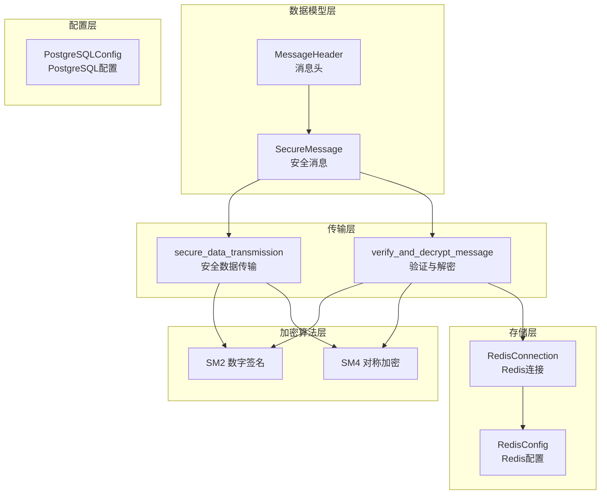
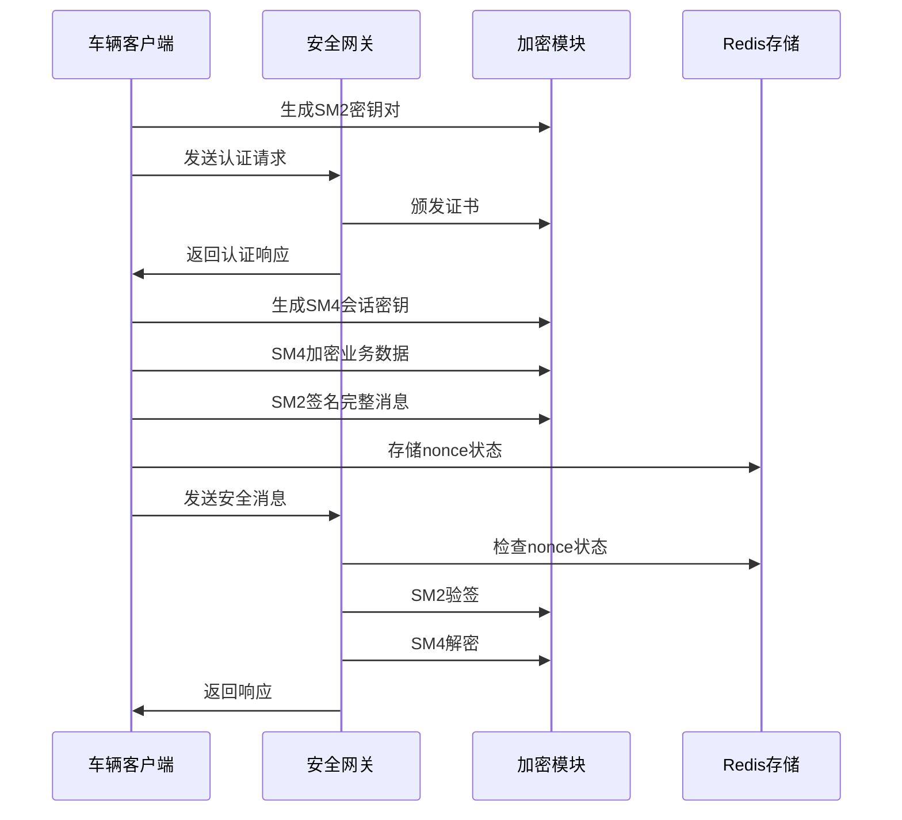
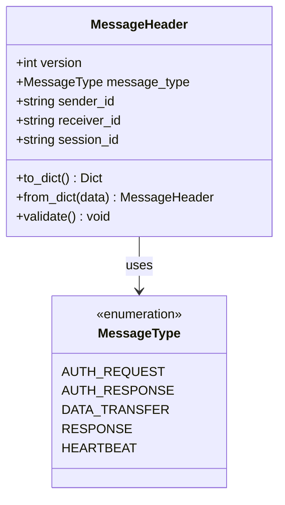
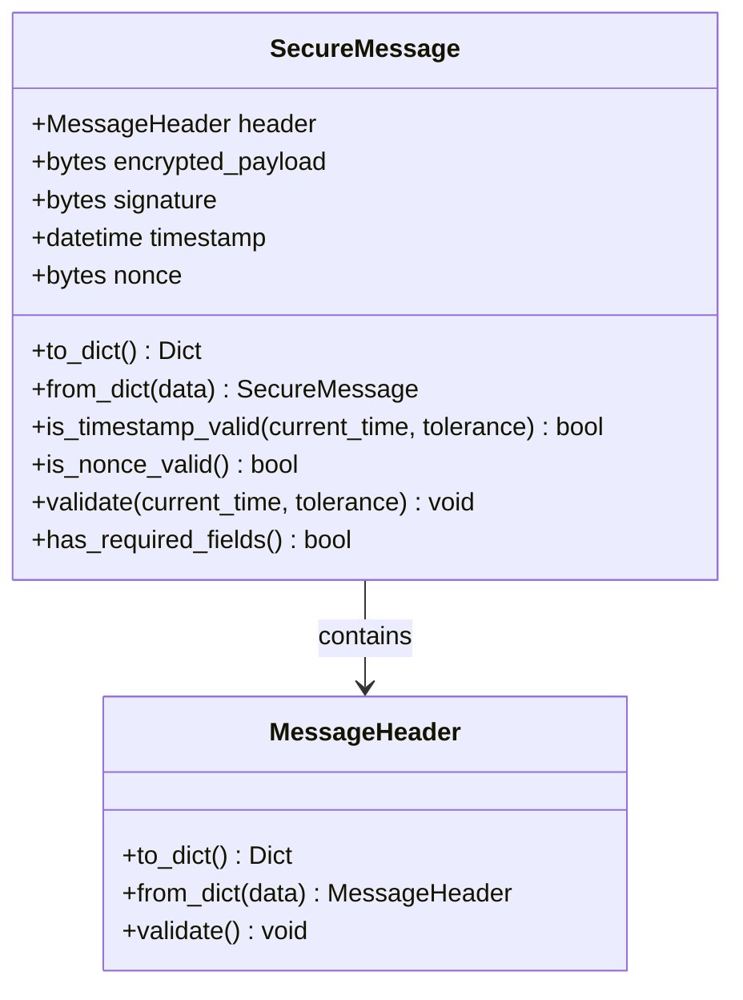
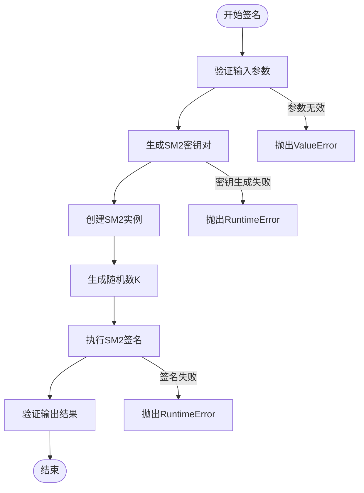
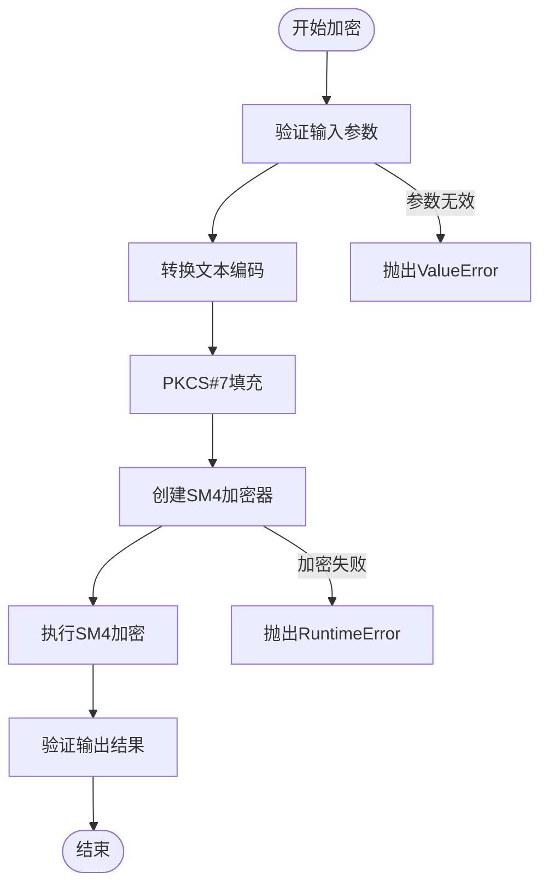
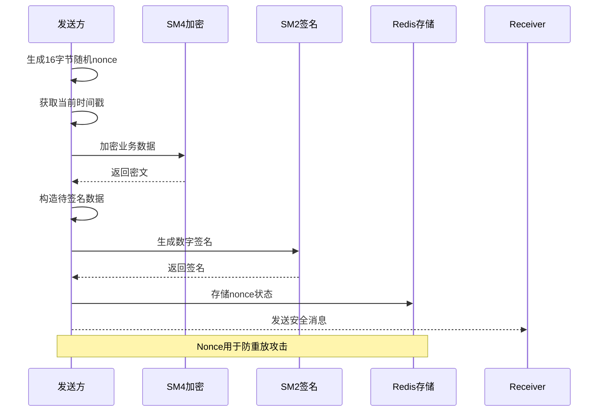
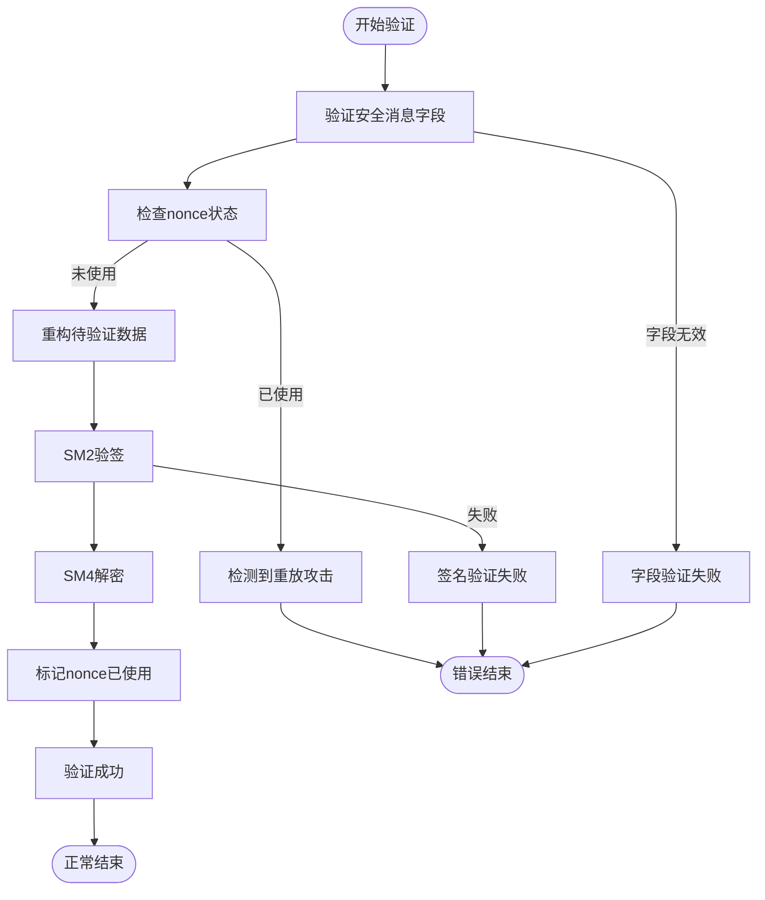
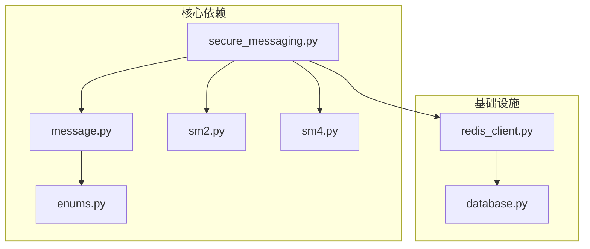

# 安全消息数据模型

<cite>
**本文档引用的文件**
- [message.py](file://src/models/message.py)
- [secure_messaging.py](file://src/secure_messaging.py)
- [sm2.py](file://src/crypto/sm2.py)
- [sm4.py](file://src/crypto/sm4.py)
- [enums.py](file://src/models/enums.py)
- [redis_client.py](file://src/db/redis_client.py)
- [database.py](file://config/database.py)
- [test_message_model.py](file://tests/test_message_model.py)
- [test_secure_messaging.py](file://tests/test_secure_messaging.py)
- [security_gateway_demo.py](file://examples/security_gateway_demo.py)
- [vehicle_client_demo.py](file://examples/vehicle_client_demo.py)
</cite>

## 目录
1. [简介](#简介)
2. [项目结构](#项目结构)
3. [核心组件](#核心组件)
4. [架构概览](#架构概览)
5. [详细组件分析](#详细组件分析)
6. [依赖分析](#依赖分析)
7. [性能考虑](#性能考虑)
8. [故障排除指南](#故障排除指南)
9. [结论](#结论)
10. [附录](#附录)

## 简介
本文档详细阐述了车联网安全消息数据模型的设计与实现，重点围绕SecureMessage类及其相关组件。文档涵盖消息头、消息体、签名和加密参数的设计规范，解释消息格式规范和协议设计，详述加密解密流程和完整性验证机制，说明防重放攻击的实现方式和时间戳管理，描述消息路由和转发的数据结构，提供消息序列化和网络传输格式，并包含消息安全属性和访问控制策略。本文旨在为开发者提供安全消息处理的完整技术参考。

## 项目结构
该项目采用分层架构，核心安全消息处理位于以下模块：
- 数据模型层：消息头和安全消息定义
- 加密算法层：SM2数字签名和SM4对称加密
- 传输层：安全消息的生成、验证和解密流程
- 存储层：Redis用于防重放攻击的nonce存储
- 配置层：数据库和缓存配置

**图表来源**
- [message.py:1-200](file://src/models/message.py#L1-L200)
- [secure_messaging.py:1-249](file://src/secure_messaging.py#L1-L249)
- [sm2.py:1-265](file://src/crypto/sm2.py#L1-L265)
- [sm4.py:1-189](file://src/crypto/sm4.py#L1-L189)
- [redis_client.py:1-79](file://src/db/redis_client.py#L1-L79)
- [database.py:1-50](file://config/database.py#L1-L50)

**章节来源**
- [message.py:1-200](file://src/models/message.py#L1-L200)
- [secure_messaging.py:1-249](file://src/secure_messaging.py#L1-L249)
- [sm2.py:1-265](file://src/crypto/sm2.py#L1-L265)
- [sm4.py:1-189](file://src/crypto/sm4.py#L1-L189)
- [redis_client.py:1-79](file://src/db/redis_client.py#L1-L79)
- [database.py:1-50](file://config/database.py#L1-L50)

## 核心组件
本节深入分析安全消息数据模型的核心组件，包括消息头、安全消息类以及相关的验证和序列化机制。

### 消息头(MessageHeader)
消息头是安全消息的元数据容器，包含以下关键字段：
- 版本号(version)：确保协议兼容性
- 消息类型(message_type)：区分不同类型的业务消息
- 发送方标识(sender_id)：唯一标识消息发送方
- 接收方标识(receiver_id)：唯一标识消息接收方
- 会话标识(session_id)：关联相关联的消息序列

消息头提供完整的序列化和反序列化支持，确保在网络传输中的结构化表示。

### 安全消息(SecureMessage)
安全消息是核心的数据载体，包含：
- header：消息头对象
- encrypted_payload：SM4加密的业务数据
- signature：SM2数字签名
- timestamp：消息生成时间戳
- nonce：16字节随机数，用于防重放攻击

安全消息实现了全面的验证机制，包括字段完整性检查、时间戳有效性验证和nonce长度验证。

**章节来源**
- [message.py:9-200](file://src/models/message.py#L9-L200)

## 架构概览
安全消息处理系统采用模块化设计，各组件职责明确，协作完成端到端的安全通信。

**图表来源**
- [secure_messaging.py:17-249](file://src/secure_messaging.py#L17-L249)
- [sm2.py:135-265](file://src/crypto/sm2.py#L135-L265)
- [sm4.py:49-189](file://src/crypto/sm4.py#L49-L189)
- [redis_client.py:8-79](file://src/db/redis_client.py#L8-L79)

## 详细组件分析

### 消息头类(MessageHeader)分析
MessageHeader类采用Python数据类设计，提供简洁的结构化数据表示。

**图表来源**
- [message.py:10-77](file://src/models/message.py#L10-L77)
- [enums.py:49-56](file://src/models/enums.py#L49-L56)

消息头验证规则：
- 版本号必须为正整数
- 消息类型必须为有效的枚举值
- 发送方和接收方标识必须为非空字符串
- 会话标识必须为非空字符串

**章节来源**
- [message.py:10-77](file://src/models/message.py#L10-L77)
- [enums.py:49-56](file://src/models/enums.py#L49-L56)

### 安全消息类(SecureMessage)分析
SecureMessage类是整个安全通信系统的核心，集成了加密、签名和完整性保护功能。

**图表来源**
- [message.py:80-200](file://src/models/message.py#L80-L200)

安全消息验证流程：
1. 验证消息头完整性
2. 检查nonce长度（必须为16字节）
3. 验证时间戳在有效范围内（默认±5分钟）
4. 确认加密载荷非空
5. 确认签名非空

**章节来源**
- [message.py:80-200](file://src/models/message.py#L80-L200)

### 加密算法模块分析

#### SM2数字签名模块
SM2模块提供国密标准的椭圆曲线数字签名功能：

**图表来源**
- [sm2.py:135-204](file://src/crypto/sm2.py#L135-L204)

SM2签名特性：
- 私钥长度：32字节（256位）
- 公钥长度：64字节（非压缩格式）
- 签名长度：64字节（r和s各32字节）
- 支持随机数k生成，确保每次签名的唯一性

#### SM4对称加密模块
SM4模块实现国密标准的分组密码算法：

**图表来源**
- [sm4.py:49-108](file://src/crypto/sm4.py#L49-L108)

SM4加密特性：
- 支持16字节（128位）和32字节（256位）密钥
- 使用ECB模式（适合小数据块）
- 自动PKCS#7填充
- 密文长度为16字节的倍数

**章节来源**
- [sm2.py:135-265](file://src/crypto/sm2.py#L135-L265)
- [sm4.py:49-189](file://src/crypto/sm4.py#L49-L189)

### 安全消息传输流程
secure_data_transmission函数实现了完整的安全数据传输算法：

**图表来源**
- [secure_messaging.py:17-142](file://src/secure_messaging.py#L17-L142)

传输流程验证需求：
- 验证需求8.1：nonce长度为16字节
- 验证需求8.2：包含时间戳
- 验证需求8.3：创建消息头
- 验证需求8.4：SM4加密载荷
- 验证需求8.5：SM2签名
- 验证需求8.6：返回SecureMessage对象

**章节来源**
- [secure_messaging.py:17-142](file://src/secure_messaging.py#L17-L142)

### 消息验证与解密流程
verify_and_decrypt_message函数实现了完整的验证和解密算法：

**图表来源**
- [secure_messaging.py:144-249](file://src/secure_messaging.py#L144-L249)

验证流程的关键点：
1. 防重放攻击：检查Redis中nonce的存在性
2. 完整性验证：使用SM2公钥验证签名
3. 机密性保护：使用SM4会话密钥解密数据
4. 状态管理：将已使用nonce标记为"used"状态

**章节来源**
- [secure_messaging.py:144-249](file://src/secure_messaging.py#L144-L249)

## 依赖分析
系统采用松耦合设计，各模块间依赖关系清晰：

**图表来源**
- [message.py:1-200](file://src/models/message.py#L1-L200)
- [secure_messaging.py:1-249](file://src/secure_messaging.py#L1-L249)
- [sm2.py:1-265](file://src/crypto/sm2.py#L1-L265)
- [sm4.py:1-189](file://src/crypto/sm4.py#L1-L189)
- [redis_client.py:1-79](file://src/db/redis_client.py#L1-L79)
- [database.py:1-50](file://config/database.py#L1-L50)

主要依赖关系：
- SecureMessage依赖MessageHeader和MessageType枚举
- secure_messaging模块依赖加密算法和Redis存储
- RedisConnection依赖RedisConfig配置
- 所有模块依赖gmssl库进行国密算法实现

**章节来源**
- [message.py:1-200](file://src/models/message.py#L1-L200)
- [secure_messaging.py:1-249](file://src/secure_messaging.py#L1-L249)
- [redis_client.py:1-79](file://src/db/redis_client.py#L1-L79)
- [database.py:1-50](file://config/database.py#L1-L50)

## 性能考虑
安全消息处理系统的性能优化策略：

### 加密算法性能
- SM4加密采用ECB模式，适合小数据块传输，避免CBC模式的初始化向量复杂性
- SM2签名使用随机数k，确保签名唯一性但增加计算开销
- 建议批量处理小数据包以提高吞吐量

### 内存管理
- 使用bytes类型直接处理加密数据，避免不必要的字符串转换
- 及时释放Redis连接，防止连接池耗尽
- 合理设置nonce的TTL（600秒），平衡安全性与内存占用

### 并发处理
- Redis操作使用连接池，支持多线程并发访问
- SM4加密支持并行处理多个独立消息
- 建议使用异步I/O处理高并发场景

## 故障排除指南

### 常见验证错误
1. **时间戳验证失败**：检查系统时钟同步，确认±5分钟容差范围
2. **Nonce长度错误**：确保生成的nonce为16字节
3. **签名验证失败**：检查发送方公钥是否正确，确认消息未被篡改
4. **加密载荷为空**：验证SM4加密过程是否成功

### Redis相关问题
1. **Nonce重复使用**：检查Redis连接配置，确认nonce标记逻辑
2. **连接超时**：调整Redis超时参数，检查网络连通性
3. **内存不足**：监控Redis内存使用，定期清理过期nonce

### 加密算法问题
1. **密钥长度错误**：SM4支持16字节或32字节密钥，SM2私钥必须32字节
2. **填充错误**：检查PKCS#7填充是否正确移除
3. **gmssl库问题**：确认gmssl版本兼容性和安装完整性

**章节来源**
- [test_message_model.py:1-494](file://tests/test_message_model.py#L1-L494)
- [test_secure_messaging.py:1-183](file://tests/test_secure_messaging.py#L1-L183)

## 结论
本安全消息数据模型提供了完整的端到端安全通信解决方案，具备以下特点：

### 设计优势
- **模块化架构**：清晰分离数据模型、加密算法、传输协议和存储层
- **严格验证**：多层次验证机制确保消息完整性、机密性和真实性
- **防重放攻击**：基于nonce和时间戳的双重防护机制
- **标准化实现**：完全遵循国密标准(GM/T系列)，确保合规性

### 技术特色
- **SM2+SM4组合**：数字签名保证真实性，对称加密保证机密性
- **灵活的消息类型**：支持认证、数据传输、心跳等多种消息类型
- **完善的错误处理**：详细的异常信息和错误码定义
- **可扩展性设计**：易于添加新的消息类型和安全策略

### 应用价值
该模型适用于车联网、工业物联网等对安全性要求极高的场景，为构建可信的设备间通信提供了坚实的技术基础。

## 附录

### 消息格式规范
安全消息采用JSON格式进行序列化，包含以下字段：
- header：消息头对象
- encrypted_payload：十六进制编码的密文
- signature：十六进制编码的签名
- timestamp：ISO格式的时间戳
- nonce：十六进制编码的随机数

### 安全属性和访问控制
- **机密性**：SM4加密保护业务数据
- **完整性**：SM2签名验证消息未被篡改
- **真实性**：基于证书的发送方身份验证
- **不可否认性**：数字签名提供法律证据
- **防重放**：nonce和时间戳双重防护

### 开发最佳实践
1. 始终验证消息头和消息体的完整性
2. 使用独立的会话密钥管理机制
3. 定期轮换SM2密钥对
4. 监控Redis存储使用情况
5. 实施适当的日志记录和审计机制