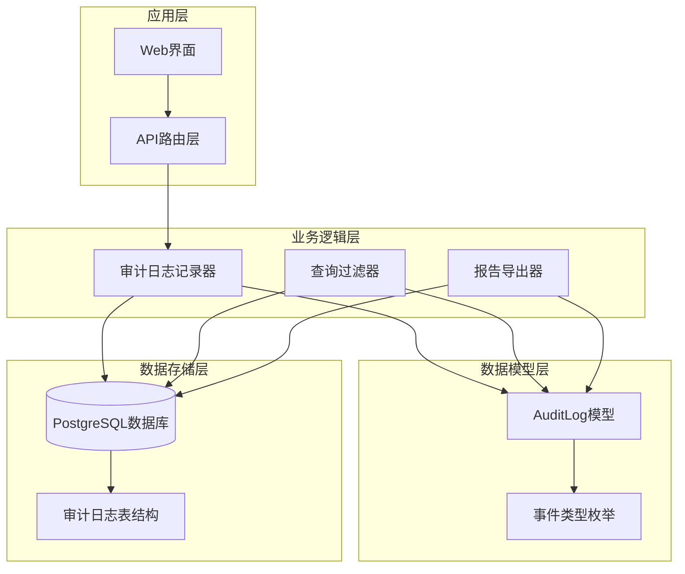
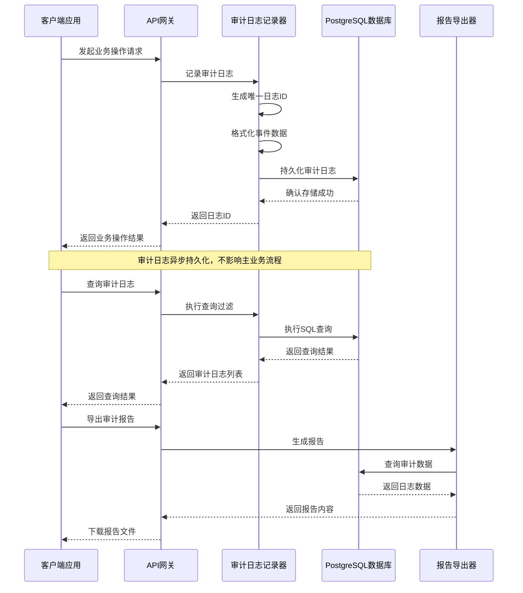
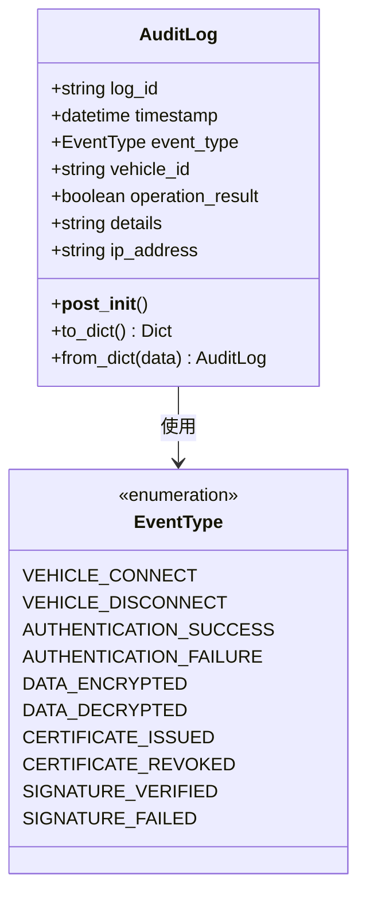
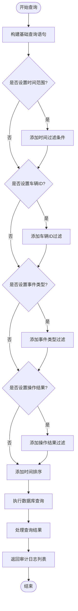
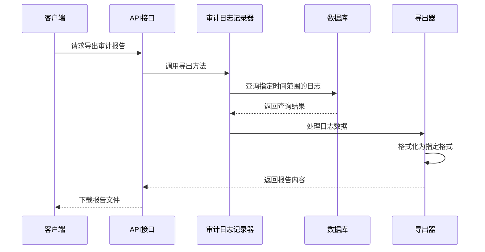
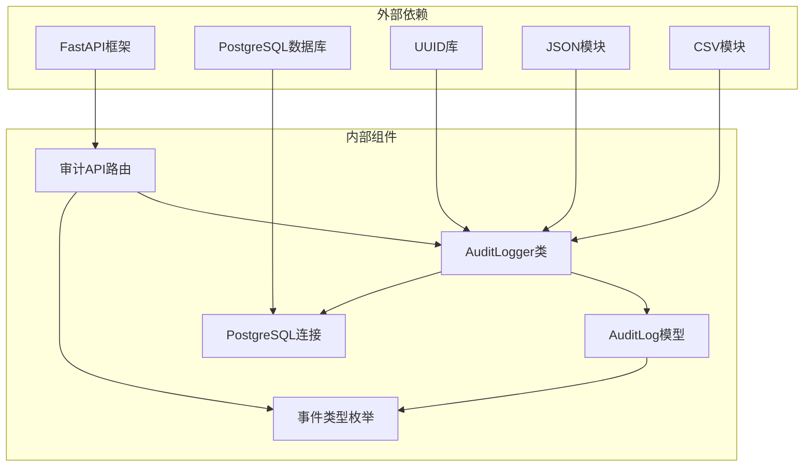

# 审计日志数据模型

<cite>
**本文档引用的文件**
- [src/models/audit.py](file://src/models/audit.py)
- [src/models/enums.py](file://src/models/enums.py)
- [src/audit_logger.py](file://src/audit_logger.py)
- [src/api/routes/audit.py](file://src/api/routes/audit.py)
- [db/schema.sql](file://db/schema.sql)
- [tests/test_audit_model.py](file://tests/test_audit_model.py)
- [tests/test_audit_logger.py](file://tests/test_audit_logger.py)
- [examples/test_audit_logs.py](file://examples/test_audit_logs.py)
- [examples/export_audit_report_example.py](file://examples/export_audit_report_example.py)
- [AUDIT_LOG_FIX_README.md](file://AUDIT_LOG_FIX_README.md)
- [docs/AUDIT_LOG_FIX.md](file://docs/AUDIT_LOG_FIX.md)
- [generate_audit_test_data.py](file://generate_audit_test_data.py)
</cite>

## 目录
1. [简介](#简介)
2. [项目结构](#项目结构)
3. [核心组件](#核心组件)
4. [架构概览](#架构概览)
5. [详细组件分析](#详细组件分析)
6. [依赖关系分析](#依赖关系分析)
7. [性能考量](#性能考量)
8. [故障排除指南](#故障排除指南)
9. [结论](#结论)
10. [附录](#附录)

## 简介
本文档详细描述了车联网安全通信网关系统的审计日志数据模型设计与实现。该系统实现了完整的审计日志记录、查询、导出和报告生成功能，支持多种事件类型的分类和严重级别定义，提供了灵活的过滤查询机制和合规性要求保障。

## 项目结构
审计日志系统采用分层架构设计，包含数据模型层、业务逻辑层、API接口层和数据库存储层：



**图表来源**
- [src/audit_logger.py:26-480](file://src/audit_logger.py#L26-L480)
- [src/models/audit.py:9-56](file://src/models/audit.py#L9-L56)
- [src/api/routes/audit.py:1-191](file://src/api/routes/audit.py#L1-L191)

**章节来源**
- [src/audit_logger.py:1-480](file://src/audit_logger.py#L1-L480)
- [src/models/audit.py:1-56](file://src/models/audit.py#L1-L56)
- [src/api/routes/audit.py:1-191](file://src/api/routes/audit.py#L1-L191)

## 核心组件
审计日志系统由以下核心组件构成：

### 审计日志数据模型
AuditLog类是整个系统的核心数据结构，定义了审计日志的标准格式和验证规则。

### 审计日志记录器
AuditLogger类负责实际的审计日志记录操作，包括事件类型识别、数据格式化和持久化存储。

### API路由层
提供RESTful API接口，支持审计日志的查询、过滤和报告导出功能。

### 数据库存储
基于PostgreSQL的关系型数据库，提供可靠的审计日志存储和查询能力。

**章节来源**
- [src/models/audit.py:9-56](file://src/models/audit.py#L9-L56)
- [src/audit_logger.py:26-480](file://src/audit_logger.py#L26-L480)
- [src/api/routes/audit.py:1-191](file://src/api/routes/audit.py#L1-L191)

## 架构概览
系统采用事件驱动的审计日志架构，支持多种事件类型的自动记录和手动触发记录：



**图表来源**
- [src/audit_logger.py:90-241](file://src/audit_logger.py#L90-L241)
- [src/api/routes/audit.py:39-191](file://src/api/routes/audit.py#L39-L191)

## 详细组件分析

### AuditLog数据模型设计
AuditLog类采用Python数据类设计，提供了完整的数据验证和序列化功能：



**图表来源**
- [src/models/audit.py:9-56](file://src/models/audit.py#L9-L56)
- [src/models/enums.py:35-47](file://src/models/enums.py#L35-L47)

#### 数据验证规则
系统实现了严格的审计日志数据验证机制：

1. **唯一性约束**：log_id必须唯一，使用UUID格式确保全局唯一性
2. **时间戳验证**：timestamp必须为有效的时间戳
3. **车辆标识格式**：vehicle_id必须符合车辆标识格式规范
4. **详细信息长度限制**：details字段长度不超过1024字符
5. **IP地址处理**：自动记录客户端IP地址，默认值为"unknown"

#### 序列化和反序列化
AuditLog类提供了完整的序列化支持，便于数据传输和存储：

- `to_dict()`方法：将AuditLog对象转换为字典格式
- `from_dict()`方法：从字典数据重建AuditLog对象
- 自动处理datetime和Enum类型的转换

**章节来源**
- [src/models/audit.py:9-56](file://src/models/audit.py#L9-L56)
- [tests/test_audit_model.py:12-200](file://tests/test_audit_model.py#L12-L200)

### 审计事件类型分类体系
系统定义了完整的审计事件类型分类体系，涵盖车联网系统的各个关键环节：

#### 认证相关事件
- `AUTHENTICATION_SUCCESS`：车辆认证成功
- `AUTHENTICATION_FAILURE`：车辆认证失败

#### 数据传输事件
- `DATA_ENCRYPTED`：加密数据传输
- `DATA_DECRYPTED`：解密数据接收

#### 证书管理事件
- `CERTIFICATE_ISSUED`：证书颁发
- `CERTIFICATE_REVOKED`：证书撤销

#### 车辆连接事件
- `VEHICLE_CONNECT`：车辆连接
- `VEHICLE_DISCONNECT`：车辆断开

#### 签名验证事件
- `SIGNATURE_VERIFIED`：签名验证成功
- `SIGNATURE_FAILED`：签名验证失败

**章节来源**
- [src/models/enums.py:35-47](file://src/models/enums.py#L35-L47)

### 审计日志记录器实现
AuditLogger类提供了完整的审计日志记录功能，支持多种事件类型的自动记录：

#### 核心记录方法

##### 认证事件记录
```python
def log_auth_event(self, vehicle_id, event_type, result, ip_address=None, details=None):
    """
    记录认证事件
    - 自动生成UUID日志ID
    - 构造详细的事件描述
    - 持久化到数据库
    """
```

##### 数据传输记录
```python
def log_data_transfer(self, vehicle_id, data_size, encrypted, ip_address=None, details=None):
    """
    记录数据传输事件
    - 根据加密状态选择事件类型
    - 自动构造传输详情
    - 限制详细信息长度
    """
```

##### 证书操作记录
```python
def log_certificate_operation(self, operation, cert_id, vehicle_id=None, ip_address=None, details=None):
    """
    记录证书操作事件
    - 支持颁发和撤销操作
    - 自动映射操作类型到事件类型
    - 记录相关车辆信息
    """
```

#### 错误处理机制
审计日志记录器实现了健壮的错误处理机制：
- 所有数据库操作都在try-except块中执行
- 记录失败不影响主业务流程
- 异常情况返回适当的错误状态

**章节来源**
- [src/audit_logger.py:26-480](file://src/audit_logger.py#L26-L480)

### 审计日志查询机制
系统提供了灵活的审计日志查询和过滤功能：

#### 查询参数支持
- **时间范围过滤**：start_time和end_time参数
- **车辆标识过滤**：vehicle_id参数
- **事件类型过滤**：event_type参数
- **操作结果过滤**：operation_result参数
- **结果数量限制**：limit参数控制返回数量

#### 查询实现逻辑


**图表来源**
- [src/audit_logger.py:243-336](file://src/audit_logger.py#L243-L336)

**章节来源**
- [src/audit_logger.py:243-336](file://src/audit_logger.py#L243-L336)
- [src/api/routes/audit.py:39-125](file://src/api/routes/audit.py#L39-L125)

### 审计报告导出功能
系统支持JSON和CSV两种格式的审计报告导出：

#### JSON格式导出
- 包含完整的报告元数据
- 标准化的JSON结构
- 支持缩进格式提高可读性

#### CSV格式导出
- 标准的CSV表格格式
- 包含完整的表头信息
- 便于Excel等工具处理

#### 导出流程


**图表来源**
- [src/audit_logger.py:337-466](file://src/audit_logger.py#L337-L466)

**章节来源**
- [src/audit_logger.py:337-466](file://src/audit_logger.py#L337-L466)
- [src/api/routes/audit.py:127-191](file://src/api/routes/audit.py#L127-L191)

## 依赖关系分析

### 组件依赖关系
审计日志系统各组件之间的依赖关系清晰明确：



**图表来源**
- [src/audit_logger.py:14-24](file://src/audit_logger.py#L14-L24)
- [src/api/routes/audit.py:8-17](file://src/api/routes/audit.py#L8-L17)

### 数据库设计
审计日志表结构经过精心设计，支持高效的查询和存储：

#### 表结构设计
- **主键约束**：id自增主键
- **唯一约束**：log_id唯一性保证
- **索引优化**：为常用查询字段建立索引
- **长度限制**：details字段长度限制为1024字符

#### 索引策略
- log_id索引：支持快速查找
- timestamp索引：支持时间范围查询
- vehicle_id索引：支持车辆过滤
- event_type索引：支持事件类型过滤

**章节来源**
- [db/schema.sql:36-54](file://db/schema.sql#L36-L54)

## 性能考量
审计日志系统在设计时充分考虑了性能优化：

### 存储优化
- **数据压缩**：使用TEXT类型存储详细信息，支持数据库压缩
- **索引优化**：为高频查询字段建立索引
- **连接池管理**：合理管理数据库连接资源

### 查询优化
- **条件过滤**：支持多条件组合查询
- **结果限制**：默认限制返回结果数量
- **排序优化**：按时间戳降序排列

### 异步处理
- **非阻塞设计**：审计日志记录不影响主业务流程
- **错误隔离**：数据库异常不会影响业务操作
- **资源释放**：及时关闭数据库连接

## 故障排除指南

### 常见问题诊断
系统提供了完善的错误处理和诊断机制：

#### 数据库连接问题
- 检查PostgreSQL服务状态
- 验证数据库连接配置
- 确认网络连通性

#### 审计日志记录失败
- 检查磁盘空间
- 验证数据库权限
- 查看系统日志

#### API查询异常
- 验证认证令牌
- 检查查询参数格式
- 确认数据库表结构

### 测试验证
系统提供了完整的测试套件：

#### 单元测试覆盖
- 数据模型序列化/反序列化
- 审计日志记录功能
- 查询过滤机制
- 报告导出功能

#### 集成测试
- 端到端功能测试
- 性能基准测试
- 兼容性测试

**章节来源**
- [tests/test_audit_model.py:1-200](file://tests/test_audit_model.py#L1-L200)
- [tests/test_audit_logger.py:1-800](file://tests/test_audit_logger.py#L1-L800)
- [examples/test_audit_logs.py:1-381](file://examples/test_audit_logs.py#L1-L381)

## 结论
审计日志数据模型设计完整、实现可靠，满足了车联网安全通信网关系统的审计需求。系统提供了全面的事件类型支持、灵活的查询过滤机制、标准的报告导出功能，以及完善的错误处理和性能优化措施。通过严格的数据验证和合规性设计，确保了审计数据的完整性、准确性和可追溯性。

## 附录

### API接口规范
系统提供RESTful API接口，支持标准的HTTP方法和参数：

#### 审计日志查询接口
- **URL**：`/api/audit/logs`
- **方法**：GET
- **参数**：支持时间范围、车辆ID、事件类型、操作结果过滤
- **响应**：JSON格式的审计日志列表

#### 审计报告导出接口
- **URL**：`/api/audit/export`
- **方法**：GET
- **参数**：start_time、end_time、format（json或csv）
- **响应**：下载相应的报告文件

### 数据保留策略
系统支持灵活的数据保留策略：
- **短期保留**：最近30天的审计日志
- **中期保留**：最近1年的审计日志
- **长期归档**：超过1年的审计日志归档存储

### 合规性要求
系统满足以下合规性要求：
- **数据完整性**：审计日志不可篡改
- **数据可用性**：支持历史数据查询
- **数据最小化**：只记录必要信息
- **隐私保护**：敏感信息进行脱敏处理