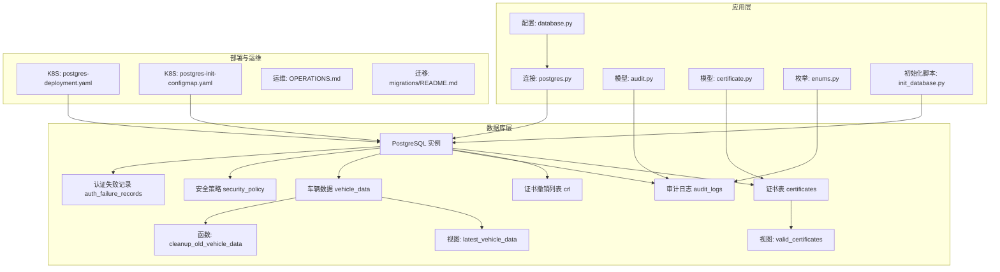
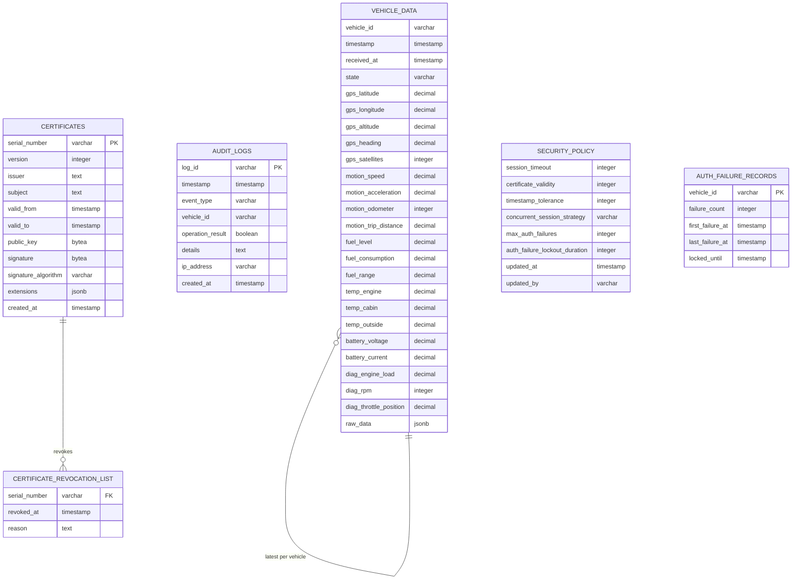
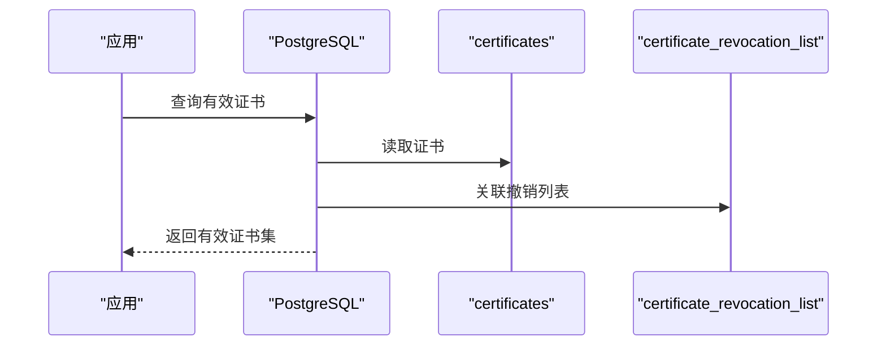
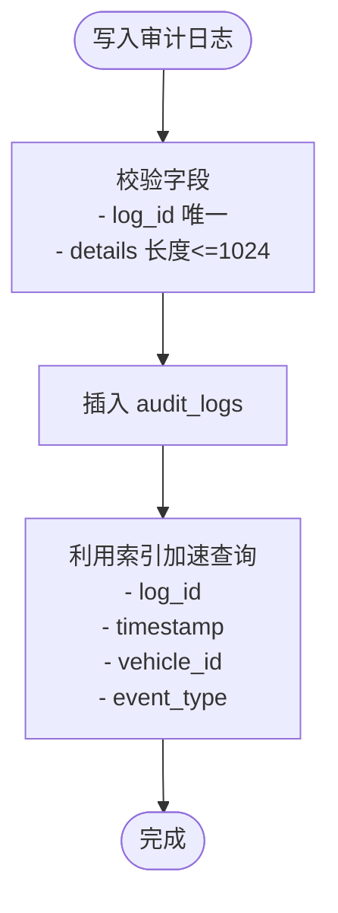
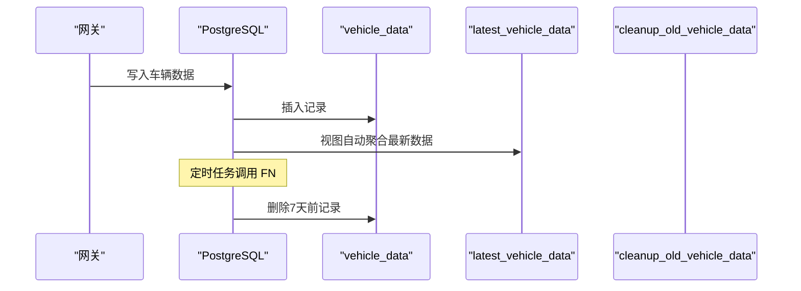
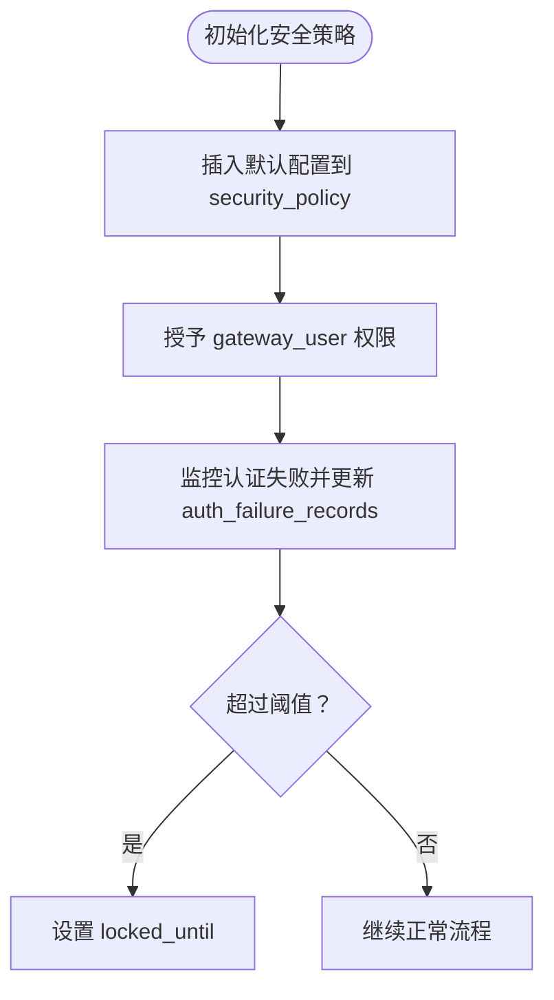
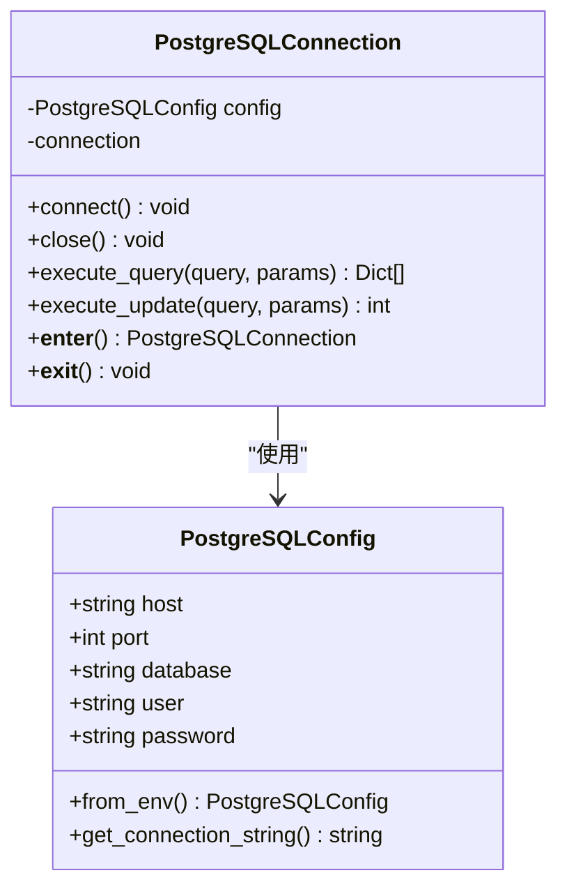
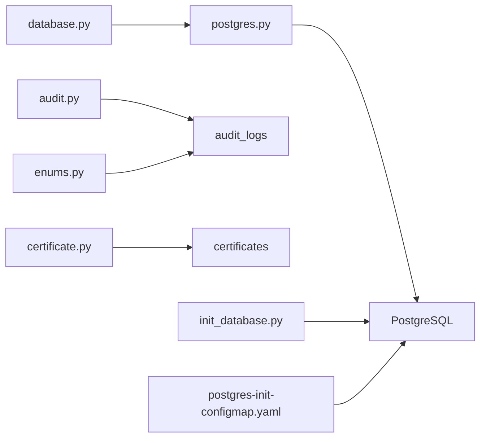

# 数据库架构设计

<cite>
**本文档引用的文件**
- [schema.sql](file://db/schema.sql)
- [init_data.sql](file://db/init_data.sql)
- [database.py](file://config/database.py)
- [postgres.py](file://src/db/postgres.py)
- [audit.py](file://src/models/audit.py)
- [certificate.py](file://src/models/certificate.py)
- [enums.py](file://src/models/enums.py)
- [001_initial_schema.sql](file://db/migrations/001_initial_schema.sql)
- [002_vehicle_data_table.sql](file://db/migrations/002_vehicle_data_table.sql)
- [003_security_policy_table.sql](file://db/migrations/003_security_policy_table.sql)
- [README.md](file://db/migrations/README.md)
- [init_database.py](file://scripts/init_database.py)
- [postgres-deployment.yaml](file://deployment/kubernetes/postgres-deployment.yaml)
- [postgres-init-configmap.yaml](file://deployment/kubernetes/postgres-init-configmap.yaml)
- [OPERATIONS.md](file://docs/OPERATIONS.md)
- [K8S_DATABASE_INIT.md](file://docs/K8S_DATABASE_INIT.md)
- [DEPLOYMENT_WITH_FIXES.md](file://docs/DEPLOYMENT_WITH_FIXES.md)
</cite>

## 目录
1. [简介](#简介)
2. [项目结构](#项目结构)
3. [核心组件](#核心组件)
4. [架构总览](#架构总览)
5. [详细组件分析](#详细组件分析)
6. [依赖关系分析](#依赖关系分析)
7. [性能考虑](#性能考虑)
8. [故障排除指南](#故障排除指南)
9. [结论](#结论)
10. [附录](#附录)

## 简介
本文件面向车联网安全通信网关系统的数据库架构设计，涵盖整体架构、表结构与关系、索引与性能优化、版本管理与迁移策略、初始化脚本与配置、备份与恢复策略，以及面向数据库管理员与后端开发者的完整设计参考。该数据库采用 PostgreSQL 作为主存储，结合 JSONB 支持复杂证书与原始数据存储，并通过视图与函数提升查询与维护效率。

## 项目结构
数据库相关文件主要分布在以下位置：
- 架构定义与迁移：db/schema.sql、db/migrations/*.sql
- 初始化数据：db/init_data.sql
- 运维与部署：deployment/kubernetes/postgres*.yaml、docs/OPERATIONS.md、docs/K8S_DATABASE_INIT.md、docs/DEPLOYMENT_WITH_FIXES.md
- 应用侧配置与连接：config/database.py、src/db/postgres.py
- 数据模型与枚举：src/models/audit.py、src/models/certificate.py、src/models/enums.py
- 初始化脚本：scripts/init_database.py

图表来源
- [postgres-deployment.yaml:1-77](file://deployment/kubernetes/postgres-deployment.yaml#L1-L77)
- [postgres-init-configmap.yaml:1-319](file://deployment/kubernetes/postgres-init-configmap.yaml#L1-L319)
- [database.py:1-50](file://config/database.py#L1-L50)
- [postgres.py:1-53](file://src/db/postgres.py#L1-L53)
- [schema.sql:1-104](file://db/schema.sql#L1-104)
- [001_initial_schema.sql:1-69](file://db/migrations/001_initial_schema.sql#L1-69)
- [002_vehicle_data_table.sql:1-111](file://db/migrations/002_vehicle_data_table.sql#L1-111)
- [003_security_policy_table.sql:1-62](file://db/migrations/003_security_policy_table.sql#L1-62)
- [audit.py:1-56](file://src/models/audit.py#L1-56)
- [certificate.py:1-108](file://src/models/certificate.py#L1-108)
- [enums.py:1-56](file://src/models/enums.py#L1-56)

章节来源
- [schema.sql:1-104](file://db/schema.sql#L1-104)
- [001_initial_schema.sql:1-69](file://db/migrations/001_initial_schema.sql#L1-69)
- [002_vehicle_data_table.sql:1-111](file://db/migrations/002_vehicle_data_table.sql#L1-111)
- [003_security_policy_table.sql:1-62](file://db/migrations/003_security_policy_table.sql#L1-62)

## 核心组件
- 证书与撤销管理：certificates、certificate_revocation_list 及其视图 valid_certificates
- 审计日志：audit_logs 及其索引
- 车辆实时数据：vehicle_data 及其视图 latest_vehicle_data、清理函数 cleanup_old_vehicle_data
- 安全策略与认证控制：security_policy、auth_failure_records 及其索引
- 连接与配置：PostgreSQLConfig、PostgreSQLConnection
- 数据模型与枚举：AuditLog、Certificate、EventType 等

章节来源
- [schema.sql:3-104](file://db/schema.sql#L3-104)
- [002_vehicle_data_table.sql:1-111](file://db/migrations/002_vehicle_data_table.sql#L1-111)
- [003_security_policy_table.sql:1-62](file://db/migrations/003_security_policy_table.sql#L1-62)
- [database.py:1-50](file://config/database.py#L1-L50)
- [postgres.py:1-53](file://src/db/postgres.py#L1-L53)
- [audit.py:1-56](file://src/models/audit.py#L1-56)
- [certificate.py:1-108](file://src/models/certificate.py#L1-108)
- [enums.py:1-56](file://src/models/enums.py#L1-56)

## 架构总览
数据库采用“表+视图+函数”的组合模式：
- 表：承载核心业务数据（证书、审计、车辆数据、安全策略、认证失败记录）
- 视图：提供常用查询视角（有效证书、最新车辆数据）
- 函数：封装数据维护逻辑（清理旧数据）

图表来源
- [schema.sql:3-104](file://db/schema.sql#L3-104)
- [002_vehicle_data_table.sql:1-111](file://db/migrations/002_vehicle_data_table.sql#L1-111)
- [003_security_policy_table.sql:1-62](file://db/migrations/003_security_policy_table.sql#L1-62)

## 详细组件分析

### 证书与撤销管理
- 表：certificates
  - 主键：id；唯一：serial_number
  - 时间范围校验：valid_from < valid_to
  - 索引：serial_number、(valid_from, valid_to)
  - JSONB 扩展字段支持证书扩展信息
- 表：certificate_revocation_list
  - 外键：serial_number 引用 certificates(serial_number)
  - 索引：serial_number
- 视图：valid_certificates
  - 含义：当前未撤销且在有效期内的证书集合

图表来源
- [schema.sql:55-62](file://db/schema.sql#L55-62)
- [001_initial_schema.sql:59-66](file://db/migrations/001_initial_schema.sql#L59-66)

章节来源
- [schema.sql:3-35](file://db/schema.sql#L3-35)
- [001_initial_schema.sql:7-38](file://db/migrations/001_initial_schema.sql#L7-38)

### 审计日志
- 表：audit_logs
  - 主键：id；唯一：log_id
  - 字段：timestamp、event_type、vehicle_id、operation_result、details、ip_address、created_at
  - 约束：details 长度不超过 1024
  - 索引：log_id、timestamp、vehicle_id、event_type
- 数据模型：AuditLog（Python），包含字段与序列化/反序列化逻辑

图表来源
- [schema.sql:36-53](file://db/schema.sql#L36-53)
- [audit.py:10-56](file://src/models/audit.py#L10-56)

章节来源
- [schema.sql:36-53](file://db/schema.sql#L36-53)
- [audit.py:10-56](file://src/models/audit.py#L10-56)

### 车辆实时数据
- 表：vehicle_data
  - 主键：id；唯一约束：(vehicle_id, timestamp)
  - 字段：状态、GPS、运动、燃油、温度、电池、诊断、raw_data(JSONB)
  - 索引：vehicle_id、timestamp DESC、received_at DESC、(vehicle_id, timestamp DESC)
- 视图：latest_vehicle_data
  - 含义：按 vehicle_id 分组的最新记录
- 函数：cleanup_old_vehicle_data
  - 含义：删除 received_at 早于 7 天的数据

图表来源
- [002_vehicle_data_table.sql:4-111](file://db/migrations/002_vehicle_data_table.sql#L4-111)

章节来源
- [002_vehicle_data_table.sql:1-111](file://db/migrations/002_vehicle_data_table.sql#L1-111)

### 安全策略与认证控制
- 表：security_policy
  - 默认值与约束：会话超时、证书有效期、时间戳容差、并发策略、最大认证失败次数、锁定时长
  - 索引：updated_at DESC
- 表：auth_failure_records
  - 唯一：vehicle_id；字段：failure_count、first_failure_at、last_failure_at、locked_until
  - 索引：vehicle_id、locked_until
- 初始化数据：默认安全策略插入

图表来源
- [003_security_policy_table.sql:1-62](file://db/migrations/003_security_policy_table.sql#L1-62)
- [init_data.sql:41-60](file://db/init_data.sql#L41-60)

章节来源
- [003_security_policy_table.sql:1-62](file://db/migrations/003_security_policy_table.sql#L1-62)
- [init_data.sql:41-60](file://db/init_data.sql#L41-60)

### 连接与配置
- PostgreSQLConfig：从环境变量读取连接参数，生成连接字符串
- PostgreSQLConnection：基于 psycopg2 的连接管理器，支持上下文使用

图表来源
- [database.py:8-31](file://config/database.py#L8-31)
- [postgres.py:9-53](file://src/db/postgres.py#L9-53)

章节来源
- [database.py:1-50](file://config/database.py#L1-L50)
- [postgres.py:1-53](file://src/db/postgres.py#L1-L53)

## 依赖关系分析
- 组件耦合
  - 应用层通过 PostgreSQLConnection 访问数据库，依赖 PostgreSQLConfig 提供的连接信息
  - 数据模型（AuditLog、Certificate）与数据库表结构一一对应，确保一致性
  - 视图与函数依赖表结构，迁移脚本保证对象重建与权限授予
- 外部依赖
  - PostgreSQL 15+（JSONB、视图、函数、索引）
  - Kubernetes ConfigMap/Secrets 提供初始化脚本与凭据
- 潜在循环依赖
  - 无直接循环依赖，模块职责清晰（配置、连接、模型、迁移、部署）

图表来源
- [database.py:1-50](file://config/database.py#L1-L50)
- [postgres.py:1-53](file://src/db/postgres.py#L1-L53)
- [audit.py:1-56](file://src/models/audit.py#L1-56)
- [certificate.py:1-108](file://src/models/certificate.py#L1-108)
- [enums.py:1-56](file://src/models/enums.py#L1-56)
- [init_database.py:1-151](file://scripts/init_database.py#L1-L151)
- [postgres-init-configmap.yaml:1-319](file://deployment/kubernetes/postgres-init-configmap.yaml#L1-L319)

章节来源
- [database.py:1-50](file://config/database.py#L1-L50)
- [postgres.py:1-53](file://src/db/postgres.py#L1-L53)
- [audit.py:1-56](file://src/models/audit.py#L1-56)
- [certificate.py:1-108](file://src/models/certificate.py#L1-108)
- [enums.py:1-56](file://src/models/enums.py#L1-56)
- [init_database.py:1-151](file://scripts/init_database.py#L1-L151)
- [postgres-init-configmap.yaml:1-319](file://deployment/kubernetes/postgres-init-configmap.yaml#L1-L319)

## 性能考虑
- 索引策略
  - certificates：serial_number、(valid_from, valid_to)
  - audit_logs：log_id、timestamp、vehicle_id、event_type
  - vehicle_data：vehicle_id、timestamp DESC、received_at DESC、(vehicle_id, timestamp DESC)
  - security_policy：updated_at DESC
  - auth_failure_records：vehicle_id、locked_until
- 查询优化
  - 使用复合索引覆盖高频过滤条件（如 vehicle_id + timestamp）
  - 视图 latest_vehicle_data 基于 DISTINCT ON 优化最新记录查询
- 数据维护
  - cleanup_old_vehicle_data 定期清理历史数据，降低表规模
- 连接与并发
  - 使用连接池与上下文管理减少连接开销
  - 并发策略：reject_new 或 terminate_old 控制会话冲突

[本节为通用性能指导，不直接分析具体文件]

## 故障排除指南
- 迁移执行与回滚
  - 手动执行：psql -U 用户 -d 数据库 -f migrations/001_initial_schema.sql
  - Docker/K8s：容器启动时自动执行；K8s 使用 Job 执行迁移
  - 回滚：删除视图与表（注意级联删除）
- K8s 初始化问题
  - 缺少安全策略：手动插入默认配置
  - 权限不足：授予 gateway_user 对表与序列的权限
- 备份与恢复
  - 备份：pg_dump 全库备份；Redis 使用 SAVE + 复制 RDB 文件
  - 恢复：导入 SQL 或使用 kubectl exec 恢复

章节来源
- [README.md:1-32](file://db/migrations/README.md#L1-32)
- [K8S_DATABASE_INIT.md:233-267](file://docs/K8S_DATABASE_INIT.md#L233-L267)
- [OPERATIONS.md:239-312](file://docs/OPERATIONS.md#L239-L312)
- [DEPLOYMENT_WITH_FIXES.md:340-385](file://docs/DEPLOYMENT_WITH_FIXES.md#L340-L385)

## 结论
该数据库架构围绕证书、审计、车辆数据与安全策略四大主题构建，通过视图与函数提升查询与维护效率，配合完善的索引策略与迁移机制，满足车联网场景下的高可靠性与可运维性需求。部署层面通过 K8s 自动化初始化与权限授予，简化了生产环境的落地成本。

[本节为总结性内容，不直接分析具体文件]

## 附录

### 数据库版本管理与迁移策略
- 迁移脚本清单
  - 001_initial_schema.sql：初始架构（证书、CRL、审计日志）
  - 002_vehicle_data_table.sql：车辆数据表、索引、视图、清理函数
  - 003_security_policy_table.sql：安全策略与认证失败记录
- 执行方式
  - 手动：psql -f
  - Docker：容器启动时自动执行（docker-entrypoint-initdb.d）
  - K8s：通过 ConfigMap 注入初始化脚本，自动授权与视图创建
- 回滚策略
  - 删除视图与表（CASCADE），谨慎执行

章节来源
- [README.md:1-32](file://db/migrations/README.md#L1-32)
- [001_initial_schema.sql:1-69](file://db/migrations/001_initial_schema.sql#L1-69)
- [002_vehicle_data_table.sql:1-111](file://db/migrations/002_vehicle_data_table.sql#L1-111)
- [003_security_policy_table.sql:1-62](file://db/migrations/003_security_policy_table.sql#L1-62)

### 数据库初始化脚本与配置
- Python 初始化脚本
  - 等待 PostgreSQL 就绪、创建数据库、执行迁移、插入初始化数据
- K8s 初始化
  - ConfigMap 包含创建用户、授权、架构初始化、视图与函数、默认数据
  - Deployment 挂载 init-scripts 目录并在首次启动时执行

章节来源
- [init_database.py:1-151](file://scripts/init_database.py#L1-L151)
- [postgres-init-configmap.yaml:1-319](file://deployment/kubernetes/postgres-init-configmap.yaml#L1-L319)

### 数据备份与恢复策略
- 备份
  - PostgreSQL：pg_dump 全库归档
  - Redis：SAVE + 复制 RDB 文件
  - 自动清理：保留30天内备份
- 恢复
  - 导入 SQL 或使用 kubectl exec 恢复
  - 支持仅恢复安全策略等子集

章节来源
- [OPERATIONS.md:239-312](file://docs/OPERATIONS.md#L239-L312)
- [DEPLOYMENT_WITH_FIXES.md:340-385](file://docs/DEPLOYMENT_WITH_FIXES.md#L340-L385)