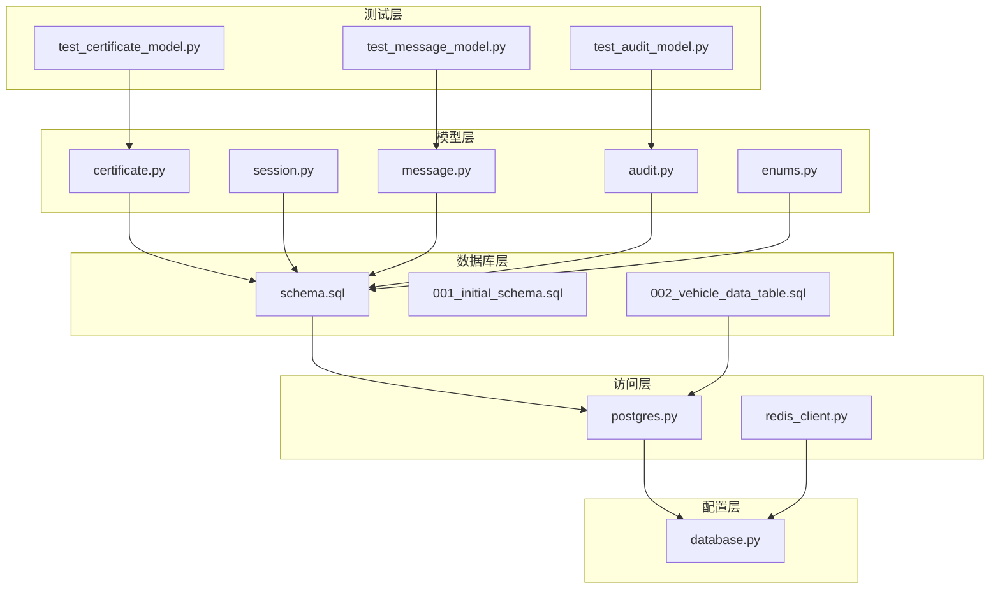
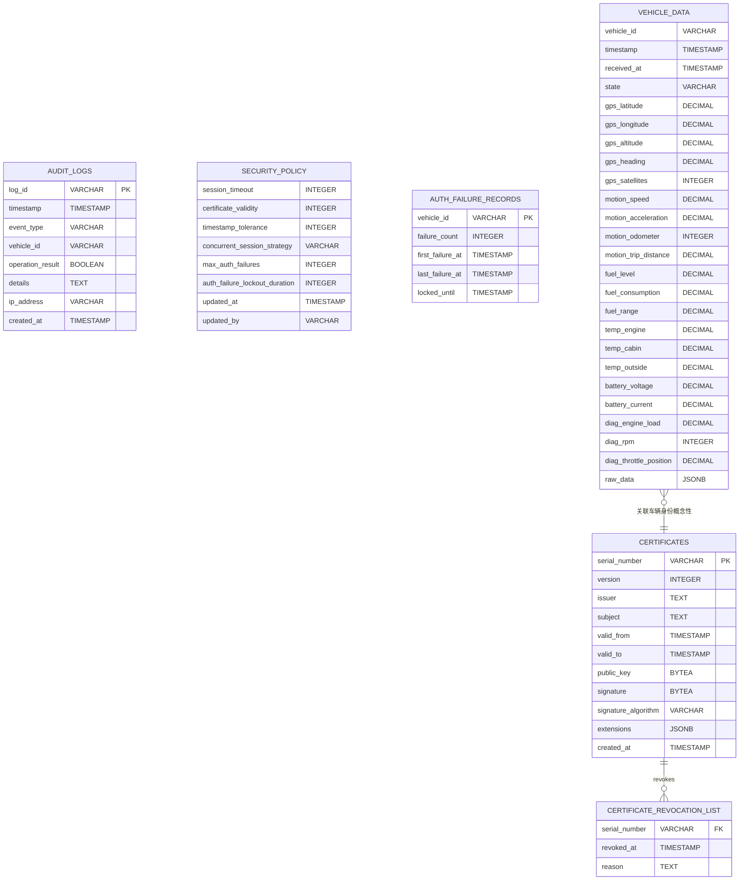
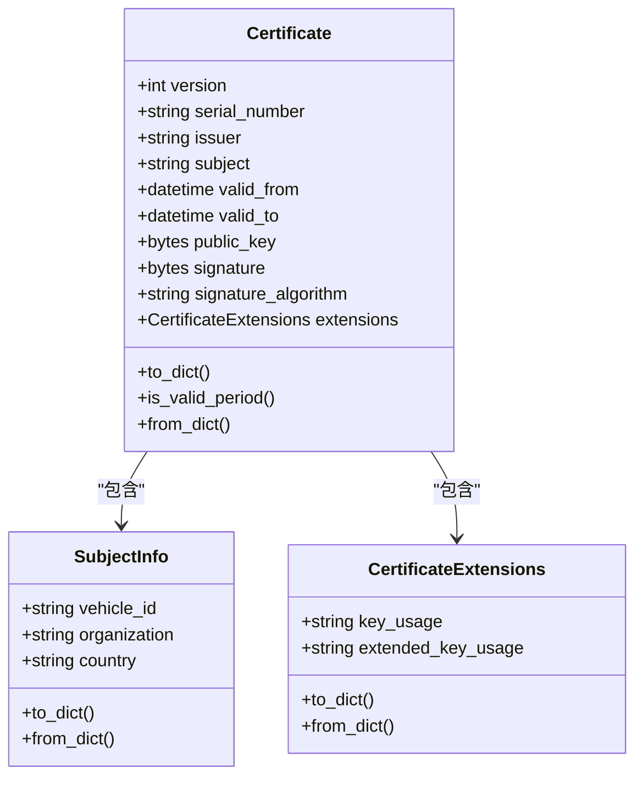
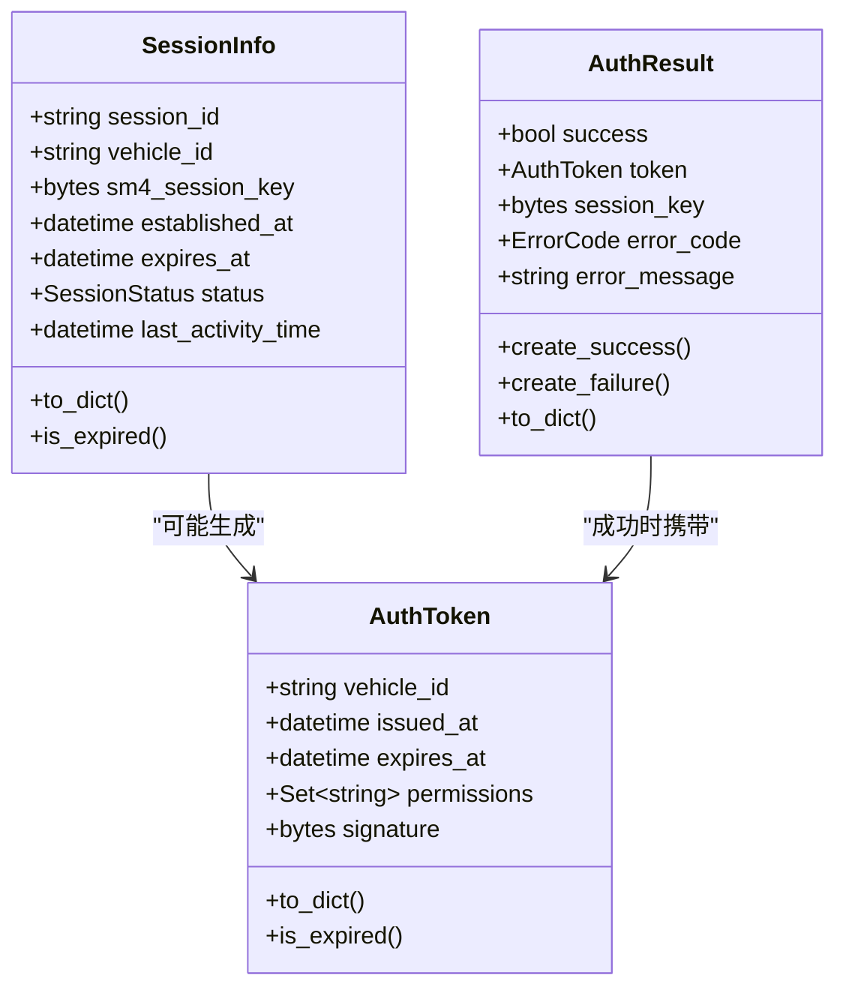
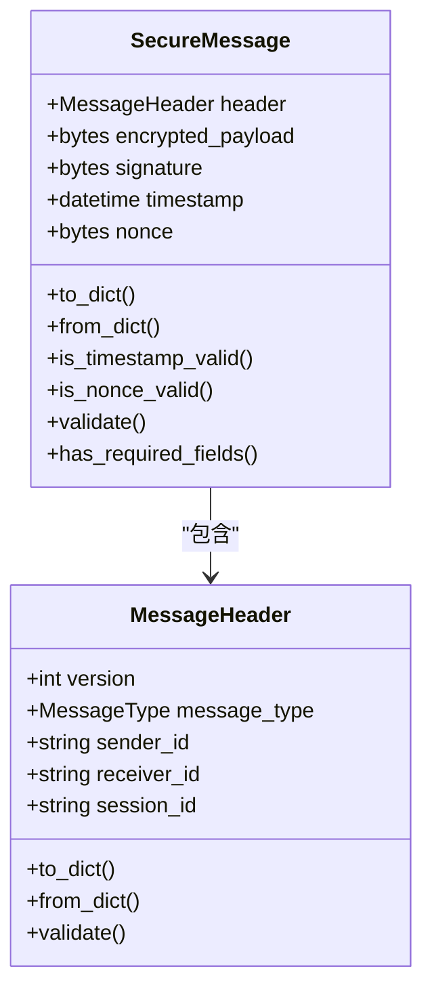
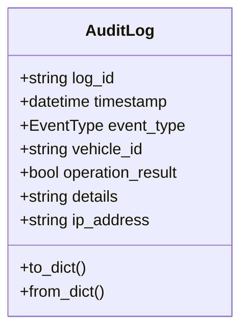
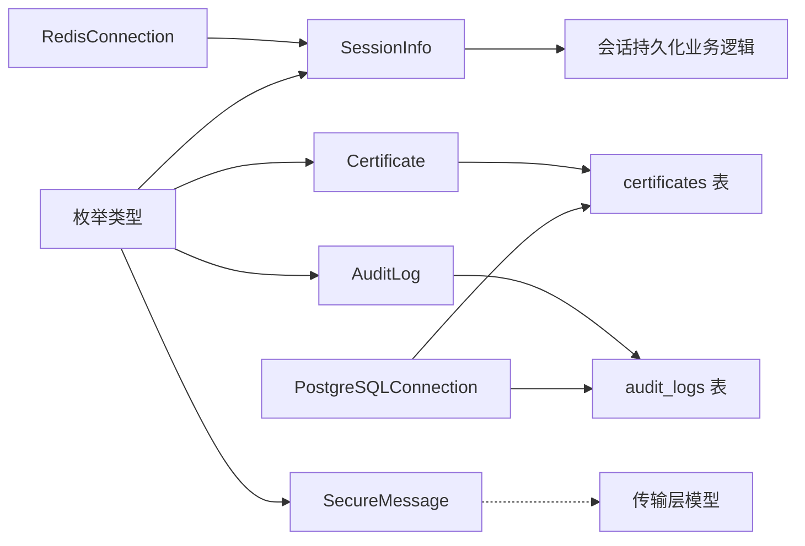

# 数据模型

<cite>
**本文引用的文件**
- [src/models/certificate.py](file://src/models/certificate.py)
- [src/models/session.py](file://src/models/session.py)
- [src/models/message.py](file://src/models/message.py)
- [src/models/audit.py](file://src/models/audit.py)
- [src/models/enums.py](file://src/models/enums.py)
- [db/schema.sql](file://db/schema.sql)
- [db/migrations/001_initial_schema.sql](file://db/migrations/001_initial_schema.sql)
- [db/migrations/002_vehicle_data_table.sql](file://db/migrations/002_vehicle_data_table.sql)
- [src/db/postgres.py](file://src/db/postgres.py)
- [src/db/redis_client.py](file://src/db/redis_client.py)
- [config/database.py](file://config/database.py)
- [tests/test_certificate_model.py](file://tests/test_certificate_model.py)
- [tests/test_message_model.py](file://tests/test_message_model.py)
- [tests/test_audit_model.py](file://tests/test_audit_model.py)
</cite>

## 目录
1. [简介](#简介)
2. [项目结构](#项目结构)
3. [核心组件](#核心组件)
4. [架构总览](#架构总览)
5. [详细组件分析](#详细组件分析)
6. [依赖分析](#依赖分析)
7. [性能考虑](#性能考虑)
8. [故障排查指南](#故障排查指南)
9. [结论](#结论)
10. [附录](#附录)

## 简介
本文件面向数据库设计师与后端开发者，系统性梳理车联网安全通信网关的核心数据模型与数据库架构，覆盖以下实体：
- Certificate（证书）
- SessionInfo（会话）
- SecureMessage（安全报文）
- AuditLog（审计日志）

文档逐项说明各实体字段、数据类型、约束与校验规则，阐述实体间关系与外键约束，给出数据库 ER 图与架构图，并提供数据访问模式、查询优化策略、数据生命周期与归档策略，以及安全与隐私保护建议。

## 项目结构
围绕数据模型与持久化的关键目录与文件如下：
- 模型层：src/models/*.py 定义数据类与枚举
- 数据库层：db/schema.sql 与迁移脚本定义表结构、索引与约束
- 访问层：src/db/postgres.py、src/db/redis_client.py 提供数据库连接与访问封装
- 配置层：config/database.py 提供数据库连接参数
- 测试层：tests/*_model.py 验证模型行为与约束

图表来源
- [db/schema.sql:1-104](file://db/schema.sql#L1-L104)
- [src/models/certificate.py:1-108](file://src/models/certificate.py#L1-L108)
- [src/models/session.py:1-104](file://src/models/session.py#L1-L104)
- [src/models/message.py:1-200](file://src/models/message.py#L1-L200)
- [src/models/audit.py:1-56](file://src/models/audit.py#L1-L56)
- [src/db/postgres.py:1-53](file://src/db/postgres.py#L1-L53)
- [src/db/redis_client.py:1-79](file://src/db/redis_client.py#L1-L79)
- [config/database.py:1-49](file://config/database.py#L1-L49)
- [tests/test_certificate_model.py:1-183](file://tests/test_certificate_model.py#L1-L183)
- [tests/test_message_model.py:1-494](file://tests/test_message_model.py#L1-L494)
- [tests/test_audit_model.py:1-200](file://tests/test_audit_model.py#L1-L200)

章节来源
- [db/schema.sql:1-104](file://db/schema.sql#L1-L104)
- [src/models/__init__.py:1-25](file://src/models/__init__.py#L1-L25)

## 核心组件
本节概述四大核心数据模型及其职责与关键约束。

- Certificate（证书）
  - 职责：承载数字证书元数据、有效期、公钥、签名算法与扩展信息
  - 关键字段与约束：serial_number 唯一；valid_from < valid_to；signature_algorithm 固定为 SM2；public_key/signature 以字节存储
  - 业务规则：当前时间需处于有效期内；支持序列化/反序列化与有效期判断
- SessionInfo（会话）
  - 职责：维护车辆会话状态、会话密钥、建立与到期时间、最后活跃时间
  - 关键字段与约束：session_id 唯一；sm4_session_key 支持 128/256 位；expires_at > established_at；状态 ACTIVE 时需未过期
  - 业务规则：支持过期判断与序列化/反序列化
- SecureMessage（安全报文）
  - 职责：封装消息头、加密载荷、签名、时间戳与随机数
  - 关键字段与约束：nonce 长度固定为 16 字节；timestamp 与当前时间偏差不超过容差（默认 5 分钟）；encrypted_payload 与 signature 非空
  - 业务规则：提供完整性校验、时间戳校验、字段齐全性检查
- AuditLog（审计日志）
  - 职责：记录系统关键事件、操作结果、详情与来源 IP
  - 关键字段与约束：log_id 唯一；details 最大长度 1024 字符；event_type 来源于枚举
  - 业务规则：自动截断超长详情；支持序列化/反序列化

章节来源
- [src/models/certificate.py:54-108](file://src/models/certificate.py#L54-L108)
- [src/models/session.py:38-104](file://src/models/session.py#L38-L104)
- [src/models/message.py:80-200](file://src/models/message.py#L80-L200)
- [src/models/audit.py:10-56](file://src/models/audit.py#L10-L56)
- [src/models/enums.py:6-56](file://src/models/enums.py#L6-L56)

## 架构总览
下图展示数据库层的表结构、索引与约束，以及与模型层的对应关系。

图表来源
- [db/schema.sql:4-104](file://db/schema.sql#L4-L104)
- [db/migrations/001_initial_schema.sql:8-68](file://db/migrations/001_initial_schema.sql#L8-L68)
- [db/migrations/002_vehicle_data_table.sql:5-52](file://db/migrations/002_vehicle_data_table.sql#L5-L52)

## 详细组件分析

### 证书模型（Certificate）
- 字段与类型
  - 版本、序列号、签发者、主题、有效期起止、公钥、签名、签名算法、扩展信息
- 约束与校验
  - 有效期顺序：valid_from < valid_to
  - 签名算法：SM2
  - 序列号唯一
  - 有效期检查：当前时间需在有效期内
- 业务规则
  - 支持序列化为字典（十六进制字符串表示二进制字段）
  - 支持从字典反序列化
- 外部依赖
  - 扩展信息以 JSONB 存储，便于灵活扩展
  - 与撤销列表通过 serial_number 外键关联

图表来源
- [src/models/certificate.py:9-108](file://src/models/certificate.py#L9-L108)

章节来源
- [src/models/certificate.py:54-108](file://src/models/certificate.py#L54-L108)
- [db/schema.sql:4-22](file://db/schema.sql#L4-L22)
- [db/migrations/001_initial_schema.sql:8-26](file://db/migrations/001_initial_schema.sql#L8-L26)

### 会话模型（SessionInfo）
- 字段与类型
  - 会话标识、车辆标识、会话密钥、建立时间、到期时间、状态、最后活跃时间
- 约束与校验
  - 会话密钥长度：128 或 256 位
  - 会话 ID 唯一
  - 到期时间晚于建立时间
  - ACTIVE 状态下未过期
- 业务规则
  - 支持过期判断与序列化/反序列化
  - 认证令牌包含权限集合与签名

图表来源
- [src/models/session.py:10-104](file://src/models/session.py#L10-L104)
- [src/models/enums.py:28-33](file://src/models/enums.py#L28-L33)

章节来源
- [src/models/session.py:38-104](file://src/models/session.py#L38-L104)
- [src/models/enums.py:28-33](file://src/models/enums.py#L28-L33)

### 安全报文模型（SecureMessage）
- 字段与类型
  - 消息头（版本、类型、发送方、接收方、会话 ID）、加密载荷、签名、时间戳、随机数
- 约束与校验
  - nonce 长度为 16 字节
  - 时间戳与当前时间偏差不超过容差（默认 5 分钟）
  - 加密载荷与签名非空
  - 消息头字段有效性校验
- 业务规则
  - 提供时间戳有效性检查、nonce 长度检查、完整性校验与字段齐全性检查

图表来源
- [src/models/message.py:10-200](file://src/models/message.py#L10-L200)
- [src/models/enums.py:49-56](file://src/models/enums.py#L49-L56)

章节来源
- [src/models/message.py:80-200](file://src/models/message.py#L80-L200)
- [src/models/enums.py:49-56](file://src/models/enums.py#L49-L56)

### 审计日志模型（AuditLog）
- 字段与类型
  - 日志 ID、时间戳、事件类型、车辆标识、操作结果、详情、来源 IP
- 约束与校验
  - 日志 ID 唯一
  - 详情最大长度 1024 字符（自动截断）
  - 事件类型来自枚举
- 业务规则
  - 支持序列化/反序列化，兼容字符串与对象两种输入形式

图表来源
- [src/models/audit.py:10-56](file://src/models/audit.py#L10-L56)
- [src/models/enums.py:35-47](file://src/models/enums.py#L35-L47)

章节来源
- [src/models/audit.py:10-56](file://src/models/audit.py#L10-L56)
- [src/models/enums.py:35-47](file://src/models/enums.py#L35-L47)

### 数据访问与查询优化
- 访问模式
  - 使用 PostgreSQLConnection 封装连接、查询与更新操作，统一游标与事务处理
  - 使用 RedisConnection 管理会话与临时数据的缓存读写
- 查询优化建议
  - 证书：按 serial_number 与有效期区间查询，利用索引 idx_certificates_serial_number 与 idx_certificates_valid_period
  - 审计日志：按 log_id、timestamp、vehicle_id、event_type 建立复合索引，支持快速检索与分页
  - 安全策略：按 updated_at 倒序查询最新策略
  - 认证失败记录：按 vehicle_id 与 locked_until 查询锁定状态
- 事务与一致性
  - 写入操作使用显式提交，确保原子性
  - 视图 valid_certificates 统一过滤撤销与过期证书，简化查询

章节来源
- [src/db/postgres.py:9-53](file://src/db/postgres.py#L9-L53)
- [src/db/redis_client.py:8-79](file://src/db/redis_client.py#L8-L79)
- [db/schema.sql:20-99](file://db/schema.sql#L20-L99)
- [db/migrations/001_initial_schema.sql:24-57](file://db/migrations/001_initial_schema.sql#L24-L57)

### 数据生命周期与归档策略
- 证书与撤销列表
  - 证书有效期结束后自动失效；撤销列表通过外键关联证书
  - 建议定期清理过期证书与历史撤销记录，保留最近一年的撤销记录
- 审计日志
  - 按月/季度分区表或归档到冷存储；保留 12-24 个月热数据，其余归档
  - 删除策略基于 log_id 与 timestamp 的组合索引进行高效定位
- 会话与临时数据
  - 会话密钥与令牌在 Redis 中设置 TTL，结合过期清理策略
  - 会话活动时间与过期时间用于回收资源

章节来源
- [db/schema.sql:24-31](file://db/schema.sql#L24-L31)
- [db/schema.sql:55-62](file://db/schema.sql#L55-L62)
- [src/db/redis_client.py:31-50](file://src/db/redis_client.py#L31-L50)

### 数据安全与隐私保护
- 机密性
  - 证书公钥与签名、会话密钥、加密载荷均以二进制存储，避免明文泄露
  - Redis 中保持字节类型，防止中间层误处理
- 完整性
  - 安全报文包含签名与时间戳校验，nonce 防重放
  - 证书与撤销列表通过唯一索引与外键保证一致性
- 可追溯性
  - 审计日志记录关键事件与来源 IP，支持合规审计
- 合规性
  - 采用 SM2/SM4 算法族满足国密要求
  - 严格字段长度与枚举约束，降低数据污染风险

章节来源
- [src/models/message.py:80-186](file://src/models/message.py#L80-L186)
- [src/models/certificate.py:54-108](file://src/models/certificate.py#L54-L108)
- [src/db/redis_client.py:23](file://src/db/redis_client.py#L23)

## 依赖分析
- 模型到数据库映射
  - Certificate 映射至 certificates 表，包含 JSONB 扩展字段
  - SessionInfo 与 AuthToken 在模型中定义，实际持久化策略由业务逻辑决定
  - SecureMessage 为传输层模型，不直接映射到表
  - AuditLog 映射至 audit_logs 表，具备多维索引
- 外部依赖
  - PostgreSQLConnection 依赖配置层 PostgreSQLConfig
  - RedisConnection 依赖配置层 RedisConfig
  - 枚举类型集中定义于 enums.py，被多个模型复用

图表来源
- [src/models/certificate.py:54-108](file://src/models/certificate.py#L54-L108)
- [src/models/audit.py:10-56](file://src/models/audit.py#L10-L56)
- [src/models/message.py:80-200](file://src/models/message.py#L80-L200)
- [src/models/session.py:38-104](file://src/models/session.py#L38-L104)
- [src/db/postgres.py:9-53](file://src/db/postgres.py#L9-L53)
- [src/db/redis_client.py:8-79](file://src/db/redis_client.py#L8-L79)
- [src/models/enums.py:6-56](file://src/models/enums.py#L6-L56)

章节来源
- [src/models/__init__.py:1-25](file://src/models/__init__.py#L1-L25)
- [config/database.py:8-49](file://config/database.py#L8-L49)

## 性能考虑
- 索引策略
  - 证书：serial_number 唯一索引 + 有效期联合索引
  - 审计日志：log_id、timestamp、vehicle_id、event_type 多维索引
  - 安全策略：updated_at 倒序索引
  - 认证失败：vehicle_id 与 locked_until 索引
- 查询模式
  - 高频查询按时间窗口与车辆维度切分，避免全表扫描
  - 使用视图 valid_certificates 统一过滤，减少重复逻辑
- 缓存策略
  - 会话与令牌使用 Redis，设置 TTL 并定期清理
  - 避免在数据库层存储敏感密钥，仅缓存必要元数据

章节来源
- [db/schema.sql:20-99](file://db/schema.sql#L20-L99)
- [db/migrations/001_initial_schema.sql:24-57](file://db/migrations/001_initial_schema.sql#L24-L57)
- [src/db/redis_client.py:51-71](file://src/db/redis_client.py#L51-L71)

## 故障排查指南
- 证书相关
  - 若证书无法验证，检查 valid_from/valid_to 与当前时间关系，确认 serial_number 唯一性
  - 核对签名算法是否为 SM2，扩展字段是否为合法 JSONB
- 会话相关
  - 若会话过期，检查 established_at/expires_at 与状态字段
  - 确认 sm4_session_key 长度为 16 或 32 字节
- 报文相关
  - 若报文校验失败，优先检查 nonce 长度、时间戳容差与签名完整性
  - 确保 encrypted_payload 非空
- 审计日志
  - 若详情丢失，确认 details 是否超过 1024 字符（会被截断）
  - 检查 event_type 是否为允许枚举值

章节来源
- [tests/test_certificate_model.py:97-145](file://tests/test_certificate_model.py#L97-L145)
- [tests/test_message_model.py:251-439](file://tests/test_message_model.py#L251-L439)
- [tests/test_audit_model.py:32-48](file://tests/test_audit_model.py#L32-L48)

## 结论
本文档从模型设计、数据库架构、访问模式、性能优化、生命周期管理与安全隐私六个维度，系统化梳理了车联网安全通信网关的核心数据模型。通过明确字段语义、约束与校验规则，配合索引与缓存策略，可支撑高并发、可审计、可追溯的车载通信场景。

## 附录
- 数据库初始化与迁移
  - 使用初始迁移脚本创建证书、CRL、审计日志与视图
  - 车辆数据表用于扩展场景，具备丰富指标字段与 JSONB 备份
- 配置与连接
  - PostgreSQLConfig/RedisConfig 从环境变量加载参数
  - 通过 PostgreSQLConnection/RedisConnection 统一访问

章节来源
- [db/migrations/001_initial_schema.sql:1-69](file://db/migrations/001_initial_schema.sql#L1-L69)
- [db/migrations/002_vehicle_data_table.sql:1-52](file://db/migrations/002_vehicle_data_table.sql#L1-L52)
- [config/database.py:8-49](file://config/database.py#L8-L49)
- [src/db/postgres.py:9-53](file://src/db/postgres.py#L9-L53)
- [src/db/redis_client.py:8-79](file://src/db/redis_client.py#L8-L79)