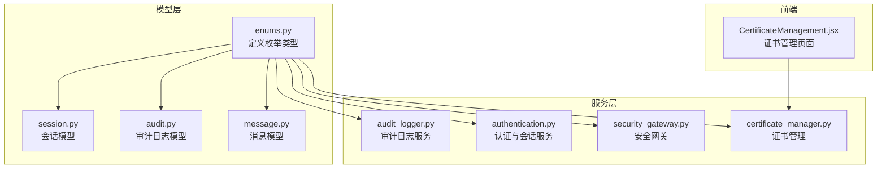
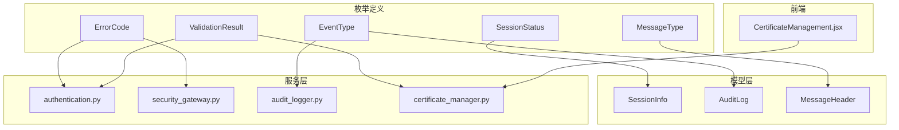
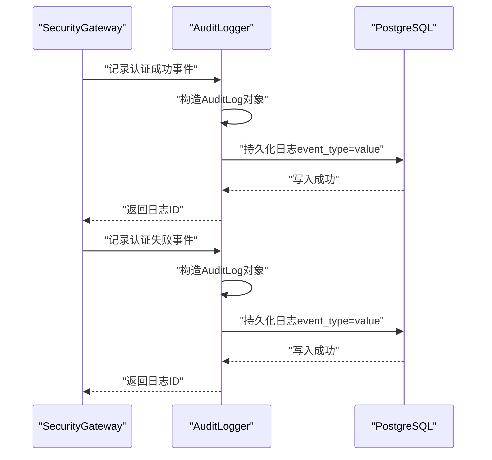
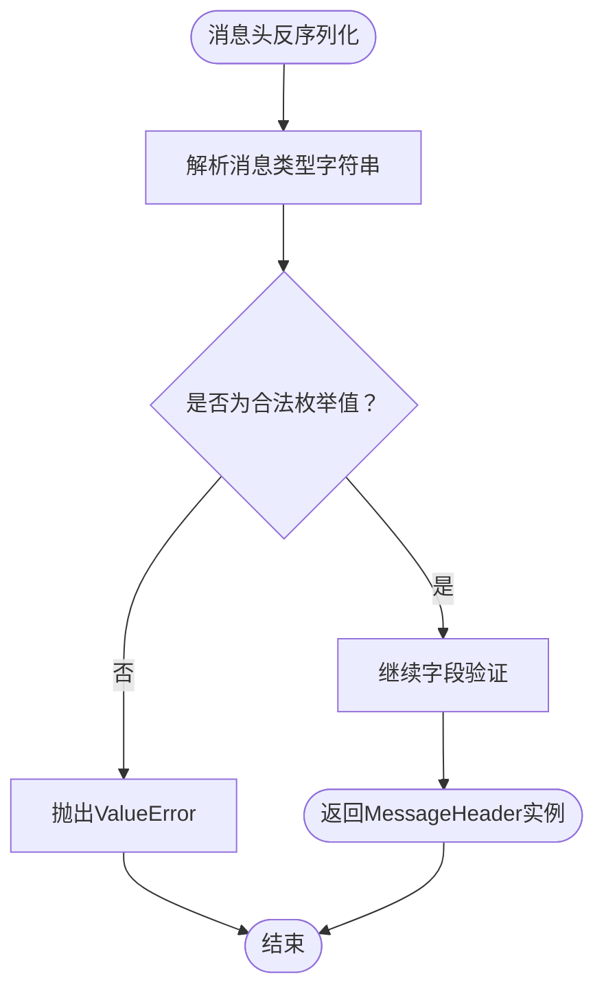
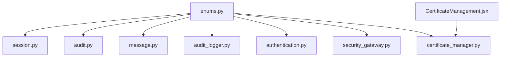

# 枚举类型定义

<cite>
**本文档引用的文件**
- [src/models/enums.py](file://src/models/enums.py)
- [src/models/session.py](file://src/models/session.py)
- [src/models/audit.py](file://src/models/audit.py)
- [src/models/message.py](file://src/models/message.py)
- [src/audit_logger.py](file://src/audit_logger.py)
- [src/authentication.py](file://src/authentication.py)
- [src/security_gateway.py](file://src/security_gateway.py)
- [src/certificate_manager.py](file://src/certificate_manager.py)
- [web/src/pages/CertificateManagement.jsx](file://web/src/pages/CertificateManagement.jsx)
- [tests/test_security_gateway.py](file://tests/test_security_gateway.py)
- [tests/test_message_model.py](file://tests/test_message_model.py)
</cite>

## 目录
1. [简介](#简介)
2. [项目结构](#项目结构)
3. [核心组件](#核心组件)
4. [架构总览](#架构总览)
5. [详细组件分析](#详细组件分析)
6. [依赖分析](#依赖分析)
7. [性能考虑](#性能考虑)
8. [故障排除指南](#故障排除指南)
9. [结论](#结论)
10. [附录](#附录)

## 简介
本文件系统性梳理项目中定义与使用的全部枚举类型，涵盖错误码、证书验证结果、会话状态、审计事件类型、消息类型等。文档详细说明各枚举值的业务含义、使用场景、约束条件与验证机制，并提供跨模块的应用示例、扩展与修改策略以及统一的使用规范与最佳实践。

## 项目结构
枚举类型集中定义于统一的枚举模块中，其他模块通过导入使用，形成高内聚、低耦合的设计。前端页面也基于部分状态枚举进行展示与过滤。

**图表来源**
- [src/models/enums.py:1-56](file://src/models/enums.py#L1-L56)
- [src/models/session.py:1-85](file://src/models/session.py#L1-L85)
- [src/models/audit.py:1-56](file://src/models/audit.py#L1-L56)
- [src/models/message.py:1-200](file://src/models/message.py#L1-L200)
- [src/audit_logger.py:1-480](file://src/audit_logger.py#L1-L480)
- [src/authentication.py:1-662](file://src/authentication.py#L1-L662)
- [src/security_gateway.py:450-527](file://src/security_gateway.py#L450-L527)
- [src/certificate_manager.py:241-578](file://src/certificate_manager.py#L241-L578)
- [web/src/pages/CertificateManagement.jsx:146-235](file://web/src/pages/CertificateManagement.jsx#L146-L235)

**章节来源**
- [src/models/enums.py:1-56](file://src/models/enums.py#L1-L56)

## 核心组件
本项目主要使用以下枚举类型：

- 错误码枚举（ErrorCode）
  - 用途：统一承载系统运行过程中产生的各类错误，便于错误分类与处理。
  - 值：包含证书无效、过期、撤销、签名验证失败、挑战响应无效、解密失败、会话过期、重放攻击检测、CA服务不可用、并发会话冲突、未知错误等。
  - 业务意义：为认证、会话、消息、证书管理等模块提供统一的错误表达与传播机制。
  - 约束条件：错误码应与具体业务流程绑定，错误消息需具备可读性与可诊断性。

- 证书验证结果（ValidationResult）
  - 用途：证书验证流程的输出结果，用于指导后续处理（如是否允许建立会话）。
  - 值：有效、无效、已撤销。
  - 业务意义：作为证书有效性判断的权威依据，贯穿认证与会话建立流程。
  - 约束条件：与证书撤销列表、有效期检查、签名验证等步骤强关联。

- 会话状态（SessionStatus）
  - 用途：描述会话生命周期中的状态，便于会话管理与清理。
  - 值：活跃、过期、已撤销。
  - 业务意义：用于会话查询、过期检测、权限控制与审计追踪。
  - 约束条件：状态变化需遵循严格的前置与后置条件，确保一致性。

- 审计事件类型（EventType）
  - 用途：审计日志的事件分类，支撑安全合规与运营监控。
  - 值：车辆连接、车辆断开、认证成功、认证失败、数据加密、数据解密、证书颁发、证书撤销、签名验证成功、签名验证失败。
  - 业务意义：统一审计口径，便于报表生成与合规审查。
  - 约束条件：数据库中仅允许上述枚举值；查询时需进行有效性校验与容错处理。

- 消息类型（MessageType）
  - 用途：消息头中的消息类别，用于路由与处理分支。
  - 值：认证请求、认证响应、数据传输、响应、心跳。
  - 业务意义：驱动消息处理逻辑，保障通信协议一致性。
  - 约束条件：消息头验证要求消息类型必须为合法枚举值。

**章节来源**
- [src/models/enums.py:6-56](file://src/models/enums.py#L6-L56)
- [src/models/session.py:38-69](file://src/models/session.py#L38-L69)
- [src/models/audit.py:21-24](file://src/models/audit.py#L21-L24)
- [src/models/message.py:18-21](file://src/models/message.py#L18-L21)

## 架构总览
下图展示了枚举类型在系统中的分布与交互关系，强调其在模型、服务与前端之间的桥接作用。

**图表来源**
- [src/models/enums.py:6-56](file://src/models/enums.py#L6-L56)
- [src/models/session.py:38-69](file://src/models/session.py#L38-L69)
- [src/models/audit.py:21-24](file://src/models/audit.py#L21-L24)
- [src/models/message.py:18-21](file://src/models/message.py#L18-L21)
- [src/audit_logger.py:90-135](file://src/audit_logger.py#L90-L135)
- [src/authentication.py:203-359](file://src/authentication.py#L203-L359)
- [src/security_gateway.py:479-495](file://src/security_gateway.py#L479-L495)
- [src/certificate_manager.py:267-310](file://src/certificate_manager.py#L267-L310)
- [web/src/pages/CertificateManagement.jsx:164-174](file://web/src/pages/CertificateManagement.jsx#L164-L174)

## 详细组件分析

### 错误码枚举（ErrorCode）
- 业务意义：统一错误表达，便于错误分类、日志记录与用户提示。
- 使用场景：
  - 认证失败时返回具体错误码（如证书无效、签名验证失败、挑战响应无效）。
  - 会话建立失败时返回相应错误码（如会话过期、并发会话冲突）。
  - 消息处理失败时返回错误码（如解密失败、重放攻击检测）。
- 约束条件：错误码与错误消息需成对出现，错误消息应简洁明确且不含敏感信息。
- 扩展策略：新增错误码需同步更新错误处理逻辑与审计记录，确保向后兼容。

**章节来源**
- [src/models/enums.py:6-18](file://src/models/enums.py#L6-L18)
- [src/authentication.py:265-320](file://src/authentication.py#L265-L320)
- [src/security_gateway.py:489-495](file://src/security_gateway.py#L489-L495)

### 证书验证结果（ValidationResult）
- 业务意义：作为证书验证流程的权威输出，决定是否允许后续操作。
- 使用场景：
  - 认证流程中，若验证结果非“有效”，则立即返回失败。
  - 证书管理中，用于判定证书状态与展示。
- 约束条件：与撤销列表、有效期检查、签名验证步骤强关联，需保证一致性。
- 扩展策略：新增验证阶段时，需评估对现有流程的影响并完善错误码映射。

**章节来源**
- [src/models/enums.py:21-25](file://src/models/enums.py#L21-L25)
- [src/certificate_manager.py:267-310](file://src/certificate_manager.py#L267-L310)
- [src/authentication.py:132-143](file://src/authentication.py#L132-L143)

### 会话状态（SessionStatus）
- 业务意义：描述会话生命周期状态，支撑会话管理与安全控制。
- 使用场景：
  - 会话建立后状态为“活跃”。
  - 会话过期或被撤销时，状态切换为“过期”或“已撤销”。
  - 会话查询与清理时，依据状态进行过滤与处理。
- 约束条件：状态变化需满足前置与后置条件，确保一致性与可追溯性。
- 扩展策略：新增状态需评估对会话管理逻辑的影响，并完善审计与监控。

**章节来源**
- [src/models/enums.py:28-32](file://src/models/enums.py#L28-L32)
- [src/models/session.py:38-69](file://src/models/session.py#L38-L69)
- [src/authentication.py:437-444](file://src/authentication.py#L437-L444)

### 审计事件类型（EventType）
- 业务意义：统一审计口径，支撑合规与运营监控。
- 使用场景：
  - 认证成功/失败事件记录。
  - 数据加/解密事件记录。
  - 证书颁发/撤销事件记录。
  - 审计日志查询与导出。
- 约束条件：数据库中仅允许上述枚举值；查询时需进行有效性校验与容错处理。
- 扩展策略：新增事件类型需同步更新数据库模式与查询逻辑，确保历史数据兼容。

**图表来源**
- [src/security_gateway.py:479-495](file://src/security_gateway.py#L479-L495)
- [src/audit_logger.py:90-135](file://src/audit_logger.py#L90-L135)
- [src/models/audit.py:32-42](file://src/models/audit.py#L32-L42)

**章节来源**
- [src/models/enums.py:35-46](file://src/models/enums.py#L35-L46)
- [src/models/audit.py:21-24](file://src/models/audit.py#L21-L24)
- [src/audit_logger.py:90-135](file://src/audit_logger.py#L90-L135)
- [src/audit_logger.py:243-335](file://src/audit_logger.py#L243-L335)

### 消息类型（MessageType）
- 业务意义：消息头中的消息类别，驱动消息处理逻辑。
- 使用场景：
  - 消息头验证要求消息类型必须为合法枚举值。
  - 消息序列化/反序列化时，消息类型以字符串形式存储。
  - 测试用例验证消息类型与消息头的关系。
- 约束条件：消息头验证严格校验消息类型为枚举值；消息体字段需满足长度与完整性要求。
- 扩展策略：新增消息类型需同步完善消息头验证、序列化逻辑与处理分支。

**图表来源**
- [src/models/message.py:34-55](file://src/models/message.py#L34-L55)

**章节来源**
- [src/models/enums.py:49-55](file://src/models/enums.py#L49-L55)
- [src/models/message.py:18-21](file://src/models/message.py#L18-L21)
- [src/models/message.py:57-76](file://src/models/message.py#L57-L76)
- [tests/test_message_model.py:411-438](file://tests/test_message_model.py#L411-L438)

## 依赖分析
枚举类型在系统中的依赖关系如下：

**图表来源**
- [src/models/enums.py:1-56](file://src/models/enums.py#L1-L56)
- [src/models/session.py:1-85](file://src/models/session.py#L1-L85)
- [src/models/audit.py:1-56](file://src/models/audit.py#L1-L56)
- [src/models/message.py:1-200](file://src/models/message.py#L1-L200)
- [src/audit_logger.py:1-480](file://src/audit_logger.py#L1-L480)
- [src/authentication.py:1-662](file://src/authentication.py#L1-L662)
- [src/security_gateway.py:450-527](file://src/security_gateway.py#L450-L527)
- [src/certificate_manager.py:241-578](file://src/certificate_manager.py#L241-L578)
- [web/src/pages/CertificateManagement.jsx:146-235](file://web/src/pages/CertificateManagement.jsx#L146-L235)

**章节来源**
- [src/models/enums.py:1-56](file://src/models/enums.py#L1-L56)

## 性能考虑
- 枚举比较为常量时间操作，对整体性能影响可忽略。
- 审计日志持久化采用批量写入与异步处理策略，减少对主业务流程的影响。
- 证书验证结果可利用缓存机制降低重复计算成本，提升吞吐量。
- 消息类型验证在序列化/反序列化阶段完成，避免后续处理中的分支判断开销。

## 故障排除指南
- 审计事件类型异常：
  - 现象：查询审计日志时出现无效事件类型警告。
  - 排查：检查数据库中event_type是否包含非枚举值；确认查询接口对无效值的容错处理。
  - 参考：审计日志查询接口对无效枚举值的容错与跳过逻辑。
- 证书状态显示异常：
  - 现象：前端证书状态过滤无法正常工作。
  - 排查：确认后端返回的状态值与前端过滤选项一致；检查撤销列表与有效期计算逻辑。
  - 参考：证书状态计算与前端状态过滤实现。
- 消息类型验证失败：
  - 现象：消息头反序列化抛出ValueError。
  - 排查：确认消息类型字符串与枚举值一致；检查序列化/反序列化逻辑。
  - 参考：消息头验证与测试用例。

**章节来源**
- [src/audit_logger.py:313-318](file://src/audit_logger.py#L313-L318)
- [src/certificate_manager.py:520-578](file://src/certificate_manager.py#L520-L578)
- [web/src/pages/CertificateManagement.jsx:164-174](file://web/src/pages/CertificateManagement.jsx#L164-L174)
- [src/models/message.py:34-55](file://src/models/message.py#L34-L55)
- [tests/test_message_model.py:411-438](file://tests/test_message_model.py#L411-L438)

## 结论
本项目的枚举类型体系清晰、职责明确，覆盖了认证、会话、消息、证书与审计等关键领域。通过统一的枚举定义与严格的验证机制，系统在安全性、可维护性与可观测性方面均得到显著提升。建议在后续演进中持续遵循统一规范，谨慎扩展与变更枚举值，确保系统的稳定性与一致性。

## 附录

### 枚举类型业务意义与约束条件对照表
- 错误码枚举（ErrorCode）
  - 业务意义：统一错误表达与传播。
  - 约束条件：错误码与错误消息成对出现，消息需可读且不含敏感信息。
- 证书验证结果（ValidationResult）
  - 业务意义：证书有效性权威判断。
  - 约束条件：与撤销列表、有效期、签名验证强关联。
- 会话状态（SessionStatus）
  - 业务意义：会话生命周期状态管理。
  - 约束条件：状态变化需满足前置与后置条件。
- 审计事件类型（EventType）
  - 业务意义：审计口径统一。
  - 约束条件：数据库仅允许枚举值；查询需容错处理。
- 消息类型（MessageType）
  - 业务意义：消息头分类与处理分支。
  - 约束条件：消息头验证严格校验枚举值。

**章节来源**
- [src/models/enums.py:6-56](file://src/models/enums.py#L6-L56)
- [src/models/session.py:38-69](file://src/models/session.py#L38-L69)
- [src/models/audit.py:21-24](file://src/models/audit.py#L21-L24)
- [src/models/message.py:18-21](file://src/models/message.py#L18-L21)

### 枚举类型在不同模块中的应用示例
- 审计事件记录
  - 认证成功/失败事件：通过审计日志服务记录，事件类型为认证相关枚举值。
  - 数据加/解密事件：根据加密状态选择事件类型。
  - 证书颁发/撤销事件：根据操作类型选择事件类型。
- 会话管理
  - 会话建立成功后记录认证成功事件；失败时记录认证失败事件。
  - 会话状态在会话信息中体现，支持查询与清理。
- 证书管理
  - 证书状态计算与前端状态过滤联动，支持撤销列表与有效期检查。
- 消息处理
  - 消息头验证确保消息类型为合法枚举值；消息序列化/反序列化时保留枚举值。

**章节来源**
- [src/security_gateway.py:479-495](file://src/security_gateway.py#L479-L495)
- [src/audit_logger.py:90-135](file://src/audit_logger.py#L90-L135)
- [src/audit_logger.py:137-183](file://src/audit_logger.py#L137-L183)
- [src/audit_logger.py:185-241](file://src/audit_logger.py#L185-L241)
- [src/models/session.py:38-69](file://src/models/session.py#L38-L69)
- [src/certificate_manager.py:520-578](file://src/certificate_manager.py#L520-L578)
- [web/src/pages/CertificateManagement.jsx:164-174](file://web/src/pages/CertificateManagement.jsx#L164-L174)
- [src/models/message.py:57-76](file://src/models/message.py#L57-L76)

### 枚举类型的验证与转换机制
- 审计日志序列化/反序列化
  - 序列化：事件类型以字符串值存储。
  - 反序列化：将字符串转换为枚举值，若无效则容错处理。
- 消息头序列化/反序列化
  - 序列化：消息类型以字符串值存储。
  - 反序列化：将字符串转换为枚举值，若无效则抛出异常。
- 证书状态转换
  - 后端计算状态值（字符串），前端根据状态值渲染UI与过滤。

**章节来源**
- [src/models/audit.py:32-55](file://src/models/audit.py#L32-L55)
- [src/models/message.py:24-55](file://src/models/message.py#L24-L55)
- [src/audit_logger.py:313-318](file://src/audit_logger.py#L313-L318)
- [src/certificate_manager.py:520-578](file://src/certificate_manager.py#L520-L578)
- [web/src/pages/CertificateManagement.jsx:208-211](file://web/src/pages/CertificateManagement.jsx#L208-L211)

### 枚举类型的扩展与修改策略
- 新增枚举值
  - 评估对现有业务流程的影响，确保错误码、事件类型、状态等与之匹配。
  - 更新数据库模式与查询逻辑，保证历史数据兼容。
  - 完善测试用例与文档说明。
- 修改枚举值
  - 采用向后兼容策略，避免破坏既有数据与接口。
  - 提供迁移脚本与过渡期的兼容逻辑。
- 删除枚举值
  - 评估对历史数据与查询的影响，必要时保留映射或迁移策略。

**章节来源**
- [src/audit_logger.py:243-335](file://src/audit_logger.py#L243-L335)
- [src/models/audit.py:32-55](file://src/models/audit.py#L32-L55)
- [src/models/message.py:24-55](file://src/models/message.py#L24-L55)

### 统一枚举使用规范与最佳实践
- 统一命名风格：采用全大写与下划线分隔，保持一致性。
- 明确定义业务含义：每个枚举值需有清晰的业务语义与使用场景。
- 严格验证与容错：在序列化/反序列化与查询阶段进行有效性校验与容错处理。
- 与测试结合：为每个枚举值编写单元测试，覆盖正向与异常路径。
- 文档同步：随代码更新补充或修订相关文档，确保知识一致性。

**章节来源**
- [tests/test_security_gateway.py:1140-1150](file://tests/test_security_gateway.py#L1140-L1150)
- [tests/test_message_model.py:411-438](file://tests/test_message_model.py#L411-L438)