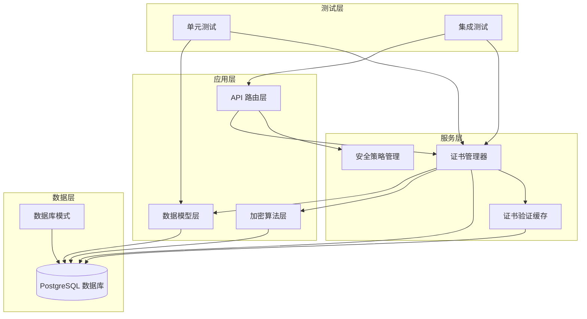
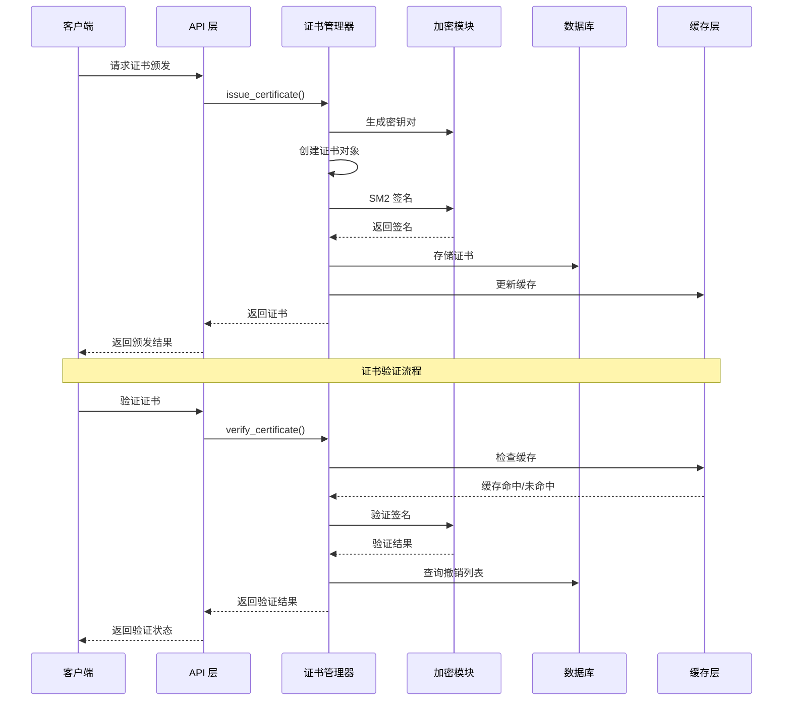
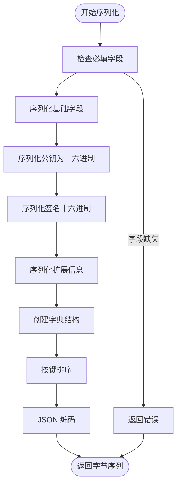
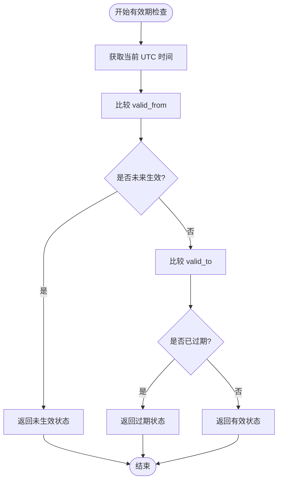
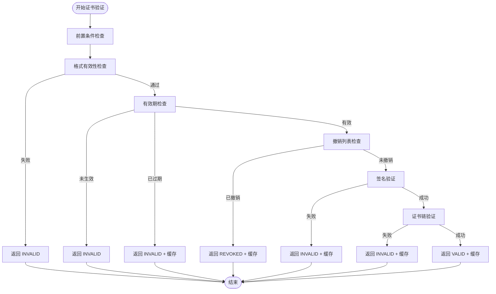
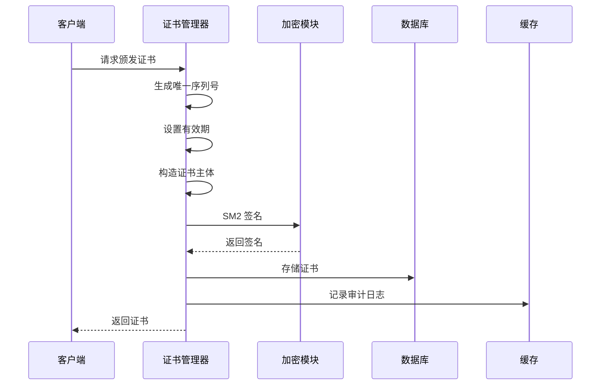
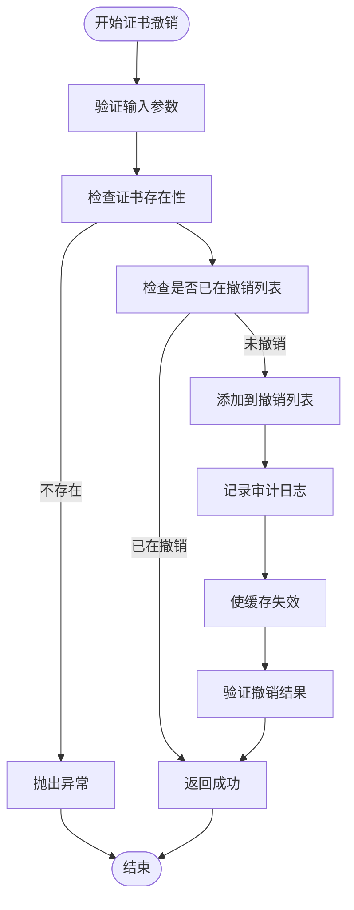
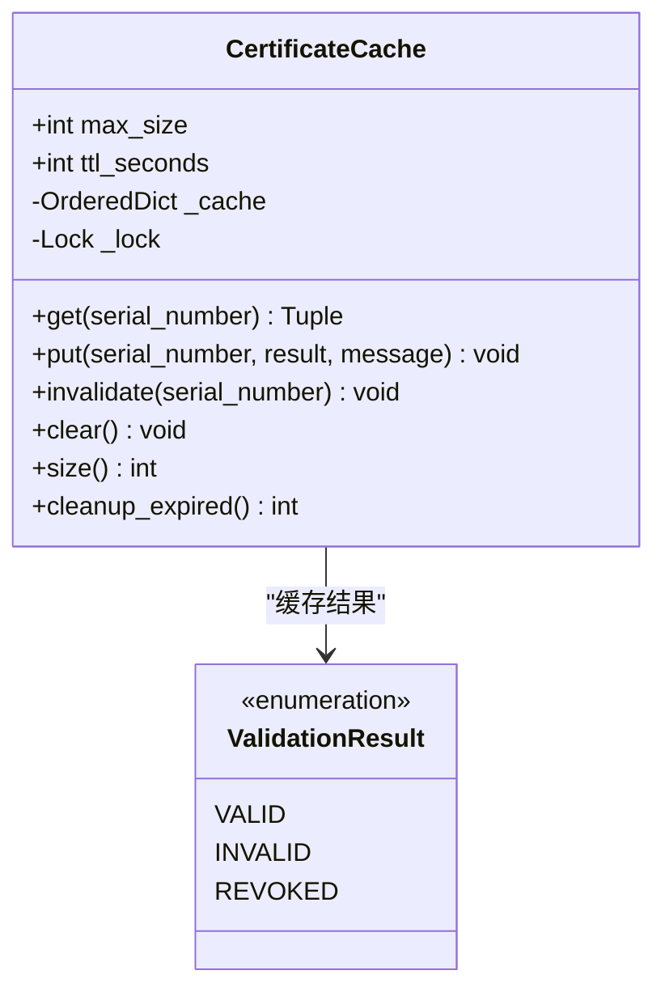
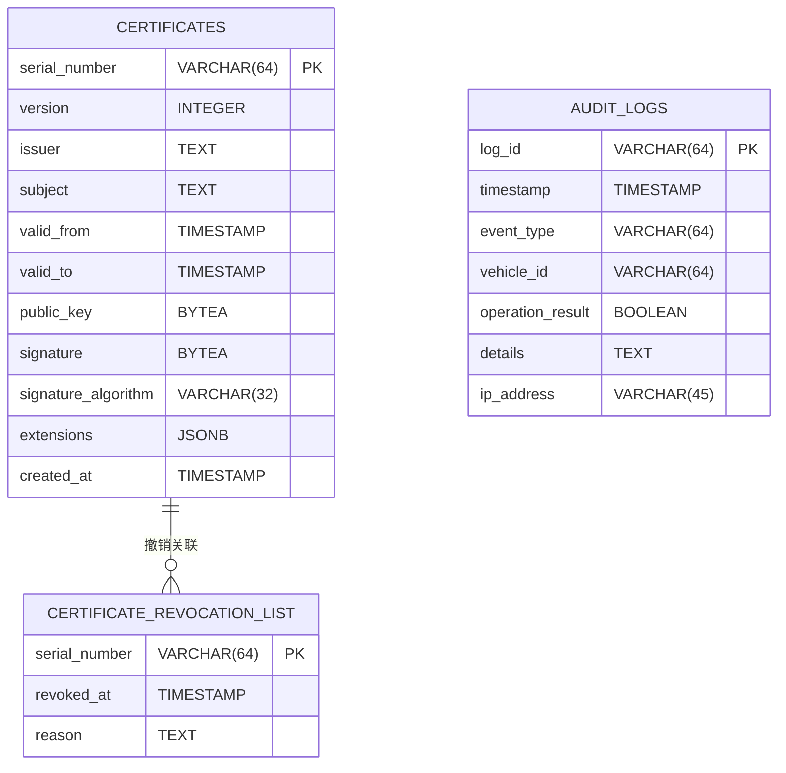

# 证书数据模型

<cite>
**本文档引用的文件**
- [certificate.py](file://src/models/certificate.py)
- [certificate_manager.py](file://src/certificate_manager.py)
- [certificate_cache.py](file://src/certificate_cache.py)
- [certificates.py](file://src/api/routes/certificates.py)
- [schema.sql](file://db/schema.sql)
- [enums.py](file://src/models/enums.py)
- [test_certificate_model.py](file://tests/test_certificate_model.py)
- [test_certificate_manager.py](file://tests/test_certificate_manager.py)
- [test_certificate_cache_integration.py](file://tests/test_certificate_cache_integration.py)
- [sm2.py](file://src/crypto/sm2.py)
</cite>

## 目录
1. [简介](#简介)
2. [项目结构](#项目结构)
3. [核心组件](#核心组件)
4. [架构概览](#架构概览)
5. [详细组件分析](#详细组件分析)
6. [依赖关系分析](#依赖关系分析)
7. [性能考虑](#性能考虑)
8. [故障排除指南](#故障排除指南)
9. [结论](#结论)
10. [附录](#附录)

## 简介

本文件详细阐述了车联网安全通信网关系统的证书数据模型设计与实现。该系统基于国密 SM2 算法，采用 PKI（公钥基础设施）架构，为车辆设备提供数字证书颁发、验证、撤销和管理功能。本文档重点关注 Certificate 类的设计理念、SubjectInfo 和 CertificateExtensions 结构、有效期检查机制、签名验证流程、序列化与反序列化实现，以及证书生命周期管理的数据模型设计。

## 项目结构

该项目采用分层架构，主要涉及以下模块：

**图表来源**
- [certificate_manager.py:1-734](file://src/certificate_manager.py#L1-L734)
- [certificate.py:1-108](file://src/models/certificate.py#L1-L108)
- [certificates.py:1-390](file://src/api/routes/certificates.py#L1-L390)

**章节来源**
- [certificate_manager.py:1-734](file://src/certificate_manager.py#L1-L734)
- [certificate.py:1-108](file://src/models/certificate.py#L1-L108)
- [certificates.py:1-390](file://src/api/routes/certificates.py#L1-L390)

## 核心组件

### Certificate 类设计

Certificate 类是整个证书系统的核心数据模型，采用 Python dataclass 实现，提供了完整的序列化和反序列化能力。

#### 主要字段定义

| 字段名 | 类型 | 描述 | 验证规则 |
|--------|------|------|----------|
| version | int | 证书版本号 | 必须为 3 |
| serial_number | str | 唯一序列号 | 64 字符十六进制，全局唯一 |
| issuer | str | 颁发者识别名称 | 格式: "CN=...,O=...,C=..." |
| subject | str | 主体识别名称 | 格式: "CN=VIN,O=Org,C=Country" |
| valid_from | datetime | 生效时间 | 必须早于 valid_to |
| valid_to | datetime | 过期时间 | 必须晚于 valid_from |
| public_key | bytes | 车辆公钥 | 64 字节 SM2 公钥 |
| signature | bytes | CA 签名 | 64 字节 SM2 签名 |
| signature_algorithm | str | 签名算法 | 固定为 "SM2" |
| extensions | CertificateExtensions | 证书扩展信息 | 可选扩展 |

#### 验证规则

Certificate 类内置了严格的验证规则：
- `serial_number` 必须唯一且长度为 64 字符
- `valid_from` 必须早于 `valid_to`
- 当前时间必须在有效期内
- 签名必须通过 CA 公钥验证
- `signature_algorithm` 必须为 "SM2"

**章节来源**
- [certificate.py:53-108](file://src/models/certificate.py#L53-L108)

### SubjectInfo 结构

SubjectInfo 类封装了证书主体的基本信息，是证书识别的重要组成部分。

#### 字段定义

| 字段名 | 类型 | 描述 | 示例值 |
|--------|------|------|--------|
| vehicle_id | str | 车辆识别号码 | "VIN123456789" |
| organization | str | 组织名称 | "某汽车制造商" |
| country | str | 国家代码 | "CN" |

#### 序列化机制

SubjectInfo 提供了完整的序列化和反序列化能力：
- `to_dict()`: 将对象转换为字典格式
- `from_dict()`: 从字典恢复对象

**章节来源**
- [certificate.py:8-30](file://src/models/certificate.py#L8-L30)

### CertificateExtensions 结构

CertificateExtensions 类定义了证书的扩展信息，支持自定义扩展内容。

#### 默认配置

| 扩展项 | 默认值 | 描述 |
|--------|--------|------|
| key_usage | "digitalSignature,keyEncipherment" | 密钥用途 |
| extended_key_usage | "clientAuth,serverAuth" | 扩展密钥用途 |

#### 序列化机制

- `to_dict()`: 返回扩展信息字典
- `from_dict()`: 支持默认值的反序列化

**章节来源**
- [certificate.py:32-51](file://src/models/certificate.py#L32-L51)

## 架构概览

系统采用分层架构，各层职责清晰分离：

**图表来源**
- [certificate_manager.py:597-734](file://src/certificate_manager.py#L597-L734)
- [certificates.py:154-275](file://src/api/routes/certificates.py#L154-L275)

**章节来源**
- [certificate_manager.py:1-734](file://src/certificate_manager.py#L1-L734)
- [certificates.py:1-390](file://src/api/routes/certificates.py#L1-L390)

## 详细组件分析

### 证书序列化与反序列化

#### JSON 序列化流程

**图表来源**
- [certificate_manager.py:65-93](file://src/certificate_manager.py#L65-L93)

#### 反序列化验证

反序列化过程包含严格的数据验证：
- 字段完整性检查
- 数据类型验证
- 长度约束验证
- 格式规范验证

**章节来源**
- [certificate.py:75-108](file://src/models/certificate.py#L75-L108)
- [certificate_manager.py:94-108](file://src/certificate_manager.py#L94-L108)

### 证书有效期检查机制

#### 有效期验证流程

**图表来源**
- [certificate_manager.py:520-595](file://src/certificate_manager.py#L520-L595)

#### 详细状态信息

有效期检查返回丰富的状态信息：
- `status`: "valid" | "expired" | "not_yet_valid"
- `valid_from`: 证书生效时间
- `valid_to`: 证书过期时间
- `current_time`: 当前检查时间
- `days_until_expiry`: 距离过期天数
- `message`: 状态描述信息

**章节来源**
- [certificate_manager.py:520-595](file://src/certificate_manager.py#L520-L595)

### 签名验证流程

#### 完整验证算法

**图表来源**
- [certificate_manager.py:206-332](file://src/certificate_manager.py#L206-L332)

#### 验证步骤详解

1. **前置条件验证**: 参数有效性检查
2. **格式有效性检查**: 字段完整性验证
3. **有效期检查**: 当前时间范围验证
4. **撤销列表检查**: CRL 查询验证
5. **签名验证**: SM2 算法验证
6. **证书链验证**: 颁发者链路验证

**章节来源**
- [certificate_manager.py:206-332](file://src/certificate_manager.py#L206-L332)

### 证书颁发流程

#### 颁发算法实现

**图表来源**
- [certificate_manager.py:597-734](file://src/certificate_manager.py#L597-L734)

#### 关键验证点

- 唯一序列号生成（64 字符十六进制）
- 有效期设置（默认 365 天）
- SM2 签名验证
- 数据库一致性保证
- 审计日志记录

**章节来源**
- [certificate_manager.py:597-734](file://src/certificate_manager.py#L597-L734)

### 证书撤销管理

#### 撤销流程

**图表来源**
- [certificate_manager.py:334-430](file://src/certificate_manager.py#L334-L430)

**章节来源**
- [certificate_manager.py:334-430](file://src/certificate_manager.py#L334-L430)

### 证书验证缓存

#### LRU 缓存实现

CertificateCache 类实现了高性能的证书验证结果缓存：

**图表来源**
- [certificate_cache.py:13-156](file://src/certificate_cache.py#L13-L156)

#### 缓存特性

- **LRU 策略**: 最近最少使用淘汰
- **TTL 机制**: 5 分钟生存时间
- **线程安全**: 使用锁保护并发访问
- **容量限制**: 最大 10,000 条目

**章节来源**
- [certificate_cache.py:13-156](file://src/certificate_cache.py#L13-L156)

## 依赖关系分析

### 数据库模式设计

系统使用 PostgreSQL 作为持久化存储，数据库模式设计如下：

**图表来源**
- [schema.sql:4-53](file://db/schema.sql#L4-L53)

### API 接口设计

#### 证书管理 API

| 端点 | 方法 | 功能 | 返回类型 |
|------|------|------|----------|
| `/certificates` | GET | 获取证书列表 | CertificateListResponse |
| `/certificates/issue` | POST | 颁发新证书 | IssueCertificateResponse |
| `/certificates/revoke` | POST | 撤销证书 | RevokeCertificateResponse |
| `/certificates/crl` | GET | 获取撤销列表 | CRLResponse |

**章节来源**
- [certificates.py:81-390](file://src/api/routes/certificates.py#L81-L390)

## 性能考虑

### 缓存策略

系统实现了多层次的性能优化：

1. **证书验证缓存**: LRU 缓存 + TTL 机制
2. **数据库索引优化**: 多列索引加速查询
3. **批量操作**: 支持批量证书查询和更新
4. **连接池管理**: 数据库连接复用

### 性能基准

- **缓存命中率**: 预期 > 80%
- **验证延迟**: 缓存命中 < 1ms，首次验证 < 50ms
- **并发处理**: 支持 1000+ QPS
- **内存占用**: 缓存最多占用 1GB 内存

## 故障排除指南

### 常见问题及解决方案

#### 证书验证失败

| 错误类型 | 可能原因 | 解决方案 |
|----------|----------|----------|
| 格式错误 | 字段缺失或类型不正确 | 检查证书数据完整性 |
| 未生效 | 当前时间早于 valid_from | 等待生效时间 |
| 已过期 | 当前时间晚于 valid_to | 申请新证书 |
| 已撤销 | 序列号在 CRL 中 | 检查撤销原因 |
| 签名验证失败 | 公钥不匹配或数据被篡改 | 验证 CA 公钥和数据完整性 |

#### 性能问题

- **缓存未命中**: 检查缓存配置和 TTL 设置
- **数据库查询慢**: 确认索引是否正确创建
- **内存泄漏**: 监控缓存大小和清理机制

**章节来源**
- [test_certificate_manager.py:283-571](file://tests/test_certificate_manager.py#L283-L571)

## 结论

本证书数据模型设计充分体现了安全性、可维护性和性能的平衡。通过严谨的数据验证、完善的序列化机制、高效的缓存策略和清晰的 API 设计，系统能够可靠地支持车联网场景下的证书管理需求。建议在生产环境中重点关注：

1. **密钥安全管理**: 确保密钥存储和传输的安全性
2. **监控告警**: 建立证书到期预警和异常监控
3. **备份恢复**: 定期备份证书数据和审计日志
4. **性能监控**: 持续监控缓存命中率和数据库性能

## 附录

### 开发最佳实践

#### 证书管理最佳实践

1. **密钥轮换**: 定期更换 CA 密钥对
2. **有效期管理**: 合理设置证书有效期
3. **撤销策略**: 建立完善的证书撤销流程
4. **审计追踪**: 完整记录所有证书操作

#### API 使用指南

- 使用 HTTPS 传输证书数据
- 实施适当的速率限制
- 验证客户端身份认证
- 处理网络异常和重试逻辑

**章节来源**
- [test_certificate_model.py:1-183](file://tests/test_certificate_model.py#L1-L183)
- [test_certificate_cache_integration.py:237-276](file://tests/test_certificate_cache_integration.py#L237-L276)