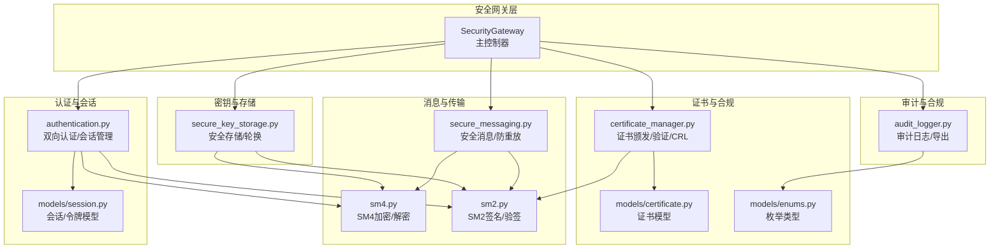
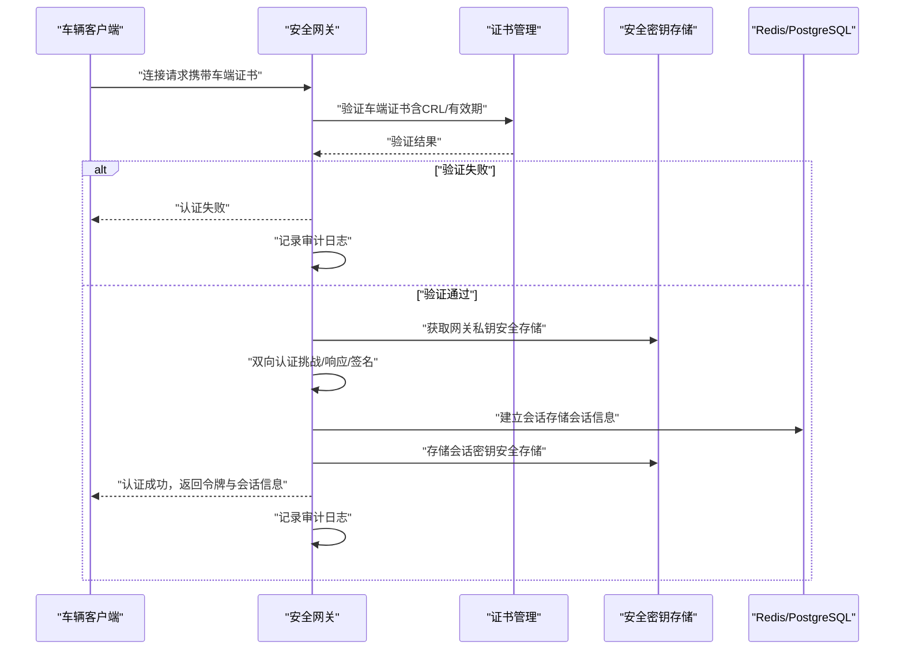
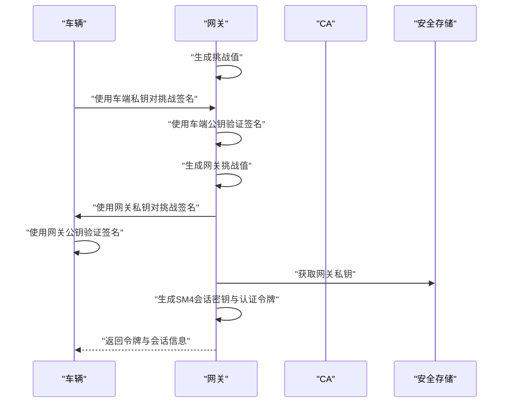
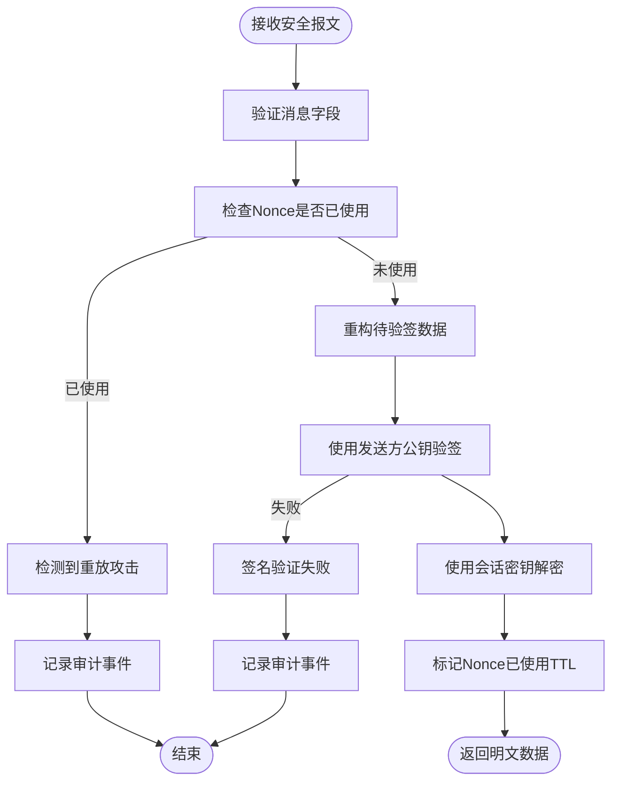
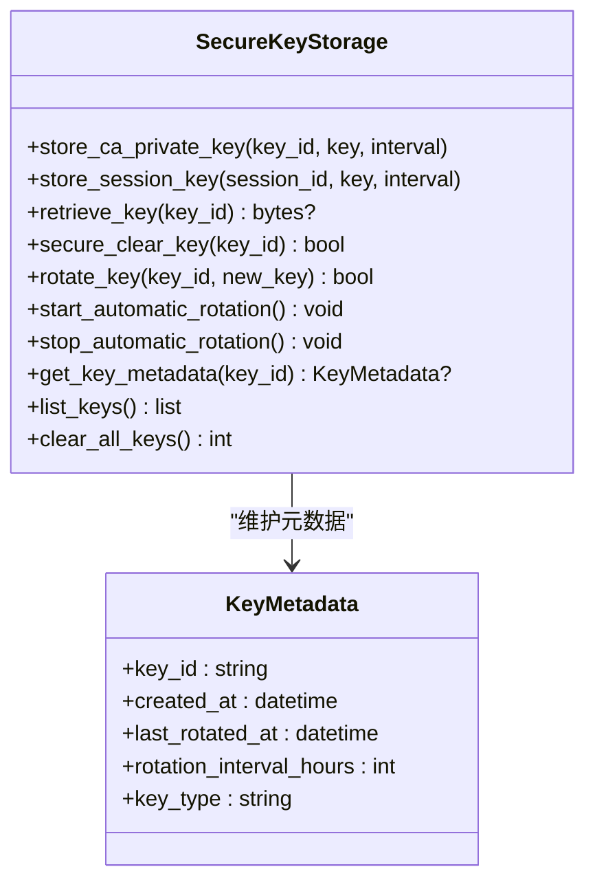
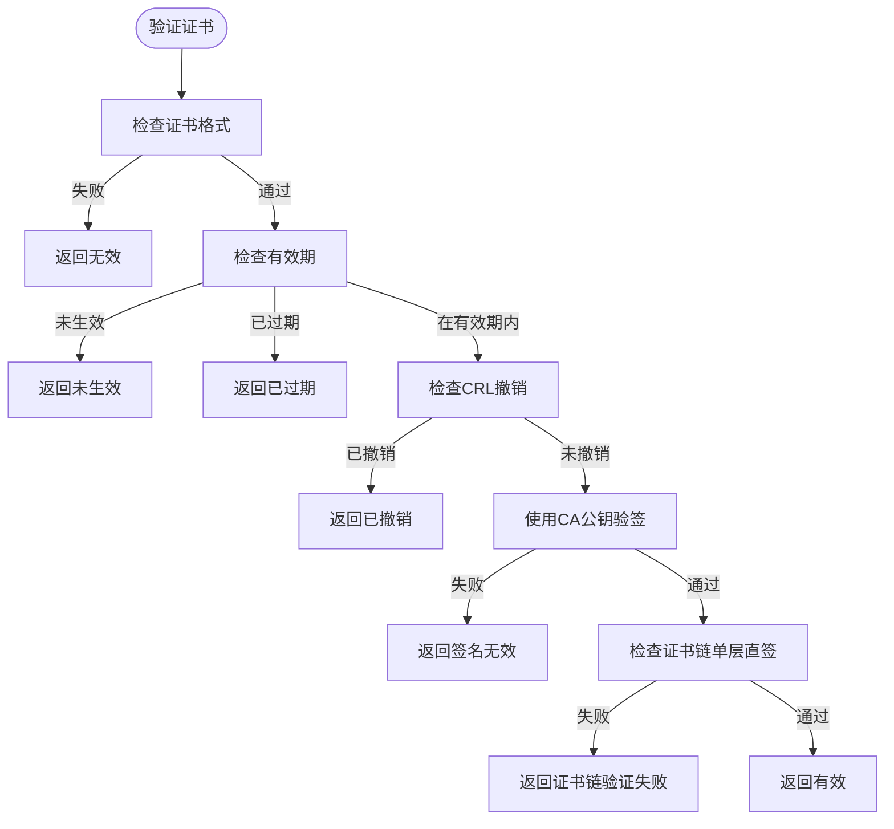
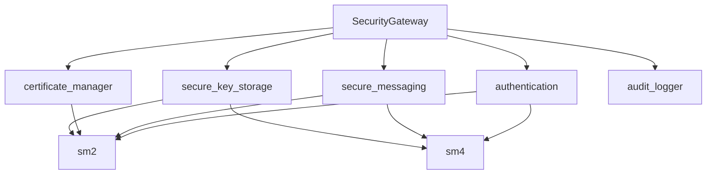

# 安全架构设计

<cite>
**本文档引用的文件**
- [security_gateway.py](file://src/security_gateway.py)
- [authentication.py](file://src/authentication.py)
- [secure_messaging.py](file://src/secure_messaging.py)
- [sm2.py](file://src/crypto/sm2.py)
- [sm4.py](file://src/crypto/sm4.py)
- [certificate_manager.py](file://src/certificate_manager.py)
- [secure_key_storage.py](file://src/secure_key_storage.py)
- [certificate.py](file://src/models/certificate.py)
- [session.py](file://src/models/session.py)
- [audit_logger.py](file://src/audit_logger.py)
- [enums.py](file://src/models/enums.py)
- [test_sm2.py](file://tests/test_sm2.py)
- [test_sm4.py](file://tests/test_sm4.py)
- [test_secure_key_storage.py](file://tests/test_secure_key_storage.py)
- [test_crl_management.py](file://tests/test_crl_management.py)
</cite>

## 目录
1. [引言](#引言)
2. [项目结构](#项目结构)
3. [核心组件](#核心组件)
4. [架构总览](#架构总览)
5. [详细组件分析](#详细组件分析)
6. [依赖关系分析](#依赖关系分析)
7. [性能考虑](#性能考虑)
8. [故障排除指南](#故障排除指南)
9. [结论](#结论)
10. [附录](#附录)

## 引言
本文件面向车联网安全通信网关系统，提供专业级安全架构设计文档。重点围绕身份认证安全、数据传输安全、密钥管理安全、访问控制安全等维度，结合国密算法（SM2/SM4）在系统中的应用，阐述威胁模型与防护策略、安全存储与密钥轮换机制、证书链验证与CRL撤销机制、会话安全管理（防重放与超时）、安全合规与审计机制，并给出安全架构图与威胁分析矩阵，为安全设计与渗透测试提供参考依据。

## 项目结构
系统采用分层与模块化组织，核心模块包括：
- 安全网关主控制器：统一编排证书管理、身份认证、会话管理、安全消息处理与审计日志
- 国密算法实现：SM2（签名/验签/密钥对生成）、SM4（对称加密/解密/密钥生成）
- 证书生命周期管理：颁发、验证、撤销、CRL维护与证书链检查
- 会话与消息安全：双向认证、会话建立、SM4会话密钥、SM2签名与防重放
- 安全存储与密钥轮换：模拟HSM的密钥存储、自动轮换与安全清除
- 审计与合规：事件记录、查询、导出与合规性保障

**图表来源**
- [security_gateway.py:37-800](file://src/security_gateway.py#L37-L800)
- [authentication.py:196-364](file://src/authentication.py#L196-L364)
- [secure_messaging.py:17-142](file://src/secure_messaging.py#L17-L142)
- [sm2.py:93-132](file://src/crypto/sm2.py#L93-L132)
- [sm4.py:11-46](file://src/crypto/sm4.py#L11-L46)
- [certificate_manager.py:597-734](file://src/certificate_manager.py#L597-L734)
- [secure_key_storage.py:27-84](file://src/secure_key_storage.py#L27-L84)
- [audit_logger.py:26-136](file://src/audit_logger.py#L26-L136)

**章节来源**
- [security_gateway.py:37-800](file://src/security_gateway.py#L37-L800)
- [authentication.py:196-364](file://src/authentication.py#L196-L364)
- [secure_messaging.py:17-142](file://src/secure_messaging.py#L17-L142)
- [sm2.py:93-132](file://src/crypto/sm2.py#L93-L132)
- [sm4.py:11-46](file://src/crypto/sm4.py#L11-L46)
- [certificate_manager.py:597-734](file://src/certificate_manager.py#L597-L734)
- [secure_key_storage.py:27-84](file://src/secure_key_storage.py#L27-L84)
- [audit_logger.py:26-136](file://src/audit_logger.py#L26-L136)

## 核心组件
- 安全网关主控制器：负责证书颁发/验证/撤销、双向认证、会话建立/关闭、安全消息发送/接收、审计日志记录与会话清理
- 身份认证模块：实现车云双向认证、挑战/响应、令牌签发与校验、会话冲突处理
- 安全消息模块：基于SM4对称加密与SM2非对称签名，实现加密传输与完整性保护，内置防重放机制
- 证书管理模块：实现证书颁发、验证（含CRL与有效期检查）、撤销与证书链检查
- 安全密钥存储：模拟HSM的密钥存储、密钥轮换与安全清除，保障密钥生命周期安全
- 审计日志：统一记录认证、数据传输、证书操作等事件，支持查询与导出

**章节来源**
- [security_gateway.py:129-792](file://src/security_gateway.py#L129-L792)
- [authentication.py:196-597](file://src/authentication.py#L196-L597)
- [secure_messaging.py:17-249](file://src/secure_messaging.py#L17-L249)
- [certificate_manager.py:206-734](file://src/certificate_manager.py#L206-L734)
- [secure_key_storage.py:27-380](file://src/secure_key_storage.py#L27-L380)
- [audit_logger.py:26-480](file://src/audit_logger.py#L26-L480)

## 架构总览
系统采用“网关编排 + 国密算法 + 安全存储 + 审计合规”的整体架构。网关作为核心枢纽，串联证书管理、身份认证、会话与消息安全、密钥存储与审计模块；所有敏感操作均通过国密算法保证机密性与完整性；密钥在安全存储中受控管理并定期轮换；审计日志贯穿全链路，满足合规与取证需求。

**图表来源**
- [security_gateway.py:353-438](file://src/security_gateway.py#L353-L438)
- [authentication.py:196-364](file://src/authentication.py#L196-L364)
- [certificate_manager.py:206-331](file://src/certificate_manager.py#L206-L331)
- [secure_key_storage.py:125-138](file://src/secure_key_storage.py#L125-L138)

## 详细组件分析

### 身份认证安全
- 双向认证流程：网关先验证车端证书，再由车端验证网关证书；随后双方交换挑战值并使用SM2签名进行挑战/响应验证；最终生成SM4会话密钥与网关签发的认证令牌
- 令牌与权限：令牌包含车辆ID、签发/过期时间与权限集合，使用网关私钥签名，防止伪造
- 会话冲突与清理：通过Redis维护车辆到会话的映射，支持冲突策略（拒绝新会话或终止旧会话）

**图表来源**
- [authentication.py:196-364](file://src/authentication.py#L196-L364)
- [secure_key_storage.py:125-138](file://src/secure_key_storage.py#L125-L138)

**章节来源**
- [authentication.py:196-364](file://src/authentication.py#L196-L364)
- [session.py:9-104](file://src/models/session.py#L9-L104)

### 数据传输安全
- 加密与完整性：使用SM4对业务数据进行加密；使用SM2对消息头、密文、时间戳与Nonce进行签名，确保完整性与抗抵赖
- 防重放机制：每条消息包含16字节随机Nonce与时间戳；接收端在Redis中记录已使用Nonce并设置TTL，检测重放攻击
- 解密与校验：接收端先验签，再使用会话密钥解密；任何环节失败均记录审计事件

**图表来源**
- [secure_messaging.py:144-249](file://src/secure_messaging.py#L144-L249)

**章节来源**
- [secure_messaging.py:17-249](file://src/secure_messaging.py#L17-L249)

### 密钥管理安全
- 安全存储：模拟HSM的密钥存储，CA私钥与会话密钥仅在安全存储中存在，不以明文形式驻留内存
- 自动轮换：按配置的轮换周期（小时）启动后台线程，自动生成新密钥并安全替换旧密钥
- 安全清除：会话结束或密钥轮换后，通过覆盖与删除确保密钥被彻底清除
- 密钥类型：CA私钥（SM2）、会话密钥（SM4-128/256）

**图表来源**
- [secure_key_storage.py:27-380](file://src/secure_key_storage.py#L27-L380)

**章节来源**
- [secure_key_storage.py:27-380](file://src/secure_key_storage.py#L27-L380)

### 访问控制安全
- 基于证书的身份：所有接入必须持有有效且未撤销的证书
- 令牌授权：认证令牌包含权限集合，网关据此控制访问能力
- 会话状态：会话状态与过期时间严格管理，过期自动失效
- 并发控制：同一车辆的会话冲突策略可配置（拒绝新会话或终止旧会话）

**章节来源**
- [authentication.py:599-662](file://src/authentication.py#L599-L662)
- [session.py:37-70](file://src/models/session.py#L37-L70)

### 证书链验证与CRL撤销机制
- 证书验证：检查格式、有效期、CRL撤销列表、签名有效性；支持LRU缓存加速
- CRL维护：从数据库读取撤销列表，撤销后使缓存失效
- 证书链：当前实现为单层直签（CA直发），扩展点支持多层链验证

**图表来源**
- [certificate_manager.py:206-331](file://src/certificate_manager.py#L206-L331)

**章节来源**
- [certificate_manager.py:206-471](file://src/certificate_manager.py#L206-L471)
- [certificate.py:53-108](file://src/models/certificate.py#L53-L108)

### 会话安全管理（防重放与超时）
- 防重放：Nonce长度16字节，首次使用即在Redis中标记并设置TTL；后续相同Nonce视为重放
- 时间戳：消息包含时间戳，配合Nonce与TTL抵御时钟偏差导致的误判
- 会话超时：会话建立时设定过期时间（默认24小时），状态为ACTIVE；过期自动失效
- 冲突处理：通过Redis维护车辆到会话映射，支持冲突策略

**章节来源**
- [secure_messaging.py:205-241](file://src/secure_messaging.py#L205-L241)
- [authentication.py:366-480](file://src/authentication.py#L366-L480)

### 安全存储机制与密钥轮换策略
- 存储策略：CA私钥与会话密钥仅在安全存储中存在，不以明文形式在内存中长期保留
- 轮换策略：按小时粒度检查密钥是否到期，到期后自动生成新密钥并安全替换旧密钥
- 清除策略：会话结束或密钥轮换后，安全清除旧密钥并删除元数据
- 合规保障：密钥生命周期全程受控，满足最小暴露原则与定期轮换要求

**章节来源**
- [secure_key_storage.py:234-314](file://src/secure_key_storage.py#L234-L314)

### 安全合规与审计机制
- 事件类型：认证成功/失败、数据传输（加密/解密）、证书颁发/撤销、签名验证等
- 记录与持久化：统一记录到PostgreSQL，支持查询与导出（JSON/CSV）
- 详细信息限制：单条日志详情不超过1024字符，避免敏感信息泄露
- 报告导出：支持按时间段导出审计报告，便于合规检查与取证

**章节来源**
- [audit_logger.py:26-480](file://src/audit_logger.py#L26-L480)
- [enums.py:35-47](file://src/models/enums.py#L35-L47)

## 依赖关系分析
- 组件耦合：安全网关对认证、消息、证书管理、密钥存储、审计模块形成高层编排；各模块职责清晰、边界明确
- 外部依赖：使用PostgreSQL与Redis作为持久化与缓存；依赖gmssl实现SM2/SM4算法
- 潜在风险：密钥轮换线程与数据库/缓存的交互需注意异常处理与资源释放

**图表来源**
- [security_gateway.py:8-34](file://src/security_gateway.py#L8-L34)
- [authentication.py:14-20](file://src/authentication.py#L14-L20)
- [secure_messaging.py:11-14](file://src/secure_messaging.py#L11-L14)
- [certificate_manager.py:13-17](file://src/certificate_manager.py#L13-L17)
- [secure_key_storage.py:12-14](file://src/secure_key_storage.py#L12-L14)

**章节来源**
- [security_gateway.py:8-34](file://src/security_gateway.py#L8-L34)

## 性能考虑
- 国密算法：SM2/SM4在Python环境下通过gmssl实现，建议在生产环境使用硬件加速或专用密码卡提升性能
- 缓存优化：证书验证引入LRU缓存（容量10000，TTL 5分钟），显著降低重复验证开销
- 并发与锁：安全存储使用线程锁保护，避免竞态；轮换线程采用可中断等待，降低CPU占用
- 存储与网络：会话信息与Nonce存储在Redis，建议使用集群与持久化策略保障高可用

[本节为通用指导，无需特定文件引用]

## 故障排除指南
- 证书验证失败：检查证书有效期、CRL撤销状态、签名有效性；若CA服务不可用，系统记录错误并返回失败
- 认证失败：检查挑战/响应签名、证书有效性、令牌过期；查看审计日志定位具体错误码
- 重放攻击：确认Nonce是否已使用；检查Redis中Nonce键与TTL；核对时间戳与系统时钟
- 解密失败：确认会话密钥是否正确、密文是否被篡改；查看审计日志中的解密失败事件
- 会话冲突：根据策略选择拒绝新会话或终止旧会话；检查车辆到会话映射键

**章节来源**
- [security_gateway.py:610-721](file://src/security_gateway.py#L610-L721)
- [audit_logger.py:90-136](file://src/audit_logger.py#L90-L136)

## 结论
本安全架构以国密算法为核心，结合安全存储与密钥轮换、严格的证书与CRL管理、完善的会话与消息安全机制，以及全面的审计与合规能力，构建了面向车联网场景的端到端安全通信体系。通过威胁建模与防护策略的系统化设计，能够有效应对身份伪造、数据窃听与篡改、重放攻击、密钥泄露等典型威胁，满足行业合规与纵深防御的要求。

[本节为总结性内容，无需特定文件引用]

## 附录

### 安全威胁分析矩阵
- 身份伪造：通过双向认证与证书验证缓解；令牌签名与权限控制进一步加固
- 数据窃听与篡改：SM4加密与SM2签名共同保障机密性与完整性
- 重放攻击：Nonce+时间戳+Redis标记机制有效防护
- 密钥泄露：安全存储与自动轮换降低密钥暴露窗口
- 证书伪造与吊销：CRL与证书链验证确保吊销与有效期控制

[本节为概念性内容，无需特定文件引用]

### 国密算法应用要点
- SM2：用于证书签名/验签、挑战/响应签名、令牌签名
- SM4：用于业务数据加密、会话密钥生成
- 算法参数与长度：严格遵循32字节私钥、64字节公钥、16/32字节密钥等规范

**章节来源**
- [sm2.py:135-204](file://src/crypto/sm2.py#L135-L204)
- [sm4.py:49-110](file://src/crypto/sm4.py#L49-L110)

### 测试与验证参考
- SM2签名/验签：覆盖长度、唯一性、往返一致性与错误场景
- SM4加解密：覆盖长度、填充、往返一致性与错误场景
- 安全存储：覆盖存储/检索/轮换/清除/并发访问等场景
- CRL与证书链：覆盖CRL获取、证书链与过期检查

**章节来源**
- [test_sm2.py:10-258](file://tests/test_sm2.py#L10-L258)
- [test_sm4.py:10-260](file://tests/test_sm4.py#L10-L260)
- [test_secure_key_storage.py:9-313](file://tests/test_secure_key_storage.py#L9-L313)
- [test_crl_management.py:15-400](file://tests/test_crl_management.py#L15-L400)