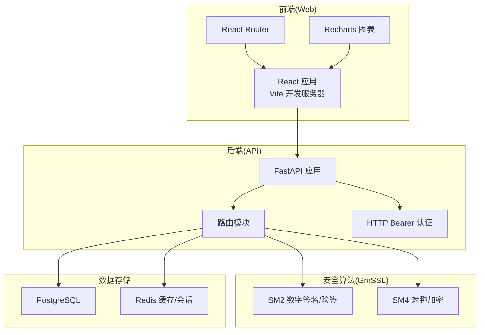
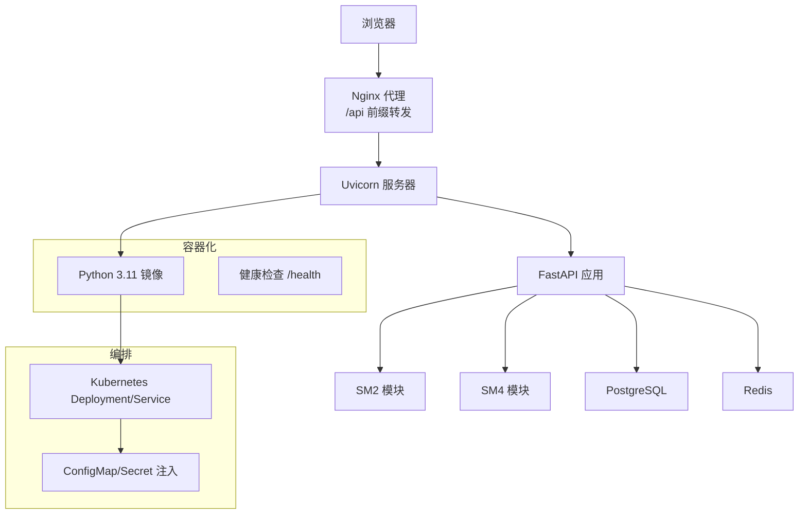
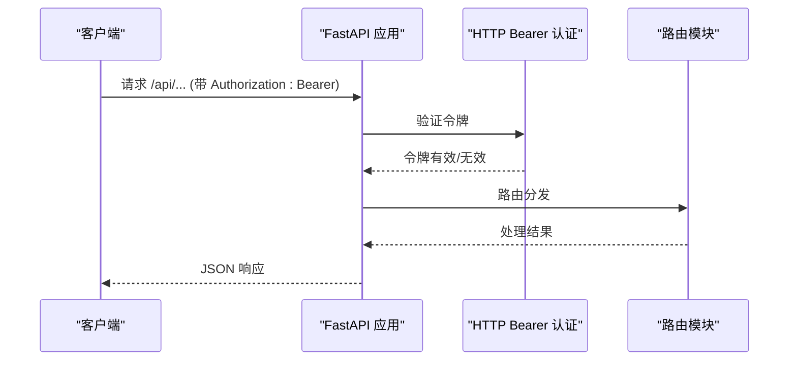
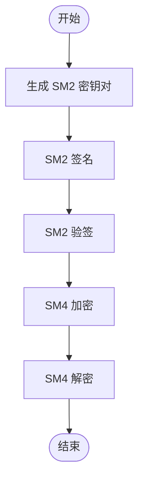
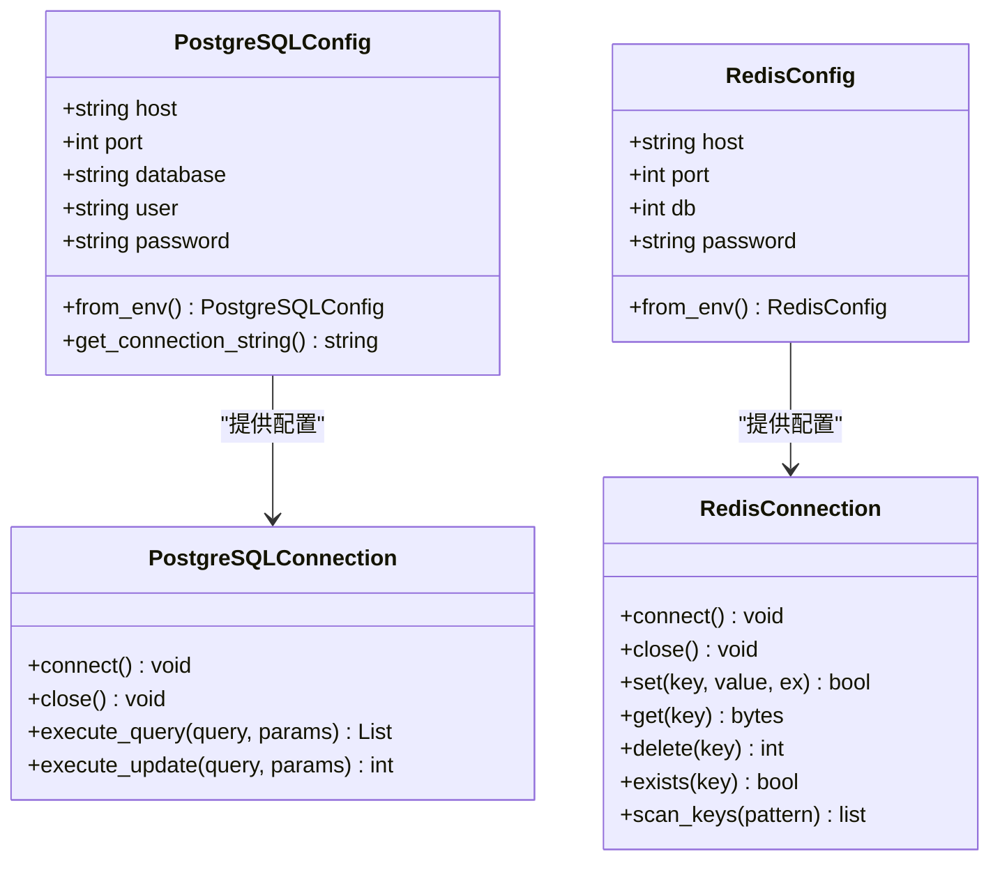
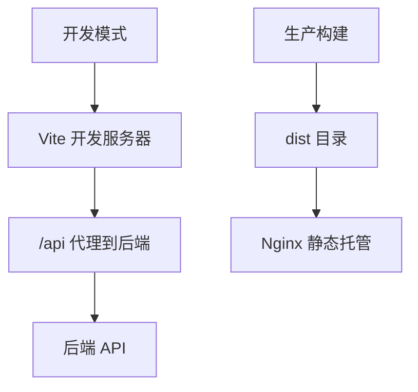
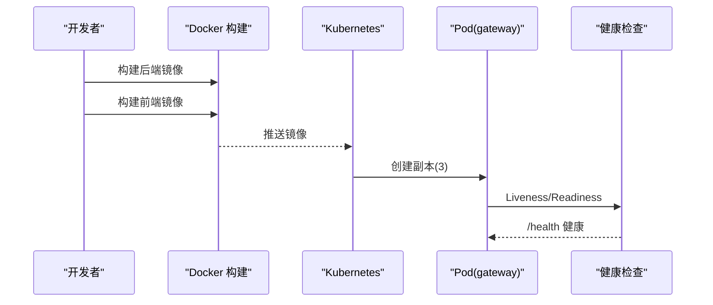
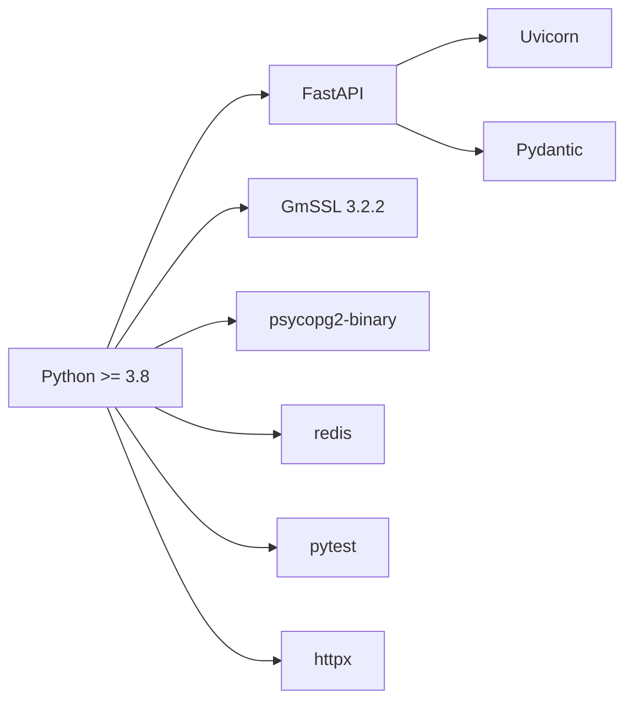

# 技术栈选型

<cite>
**本文档引用的文件**
- [requirements.txt](file://requirements.txt)
- [setup.py](file://setup.py)
- [src/api/main.py](file://src/api/main.py)
- [src/crypto/sm2.py](file://src/crypto/sm2.py)
- [src/crypto/sm4.py](file://src/crypto/sm4.py)
- [src/db/postgres.py](file://src/db/postgres.py)
- [src/db/redis_client.py](file://src/db/redis_client.py)
- [config/database.py](file://config/database.py)
- [src/security_gateway.py](file://src/security_gateway.py)
- [web/package.json](file://web/package.json)
- [web/vite.config.js](file://web/vite.config.js)
- [web/Dockerfile](file://web/Dockerfile)
- [Dockerfile](file://Dockerfile)
- [deployment/kubernetes/gateway-deployment.yaml](file://deployment/kubernetes/gateway-deployment.yaml)
- [tests/conftest.py](file://tests/conftest.py)
- [web/src/App.jsx](file://web/src/App.jsx)
</cite>

## 目录
1. [引言](#引言)
2. [项目结构](#项目结构)
3. [核心组件](#核心组件)
4. [架构总览](#架构总览)
5. [详细组件分析](#详细组件分析)
6. [依赖关系分析](#依赖关系分析)
7. [性能考虑](#性能考虑)
8. [故障排查指南](#故障排查指南)
9. [结论](#结论)
10. [附录](#附录)

## 引言
本文件面向车联网安全通信网关系统的技术选型评估，围绕后端语言与框架、国密算法库、数据库与缓存、前端技术栈、容器化与编排、测试与开发工具链等维度，结合仓库实际实现，给出技术选型的理由、版本兼容性与依赖管理策略，并提供替代方案参考，帮助读者全面理解系统技术决策。

## 项目结构
系统采用前后端分离架构，后端以 Python 为核心，使用 FastAPI 提供 REST API；前端基于 React + Vite 构建；数据库采用 PostgreSQL，缓存使用 Redis；整体通过 Docker 容器化，Kubernetes 进行编排部署。核心模块包括：
- 后端 API 层：FastAPI 应用、路由注册、认证中间件
- 安全算法层：基于 GmSSL 3.2.2 的 SM2/SM4 实现
- 数据访问层：PostgreSQL 与 Redis 连接封装
- 前端界面层：React + Vite + 路由 + 图表组件
- 部署层：Docker 多阶段构建与 Kubernetes YAML

**图表来源**
- [src/api/main.py:13-34](file://src/api/main.py#L13-L34)
- [web/src/App.jsx:1-42](file://web/src/App.jsx#L1-L42)
- [src/crypto/sm2.py:1-265](file://src/crypto/sm2.py#L1-L265)
- [src/crypto/sm4.py:1-189](file://src/crypto/sm4.py#L1-L189)
- [src/db/postgres.py:9-53](file://src/db/postgres.py#L9-L53)
- [src/db/redis_client.py:8-79](file://src/db/redis_client.py#L8-L79)

**章节来源**
- [src/api/main.py:13-34](file://src/api/main.py#L13-L34)
- [web/src/App.jsx:1-42](file://web/src/App.jsx#L1-L42)

## 核心组件
- Python 3.8+：后端开发语言，支持类型注解与异步特性，便于构建高性能 API 与安全算法模块。
- FastAPI：现代异步 Web 框架，自动生成 OpenAPI 文档，内置 Pydantic 数据校验，适合安全网关的 API 设计。
- GmSSL 3.2.2：国产密码算法库，提供 SM2/SM4 实现，满足国密合规要求。
- PostgreSQL：关系型数据库，提供强一致性和事务能力，适合作为审计日志与配置数据的主存储。
- Redis：键值缓存与会话存储，支持高并发读写与会话清理。
- React + Vite：前端技术栈，开发体验佳，多阶段构建，Nginx 部署。
- Docker：镜像构建与运行时隔离，健康检查与非 root 用户。
- Kubernetes：Deployment/Service 编排，环境变量注入与探针配置。

**章节来源**
- [requirements.txt:1-25](file://requirements.txt#L1-L25)
- [setup.py:11-24](file://setup.py#L11-L24)
- [src/api/main.py:13-34](file://src/api/main.py#L13-L34)
- [src/crypto/sm2.py:1-265](file://src/crypto/sm2.py#L1-L265)
- [src/crypto/sm4.py:1-189](file://src/crypto/sm4.py#L1-L189)
- [src/db/postgres.py:9-53](file://src/db/postgres.py#L9-L53)
- [src/db/redis_client.py:8-79](file://src/db/redis_client.py#L8-L79)
- [web/package.json:11-22](file://web/package.json#L11-L22)
- [web/vite.config.js:4-15](file://web/vite.config.js#L4-L15)
- [Dockerfile:2-35](file://Dockerfile#L2-L35)
- [deployment/kubernetes/gateway-deployment.yaml:1-132](file://deployment/kubernetes/gateway-deployment.yaml#L1-L132)

## 架构总览
系统采用“前端页面 + 后端 API + 国密算法 + 存储”的分层设计。前端通过代理访问后端 API；后端通过 GmSSL 实现 SM2/SM4 加解密与签名验签；数据持久化使用 PostgreSQL，会话与缓存使用 Redis；容器化与编排确保可扩展与可观测性。

**图表来源**
- [web/vite.config.js:8-13](file://web/vite.config.js#L8-L13)
- [Dockerfile:30-31](file://Dockerfile#L30-L31)
- [deployment/kubernetes/gateway-deployment.yaml:97-108](file://deployment/kubernetes/gateway-deployment.yaml#L97-L108)

**章节来源**
- [web/vite.config.js:4-15](file://web/vite.config.js#L4-L15)
- [Dockerfile:29-35](file://Dockerfile#L29-L35)
- [deployment/kubernetes/gateway-deployment.yaml:97-108](file://deployment/kubernetes/gateway-deployment.yaml#L97-L108)

## 详细组件分析

### 后端框架与 API 设计（FastAPI）
- 选择理由
  - 自动 OpenAPI 文档与交互式文档，便于联调与运维
  - 内置依赖注入与认证装饰器，简化路由组织与安全控制
  - 支持异步与同步接口，兼顾性能与易用性
- 实现要点
  - CORS 中间件允许跨域访问
  - HTTP Bearer 认证依赖，令牌校验逻辑从环境变量读取
  - 路由按功能模块注册，统一前缀与标签
  - 健康检查端点用于容器探针

**图表来源**
- [src/api/main.py:46-74](file://src/api/main.py#L46-L74)
- [src/api/main.py:94-102](file://src/api/main.py#L94-L102)

**章节来源**
- [src/api/main.py:13-34](file://src/api/main.py#L13-L34)
- [src/api/main.py:46-74](file://src/api/main.py#L46-L74)
- [src/api/main.py:94-102](file://src/api/main.py#L94-L102)

### 国密算法库（GmSSL 3.2.2）
- 选择理由
  - 符合国家密码标准（SM2/SM4），满足车联网安全合规要求
  - 提供稳定、成熟的 Python 接口（gmssl）
- 实现要点
  - SM2：密钥对生成、签名与验签，遵循椭圆曲线数学性质
  - SM4：对称加密/解密，PKCS#7 填充，支持 128/256 位密钥（内部使用 128 位）
  - 与安全网关流程深度集成（证书颁发、会话密钥、消息加解密）

**图表来源**
- [src/crypto/sm2.py:93-132](file://src/crypto/sm2.py#L93-L132)
- [src/crypto/sm2.py:135-204](file://src/crypto/sm2.py#L135-L204)
- [src/crypto/sm2.py:206-265](file://src/crypto/sm2.py#L206-L265)
- [src/crypto/sm4.py:11-46](file://src/crypto/sm4.py#L11-L46)
- [src/crypto/sm4.py:49-108](file://src/crypto/sm4.py#L49-L108)
- [src/crypto/sm4.py:111-189](file://src/crypto/sm4.py#L111-L189)

**章节来源**
- [src/crypto/sm2.py:1-265](file://src/crypto/sm2.py#L1-L265)
- [src/crypto/sm4.py:1-189](file://src/crypto/sm4.py#L1-L189)

### 数据库与缓存（PostgreSQL + Redis）
- 选择理由
  - PostgreSQL：ACID 事务、强一致性、复杂查询与审计日志存储
  - Redis：高性能键值存储、会话管理、过期与扫描能力
- 实现要点
  - PostgreSQLConnection：连接池化、上下文管理、查询/更新封装
  - RedisConnection：键值操作、存在性检查、扫描键空间
  - 配置从环境变量加载，支持容器化部署

**图表来源**
- [config/database.py:8-31](file://config/database.py#L8-L31)
- [config/database.py:33-49](file://config/database.py#L33-L49)
- [src/db/postgres.py:9-53](file://src/db/postgres.py#L9-L53)
- [src/db/redis_client.py:8-79](file://src/db/redis_client.py#L8-L79)

**章节来源**
- [config/database.py:8-49](file://config/database.py#L8-L49)
- [src/db/postgres.py:9-53](file://src/db/postgres.py#L9-L53)
- [src/db/redis_client.py:8-79](file://src/db/redis_client.py#L8-L79)

### 前端技术栈（React + Vite）
- 选择理由
  - React 生态成熟，组件化开发，适合管理多页面与复杂交互
  - Vite 提供快速热更新与构建体验，开发/生产双优
  - Recharts 用于安全指标可视化，Axios 与路由完善 API 交互
- 实现要点
  - 多页面路由：车辆监控、安全指标、证书管理、审计日志、安全配置
  - 本地开发代理：将 /api 前缀转发至后端 8000 端口
  - 多阶段构建 + Nginx 部署，生产环境静态资源托管

**图表来源**
- [web/vite.config.js:6-14](file://web/vite.config.js#L6-L14)
- [web/Dockerfile:18-27](file://web/Dockerfile#L18-L27)

**章节来源**
- [web/package.json:6-22](file://web/package.json#L6-L22)
- [web/vite.config.js:4-15](file://web/vite.config.js#L4-L15)
- [web/Dockerfile:1-34](file://web/Dockerfile#L1-L34)
- [web/src/App.jsx:1-42](file://web/src/App.jsx#L1-L42)

### 容器化与编排（Docker + Kubernetes）
- 选择理由
  - Docker：隔离运行环境、依赖打包、非 root 用户、健康检查
  - Kubernetes：副本管理、探针、配置与密钥注入、负载均衡
- 实现要点
  - 后端镜像：Python 3.11 slim，安装 gcc 与 postgresql-client，健康检查 /health
  - 前端镜像：多阶段构建，Nginx 托管静态资源
  - K8s：Deployment 多副本，Service 暴露 8000，ConfigMap/Secret 注入环境变量，探针配置

**图表来源**
- [Dockerfile:2-35](file://Dockerfile#L2-L35)
- [web/Dockerfile:1-34](file://web/Dockerfile#L1-L34)
- [deployment/kubernetes/gateway-deployment.yaml:1-132](file://deployment/kubernetes/gateway-deployment.yaml#L1-L132)

**章节来源**
- [Dockerfile:2-35](file://Dockerfile#L2-L35)
- [web/Dockerfile:1-34](file://web/Dockerfile#L1-L34)
- [deployment/kubernetes/gateway-deployment.yaml:1-132](file://deployment/kubernetes/gateway-deployment.yaml#L1-L132)

### 测试框架与开发工具链（Pytest + 工具库）
- 选择理由
  - Pytest：简单易用、插件生态丰富、支持异步测试
  - Hypothesis：属性测试，提升安全性与健壮性
  - httpx：HTTP 客户端，支持同步/异步，便于 API 测试
  - python-dotenv：环境变量加载，便于本地与 CI 配置
  - cryptography：通用加密工具，补充测试与开发场景
- 实现要点
  - conftest：全局 Mock Redis 连接，隔离数据库依赖
  - 自动注入 Mock，保证测试稳定性与可重复性

**章节来源**
- [requirements.txt:15-24](file://requirements.txt#L15-L24)
- [tests/conftest.py:16-95](file://tests/conftest.py#L16-L95)

## 依赖关系分析
- 版本兼容性
  - Python >= 3.8（安装脚本声明），运行时使用 3.11 镜像
  - FastAPI 与 Uvicorn 保持兼容，Pydantic 2.x
  - GmSSL 3.2.2 与 SM2/SM4 标准一致
  - psycopg2-binary 与 PostgreSQL 兼容
  - redis 与 Redis 服务器兼容
- 依赖管理策略
  - requirements.txt 与 setup.py 双向约束，确保安装与发布一致
  - 容器内一次性安装依赖，减少镜像体积与构建时间
  - 环境变量驱动数据库与缓存配置，便于多环境切换

**图表来源**
- [setup.py:11-24](file://setup.py#L11-L24)
- [requirements.txt:3-24](file://requirements.txt#L3-L24)

**章节来源**
- [setup.py:11-24](file://setup.py#L11-L24)
- [requirements.txt:3-24](file://requirements.txt#L3-L24)

## 性能考虑
- 后端
  - FastAPI 异步模型与 Uvicorn 高性能运行时，适合高并发 API
  - CORS 与认证中间件开销低，建议生产环境限制允许来源
- 数据库
  - PostgreSQL 使用 RealDictCursor 返回结构化结果，注意查询优化与索引设计
  - 连接复用与上下文管理减少连接开销
- 缓存
  - Redis 用于会话与短期缓存，建议合理设置 TTL 与内存上限
  - 扫描键空间时注意大键扫描的性能影响
- 前端
  - Vite 开发体验与构建优化，生产环境 Nginx 静态托管
- 容器与编排
  - 健康检查与探针降低故障发现时间
  - 多副本与负载均衡提升可用性

## 故障排查指南
- 健康检查失败
  - 检查 /health 端点可达性与容器日志
  - 确认 Uvicorn 启动参数与端口映射
- 认证失败
  - 核对 API_TOKEN 环境变量与请求头 Authorization
- 数据库连接问题
  - 检查 POSTGRES_* 环境变量与网络连通性
  - 查看连接字符串格式与权限
- Redis 连接问题
  - 检查 REDIS_* 环境变量与密码配置
  - 确认键空间扫描与过期策略
- 前端无法访问后端
  - 检查 Vite 代理配置与后端端口
  - 确认 Nginx 静态资源与代理规则

**章节来源**
- [src/api/main.py:87-90](file://src/api/main.py#L87-L90)
- [web/vite.config.js:8-13](file://web/vite.config.js#L8-L13)
- [deployment/kubernetes/gateway-deployment.yaml:97-108](file://deployment/kubernetes/gateway-deployment.yaml#L97-L108)

## 结论
本项目在技术选型上兼顾合规性、性能与可维护性：后端采用 Python + FastAPI，结合 GmSSL 实现国密算法；数据库与缓存分别承担持久化与会话管理职责；前端以 React + Vite 构建，配合 Nginx 部署；容器化与 Kubernetes 编排保障了可扩展与可观测性。整体技术栈清晰、边界明确，适合在车联网安全场景下持续演进。

## 附录
- 替代方案参考
  - Web 框架：Sanic、Starlette（异步）、Flask（轻量但需额外中间件）
  - 数据库：MySQL（成本较低）、MongoDB（文档模型）、CockroachDB（分布式）
  - 缓存：Memcached（简单）、etcd（分布式配置）、Consul（服务发现）
  - 前端：Vue + Vite、SvelteKit（更小包体）、Next.js（SSR）
  - 容器编排：Docker Compose（单机）、Argo CD（GitOps）、Helm（模板化）
- 最佳实践
  - 严格区分开发/测试/生产环境变量
  - 使用 Secret 管理敏感配置，避免硬编码
  - 为关键接口增加限流与熔断
  - 定期轮换密钥与证书，启用审计日志追踪