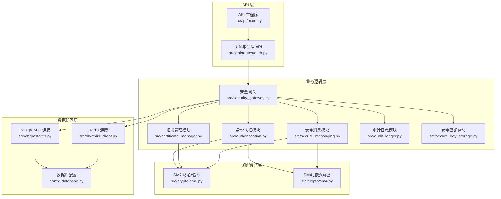
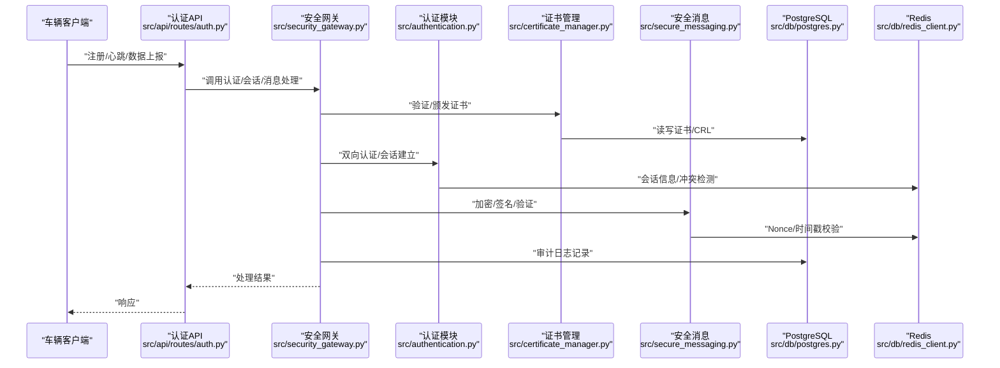
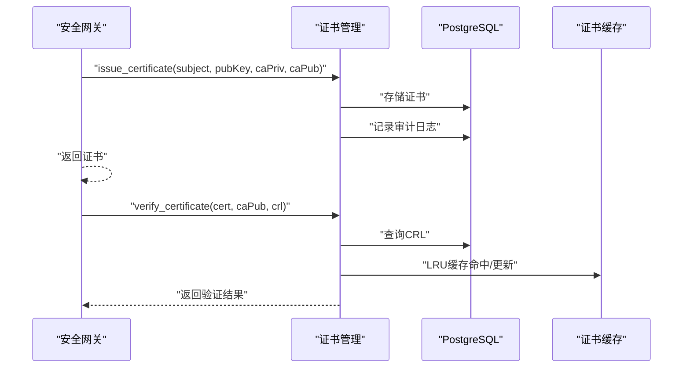
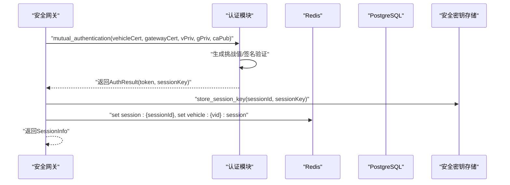
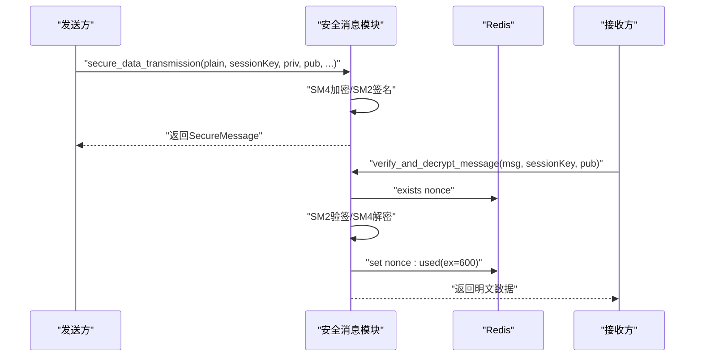
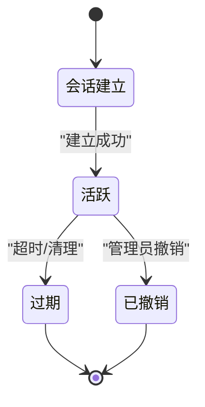
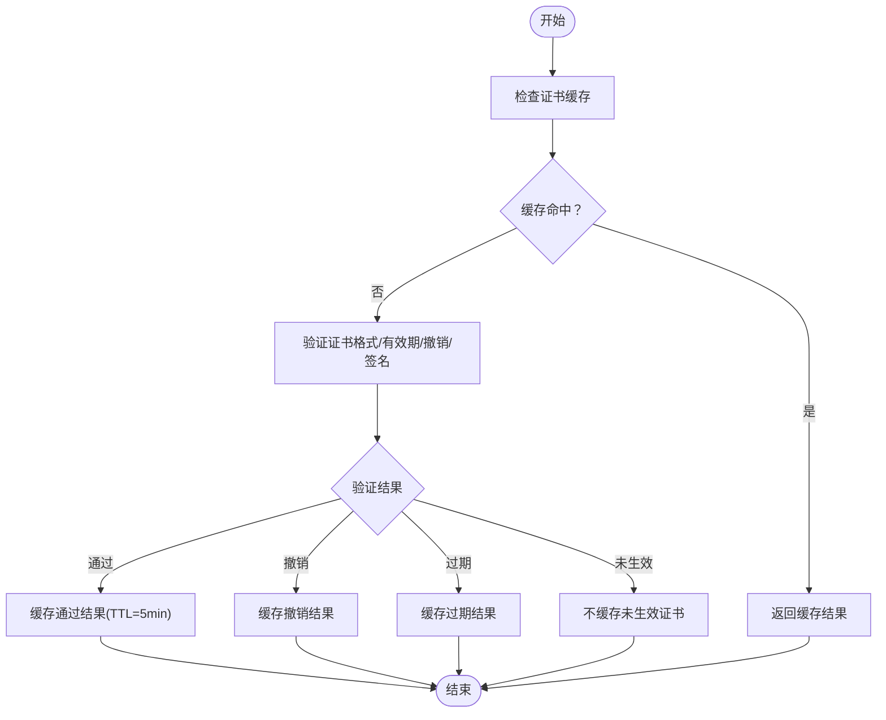
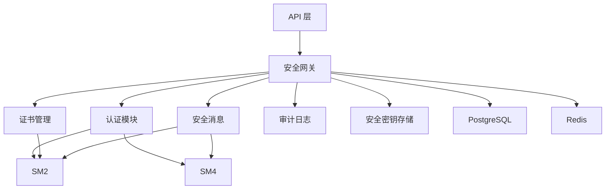

# 数据流设计

<cite>
**本文档引用的文件**
- [security_gateway.py](file://src/security_gateway.py)
- [authentication.py](file://src/authentication.py)
- [certificate_manager.py](file://src/certificate_manager.py)
- [secure_messaging.py](file://src/secure_messaging.py)
- [message.py](file://src/models/message.py)
- [session.py](file://src/models/session.py)
- [certificate.py](file://src/models/certificate.py)
- [audit_logger.py](file://src/audit_logger.py)
- [postgres.py](file://src/db/postgres.py)
- [redis_client.py](file://src/db/redis_client.py)
- [database.py](file://config/database.py)
- [auth.py](file://src/api/routes/auth.py)
- [main.py](file://src/api/main.py)
- [enums.py](file://src/models/enums.py)
- [sm2.py](file://src/crypto/sm2.py)
- [sm4.py](file://src/crypto/sm4.py)
- [secure_key_storage.py](file://src/secure_key_storage.py)
</cite>

## 目录
1. [简介](#简介)
2. [项目结构](#项目结构)
3. [核心组件](#核心组件)
4. [架构总览](#架构总览)
5. [详细组件分析](#详细组件分析)
6. [依赖关系分析](#依赖关系分析)
7. [性能考虑](#性能考虑)
8. [故障排除指南](#故障排除指南)
9. [结论](#结论)
10. [附录](#附录)

## 简介
本文件面向车联网安全通信网关系统，聚焦系统关键数据的流转路径与处理机制，涵盖证书申请与验证、身份认证、安全消息传输、会话管理等核心流程。文档详细说明数据在不同组件间的转换与处理步骤（如数据格式标准化、加密解密、签名验证），并提供完整的数据流图与状态转换图。同时，阐述数据持久化策略、缓存机制、数据一致性与事务处理、安全与隐私保护措施，并给出数据架构设计与性能优化建议。

## 项目结构
系统采用分层与模块化设计，主要分为：
- API 层：提供 RESTful 接口，负责外部交互与路由分发
- 业务逻辑层：安全网关、认证、证书管理、消息安全、审计日志等核心模块
- 数据访问层：PostgreSQL 与 Redis 连接封装
- 加密算法层：SM2/SM4 国密算法实现
- 配置层：数据库连接配置

图表来源
- [main.py:105-108](file://src/api/main.py#L105-L108)
- [auth.py:94-102](file://src/api/routes/auth.py#L94-L102)
- [security_gateway.py:37-128](file://src/security_gateway.py#L37-L128)
- [authentication.py:196-364](file://src/authentication.py#L196-L364)
- [certificate_manager.py:597-734](file://src/certificate_manager.py#L597-L734)
- [secure_messaging.py:17-142](file://src/secure_messaging.py#L17-L142)
- [audit_logger.py:26-89](file://src/audit_logger.py#L26-L89)
- [postgres.py:9-53](file://src/db/postgres.py#L9-L53)
- [redis_client.py:8-79](file://src/db/redis_client.py#L8-L79)
- [database.py:8-50](file://config/database.py#L8-L50)
- [sm2.py:135-204](file://src/crypto/sm2.py#L135-L204)
- [sm4.py:49-108](file://src/crypto/sm4.py#L49-L108)

章节来源
- [main.py:105-108](file://src/api/main.py#L105-L108)
- [auth.py:94-102](file://src/api/routes/auth.py#L94-L102)
- [security_gateway.py:37-128](file://src/security_gateway.py#L37-L128)

## 核心组件
- 安全网关（SecurityGateway）：集成证书管理、身份认证、加密签名与审计日志，提供统一的网关服务入口
- 身份认证模块（authentication）：实现车云双向认证、会话建立与清理、冲突处理
- 证书管理模块（certificate_manager）：实现证书颁发、验证、撤销与 CRL 管理
- 安全消息模块（secure_messaging）：实现安全报文的加密、签名与验证
- 数据模型（models）：定义证书、会话、消息、审计日志等数据结构
- 数据库访问（db）：PostgreSQL 与 Redis 连接封装
- 加密算法（crypto）：SM2/SM4 实现
- 安全密钥存储（secure_key_storage）：模拟 HSM 的密钥安全存储与轮换

章节来源
- [security_gateway.py:37-128](file://src/security_gateway.py#L37-L128)
- [authentication.py:196-364](file://src/authentication.py#L196-L364)
- [certificate_manager.py:597-734](file://src/certificate_manager.py#L597-L734)
- [secure_messaging.py:17-142](file://src/secure_messaging.py#L17-L142)
- [message.py:79-200](file://src/models/message.py#L79-L200)
- [session.py:37-104](file://src/models/session.py#L37-L104)
- [certificate.py:53-108](file://src/models/certificate.py#L53-L108)
- [audit_logger.py:26-89](file://src/audit_logger.py#L26-L89)
- [postgres.py:9-53](file://src/db/postgres.py#L9-L53)
- [redis_client.py:8-79](file://src/db/redis_client.py#L8-L79)
- [database.py:8-50](file://config/database.py#L8-L50)
- [sm2.py:135-204](file://src/crypto/sm2.py#L135-L204)
- [sm4.py:49-108](file://src/crypto/sm4.py#L49-L108)
- [secure_key_storage.py:27-124](file://src/secure_key_storage.py#L27-L124)

## 架构总览
系统采用“API → 网关 → 业务模块 → 数据存储”的分层架构，结合 SM2/SM4 国密算法实现端到端安全通信。数据在组件间以标准化的数据模型传递，通过加密、签名、缓存与审计日志保障完整性与可追溯性。

图表来源
- [auth.py:70-230](file://src/api/routes/auth.py#L70-L230)
- [security_gateway.py:289-591](file://src/security_gateway.py#L289-L591)
- [authentication.py:196-480](file://src/authentication.py#L196-L480)
- [certificate_manager.py:206-471](file://src/certificate_manager.py#L206-L471)
- [secure_messaging.py:144-249](file://src/secure_messaging.py#L144-L249)
- [postgres.py:32-45](file://src/db/postgres.py#L32-L45)
- [redis_client.py:31-71](file://src/db/redis_client.py#L31-L71)

## 详细组件分析

### 证书申请与验证流程
- 颁发证书：安全网关调用证书管理模块，使用 CA 私钥对 TBS 证书进行签名，存储至 PostgreSQL，并记录审计日志
- 验证证书：从数据库获取最新 CRL，验证证书格式、有效期、撤销状态与签名；支持 LRU 缓存加速
- 撤销证书：将序列号加入 CRL 并记录审计日志，同时使缓存失效

图表来源
- [security_gateway.py:129-181](file://src/security_gateway.py#L129-L181)
- [certificate_manager.py:597-734](file://src/certificate_manager.py#L597-L734)
- [certificate_manager.py:206-331](file://src/certificate_manager.py#L206-L331)
- [certificate_manager.py:432-471](file://src/certificate_manager.py#L432-L471)
- [audit_logger.py:185-241](file://src/audit_logger.py#L185-L241)

章节来源
- [security_gateway.py:129-181](file://src/security_gateway.py#L129-L181)
- [certificate_manager.py:206-331](file://src/certificate_manager.py#L206-L331)
- [certificate_manager.py:334-430](file://src/certificate_manager.py#L334-L430)
- [certificate_manager.py:432-471](file://src/certificate_manager.py#L432-L471)
- [audit_logger.py:185-241](file://src/audit_logger.py#L185-L241)

### 身份认证与会话管理流程
- 双向认证：网关与车端分别验证对方证书，使用 SM2 对挑战值进行签名与验签，生成会话密钥与认证令牌
- 会话建立：生成会话 ID 与 SM4 会话密钥，存储到 Redis，令牌信息与密钥同时写入安全存储
- 会话清理：关闭会话时安全清除密钥并删除 Redis 中的会话数据
- 会话冲突：基于车辆 ID 的映射键进行冲突检测与处理

图表来源
- [authentication.py:196-364](file://src/authentication.py#L196-L364)
- [authentication.py:366-480](file://src/authentication.py#L366-L480)
- [authentication.py:483-552](file://src/authentication.py#L483-L552)
- [authentication.py:599-662](file://src/authentication.py#L599-L662)
- [security_gateway.py:440-496](file://src/security_gateway.py#L440-L496)
- [secure_key_storage.py:86-124](file://src/secure_key_storage.py#L86-L124)

章节来源
- [authentication.py:196-364](file://src/authentication.py#L196-L364)
- [authentication.py:366-480](file://src/authentication.py#L366-L480)
- [authentication.py:483-552](file://src/authentication.py#L483-L552)
- [authentication.py:599-662](file://src/authentication.py#L599-L662)
- [security_gateway.py:440-496](file://src/security_gateway.py#L440-L496)
- [secure_key_storage.py:86-124](file://src/secure_key_storage.py#L86-L124)

### 安全消息传输流程
- 加密与签名：使用 SM4 对业务数据加密，使用 SM2 对消息头、载荷、时间戳与 Nonce 进行签名
- 验证与解密：验证时间戳（±5 分钟容差）、检查 Nonce 是否已使用（防重放），使用发送方公钥验签，再用会话密钥解密
- 非法处理：针对签名失败、重放攻击、时间戳过期、解密失败等场景进行分类处理与审计记录

图表来源
- [secure_messaging.py:17-142](file://src/secure_messaging.py#L17-L142)
- [secure_messaging.py:144-249](file://src/secure_messaging.py#L144-L249)
- [message.py:79-200](file://src/models/message.py#L79-L200)
- [redis_client.py:46-49](file://src/db/redis_client.py#L46-L49)

章节来源
- [secure_messaging.py:17-142](file://src/secure_messaging.py#L17-L142)
- [secure_messaging.py:144-249](file://src/secure_messaging.py#L144-L249)
- [message.py:79-200](file://src/models/message.py#L79-L200)
- [redis_client.py:46-49](file://src/db/redis_client.py#L46-L49)

### 数据模型与状态转换
- 会话状态机：ACTIVE → EXPIRED/REVOKED，过期或手动关闭触发状态变更
- 证书状态机：VALID → REVOKED/EXPIRED，撤销或过期触发状态变更
- 审计事件类型：认证成功/失败、数据加密/解密、证书颁发/撤销、签名验证等

图表来源
- [session.py:37-70](file://src/models/session.py#L37-L70)
- [enums.py:28-33](file://src/models/enums.py#L28-L33)

章节来源
- [session.py:37-70](file://src/models/session.py#L37-L70)
- [enums.py:28-33](file://src/models/enums.py#L28-L33)

### 数据持久化与缓存策略
- PostgreSQL：存储证书、CRL、审计日志、车辆数据；提供事务与约束保障
- Redis：存储会话信息、车辆到会话映射、Nonce 防重放标记；TTL 自动过期
- 证书缓存：LRU 缓存（容量 10000，TTL 5 分钟），撤销/过期/未生效等状态缓存策略不同

图表来源
- [certificate_manager.py:257-331](file://src/certificate_manager.py#L257-L331)
- [postgres.py:32-45](file://src/db/postgres.py#L32-L45)
- [redis_client.py:51-71](file://src/db/redis_client.py#L51-L71)

章节来源
- [certificate_manager.py:257-331](file://src/certificate_manager.py#L257-L331)
- [postgres.py:32-45](file://src/db/postgres.py#L32-L45)
- [redis_client.py:51-71](file://src/db/redis_client.py#L51-L71)

### 数据一致性与事务处理
- PostgreSQL 事务：证书颁发、撤销、审计日志写入均在事务中执行，确保原子性与一致性
- ON CONFLICT：车辆数据插入时使用 ON CONFLICT 语句，避免重复键冲突
- Redis TTL：会话与映射键设置过期时间，配合主动清理函数维持一致性

章节来源
- [certificate_manager.py:705-718](file://src/certificate_manager.py#L705-L718)
- [auth.py:462-494](file://src/api/routes/auth.py#L462-L494)
- [authentication.py:554-596](file://src/authentication.py#L554-L596)

### 数据安全与隐私保护
- 加密算法：SM2/SM4 国密算法，密钥长度满足安全要求
- 安全存储：会话密钥与 CA 私钥存储在安全隔离区，支持自动轮换与安全清除
- 防重放：Nonce 唯一性与 TTL 标记，时间戳容差控制
- 审计追踪：所有关键操作记录审计日志，支持查询与导出
- 最小暴露：密钥不在内存中长期保存，使用后立即安全清除

章节来源
- [sm2.py:135-204](file://src/crypto/sm2.py#L135-L204)
- [sm4.py:49-108](file://src/crypto/sm4.py#L49-L108)
- [secure_key_storage.py:234-313](file://src/secure_key_storage.py#L234-L313)
- [audit_logger.py:26-89](file://src/audit_logger.py#L26-L89)

## 依赖关系分析
- 组件耦合：安全网关聚合认证、证书、消息、审计与密钥存储模块，形成高内聚低耦合
- 外部依赖：PostgreSQL 与 Redis 提供持久化与缓存能力；gmssl 提供 SM2/SM4 实现
- 依赖方向：API → 网关 → 业务模块 → 数据访问；加密算法独立于业务逻辑

图表来源
- [security_gateway.py:37-128](file://src/security_gateway.py#L37-L128)
- [authentication.py:196-364](file://src/authentication.py#L196-L364)
- [certificate_manager.py:597-734](file://src/certificate_manager.py#L597-L734)
- [secure_messaging.py:17-142](file://src/secure_messaging.py#L17-L142)
- [audit_logger.py:26-89](file://src/audit_logger.py#L26-L89)
- [postgres.py:9-53](file://src/db/postgres.py#L9-L53)
- [redis_client.py:8-79](file://src/db/redis_client.py#L8-L79)
- [sm2.py:135-204](file://src/crypto/sm2.py#L135-L204)
- [sm4.py:49-108](file://src/crypto/sm4.py#L49-L108)

章节来源
- [security_gateway.py:37-128](file://src/security_gateway.py#L37-L128)
- [authentication.py:196-364](file://src/authentication.py#L196-L364)
- [certificate_manager.py:597-734](file://src/certificate_manager.py#L597-L734)
- [secure_messaging.py:17-142](file://src/secure_messaging.py#L17-L142)
- [audit_logger.py:26-89](file://src/audit_logger.py#L26-L89)
- [postgres.py:9-53](file://src/db/postgres.py#L9-L53)
- [redis_client.py:8-79](file://src/db/redis_client.py#L8-L79)
- [sm2.py:135-204](file://src/crypto/sm2.py#L135-L204)
- [sm4.py:49-108](file://src/crypto/sm4.py#L49-L108)

## 性能考虑
- 缓存优化：证书验证引入 LRU 缓存，显著降低数据库与签名验证开销
- 非对称与对称结合：SM2 仅用于签名与密钥交换，SM4 用于大块数据加密，兼顾安全性与性能
- Redis TTL：会话与映射键设置合理 TTL，减少主动清理压力
- 并发控制：会话冲突检测基于 Redis 原子键，避免竞态条件
- 日志异步：审计日志写入失败不阻塞主流程，保证吞吐

## 故障排除指南
- 证书验证失败：检查证书有效期、撤销状态与签名；若数据库异常，考虑使用缓存结果
- 会话建立失败：确认令牌有效性、车辆 ID 匹配与安全存储可用性
- 消息验证失败：排查签名验证、Nonce 已使用、时间戳容差与会话密钥
- 审计日志异常：检查 PostgreSQL 连接与权限，确认日志持久化成功

章节来源
- [security_gateway.py:226-245](file://src/security_gateway.py#L226-L245)
- [authentication.py:416-420](file://src/authentication.py#L416-L420)
- [secure_messaging.py:210-212](file://src/secure_messaging.py#L210-L212)
- [audit_logger.py:82-88](file://src/audit_logger.py#L82-L88)

## 结论
本系统通过清晰的数据流设计与严格的加密、审计与缓存策略，实现了车联网场景下的端到端安全通信。证书生命周期管理、双向认证、会话与消息安全、以及审计追踪共同构成完整闭环。建议在生产环境中进一步强化密钥轮换与 HSM 集成，并持续优化缓存与数据库查询性能。

## 附录
- 数据模型概览：证书、会话、消息、审计日志等核心数据结构定义
- 配置项：PostgreSQL 与 Redis 连接配置，支持从环境变量加载
- API 路由：认证、会话、数据上报等接口定义与依赖注入

章节来源
- [message.py:79-200](file://src/models/message.py#L79-L200)
- [session.py:37-104](file://src/models/session.py#L37-L104)
- [certificate.py:53-108](file://src/models/certificate.py#L53-L108)
- [database.py:8-50](file://config/database.py#L8-L50)
- [auth.py:70-230](file://src/api/routes/auth.py#L70-L230)