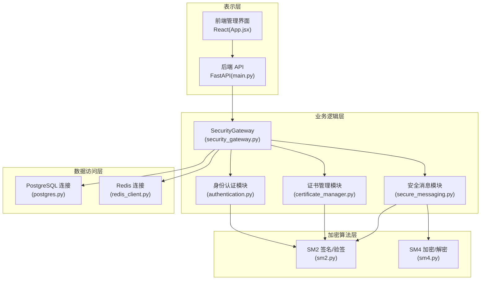
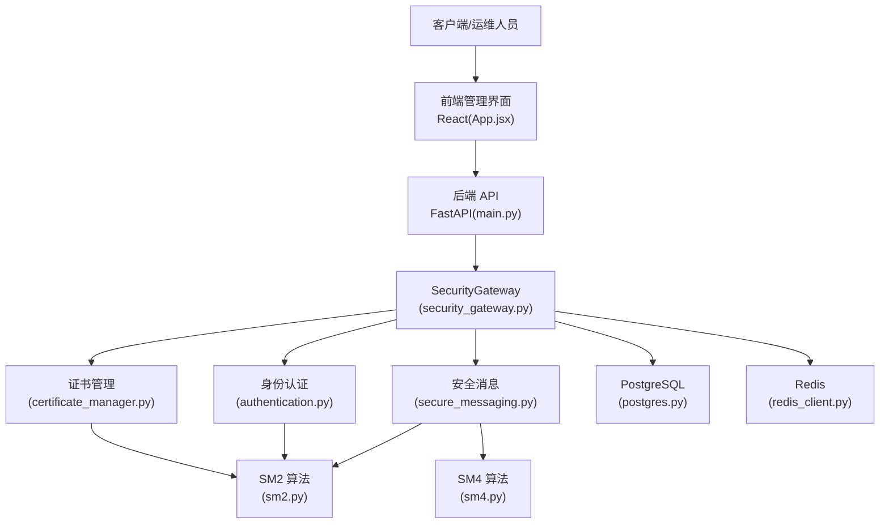
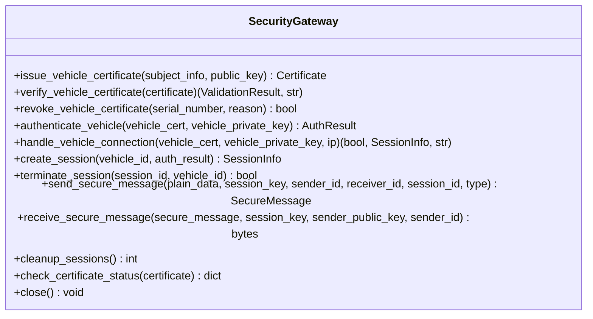
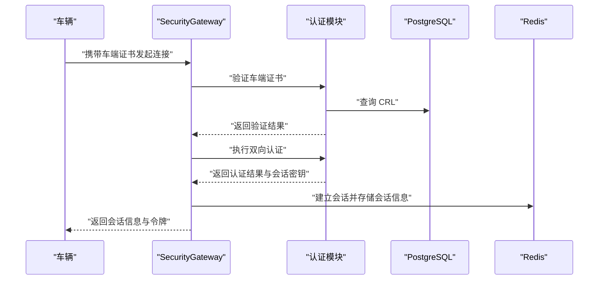
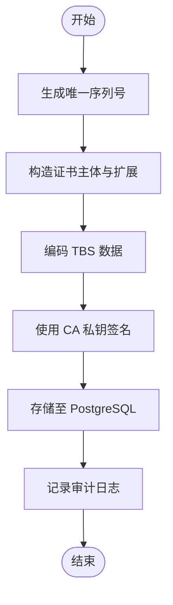
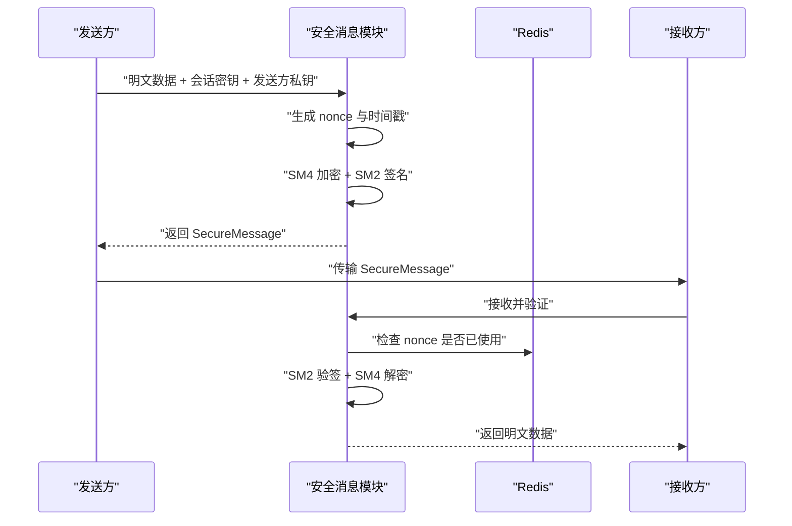
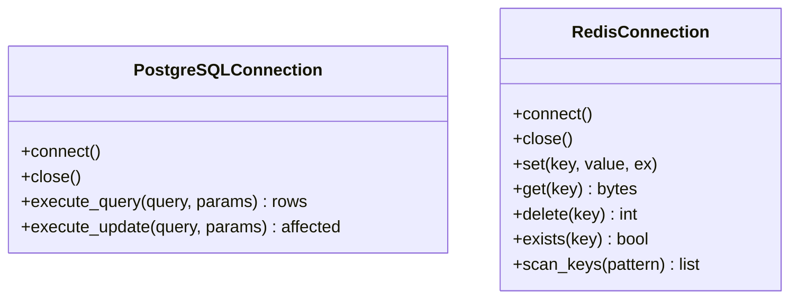
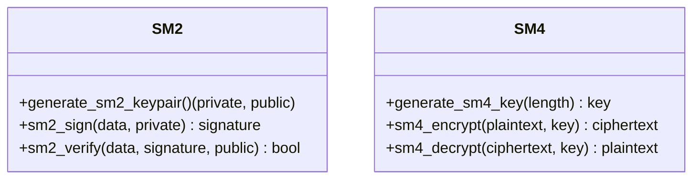
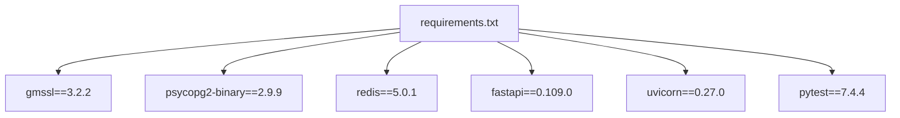

# 整体架构设计

<cite>
**本文档引用的文件**
- [src/security_gateway.py](file://src/security_gateway.py)
- [src/api/main.py](file://src/api/main.py)
- [src/authentication.py](file://src/authentication.py)
- [src/certificate_manager.py](file://src/certificate_manager.py)
- [src/secure_messaging.py](file://src/secure_messaging.py)
- [src/db/postgres.py](file://src/db/postgres.py)
- [src/db/redis_client.py](file://src/db/redis_client.py)
- [config/database.py](file://config/database.py)
- [src/crypto/sm2.py](file://src/crypto/sm2.py)
- [src/crypto/sm4.py](file://src/crypto/sm4.py)
- [web/src/App.jsx](file://web/src/App.jsx)
- [Dockerfile](file://Dockerfile)
- [requirements.txt](file://requirements.txt)
- [deployment/kubernetes/gateway-deployment.yaml](file://deployment/kubernetes/gateway-deployment.yaml)
</cite>

## 目录
1. [引言](#引言)
2. [项目结构](#项目结构)
3. [核心组件](#核心组件)
4. [架构总览](#架构总览)
5. [详细组件分析](#详细组件分析)
6. [依赖关系分析](#依赖关系分析)
7. [性能考量](#性能考量)
8. [故障排查指南](#故障排查指南)
9. [结论](#结论)
10. [附录](#附录)

## 引言
本架构设计文档面向车联网安全通信网关系统，围绕“分层架构 + 微服务化”的设计理念，系统性阐述表示层、业务逻辑层、数据访问层的职责划分；重点解析SecurityGateway作为中央协调器的角色，及其对证书管理、身份认证、加密传输、审计日志等子系统的集成方式；明确系统边界与外部依赖（PostgreSQL、Redis、GmSSL），并给出系统上下文图与组件关系图，说明数据流与控制流。同时，提供技术栈选择理由与架构决策的权衡考虑。

## 项目结构
项目采用模块化分层组织：
- 表示层：FastAPI 后端 API 与前端 React 管理界面
- 业务逻辑层：SecurityGateway 为核心协调器，封装证书管理、身份认证、安全消息、会话管理等
- 数据访问层：PostgreSQL 与 Redis 连接封装
- 加密算法层：基于 GmSSL 的 SM2/SM4 实现
- 配置与部署：环境变量配置、Kubernetes 部署清单

图表来源
- [src/api/main.py:1-108](file://src/api/main.py#L1-L108)
- [src/security_gateway.py:1-800](file://src/security_gateway.py#L1-L800)
- [src/authentication.py:1-662](file://src/authentication.py#L1-L662)
- [src/certificate_manager.py:1-734](file://src/certificate_manager.py#L1-L734)
- [src/secure_messaging.py:1-249](file://src/secure_messaging.py#L1-L249)
- [src/db/postgres.py:1-53](file://src/db/postgres.py#L1-L53)
- [src/db/redis_client.py:1-79](file://src/db/redis_client.py#L1-L79)
- [src/crypto/sm2.py:1-265](file://src/crypto/sm2.py#L1-L265)
- [src/crypto/sm4.py:1-189](file://src/crypto/sm4.py#L1-L189)
- [web/src/App.jsx:1-42](file://web/src/App.jsx#L1-L42)

章节来源
- [src/api/main.py:1-108](file://src/api/main.py#L1-L108)
- [web/src/App.jsx:1-42](file://web/src/App.jsx#L1-L42)

## 核心组件
- SecurityGateway：中央协调器，统一编排证书颁发/验证/撤销、双向身份认证、会话建立与清理、安全消息的加密与验证、审计日志记录与异常处理。
- 身份认证模块：实现挑战-响应、SM2 签名/验签、会话建立与清理、冲突处理。
- 证书管理模块：实现证书颁发、验证、撤销、CRL 管理、证书链检查与过期状态检查。
- 安全消息模块：实现 SM4 加密、SM2 签名、时间戳与 nonce 防重放校验、解密与标记。
- 数据访问层：PostgreSQL 连接封装与事务提交、Redis 连接封装与键空间管理。
- 加密算法层：SM2/SM4 的密钥生成、签名/验签、加密/解密。
- 配置与部署：PostgreSQL/Redis 配置类、Dockerfile、Kubernetes 部署清单。

章节来源
- [src/security_gateway.py:37-800](file://src/security_gateway.py#L37-L800)
- [src/authentication.py:1-662](file://src/authentication.py#L1-L662)
- [src/certificate_manager.py:1-734](file://src/certificate_manager.py#L1-L734)
- [src/secure_messaging.py:1-249](file://src/secure_messaging.py#L1-L249)
- [src/db/postgres.py:1-53](file://src/db/postgres.py#L1-L53)
- [src/db/redis_client.py:1-79](file://src/db/redis_client.py#L1-L79)
- [config/database.py:1-50](file://config/database.py#L1-L50)

## 架构总览
系统采用“集中式协调 + 分布式数据存储”的微服务化架构：
- 表示层：前端 React 页面与后端 FastAPI 提供 REST API，统一对外暴露管理能力。
- 业务逻辑层：SecurityGateway 作为单一可信边界，聚合证书、认证、消息、会话、审计等能力。
- 数据访问层：PostgreSQL 存储证书与审计日志等结构化数据；Redis 存储会话与防重放 nonce。
- 加密算法层：基于 GmSSL 的 SM2/SM4，满足国密合规要求。
- 外部依赖：PostgreSQL、Redis、GmSSL；容器化与 Kubernetes 部署。

图表来源
- [src/api/main.py:1-108](file://src/api/main.py#L1-L108)
- [src/security_gateway.py:1-800](file://src/security_gateway.py#L1-L800)
- [src/certificate_manager.py:1-734](file://src/certificate_manager.py#L1-L734)
- [src/authentication.py:1-662](file://src/authentication.py#L1-L662)
- [src/secure_messaging.py:1-249](file://src/secure_messaging.py#L1-L249)
- [src/db/postgres.py:1-53](file://src/db/postgres.py#L1-L53)
- [src/db/redis_client.py:1-79](file://src/db/redis_client.py#L1-L79)
- [src/crypto/sm2.py:1-265](file://src/crypto/sm2.py#L1-L265)
- [src/crypto/sm4.py:1-189](file://src/crypto/sm4.py#L1-L189)
- [web/src/App.jsx:1-42](file://web/src/App.jsx#L1-L42)

## 详细组件分析

### SecurityGateway 作为中央协调器
- 职责边界：统一密钥生命周期管理（安全存储）、证书全生命周期、双向认证、会话管理、安全消息编解码、审计日志记录与异常上报。
- 关键流程：
  - 车辆接入：证书验证 → 双向认证 → 会话建立 → 审计记录
  - 数据传输：加密与签名 → 接收端验签与解密 → 防重放校验 → 审计记录
  - 证书管理：颁发、验证、撤销、CRL 查询、过期检查
- 安全特性：密钥隔离存储、会话密钥轮换、时间戳容差、nonce 防重放、审计日志不可抵赖。

图表来源
- [src/security_gateway.py:37-800](file://src/security_gateway.py#L37-L800)

章节来源
- [src/security_gateway.py:1-800](file://src/security_gateway.py#L1-L800)

### 身份认证模块
- 功能要点：挑战值生成与验证、车端/网关证书验证、双向认证算法、会话建立与关闭、过期会话清理、会话冲突处理。
- 安全要点：SM2 签名/验签、随机挑战、会话密钥生成、Redis TTL 会话存储、安全存储隔离会话密钥。

图表来源
- [src/security_gateway.py:353-438](file://src/security_gateway.py#L353-L438)
- [src/authentication.py:196-364](file://src/authentication.py#L196-L364)
- [src/db/postgres.py:1-53](file://src/db/postgres.py#L1-L53)
- [src/db/redis_client.py:1-79](file://src/db/redis_client.py#L1-L79)

章节来源
- [src/authentication.py:1-662](file://src/authentication.py#L1-L662)

### 证书管理模块
- 功能要点：唯一序列号生成、证书主体与扩展构造、TBS 编码、SM2 签名、数据库持久化、CRL 查询与撤销、证书链检查、过期状态检查。
- 性能与可靠性：LRU 缓存（容量与 TTL 可配置）、撤销后缓存失效、审计日志记录。

图表来源
- [src/certificate_manager.py:597-734](file://src/certificate_manager.py#L597-L734)
- [src/db/postgres.py:1-53](file://src/db/postgres.py#L1-L53)

章节来源
- [src/certificate_manager.py:1-734](file://src/certificate_manager.py#L1-L734)

### 安全消息模块
- 功能要点：SM4 加密业务数据、SM2 签名完整消息、时间戳与 nonce 防重放、接收端验签与解密、nonce 标记。
- 安全要点：nonce TTL（覆盖时间戳容差）、签名完整性校验、会话密钥隔离存储。

图表来源
- [src/secure_messaging.py:17-249](file://src/secure_messaging.py#L17-L249)
- [src/db/redis_client.py:1-79](file://src/db/redis_client.py#L1-L79)

章节来源
- [src/secure_messaging.py:1-249](file://src/secure_messaging.py#L1-L249)

### 数据访问层
- PostgreSQL：连接池化、查询与更新、事务提交、连接生命周期管理。
- Redis：键值存取、TTL 控制、nonce 标记、键扫描（扩展场景）。

图表来源
- [src/db/postgres.py:1-53](file://src/db/postgres.py#L1-L53)
- [src/db/redis_client.py:1-79](file://src/db/redis_client.py#L1-L79)

章节来源
- [src/db/postgres.py:1-53](file://src/db/postgres.py#L1-L53)
- [src/db/redis_client.py:1-79](file://src/db/redis_client.py#L1-L79)

### 加密算法层
- SM2：密钥对生成、签名/验签、公钥推导。
- SM4：密钥生成、ECB 模式加解密、PKCS#7 填充与去填充。

图表来源
- [src/crypto/sm2.py:1-265](file://src/crypto/sm2.py#L1-L265)
- [src/crypto/sm4.py:1-189](file://src/crypto/sm4.py#L1-L189)

章节来源
- [src/crypto/sm2.py:1-265](file://src/crypto/sm2.py#L1-L265)
- [src/crypto/sm4.py:1-189](file://src/crypto/sm4.py#L1-L189)

## 依赖关系分析
- 技术栈选择：
  - GmSSL：满足国密合规，提供 SM2/SM4 算法原语。
  - FastAPI + Uvicorn：高性能异步 Web 框架，适合 API 管理平台。
  - PostgreSQL + Redis：结构化数据与会话/缓存场景的组合。
  - React + Vite：现代化前端开发与打包。
- 外部依赖集成：
  - PostgreSQL：证书与审计日志持久化。
  - Redis：会话存储与防重放 nonce 标记。
  - GmSSL：SM2/SM4 算法实现。
- 部署与运行：
  - Docker 镜像：Python 3.11 基础镜像、非 root 用户、健康检查。
  - Kubernetes：Deployment + Service，环境变量注入、探针配置、资源限制。

图表来源
- [requirements.txt:1-25](file://requirements.txt#L1-L25)

章节来源
- [requirements.txt:1-25](file://requirements.txt#L1-L25)
- [Dockerfile:1-35](file://Dockerfile#L1-L35)
- [deployment/kubernetes/gateway-deployment.yaml:1-132](file://deployment/kubernetes/gateway-deployment.yaml#L1-L132)

## 性能考量
- 缓存策略：证书验证使用 LRU 缓存（容量与 TTL 可配置），显著降低重复验证开销。
- 会话与密钥：会话密钥存储于安全存储区并支持轮换，避免明文密钥驻留内存。
- 防重放：Redis 中以短 TTL 标记 nonce，兼顾时间戳容差与内存占用。
- 数据库与缓存：PostgreSQL 用于结构化持久化，Redis 用于高吞吐读写与短期状态，二者职责清晰。
- 并发与伸缩：Kubernetes 多副本部署，结合负载均衡与健康检查，提升可用性与弹性。

## 故障排查指南
- 健康检查：后端提供 /health 接口，Kubernetes 使用 HTTP 探针定期探测。
- 审计日志：所有关键事件（认证、证书操作、数据传输、会话清理）均记录审计日志，便于定位问题。
- 常见问题：
  - 证书验证失败：检查 CRL、证书有效期、签名与链路。
  - 会话冲突：根据策略拒绝新会话或终止旧会话。
  - 防重放攻击：确认 nonce 是否已使用，检查时间戳与 TTL。
  - 数据库/缓存连接：确认连接字符串与凭据，检查网络连通性。

章节来源
- [src/api/main.py:87-91](file://src/api/main.py#L87-L91)
- [deployment/kubernetes/gateway-deployment.yaml:97-108](file://deployment/kubernetes/gateway-deployment.yaml#L97-L108)

## 结论
本架构以 SecurityGateway 为核心，将证书管理、身份认证、加密传输与审计日志有机整合，形成统一的可信边界；通过 PostgreSQL 与 Redis 的分层数据存储、GmSSL 的国密算法实现，满足车联网场景下的安全与合规要求；配合 FastAPI 前后端分离与 Kubernetes 部署，具备良好的可维护性、可扩展性与可运维性。

## 附录
- 系统边界与外部依赖：
  - 内部：SecurityGateway、认证、证书、消息、数据访问、加密算法。
  - 外部：PostgreSQL、Redis、GmSSL、浏览器/客户端。
- 配置建议：通过环境变量注入数据库与缓存凭据，Kubernetes Secrets 管理敏感信息，ConfigMap 管理非敏感配置。