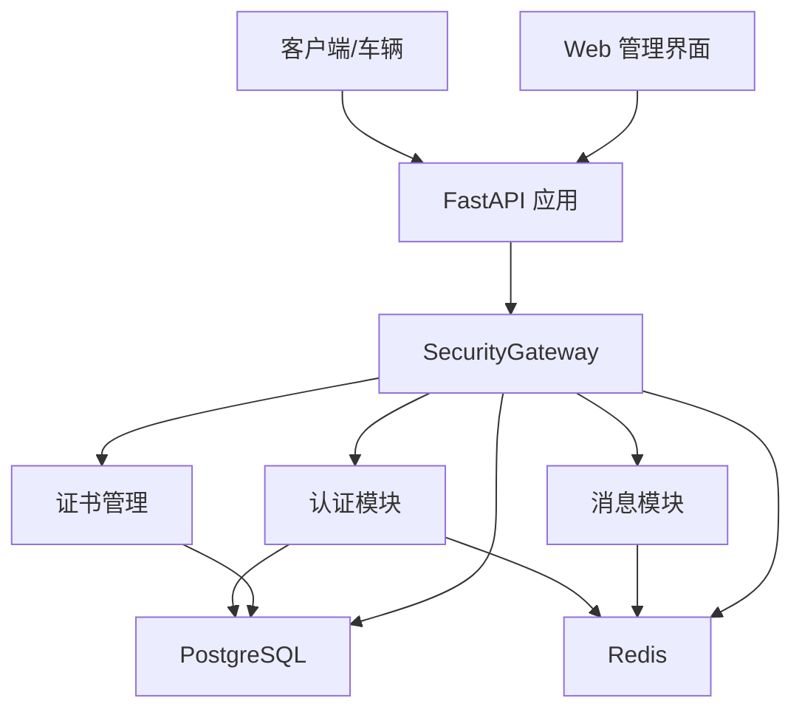
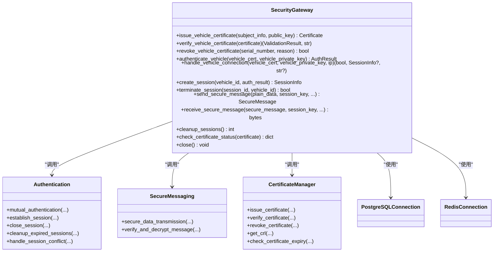
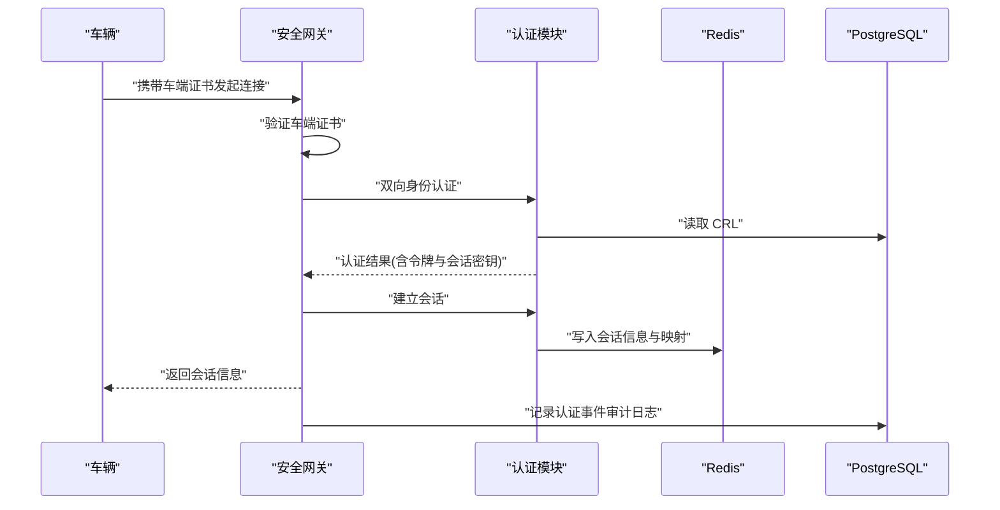
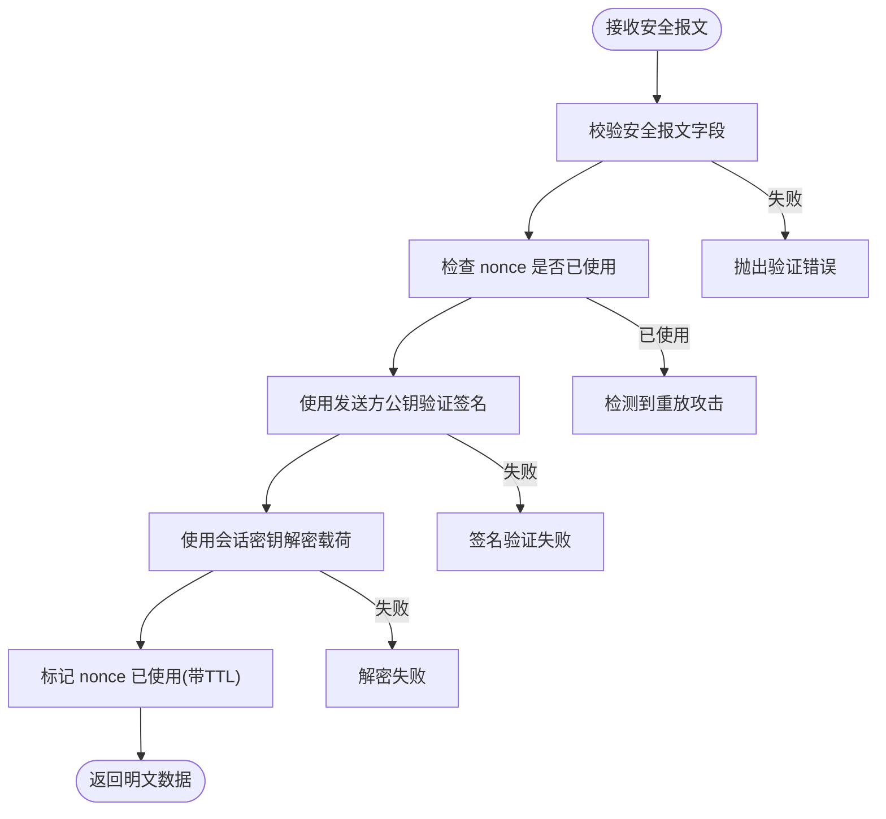
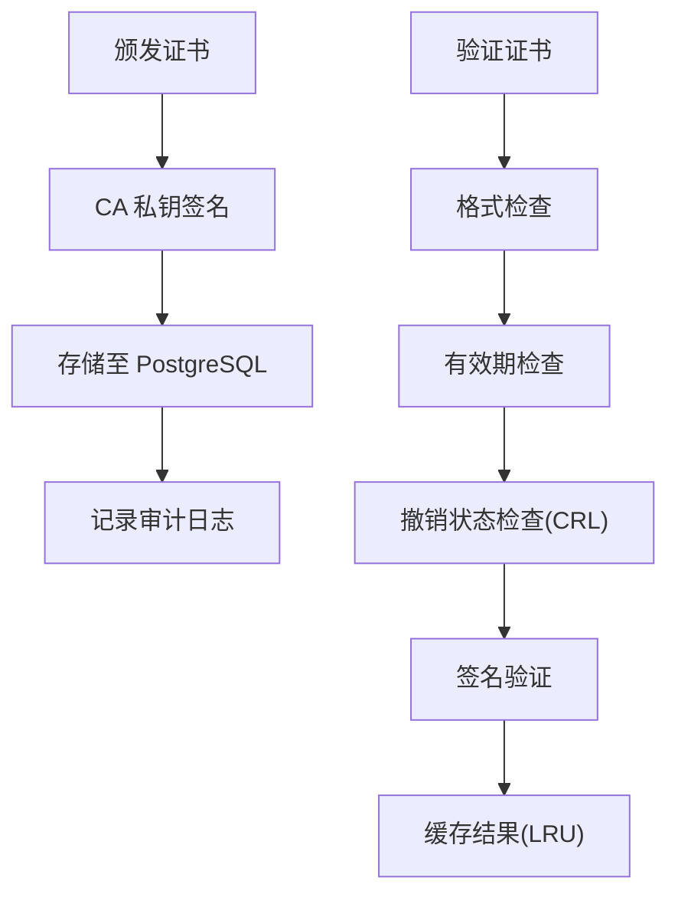
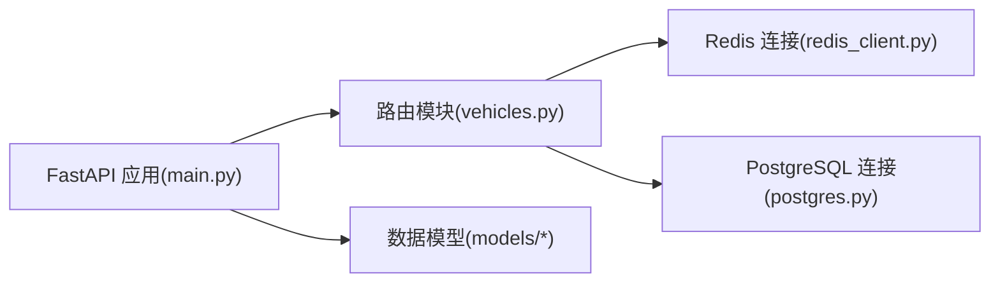
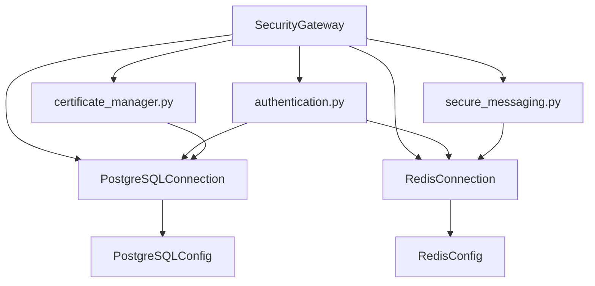

# 架构设计

<cite>
**本文引用的文件**
- [README.md](file://README.md)
- [security_gateway.py](file://src/security_gateway.py)
- [authentication.py](file://src/authentication.py)
- [secure_messaging.py](file://src/secure_messaging.py)
- [certificate_manager.py](file://src/certificate_manager.py)
- [postgres.py](file://src/db/postgres.py)
- [redis_client.py](file://src/db/redis_client.py)
- [database.py](file://config/database.py)
- [main.py](file://src/api/main.py)
- [vehicles.py](file://src/api/routes/vehicles.py)
- [certificate.py](file://src/models/certificate.py)
- [session.py](file://src/models/session.py)
- [gateway-deployment.yaml](file://deployment/kubernetes/gateway-deployment.yaml)
- [Dockerfile](file://Dockerfile)
</cite>

## 目录
1. [引言](#引言)
2. [项目结构](#项目结构)
3. [核心组件](#核心组件)
4. [架构总览](#架构总览)
5. [详细组件分析](#详细组件分析)
6. [依赖分析](#依赖分析)
7. [性能考量](#性能考量)
8. [故障排查指南](#故障排查指南)
9. [结论](#结论)
10. [附录](#附录)

## 引言
本项目为“车联网安全通信网关系统”，采用国密算法（SM2/SM4）实现端到端安全通信，提供证书管理、双向身份认证、会话管理、安全报文传输与审计日志能力。本文档面向架构师与高级开发者，系统阐述整体架构模式、分层设计、模块化组织、核心组件交互与数据流、技术选型与权衡、系统边界与外部依赖、以及部署拓扑与基础设施要求。

## 项目结构
项目采用按职责分层与模块化组织相结合的方式：
- config 层：集中管理数据库与缓存配置
- src 层：核心业务逻辑，包含 API、安全网关、认证、消息、证书、模型、数据库适配、审计、密钥存储等子模块
- db 层：数据库迁移脚本与初始化数据
- deployment/kubernetes：Kubernetes 部署清单
- web：前端管理界面（与后端 API 协同）
- scripts/docs/examples/tests：辅助工具、文档、示例与测试

```mermaid
graph TB
subgraph "应用层"
API["API 网关<br/>FastAPI"]
Web["Web 管理界面"]
end
subgraph "业务层"
SG["安全网关<br/>SecurityGateway"]
Auth["认证模块<br/>authentication.py"]
Msg["消息模块<br/>secure_messaging.py"]
Cert["证书管理<br/>certificate_manager.py"]
end
subgraph "数据与缓存"
PG["PostgreSQL"]
RD["Redis"]
end
subgraph "配置与运行"
CFG["配置模块<br/>config/database.py"]
DK["Docker 镜像"]
K8S["Kubernetes 部署"]
end
API --> SG
Web --> API
SG --> Auth
SG --> Msg
SG --> Cert
SG --> PG
SG --> RD
Auth --> PG
Auth --> RD
Msg --> RD
Cert --> PG
CFG --> PG
CFG --> RD
DK --> API
K8S --> DK
```

图表来源
- [main.py:13-34](file://src/api/main.py#L13-L34)
- [security_gateway.py:37-128](file://src/security_gateway.py#L37-L128)
- [authentication.py:16-21](file://src/authentication.py#L16-L21)
- [secure_messaging.py:13-14](file://src/secure_messaging.py#L13-L14)
- [certificate_manager.py:14-17](file://src/certificate_manager.py#L14-L17)
- [postgres.py:9-31](file://src/db/postgres.py#L9-L31)
- [redis_client.py:8-30](file://src/db/redis_client.py#L8-L30)
- [database.py:8-50](file://config/database.py#L8-L50)
- [Dockerfile:1-35](file://Dockerfile#L1-L35)
- [gateway-deployment.yaml:1-132](file://deployment/kubernetes/gateway-deployment.yaml#L1-L132)

章节来源
- [README.md:1-148](file://README.md#L1-L148)

## 核心组件
- 安全网关（SecurityGateway）：作为中央协调器，编排证书管理、身份认证、会话管理与安全报文传输，统一接入审计日志与密钥存储。
- 认证模块（authentication.py）：实现车云双向身份认证、会话建立与关闭、冲突处理与过期清理。
- 消息模块（secure_messaging.py）：实现安全报文的加密、签名、验证与解密，支持防重放攻击。
- 证书管理（certificate_manager.py）：实现证书颁发、验证、撤销与 CRL 管理，支持缓存加速与审计记录。
- 数据库适配（postgres.py）：封装 PostgreSQL 连接、查询与更新。
- 缓存适配（redis_client.py）：封装 Redis 连接、键值操作与扫描。
- 配置模块（database.py）：提供 PostgreSQL 与 Redis 的配置加载。
- API 网关（main.py + routes）：提供 RESTful 接口，承载车辆状态监控、安全指标、证书管理、审计日志查询与配置管理。

章节来源
- [security_gateway.py:37-128](file://src/security_gateway.py#L37-L128)
- [authentication.py:196-364](file://src/authentication.py#L196-L364)
- [secure_messaging.py:17-142](file://src/secure_messaging.py#L17-L142)
- [certificate_manager.py:597-734](file://src/certificate_manager.py#L597-L734)
- [postgres.py:9-53](file://src/db/postgres.py#L9-L53)
- [redis_client.py:8-79](file://src/db/redis_client.py#L8-L79)
- [database.py:8-50](file://config/database.py#L8-L50)
- [main.py:13-108](file://src/api/main.py#L13-L108)
- [vehicles.py:38-238](file://src/api/routes/vehicles.py#L38-L238)

## 架构总览
系统采用分层架构与微服务思想结合的模块化组织：
- 表现层：Web 管理界面与 API 网关
- 控制层：API 路由与安全网关协调
- 业务层：认证、消息、证书管理三大域
- 数据与缓存层：PostgreSQL 与 Redis
- 配置与运行：Docker 容器化与 Kubernetes 编排

图表来源
- [main.py:13-108](file://src/api/main.py#L13-L108)
- [security_gateway.py:37-128](file://src/security_gateway.py#L37-L128)
- [authentication.py:196-364](file://src/authentication.py#L196-L364)
- [secure_messaging.py:17-142](file://src/secure_messaging.py#L17-L142)
- [certificate_manager.py:597-734](file://src/certificate_manager.py#L597-L734)
- [postgres.py:9-53](file://src/db/postgres.py#L9-L53)
- [redis_client.py:8-79](file://src/db/redis_client.py#L8-L79)

## 详细组件分析

### 安全网关（SecurityGateway）作为中央协调器
- 职责边界：聚合证书管理、认证、会话与消息模块；统一审计日志；密钥安全存储；数据库与缓存连接管理。
- 关键流程：
  - 车辆接入：证书验证 → 双向认证 → 建立会话 → 审计记录
  - 数据传输：发送/接收安全报文 → 防重放与签名验证 → 审计记录
  - 会话生命周期：建立、冲突处理、过期清理、关闭与密钥安全清除
- 安全增强：支持安全密钥存储与自动轮换；敏感密钥不落地内存；审计日志覆盖认证、数据传输、证书操作等关键事件。

图表来源
- [security_gateway.py:37-800](file://src/security_gateway.py#L37-L800)
- [authentication.py:196-662](file://src/authentication.py#L196-L662)
- [secure_messaging.py:17-249](file://src/secure_messaging.py#L17-L249)
- [certificate_manager.py:597-734](file://src/certificate_manager.py#L597-L734)
- [postgres.py:9-53](file://src/db/postgres.py#L9-L53)
- [redis_client.py:8-79](file://src/db/redis_client.py#L8-L79)

章节来源
- [security_gateway.py:37-800](file://src/security_gateway.py#L37-L800)

### 认证与会话管理
- 双向身份认证：基于 SM2 的挑战-响应，确保车端与网关相互验证；生成带权限与有效期的认证令牌；派生 SM4 会话密钥。
- 会话管理：Redis 存储会话信息与车辆到会话映射；支持会话冲突处理（拒绝新会话或终止旧会话）；会话过期清理；密钥安全存储与轮换。
- 审计：认证成功/失败、会话建立/关闭、清理事件均记录审计日志。

图表来源
- [security_gateway.py:353-438](file://src/security_gateway.py#L353-L438)
- [authentication.py:196-481](file://src/authentication.py#L196-L481)
- [redis_client.py:31-71](file://src/db/redis_client.py#L31-L71)
- [postgres.py:32-45](file://src/db/postgres.py#L32-L45)

章节来源
- [authentication.py:196-662](file://src/authentication.py#L196-L662)
- [redis_client.py:8-79](file://src/db/redis_client.py#L8-L79)
- [postgres.py:9-53](file://src/db/postgres.py#L9-L53)

### 安全报文传输与防重放
- 发送流程：生成随机 nonce 与时间戳；SM4 加密业务数据；SM2 对消息头、载荷、时间戳与 nonce 的拼接进行签名；返回安全报文。
- 接收流程：验证时间戳窗口；检查 nonce 是否已使用（Redis 标记 TTL）；使用发送方公钥验证签名；SM4 解密载荷；标记 nonce 已使用。
- 审计：记录数据传输事件，区分加密/明文状态与大小。

图表来源
- [secure_messaging.py:144-249](file://src/secure_messaging.py#L144-L249)
- [redis_client.py:31-71](file://src/db/redis_client.py#L31-L71)

章节来源
- [secure_messaging.py:17-249](file://src/secure_messaging.py#L17-L249)
- [redis_client.py:8-79](file://src/db/redis_client.py#L8-L79)

### 证书管理与 CRL
- 颁发：生成唯一序列号；构造证书主体与扩展；使用 CA 私钥签名；持久化至数据库；记录审计日志。
- 验证：格式检查、有效期、撤销状态、签名验证；支持 LRU 缓存加速；缓存失效与撤销联动。
- 撤销：写入 CRL 并记录审计日志；缓存失效；支持状态检查。

图表来源
- [certificate_manager.py:597-734](file://src/certificate_manager.py#L597-L734)
- [postgres.py:92-124](file://src/db/postgres.py#L92-L124)

章节来源
- [certificate_manager.py:206-332](file://src/certificate_manager.py#L206-L332)
- [postgres.py:92-124](file://src/db/postgres.py#L92-L124)

### API 与数据模型
- API：基于 FastAPI 提供 RESTful 接口，包含车辆状态监控、安全指标、证书管理、审计日志查询与配置管理；内置简单 Bearer Token 认证。
- 数据模型：证书、会话、消息、审计事件与枚举类型，确保跨模块一致的数据契约。

图表来源
- [main.py:13-108](file://src/api/main.py#L13-L108)
- [vehicles.py:38-238](file://src/api/routes/vehicles.py#L38-L238)
- [redis_client.py:8-79](file://src/db/redis_client.py#L8-L79)
- [postgres.py:9-53](file://src/db/postgres.py#L9-L53)
- [certificate.py:54-108](file://src/models/certificate.py#L54-L108)
- [session.py:38-104](file://src/models/session.py#L38-L104)

章节来源
- [main.py:13-108](file://src/api/main.py#L13-L108)
- [vehicles.py:38-447](file://src/api/routes/vehicles.py#L38-L447)
- [certificate.py:54-108](file://src/models/certificate.py#L54-L108)
- [session.py:38-104](file://src/models/session.py#L38-L104)

## 依赖分析
- 组件耦合与内聚：SecurityGateway 作为高内聚协调者，低耦合地依赖各子模块；认证、消息、证书管理相对独立，通过统一接口与共享的数据库/缓存连接协作。
- 外部依赖：PostgreSQL（证书与审计日志）、Redis（会话与缓存/防重放）、GmSSL（SM2/SM4 算法库）、FastAPI（API 框架）、psycopg2/redis-py（数据库驱动）。
- 配置注入：通过 config/database.py 从环境变量加载数据库与缓存配置，便于容器化与多环境部署。

图表来源
- [security_gateway.py:37-128](file://src/security_gateway.py#L37-L128)
- [authentication.py:16-21](file://src/authentication.py#L16-L21)
- [secure_messaging.py:13-14](file://src/secure_messaging.py#L13-L14)
- [certificate_manager.py:14-17](file://src/certificate_manager.py#L14-L17)
- [postgres.py:9-31](file://src/db/postgres.py#L9-L31)
- [redis_client.py:8-30](file://src/db/redis_client.py#L8-L30)
- [database.py:8-50](file://config/database.py#L8-L50)

章节来源
- [database.py:8-50](file://config/database.py#L8-L50)
- [postgres.py:9-53](file://src/db/postgres.py#L9-L53)
- [redis_client.py:8-79](file://src/db/redis_client.py#L8-L79)

## 性能考量
- 缓存策略：证书验证采用 LRU 缓存（容量与 TTL 可配置），显著降低重复验证开销。
- 防重放：nonce 使用 Redis 标记并设置 TTL，避免重复请求与内存膨胀。
- 会话存储：Redis 以键值形式存储会话，支持快速查找与过期自动清理。
- 数据库：PostgreSQL 仅用于持久化证书与审计日志，查询接口通过索引与视图优化（如最新车辆数据视图）。
- 并发与伸缩：Kubernetes 部署支持副本水平扩展，配合健康检查与就绪探针保障流量接入稳定性。

## 故障排查指南
- 认证失败：检查证书有效期、撤销状态与签名；确认 CRL 获取与缓存；查看审计日志定位具体失败阶段。
- 会话异常：核对 Redis 连接与键空间；检查会话冲突策略与过期时间；确认密钥安全存储是否正常轮换。
- 数据传输错误：验证时间戳窗口与 nonce 使用；检查会话密钥一致性；确认发送方公钥与签名验证。
- API 访问：确认 Bearer Token 配置；检查容器健康状态与端口暴露；核对 Kubernetes 服务与负载均衡。

章节来源
- [security_gateway.py:610-721](file://src/security_gateway.py#L610-L721)
- [authentication.py:554-662](file://src/authentication.py#L554-L662)
- [secure_messaging.py:144-249](file://src/secure_messaging.py#L144-L249)
- [vehicles.py:38-238](file://src/api/routes/vehicles.py#L38-L238)
- [gateway-deployment.yaml:97-118](file://deployment/kubernetes/gateway-deployment.yaml#L97-L118)

## 结论
本系统以 SecurityGateway 为核心，围绕证书管理、双向认证、会话与安全报文传输构建了完整的车联网安全通信闭环。通过分层架构与模块化组织，结合 PostgreSQL 与 Redis 的可靠存储，以及容器化与 Kubernetes 的弹性部署，满足高安全性、可观测性与可扩展性的工程目标。技术选型（GmSSL、FastAPI、psycopg2/redis-py）与实现细节（防重放、审计日志、密钥轮换）体现了对国密合规与工业级安全的重视。

## 附录

### 系统边界与外部依赖
- 内部边界：API 网关、安全网关、认证、消息、证书管理、数据库与缓存。
- 外部系统：PostgreSQL、Redis、GmSSL（算法库）、浏览器/移动客户端（Web 管理界面）。

章节来源
- [postgres.py:9-53](file://src/db/postgres.py#L9-L53)
- [redis_client.py:8-79](file://src/db/redis_client.py#L8-L79)
- [README.md:122-139](file://README.md#L122-L139)

### 部署拓扑与基础设施要求
- 容器镜像：基于 Python 3.11 slim，安装必要系统依赖，暴露 8000 端口，内置健康检查。
- Kubernetes：部署副本数 3，Service 类型为 LoadBalancer，挂载日志卷；通过 ConfigMap 与 Secret 注入数据库与缓存配置及密钥。
- 健康检查：HTTP GET /health，探针间隔与超时可配置。

章节来源
- [Dockerfile:1-35](file://Dockerfile#L1-L35)
- [gateway-deployment.yaml:1-132](file://deployment/kubernetes/gateway-deployment.yaml#L1-L132)