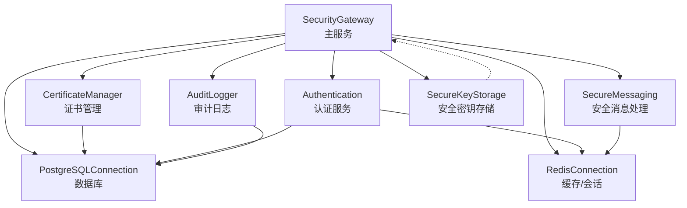
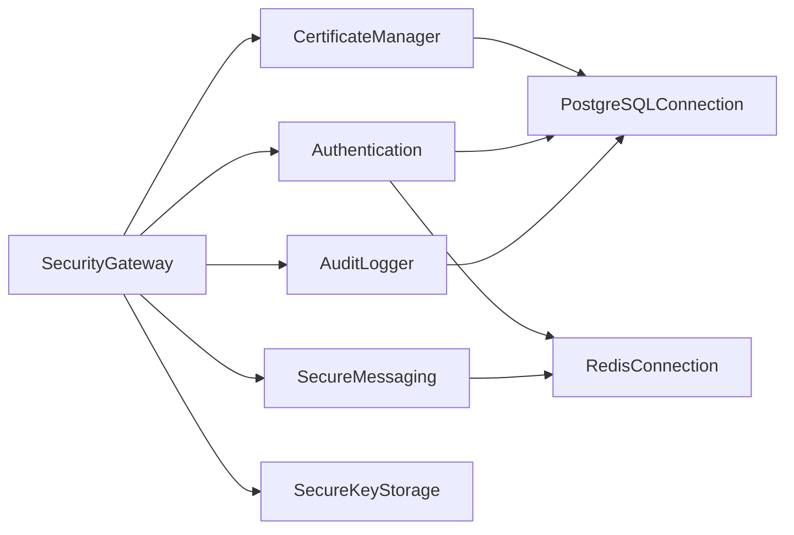
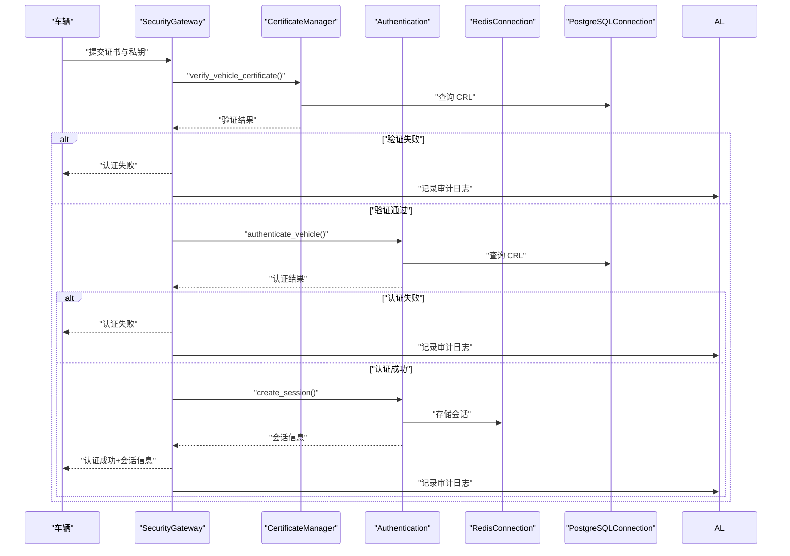
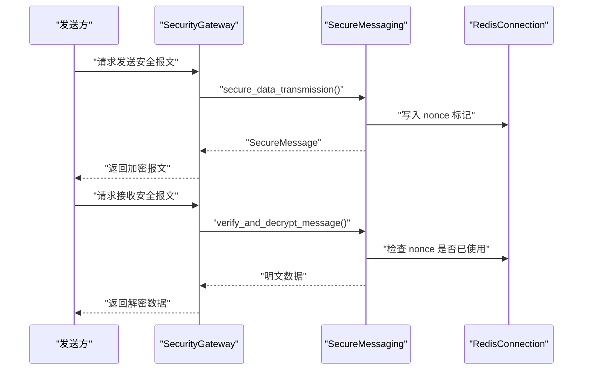

# 组件交互关系

<cite>
**本文档引用的文件**
- [security_gateway.py](file://src/security_gateway.py)
- [certificate_manager.py](file://src/certificate_manager.py)
- [authentication.py](file://src/authentication.py)
- [secure_messaging.py](file://src/secure_messaging.py)
- [audit_logger.py](file://src/audit_logger.py)
- [models/__init__.py](file://src/models/__init__.py)
- [models/certificate.py](file://src/models/certificate.py)
- [models/session.py](file://src/models/session.py)
- [models/message.py](file://src/models/message.py)
- [models/audit.py](file://src/models/audit.py)
- [config/database.py](file://config/database.py)
- [db/postgres.py](file://src/db/postgres.py)
- [db/redis_client.py](file://src/db/redis_client.py)
- [secure_key_storage.py](file://src/secure_key_storage.py)
- [test_security_gateway.py](file://tests/test_security_gateway.py)
- [security_gateway_demo.py](file://examples/security_gateway_demo.py)
</cite>

## 目录
1. [简介](#简介)
2. [项目结构](#项目结构)
3. [核心组件](#核心组件)
4. [架构总览](#架构总览)
5. [详细组件分析](#详细组件分析)
6. [依赖关系分析](#依赖关系分析)
7. [性能考量](#性能考量)
8. [故障排查指南](#故障排查指南)
9. [结论](#结论)
10. [附录](#附录)

## 简介
本文件聚焦车联网安全通信网关系统中 SecurityGateway 主服务与其子模块（证书管理器、认证服务、安全消息处理、审计日志、密钥存储、数据库与缓存）之间的组件交互关系。文档从架构、数据流、处理逻辑、接口设计、依赖注入模式、消息协议与错误处理策略、时序与调用链路、解耦与接口抽象、生命周期与资源协调等方面进行全面阐述，并提供系统集成与扩展的设计指导。

## 项目结构
系统采用分层与模块化组织方式，核心位于 src 目录，包含：
- 安全网关主服务：src/security_gateway.py
- 子模块：证书管理、认证、安全消息、审计日志、密钥存储
- 数据模型：src/models 下的证书、会话、消息、审计日志等
- 数据访问：PostgreSQL 与 Redis 连接封装
- 配置：config/database.py
- 示例与测试：examples 与 tests

图表来源
- [security_gateway.py:37-800](file://src/security_gateway.py#L37-L800)
- [certificate_manager.py:1-734](file://src/certificate_manager.py#L1-L734)
- [authentication.py:1-662](file://src/authentication.py#L1-L662)
- [secure_messaging.py:1-249](file://src/secure_messaging.py#L1-L249)
- [audit_logger.py:1-480](file://src/audit_logger.py#L1-L480)
- [secure_key_storage.py:1-380](file://src/secure_key_storage.py#L1-L380)
- [db/postgres.py:1-53](file://src/db/postgres.py#L1-L53)
- [db/redis_client.py:1-79](file://src/db/redis_client.py#L1-L79)

章节来源
- [security_gateway.py:37-800](file://src/security_gateway.py#L37-L800)
- [config/database.py:1-50](file://config/database.py#L1-L50)

## 核心组件
- SecurityGateway：主服务，负责密钥与证书的生命周期、认证、会话、安全消息、审计日志与资源关闭。
- CertificateManager：证书颁发、验证、撤销、CRL 获取与状态检查。
- Authentication：车云双向认证、会话建立/关闭、过期清理、冲突处理。
- SecureMessaging：安全报文加密传输、签名验证、解密与防重放。
- AuditLogger：统一审计日志记录、查询与导出。
- SecureKeyStorage：模拟 HSM 的密钥安全存储、轮换与清除。
- PostgreSQLConnection/RedisConnection：数据库与缓存访问封装。
- 数据模型：证书、会话、消息、审计日志、枚举类型。

章节来源
- [models/__init__.py:1-25](file://src/models/__init__.py#L1-L25)
- [models/certificate.py:1-108](file://src/models/certificate.py#L1-L108)
- [models/session.py:1-104](file://src/models/session.py#L1-L104)
- [models/message.py:1-200](file://src/models/message.py#L1-L200)
- [models/audit.py:1-56](file://src/models/audit.py#L1-L56)

## 架构总览
SecurityGateway 作为编排者，通过显式参数注入各子模块能力；同时内部持有数据库与缓存连接，以及审计日志记录器。密钥管理通过安全存储模块实现，避免明文密钥驻留内存。

```mermaid
classDiagram
class SecurityGateway {
+issue_vehicle_certificate(subject_info, public_key) Certificate
+verify_vehicle_certificate(certificate) (ValidationResult, str)
+revoke_vehicle_certificate(serial, reason) bool
+authenticate_vehicle(vehicle_cert, vehicle_private_key) AuthResult
+handle_vehicle_connection(vehicle_cert, vehicle_private_key, ip) (bool, SessionInfo?, str?)
+create_session(vehicle_id, auth_result) SessionInfo
+terminate_session(session_id, vehicle_id) bool
+send_secure_message(plain_data, session_key, sender_id, receiver_id, session_id, type) SecureMessage
+receive_secure_message(secure_message, session_key, sender_public_key, sender_id) bytes
+cleanup_sessions() int
+check_certificate_status(certificate) dict
+close() void
}
class CertificateManager {
+issue_certificate(subject_info, public_key, ca_private_key, ca_public_key, db_conn) Certificate
+verify_certificate(certificate, ca_public_key, crl_list, db_conn, use_cache) (ValidationResult, str)
+revoke_certificate(serial_number, reason, db_conn) bool
+get_crl(db_conn) list
+check_certificate_expiry(cert) dict
}
class Authentication {
+mutual_authentication(vehicle_cert, gateway_cert, vehicle_private_key, gateway_private_key, ca_public_key, db_conn) AuthResult
+establish_session(vehicle_id, auth_token, redis_conn, use_secure_storage) SessionInfo
+close_session(session_id, redis_conn, use_secure_storage) bool
+cleanup_expired_sessions(redis_conn) int
+handle_session_conflict(vehicle_id, strategy, redis_conn) (bool, str)
}
class SecureMessaging {
+secure_data_transmission(plain_data, session_key, sender_private_key, receiver_public_key, sender_id, receiver_id, session_id, type) SecureMessage
+verify_and_decrypt_message(secure_message, session_key, sender_public_key, redis_config) bytes
}
class AuditLogger {
+log_auth_event(vehicle_id, event_type, result, ip, details) str
+log_data_transfer(vehicle_id, data_size, encrypted, ip, details) str
+log_certificate_operation(operation, cert_id, vehicle_id, ip, details) str
+query_audit_logs(start, end, vehicle_id, event_type, op_result) List[AuditLog]
+export_audit_report(start, end, format) str
}
class SecureKeyStorage {
+store_ca_private_key(key_id, private_key, rotation_interval_hours) bool
+store_session_key(session_id, session_key, rotation_interval_hours) bool
+retrieve_key(key_id) bytes?
+secure_clear_key(key_id) bool
+start_automatic_rotation() void
+stop_automatic_rotation() void
}
class PostgreSQLConnection
class RedisConnection
SecurityGateway --> CertificateManager : "调用"
SecurityGateway --> Authentication : "调用"
SecurityGateway --> SecureMessaging : "调用"
SecurityGateway --> AuditLogger : "使用"
SecurityGateway --> SecureKeyStorage : "使用"
SecurityGateway --> PostgreSQLConnection : "持有"
SecurityGateway --> RedisConnection : "持有"
CertificateManager --> PostgreSQLConnection : "使用"
Authentication --> PostgreSQLConnection : "使用"
Authentication --> RedisConnection : "使用"
SecureMessaging --> RedisConnection : "使用"
```

图表来源
- [security_gateway.py:37-800](file://src/security_gateway.py#L37-L800)
- [certificate_manager.py:1-734](file://src/certificate_manager.py#L1-L734)
- [authentication.py:1-662](file://src/authentication.py#L1-L662)
- [secure_messaging.py:1-249](file://src/secure_messaging.py#L1-L249)
- [audit_logger.py:1-480](file://src/audit_logger.py#L1-L480)
- [secure_key_storage.py:1-380](file://src/secure_key_storage.py#L1-L380)
- [db/postgres.py:1-53](file://src/db/postgres.py#L1-L53)
- [db/redis_client.py:1-79](file://src/db/redis_client.py#L1-L79)

## 详细组件分析

### SecurityGateway 主服务
- 依赖注入与资源管理
  - 通过构造函数注入 CA/gateway 密钥与证书、数据库与缓存配置；内部创建数据库与缓存连接；初始化审计日志记录器。
  - 支持安全密钥存储开关，启用时将 CA 私钥与网关私钥写入安全存储，会话密钥同样写入安全存储并在会话关闭时安全清除。
- 核心流程
  - 证书管理：颁发、验证、撤销、状态检查。
  - 认证与会话：双向认证、会话建立、关闭、清理。
  - 安全消息：发送与接收，包含签名验证、解密与防重放。
  - 审计日志：在关键节点记录认证、数据传输、证书操作事件。
  - 生命周期：上下文管理器入口/出口，确保资源释放。

章节来源
- [security_gateway.py:46-128](file://src/security_gateway.py#L46-L128)
- [security_gateway.py:129-181](file://src/security_gateway.py#L129-L181)
- [security_gateway.py:182-246](file://src/security_gateway.py#L182-L246)
- [security_gateway.py:247-288](file://src/security_gateway.py#L247-L288)
- [security_gateway.py:289-438](file://src/security_gateway.py#L289-L438)
- [security_gateway.py:440-496](file://src/security_gateway.py#L440-L496)
- [security_gateway.py:498-542](file://src/security_gateway.py#L498-L542)
- [security_gateway.py:543-602](file://src/security_gateway.py#L543-L602)
- [security_gateway.py:603-721](file://src/security_gateway.py#L603-L721)
- [security_gateway.py:722-752](file://src/security_gateway.py#L722-L752)
- [security_gateway.py:770-800](file://src/security_gateway.py#L770-L800)

### 证书管理器（CertificateManager）
- 功能边界
  - 颁发：生成唯一序列号、构造证书主体与扩展、SM2 签名、入库、审计记录。
  - 验证：格式校验、有效期、撤销列表、签名验证、证书链（单层）。
  - 撤销：CRL 写入、审计记录、缓存失效。
  - CRL 获取与证书状态检查。
- 错误处理
  - 输入参数校验失败抛出 ValueError；数据库异常包装为 RuntimeError；缓存命中策略提升性能。
- 与数据库交互
  - 使用 PostgreSQLConnection 执行查询与更新。

章节来源
- [certificate_manager.py:24-36](file://src/certificate_manager.py#L24-L36)
- [certificate_manager.py:597-734](file://src/certificate_manager.py#L597-L734)
- [certificate_manager.py:206-332](file://src/certificate_manager.py#L206-L332)
- [certificate_manager.py:334-431](file://src/certificate_manager.py#L334-L431)
- [certificate_manager.py:432-471](file://src/certificate_manager.py#L432-L471)
- [certificate_manager.py:520-595](file://src/certificate_manager.py#L520-L595)

### 认证服务（Authentication）
- 双向认证流程
  - 车端证书验证 → 网关证书验证 → 车端对挑战签名 → 网关验证车端签名 → 生成会话密钥与令牌。
- 会话管理
  - 建立会话：生成 sessionId、SM4 会话密钥、写入 Redis、维护车辆到会话映射。
  - 关闭会话：删除会话键与映射，安全清除会话密钥。
  - 冲突处理：基于车辆 ID 的会话冲突策略（拒绝新会话或终止旧会话）。
  - 过期清理：提供扫描与统计接口（Redis TTL 自动清理为主）。
- 错误处理
  - 参数长度校验、令牌过期检查、签名验证失败、挑战响应失败等。

章节来源
- [authentication.py:196-364](file://src/authentication.py#L196-L364)
- [authentication.py:366-481](file://src/authentication.py#L366-L481)
- [authentication.py:483-552](file://src/authentication.py#L483-L552)
- [authentication.py:554-597](file://src/authentication.py#L554-L597)
- [authentication.py:599-662](file://src/authentication.py#L599-L662)

### 安全消息处理（SecureMessaging）
- 发送流程
  - 生成随机 nonce 与时间戳，SM4 加密业务数据，SM2 签名完整报文，封装为 SecureMessage。
- 接收流程
  - 验证时间戳与 nonce（防重放）、签名验证、SM4 解密、标记 nonce 已使用。
- 错误处理
  - 签名验证失败、Nonce 已使用、时间戳过期、解密失败等分类处理并记录审计日志。

章节来源
- [secure_messaging.py:17-142](file://src/secure_messaging.py#L17-L142)
- [secure_messaging.py:144-249](file://src/secure_messaging.py#L144-L249)

### 审计日志（AuditLogger）
- 记录类型
  - 认证事件、数据传输、证书操作。
- 查询与导出
  - 支持按时间、车辆、事件类型、结果过滤；支持 JSON/CSV 导出。
- 容错
  - 持久化失败不阻断主流程，记录错误日志。

章节来源
- [audit_logger.py:90-136](file://src/audit_logger.py#L90-L136)
- [audit_logger.py:137-184](file://src/audit_logger.py#L137-L184)
- [audit_logger.py:185-242](file://src/audit_logger.py#L185-L242)
- [audit_logger.py:243-336](file://src/audit_logger.py#L243-L336)
- [audit_logger.py:337-466](file://src/audit_logger.py#L337-L466)

### 安全密钥存储（SecureKeyStorage）
- 能力
  - CA 私钥与会话密钥存储、检索、安全清除、自动轮换。
- 线程与轮换
  - 后台线程周期检查并轮换密钥，支持停止轮换。
- 生产建议
  - 概念演示，生产应对接 HSM/TPM。

章节来源
- [secure_key_storage.py:46-124](file://src/secure_key_storage.py#L46-L124)
- [secure_key_storage.py:139-175](file://src/secure_key_storage.py#L139-L175)
- [secure_key_storage.py:234-314](file://src/secure_key_storage.py#L234-L314)

### 数据模型与接口抽象
- 数据模型
  - 证书、会话、消息、审计日志均采用 dataclass，提供 to_dict/from_dict 序列化与验证辅助方法。
- 接口抽象
  - 通过枚举（EventType、ValidationResult、MessageType、SessionStatus、ErrorCode）统一事件与状态表达。

章节来源
- [models/certificate.py:8-108](file://src/models/certificate.py#L8-L108)
- [models/session.py:9-104](file://src/models/session.py#L9-L104)
- [models/message.py:9-200](file://src/models/message.py#L9-L200)
- [models/audit.py:9-56](file://src/models/audit.py#L9-L56)
- [models/__init__.py:1-25](file://src/models/__init__.py#L1-L25)

## 依赖关系分析
- 组件耦合与内聚
  - SecurityGateway 与子模块为高内聚低耦合：通过函数调用与数据模型交互，未见循环依赖。
  - 数据访问层（PostgreSQL/Redis）以连接对象形式注入，便于替换与测试。
- 外部依赖
  - PostgreSQL 与 Redis 通过配置类加载环境变量，支持容器化部署。
- 潜在风险
  - 安全密钥存储为内存模拟，生产需对接硬件安全模块。

图表来源
- [security_gateway.py:8-34](file://src/security_gateway.py#L8-L34)
- [certificate_manager.py:14-17](file://src/certificate_manager.py#L14-L17)
- [authentication.py:17-20](file://src/authentication.py#L17-L20)
- [secure_messaging.py:13-14](file://src/secure_messaging.py#L13-L14)
- [audit_logger.py:22-23](file://src/audit_logger.py#L22-L23)
- [config/database.py:1-50](file://config/database.py#L1-L50)

章节来源
- [db/postgres.py:1-53](file://src/db/postgres.py#L1-L53)
- [db/redis_client.py:1-79](file://src/db/redis_client.py#L1-L79)

## 性能考量
- 缓存与索引
  - 证书验证使用 LRU 缓存（容量与 TTL 在证书管理器中定义），显著降低重复验证开销。
- 数据库与缓存
  - PostgreSQL 与 Redis 连接复用与连接池化（通过连接类封装）；Redis TTL 自动清理过期会话键。
- 密钥轮换
  - 后台线程定期轮换密钥，避免频繁轮换带来的抖动；轮换间隔可配置。

章节来源
- [certificate_manager.py:257-331](file://src/certificate_manager.py#L257-L331)
- [authentication.py:554-597](file://src/authentication.py#L554-L597)
- [secure_key_storage.py:234-288](file://src/secure_key_storage.py#L234-L288)

## 故障排查指南
- 证书相关
  - 颁发失败：检查 CA 私钥长度与签名算法；确认数据库连接可用。
  - 验证失败：检查证书有效期、撤销列表、签名；若数据库异常，考虑使用缓存 CRL。
- 认证与会话
  - 双向认证失败：检查挑战生成与签名验证流程；确认令牌未过期。
  - 会话冲突：根据策略选择拒绝新会话或终止旧会话。
- 安全消息
  - 签名验证失败/重放攻击：检查 nonce 与时间戳；确认 Redis 配置正确。
  - 解密失败：核对会话密钥与 SM4 密钥长度。
- 审计日志
  - 导出失败：检查时间范围与格式参数；确认数据库可查询。

章节来源
- [security_gateway.py:172-181](file://src/security_gateway.py#L172-L181)
- [security_gateway.py:226-246](file://src/security_gateway.py#L226-L246)
- [authentication.py:298-321](file://src/authentication.py#L298-L321)
- [secure_messaging.py:210-241](file://src/secure_messaging.py#L210-L241)
- [audit_logger.py:337-371](file://src/audit_logger.py#L337-L371)

## 结论
SecurityGateway 通过清晰的模块划分与依赖注入，实现了证书管理、认证、会话、安全消息与审计日志的协同工作。数据模型与接口抽象提升了可维护性；数据库与缓存访问封装增强了可移植性；安全密钥存储与自动轮换保障了密钥生命周期安全。整体设计满足车联网场景下的安全与可靠性要求，并为后续扩展提供了良好基础。

## 附录

### 组件交互时序图

#### 车辆接入与认证时序

图表来源
- [security_gateway.py:353-438](file://src/security_gateway.py#L353-L438)
- [certificate_manager.py:206-332](file://src/certificate_manager.py#L206-L332)
- [authentication.py:196-481](file://src/authentication.py#L196-L481)
- [db/postgres.py:32-45](file://src/db/postgres.py#L32-L45)
- [db/redis_client.py:31-49](file://src/db/redis_client.py#L31-L49)
- [audit_logger.py:90-136](file://src/audit_logger.py#L90-L136)

#### 安全消息发送与接收时序

图表来源
- [security_gateway.py:543-602](file://src/security_gateway.py#L543-L602)
- [security_gateway.py:603-721](file://src/security_gateway.py#L603-L721)
- [secure_messaging.py:17-142](file://src/secure_messaging.py#L17-L142)
- [secure_messaging.py:144-249](file://src/secure_messaging.py#L144-L249)
- [db/redis_client.py:46-49](file://src/db/redis_client.py#L46-L49)

### 组件解耦与接口抽象
- 解耦策略
  - 通过函数与类的职责分离，避免跨模块直接耦合；数据库与缓存通过连接对象注入。
  - 审计日志独立模块，面向接口而非具体实现。
- 接口抽象
  - 数据模型统一序列化/反序列化；枚举统一事件与状态；配置类统一环境变量加载。

章节来源
- [models/__init__.py:1-25](file://src/models/__init__.py#L1-L25)
- [config/database.py:1-50](file://config/database.py#L1-L50)

### 组件生命周期与资源协调
- 初始化
  - 构造函数中完成密钥安全存储初始化、数据库与缓存连接创建、审计日志记录器初始化。
- 运行期
  - 认证与会话管理、安全消息处理、审计日志记录。
- 关闭
  - 停止自动密钥轮换、关闭数据库与缓存连接、记录关闭事件。

章节来源
- [security_gateway.py:770-800](file://src/security_gateway.py#L770-L800)
- [secure_key_storage.py:251-256](file://src/secure_key_storage.py#L251-L256)

### 系统集成与扩展指导
- 集成要点
  - 使用配置类加载数据库与缓存参数；在容器化部署中通过环境变量注入。
  - 通过上下文管理器确保资源释放。
- 扩展建议
  - 新增模块遵循现有接口风格（数据模型 + 函数/类 + 审计日志）。
  - 安全密钥存储建议替换为 HSM/TPM 实现。
  - 性能优化可引入连接池与异步 I/O。

章节来源
- [config/database.py:17-50](file://config/database.py#L17-L50)
- [security_gateway_demo.py:1-186](file://examples/security_gateway_demo.py#L1-L186)
- [test_security_gateway.py:1-200](file://tests/test_security_gateway.py#L1-L200)