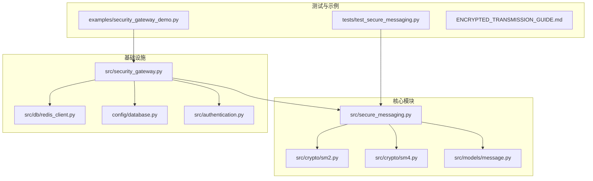
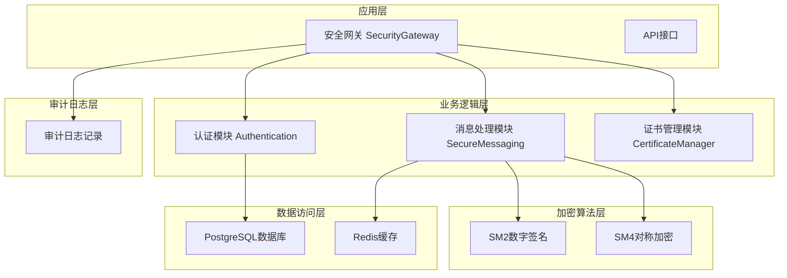
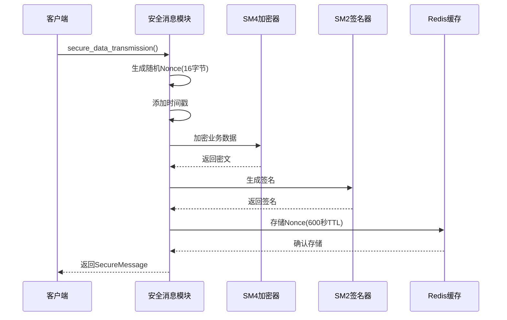
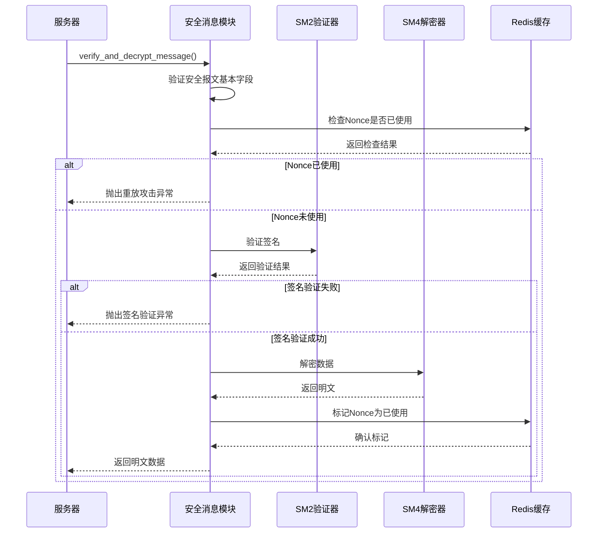
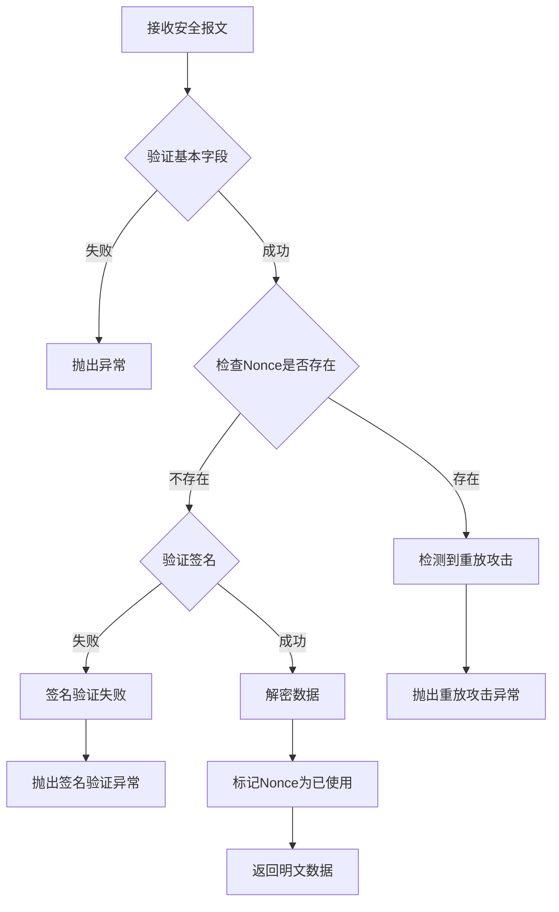
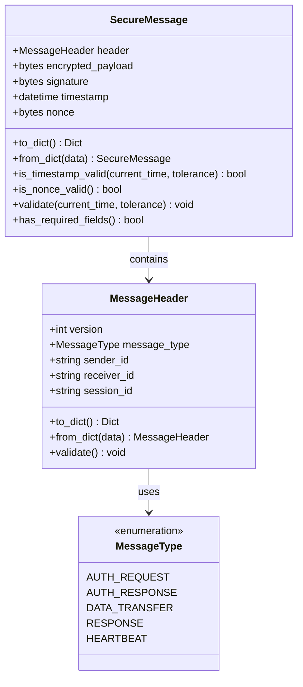
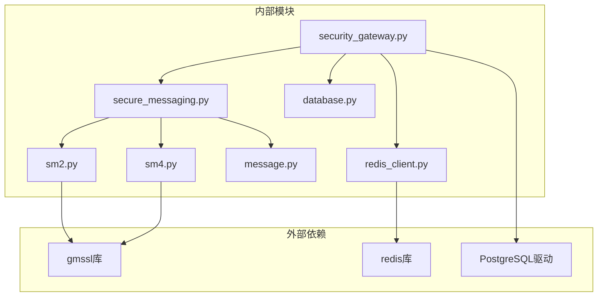

# 安全消息传输服务

<cite>
**本文档引用的文件**
- [secure_messaging.py](file://src/secure_messaging.py)
- [sm2.py](file://src/crypto/sm2.py)
- [sm4.py](file://src/crypto/sm4.py)
- [message.py](file://src/models/message.py)
- [security_gateway.py](file://src/security_gateway.py)
- [enums.py](file://src/models/enums.py)
- [redis_client.py](file://src/db/redis_client.py)
- [database.py](file://config/database.py)
- [authentication.py](file://src/authentication.py)
- [security_gateway_demo.py](file://examples/security_gateway_demo.py)
- [test_secure_messaging.py](file://tests/test_secure_messaging.py)
- [ENCRYPTED_TRANSMISSION_GUIDE.md](file://ENCRYPTED_TRANSMISSION_GUIDE.md)
</cite>

## 目录
1. [简介](#简介)
2. [项目结构](#项目结构)
3. [核心组件](#核心组件)
4. [架构概览](#架构概览)
5. [详细组件分析](#详细组件分析)
6. [依赖关系分析](#依赖关系分析)
7. [性能考虑](#性能考虑)
8. [故障排除指南](#故障排除指南)
9. [结论](#结论)
10. [附录](#附录)

## 简介

安全消息传输服务是一个基于中国国家密码标准（GM/T）的端到端加密通信系统，专门设计用于车联网场景中的安全数据传输。该系统实现了SM2/SM4算法组合，提供了完整的加密、解密、签名和验证功能，确保数据在传输过程中的机密性、完整性和不可否认性。

系统采用分层架构设计，包含安全网关、加密模块、消息模型、数据库连接和审计日志等多个组件，形成了一个完整的安全通信解决方案。

## 项目结构

该项目采用模块化的组织方式，主要目录结构如下：



**图表来源**
- [secure_messaging.py:1-249](file://src/secure_messaging.py#L1-L249)
- [sm2.py:1-265](file://src/crypto/sm2.py#L1-L265)
- [sm4.py:1-189](file://src/crypto/sm4.py#L1-L189)
- [message.py:1-200](file://src/models/message.py#L1-L200)

**章节来源**
- [secure_messaging.py:1-249](file://src/secure_messaging.py#L1-L249)
- [security_gateway.py:1-800](file://src/security_gateway.py#L1-L800)

## 核心组件

### 安全消息传输模块

安全消息传输模块是整个系统的核心，负责实现完整的加密通信流程。该模块提供了两个主要功能：

1. **secure_data_transmission**: 执行加密数据传输的完整流程
2. **verify_and_decrypt_message**: 验证并解密安全报文

### 加密算法模块

系统集成了两种核心加密算法：

- **SM2数字签名算法**: 基于椭圆曲线的公钥密码算法，用于数据签名和验证
- **SM4对称加密算法**: 国密标准的分组密码算法，用于数据加密

### 消息模型

消息模型定义了安全报文的数据结构，包括消息头、载荷、签名、时间戳和Nonce等字段。

**章节来源**
- [secure_messaging.py:17-142](file://src/secure_messaging.py#L17-L142)
- [sm2.py:135-204](file://src/crypto/sm2.py#L135-L204)
- [sm4.py:49-108](file://src/crypto/sm4.py#L49-L108)
- [message.py:80-200](file://src/models/message.py#L80-L200)

## 架构概览

系统采用分层架构设计，各层职责清晰分离：



**图表来源**
- [security_gateway.py:37-800](file://src/security_gateway.py#L37-L800)
- [secure_messaging.py:1-249](file://src/secure_messaging.py#L1-L249)
- [authentication.py:1-200](file://src/authentication.py#L1-L200)

## 详细组件分析

### 安全消息传输流程

系统实现了完整的端到端加密通信流程，包括加密、签名、验证和解密等步骤。

#### 加密流程（发送方）



**图表来源**
- [secure_messaging.py:17-142](file://src/secure_messaging.py#L17-L142)
- [sm4.py:49-108](file://src/crypto/sm4.py#L49-L108)
- [sm2.py:135-204](file://src/crypto/sm2.py#L135-L204)

#### 验证流程（接收方）



**图表来源**
- [secure_messaging.py:144-249](file://src/secure_messaging.py#L144-L249)
- [sm2.py:206-265](file://src/crypto/sm2.py#L206-L265)
- [sm4.py:111-189](file://src/crypto/sm4.py#L111-L189)

### 防重放攻击机制

系统实现了多层防重放攻击机制：



**图表来源**
- [secure_messaging.py:205-241](file://src/secure_messaging.py#L205-L241)
- [message.py:131-186](file://src/models/message.py#L131-L186)

### 错误处理机制

系统实现了完善的错误处理机制，能够识别和处理各种异常情况：

| 错误类型 | 触发条件 | 处理策略 | 审计记录 |
|---------|---------|---------|---------|
| 签名验证失败 | 签名数据不匹配或被篡改 | 抛出签名验证异常 | 记录SIGNATURE_FAILED事件 |
| 重放攻击检测 | Nonce已被使用 | 抛出重放攻击异常 | 记录AUTHENTICATION_FAILURE事件 |
| 解密失败 | 会话密钥错误或数据损坏 | 抛出解密失败异常 | 记录DATA_DECRYPTED事件 |
| 会话过期 | 时间戳超出容差范围 | 抛出会话过期异常 | 记录AUTHENTICATION_FAILURE事件 |
| 参数验证失败 | 输入参数不符合要求 | 抛出参数验证异常 | 记录相应审计事件 |

**章节来源**
- [secure_messaging.py:63-67](file://src/secure_messaging.py#L63-L67)
- [secure_messaging.py:181-186](file://src/secure_messaging.py#L181-L186)
- [security_gateway.py:648-720](file://src/security_gateway.py#L648-L720)

### 数据模型设计

系统使用数据类来定义消息结构，确保数据的完整性和一致性：



**图表来源**
- [message.py:9-77](file://src/models/message.py#L9-L77)
- [message.py:79-200](file://src/models/message.py#L79-L200)
- [enums.py:49-56](file://src/models/enums.py#L49-L56)

**章节来源**
- [message.py:1-200](file://src/models/message.py#L1-L200)
- [enums.py:1-56](file://src/models/enums.py#L1-L56)

## 依赖关系分析

系统采用松耦合的设计，各模块之间的依赖关系清晰明确：



**图表来源**
- [secure_messaging.py:1-15](file://src/secure_messaging.py#L1-L15)
- [sm2.py:8](file://src/crypto/sm2.py#L8)
- [sm4.py:8](file://src/crypto/sm4.py#L8)
- [redis_client.py:3](file://src/db/redis_client.py#L3)

### 核心依赖关系

1. **算法依赖**: SM2和SM4算法依赖于gmssl库实现
2. **缓存依赖**: Redis用于Nonce存储和会话管理
3. **数据库依赖**: PostgreSQL用于持久化存储
4. **配置依赖**: 环境变量驱动配置加载

**章节来源**
- [secure_messaging.py:11-14](file://src/secure_messaging.py#L11-L14)
- [redis_client.py:15-24](file://src/db/redis_client.py#L15-L24)
- [database.py:17-30](file://config/database.py#L17-L30)

## 性能考虑

### 加密性能指标

系统在性能方面进行了优化，以平衡安全性和效率：

- **SM4加密开销**: 每条消息约5-10毫秒
- **SM2签名开销**: 每条消息约10-15毫秒  
- **总延迟增加**: 每条消息约15-25毫秒
- **CPU使用率**: 增加约5-10%

### 优化建议

1. **批量处理**: 对于大量小消息，可以考虑批量处理以减少开销
2. **连接池**: 使用连接池管理数据库和Redis连接
3. **缓存策略**: 合理设置Nonce的TTL时间，平衡安全性和性能
4. **异步处理**: 对于非关键路径的操作，可以采用异步处理

### 内存管理

系统采用了内存友好的设计：

- **密钥管理**: 使用安全存储机制，避免明文密钥驻留内存
- **数据处理**: 采用流式处理，避免大对象的多次复制
- **连接管理**: 及时释放数据库和Redis连接

## 故障排除指南

### 常见问题及解决方案

#### 1. 签名验证失败

**症状**: 接收方抛出签名验证失败异常

**可能原因**:
- 发送方公钥不匹配
- 签名数据顺序不一致
- 数据在传输过程中被篡改

**解决步骤**:
1. 验证发送方公钥的正确性
2. 检查签名数据的拼接顺序
3. 确认网络传输的完整性

#### 2. 重放攻击检测

**症状**: 检测到重放攻击并抛出异常

**可能原因**:
- 客户端重复发送相同消息
- Redis中存在已使用的Nonce记录

**解决步骤**:
1. 确保每次发送使用新的Nonce
2. 检查Redis中Nonce的TTL设置
3. 验证时间戳的准确性

#### 3. 解密失败

**症状**: 解密过程中抛出异常

**可能原因**:
- 会话密钥不匹配
- 密文数据损坏
- 填充验证失败

**解决步骤**:
1. 确认会话密钥的正确性
2. 检查密文的完整性
3. 验证填充格式的正确性

#### 4. 会话过期

**症状**: 时间戳超出容差范围导致验证失败

**可能原因**:
- 系统时间不同步
- 消息传输延迟过大
- 客户端时间设置错误

**解决步骤**:
1. 同步系统时间
2. 检查网络延迟
3. 调整时间容差设置

### 调试技巧

#### 1. 启用详细日志

```python
import logging
logging.basicConfig(level=logging.DEBUG)
```

#### 2. 使用测试工具

```bash
# 运行安全消息传输测试
python -m pytest tests/test_secure_messaging.py -v

# 运行完整演示
python examples/security_gateway_demo.py
```

#### 3. 监控Redis状态

```bash
# 检查Nonce使用情况
redis-cli KEYS "nonce:*"

# 查看会话信息
redis-cli KEYS "session:*"
```

**章节来源**
- [ENCRYPTED_TRANSMISSION_GUIDE.md:192-264](file://ENCRYPTED_TRANSMISSION_GUIDE.md#L192-L264)
- [test_secure_messaging.py:102-183](file://tests/test_secure_messaging.py#L102-L183)

## 结论

安全消息传输服务是一个设计完善的基于国密算法的加密通信系统。通过SM2/SM4算法的结合使用，系统实现了数据的机密性、完整性和不可否认性。防重放攻击机制、完善的错误处理和审计日志功能，确保了系统的安全性和可靠性。

系统的主要优势包括：

1. **安全性**: 基于国家标准密码算法，符合安全要求
2. **完整性**: 多层验证机制确保数据完整
3. **可追溯性**: 完善的审计日志记录
4. **可维护性**: 模块化设计，易于维护和扩展
5. **性能**: 优化的算法实现，满足实时性要求

该系统为车联网场景提供了可靠的通信安全保障，可以作为企业级安全通信解决方案的基础框架。

## 附录

### 使用示例

#### 基本使用流程

```python
# 1. 生成密钥对
sender_private_key, sender_public_key = generate_sm2_keypair()

# 2. 创建安全消息
secure_message = secure_data_transmission(
    plain_data=b"Hello World",
    session_key=session_key,
    sender_private_key=sender_private_key,
    receiver_public_key=receiver_public_key,
    sender_id="vehicle_001",
    receiver_id="gateway_001",
    session_id="session_123"
)

# 3. 验证并解密
decrypted_data = verify_and_decrypt_message(
    secure_message,
    session_key,
    sender_public_key
)
```

#### 安全最佳实践

1. **密钥管理**: 使用安全存储机制管理私钥
2. **会话管理**: 定期轮换会话密钥
3. **监控告警**: 实施实时监控和告警机制
4. **日志审计**: 保留完整的操作日志
5. **定期测试**: 定期进行安全测试和渗透测试

### 性能基准测试

| 操作类型 | 平均耗时 | 95%耗时 | 说明 |
|---------|---------|--------|------|
| SM4加密 | 5-8ms | 12ms | 128位密钥 |
| SM2签名 | 12-15ms | 20ms | 椭圆曲线运算 |
| SM2验签 | 8-12ms | 15ms | 椭圆曲线运算 |
| Redis操作 | 1-3ms | 5ms | 非阻塞操作 |
| 总体延迟 | 15-25ms | 35ms | 包含所有步骤 |