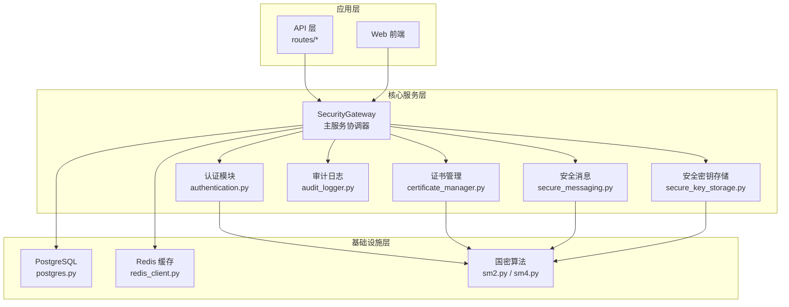
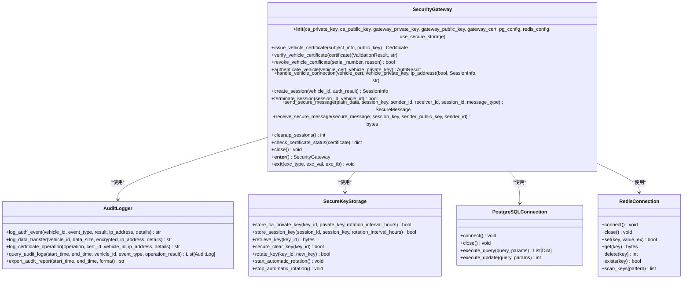
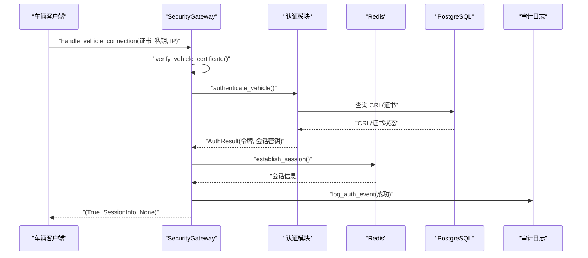
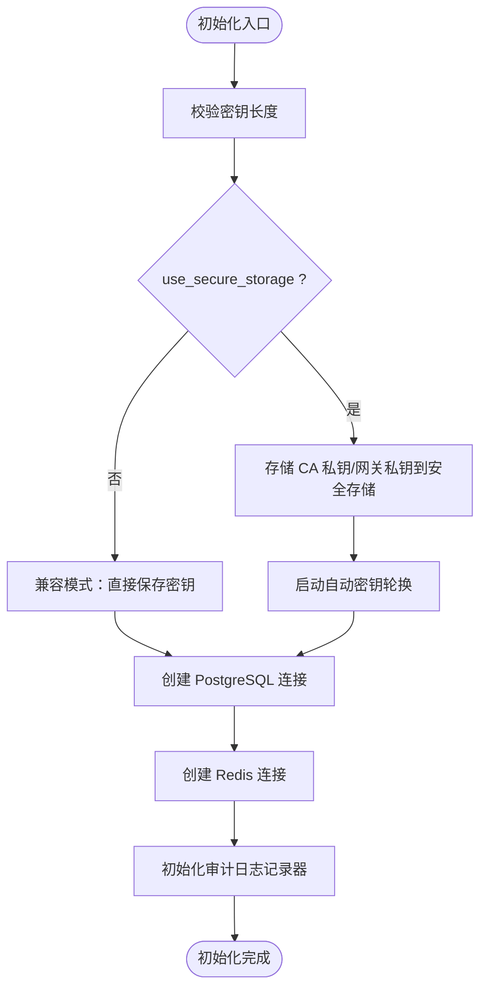
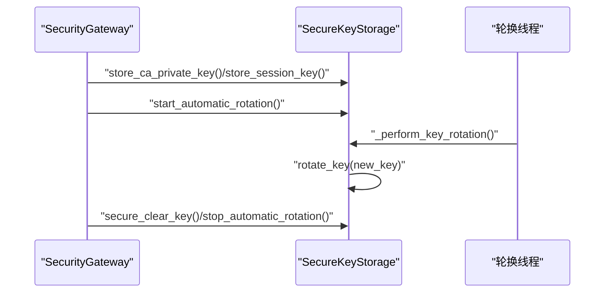
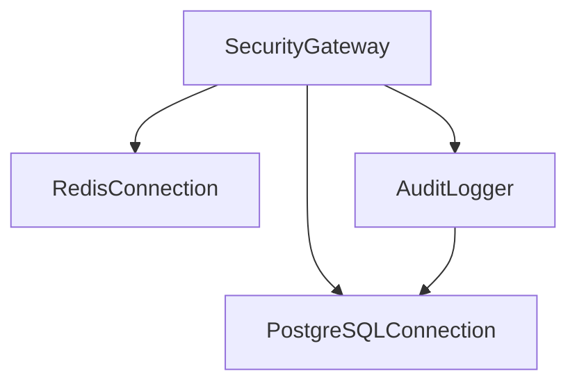
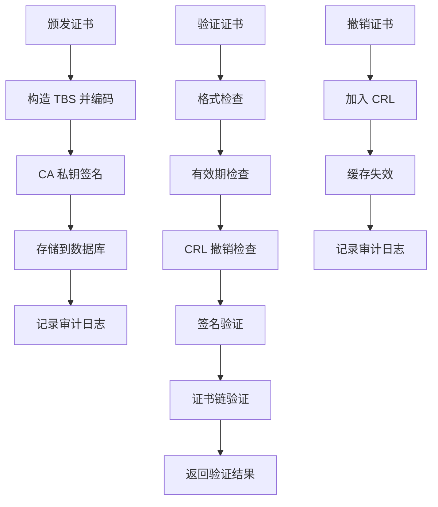
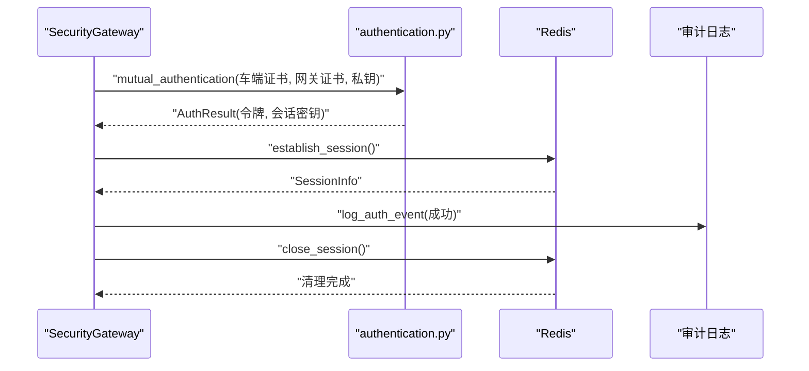
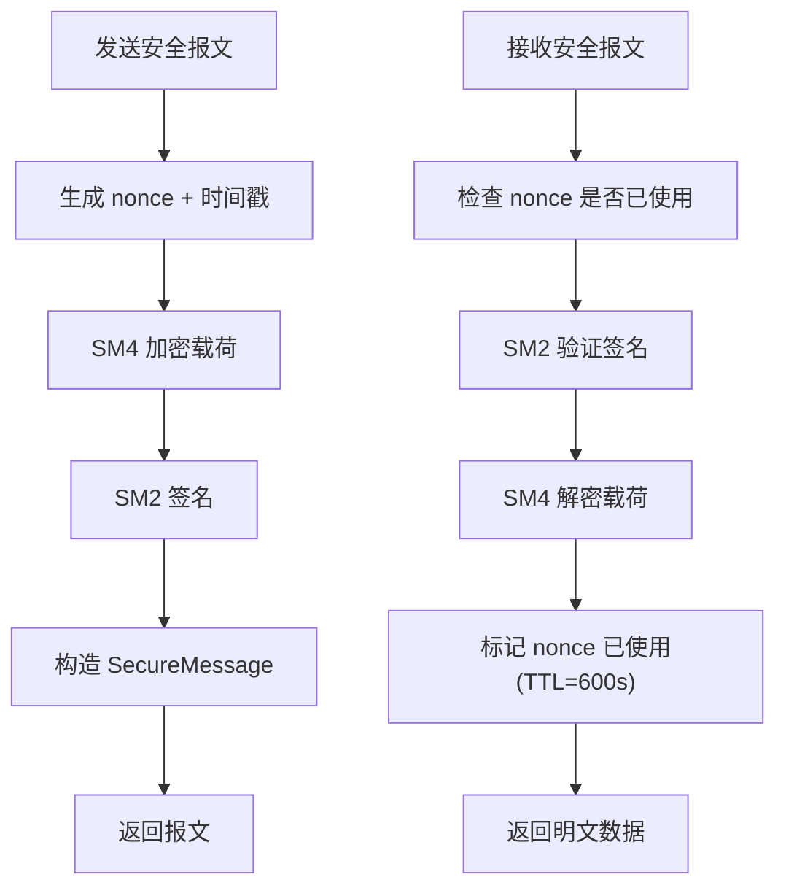
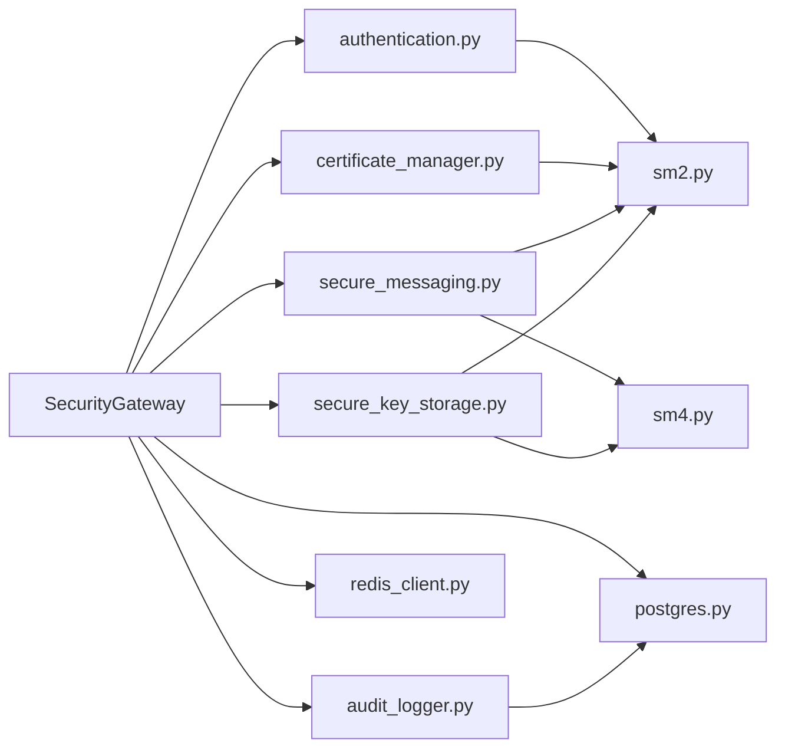

# 安全通信网关主服务

<cite>
**本文档引用的文件**
- [security_gateway.py](file://src/security_gateway.py)
- [authentication.py](file://src/authentication.py)
- [certificate_manager.py](file://src/certificate_manager.py)
- [secure_messaging.py](file://src/secure_messaging.py)
- [audit_logger.py](file://src/audit_logger.py)
- [secure_key_storage.py](file://src/secure_key_storage.py)
- [session.py](file://src/models/session.py)
- [certificate.py](file://src/models/certificate.py)
- [message.py](file://src/models/message.py)
- [database.py](file://config/database.py)
- [postgres.py](file://src/db/postgres.py)
- [redis_client.py](file://src/db/redis_client.py)
- [sm2.py](file://src/crypto/sm2.py)
- [sm4.py](file://src/crypto/sm4.py)
- [security_gateway_demo.py](file://examples/security_gateway_demo.py)
- [test_security_gateway.py](file://tests/test_security_gateway.py)
</cite>

## 目录
1. [简介](#简介)
2. [项目结构](#项目结构)
3. [核心组件](#核心组件)
4. [架构总览](#架构总览)
5. [详细组件分析](#详细组件分析)
6. [依赖关系分析](#依赖关系分析)
7. [性能考虑](#性能考虑)
8. [故障排除指南](#故障排除指南)
9. [结论](#结论)
10. [附录](#附录)

## 简介
本文件全面阐述安全通信网关主服务的设计理念、架构职责与实现细节。SecurityGateway 类作为整个系统的中央协调器，负责集成证书管理、身份认证、加密签名与审计日志模块，提供车联网安全通信的核心能力。本文将深入解析其初始化流程、密钥管理机制、数据库与缓存连接管理、审计日志集成，以及如何协调证书管理、身份认证、安全消息传输与会话管理等核心功能。同时提供使用示例、配置选项与错误处理策略，并总结服务生命周期管理的最佳实践。

## 项目结构
系统采用分层与模块化设计，主要目录与职责如下：
- src：核心业务逻辑与模型定义
  - api：HTTP API 层（路由与接口）
  - crypto：SM2/SM4 国密算法实现
  - db：数据库连接与缓存客户端封装
  - models：数据模型（证书、会话、消息、审计等）
  - 各功能模块：security_gateway、authentication、certificate_manager、secure_messaging、audit_logger、secure_key_storage
- config：数据库配置（PostgreSQL、Redis）
- tests：单元测试与集成测试
- examples：使用示例与演示脚本
- web：前端界面（可选）

图表来源
- [security_gateway.py:37-800](file://src/security_gateway.py#L37-L800)
- [authentication.py:1-662](file://src/authentication.py#L1-L662)
- [certificate_manager.py:1-734](file://src/certificate_manager.py#L1-L734)
- [secure_messaging.py:1-249](file://src/secure_messaging.py#L1-L249)
- [audit_logger.py:1-480](file://src/audit_logger.py#L1-L480)
- [secure_key_storage.py:1-380](file://src/secure_key_storage.py#L1-L380)
- [postgres.py:1-53](file://src/db/postgres.py#L1-L53)
- [redis_client.py:1-79](file://src/db/redis_client.py#L1-L79)
- [sm2.py:1-265](file://src/crypto/sm2.py#L1-L265)
- [sm4.py:1-189](file://src/crypto/sm4.py#L1-L189)

章节来源
- [security_gateway.py:1-800](file://src/security_gateway.py#L1-L800)
- [database.py:1-50](file://config/database.py#L1-L50)

## 核心组件
- SecurityGateway 主服务协调器：统一编排证书管理、身份认证、会话管理、安全消息传输与审计日志。
- 认证模块 authentication：实现车云双向身份认证、会话建立与清理。
- 证书管理 certificate_manager：颁发、验证、撤销证书及 CRL 管理。
- 安全消息 secure_messaging：基于 SM2/SM4 的安全报文传输与验证。
- 审计日志 audit_logger：认证、数据传输、证书操作的审计记录与导出。
- 安全密钥存储 secure_key_storage：模拟 HSM 的密钥安全存储、轮换与清理。
- 数据库与缓存：PostgreSQLConnection、RedisConnection 封装。
- 国密算法：SM2（签名/验签）、SM4（对称加密）。

章节来源
- [security_gateway.py:37-800](file://src/security_gateway.py#L37-L800)
- [authentication.py:196-364](file://src/authentication.py#L196-L364)
- [certificate_manager.py:597-734](file://src/certificate_manager.py#L597-L734)
- [secure_messaging.py:17-249](file://src/secure_messaging.py#L17-L249)
- [audit_logger.py:26-480](file://src/audit_logger.py#L26-L480)
- [secure_key_storage.py:27-380](file://src/secure_key_storage.py#L27-L380)
- [postgres.py:9-53](file://src/db/postgres.py#L9-L53)
- [redis_client.py:8-79](file://src/db/redis_client.py#L8-L79)
- [sm2.py:93-265](file://src/crypto/sm2.py#L93-L265)
- [sm4.py:11-189](file://src/crypto/sm4.py#L11-L189)

## 架构总览
SecurityGateway 作为中央协调器，负责：
- 初始化与配置：密钥长度校验、安全存储、数据库与缓存连接、审计日志记录器。
- 证书管理：颁发、验证、撤销、状态检查。
- 身份认证：车云双向认证、会话建立、会话清理与冲突处理。
- 安全消息：发送与接收报文，防重放、签名验证、解密。
- 审计日志：认证事件、数据传输、证书操作的持久化与查询。
- 生命周期管理：优雅关闭、资源清理、密钥轮换停止。

图表来源
- [security_gateway.py:37-800](file://src/security_gateway.py#L37-L800)
- [audit_logger.py:26-480](file://src/audit_logger.py#L26-L480)
- [secure_key_storage.py:27-380](file://src/secure_key_storage.py#L27-L380)
- [postgres.py:9-53](file://src/db/postgres.py#L9-L53)
- [redis_client.py:8-79](file://src/db/redis_client.py#L8-L79)

## 详细组件分析

### SecurityGateway 类设计与职责
- 设计理念：以“安全优先”为核心，通过最小暴露原则与安全存储隔离敏感密钥；通过审计日志贯穿所有关键操作；通过统一接口协调各子模块。
- 架构职责：
  - 集成证书管理：颁发、验证、撤销、状态检查。
  - 身份认证：双向认证、会话建立、会话清理与冲突处理。
  - 安全消息：发送与接收报文，防重放、签名验证、解密。
  - 审计日志：认证事件、数据传输、证书操作记录。
  - 生命周期管理：优雅关闭、资源清理、密钥轮换停止。

图表来源
- [security_gateway.py:353-438](file://src/security_gateway.py#L353-L438)
- [authentication.py:196-364](file://src/authentication.py#L196-L364)
- [redis_client.py:31-71](file://src/db/redis_client.py#L31-L71)
- [audit_logger.py:90-135](file://src/audit_logger.py#L90-L135)

章节来源
- [security_gateway.py:37-800](file://src/security_gateway.py#L37-L800)

### 初始化流程与配置
- 密钥校验：严格校验 CA 私钥（32 字节）、CA 公钥（64 字节）、网关私钥（32 字节）、网关公钥（64 字节）长度。
- 安全存储：可启用安全密钥存储（默认），将 CA 私钥与网关私钥存储至安全隔离区，会话密钥同样安全存储；可禁用以兼容测试。
- 数据库与缓存：从环境变量加载 PostgreSQL 与 Redis 配置，创建连接对象。
- 审计日志：初始化审计日志记录器，持久化到 PostgreSQL。

图表来源
- [security_gateway.py:46-128](file://src/security_gateway.py#L46-L128)
- [database.py:17-49](file://config/database.py#L17-L49)
- [postgres.py:12-45](file://src/db/postgres.py#L12-L45)
- [redis_client.py:11-29](file://src/db/redis_client.py#L11-L29)
- [audit_logger.py:26-36](file://src/audit_logger.py#L26-L36)

章节来源
- [security_gateway.py:46-128](file://src/security_gateway.py#L46-L128)
- [database.py:1-50](file://config/database.py#L1-L50)
- [postgres.py:1-53](file://src/db/postgres.py#L1-L53)
- [redis_client.py:1-79](file://src/db/redis_client.py#L1-L79)
- [audit_logger.py:1-480](file://src/audit_logger.py#L1-L480)

### 密钥管理机制
- 安全存储：模拟 HSM 的密钥存储，提供 store_ca_private_key、store_session_key、retrieve_key、secure_clear_key、rotate_key、start_automatic_rotation、stop_automatic_rotation。
- 自动轮换：后台线程按设定间隔轮换密钥，支持会话密钥与 CA 私钥类型。
- 明文保护：在启用安全存储时，不将明文密钥保存在内存中；关闭时停止轮换并清理资源。

图表来源
- [security_gateway.py:82-111](file://src/security_gateway.py#L82-L111)
- [secure_key_storage.py:46-313](file://src/secure_key_storage.py#L46-L313)

章节来源
- [secure_key_storage.py:1-380](file://src/secure_key_storage.py#L1-L380)
- [security_gateway.py:82-111](file://src/security_gateway.py#L82-L111)

### 数据库连接管理与审计日志集成
- PostgreSQLConnection：封装连接、查询、更新与上下文管理。
- RedisConnection：封装 set/get/delete/exists/scan_keys 等常用操作。
- AuditLogger：统一记录认证事件、数据传输、证书操作，支持查询与导出。

图表来源
- [security_gateway.py:118-127](file://src/security_gateway.py#L118-L127)
- [postgres.py:9-53](file://src/db/postgres.py#L9-L53)
- [redis_client.py:8-79](file://src/db/redis_client.py#L8-L79)
- [audit_logger.py:26-480](file://src/audit_logger.py#L26-L480)

章节来源
- [postgres.py:1-53](file://src/db/postgres.py#L1-L53)
- [redis_client.py:1-79](file://src/db/redis_client.py#L1-L79)
- [audit_logger.py:1-480](file://src/audit_logger.py#L1-L480)

### 证书管理与验证
- 颁发：生成唯一序列号、设置有效期、构造证书主体与扩展、使用 CA 私钥签名并存储到数据库。
- 验证：格式检查、有效期检查、CRL 撤销检查、签名验证、证书链验证（单层）。
- 撤销：将序列号加入 CRL 并记录审计日志。
- 状态检查：返回证书状态、生效/过期时间、剩余天数等。

图表来源
- [certificate_manager.py:597-734](file://src/certificate_manager.py#L597-L734)
- [certificate_manager.py:206-331](file://src/certificate_manager.py#L206-L331)
- [certificate_manager.py:334-430](file://src/certificate_manager.py#L334-L430)

章节来源
- [certificate_manager.py:1-734](file://src/certificate_manager.py#L1-L734)

### 身份认证与会话管理
- 双向认证：车端与网关分别验证对方证书，生成挑战值并使用 SM2 签名验证，生成会话密钥与认证令牌。
- 会话建立：生成会话 ID 与 SM4 会话密钥，存储到 Redis，必要时安全存储会话密钥。
- 会话清理：关闭会话时安全清除会话密钥并删除 Redis 中的会话信息。
- 会话冲突：支持拒绝新会话或终止旧会话的策略。

图表来源
- [authentication.py:196-364](file://src/authentication.py#L196-L364)
- [authentication.py:366-480](file://src/authentication.py#L366-L480)
- [authentication.py:483-552](file://src/authentication.py#L483-L552)
- [security_gateway.py:289-541](file://src/security_gateway.py#L289-L541)

章节来源
- [authentication.py:196-552](file://src/authentication.py#L196-L552)
- [session.py:1-104](file://src/models/session.py#L1-L104)

### 安全消息传输与防重放
- 发送：生成随机 nonce 与时间戳，使用 SM4 加密业务数据，使用 SM2 对完整消息签名，返回 SecureMessage。
- 接收：验证时间戳（±5 分钟容差）、检查 nonce 是否已使用（Redis 标记 TTL 600 秒）、使用发送方公钥验证签名、使用会话密钥解密。
- 错误处理：签名验证失败、重放攻击检测、时间戳过期、解密失败等均记录审计日志并抛出相应异常。

图表来源
- [secure_messaging.py:17-142](file://src/secure_messaging.py#L17-L142)
- [secure_messaging.py:144-249](file://src/secure_messaging.py#L144-L249)

章节来源
- [secure_messaging.py:1-249](file://src/secure_messaging.py#L1-L249)
- [message.py:1-200](file://src/models/message.py#L1-L200)

### 使用示例
- 演示脚本展示了从密钥生成、证书颁发、双向认证、会话建立、安全报文发送与接收、证书状态检查到会话终止的完整流程。
- 测试用例覆盖初始化、证书管理、认证、会话管理、安全消息、上下文管理器、数据转发与审计日志等场景。

章节来源
- [security_gateway_demo.py:1-186](file://examples/security_gateway_demo.py#L1-L186)
- [test_security_gateway.py:1-1154](file://tests/test_security_gateway.py#L1-L1154)

## 依赖关系分析
- SecurityGateway 依赖认证、证书管理、安全消息、审计日志、安全密钥存储、数据库与缓存连接。
- 认证模块依赖 SM2 算法与数据库连接。
- 证书管理依赖 SM2 算法与数据库连接。
- 安全消息依赖 SM2/SM4 算法与 Redis 连接。
- 审计日志依赖 PostgreSQL 连接。
- 安全密钥存储依赖 SM2/SM4 算法与线程同步。

图表来源
- [security_gateway.py:6-34](file://src/security_gateway.py#L6-L34)
- [authentication.py:14-20](file://src/authentication.py#L14-L20)
- [certificate_manager.py:13-17](file://src/certificate_manager.py#L13-L17)
- [secure_messaging.py:12-14](file://src/secure_messaging.py#L12-L14)
- [audit_logger.py:22-23](file://src/audit_logger.py#L22-L23)
- [secure_key_storage.py:14-14](file://src/secure_key_storage.py#L14-L14)

章节来源
- [security_gateway.py:1-800](file://src/security_gateway.py#L1-L800)

## 性能考虑
- 缓存优化：证书验证使用 LRU 缓存（容量 10,000，TTL 5 分钟），显著降低重复验证开销。
- 非对称加密：SM2 仅用于签名与密钥交换，数据传输使用 SM4 对称加密，兼顾安全性与性能。
- 会话存储：Redis 使用 TTL 自动过期，减少主动清理成本；会话密钥安全存储，避免频繁 IO。
- 密钥轮换：后台线程按小时检查轮换，避免阻塞主线程。
- 批量操作：Redis SCAN 命令用于键扫描，避免阻塞。

## 故障排除指南
- 证书验证失败：检查证书有效期、CRL 撤销状态、签名验证；若数据库连接异常，考虑使用缓存 CRL。
- 认证失败：检查证书有效性、挑战响应签名、令牌过期与权限；查看审计日志定位失败原因。
- 会话异常：确认会话 ID 与车辆 ID 映射、会话过期时间、Redis 连接状态；必要时清理过期会话。
- 安全消息错误：检查 nonce 是否已使用、时间戳是否在容差范围内、签名验证与解密密钥；查看审计日志。
- 资源清理：确保优雅关闭时停止密钥轮换、关闭数据库与缓存连接、安全清除会话密钥。

章节来源
- [security_gateway.py:182-245](file://src/security_gateway.py#L182-L245)
- [authentication.py:554-596](file://src/authentication.py#L554-L596)
- [secure_messaging.py:201-248](file://src/secure_messaging.py#L201-L248)
- [audit_logger.py:243-335](file://src/audit_logger.py#L243-L335)

## 结论
SecurityGateway 通过严谨的模块化设计与安全机制，实现了车联网安全通信的核心能力。其以安全存储隔离密钥、以审计日志贯穿关键流程、以缓存与轮换提升性能与安全性，并提供了完善的生命周期管理与错误处理策略。结合示例与测试用例，开发者可快速集成并稳定运行该网关服务。

## 附录

### 配置选项
- PostgreSQL 配置：主机、端口、数据库名、用户名、密码（从环境变量加载）。
- Redis 配置：主机、端口、数据库编号、密码（从环境变量加载）。
- 安全存储：是否启用安全存储、密钥轮换间隔（小时）。

章节来源
- [database.py:8-49](file://config/database.py#L8-L49)

### 最佳实践
- 初始化阶段：严格校验密钥长度，启用安全存储，确保数据库与缓存连接可用。
- 运行阶段：开启自动密钥轮换，定期检查证书状态，监控审计日志。
- 关闭阶段：停止密钥轮换，关闭数据库与缓存连接，安全清除会话密钥，记录关闭事件。

章节来源
- [security_gateway.py:770-799](file://src/security_gateway.py#L770-L799)
- [secure_key_storage.py:234-255](file://src/secure_key_storage.py#L234-L255)