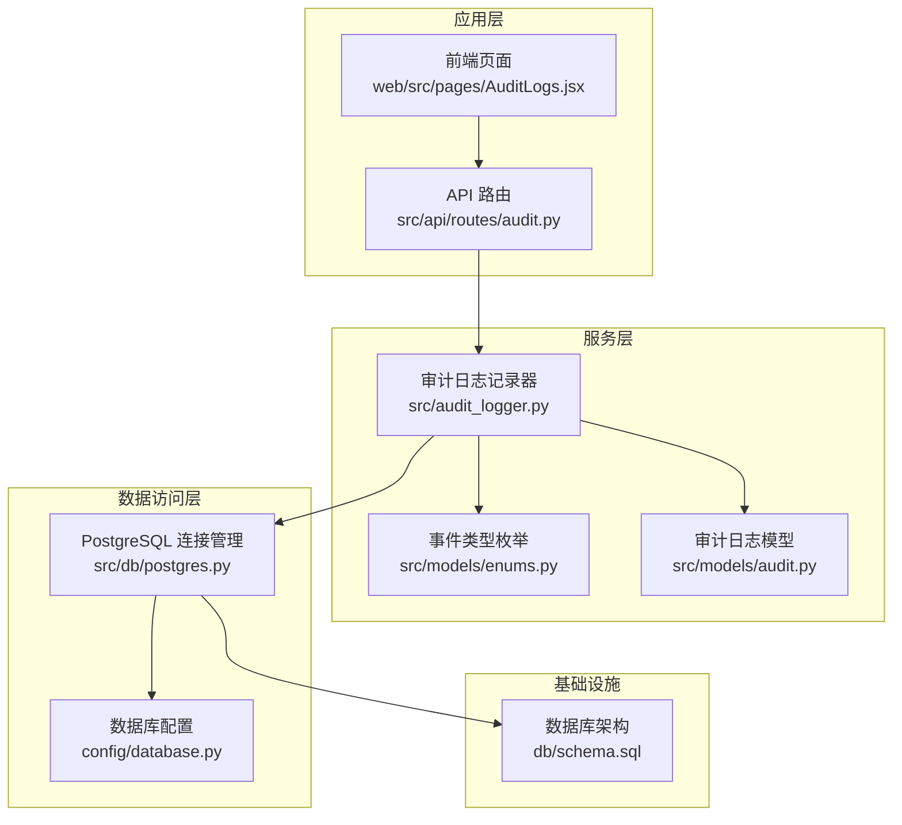
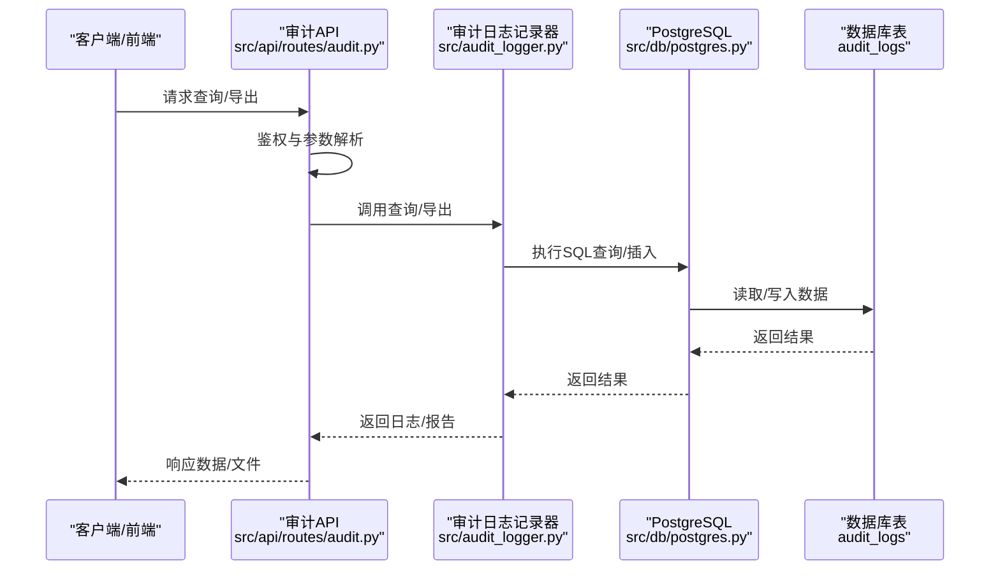
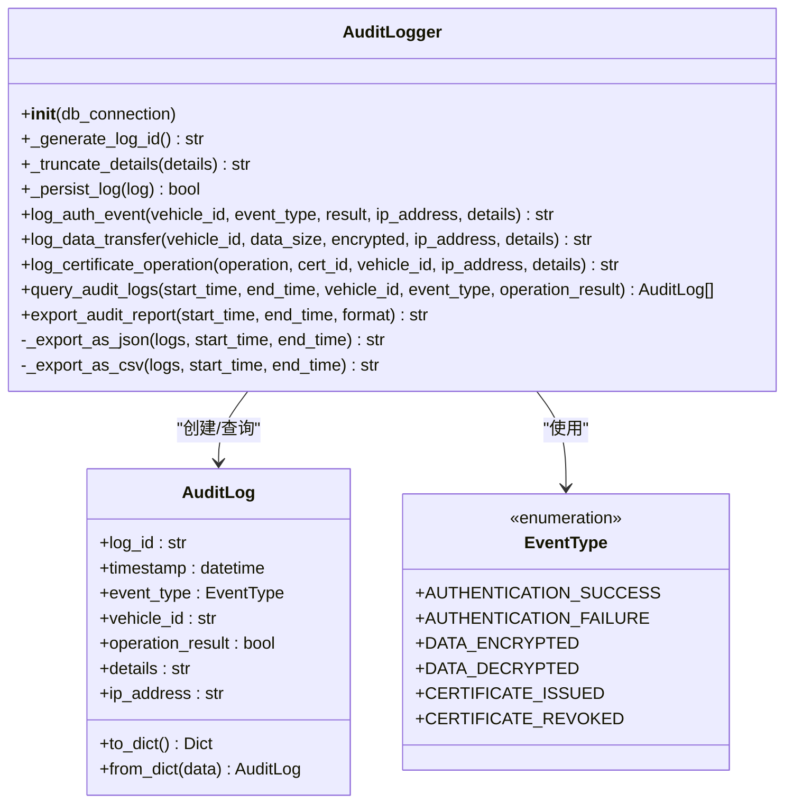
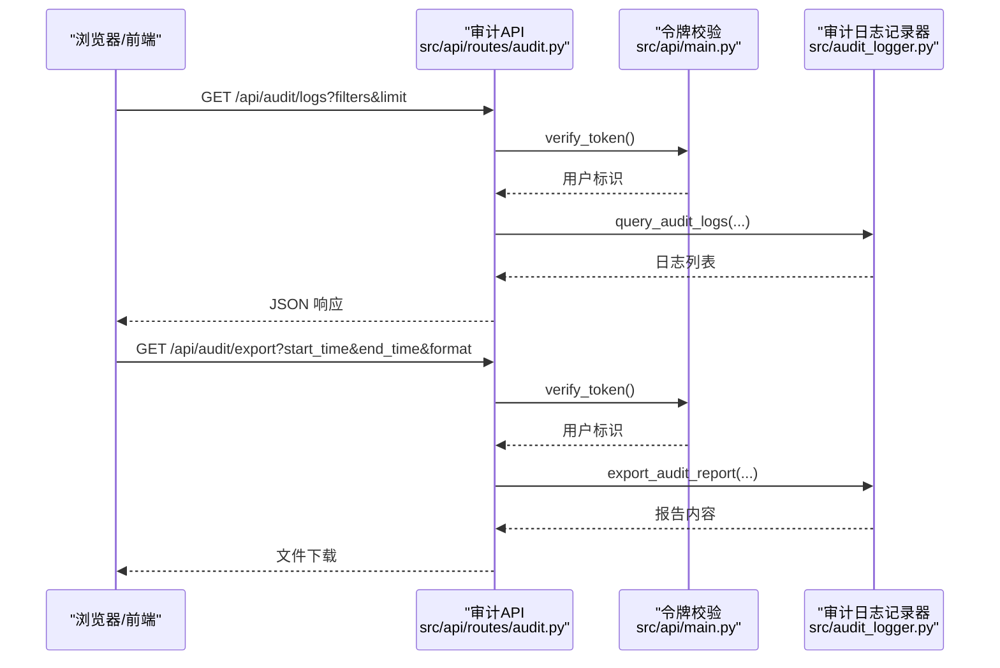
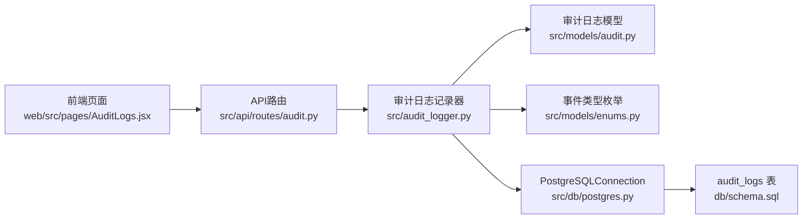

# 审计日志服务

<cite>
**本文引用的文件**
- [src/audit_logger.py](file://src/audit_logger.py)
- [src/models/audit.py](file://src/models/audit.py)
- [src/models/enums.py](file://src/models/enums.py)
- [src/api/routes/audit.py](file://src/api/routes/audit.py)
- [src/db/postgres.py](file://src/db/postgres.py)
- [db/schema.sql](file://db/schema.sql)
- [config/database.py](file://config/database.py)
- [src/api/main.py](file://src/api/main.py)
- [examples/test_audit_logs.py](file://examples/test_audit_logs.py)
- [examples/export_audit_report_example.py](file://examples/export_audit_report_example.py)
- [tests/test_audit_logger.py](file://tests/test_audit_logger.py)
- [tests/test_audit_model.py](file://tests/test_audit_model.py)
- [docs/AUDIT_LOG_FIX.md](file://docs/AUDIT_LOG_FIX.md)
- [审计日志功能说明.md](file://审计日志功能说明.md)
- [web/src/pages/AuditLogs.jsx](file://web/src/pages/AuditLogs.jsx)
</cite>

## 目录
1. [简介](#简介)
2. [项目结构](#项目结构)
3. [核心组件](#核心组件)
4. [架构总览](#架构总览)
5. [详细组件分析](#详细组件分析)
6. [依赖关系分析](#依赖关系分析)
7. [性能考量](#性能考量)
8. [故障排查指南](#故障排查指南)
9. [结论](#结论)
10. [附录](#附录)

## 简介
本文件系统性阐述审计日志服务的设计理念与实现机制，覆盖事件分类、日志记录与查询、数据结构与存储格式、查询与导出功能使用指南、性能优化与存储策略，以及在安全事件追溯与合规性方面的应用。审计日志服务围绕认证事件、证书操作、数据传输等关键场景进行记录，并提供灵活的查询与导出能力，支撑安全运营与合规审计。

## 项目结构
审计日志服务由“记录器”“模型与枚举”“API路由”“数据库访问层”“前端页面”“测试与示例”等模块协同组成，采用分层设计，职责清晰、耦合度低。

**图表来源**
- [src/api/routes/audit.py:1-191](file://src/api/routes/audit.py#L1-L191)
- [src/audit_logger.py:1-480](file://src/audit_logger.py#L1-L480)
- [src/models/audit.py:1-56](file://src/models/audit.py#L1-L56)
- [src/models/enums.py:1-56](file://src/models/enums.py#L1-L56)
- [src/db/postgres.py:1-53](file://src/db/postgres.py#L1-L53)
- [config/database.py:1-50](file://config/database.py#L1-L50)
- [db/schema.sql:1-104](file://db/schema.sql#L1-L104)

**章节来源**
- [src/api/routes/audit.py:1-191](file://src/api/routes/audit.py#L1-L191)
- [src/audit_logger.py:1-480](file://src/audit_logger.py#L1-L480)
- [src/models/audit.py:1-56](file://src/models/audit.py#L1-L56)
- [src/models/enums.py:1-56](file://src/models/enums.py#L1-L56)
- [src/db/postgres.py:1-53](file://src/db/postgres.py#L1-L53)
- [config/database.py:1-50](file://config/database.py#L1-L50)
- [db/schema.sql:1-104](file://db/schema.sql#L1-L104)

## 核心组件
- 审计日志记录器：负责生成唯一日志ID、截断详细信息、持久化到PostgreSQL、记录认证事件、数据传输事件、证书操作事件，并提供查询与导出能力。
- 审计日志模型：定义日志字段、约束与序列化/反序列化方法。
- 事件类型枚举：统一管理审计事件类型，如认证成功/失败、数据加密/解密、证书颁发/撤销等。
- API路由：提供审计日志查询与导出接口，支持多条件过滤与分页。
- 数据库访问层：封装PostgreSQL连接、查询与更新操作。
- 数据库架构：定义审计日志表及索引，保障查询性能与完整性约束。

**章节来源**
- [src/audit_logger.py:26-480](file://src/audit_logger.py#L26-L480)
- [src/models/audit.py:9-56](file://src/models/audit.py#L9-L56)
- [src/models/enums.py:35-47](file://src/models/enums.py#L35-L47)
- [src/api/routes/audit.py:1-191](file://src/api/routes/audit.py#L1-L191)
- [src/db/postgres.py:9-53](file://src/db/postgres.py#L9-L53)
- [db/schema.sql:36-54](file://db/schema.sql#L36-L54)

## 架构总览
审计日志服务采用“API → 记录器 → 数据库”的典型三层架构。API路由负责鉴权与参数校验，记录器负责事件分类与持久化，数据库提供高性能查询与导出支持。

**图表来源**
- [src/api/routes/audit.py:39-191](file://src/api/routes/audit.py#L39-L191)
- [src/audit_logger.py:243-466](file://src/audit_logger.py#L243-L466)
- [src/db/postgres.py:32-45](file://src/db/postgres.py#L32-L45)
- [db/schema.sql:36-54](file://db/schema.sql#L36-L54)

## 详细组件分析

### 审计日志记录器（AuditLogger）
- 职责与能力
  - 生成唯一日志ID（UUID）
  - 限制详细信息长度至1024字符
  - 持久化到PostgreSQL
  - 记录认证事件（成功/失败）
  - 记录数据传输事件（加密/解密）
  - 记录证书操作事件（颁发/撤销）
  - 查询审计日志（支持时间范围、车辆ID、事件类型、操作结果）
  - 导出审计报告（JSON/CSV）

- 设计要点
  - 错误处理：持久化与查询均捕获异常，避免影响主业务流程
  - 参数校验：事件类型枚举转换、IP地址获取（未知时回退）
  - 数据一致性：数据库约束保证日志ID唯一、详细信息长度限制

**图表来源**
- [src/audit_logger.py:26-480](file://src/audit_logger.py#L26-L480)
- [src/models/audit.py:9-56](file://src/models/audit.py#L9-L56)
- [src/models/enums.py:35-47](file://src/models/enums.py#L35-L47)

**章节来源**
- [src/audit_logger.py:26-480](file://src/audit_logger.py#L26-L480)
- [src/models/audit.py:9-56](file://src/models/audit.py#L9-L56)
- [src/models/enums.py:35-47](file://src/models/enums.py#L35-L47)

### 审计日志模型（AuditLog）
- 字段与约束
  - log_id：唯一标识（UUID）
  - timestamp：事件时间
  - event_type：事件类型（枚举）
  - vehicle_id：车辆标识
  - operation_result：操作结果（布尔）
  - details：详细信息（最多1024字符）
  - ip_address：客户端IP地址
- 序列化/反序列化：支持字典转换，便于API传输与存储

**章节来源**
- [src/models/audit.py:9-56](file://src/models/audit.py#L9-L56)

### 事件类型枚举（EventType）
- 支持事件类型：车辆连接/断开、认证成功/失败、数据加密/解密、证书颁发/撤销、签名验证/失败
- 用于统一事件分类与查询过滤

**章节来源**
- [src/models/enums.py:35-47](file://src/models/enums.py#L35-L47)

### API路由（审计日志查询与导出）
- 查询接口
  - 路径：GET /api/audit/logs
  - 支持过滤：开始时间、结束时间、车辆ID、事件类型、操作结果
  - 分页：limit参数限制返回条数
- 导出接口
  - 路径：GET /api/audit/export
  - 支持格式：JSON/CSV
  - 自动设置Content-Disposition与媒体类型
- 鉴权：依赖HTTP Bearer令牌校验

**图表来源**
- [src/api/routes/audit.py:39-191](file://src/api/routes/audit.py#L39-L191)
- [src/api/main.py:49-74](file://src/api/main.py#L49-L74)
- [src/audit_logger.py:243-466](file://src/audit_logger.py#L243-L466)

**章节来源**
- [src/api/routes/audit.py:1-191](file://src/api/routes/audit.py#L1-L191)
- [src/api/main.py:49-74](file://src/api/main.py#L49-L74)

### 数据库访问层（PostgreSQLConnection）
- 连接管理：延迟连接、自动关闭
- 查询与更新：封装execute_query与execute_update，返回结构化结果
- 事务：更新操作提交

**章节来源**
- [src/db/postgres.py:9-53](file://src/db/postgres.py#L9-L53)

### 数据库架构（audit_logs表）
- 字段：id、log_id、timestamp、event_type、vehicle_id、operation_result、details、ip_address、created_at
- 约束：log_id唯一、details长度限制、时间戳默认值
- 索引：log_id、timestamp、vehicle_id、event_type，提升查询性能

**章节来源**
- [db/schema.sql:36-54](file://db/schema.sql#L36-L54)

### 前端页面（审计日志查询）
- 功能：时间范围、车辆ID、事件类型、操作结果过滤；导出JSON/CSV
- 交互：动态加载、错误提示、本地化时间显示

**章节来源**
- [web/src/pages/AuditLogs.jsx:1-220](file://web/src/pages/AuditLogs.jsx#L1-L220)

### 示例与测试
- 示例脚本：展示导出JSON/CSV报告、记录示例日志
- 单元测试：覆盖日志ID生成、详细信息截断、事件记录、查询过滤、序列化/反序列化、错误处理等

**章节来源**
- [examples/export_audit_report_example.py:1-143](file://examples/export_audit_report_example.py#L1-L143)
- [examples/test_audit_logs.py:1-381](file://examples/test_audit_logs.py#L1-L381)
- [tests/test_audit_logger.py:1-800](file://tests/test_audit_logger.py#L1-L800)
- [tests/test_audit_model.py:1-200](file://tests/test_audit_model.py#L1-L200)

## 依赖关系分析
- 组件耦合
  - AuditLogger依赖PostgreSQLConnection与数据库表结构
  - API路由依赖AuditLogger与鉴权模块
  - 前端页面依赖API客户端与后端接口
- 外部依赖
  - PostgreSQL：持久化存储
  - FastAPI：API框架与鉴权
  - 前端React：UI与交互

**图表来源**
- [src/api/routes/audit.py:1-191](file://src/api/routes/audit.py#L1-L191)
- [src/audit_logger.py:1-480](file://src/audit_logger.py#L1-L480)
- [src/models/audit.py:1-56](file://src/models/audit.py#L1-L56)
- [src/models/enums.py:1-56](file://src/models/enums.py#L1-L56)
- [src/db/postgres.py:1-53](file://src/db/postgres.py#L1-L53)
- [db/schema.sql:1-104](file://db/schema.sql#L1-L104)
- [web/src/pages/AuditLogs.jsx:1-220](file://web/src/pages/AuditLogs.jsx#L1-L220)

**章节来源**
- [src/api/routes/audit.py:1-191](file://src/api/routes/audit.py#L1-L191)
- [src/audit_logger.py:1-480](file://src/audit_logger.py#L1-L480)
- [src/db/postgres.py:1-53](file://src/db/postgres.py#L1-L53)
- [db/schema.sql:1-104](file://db/schema.sql#L1-L104)
- [web/src/pages/AuditLogs.jsx:1-220](file://web/src/pages/AuditLogs.jsx#L1-L220)

## 性能考量
- 索引优化
  - 已创建timestamp、vehicle_id、event_type索引，支持高频过滤与排序
- 查询优化
  - 查询按timestamp降序返回，结合limit控制返回量
  - 支持多条件组合过滤，减少不必要的扫描
- 存储策略
  - 详细信息长度限制为1024字符，降低存储与IO压力
  - 建议定期清理历史日志（例如保留90天），释放空间
- 并发与可靠性
  - 每次操作新建连接并在完成后关闭，避免连接泄漏
  - 持久化与查询异常被捕获，不影响主业务流程

**章节来源**
- [db/schema.sql:49-54](file://db/schema.sql#L49-L54)
- [src/audit_logger.py:58-88](file://src/audit_logger.py#L58-L88)
- [src/db/postgres.py:16-31](file://src/db/postgres.py#L16-L31)
- [审计日志功能说明.md:268-289](file://审计日志功能说明.md#L268-L289)

## 故障排查指南
- 无审计日志记录
  - 检查API是否正确调用审计日志记录器（参考修复说明）
  - 确认数据库表存在且有数据
- 查询不到数据
  - 核对时间范围、过滤条件是否合理
  - 检查API鉴权与路由注册
- 导出失败
  - 确认起止时间参数合法
  - 检查格式参数是否为json或csv
- 前端页面无数据
  - 检查网络连通性与CORS配置
  - 确认API返回结构与前端解析一致

**章节来源**
- [docs/AUDIT_LOG_FIX.md:1-271](file://docs/AUDIT_LOG_FIX.md#L1-L271)
- [审计日志功能说明.md:291-317](file://审计日志功能说明.md#L291-L317)
- [src/api/main.py:36-43](file://src/api/main.py#L36-L43)

## 结论
审计日志服务通过清晰的分层设计与完善的事件分类，实现了对认证、数据传输、证书操作等关键场景的全面记录。配合灵活的查询与导出能力，能够满足安全事件追溯与合规审计的需求。建议尽快补齐车辆认证与数据接收等关键操作的审计日志集成，并持续优化索引与清理策略，保障长期稳定运行。

## 附录

### 审计事件类型与处理
- 认证事件：认证成功/失败，记录参与者、结果与IP
- 数据传输事件：区分加密/解密，记录数据大小与状态
- 证书操作事件：颁发/撤销，记录证书ID与关联车辆

**章节来源**
- [src/audit_logger.py:90-241](file://src/audit_logger.py#L90-L241)
- [src/models/enums.py:35-47](file://src/models/enums.py#L35-L47)

### 审计日志数据结构与存储格式
- 字段：log_id、timestamp、event_type、vehicle_id、operation_result、details、ip_address
- 存储：PostgreSQL audit_logs表，包含唯一性与长度约束
- 导出：JSON/CSV两种格式，包含元数据与日志明细

**章节来源**
- [src/models/audit.py:19-25](file://src/models/audit.py#L19-L25)
- [db/schema.sql:36-46](file://db/schema.sql#L36-L46)
- [src/audit_logger.py:337-465](file://src/audit_logger.py#L337-L465)

### 审计日志查询与导出使用指南
- 查询接口：GET /api/audit/logs，支持时间范围、车辆ID、事件类型、操作结果、limit
- 导出接口：GET /api/audit/export，支持json/csv，自动设置响应头与文件名
- 前端页面：提供过滤表单与导出按钮，支持本地化时间显示

**章节来源**
- [src/api/routes/audit.py:39-191](file://src/api/routes/audit.py#L39-L191)
- [web/src/pages/AuditLogs.jsx:17-57](file://web/src/pages/AuditLogs.jsx#L17-L57)

### 性能优化与存储策略
- 索引：timestamp、vehicle_id、event_type
- 清理：定期删除历史日志（建议90天）
- 异步化：后续可引入消息队列异步记录，降低主流程影响

**章节来源**
- [db/schema.sql:49-54](file://db/schema.sql#L49-L54)
- [审计日志功能说明.md:268-289](file://审计日志功能说明.md#L268-L289)
- [docs/AUDIT_LOG_FIX.md:243-251](file://docs/AUDIT_LOG_FIX.md#L243-L251)