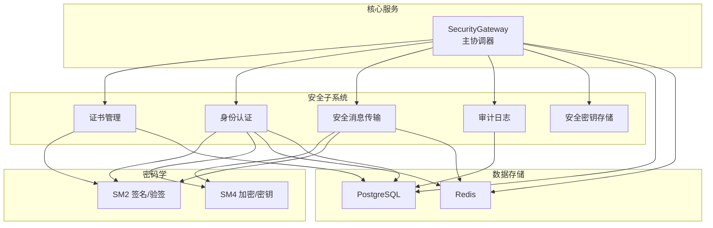
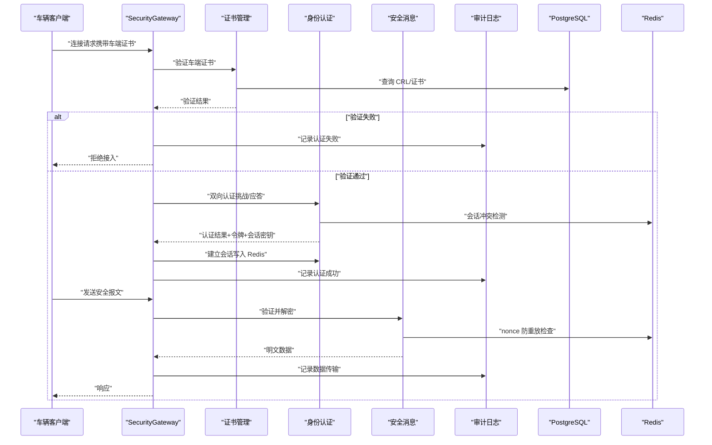
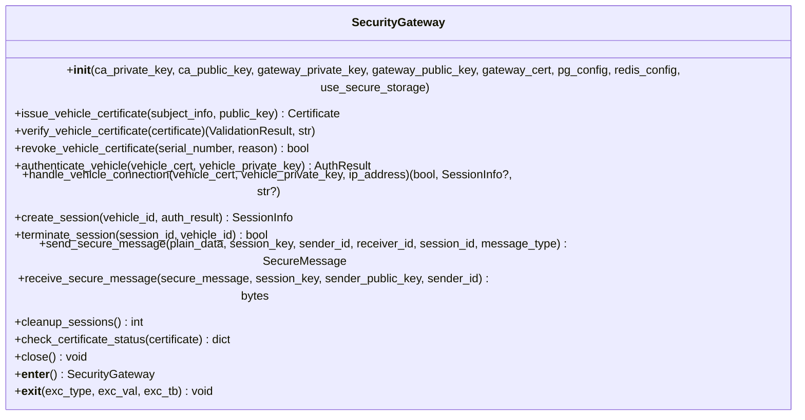
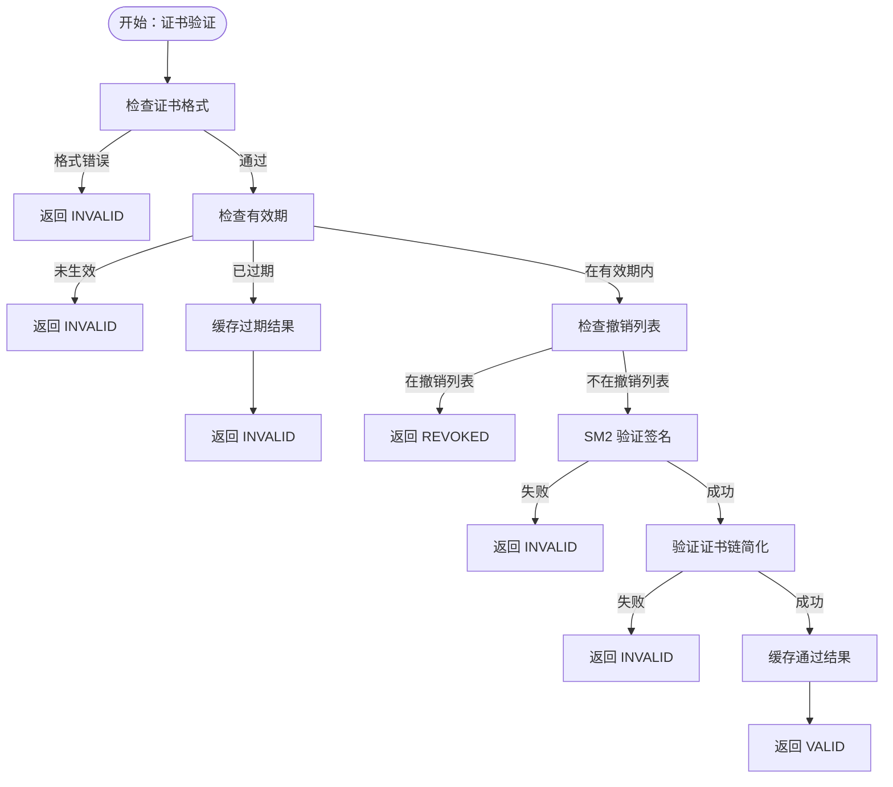
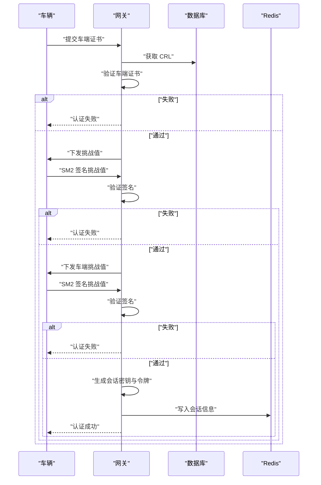
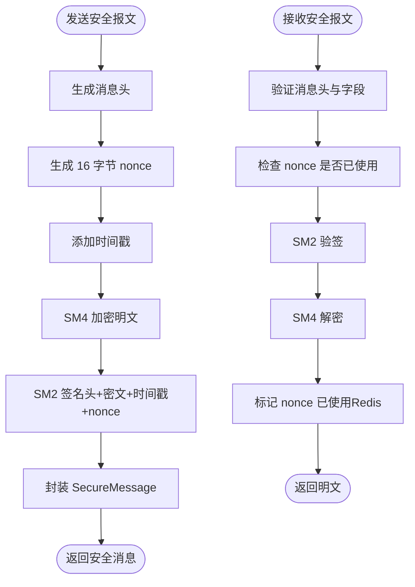
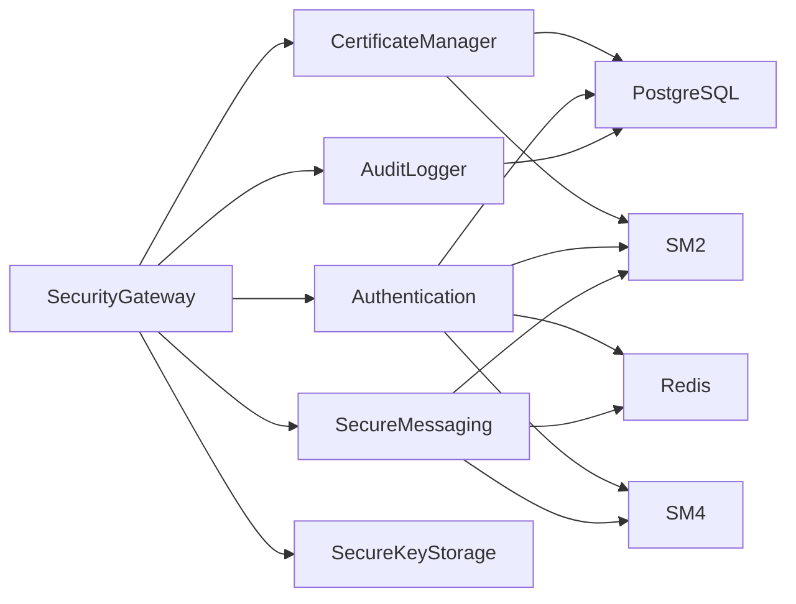

# 核心服务

<cite>
**本文引用的文件**
- [security_gateway.py](file://src/security_gateway.py)
- [certificate_manager.py](file://src/certificate_manager.py)
- [authentication.py](file://src/authentication.py)
- [secure_messaging.py](file://src/secure_messaging.py)
- [audit_logger.py](file://src/audit_logger.py)
- [sm2.py](file://src/crypto/sm2.py)
- [sm4.py](file://src/crypto/sm4.py)
- [postgres.py](file://src/db/postgres.py)
- [certificate.py](file://src/models/certificate.py)
- [session.py](file://src/models/session.py)
- [message.py](file://src/models/message.py)
- [enums.py](file://src/models/enums.py)
- [secure_key_storage.py](file://src/secure_key_storage.py)
</cite>

## 目录
1. [简介](#简介)
2. [项目结构](#项目结构)
3. [核心组件](#核心组件)
4. [架构总览](#架构总览)
5. [详细组件分析](#详细组件分析)
6. [依赖分析](#依赖分析)
7. [性能考量](#性能考量)
8. [故障排查指南](#故障排查指南)
9. [结论](#结论)
10. [附录](#附录)

## 简介
本文件面向车联网安全通信网关的核心服务，系统化阐述 SecurityGateway 主服务的设计与实现，明确其作为“中央协调器”的角色与职责；深入解析证书管理、身份认证、安全消息传输、审计日志等核心模块的功能边界、输入输出、处理流程与错误处理策略；梳理模块间协作机制与通信协议；给出配置要点、性能特性与扩展性建议，并提供可追溯的代码路径以便开发者深入理解系统内部机制。

## 项目结构
- 服务入口与核心编排：src/security_gateway.py
- 安全子系统：
  - 证书管理：src/certificate_manager.py
  - 身份认证：src/authentication.py
  - 安全消息传输：src/secure_messaging.py
  - 审计日志：src/audit_logger.py
  - 密钥安全存储：src/secure_key_storage.py
- 密码学算法封装：
  - SM2 数字签名与验签：src/crypto/sm2.py
  - SM4 对称加密与密钥生成：src/crypto/sm4.py
- 数据模型与枚举：src/models/*
- 数据访问层：
  - PostgreSQL 连接：src/db/postgres.py
  - Redis 客户端（会话与防重放）：src/db/redis_client.py（在相关模块中使用）

**图表来源**
- [security_gateway.py:37-800](file://src/security_gateway.py#L37-L800)
- [certificate_manager.py:1-734](file://src/certificate_manager.py#L1-L734)
- [authentication.py:1-662](file://src/authentication.py#L1-L662)
- [secure_messaging.py:1-249](file://src/secure_messaging.py#L1-L249)
- [audit_logger.py:1-480](file://src/audit_logger.py#L1-L480)
- [sm2.py:1-265](file://src/crypto/sm2.py#L1-L265)
- [sm4.py:1-189](file://src/crypto/sm4.py#L1-L189)
- [postgres.py:1-53](file://src/db/postgres.py#L1-L53)

**章节来源**
- [security_gateway.py:37-800](file://src/security_gateway.py#L37-L800)
- [certificate_manager.py:1-734](file://src/certificate_manager.py#L1-L734)
- [authentication.py:1-662](file://src/authentication.py#L1-L662)
- [secure_messaging.py:1-249](file://src/secure_messaging.py#L1-L249)
- [audit_logger.py:1-480](file://src/audit_logger.py#L1-L480)
- [sm2.py:1-265](file://src/crypto/sm2.py#L1-L265)
- [sm4.py:1-189](file://src/crypto/sm4.py#L1-L189)
- [postgres.py:1-53](file://src/db/postgres.py#L1-L53)

## 核心组件
- SecurityGateway（主协调器）
  - 职责：整合证书管理、身份认证、安全消息传输与审计日志；统一密钥生命周期管理；协调数据库与缓存资源。
  - 关键能力：证书颁发/验证/撤销、双向认证、会话建立/清理、安全消息发送/接收、审计事件记录、密钥安全存储与轮换。
- 证书管理模块
  - 功能：证书颁发、验证、撤销、CRL 获取、证书链与有效期检查。
- 身份认证模块
  - 功能：车云双向认证、挑战/应答、会话建立、会话清理、冲突处理。
- 安全消息传输模块
  - 功能：SM4 加密、SM2 签名、时间戳与 nonce 防重放、消息验证与解密。
- 审计日志模块
  - 功能：认证/数据/证书事件记录、查询、报告导出。
- 安全密钥存储模块
  - 功能：模拟 HSM 的密钥存储、安全清除、自动轮换。

**章节来源**
- [security_gateway.py:37-800](file://src/security_gateway.py#L37-L800)
- [certificate_manager.py:1-734](file://src/certificate_manager.py#L1-L734)
- [authentication.py:1-662](file://src/authentication.py#L1-L662)
- [secure_messaging.py:1-249](file://src/secure_messaging.py#L1-L249)
- [audit_logger.py:1-480](file://src/audit_logger.py#L1-L480)
- [secure_key_storage.py:1-380](file://src/secure_key_storage.py#L1-L380)

## 架构总览
SecurityGateway 作为中央协调器，负责：
- 生命周期管理：初始化密钥存储、数据库与缓存连接，提供上下文管理接口。
- 业务编排：将证书颁发/验证、双向认证、会话管理、安全消息传输与审计日志串联起来。
- 资源控制：统一密钥轮换与安全清除，避免明文密钥驻留内存；通过 Redis 控制会话与防重放。

**图表来源**
- [security_gateway.py:353-438](file://src/security_gateway.py#L353-L438)
- [authentication.py:196-364](file://src/authentication.py#L196-L364)
- [secure_messaging.py:144-249](file://src/secure_messaging.py#L144-L249)
- [audit_logger.py:90-184](file://src/audit_logger.py#L90-L184)
- [certificate_manager.py:206-332](file://src/certificate_manager.py#L206-L332)

**章节来源**
- [security_gateway.py:353-438](file://src/security_gateway.py#L353-L438)
- [authentication.py:196-364](file://src/authentication.py#L196-L364)
- [secure_messaging.py:144-249](file://src/secure_messaging.py#L144-L249)
- [audit_logger.py:90-184](file://src/audit_logger.py#L90-L184)
- [certificate_manager.py:206-332](file://src/certificate_manager.py#L206-L332)

## 详细组件分析

### SecurityGateway 主服务
- 角色定位
  - 中央协调器：聚合证书管理、身份认证、安全消息传输与审计日志。
  - 资源编排：数据库、缓存、密钥存储的统一初始化与生命周期管理。
- 关键方法与职责
  - 证书管理：颁发、验证、撤销、状态检查。
  - 身份认证：双向认证、会话建立/关闭、会话清理。
  - 安全消息：发送/接收，含签名验证、解密、防重放。
  - 审计日志：认证、数据传输、证书操作事件记录。
  - 密钥管理：安全存储、自动轮换、安全清除。
- 输入输出与错误处理
  - 输入：证书、密钥、明文数据、会话密钥、消息对象等。
  - 输出：证书对象、认证结果、会话信息、安全消息、审计日志 ID。
  - 错误处理：捕获异常并记录审计日志，区分业务错误与系统错误，必要时抛出。
- 配置与扩展
  - 支持禁用安全存储（兼容模式），便于测试与开发。
  - 可插拔密钥轮换策略与审计日志导出格式。

**图表来源**
- [security_gateway.py:46-800](file://src/security_gateway.py#L46-L800)

**章节来源**
- [security_gateway.py:46-800](file://src/security_gateway.py#L46-L800)

### 证书管理模块
- 功能清单
  - 证书颁发：生成序列号、构造证书、SM2 签名、入库、审计记录。
  - 证书验证：格式校验、有效期、撤销列表、签名验证、证书链验证。
  - 证书撤销：写入 CRL、审计记录、缓存失效。
  - CRL 获取与证书链、有效期检查。
- 输入输出与复杂度
  - 颁发：输入主体信息、公钥、CA 私钥/公钥、数据库连接；输出证书对象。
  - 验证：输入证书、CA 公钥、CRL 列表；输出验证结果枚举与消息。
  - 复杂度：验证流程包含 O(n) 撤销列表扫描与哈希签名计算。
- 错误处理
  - 参数校验失败抛出值错误；数据库异常转运行时错误；缓存命中/未命中策略降低重复验证成本。

**图表来源**
- [certificate_manager.py:206-332](file://src/certificate_manager.py#L206-L332)

**章节来源**
- [certificate_manager.py:206-332](file://src/certificate_manager.py#L206-L332)

### 身份认证模块
- 功能清单
  - 挑战/应答：生成随机挑战值、SM2 验签。
  - 车云双向认证：车端证书验证、网关证书验证、双方签名挑战、生成认证令牌与会话密钥。
  - 会话管理：建立会话（Redis 存储、会话映射）、关闭会话（安全清除密钥）、清理过期会话、会话冲突处理。
- 输入输出与复杂度
  - 双向认证：输入车端/网关证书、私钥、CA 公钥、数据库连接；输出认证结果（成功包含令牌与会话密钥，失败包含错误码与消息）。
  - 会话建立：输入车辆 ID、认证令牌、Redis 连接；输出会话信息（含会话 ID、密钥、过期时间）。
- 错误处理
  - 证书无效、签名验证失败、令牌过期、会话冲突等场景均有明确错误码与日志记录。

**图表来源**
- [authentication.py:196-364](file://src/authentication.py#L196-L364)

**章节来源**
- [authentication.py:196-364](file://src/authentication.py#L196-L364)

### 安全消息传输模块
- 功能清单
  - 发送：生成 nonce 与时间戳、SM4 加密、SM2 签名、封装安全消息。
  - 接收：验证时间戳与 nonce、SM2 验签、SM4 解密、标记 nonce 已使用。
- 输入输出与复杂度
  - 发送：输入明文数据、会话密钥、发送方私钥、接收方公钥、消息头信息；输出安全消息对象。
  - 接收：输入安全消息、会话密钥、发送方公钥、Redis 配置；输出明文数据。
- 错误处理
  - 时间戳过期、Nonce 已使用、签名验证失败、解密失败等均抛出明确异常并记录审计日志。

**图表来源**
- [secure_messaging.py:17-142](file://src/secure_messaging.py#L17-L142)
- [secure_messaging.py:144-249](file://src/secure_messaging.py#L144-L249)

**章节来源**
- [secure_messaging.py:17-142](file://src/secure_messaging.py#L17-L142)
- [secure_messaging.py:144-249](file://src/secure_messaging.py#L144-L249)

### 审计日志模块
- 功能清单
  - 认证事件、数据传输、证书操作记录；支持查询与报告导出（JSON/CSV）。
- 设计要点
  - 日志 ID 唯一、详情截断、持久化失败不阻断主流程。
- 使用模式
  - 在各业务流程关键节点调用相应记录方法，保证事件完整性与可追溯性。

**章节来源**
- [audit_logger.py:90-184](file://src/audit_logger.py#L90-L184)
- [audit_logger.py:243-371](file://src/audit_logger.py#L243-L371)

### 安全密钥存储模块
- 功能清单
  - CA 私钥/会话密钥存储、检索、安全清除、自动轮换。
- 设计要点
  - 模拟 HSM 存储，避免明文密钥常驻内存；后台线程周期轮换密钥。
- 使用模式
  - 在证书颁发/会话建立时存储密钥，在会话关闭/服务关闭时安全清除。

**章节来源**
- [secure_key_storage.py:27-380](file://src/secure_key_storage.py#L27-L380)

## 依赖分析
- 组件耦合
  - SecurityGateway 对各子模块存在高层依赖，但通过接口清晰（方法签名）降低耦合。
  - 密码学模块独立，仅暴露签名/验签与加解密接口。
  - 数据访问层通过连接对象注入，便于替换与测试。
- 外部依赖
  - PostgreSQL 与 Redis 作为基础设施；gmssl 提供 SM2/SM4 实现。
- 潜在风险
  - 数据库/缓存连接异常需纳入统一错误处理与审计。
  - 密钥轮换线程需健壮性保障，避免阻塞主线程。

**图表来源**
- [security_gateway.py:8-34](file://src/security_gateway.py#L8-L34)
- [certificate_manager.py:13-17](file://src/certificate_manager.py#L13-L17)
- [authentication.py:14-20](file://src/authentication.py#L14-L20)
- [secure_messaging.py:11-14](file://src/secure_messaging.py#L11-L14)
- [audit_logger.py:22-23](file://src/audit_logger.py#L22-L23)
- [postgres.py:1-7](file://src/db/postgres.py#L1-L7)

**章节来源**
- [security_gateway.py:8-34](file://src/security_gateway.py#L8-L34)
- [certificate_manager.py:13-17](file://src/certificate_manager.py#L13-L17)
- [authentication.py:14-20](file://src/authentication.py#L14-L20)
- [secure_messaging.py:11-14](file://src/secure_messaging.py#L11-L14)
- [audit_logger.py:22-23](file://src/audit_logger.py#L22-L23)
- [postgres.py:1-7](file://src/db/postgres.py#L1-L7)

## 性能考量
- 证书验证缓存
  - 使用 LRU 缓存提升验证性能，缓存键为证书序列号，TTL 与失效策略需结合业务调整。
- 会话与防重放
  - Redis 存储会话信息与 nonce 标记，建议监控键空间与过期策略，避免内存压力。
- 密钥轮换
  - 自动轮换线程每小时检查一次，建议在低峰时段执行，避免频繁密钥生成开销。
- 数据库与网络
  - PostgreSQL 连接池与超时配置需结合吞吐量评估；网络抖动下建议增加重试与熔断策略。

[本节为通用指导，无需特定文件引用]

## 故障排查指南
- 证书相关
  - 验证失败：检查证书有效期、撤销列表、签名算法与公钥匹配；若数据库异常，考虑 CA 服务不可用场景。
  - 颁发失败：确认 CA 私钥长度与安全存储状态；查看审计日志中的失败详情。
- 认证相关
  - 双向认证失败：检查挑战/应答流程、私钥与证书匹配、令牌过期；关注会话冲突处理策略。
  - 会话清理：确认 Redis TTL 机制与主动清理策略；核对会话映射键。
- 消息传输
  - 签名验证失败/重放攻击：检查 nonce 标记、时间戳容差、签名公钥；定位消息头与载荷拼接顺序。
  - 解密失败：核对会话密钥、密钥长度与 SM4 模式；检查填充验证。
- 审计日志
  - 记录失败：确认数据库连接与权限；导出报告时注意时间范围与格式参数。
- 密钥安全
  - 密钥轮换失败：检查轮换线程状态与密钥类型；确认安全清除是否执行。

**章节来源**
- [certificate_manager.py:206-332](file://src/certificate_manager.py#L206-L332)
- [authentication.py:554-662](file://src/authentication.py#L554-L662)
- [secure_messaging.py:144-249](file://src/secure_messaging.py#L144-L249)
- [audit_logger.py:58-89](file://src/audit_logger.py#L58-L89)
- [secure_key_storage.py:234-314](file://src/secure_key_storage.py#L234-L314)

## 结论
SecurityGateway 将证书管理、身份认证、安全消息传输与审计日志有机整合，形成闭环的安全通信体系。通过安全密钥存储与自动轮换机制，降低密钥泄露风险；通过 Redis 与 PostgreSQL 的协同，兼顾实时性与持久化。建议在生产环境中完善监控与告警、优化缓存策略与数据库连接池、加强密钥轮换与审计日志的合规性检查，持续提升系统的安全性与稳定性。

[本节为总结性内容，无需特定文件引用]

## 附录
- 数据模型与枚举
  - 证书、会话、消息、事件类型与错误码等模型定义，确保跨模块一致性。
- 使用模式参考
  - 证书颁发：[issue_vehicle_certificate:129-181](file://src/security_gateway.py#L129-L181)
  - 车辆接入：[handle_vehicle_connection:353-438](file://src/security_gateway.py#L353-L438)
  - 发送安全消息：[send_secure_message:543-602](file://src/security_gateway.py#L543-L602)
  - 接收安全消息：[receive_secure_message:603-721](file://src/security_gateway.py#L603-L721)
  - 认证与会话：[mutual_authentication:196-364](file://src/authentication.py#L196-L364)、[establish_session:366-481](file://src/authentication.py#L366-L481)
  - 证书验证：[verify_certificate:206-332](file://src/certificate_manager.py#L206-L332)
  - 审计记录：[log_auth_event:90-136](file://src/audit_logger.py#L90-L136)、[log_data_transfer:137-184](file://src/audit_logger.py#L137-L184)、[log_certificate_operation:185-242](file://src/audit_logger.py#L185-L242)

**章节来源**
- [models/*:1-108](file://src/models/certificate.py#L1-L108)
- [models/session.py:1-104](file://src/models/session.py#L1-L104)
- [models/message.py:1-200](file://src/models/message.py#L1-L200)
- [models/enums.py:1-56](file://src/models/enums.py#L1-L56)
- [security_gateway.py:129-181](file://src/security_gateway.py#L129-L181)
- [security_gateway.py:353-438](file://src/security_gateway.py#L353-L438)
- [security_gateway.py:543-602](file://src/security_gateway.py#L543-L602)
- [security_gateway.py:603-721](file://src/security_gateway.py#L603-L721)
- [authentication.py:196-364](file://src/authentication.py#L196-L364)
- [authentication.py:366-481](file://src/authentication.py#L366-L481)
- [certificate_manager.py:206-332](file://src/certificate_manager.py#L206-L332)
- [audit_logger.py:90-136](file://src/audit_logger.py#L90-L136)
- [audit_logger.py:137-184](file://src/audit_logger.py#L137-L184)
- [audit_logger.py:185-242](file://src/audit_logger.py#L185-L242)